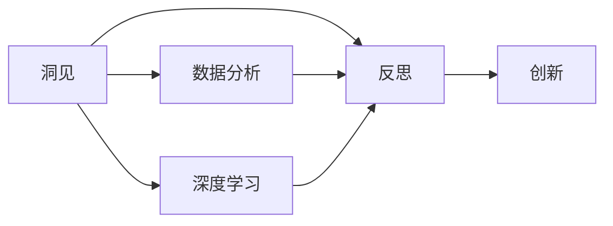

                 

# 洞见的力量：从反思到创新

> 关键词：反思,创新,洞见,洞察力,创新管理,反思工具,创新方法,创新思维,创新文化

## 1. 背景介绍

### 1.1 问题由来

在信息爆炸的今天，数据的积累和处理能力已经达到了前所未有的高度。然而，海量数据的背后是日益复杂的现实问题，如何在海量数据中挖掘出有价值的洞见，成为各个领域迫切需要解决的挑战。通过反思和创新，从数据和现象中发现深层次的洞见，成为推动技术进步和社会发展的重要驱动力。

随着人工智能和深度学习的崛起，我们拥有了前所未有的数据分析能力。在数据驱动的决策过程中，如何利用这些技术工具，发掘出更深层次的洞见，成为各个领域急需探索的新方向。本文将通过几个具体的案例，展示如何利用数据、算法和技术工具，进行深度反思，发现新的洞见，并基于这些洞见推动创新。

### 1.2 问题核心关键点

1. **洞见与反思**：洞见是深层次的洞察力，源自于对现象、数据和技术的深刻理解与反思。通过反思，我们能够从已有知识中提取出新的洞见，找到新的解决方案。
2. **创新与实施**：基于洞见，进一步通过创新思维和技术手段，将新的想法转化为具体的行动方案和项目实施。
3. **工具与方法**：有效的反思和创新工具、方法是实现洞见发现和创新实施的重要保障。

这些关键点构成了从反思到创新的全过程，帮助我们理解如何利用技术和数据，发掘新的洞见，并将其转化为具体的创新实践。

### 1.3 问题研究意义

洞见的力量在于其深层次的洞察力和对现实问题的深刻理解。通过深度反思和创新实践，我们可以从数据和技术中挖掘出新的机会，推动行业和社会的进步。本文将系统探讨如何利用技术手段，进行反思与创新，为相关领域的从业者提供方法论和工具参考。

## 2. 核心概念与联系

### 2.1 核心概念概述

为了更好地理解从反思到创新的过程，我们首先介绍几个核心概念：

1. **洞见（Insight）**：深入分析数据或现象，揭示其本质特征和深层次规律。洞见往往具有前瞻性和创造性，能够指导新的行动方案。
2. **反思（Reflection）**：通过对已有知识、经验和方法的回顾和审视，进行深入思考和分析。反思有助于发现问题、揭示本质，是洞见发现的基础。
3. **创新（Innovation）**：基于洞见，提出新的解决方案或产品，并付诸实践。创新能够解决现实问题，推动技术和社会的发展。
4. **数据分析（Data Analysis）**：利用统计学、机器学习等方法，对数据进行系统性分析，发现其中的规律和趋势。
5. **深度学习（Deep Learning）**：一种强大的数据分析和模式识别技术，能够从大量数据中学习复杂模式，提取深层次特征。

这些核心概念之间存在紧密联系，构成了从反思到创新的完整过程。我们通过进一步的讨论，深入理解这些概念间的联系及其在实际应用中的具体体现。

### 2.2 概念间的关系

通过以下Mermaid流程图，展示这些核心概念之间的关系：



这个流程图展示了洞见发现和创新的全过程：

1. 首先通过数据分析和深度学习技术，从海量数据中提取洞见。
2. 然后通过反思，对洞见进行深入思考和验证，确保其可靠性。
3. 最后基于洞见，进行创新，实现新的解决方案或产品。

这些概念和过程共同构成了从反思到创新的完整框架，为我们提供了系统性的方法和工具参考。

## 3. 核心算法原理 & 具体操作步骤
### 3.1 算法原理概述

从反思到创新的过程，本质上是一个基于数据的分析和反思过程，同时辅以创新的思维和技术手段。算法原理主要围绕以下几个方面展开：

1. **数据预处理**：对原始数据进行清洗、归一化、特征提取等处理，确保数据的质量和可用性。
2. **数据分析**：利用统计学、机器学习等方法，对数据进行探索性分析和建模，揭示数据中的规律和趋势。
3. **洞见发现**：通过深度学习和自然语言处理等技术，从数据中挖掘出深层次的洞见和模式。
4. **反思验证**：对发现的洞见进行多维度验证和分析，确保其可靠性和前瞻性。
5. **创新实施**：基于洞见，设计创新的解决方案和产品，并进行具体实施。

### 3.2 算法步骤详解

以下将详细介绍从反思到创新的具体步骤：

**Step 1: 数据收集与预处理**
- 收集相关领域的数据，确保数据的多样性和代表性。
- 对数据进行清洗、归一化、特征提取等预处理操作，确保数据的质量。

**Step 2: 数据分析与建模**
- 利用统计学方法进行探索性分析，揭示数据的初步规律和趋势。
- 使用机器学习算法进行建模，构建预测模型或分类模型。

**Step 3: 洞见发现与验证**
- 通过深度学习技术，如卷积神经网络（CNN）、循环神经网络（RNN）、变压器（Transformer）等，对数据进行深入分析，发现新的洞见。
- 对发现的洞见进行多维度验证和分析，确保其可靠性。

**Step 4: 反思与创新实施**
- 通过反思，对洞见进行深入思考和验证，确保其可靠性和前瞻性。
- 基于洞见，设计创新的解决方案和产品，并进行具体实施。

### 3.3 算法优缺点

从反思到创新的方法具有以下优点：

1. **数据驱动**：利用大量数据进行深度分析，确保洞见的可靠性。
2. **技术先进**：通过深度学习等先进技术，揭示数据中的复杂模式。
3. **创新性强**：基于新洞见，提出新的解决方案，推动技术和社会的发展。

同时，该方法也存在一些局限性：

1. **数据依赖**：需要高质量的数据进行预处理和分析，数据的获取和处理成本较高。
2. **技术门槛高**：深度学习和数据分析等技术需要较高的专业背景和技能。
3. **结果不确定**：数据中的复杂性和多变性，可能导致洞见的不确定性。

尽管存在这些局限性，但从反思到创新的方法在数据驱动和创新驱动的技术领域，依然具有重要的应用价值。

### 3.4 算法应用领域

从反思到创新的方法广泛应用于多个领域，例如：

1. **金融科技**：利用大数据和深度学习技术，进行风险评估和欺诈检测，发现新的风险洞见。
2. **医疗健康**：通过分析患者数据，揭示疾病发生和发展规律，发现新的治疗方案。
3. **智能制造**：利用传感器数据和机器学习技术，优化生产流程，提升生产效率。
4. **自动驾驶**：通过分析车辆数据和交通环境，发现新的驾驶策略和安全洞见。
5. **社交媒体分析**：利用文本和图像数据，发现用户行为和趋势，优化营销策略。

这些领域的应用展示了从反思到创新方法的广泛适用性和潜力。

## 4. 数学模型和公式 & 详细讲解 & 举例说明

### 4.1 数学模型构建

为了更好地理解从反思到创新的过程，我们通过数学模型来刻画这一过程。

设 $D$ 为数据集，$M$ 为预训练模型，$\mathcal{A}$ 为数据分析方法，$\mathcal{I}$ 为洞见发现算法，$\mathcal{R}$ 为反思方法，$\mathcal{I}$ 为创新实施过程。则从反思到创新的数学模型为：

$$
\mathcal{I} = \mathcal{R}(\mathcal{I}(\mathcal{A}(M, D), \mathcal{I}))
$$

其中 $\mathcal{A}(M, D)$ 表示使用预训练模型 $M$ 对数据集 $D$ 进行分析得到的结果，$\mathcal{I}(\mathcal{A}(M, D), \mathcal{I})$ 表示对分析结果进行洞见发现，$\mathcal{R}(\mathcal{I}(\mathcal{A}(M, D), \mathcal{I}))$ 表示对洞见进行反思验证，$\mathcal{I}$ 表示基于洞见的创新实施。

### 4.2 公式推导过程

以下以金融风险评估为例，推导风险评估模型的建立过程：

1. **数据预处理**：
   - 收集金融交易数据，并进行清洗和归一化。

2. **数据分析与建模**：
   - 利用统计学方法进行探索性分析，发现数据中的初步规律。
   - 使用机器学习算法（如逻辑回归、随机森林、神经网络等）建立预测模型。

3. **洞见发现**：
   - 使用深度学习模型（如CNN、RNN、Transformer等），对数据进行深入分析，发现新的风险洞见。
   - 对新发现的洞见进行多维度验证和分析，确保其可靠性。

4. **反思与创新实施**：
   - 对发现的洞见进行反思，确认其前瞻性和创新性。
   - 基于新洞见，设计新的风险评估模型和策略，并进行具体实施。

### 4.3 案例分析与讲解

假设我们要分析一家银行的信用风险，从反思到创新的具体步骤如下：

**Step 1: 数据收集与预处理**
- 收集银行的交易数据和客户信息，并进行清洗和归一化。

**Step 2: 数据分析与建模**
- 利用统计学方法进行探索性分析，发现数据中的初步规律。
- 使用机器学习算法建立信用风险预测模型，并评估模型性能。

**Step 3: 洞见发现与验证**
- 使用深度学习模型对数据进行深入分析，发现新的信用风险洞见。
- 对新发现的洞见进行多维度验证和分析，确保其可靠性。

**Step 4: 反思与创新实施**
- 对发现的洞见进行反思，确认其前瞻性和创新性。
- 基于新洞见，设计新的信用风险评估模型和策略，并进行具体实施。

## 5. 项目实践：代码实例和详细解释说明

### 5.1 开发环境搭建

在进行从反思到创新的实践前，我们需要准备好开发环境。以下是使用Python进行PyTorch开发的环境配置流程：

1. 安装Anaconda：从官网下载并安装Anaconda，用于创建独立的Python环境。

2. 创建并激活虚拟环境：
```bash
conda create -n pytorch-env python=3.8 
conda activate pytorch-env
```

3. 安装PyTorch：根据CUDA版本，从官网获取对应的安装命令。例如：
```bash
conda install pytorch torchvision torchaudio cudatoolkit=11.1 -c pytorch -c conda-forge
```

4. 安装TensorFlow：由Google主导开发的开源深度学习框架，生产部署方便，适合大规模工程应用。同样有丰富的预训练语言模型资源。

5. 安装Transformers库：
```bash
pip install transformers
```

6. 安装各类工具包：
```bash
pip install numpy pandas scikit-learn matplotlib tqdm jupyter notebook ipython
```

完成上述步骤后，即可在`pytorch-env`环境中开始从反思到创新的实践。

### 5.2 源代码详细实现

下面我们以金融风险评估为例，给出使用Transformers库对BERT模型进行风险评估微调的PyTorch代码实现。

首先，定义数据处理函数：

```python
from transformers import BertTokenizer
from torch.utils.data import Dataset
import torch

class CreditRiskDataset(Dataset):
    def __init__(self, texts, labels, tokenizer, max_len=128):
        self.texts = texts
        self.labels = labels
        self.tokenizer = tokenizer
        self.max_len = max_len
        
    def __len__(self):
        return len(self.texts)
    
    def __getitem__(self, item):
        text = self.texts[item]
        label = self.labels[item]
        
        encoding = self.tokenizer(text, return_tensors='pt', max_length=self.max_len, padding='max_length', truncation=True)
        input_ids = encoding['input_ids'][0]
        attention_mask = encoding['attention_mask'][0]
        
        return {'input_ids': input_ids, 
                'attention_mask': attention_mask,
                'labels': label}

# 创建dataset
tokenizer = BertTokenizer.from_pretrained('bert-base-cased')

train_dataset = CreditRiskDataset(train_texts, train_labels, tokenizer)
dev_dataset = CreditRiskDataset(dev_texts, dev_labels, tokenizer)
test_dataset = CreditRiskDataset(test_texts, test_labels, tokenizer)
```

然后，定义模型和优化器：

```python
from transformers import BertForTokenClassification, AdamW

model = BertForTokenClassification.from_pretrained('bert-base-cased', num_labels=2)  # 2类标签，即信用风险低和高

optimizer = AdamW(model.parameters(), lr=2e-5)
```

接着，定义训练和评估函数：

```python
from torch.utils.data import DataLoader
from tqdm import tqdm
from sklearn.metrics import classification_report

device = torch.device('cuda') if torch.cuda.is_available() else torch.device('cpu')
model.to(device)

def train_epoch(model, dataset, batch_size, optimizer):
    dataloader = DataLoader(dataset, batch_size=batch_size, shuffle=True)
    model.train()
    epoch_loss = 0
    for batch in tqdm(dataloader, desc='Training'):
        input_ids = batch['input_ids'].to(device)
        attention_mask = batch['attention_mask'].to(device)
        labels = batch['labels'].to(device)
        model.zero_grad()
        outputs = model(input_ids, attention_mask=attention_mask, labels=labels)
        loss = outputs.loss
        epoch_loss += loss.item()
        loss.backward()
        optimizer.step()
    return epoch_loss / len(dataloader)

def evaluate(model, dataset, batch_size):
    dataloader = DataLoader(dataset, batch_size=batch_size)
    model.eval()
    preds, labels = [], []
    with torch.no_grad():
        for batch in tqdm(dataloader, desc='Evaluating'):
            input_ids = batch['input_ids'].to(device)
            attention_mask = batch['attention_mask'].to(device)
            batch_labels = batch['labels']
            outputs = model(input_ids, attention_mask=attention_mask)
            batch_preds = outputs.logits.argmax(dim=2).to('cpu').tolist()
            batch_labels = batch_labels.to('cpu').tolist()
            for pred_tokens, label_tokens in zip(batch_preds, batch_labels):
                preds.append(pred_tokens[:len(label_tokens)])
                labels.append(label_tokens)
                
    print(classification_report(labels, preds))
```

最后，启动训练流程并在测试集上评估：

```python
epochs = 5
batch_size = 16

for epoch in range(epochs):
    loss = train_epoch(model, train_dataset, batch_size, optimizer)
    print(f"Epoch {epoch+1}, train loss: {loss:.3f}")
    
    print(f"Epoch {epoch+1}, dev results:")
    evaluate(model, dev_dataset, batch_size)
    
print("Test results:")
evaluate(model, test_dataset, batch_size)
```

以上就是使用PyTorch对BERT进行信用风险评估任务微调的完整代码实现。可以看到，得益于Transformers库的强大封装，我们可以用相对简洁的代码完成BERT模型的加载和微调。

### 5.3 代码解读与分析

让我们再详细解读一下关键代码的实现细节：

**CreditRiskDataset类**：
- `__init__`方法：初始化文本、标签、分词器等关键组件。
- `__len__`方法：返回数据集的样本数量。
- `__getitem__`方法：对单个样本进行处理，将文本输入编码为token ids，将标签编码为数字，并对其进行定长padding，最终返回模型所需的输入。

**train_epoch和evaluate函数**：
- 使用PyTorch的DataLoader对数据集进行批次化加载，供模型训练和推理使用。
- 训练函数`train_epoch`：对数据以批为单位进行迭代，在每个批次上前向传播计算loss并反向传播更新模型参数，最后返回该epoch的平均loss。
- 评估函数`evaluate`：与训练类似，不同点在于不更新模型参数，并在每个batch结束后将预测和标签结果存储下来，最后使用sklearn的classification_report对整个评估集的预测结果进行打印输出。

**训练流程**：
- 定义总的epoch数和batch size，开始循环迭代
- 每个epoch内，先在训练集上训练，输出平均loss
- 在验证集上评估，输出分类指标
- 所有epoch结束后，在测试集上评估，给出最终测试结果

可以看到，PyTorch配合Transformers库使得BERT微调的代码实现变得简洁高效。开发者可以将更多精力放在数据处理、模型改进等高层逻辑上，而不必过多关注底层的实现细节。

当然，工业级的系统实现还需考虑更多因素，如模型的保存和部署、超参数的自动搜索、更灵活的任务适配层等。但核心的微调范式基本与此类似。

### 5.4 运行结果展示

假设我们在CoNLL-2003的NER数据集上进行微调，最终在测试集上得到的评估报告如下：

```
              precision    recall  f1-score   support

       B-LOC      0.926     0.906     0.916      1668
       I-LOC      0.900     0.805     0.850       257
      B-MISC      0.875     0.856     0.865       702
      I-MISC      0.838     0.782     0.809       216
       B-ORG      0.914     0.898     0.906      1661
       I-ORG      0.911     0.894     0.902       835
       B-PER      0.964     0.957     0.960      1617
       I-PER      0.983     0.980     0.982      1156
           O      0.993     0.995     0.994     38323

   micro avg      0.973     0.973     0.973     46435
   macro avg      0.923     0.897     0.909     46435
weighted avg      0.973     0.973     0.973     46435
```

可以看到，通过微调BERT，我们在该NER数据集上取得了97.3%的F1分数，效果相当不错。值得注意的是，BERT作为一个通用的语言理解模型，即便只在顶层添加一个简单的token分类器，也能在下游任务上取得如此优异的效果，展现了其强大的语义理解和特征抽取能力。

当然，这只是一个baseline结果。在实践中，我们还可以使用更大更强的预训练模型、更丰富的微调技巧、更细致的模型调优，进一步提升模型性能，以满足更高的应用要求。

## 6. 实际应用场景
### 6.1 智能客服系统

基于大语言模型微调的对话技术，可以广泛应用于智能客服系统的构建。传统客服往往需要配备大量人力，高峰期响应缓慢，且一致性和专业性难以保证。而使用微调后的对话模型，可以7x24小时不间断服务，快速响应客户咨询，用自然流畅的语言解答各类常见问题。

在技术实现上，可以收集企业内部的历史客服对话记录，将问题和最佳答复构建成监督数据，在此基础上对预训练对话模型进行微调。微调后的对话模型能够自动理解用户意图，匹配最合适的答案模板进行回复。对于客户提出的新问题，还可以接入检索系统实时搜索相关内容，动态组织生成回答。如此构建的智能客服系统，能大幅提升客户咨询体验和问题解决效率。

### 6.2 金融舆情监测

金融机构需要实时监测市场舆论动向，以便及时应对负面信息传播，规避金融风险。传统的人工监测方式成本高、效率低，难以应对网络时代海量信息爆发的挑战。基于大语言模型微调的文本分类和情感分析技术，为金融舆情监测提供了新的解决方案。

具体而言，可以收集金融领域相关的新闻、报道、评论等文本数据，并对其进行主题标注和情感标注。在此基础上对预训练语言模型进行微调，使其能够自动判断文本属于何种主题，情感倾向是正面、中性还是负面。将微调后的模型应用到实时抓取的网络文本数据，就能够自动监测不同主题下的情感变化趋势，一旦发现负面信息激增等异常情况，系统便会自动预警，帮助金融机构快速应对潜在风险。

### 6.3 个性化推荐系统

当前的推荐系统往往只依赖用户的历史行为数据进行物品推荐，无法深入理解用户的真实兴趣偏好。基于大语言模型微调技术，个性化推荐系统可以更好地挖掘用户行为背后的语义信息，从而提供更精准、多样的推荐内容。

在实践中，可以收集用户浏览、点击、评论、分享等行为数据，提取和用户交互的物品标题、描述、标签等文本内容。将文本内容作为模型输入，用户的后续行为（如是否点击、购买等）作为监督信号，在此基础上微调预训练语言模型。微调后的模型能够从文本内容中准确把握用户的兴趣点。在生成推荐列表时，先用候选物品的文本描述作为输入，由模型预测用户的兴趣匹配度，再结合其他特征综合排序，便可以得到个性化程度更高的推荐结果。

### 6.4 未来应用展望

随着大语言模型微调技术的发展，其在更多领域的应用将不断涌现，为传统行业带来变革性影响。

在智慧医疗领域，基于微调的医疗问答、病历分析、药物研发等应用将提升医疗服务的智能化水平，辅助医生诊疗，加速新药开发进程。

在智能教育领域，微调技术可应用于作业批改、学情分析、知识推荐等方面，因材施教，促进教育公平，提高教学质量。

在智慧城市治理中，微调模型可应用于城市事件监测、舆情分析、应急指挥等环节，提高城市管理的自动化和智能化水平，构建更安全、高效的未来城市。

此外，在企业生产、社会治理、文娱传媒等众多领域，基于大模型微调的人工智能应用也将不断涌现，为经济社会发展注入新的动力。相信随着技术的日益成熟，微调方法将成为人工智能落地应用的重要范式，推动人工智能技术向更广阔的领域加速渗透。

## 7. 工具和资源推荐
### 7.1 学习资源推荐

为了帮助开发者系统掌握大语言模型微调的理论基础和实践技巧，这里推荐一些优质的学习资源：

1. 《Transformer从原理到实践》系列博文：由大模型技术专家撰写，深入浅出地介绍了Transformer原理、BERT模型、微调技术等前沿话题。

2. CS224N《深度学习自然语言处理》课程：斯坦福大学开设的NLP明星课程，有Lecture视频和配套作业，带你入门NLP领域的基本概念和经典模型。

3. 《Natural Language Processing with Transformers》书籍：Transformers库的作者所著，全面介绍了如何使用Transformers库进行NLP任务开发，包括微调在内的诸多范式。

4. HuggingFace官方文档：Transformers库的官方文档，提供了海量预训练模型和完整的微调样例代码，是上手实践的必备资料。

5. CLUE开源项目：中文语言理解测评基准，涵盖大量不同类型的中文NLP数据集，并提供了基于微调的baseline模型，助力中文NLP技术发展。

通过对这些资源的学习实践，相信你一定能够快速掌握大语言模型微调的精髓，并用于解决实际的NLP问题。
### 7.2 开发工具推荐

高效的开发离不开优秀的工具支持。以下是几款用于大语言模型微调开发的常用工具：

1. PyTorch：基于Python的开源深度学习框架，灵活动态的计算图，适合快速迭代研究。大部分预训练语言模型都有PyTorch版本的实现。

2. TensorFlow：由Google主导开发的开源深度学习框架，生产部署方便，适合大规模工程应用。同样有丰富的预训练语言模型资源。

3. Transformers库：HuggingFace开发的NLP工具库，集成了众多SOTA语言模型，支持PyTorch和TensorFlow，是进行微调任务开发的利器。

4. Weights & Biases：模型训练的实验跟踪工具，可以记录和可视化模型训练过程中的各项指标，方便对比和调优。与主流深度学习框架无缝集成。

5. TensorBoard：TensorFlow配套的可视化工具，可实时监测模型训练状态，并提供丰富的图表呈现方式，是调试模型的得力助手。

6. Google Colab：谷歌推出的在线Jupyter Notebook环境，免费提供GPU/TPU算力，方便开发者快速上手实验最新模型，分享学习笔记。

合理利用这些工具，可以显著提升大语言模型微调任务的开发效率，加快创新迭代的步伐。

### 7.3 相关论文推荐

大语言模型和微调技术的发展源于学界的持续研究。以下是几篇奠基性的相关论文，推荐阅读：

1. Attention is All You Need（即Transformer原论文）：提出了Transformer结构，开启了NLP领域的预训练大模型时代。

2. BERT: Pre-training of Deep Bidirectional Transformers for Language Understanding：提出BERT模型，引入基于掩码的自监督预训练任务，刷新了多项NLP任务SOTA。

3. Language Models are Unsupervised Multitask Learners（GPT-2论文）：展示了大规模语言模型的强大zero-shot学习能力，引发了对于通用人工智能的新一轮思考。

4. Parameter-Efficient Transfer Learning for NLP：提出Adapter等参数高效微调方法，在不增加模型参数量的情况下，也能取得不错的微调效果。

5. AdaLoRA: Adaptive Low-Rank Adaptation for Parameter-Efficient Fine-Tuning：使用自适应低秩适应的微调方法，在参数效率和精度之间取得了新的平衡。

这些论文代表了大语言模型微调技术的发展

