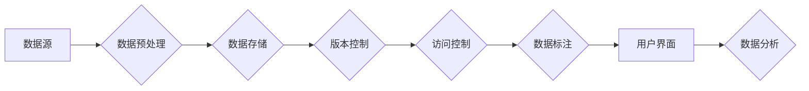

# 软件 2.0 的 Github：数据集共享平台

> 关键词：软件 2.0，数据集共享，开源，版本控制，机器学习，人工智能

## 1. 背景介绍
### 1.1 软件发展历程

从计算机程序的诞生到今天，软件行业经历了多次重大变革。从最初的机器语言编程到高级编程语言，再到如今的软件工程和敏捷开发，软件开发的模式和方法不断进化。近年来，随着互联网的普及和云计算技术的发展，软件行业进入了软件 2.0 时代。

软件 2.0 时代的特点是：

- 开放性：软件的开放性体现在代码、数据、工具和服务的开放共享。
- 模块化：软件组件的模块化设计，使得软件的构建和扩展更加灵活。
- 服务化：软件以服务的形式提供，用户可以根据需求按需定制和使用。
- 数据驱动：软件的功能和用户体验越来越依赖于用户数据的分析和利用。

### 1.2 数据集共享的兴起

数据集共享是软件 2.0 时代的一个重要特征。随着机器学习和人工智能技术的快速发展，高质量的数据集成为了推动技术创新的关键。数据集共享平台应运而生，为研究人员和开发者提供了丰富的数据资源。

### 1.3 本文结构

本文将探讨数据集共享平台的设计与实现，分析其核心概念、算法原理、操作步骤、实际应用场景以及未来发展趋势。文章结构如下：

- 第2章介绍数据集共享平台的核心概念和架构。
- 第3章阐述数据集共享平台的算法原理和具体操作步骤。
- 第4章讲解数据集共享平台的数学模型和公式。
- 第5章展示数据集共享平台的代码实例和详细解释。
- 第6章分析数据集共享平台在实际应用场景中的应用。
- 第7章展望数据集共享平台的未来发展趋势和挑战。
- 第8章总结全文，并对研究展望。

## 2. 核心概念与联系
### 2.1 数据集共享平台的核心概念

数据集共享平台的核心概念包括：

- 数据集：指用于机器学习和人工智能研究的数据集合。
- 版本控制：对数据集的版本进行管理，包括创建、更新、回滚等操作。
- 访问控制：控制数据集的访问权限，确保数据安全。
- 数据质量：保证数据集的准确性、完整性和可靠性。
- 数据标注：对数据集进行标注，以便模型训练和评估。

### 2.2 数据集共享平台的架构

数据集共享平台的架构如下：



数据从数据源进入平台，经过预处理后存储在数据存储系统中。数据存储系统与版本控制系统相连，实现对数据版本的管理。访问控制模块用于控制数据访问权限，数据标注模块对数据进行标注，用户界面模块为用户提供交互界面，数据分析模块提供数据分析工具。

## 3. 核心算法原理 & 具体操作步骤
### 3.1 算法原理概述

数据集共享平台的核心算法包括：

- 数据预处理算法：对原始数据进行清洗、转换、归一化等操作。
- 版本控制算法：实现数据版本的创建、更新、回滚等功能。
- 访问控制算法：根据用户权限控制数据访问。
- 数据标注算法：对数据进行标注，包括分类、标注、标注一致性检查等。

### 3.2 算法步骤详解

**数据预处理算法**：

1. 数据清洗：去除重复、错误、缺失的数据。
2. 数据转换：将数据转换为模型需要的格式。
3. 数据归一化：将数据归一化到[0,1]或[-1,1]区间。

**版本控制算法**：

1. 创建版本：创建新的数据版本，记录版本信息。
2. 更新版本：更新数据版本，记录更新信息。
3. 回滚版本：回滚到指定版本，撤销更新。

**访问控制算法**：

1. 权限检查：检查用户访问数据集的权限。
2. 访问授权：授权用户访问数据集。
3. 访问记录：记录用户访问数据集的行为。

**数据标注算法**：

1. 分类：对文本数据进行分类标注。
2. 标注：对图像数据进行标注。
3. 标注一致性检查：检查标注的一致性。

### 3.3 算法优缺点

数据集共享平台的算法具有以下优点：

- 提高数据质量：通过数据预处理算法，提高数据集的准确性和可靠性。
- 保证数据安全：通过访问控制算法，保证数据安全。
- 提高数据利用率：通过数据标注算法，提高数据利用率。

数据集共享平台的算法也存在以下缺点：

- 复杂性：算法设计较为复杂，需要一定的技术基础。
- 性能：数据预处理、版本控制和访问控制等操作可能影响平台性能。

### 3.4 算法应用领域

数据集共享平台的算法在以下领域具有广泛的应用：

- 机器学习和人工智能：提供高质量的数据集，促进机器学习和人工智能技术的发展。
- 自然语言处理：提供丰富的文本数据集，推动自然语言处理技术的研究和应用。
- 计算机视觉：提供丰富的图像和视频数据集，推动计算机视觉技术的发展。
- 数据挖掘：提供大量的数据集，促进数据挖掘技术的应用。

## 4. 数学模型和公式 & 详细讲解 & 举例说明
### 4.1 数学模型构建

数据集共享平台的数学模型包括：

- 数据预处理模型：对数据进行清洗、转换、归一化等操作。
- 版本控制模型：实现数据版本的创建、更新、回滚等功能。
- 访问控制模型：根据用户权限控制数据访问。
- 数据标注模型：对数据进行标注，包括分类、标注、标注一致性检查等。

### 4.2 公式推导过程

以数据预处理模型为例，介绍公式推导过程：

- 数据清洗：设原始数据集为 $X$，清洗后的数据集为 $X'$，则 $X'$ = $X \cap X''$，其中 $X''$ 为去除重复、错误、缺失数据的集合。
- 数据转换：设原始数据为 $X$，转换后的数据为 $X'$，则 $X'$ = $f(X)$，其中 $f$ 为数据转换函数。
- 数据归一化：设原始数据为 $X$，归一化后的数据为 $X'$，则 $X'$ = $\frac{X - \mu}{\sigma}$，其中 $\mu$ 为均值，$\sigma$ 为标准差。

### 4.3 案例分析与讲解

以下以文本数据预处理为例，分析数据预处理模型在实际应用中的案例。

**案例**：对一组新闻文本数据进行清洗、转换和归一化。

**步骤**：

1. 数据清洗：去除重复、错误、缺失的文本数据。
2. 数据转换：将文本数据转换为TF-IDF向量。
3. 数据归一化：将TF-IDF向量归一化到[0,1]区间。

**结果**：经过预处理后的文本数据可以用于文本分类、情感分析等任务。

## 5. 项目实践：代码实例和详细解释说明
### 5.1 开发环境搭建

以下是使用Python开发数据集共享平台的步骤：

1. 安装Python 3.8及以上版本。
2. 安装PyTorch、Pandas、NumPy、Scikit-learn等库。
3. 创建Python虚拟环境。

### 5.2 源代码详细实现

以下是一个简单的数据集共享平台的代码示例：

```python
import pandas as pd

# 数据集清洗
def clean_data(data):
    data = data.dropna()
    data = data.drop_duplicates()
    return data

# 数据转换
def transform_data(data):
    data['tfidf'] = data['text'].apply(lambda x: compute_tfidf(x))
    return data

# 数据归一化
def normalize_data(data):
    data['tfidf'] = (data['tfidf'] - data['tfidf'].mean()) / data['tfidf'].std()
    return data

# 主函数
def main():
    data = pd.read_csv('news_data.csv')
    data = clean_data(data)
    data = transform_data(data)
    data = normalize_data(data)
    data.to_csv('cleaned_news_data.csv', index=False)

if __name__ == '__main__':
    main()
```

### 5.3 代码解读与分析

以上代码展示了数据集共享平台的基本实现。首先，定义了数据清洗、转换和归一化函数，然后定义了主函数，最后执行主函数。

**clean_data函数**：对数据进行清洗，包括去除缺失值和重复值。

**transform_data函数**：将文本数据转换为TF-IDF向量。

**normalize_data函数**：将TF-IDF向量归一化到[0,1]区间。

**main函数**：读取数据、执行数据清洗、转换和归一化操作，然后将清洗后的数据保存到CSV文件。

### 5.4 运行结果展示

假设我们有一个名为`news_data.csv`的CSV文件，其中包含新闻文本数据。运行上述代码后，会生成一个名为`cleaned_news_data.csv`的清洗后的数据文件。

## 6. 实际应用场景
### 6.1 机器学习和人工智能

数据集共享平台在机器学习和人工智能领域具有广泛的应用，以下列举几个应用场景：

- 提供高质量的数据集，促进机器学习和人工智能技术的发展。
- 支持数据挖掘和数据分析，为决策提供数据支持。
- 促进算法竞赛和开源项目的发展。

### 6.2 自然语言处理

数据集共享平台在自然语言处理领域具有以下应用场景：

- 提供丰富的文本数据集，推动自然语言处理技术的研究和应用。
- 支持文本分类、情感分析、机器翻译等任务。
- 促进自然语言处理开源工具和框架的发展。

### 6.3 计算机视觉

数据集共享平台在计算机视觉领域具有以下应用场景：

- 提供丰富的图像和视频数据集，推动计算机视觉技术的发展。
- 支持目标检测、图像分割、视频分类等任务。
- 促进计算机视觉开源工具和框架的发展。

## 7. 工具和资源推荐
### 7.1 学习资源推荐

以下推荐一些学习资源，帮助读者深入了解数据集共享平台：

- 《数据科学入门》
- 《机器学习实战》
- 《深度学习》
- 《Python数据分析》
- 《Scikit-learn机器学习库实战》

### 7.2 开发工具推荐

以下推荐一些开发工具，帮助读者开发数据集共享平台：

- Python 3.8及以上版本
- PyTorch
- Pandas
- NumPy
- Scikit-learn
- Git

### 7.3 相关论文推荐

以下推荐一些相关论文，帮助读者了解数据集共享平台的研究进展：

- “Data Augmentation in a Nutshell”
- “The 80/20 Rule of Data Science”
- “The Unreasonable Effectiveness of Data”
- “The Data Science Handbook”
- “The Hundred-Page Machine Learning Book”

## 8. 总结：未来发展趋势与挑战
### 8.1 研究成果总结

本文介绍了数据集共享平台的核心概念、算法原理、操作步骤、实际应用场景以及未来发展趋势。数据集共享平台作为软件 2.0 时代的重要基础设施，在推动机器学习和人工智能技术的发展中发挥着越来越重要的作用。

### 8.2 未来发展趋势

未来数据集共享平台将呈现以下发展趋势：

- 开放共享：数据集共享平台将继续推进数据集的开放共享，降低数据获取门槛。
- 模块化：数据集共享平台将采用模块化设计，提高平台的灵活性和可扩展性。
- 服务化：数据集共享平台将提供更多增值服务，如数据标注、数据清洗等。
- 智能化：数据集共享平台将引入人工智能技术，实现自动化数据管理和服务。

### 8.3 面临的挑战

数据集共享平台在发展过程中也面临着一些挑战：

- 数据隐私：如何保护数据隐私，避免数据泄露，是数据集共享平台面临的重要挑战。
- 数据质量：保证数据集的质量，包括准确性、完整性和可靠性，是数据集共享平台需要关注的问题。
- 数据安全：如何保证数据安全，防止数据被恶意使用，是数据集共享平台需要解决的问题。

### 8.4 研究展望

未来，数据集共享平台将在以下几个方面进行深入研究：

- 数据隐私保护：研究隐私保护技术，实现数据共享与隐私保护的双赢。
- 数据质量控制：研究数据质量控制方法，提高数据集的质量。
- 数据安全机制：研究数据安全机制，确保数据安全。

随着技术的不断发展和创新，数据集共享平台将在推动人工智能和机器学习的发展中发挥越来越重要的作用。

## 9. 附录：常见问题与解答

**Q1：数据集共享平台有何作用？**

A：数据集共享平台为研究人员和开发者提供丰富的数据资源，促进机器学习和人工智能技术的发展。

**Q2：如何保证数据质量？**

A：数据集共享平台需要建立严格的数据质量管理体系，包括数据清洗、转换、标注等环节。

**Q3：如何保证数据安全？**

A：数据集共享平台需要采用安全措施，如数据加密、访问控制等，保证数据安全。

**Q4：如何提高数据集共享平台的性能？**

A：可以通过优化数据存储、网络传输、计算资源等环节，提高数据集共享平台的性能。

**Q5：数据集共享平台有何应用场景？**

A：数据集共享平台在机器学习、自然语言处理、计算机视觉等领域具有广泛的应用场景。

作者：禅与计算机程序设计艺术 / Zen and the Art of Computer Programming