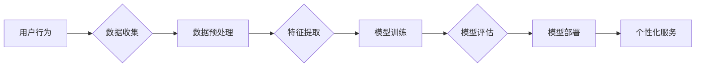
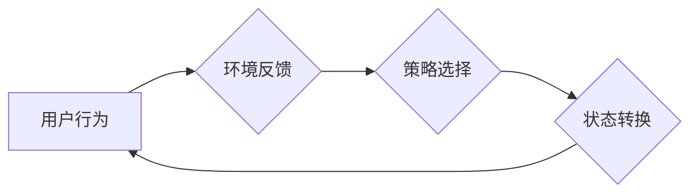

# 软件 2.0 的发展趋势：深度学习、强化学习

> 关键词：软件 2.0，深度学习，强化学习，人工智能，机器学习，软件架构，自动化

## 1. 背景介绍

随着互联网和计算机技术的飞速发展，软件行业已经经历了从1.0到2.0的转变。软件1.0时代，以桌面软件为主，强调功能和性能；而软件2.0时代，则以互联网服务为核心，强调用户体验和个性化。在软件2.0时代，人工智能技术，尤其是深度学习和强化学习，正在成为推动软件发展的重要力量。

### 1.1 软件发展历程

- **软件1.0时代**：以微软的Windows操作系统为代表，强调功能和性能。
- **软件2.0时代**：以互联网服务为代表，强调用户体验和个性化。
- **软件3.0时代**：以人工智能为代表，强调智能化和自动化。

### 1.2 深度学习与强化学习

- **深度学习**：一种模拟人脑神经网络结构和功能的机器学习方法，通过多层神经网络对数据进行特征提取和模式识别。
- **强化学习**：一种通过与环境交互，学习最优策略的机器学习方法。

## 2. 核心概念与联系

### 2.1 深度学习与软件2.0

深度学习为软件2.0提供了强大的数据处理和分析能力，使得软件能够更好地理解用户需求，提供个性化的服务。以下是一个Mermaid流程图，展示了深度学习在软件2.0中的应用：



### 2.2 强化学习与软件2.0

强化学习为软件2.0提供了自适应和优化的能力，使得软件能够根据用户反馈不断学习和改进。以下是一个Mermaid流程图，展示了强化学习在软件2.0中的应用：



## 3. 核心算法原理 & 具体操作步骤

### 3.1 算法原理概述

#### 3.1.1 深度学习

深度学习通过多层神经网络对数据进行特征提取和模式识别。每个神经元只处理部分特征，并通过权重连接形成复杂的特征表示。

#### 3.1.2 强化学习

强化学习通过奖励机制引导智能体学习最优策略。智能体通过与环境交互，不断尝试不同的动作，并从奖励中学习最优策略。

### 3.2 算法步骤详解

#### 3.2.1 深度学习

1. 数据收集：收集相关数据，如用户行为数据、文本数据等。
2. 数据预处理：对数据进行清洗、归一化等处理。
3. 特征提取：使用卷积神经网络、循环神经网络等模型提取特征。
4. 模型训练：使用梯度下降等优化算法训练模型。
5. 模型评估：使用验证集评估模型性能。
6. 模型部署：将模型部署到生产环境中。

#### 3.2.2 强化学习

1. 状态空间定义：定义智能体的状态空间。
2. 动作空间定义：定义智能体的动作空间。
3. 策略选择：选择合适的策略学习方法，如值函数方法、策略梯度方法等。
4. 状态转换：根据当前状态和动作，进行状态转换。
5. 奖励评估：根据动作结果评估奖励。
6. 策略更新：根据奖励更新策略。

### 3.3 算法优缺点

#### 3.3.1 深度学习

优点：
- 能够处理高维数据，提取复杂特征。
- 自动学习特征表示，无需人工设计特征。
- 适用于图像识别、语音识别等任务。

缺点：
- 训练数据需求量大。
- 计算复杂度高。
- 模型可解释性差。

#### 3.3.2 强化学习

优点：
- 能够学习到复杂策略。
- 适用于动态环境。
- 无需大量标注数据。

缺点：
- 训练时间较长。
- 难以评估策略性能。
- 难以并行化。

### 3.4 算法应用领域

#### 3.4.1 深度学习

- 图像识别
- 语音识别
- 自然语言处理
- 机器翻译
- 推荐系统

#### 3.4.2 强化学习

- 游戏人工智能
- 机器人控制
- 自动驾驶
- 股票交易
- 能源优化

## 4. 数学模型和公式 & 详细讲解 & 举例说明

### 4.1 数学模型构建

#### 4.1.1 深度学习

深度学习模型通常由多个层组成，包括输入层、隐藏层和输出层。每个层由神经元组成，神经元之间通过权重连接。

#### 4.1.2 强化学习

强化学习模型通常由状态空间、动作空间、策略、奖励函数和值函数组成。

### 4.2 公式推导过程

#### 4.2.1 深度学习

假设输入层到隐藏层之间的权重为 $W^{[l]}$，激活函数为 $\sigma$，则隐藏层输出为：

$$
h^{[l]}_j = \sigma(W^{[l]}_{{ji}} x_i + b^{[l]}_j)
$$

其中 $x_i$ 为输入层第 $i$ 个神经元输入，$h^{[l]}_j$ 为隐藏层第 $j$ 个神经元输出，$W^{[l]}_{{ji}}$ 为权重，$b^{[l]}_j$ 为偏置。

#### 4.2.2 强化学习

假设状态空间为 $S$，动作空间为 $A$，策略为 $\pi(s,a)$，奖励函数为 $R(s,a)$，值函数为 $V(s)$，则：

$$
V(s) = \sum_{a \in A} \pi(s,a) R(s,a) V(s')
$$

其中 $s'$ 为执行动作 $a$ 后的状态。

### 4.3 案例分析与讲解

#### 4.3.1 深度学习案例：图像识别

假设我们要构建一个图像识别模型，识别猫和狗。我们可以使用卷积神经网络(CNN)进行模型构建。

1. 数据收集：收集猫和狗的图像数据。
2. 数据预处理：对图像进行缩放、裁剪等处理。
3. 模型构建：构建一个CNN模型，包括卷积层、池化层、全连接层等。
4. 模型训练：使用图像数据训练模型。
5. 模型评估：使用测试集评估模型性能。

#### 4.3.2 强化学习案例：自动驾驶

假设我们要构建一个自动驾驶模型，控制车辆的行驶方向。

1. 状态空间：包括车辆的当前位置、速度、加速度等信息。
2. 动作空间：包括车辆的转向角度、油门踏板位置等信息。
3. 策略选择：使用深度Q网络(DQN)进行策略选择。
4. 状态转换：根据当前状态和动作，进行状态转换。
5. 奖励评估：根据行驶距离、速度等信息评估奖励。
6. 策略更新：根据奖励更新策略。

## 5. 项目实践：代码实例和详细解释说明

### 5.1 开发环境搭建

1. 安装Python环境。
2. 安装深度学习框架，如TensorFlow、PyTorch等。
3. 安装强化学习库，如OpenAI Gym等。

### 5.2 源代码详细实现

以下是一个使用PyTorch实现图像识别的简单示例：

```python
import torch
import torch.nn as nn
import torch.optim as optim
from torchvision import datasets, transforms
from torch.utils.data import DataLoader

# 定义CNN模型
class CNN(nn.Module):
    def __init__(self):
        super(CNN, self).__init__()
        self.conv1 = nn.Conv2d(3, 32, kernel_size=3, stride=1, padding=1)
        self.conv2 = nn.Conv2d(32, 64, kernel_size=3, stride=1, padding=1)
        self.fc1 = nn.Linear(64 * 8 * 8, 512)
        self.fc2 = nn.Linear(512, 2)

    def forward(self, x):
        x = torch.relu(self.conv1(x))
        x = torch.max_pool2d(x, kernel_size=2, stride=2)
        x = torch.relu(self.conv2(x))
        x = torch.max_pool2d(x, kernel_size=2, stride=2)
        x = x.view(x.size(0), -1)
        x = torch.relu(self.fc1(x))
        x = self.fc2(x)
        return x

# 加载数据
transform = transforms.Compose([transforms.ToTensor()])
train_dataset = datasets.MNIST(root='./data', train=True, transform=transform, download=True)
train_loader = DataLoader(train_dataset, batch_size=64, shuffle=True)

# 实例化模型
model = CNN()

# 定义损失函数和优化器
criterion = nn.CrossEntropyLoss()
optimizer = optim.Adam(model.parameters(), lr=0.001)

# 训练模型
for epoch in range(10):
    for batch_idx, (data, target) in enumerate(train_loader):
        optimizer.zero_grad()
        output = model(data)
        loss = criterion(output, target)
        loss.backward()
        optimizer.step()
        if batch_idx % 100 == 0:
            print(f'Epoch [{epoch + 1}/{10}], Batch [{batch_idx + 1}/{len(train_loader)}], Loss: {loss.item():.4f}')
```

### 5.3 代码解读与分析

上述代码定义了一个简单的CNN模型，用于识别MNIST手写数字数据。模型包括两个卷积层、两个池化层、两个全连接层。训练过程中，模型通过反向传播算法更新参数，使预测结果与真实标签的差距逐渐减小。

### 5.4 运行结果展示

运行上述代码后，模型会在训练集上进行训练，并在每个epoch结束时打印平均损失值。经过训练后，模型可以在测试集上进行评估，评估指标如准确率等。

## 6. 实际应用场景

### 6.1 智能客服

使用深度学习技术，可以构建智能客服系统，通过分析用户问题，自动回答用户提问。

### 6.2 自动驾驶

使用强化学习技术，可以构建自动驾驶系统，实现车辆在复杂环境中的自主驾驶。

### 6.3 机器翻译

使用深度学习技术，可以构建机器翻译系统，实现不同语言之间的自动翻译。

## 7. 工具和资源推荐

### 7.1 学习资源推荐

1. 《深度学习》（Goodfellow, Bengio, Courville）
2. 《强化学习：原理与实例》（Sutton, B., & Barto, A. G.）
3. 《深度学习框架：TensorFlow、PyTorch、Keras》

### 7.2 开发工具推荐

1. TensorFlow
2. PyTorch
3. OpenAI Gym
4. Keras

### 7.3 相关论文推荐

1. "Deep Learning"（Goodfellow, Bengio, Courville）
2. "Reinforcement Learning: An Introduction"（Sutton, B., & Barto）
3. "Deep Reinforcement Learning"（Silver, D., et al.）

## 8. 总结：未来发展趋势与挑战

### 8.1 研究成果总结

深度学习和强化学习在软件2.0时代取得了显著的成果，为软件发展带来了新的机遇。

### 8.2 未来发展趋势

1. 深度学习模型将更加高效和可解释。
2. 强化学习将在更多领域得到应用。
3. 深度学习和强化学习将更加融合。

### 8.3 面临的挑战

1. 模型可解释性差。
2. 计算资源消耗大。
3. 数据标注成本高。

### 8.4 研究展望

未来，深度学习和强化学习将在软件2.0时代发挥更加重要的作用，推动软件向智能化、自动化方向发展。

## 9. 附录：常见问题与解答

**Q1：深度学习和强化学习有什么区别？**

A：深度学习是一种通过多层神经网络学习数据特征的方法，而强化学习是一种通过与环境交互学习最优策略的方法。

**Q2：如何选择合适的深度学习模型？**

A：选择合适的深度学习模型需要根据具体任务和数据特点进行选择，常见的模型包括卷积神经网络、循环神经网络等。

**Q3：如何选择合适的强化学习算法？**

A：选择合适的强化学习算法需要根据具体任务和环境特点进行选择，常见的算法包括Q学习、策略梯度方法等。

**Q4：深度学习和强化学习在软件2.0中有哪些应用场景？**

A：深度学习在图像识别、语音识别、自然语言处理等领域有广泛应用，强化学习在自动驾驶、智能客服等领域有广泛应用。

---

作者：禅与计算机程序设计艺术 / Zen and the Art of Computer Programming