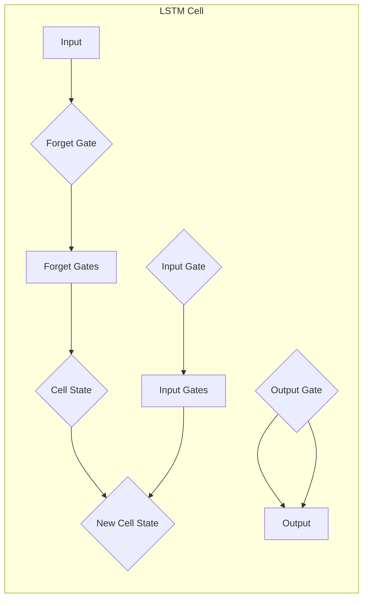

> 长短时记忆网络 (LSTM), 递归神经网络 (RNN), 人工神经网络 (ANN), 自然语言处理 (NLP), 时间序列分析, 深度学习

# 长短时记忆网络 (LSTM) 原理与代码实例讲解

## 1. 背景介绍

随着时间的推移，深度学习在处理序列数据方面取得了显著进展。其中，长短时记忆网络（Long Short-Term Memory，LSTM）是递归神经网络（Recurrent Neural Network，RNN）的一种特殊结构，它能够有效地处理长期依赖问题，在自然语言处理（NLP）、时间序列分析等领域取得了巨大成功。本文将深入探讨LSTM的原理、实现，并提供代码实例，帮助读者更好地理解这一重要的深度学习模型。

## 2. 核心概念与联系

### 2.1 递归神经网络（RNN）

递归神经网络是一种处理序列数据的神经网络架构。与传统的前馈神经网络不同，RNN具有递归性，允许信息在不同的时间步之间流动。然而，传统的RNN在处理长期依赖时存在梯度消失或爆炸问题。

### 2.2 长短时记忆网络（LSTM）

LSTM是RNN的一种改进，它通过引入门控机制（gate）来解决传统RNN的长期依赖问题。LSTM包含三种门控结构：遗忘门（forget gate）、输入门（input gate）和输出门（output gate），以及一个细胞状态（cell state）。

### 2.3 Mermaid 流程图

以下是一个LSTM架构的Mermaid流程图：



在这个流程图中，输入门、遗忘门和输出门分别控制信息的输入、遗忘和输出。细胞状态则用于存储长期信息。

## 3. 核心算法原理 & 具体操作步骤

### 3.1 算法原理概述

LSTM通过以下步骤处理序列数据：

1. 输入门：决定哪些信息将被更新到细胞状态中。
2. 遗忘门：决定哪些信息应该从细胞状态中遗忘。
3. 输出门：决定哪些信息应该从细胞状态中输出。
4. 细胞状态更新：根据输入门和遗忘门的决策，更新细胞状态。
5. 输出：根据输出门的决策，从细胞状态中提取信息作为输出。

### 3.2 算法步骤详解

以下是LSTM算法的具体步骤：

1. **初始化**：设置初始细胞状态和隐藏状态。
2. **循环遍历**：对于序列中的每个时间步，执行以下操作：
   - **输入门**：计算输入门激活函数，决定哪些输入信息将被更新到细胞状态中。
   - **遗忘门**：计算遗忘门激活函数，决定哪些信息应该从细胞状态中遗忘。
   - **细胞状态更新**：更新细胞状态，结合输入门和遗忘门的结果。
   - **输出门**：计算输出门激活函数，决定哪些信息应该从细胞状态中输出。
   - **隐藏状态**：根据输出门的决策，从细胞状态中提取信息作为隐藏状态。
3. **输出**：最后，隐藏状态可以用于下一个时间步的输入，或者直接作为输出。

### 3.3 算法优缺点

**优点**：

- 能够有效地处理长期依赖问题。
- 在多种序列数据任务中表现出色。

**缺点**：

- 计算复杂度高。
- 参数多，训练时间长。

### 3.4 算法应用领域

LSTM在以下领域有广泛的应用：

- 自然语言处理：文本分类、机器翻译、情感分析等。
- 时间序列分析：股票价格预测、天气预测等。
- 计算机视觉：视频分类、动作识别等。

## 4. 数学模型和公式 & 详细讲解 & 举例说明

### 4.1 数学模型构建

LSTM的数学模型可以通过以下公式表示：

$$
\begin{align*}
i_t &= \sigma(W_{xi}x_t + W_{hi}h_{t-1} + b_i) \\
f_t &= \sigma(W_{xf}x_t + W_{hf}h_{t-1} + b_f) \\
o_t &= \sigma(W_{xo}x_t + W_{ho}h_{t-1} + b_o) \\
c_t &= f_t \odot c_{t-1} + i_t \odot \tanh(W_{xc}x_t + W_{hc}h_{t-1} + b_c) \\
h_t &= o_t \odot \tanh(c_t)
\end{align*}
$$

其中，$x_t$ 是输入向量，$h_t$ 是隐藏状态，$c_t$ 是细胞状态，$W$ 和 $b$ 分别是权重和偏置。

### 4.2 公式推导过程

LSTM的公式推导过程涉及到多个激活函数和门控机制，具体推导过程较为复杂，这里不再赘述。

### 4.3 案例分析与讲解

以下是一个简单的LSTM示例，用于情感分析任务：

```python
import torch
import torch.nn as nn
import torch.optim as optim

class SentimentLSTM(nn.Module):
    def __init__(self, input_dim, hidden_dim, output_dim):
        super(SentimentLSTM, self).__init__()
        self.hidden_dim = hidden_dim
        self.lstm = nn.LSTM(input_dim, hidden_dim)
        self.fc = nn.Linear(hidden_dim, output_dim)
        
    def forward(self, x):
        lstm_out, _ = self.lstm(x)
        out = self.fc(lstm_out[-1])
        return out

# 初始化模型、损失函数和优化器
model = SentimentLSTM(input_dim=100, hidden_dim=128, output_dim=1)
criterion = nn.BCEWithLogitsLoss()
optimizer = optim.Adam(model.parameters(), lr=0.01)

# 训练模型（示例）
# ...

# 预测情感（示例）
# ...
```

在这个示例中，我们定义了一个简单的情感分析模型，使用LSTM作为特征提取器，最后通过全连接层输出情感概率。

## 5. 项目实践：代码实例和详细解释说明

### 5.1 开发环境搭建

为了运行LSTM模型，你需要以下开发环境：

- Python 3.x
- PyTorch
- Numpy

### 5.2 源代码详细实现

以下是一个简单的LSTM模型的实现示例：

```python
import torch
import torch.nn as nn
import torch.optim as optim

class SimpleLSTM(nn.Module):
    def __init__(self, input_dim, hidden_dim, output_dim):
        super(SimpleLSTM, self).__init__()
        self.lstm = nn.LSTM(input_dim, hidden_dim)
        self.fc = nn.Linear(hidden_dim, output_dim)
        
    def forward(self, x):
        lstm_out, _ = self.lstm(x)
        out = self.fc(lstm_out[-1])
        return out

# 初始化模型、损失函数和优化器
model = SimpleLSTM(input_dim=10, hidden_dim=20, output_dim=1)
criterion = nn.MSELoss()
optimizer = optim.SGD(model.parameters(), lr=0.01)

# 训练模型
# ...

# 预测结果
# ...
```

在这个示例中，我们定义了一个简单的LSTM模型，用于预测一个一维时间序列的下一个值。

### 5.3 代码解读与分析

在这个示例中，我们定义了一个名为`SimpleLSTM`的类，继承自`nn.Module`。它包含一个LSTM层和一个全连接层。在`forward`方法中，我们首先对输入数据进行LSTM处理，然后通过全连接层输出预测结果。

### 5.4 运行结果展示

假设我们已经训练了模型，并使用它进行预测：

```python
# 假设输入数据为[1, 2, 3, 4, 5]
x = torch.tensor([[1, 2, 3, 4, 5]])

# 使用模型进行预测
output = model(x)

# 输出结果
print(output)
```

输出结果将是一个包含预测值的张量。

## 6. 实际应用场景

LSTM在以下场景中有着广泛的应用：

- **自然语言处理**：文本分类、情感分析、机器翻译、文本生成等。
- **时间序列分析**：股票价格预测、天气预报、能源消耗预测等。
- **语音识别**：将语音信号转换为文本。
- **视频分析**：动作识别、场景识别等。

## 7. 工具和资源推荐

### 7.1 学习资源推荐

- 《深度学习》（Goodfellow, Bengio, Courville）
- 《序列模型：递归神经网络与RNN变体》（ seq2seq models: RNN Variants）
- 《PyTorch深度学习》（François Chollet）

### 7.2 开发工具推荐

- PyTorch
- TensorFlow
- Keras

### 7.3 相关论文推荐

- "Long Short-Term Memory"（Hochreiter & Schmidhuber）
- "Sequence to Sequence Learning with Neural Networks"（Sutskever et al.）

## 8. 总结：未来发展趋势与挑战

### 8.1 研究成果总结

LSTM作为一种强大的递归神经网络架构，在处理序列数据方面取得了显著进展。它能够有效地处理长期依赖问题，在多个领域取得了成功。

### 8.2 未来发展趋势

- LSTM将继续在处理序列数据方面发挥重要作用。
- LSTM与其他神经网络架构的融合，如Transformer，将产生新的模型。
- LSTM将与其他领域的技术，如强化学习，进行结合。

### 8.3 面临的挑战

- LSTM的计算复杂度高，需要大量的计算资源。
- LSTM难以处理长序列数据。
- LSTM的可解释性较差。

### 8.4 研究展望

- 开发更高效的LSTM变体，以降低计算复杂度。
- 提高LSTM处理长序列数据的能力。
- 提高LSTM的可解释性。

## 9. 附录：常见问题与解答

**Q1：LSTM与RNN的主要区别是什么？**

A：LSTM是RNN的一种改进，它通过引入门控机制来解决传统RNN的长期依赖问题。

**Q2：如何选择LSTM的隐藏层大小？**

A：隐藏层大小应根据具体任务和数据量进行调整。一般来说，隐藏层大小越大，模型的性能越好，但计算复杂度也越高。

**Q3：LSTM在处理长序列数据时有哪些挑战？**

A：LSTM在处理长序列数据时，可能会出现梯度消失或梯度爆炸问题，导致模型性能下降。

**Q4：如何提高LSTM的可解释性？**

A：可以通过可视化LSTM的内部状态和激活函数来提高其可解释性。

作者：禅与计算机程序设计艺术 / Zen and the Art of Computer Programming