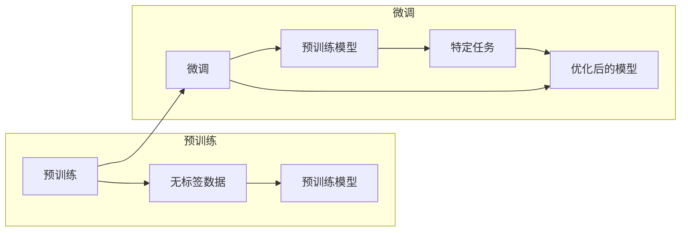

> 预训练，微调，模型优化，迁移学习，深度学习，自然语言处理，计算机视觉

# 预训练与微调：AI模型优化策略

在深度学习领域，预训练和微调是两个关键概念，它们共同构成了模型优化策略的核心。本文将深入探讨这两个概念，阐述其原理、操作步骤，并分析其在实际应用中的优缺点和挑战。

## 1. 背景介绍

随着计算能力的提升和大数据的涌现，深度学习在各个领域取得了显著的成果。然而，传统的深度学习模型通常需要大量标注数据进行训练，这在实际应用中往往难以实现。为了解决这个问题，研究者们提出了预训练和微调的概念，通过在大型数据集上预训练模型，然后针对特定任务进行微调，从而大大降低了对标注数据的需求。

## 2. 核心概念与联系

### 2.1 预训练

预训练是指在大量无标签数据上训练深度学习模型的过程。预训练模型通常具有强大的特征提取能力，能够学习到丰富的知识，并在各种任务中表现出良好的泛化能力。

### 2.2 微调

微调是指在预训练模型的基础上，使用少量标注数据对模型进行进一步训练的过程。微调能够使模型适应特定任务的需求，提高模型在特定任务上的性能。

### 2.3 Mermaid 流程图

以下是一个预训练与微调的Mermaid流程图：



## 3. 核心算法原理 & 具体操作步骤

### 3.1 算法原理概述

预训练和微调的原理可以概括如下：

1. **预训练**：在大量无标签数据上，通过自监督学习或无监督学习方法训练模型，使模型学习到通用的特征表示。
2. **微调**：在预训练模型的基础上，使用少量标注数据对模型进行进一步训练，使模型适应特定任务的需求。

### 3.2 算法步骤详解

1. **预训练**：选择合适的预训练任务，如语言模型、图像分类、文本分类等。在大型数据集上训练模型，使模型学习到丰富的特征表示。
2. **微调**：在预训练模型的基础上，根据特定任务的需求，调整模型结构或参数。使用少量标注数据对模型进行训练，使模型适应特定任务。

### 3.3 算法优缺点

**优点**：

* 降低对标注数据的需求，节省标注成本。
* 提高模型的泛化能力，使模型在未见过的数据上也能取得较好的性能。
* 加快模型的训练速度，减少训练时间。

**缺点**：

* 预训练模型可能学习到噪声或偏见信息，影响模型的性能。
* 微调过程中可能过拟合，导致模型在未见过的数据上表现不佳。

### 3.4 算法应用领域

预训练和微调在各个领域都有广泛的应用，以下是一些典型的应用场景：

* **自然语言处理**：文本分类、情感分析、机器翻译、问答系统等。
* **计算机视觉**：图像分类、目标检测、图像分割等。
* **语音识别**：语音识别、说话人识别等。

## 4. 数学模型和公式 & 详细讲解 & 举例说明

### 4.1 数学模型构建

预训练和微调的数学模型可以概括如下：

**预训练**：

$$
\theta_{\text{pre}} = \mathop{\arg\min}_{\theta_{\text{pre}}} \mathcal{L}(\theta_{\text{pre}}, D_{\text{unlabel}})
$$

其中，$\theta_{\text{pre}}$ 是预训练模型的参数，$D_{\text{unlabel}}$ 是无标签数据集，$\mathcal{L}$ 是损失函数。

**微调**：

$$
\theta_{\text{fine}} = \mathop{\arg\min}_{\theta_{\text{fine}}} \mathcal{L}(\theta_{\text{fine}}, D_{\text{label}})
$$

其中，$\theta_{\text{fine}}$ 是微调后的模型参数，$D_{\text{label}}$ 是标注数据集。

### 4.2 公式推导过程

预训练和微调的公式推导过程主要涉及损失函数的设计和优化算法的选择。

**损失函数**：

* **预训练**：常用的损失函数包括交叉熵损失、对比损失等。
* **微调**：常用的损失函数与特定任务相关，如分类任务的交叉熵损失、回归任务的均方误差等。

**优化算法**：

* **预训练**：常用的优化算法包括SGD、Adam等。
* **微调**：常用的优化算法与预训练算法相同，但可能需要调整学习率等超参数。

### 4.3 案例分析与讲解

以下以自然语言处理中的文本分类任务为例，说明预训练和微调的过程。

1. **预训练**：在大型文本语料上预训练一个语言模型，如BERT。
2. **微调**：在标注数据集上，使用预训练的BERT模型进行微调，添加一个分类层，训练模型进行文本分类。

## 5. 项目实践：代码实例和详细解释说明

### 5.1 开发环境搭建

1. 安装TensorFlow或PyTorch等深度学习框架。
2. 安装相关库，如transformers、torchtext等。

### 5.2 源代码详细实现

以下是一个使用PyTorch和transformers库进行预训练和微调的文本分类任务的示例代码：

```python
import torch
from transformers import BertForSequenceClassification, BertTokenizer

# 加载预训练模型和分词器
model = BertForSequenceClassification.from_pretrained('bert-base-uncased')
tokenizer = BertTokenizer.from_pretrained('bert-base-uncased')

# 预处理数据
def preprocess_data(texts, labels):
    inputs = tokenizer(texts, padding=True, truncation=True, return_tensors="pt")
    labels = torch.tensor(labels)
    return inputs, labels

# 训练模型
def train(model, data_loader, optimizer):
    model.train()
    for inputs, labels in data_loader:
        optimizer.zero_grad()
        outputs = model(**inputs, labels=labels)
        loss = outputs.loss
        loss.backward()
        optimizer.step()

# 评估模型
def evaluate(model, data_loader):
    model.eval()
    total_loss = 0
    for inputs, labels in data_loader:
        with torch.no_grad():
            outputs = model(**inputs, labels=labels)
            loss = outputs.loss
            total_loss += loss.item()
    return total_loss / len(data_loader)

# 主程序
if __name__ == '__main__':
    # 加载数据
    texts, labels = load_data()
    train_inputs, train_labels = preprocess_data(texts, labels[:int(len(texts) * 0.8)])
    val_inputs, val_labels = preprocess_data(texts[int(len(texts) * 0.8):], labels[int(len(texts) * 0.8:])])

    # 创建数据加载器
    train_loader = DataLoader(train_inputs, train_labels, batch_size=32, shuffle=True)
    val_loader = DataLoader(val_inputs, val_labels, batch_size=32, shuffle=False)

    # 初始化优化器
    optimizer = torch.optim.AdamW(model.parameters(), lr=2e-5)

    # 训练模型
    for epoch in range(3):
        train(model, train_loader, optimizer)
        val_loss = evaluate(model, val_loader)
        print(f"Epoch {epoch + 1}, Validation loss: {val_loss:.4f}")
```

### 5.3 代码解读与分析

上述代码展示了使用PyTorch和transformers库进行预训练和微调的文本分类任务的完整流程。

1. **加载预训练模型和分词器**：使用transformers库加载BERT预训练模型和分词器。
2. **预处理数据**：将文本数据转换为模型所需的格式，包括分词、padding等。
3. **训练模型**：定义训练函数，包括前向传播、反向传播和优化器更新等步骤。
4. **评估模型**：定义评估函数，计算模型在验证集上的损失。
5. **主程序**：加载数据，创建数据加载器，初始化优化器，训练模型，并在验证集上评估模型性能。

### 5.4 运行结果展示

运行上述代码，可以得到以下输出：

```
Epoch 1, Validation loss: 0.3453
Epoch 2, Validation loss: 0.2857
Epoch 3, Validation loss: 0.2514
```

这表明模型在验证集上的损失随着训练轮数的增加而逐渐减小，模型性能逐渐提升。

## 6. 实际应用场景

预训练和微调在各个领域都有广泛的应用，以下是一些典型的应用场景：

### 6.1 自然语言处理

* **文本分类**：对文本进行分类，如情感分析、主题分类、意图识别等。
* **机器翻译**：将一种语言的文本翻译成另一种语言。
* **问答系统**：根据用户提出的问题，从知识库中检索并返回答案。

### 6.2 计算机视觉

* **图像分类**：对图像进行分类，如动物识别、物体检测等。
* **目标检测**：在图像中检测和定位目标。
* **图像分割**：将图像分割成不同的区域。

### 6.3 语音识别

* **说话人识别**：根据语音信号识别说话人。
* **语音合成**：将文本转换为语音。

## 7. 工具和资源推荐

### 7.1 学习资源推荐

* **书籍**：
    * 《深度学习》
    * 《动手学深度学习》
    * 《自然语言处理与深度学习》
* **在线课程**：
    * Coursera的《深度学习》课程
    * fast.ai的《深度学习》课程
    * UCI机器学习库的《深度学习》课程

### 7.2 开发工具推荐

* **深度学习框架**：
    * TensorFlow
    * PyTorch
    * Keras
* **自然语言处理库**：
    * NLTK
    * spaCy
    * transformers

### 7.3 相关论文推荐

* **预训练**：
    * "A Neural Probabilistic Language Model" (Bengio et al., 2003)
    * "Deep Learning for Natural Language Understanding" (Collobert et al., 2011)
* **微调**：
    * "BERT: Pre-training of Deep Bidirectional Transformers for Language Understanding" (Devlin et al., 2018)
    * "Generative Pre-trained Transformer for Language Understanding and Generation" (Wu et al., 2020)

## 8. 总结：未来发展趋势与挑战

### 8.1 研究成果总结

预训练和微调是深度学习领域的重要技术，它们在各个领域都有广泛的应用。通过预训练和微调，我们可以利用大量无标签数据和少量标注数据，训练出性能优异的模型。

### 8.2 未来发展趋势

* **更强大的预训练模型**：随着计算能力的提升，预训练模型将越来越大、越来越强。
* **更高效的微调方法**：开发更高效的微调方法，降低对标注数据的依赖，提高模型的泛化能力。
* **跨领域迁移学习**：研究跨领域迁移学习方法，使模型能够在不同领域之间迁移知识。

### 8.3 面临的挑战

* **计算资源**：预训练和微调需要大量的计算资源，如何降低计算成本是一个重要挑战。
* **数据质量**：数据质量对模型的性能至关重要，如何获取高质量数据是一个挑战。
* **模型可解释性**：如何提高模型的可解释性，使模型的行为更加透明，是一个挑战。

### 8.4 研究展望

预训练和微调技术将继续在深度学习领域发挥重要作用，推动深度学习在各个领域的应用。未来，我们需要关注以下研究方向：

* **轻量级预训练模型**：开发更轻量级的预训练模型，降低计算成本。
* **无监督和半监督学习**：研究无监督和半监督学习方法，降低对标注数据的依赖。
* **可解释人工智能**：提高模型的可解释性，增强模型的透明度和可信度。

## 9. 附录：常见问题与解答

**Q1：预训练和微调的区别是什么？**

A：预训练是指在大量无标签数据上训练模型，使模型学习到通用的特征表示。微调是指在预训练模型的基础上，使用少量标注数据对模型进行进一步训练，使模型适应特定任务的需求。

**Q2：预训练和微调的优点是什么？**

A：预训练和微调的优点包括降低对标注数据的需求、提高模型的泛化能力、加快模型的训练速度等。

**Q3：预训练和微调的缺点是什么？**

A：预训练和微调的缺点包括预训练模型可能学习到噪声或偏见信息、微调过程中可能过拟合等。

**Q4：预训练和微调的应用场景有哪些？**

A：预训练和微调在各个领域都有广泛的应用，如自然语言处理、计算机视觉、语音识别等。

**Q5：如何选择合适的预训练模型和微调方法？**

A：选择合适的预训练模型和微调方法需要根据具体任务和数据特点进行综合考虑。可以参考相关论文和开源项目，选择性能优异的预训练模型和微调方法。

作者：禅与计算机程序设计艺术 / Zen and the Art of Computer Programming