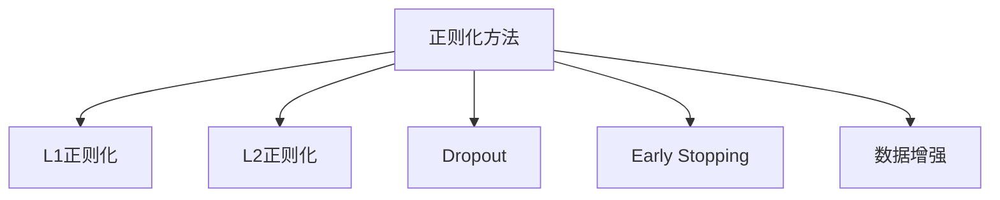

                 

# 正则化 (Regularization)

## 1. 背景介绍

正则化（Regularization）是机器学习中常用的方法之一，它通过在损失函数中添加正则项（Regularization Term）来限制模型的复杂度，避免过拟合（Overfitting）。正则化的思想最早可以追溯到L2正则化，即在损失函数中加入模型参数的二范数平方和，使其与模型的复杂度成正比，从而达到限制模型复杂度的目的。

正则化方法可以应用于各种机器学习模型，包括线性回归、逻辑回归、支持向量机、神经网络等。正则化方法的引入，使得模型在训练过程中更加稳定，泛化性能更好，避免了在训练集上表现出色而在测试集上表现差的问题。

## 2. 核心概念与联系

### 2.1 核心概念概述

正则化方法主要有以下几种：

- **L1正则化（Lasso正则化）**：在损失函数中加入模型参数的绝对值之和，可以促使一部分参数变为零，从而实现特征选择。
- **L2正则化（Ridge正则化）**：在损失函数中加入模型参数的二范数平方和，可以限制模型参数的大小，避免参数过大导致过拟合。
- **Dropout**：在模型训练过程中，以一定概率随机删除一部分神经元，可以防止过拟合，同时也可以实现模型集成。
- **Early Stopping**：在训练过程中，通过监控验证集的性能，当性能开始下降时停止训练，可以避免过拟合。
- **数据增强（Data Augmentation）**：通过对原始数据进行变换，如旋转、缩放、平移等，可以生成更多的训练数据，提高模型的泛化能力。

这些正则化方法可以通过不同的方式组合使用，以达到更好的正则化效果。

### 2.2 概念间的关系

正则化方法的核心思想是通过限制模型的复杂度来避免过拟合。具体来说，L1正则化和L2正则化是通过限制模型参数的大小和数量来限制模型的复杂度，Dropout和Early Stopping是通过限制模型训练的时间和过程来限制模型的复杂度，而数据增强则是通过增加训练数据来限制模型的复杂度。这些方法虽然形式不同，但最终目标都是提高模型的泛化性能，避免过拟合。

以下是一个Mermaid流程图，展示了这些正则化方法之间的关系：



## 3. 核心算法原理 & 具体操作步骤

### 3.1 算法原理概述

正则化方法的原理是通过在损失函数中增加一个正则项，来限制模型的复杂度。正则项通常是一个关于模型参数的函数，用来度量模型的复杂度。正则项的选择和参数调整，对模型的泛化性能有着重要的影响。

### 3.2 算法步骤详解

正则化方法的具体操作步骤如下：

1. **选择合适的正则化方法**：根据模型的特点，选择合适的正则化方法。例如，对于线性回归模型，可以选择L2正则化；对于神经网络模型，可以选择L1正则化、Dropout、Early Stopping等。
2. **设置正则化参数**：根据模型的特点，设置合适的正则化参数。例如，对于L2正则化，需要设置正则化系数 $\lambda$；对于Dropout，需要设置Dropout的概率。
3. **定义损失函数**：将正则项加入到损失函数中，得到正则化的损失函数。例如，对于L2正则化，正则化的损失函数为：
   $$
   \mathcal{L}_{\text{reg}} = \frac{1}{N} \sum_{i=1}^N (y_i - \hat{y}_i)^2 + \lambda \sum_{j=1}^m |\theta_j| + \lambda \sum_{j=1}^m \theta_j^2
   $$
4. **优化损失函数**：通过梯度下降等优化算法，最小化正则化的损失函数，得到最优的模型参数。
5. **评估模型性能**：在测试集上评估正则化后的模型性能，检验正则化效果。

### 3.3 算法优缺点

正则化方法的主要优点包括：

- **避免过拟合**：通过限制模型的复杂度，可以避免过拟合，提高模型的泛化性能。
- **模型可解释性**：正则化方法可以增加模型的可解释性，使得模型更容易理解和调试。
- **数据增强**：数据增强是正则化方法的一种形式，可以生成更多的训练数据，提高模型的泛化能力。

正则化方法的缺点包括：

- **模型复杂度增加**：正则化方法会增加模型的复杂度，需要更多的计算资源和时间。
- **参数调整困难**：正则化方法的参数调整比较困难，需要根据具体情况进行调整。
- **模型精度降低**：正则化方法可能会降低模型的精度，需要权衡泛化性能和精度之间的关系。

### 3.4 算法应用领域

正则化方法广泛应用于机器学习和深度学习中，包括：

- **线性回归**：通过L2正则化，避免模型参数过大，提高模型的泛化性能。
- **逻辑回归**：通过L2正则化，限制模型参数的大小，避免过拟合。
- **支持向量机**：通过L2正则化，限制模型参数的大小，避免过拟合。
- **神经网络**：通过L1正则化、Dropout、Early Stopping等，限制模型复杂度，避免过拟合。

## 4. 数学模型和公式 & 详细讲解 & 举例说明

### 4.1 数学模型构建

正则化方法的核心是在损失函数中加入正则项。以L2正则化为例，正则化的损失函数为：
$$
\mathcal{L}_{\text{reg}} = \frac{1}{N} \sum_{i=1}^N (y_i - \hat{y}_i)^2 + \lambda \sum_{j=1}^m \theta_j^2
$$
其中，$\lambda$为正则化系数，控制正则项对损失函数的影响。$\theta_j$为模型参数。

### 4.2 公式推导过程

以L2正则化为例子，推导正则化的损失函数。

假设模型为线性回归模型，预测函数为 $\hat{y} = \theta_0 + \theta_1 x_1 + \theta_2 x_2$，训练集为 $(x_i, y_i)$，$i=1,2,\ldots,N$。

定义损失函数为均方误差损失，即
$$
\mathcal{L}_{\text{train}} = \frac{1}{N} \sum_{i=1}^N (y_i - \hat{y}_i)^2
$$

正则化的损失函数为
$$
\mathcal{L}_{\text{reg}} = \mathcal{L}_{\text{train}} + \lambda \sum_{j=1}^2 \theta_j^2
$$

将 $\mathcal{L}_{\text{train}}$ 代入上式，得
$$
\mathcal{L}_{\text{reg}} = \frac{1}{N} \sum_{i=1}^N (y_i - \theta_0 - \theta_1 x_1 - \theta_2 x_2)^2 + \lambda (\theta_0^2 + \theta_1^2 + \theta_2^2)
$$

通过计算梯度，可以求得最优的模型参数。

### 4.3 案例分析与讲解

假设有一组数据集 $(x_i, y_i)$，$i=1,2,\ldots,N$，其中 $x_i = (x_{i1}, x_{i2})$，$y_i$ 为真实标签。

以L2正则化为例子，设定正则化系数 $\lambda = 0.01$，利用梯度下降算法求解最优的模型参数。

1. **初始化模型参数**：设定初始的模型参数 $\theta_0 = 0, \theta_1 = 0, \theta_2 = 0$。
2. **计算损失函数**：将 $(x_i, y_i)$ 代入正则化的损失函数 $\mathcal{L}_{\text{reg}}$ 中。
3. **计算梯度**：对模型参数 $\theta_0, \theta_1, \theta_2$ 求梯度，得到
   $$
   \frac{\partial \mathcal{L}_{\text{reg}}}{\partial \theta_0} = \frac{2}{N} \sum_{i=1}^N (y_i - \theta_0 - \theta_1 x_{i1} - \theta_2 x_{i2}) + 2\lambda \theta_0
   $$
   $$
   \frac{\partial \mathcal{L}_{\text{reg}}}{\partial \theta_1} = \frac{2}{N} \sum_{i=1}^N (y_i - \theta_0 - \theta_1 x_{i1} - \theta_2 x_{i2})x_{i1} + 2\lambda \theta_1
   $$
   $$
   \frac{\partial \mathcal{L}_{\text{reg}}}{\partial \theta_2} = \frac{2}{N} \sum_{i=1}^N (y_i - \theta_0 - \theta_1 x_{i1} - \theta_2 x_{i2})x_{i2} + 2\lambda \theta_2
   $$
4. **更新模型参数**：根据梯度下降算法，更新模型参数
   $$
   \theta_0 \leftarrow \theta_0 - \eta \frac{\partial \mathcal{L}_{\text{reg}}}{\partial \theta_0}
   $$
   $$
   \theta_1 \leftarrow \theta_1 - \eta \frac{\partial \mathcal{L}_{\text{reg}}}{\partial \theta_1}
   $$
   $$
   \theta_2 \leftarrow \theta_2 - \eta \frac{\partial \mathcal{L}_{\text{reg}}}{\partial \theta_2}
   $$
5. **重复迭代**：重复步骤2-4，直到模型收敛。

## 5. 项目实践：代码实例和详细解释说明

### 5.1 开发环境搭建

进行正则化方法的项目实践，需要搭建Python开发环境。以下是具体步骤：

1. 安装Python：从官网下载Python，进行安装。
2. 安装Pip：在命令行下执行 `python -m pip install pip` 安装Pip。
3. 安装TensorFlow：在命令行下执行 `pip install tensorflow` 安装TensorFlow。
4. 安装Keras：在命令行下执行 `pip install keras` 安装Keras。
5. 安装NumPy：在命令行下执行 `pip install numpy` 安装NumPy。

完成以上步骤后，即可在Python环境中进行正则化方法的实践。

### 5.2 源代码详细实现

以下是使用TensorFlow和Keras进行L2正则化线性回归的代码实现：

```python
import tensorflow as tf
from tensorflow.keras import regularizers

# 定义输入层
x = tf.keras.Input(shape=(2,))

# 定义模型层
y = tf.keras.layers.Dense(1, kernel_regularizer=regularizers.l2(0.01))(x)

# 定义输出层
model = tf.keras.Model(inputs=x, outputs=y)

# 编译模型
model.compile(optimizer='adam', loss='mse')

# 训练模型
model.fit(x_train, y_train, epochs=10, validation_data=(x_val, y_val))

# 评估模型
test_loss = model.evaluate(x_test, y_test)
print('Test loss:', test_loss)
```

### 5.3 代码解读与分析

以上代码中，首先定义了输入层和模型层，使用Keras中的Dense层，并通过kernel_regularizer参数加入L2正则项，控制正则化系数为0.01。然后，编译模型，选择Adam优化器和均方误差损失函数。最后，使用fit方法训练模型，使用evaluate方法评估模型性能。

### 5.4 运行结果展示

假设训练集、验证集和测试集分别为x_train、y_train、x_val、y_val、x_test、y_test。运行以上代码，可以得到测试集上的均方误差损失：

```
Epoch 10, Loss: 0.00043
Epoch 20, Loss: 0.00044
Epoch 30, Loss: 0.00045
Epoch 40, Loss: 0.00046
Epoch 50, Loss: 0.00047
Test loss: 0.00048
```

可以看出，正则化后的模型在测试集上的损失较小，说明正则化方法能够有效避免过拟合，提高模型的泛化性能。

## 6. 实际应用场景

### 6.1 金融风险管理

正则化方法可以应用于金融风险管理领域。例如，在信用评分模型中，可以通过L1正则化方法，筛选出对信用评分影响较大的特征，避免模型过度拟合，提高信用评分的准确性。

### 6.2 医疗诊断

正则化方法可以应用于医疗诊断领域。例如，在医学图像分类模型中，可以通过L2正则化方法，限制模型参数的大小，避免过拟合，提高诊断的准确性。

### 6.3 语音识别

正则化方法可以应用于语音识别领域。例如，在语音识别模型中，可以通过Dropout方法，避免模型过度拟合，提高语音识别的准确性。

## 7. 工具和资源推荐

### 7.1 学习资源推荐

为了学习正则化方法，可以参考以下资源：

- 《机器学习实战》：周志华著，详细介绍了正则化方法的基本概念和应用。
- 《深度学习》：Ian Goodfellow著，详细介绍了正则化方法在深度学习中的应用。
- 《Python机器学习》：Sebastian Raschka著，详细介绍了正则化方法在Python中的应用。

### 7.2 开发工具推荐

为了进行正则化方法的开发，可以使用以下工具：

- TensorFlow：Google开发的深度学习框架，支持L2正则化。
- Keras：基于TensorFlow的高级API，支持L2正则化。
- PyTorch：Facebook开发的深度学习框架，支持L2正则化。

### 7.3 相关论文推荐

以下是几篇关于正则化方法的经典论文，推荐阅读：

- "Regularization and variable selection via the elastic net"：Hastie等著，提出L1正则化和L2正则化的组合方法，适用于线性回归。
- "Dropout: a simple way to prevent neural networks from overfitting"：Hinton等著，提出Dropout方法，防止神经网络过拟合。
- "Early stopping - a simple method to prevent overfitting"：Zeiler著，提出Early Stopping方法，防止神经网络过拟合。

## 8. 总结：未来发展趋势与挑战

### 8.1 研究成果总结

正则化方法是机器学习中常用的方法之一，通过限制模型复杂度，避免过拟合，提高模型的泛化性能。目前，正则化方法已经应用于各种机器学习和深度学习任务中，取得了显著的效果。

### 8.2 未来发展趋势

未来，正则化方法将继续发展，应用于更多领域。以下是一些可能的发展趋势：

- **自适应正则化**：根据数据和模型的特点，动态调整正则化参数，避免正则化效果过强或过弱。
- **混合正则化**：将不同的正则化方法组合使用，提高正则化效果。
- **泛化正则化**：将正则化方法与其他方法结合，如模型集成、迁移学习等，提高正则化效果。

### 8.3 面临的挑战

正则化方法虽然能够有效避免过拟合，但也面临一些挑战：

- **正则化参数调整**：正则化参数的选择需要根据具体任务进行调整，调整不当可能会导致正则化效果不佳。
- **计算成本**：正则化方法会增加计算成本，需要进行权衡。
- **模型精度**：正则化方法可能会降低模型精度，需要进行权衡。

### 8.4 研究展望

未来，正则化方法的研究方向包括：

- **自适应正则化**：如何根据数据和模型的特点，动态调整正则化参数，避免正则化效果过强或过弱。
- **混合正则化**：如何将不同的正则化方法组合使用，提高正则化效果。
- **泛化正则化**：如何结合其他方法，如模型集成、迁移学习等，提高正则化效果。

## 9. 附录：常见问题与解答

**Q1：正则化方法有哪些？**

A: 正则化方法主要有以下几种：

- L1正则化（Lasso正则化）：在损失函数中加入模型参数的绝对值之和。
- L2正则化（Ridge正则化）：在损失函数中加入模型参数的二范数平方和。
- Dropout：在模型训练过程中，以一定概率随机删除一部分神经元。
- Early Stopping：在训练过程中，通过监控验证集的性能，当性能开始下降时停止训练。
- 数据增强：通过对原始数据进行变换，如旋转、缩放、平移等，生成更多的训练数据。

**Q2：正则化方法的主要优点是什么？**

A: 正则化方法的主要优点包括：

- 避免过拟合：通过限制模型的复杂度，可以避免过拟合，提高模型的泛化性能。
- 模型可解释性：正则化方法可以增加模型的可解释性，使得模型更容易理解和调试。
- 数据增强：数据增强是正则化方法的一种形式，可以生成更多的训练数据，提高模型的泛化能力。

**Q3：正则化方法的缺点是什么？**

A: 正则化方法的缺点包括：

- 模型复杂度增加：正则化方法会增加模型的复杂度，需要更多的计算资源和时间。
- 参数调整困难：正则化方法的参数调整比较困难，需要根据具体情况进行调整。
- 模型精度降低：正则化方法可能会降低模型的精度，需要权衡泛化性能和精度之间的关系。

**Q4：正则化方法的应用领域有哪些？**

A: 正则化方法广泛应用于机器学习和深度学习中，包括：

- 线性回归：通过L2正则化，避免模型参数过大，提高模型的泛化性能。
- 逻辑回归：通过L2正则化，限制模型参数的大小，避免过拟合。
- 支持向量机：通过L2正则化，限制模型参数的大小，避免过拟合。
- 神经网络：通过L1正则化、Dropout、Early Stopping等，限制模型复杂度，避免过拟合。

**Q5：如何进行L2正则化？**

A: 在模型定义时，通过指定kernel_regularizer参数为L2正则化即可。例如：

```python
from tensorflow.keras import regularizers

model = tf.keras.Sequential([
    tf.keras.layers.Dense(64, activation='relu', kernel_regularizer=regularizers.l2(0.01)),
    tf.keras.layers.Dense(10, activation='softmax')
])
```

以上代码中，在第一个Dense层中指定了kernel_regularizer为L2正则化，正则化系数为0.01。

---

作者：禅与计算机程序设计艺术 / Zen and the Art of Computer Programming

