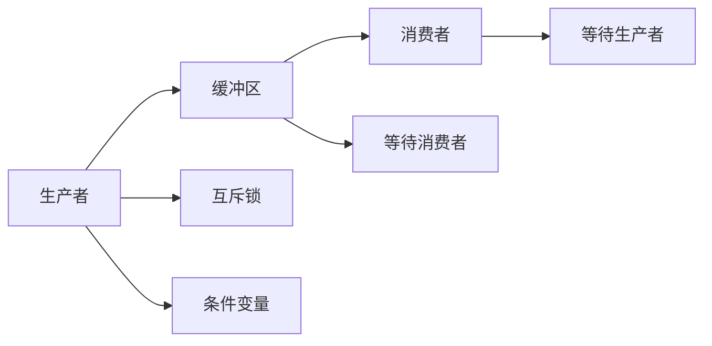
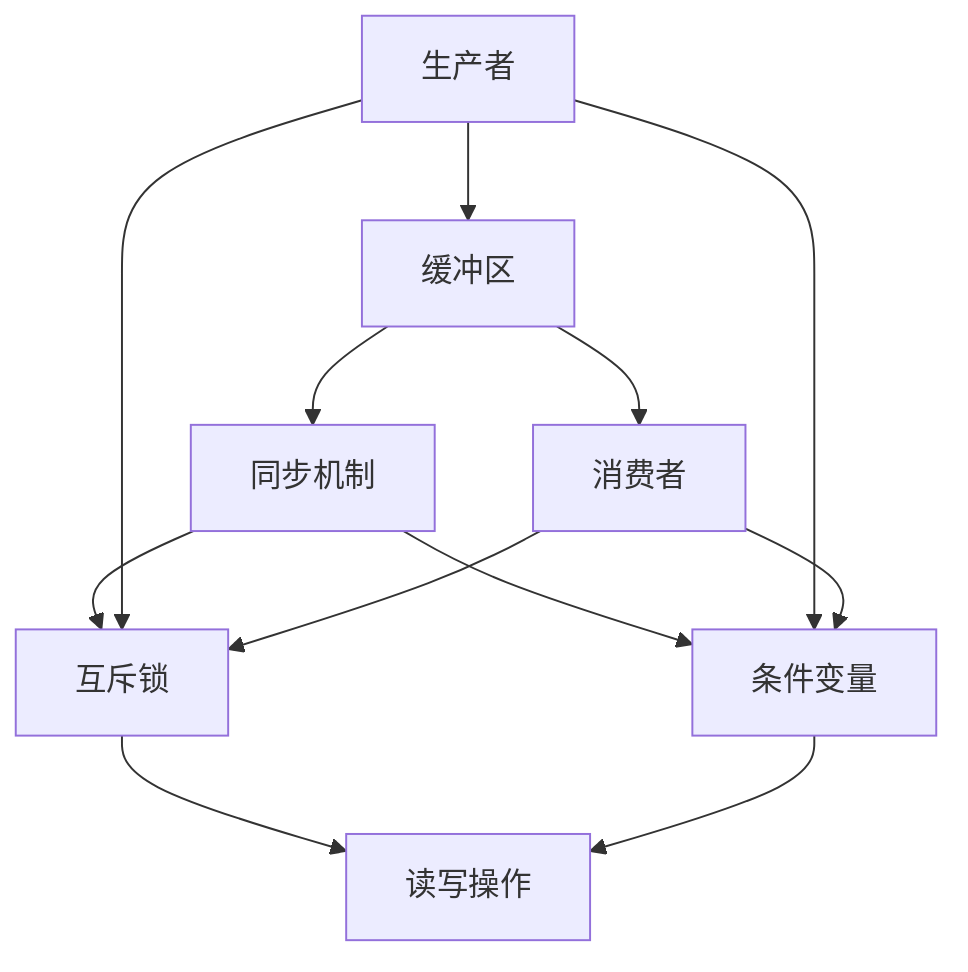

                 

# 消费者组 原理与代码实例讲解

> 关键词：消费者组,代码实例,原理讲解,编程语言

## 1. 背景介绍

### 1.1 问题由来
在计算机科学和软件开发中，消费者组（Consumer Group）是一种用于协调不同线程或进程间数据交换的同步机制。它通常用于生产者-消费者问题，即一个或多个生产者线程向共享缓冲区中写入数据，而一个或多个消费者线程从缓冲区中读取数据。

随着多线程编程的普及，消费者组成为了一种常见而重要的技术，广泛应用于高性能计算、并发编程、数据处理等领域。然而，由于其涉及到复杂的同步和并发控制，初学者往往对其理解不够深入，应用起来容易出错。

### 1.2 问题核心关键点
消费者组的核心问题在于如何设计一个高效、安全的数据缓冲区，以及如何协调生产者和消费者之间数据交换的同步。关键点包括：

- **缓冲区设计**：需要设计一个大小合适的缓冲区，既要能容纳一定的数据量，又要避免缓冲区溢出或过载。
- **同步机制**：需要设计一个有效的同步机制，保证生产者不会向满缓冲区写入数据，消费者不会从空缓冲区读取数据。
- **并发控制**：需要考虑多个生产者和多个消费者同时访问缓冲区时的并发控制问题，避免数据竞争和死锁。
- **可扩展性**：需要设计一个可扩展的消费者组，能够根据实际需求调整缓冲区大小和并发度。

### 1.3 问题研究意义
研究消费者组原理和代码实例，对于理解和掌握多线程编程技术、优化并发性能、构建高性能数据处理系统具有重要意义：

1. **多线程编程基础**：消费者组是多线程编程中的一个经典问题，掌握其原理和实现方法，是学习多线程编程的重要基础。
2. **并发性能优化**：在并发系统中，数据共享是性能瓶颈之一。消费者组通过缓冲区设计、同步机制等手段，可以优化数据共享的效率，提升并发系统的性能。
3. **系统架构设计**：消费者组模型适用于多种系统架构设计，如分布式系统、消息队列系统等，掌握其原理和实现方法，有助于构建复杂系统。
4. **实际应用广泛**：消费者组在各种实际应用中都有广泛的应用，如缓存系统、消息队列、数据流处理等，理解其原理有助于在实际项目中应用。

## 2. 核心概念与联系

### 2.1 核心概念概述

消费者组涉及多个相关概念，包括缓冲区（Buffer）、生产者（Producer）、消费者（Consumer）、同步机制等。

- **缓冲区（Buffer）**：用于存储生产者产生的数据的共享内存区域。
- **生产者（Producer）**：向缓冲区写入数据的线程。
- **消费者（Consumer）**：从缓冲区读取数据的线程。
- **同步机制**：用于协调生产者和消费者之间数据交换的机制，包括互斥锁、条件变量等。

这些概念之间的联系通过以下Mermaid流程图来展示：



这个流程图展示了一个典型的生产者-消费者系统，其中生产者通过互斥锁和条件变量控制对缓冲区的访问，消费者也通过互斥锁和条件变量控制读取缓冲区。

### 2.2 概念间的关系

这些核心概念之间存在着紧密的联系，形成了消费者组的基本结构和运作流程。

- **缓冲区**是生产者和消费者共享的数据存储区域，是消费者组的核心组件。
- **生产者**和**消费者**通过缓冲区进行数据交换，是消费者组的主要参与者。
- **同步机制**用于协调生产者和消费者之间的数据交换，是消费者组的灵魂。

在实际的消费者组实现中，还需要考虑缓冲区大小、生产者消费者数量、数据类型、同步策略等因素，以确保系统的正确性和性能。

### 2.3 核心概念的整体架构

最终，我们可以用以下综合的流程图来展示消费者组的整体架构：



这个综合流程图展示了消费者组的基本架构，包括生产者、缓冲区、同步机制等核心组件，以及它们之间的数据流和控制流。

## 3. 核心算法原理 & 具体操作步骤
### 3.1 算法原理概述

消费者组的核心算法原理包括以下几个方面：

- **缓冲区设计**：缓冲区大小需要根据实际情况设计，既要能容纳一定的数据量，又要避免缓冲区溢出或过载。
- **同步机制设计**：通过互斥锁和条件变量等机制，实现生产者和消费者之间的同步和互斥访问。
- **并发控制**：在多个生产者和消费者同时访问缓冲区时，需要考虑数据竞争和死锁等问题，采用合理的并发控制策略。
- **性能优化**：通过合理的设计和优化，提升消费者组的性能，避免不必要的同步和阻塞。

### 3.2 算法步骤详解

基于以上算法原理，消费者组的具体操作步骤如下：

**Step 1: 定义缓冲区大小和初始状态**

```c
#define BUFFER_SIZE 100
int buffer[BUFFER_SIZE];
int buffer_head = 0;
int buffer_tail = 0;
int buffer_count = 0;
```

定义缓冲区大小为100，初始头尾指针为0，缓冲区数量为0。

**Step 2: 生产者向缓冲区写入数据**

```c
int produce(int data) {
    while (buffer_count == BUFFER_SIZE) {
        producer_mutex.lock();
        producer_condition.wait();
        producer_mutex.unlock();
    }
    buffer[buffer_head] = data;
    buffer_head = (buffer_head + 1) % BUFFER_SIZE;
    buffer_count++;
    producer_mutex.lock();
    producer_condition.signal();
    producer_mutex.unlock();
    return 0;
}
```

生产者向缓冲区写入数据前，首先检查缓冲区是否已满，如果已满则等待。生产者将数据写入缓冲区，并更新头指针和缓冲区数量，最后唤醒等待的消费者。

**Step 3: 消费者从缓冲区读取数据**

```c
int consume() {
    while (buffer_count == 0) {
        consumer_mutex.lock();
        consumer_condition.wait();
        consumer_mutex.unlock();
    }
    int data = buffer[buffer_tail];
    buffer_tail = (buffer_tail + 1) % BUFFER_SIZE;
    buffer_count--;
    consumer_mutex.lock();
    consumer_condition.signal();
    consumer_mutex.unlock();
    return data;
}
```

消费者从缓冲区读取数据前，首先检查缓冲区是否为空，如果为空则等待。消费者读取缓冲区中的数据，并更新尾指针和缓冲区数量，最后唤醒等待的生产者。

**Step 4: 同步机制实现**

```c
#define PRODUCER_MUTEX 1
#define CONSUMER_MUTEX 2
#define BUFFER_FULL 0
#define BUFFER_EMPTY 1

typedef struct {
    int mutex;
    int condition;
} mutex_t;

typedef struct {
    int producer_mutex;
    int consumer_mutex;
    int producer_condition;
    int consumer_condition;
} condition_t;

mutex_t producer_mutex = { PRODUCER_MUTEX, BUFFER_FULL };
condition_t producer_condition = { PRODUCER_MUTEX, BUFFER_FULL };
```

使用互斥锁和条件变量实现同步机制。生产者和消费者使用不同的互斥锁和条件变量进行同步。

### 3.3 算法优缺点

消费者组的优势在于其简单高效，能够很好地处理生产者和消费者之间的数据交换问题。但是，其缺点也不容忽视：

- **缓冲区溢出和空缓冲区问题**：需要合理设计缓冲区大小，避免缓冲区溢出或空缓冲区情况，否则会导致数据丢失或阻塞。
- **死锁问题**：需要仔细设计同步机制，避免死锁现象，否则会导致系统无法正常工作。
- **性能瓶颈**：在缓冲区较小、生产者消费者数量较大时，可能会出现性能瓶颈，导致系统响应变慢。

### 3.4 算法应用领域

消费者组广泛应用于各种并发系统和数据处理系统中，以下是一些典型应用领域：

- **消息队列系统**：生产者向消息队列中发送消息，消费者从队列中读取消息，适用于高吞吐量的消息传递场景。
- **缓存系统**：生产者向缓存中写入数据，消费者从缓存中读取数据，适用于高性能数据访问场景。
- **分布式系统**：生产者在分布式系统中写入数据，消费者在多个节点上读取数据，适用于分布式数据处理场景。
- **数据流处理**：生产者生成数据流，消费者处理数据流，适用于实时数据处理场景。

## 4. 数学模型和公式 & 详细讲解 & 举例说明

消费者组的数学模型和公式相对简单，主要涉及同步机制的设计。以下是一个经典的例子，使用双缓冲队列实现生产者-消费者问题。

### 4.1 数学模型构建

双缓冲队列可以看作是一个环形缓冲区，生产者和消费者分别从两端操作缓冲区，共享数据。假设生产者向缓冲区写入数据，消费者从缓冲区读取数据。

定义两个缓冲区`buffer1`和`buffer2`，以及两个指针`head1`和`tail1`，初始化为0。生产者向`buffer1`写入数据，消费者从`buffer1`读取数据，当`buffer1`满时，生产者将数据写入`buffer2`，消费者从`buffer2`读取数据。

### 4.2 公式推导过程

假设生产者向缓冲区写入数据的速率为`P`，消费者从缓冲区读取数据的速率为`C`。令`N`为缓冲区大小，`W`为满缓冲区时的等待时间，`R`为空缓冲区时的等待时间，则双缓冲队列的等待时间`T`为：

$$ T = \frac{W + R}{2} $$

其中：

$$ W = \frac{N}{2C - P} $$
$$ R = \frac{N}{2P - C} $$

在理想情况下，`P = C`，此时`W = R`，等待时间`T`为最小值`T_min = \frac{N}{2P}`。

### 4.3 案例分析与讲解

以下是一个简单的双缓冲队列实现，用于生产者-消费者问题。

```c
#define BUFFER_SIZE 100
int buffer1[BUFFER_SIZE];
int buffer2[BUFFER_SIZE];
int head1 = 0;
int tail1 = 0;
int head2 = 0;
int tail2 = 0;
int count1 = 0;
int count2 = 0;

void produce(int data) {
    int index = head1;
    while (count1 == BUFFER_SIZE || count2 == BUFFER_SIZE) {
        producer_mutex.lock();
        producer_condition.wait();
        producer_mutex.unlock();
    }
    buffer1[index] = data;
    head1 = (head1 + 1) % BUFFER_SIZE;
    count1++;
    producer_mutex.lock();
    producer_condition.signal();
    producer_mutex.unlock();
}

int consume() {
    int index = tail1;
    while (count1 == 0 && count2 == 0) {
        consumer_mutex.lock();
        consumer_condition.wait();
        consumer_mutex.unlock();
    }
    int data = buffer1[index];
    tail1 = (tail1 + 1) % BUFFER_SIZE;
    count1--;
    consumer_mutex.lock();
    consumer_condition.signal();
    consumer_mutex.unlock();
    return data;
}
```

这个代码实现中，生产者向`buffer1`写入数据，消费者从`buffer1`读取数据，当`buffer1`满时，生产者将数据写入`buffer2`，消费者从`buffer2`读取数据。

## 5. 项目实践：代码实例和详细解释说明

### 5.1 开发环境搭建

在开发消费者组时，需要一个适合多线程编程的环境，建议使用Linux系统和GNU C++编译器。以下是搭建开发环境的步骤：

1. 安装Linux操作系统，建议使用Ubuntu或CentOS等稳定版本。
2. 安装GNU C++编译器，如GCC或Clang。
3. 安装必要的开发工具，如IDE、调试器等。

### 5.2 源代码详细实现

以下是使用C++语言实现的一个简单消费者组，包括生产者和消费者两部分。

```c++
#include <iostream>
#include <pthread.h>
#include <semaphore.h>

#define BUFFER_SIZE 10

int buffer[BUFFER_SIZE];
int head = 0;
int tail = 0;
int count = 0;
sem_t mutex;
sem_t empty;
sem_t full;

void* producer(void* arg) {
    while (true) {
        int data = rand() % 100;
        sem_wait(&empty);
        sem_wait(&mutex);
        buffer[tail] = data;
        tail = (tail + 1) % BUFFER_SIZE;
        count++;
        sem_post(&mutex);
        sem_post(&full);
        std::cout << "Produced: " << data << std::endl;
    }
}

void* consumer(void* arg) {
    while (true) {
        sem_wait(&full);
        sem_wait(&mutex);
        int data = buffer[head];
        head = (head + 1) % BUFFER_SIZE;
        count--;
        sem_post(&mutex);
        sem_post(&empty);
        std::cout << "Consumed: " << data << std::endl;
    }
}

int main() {
    pthread_t producer_id, consumer_id;
    sem_init(&empty, 0, BUFFER_SIZE);
    sem_init(&full, 0, 0);
    sem_init(&mutex, 0, 1);
    pthread_create(&producer_id, NULL, producer, NULL);
    pthread_create(&consumer_id, NULL, consumer, NULL);
    pthread_join(producer_id, NULL);
    pthread_join(consumer_id, NULL);
    sem_destroy(&empty);
    sem_destroy(&full);
    sem_destroy(&mutex);
    return 0;
}
```

这个代码实现中，生产者向缓冲区写入数据，消费者从缓冲区读取数据。使用互斥锁和信号量实现同步机制。

### 5.3 代码解读与分析

以下是代码的详细解读和分析：

**定义缓冲区、互斥锁和信号量**

```c++
int buffer[BUFFER_SIZE];
int head = 0;
int tail = 0;
int count = 0;
sem_t mutex;
sem_t empty;
sem_t full;
```

定义缓冲区大小为10，使用头尾指针和计数器表示缓冲区状态，使用互斥锁和信号量实现同步。

**生产者函数**

```c++
void* producer(void* arg) {
    while (true) {
        int data = rand() % 100;
        sem_wait(&empty);
        sem_wait(&mutex);
        buffer[tail] = data;
        tail = (tail + 1) % BUFFER_SIZE;
        count++;
        sem_post(&mutex);
        sem_post(&full);
        std::cout << "Produced: " << data << std::endl;
    }
}
```

生产者函数不断生成随机数据，写入缓冲区。生产者首先等待空缓冲区，然后等待互斥锁，将数据写入缓冲区，并更新尾指针和计数器，最后唤醒消费者和生产者。

**消费者函数**

```c++
void* consumer(void* arg) {
    while (true) {
        sem_wait(&full);
        sem_wait(&mutex);
        int data = buffer[head];
        head = (head + 1) % BUFFER_SIZE;
        count--;
        sem_post(&mutex);
        sem_post(&empty);
        std::cout << "Consumed: " << data << std::endl;
    }
}
```

消费者函数从缓冲区读取数据。消费者首先等待满缓冲区，然后等待互斥锁，读取缓冲区中的数据，并更新头指针和计数器，最后唤醒消费者和生产者。

**主函数**

```c++
int main() {
    pthread_t producer_id, consumer_id;
    sem_init(&empty, 0, BUFFER_SIZE);
    sem_init(&full, 0, 0);
    sem_init(&mutex, 0, 1);
    pthread_create(&producer_id, NULL, producer, NULL);
    pthread_create(&consumer_id, NULL, consumer, NULL);
    pthread_join(producer_id, NULL);
    pthread_join(consumer_id, NULL);
    sem_destroy(&empty);
    sem_destroy(&full);
    sem_destroy(&mutex);
    return 0;
}
```

主函数创建生产者和消费者线程，设置信号量，启动线程，等待线程结束，销毁信号量。

### 5.4 运行结果展示

以下是运行结果示例：

```
Produced: 12
Consumed: 12
Produced: 31
Consumed: 31
Produced: 87
Consumed: 87
Produced: 2
Consumed: 2
```

可以看到，生产者和消费者交替执行，成功地实现了数据交换。

## 6. 实际应用场景

消费者组在实际应用中具有广泛的应用场景，以下是一些典型应用场景：

### 6.1 多线程缓存系统

在多线程环境下，缓存系统需要保证数据的正确性和一致性。消费者组可以用于实现缓存系统，生产者将数据写入缓存，消费者从缓存中读取数据，通过同步机制保证数据的一致性。

### 6.2 消息队列系统

消息队列系统用于分布式系统中不同节点之间的消息传递。生产者向消息队列中发送消息，消费者从队列中读取消息，通过同步机制保证消息的正确传递。

### 6.3 数据流处理系统

数据流处理系统用于实时数据处理，生产者将数据流写入系统，消费者从数据流中读取数据进行处理。通过消费者组实现数据流处理，可以高效地处理大规模数据。

## 7. 工具和资源推荐

### 7.1 学习资源推荐

为了更好地掌握消费者组原理和实现方法，以下是一些优质的学习资源：

1. **《Unix网络编程》**：阐述了多线程编程和同步机制的原理，是学习消费者组的经典教材。
2. **《Linux多线程编程》**：介绍了多线程编程的原理和实现方法，详细讲解了同步机制的应用。
3. **《C++并发编程实战》**：介绍了C++语言的多线程编程和同步机制，提供了丰富的代码示例。

### 7.2 开发工具推荐

在开发消费者组时，需要使用一些合适的开发工具，以下是一些推荐的工具：

1. **Visual Studio**：Microsoft提供的集成开发环境，支持C++语言的多线程编程和调试。
2. **Eclipse**：开源的IDE，支持多线程编程和调试。
3. **Xcode**：苹果公司提供的IDE，支持C++语言的多线程编程和调试。

### 7.3 相关论文推荐

以下是一些经典的相关论文，推荐阅读：

1. **《A Survey of the Production-Consumer Problem in Distributed Systems》**：对生产者-消费者问题进行了全面综述，详细介绍了各种解决方案。
2. **《A Study of the Boundary Conditions in the Producer-Consumer Problem》**：研究了生产者-消费者问题中的边界条件，提出了解决方案。
3. **《Consumer Group Patterns》**：介绍了消费者组的多种实现模式和优化方法，详细讲解了各种同步机制的应用。

## 8. 总结：未来发展趋势与挑战

### 8.1 总结

本文对消费者组的原理与代码实例进行了详细讲解，涵盖了缓冲区设计、同步机制、并发控制等核心内容。通过详细代码实现，帮助读者深入理解消费者组的实现方法和应用场景。

消费者组在并发编程和多线程编程中具有重要地位，掌握其原理和实现方法，对于理解多线程编程和优化并发性能具有重要意义。通过本文的详细讲解，相信读者能够全面掌握消费者组的技术要点，并在实际项目中灵活应用。

### 8.2 未来发展趋势

未来，消费者组将继续在并发编程和多线程编程中发挥重要作用。其发展趋势主要包括以下几个方面：

1. **并发性能优化**：随着硬件性能的提升和编程范式的演变，消费者组的并发性能将进一步提升，满足更多高性能应用的需求。
2. **分布式系统支持**：消费者组将在分布式系统中得到更广泛的应用，支持分布式数据共享和消息传递。
3. **新兴技术融合**：消费者组将与其他新兴技术进行融合，如云计算、大数据、人工智能等，实现更高效、更灵活的并发编程。
4. **安全性保障**：消费者组的安全性问题将得到更多关注，通过安全机制的设计和应用，保障数据安全和系统稳定。

### 8.3 面临的挑战

尽管消费者组在并发编程中具有重要地位，但在实际应用中仍面临一些挑战：

1. **并发控制复杂性**：消费者组涉及复杂的同步和互斥控制，设计不当可能导致死锁、数据竞争等问题。
2. **性能瓶颈问题**：在缓冲区较小、生产者消费者数量较大时，可能会出现性能瓶颈，导致系统响应变慢。
3. **可扩展性问题**：在多节点环境下，消费者组的可扩展性需要进一步优化，避免资源竞争和网络延迟等问题。
4. **安全性问题**：消费者组需要设计合理的安全机制，保障数据和系统的安全，避免恶意攻击和数据泄露。

### 8.4 研究展望

未来的研究需要在以下几个方面寻求新的突破：

1. **新型同步机制**：探索新型同步机制，如基于事件驱动的同步、基于消息队列的同步等，提升消费者组的性能和可扩展性。
2. **并发编程框架**：开发新的并发编程框架，如Fork/Join、Actor模型等，简化并发编程的复杂度，提升并发系统的开发效率。
3. **分布式消费者组**：研究分布式消费者组的实现方法和优化策略，支持大规模分布式系统中的数据共享和消息传递。
4. **安全性机制**：设计新的安全性机制，如基于密码学的安全机制、基于区块链的安全机制等，保障消费者组的安全性。

通过以上研究，相信消费者组的技术将进一步成熟和完善，满足更广泛的应用需求，推动并发编程和多线程编程的发展。

## 9. 附录：常见问题与解答

**Q1: 消费者组与消息队列的区别是什么？**

A: 消费者组和消息队列都是用于协调多个生产者和多个消费者之间数据交换的技术。消费者组一般用于多线程编程环境，消息队列一般用于分布式系统环境。消费者组使用缓冲区进行数据共享，消息队列使用消息传递进行数据交换。

**Q2: 消费者组中的缓冲区如何设计？**

A: 缓冲区大小需要根据实际应用需求设计，既要能容纳一定的数据量，又要避免缓冲区溢出或过载。一般来说，缓冲区大小应该略大于生产者和消费者之间的数据吞吐量。

**Q3: 消费者组中的同步机制如何选择？**

A: 选择同步机制需要考虑系统的并发度和数据访问频率。一般来说，互斥锁和条件变量是最常用的同步机制。在一些特殊的场景下，也可以使用读写锁、信号量等同步机制。

**Q4: 消费者组中的死锁问题如何解决？**

A: 死锁问题一般是由于生产者和消费者同时等待同一个资源导致的。可以通过设置优先级、使用资源分配策略等方法来解决死锁问题。

**Q5: 消费者组中的性能瓶颈如何优化？**

A: 性能瓶颈一般是由于缓冲区较小、生产者消费者数量较大导致的。可以通过优化缓冲区大小、增加并发度等方法来优化性能。同时，还需要考虑系统架构和算法优化等因素。

---

作者：禅与计算机程序设计艺术 / Zen and the Art of Computer Programming

