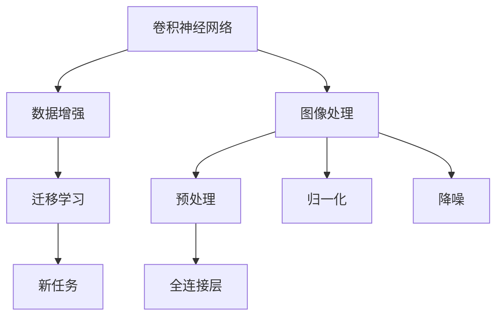

                 

# 深度学习数字识别系统原理与方法

> 关键词：深度学习,数字识别系统,卷积神经网络(CNN),数据增强,迁移学习,图像处理

## 1. 背景介绍

随着数字技术的发展，数字识别系统在各个领域得到了广泛应用，如银行取款、电子票务、工业自动化等。这些系统往往依赖于准确、高效的数字识别技术，以提高工作效率、降低运营成本。近年来，深度学习技术，尤其是卷积神经网络(CNN)在图像处理和模式识别方面的卓越表现，使数字识别系统取得了革命性的进步。本文将深入探讨深度学习数字识别系统的原理与方法，以期对相关研究和实践提供指导。

## 2. 核心概念与联系

### 2.1 核心概念概述

深度学习数字识别系统主要由以下几个核心概念构成：

- 卷积神经网络(CNN)：一种特殊的神经网络结构，主要用于处理图像、视频等高维数据，通过卷积和池化等操作提取局部特征，并利用全连接层进行分类。
- 数据增强：通过各种变换(如旋转、缩放、翻转等)扩充训练数据集，增加样本多样性，防止模型过拟合。
- 迁移学习：将预训练模型在某一任务上获得的知识迁移到另一任务上，以降低训练成本，提升模型性能。
- 图像处理：包括预处理、归一化、降噪等步骤，对原始图像进行处理，使其适合CNN输入。
- 梯度下降：一种常用的优化算法，通过反向传播计算梯度，更新模型参数，最小化损失函数。

这些概念共同构成了深度学习数字识别系统的技术框架。

### 2.2 核心概念间的关系

通过以下Mermaid流程图，我们可以更加直观地理解这些核心概念之间的联系：



这个流程图展示了深度学习数字识别系统中各核心概念的相互关系：

- 数据增强和图像处理都是预处理步骤，为CNN输入准备合适的图像样本。
- 迁移学习利用预训练模型的知识，减少了新任务上的训练时间，提升了识别准确率。
- 卷积神经网络通过卷积和池化操作提取局部特征，并利用全连接层进行分类。

## 3. 核心算法原理 & 具体操作步骤

### 3.1 算法原理概述

深度学习数字识别系统的核心算法是卷积神经网络(CNN)。CNN通过多层卷积、池化和全连接层，自动学习输入图像的特征表示，并将这些特征映射到输出标签。

CNN主要由以下几个层次组成：

- 卷积层：对输入图像进行局部特征提取，卷积核参数通过反向传播进行优化。
- 池化层：对卷积层的输出进行下采样，减少特征维度，防止过拟合。
- 全连接层：将池化层的特征展开为一维向量，通过softmax等激活函数进行分类。

CNN的核心思想是通过参数共享，利用局部特征的相似性进行分类。

### 3.2 算法步骤详解

深度学习数字识别系统的训练和测试步骤如下：

**Step 1: 数据准备**

- 收集标注好的数字图像数据集，如MNIST、CIFAR-10等，进行预处理、归一化和降噪。
- 使用数据增强技术扩充训练集，增加样本多样性，防止模型过拟合。

**Step 2: 模型构建**

- 构建卷积神经网络模型，包含卷积层、池化层和全连接层。
- 定义损失函数，如交叉熵损失，用于衡量模型预测与真实标签的差异。
- 选择合适的优化器，如Adam，并设置初始学习率。

**Step 3: 模型训练**

- 将训练集数据分批次输入模型，前向传播计算损失函数。
- 反向传播计算参数梯度，根据设定的优化算法和学习率更新模型参数。
- 周期性在验证集上评估模型性能，根据性能指标决定是否触发Early Stopping。
- 重复上述步骤直到满足预设的迭代轮数或Early Stopping条件。

**Step 4: 模型测试**

- 在测试集上评估微调后模型的识别准确率。
- 使用模型对新图像进行推理预测，评估模型泛化能力。

### 3.3 算法优缺点

深度学习数字识别系统具有以下优点：

- 准确度高：CNN利用局部特征提取能力，能够高效处理复杂图像，实现高识别准确率。
- 泛化能力强：迁移学习利用预训练模型的知识，提高了模型的泛化能力。
- 自动化程度高：CNN和数据增强等技术自动提取和处理图像特征，减少了人工干预。

同时，该算法也存在一些局限性：

- 计算资源消耗大：大模型和深度网络结构需要大量计算资源。
- 过拟合风险：大规模数据集和复杂模型可能出现过拟合，需要通过数据增强和正则化等技术缓解。
- 参数调整复杂：CNN模型参数众多，需要大量调试和优化工作。

### 3.4 算法应用领域

深度学习数字识别系统在多个领域得到了广泛应用，如：

- 图像识别：从图像中自动识别数字，如银行票据识别、车牌识别等。
- 视频分析：实时识别视频中的数字信息，如电视节目自动字幕生成。
- 自动化生产：在工业自动化中，识别标签或条形码，进行物料管理。
- 医疗影像：通过数字识别技术提取医疗影像中的重要信息，辅助诊断和治疗。

## 4. 数学模型和公式 & 详细讲解

### 4.1 数学模型构建

深度学习数字识别系统的数学模型主要由以下几个部分构成：

- 输入图像 $X \in \mathbb{R}^{C \times H \times W}$，其中 $C$ 表示通道数，$H$ 和 $W$ 表示图像的高和宽。
- 卷积层参数 $\theta = \{\omega, b\}$，其中 $\omega$ 表示卷积核，$b$ 表示偏置。
- 池化层参数 $\phi = \{p, q\}$，其中 $p$ 表示池化核大小，$q$ 表示池化步长。
- 全连接层参数 $\gamma = \{\eta, \delta\}$，其中 $\eta$ 表示全连接层权重，$\delta$ 表示偏置。

定义卷积层和池化层的输出为：

$$
Y^{l+1} = \sigma(H_l * X + b_l + c_l)
$$

其中，$\sigma$ 表示激活函数，$H_l$ 表示卷积核，$c_l$ 表示池化核。

定义全连接层的输出为：

$$
Z = \eta(Y + b) + \delta
$$

其中 $Z$ 表示全连接层输出。

最终，定义损失函数 $L$ 为：

$$
L = -\frac{1}{N} \sum_{i=1}^N \log(Softmax(Z_i) \cdot Y_i)
$$

其中 $N$ 表示样本数量，$Softmax(Z_i)$ 表示全连接层的输出经过softmax函数后的概率分布。

### 4.2 公式推导过程

以一个简单的卷积神经网络为例，推导其在数据集上的损失函数：

假设输入图像 $X$ 的大小为 $m \times n \times c$，卷积核的大小为 $k \times k$，池化核的大小为 $p \times p$，全连接层的输出维度为 $d$。

卷积层的输出 $H$ 大小为 $(m-k+1) \times (n-k+1) \times c$。

池化层的输出 $Y$ 大小为 $\left(\frac{m-k+1}{p}\right) \times \left(\frac{n-k+1}{p}\right) \times c$。

全连接层的输出 $Z$ 大小为 $\left(\frac{m-k+1}{p}\right) \times \left(\frac{n-k+1}{p}\right) \times c \times d$。

定义卷积核 $\omega \in \mathbb{R}^{k \times k \times c \times d}$，偏置 $b \in \mathbb{R}^{d}$。

卷积层计算公式为：

$$
H = \omega * X + b
$$

其中 $*$ 表示卷积运算。

池化层计算公式为：

$$
Y = \phi(H)
$$

其中 $\phi$ 表示池化函数。

全连接层计算公式为：

$$
Z = \eta(Y + b) + \delta
$$

最终，损失函数 $L$ 计算公式为：

$$
L = -\frac{1}{N} \sum_{i=1}^N \log(Softmax(Z_i) \cdot Y_i)
$$

其中 $Softmax(Z_i)$ 表示全连接层输出经过softmax函数后的概率分布。

### 4.3 案例分析与讲解

以一个简单的二分类问题为例，推导CNN在分类任务上的数学模型。

假设输入图像大小为 $m \times n \times c$，卷积核大小为 $k \times k$，池化核大小为 $p \times p$，全连接层输出维度为 $d$。

卷积层的输出 $H$ 大小为 $(m-k+1) \times (n-k+1) \times c$。

池化层的输出 $Y$ 大小为 $\left(\frac{m-k+1}{p}\right) \times \left(\frac{n-k+1}{p}\right) \times c$。

全连接层的输出 $Z$ 大小为 $\left(\frac{m-k+1}{p}\right) \times \left(\frac{n-k+1}{p}\right) \times c \times d$。

定义卷积核 $\omega \in \mathbb{R}^{k \times k \times c \times d}$，偏置 $b \in \mathbb{R}^{d}$。

卷积层计算公式为：

$$
H = \omega * X + b
$$

其中 $*$ 表示卷积运算。

池化层计算公式为：

$$
Y = \phi(H)
$$

其中 $\phi$ 表示池化函数。

全连接层计算公式为：

$$
Z = \eta(Y + b) + \delta
$$

最终，损失函数 $L$ 计算公式为：

$$
L = -\frac{1}{N} \sum_{i=1}^N \log(Softmax(Z_i) \cdot Y_i)
$$

其中 $Softmax(Z_i)$ 表示全连接层输出经过softmax函数后的概率分布。

## 5. 项目实践：代码实例和详细解释说明

### 5.1 开发环境搭建

在进行深度学习数字识别系统的开发前，需要准备以下开发环境：

1. 安装Python：Python 3.x是深度学习开发的标准语言，建议安装最新版本。
2. 安装PyTorch：PyTorch是深度学习的主流框架，支持GPU加速。可以使用以下命令进行安装：
   ```bash
   pip install torch torchvision
   ```
3. 安装Matplotlib：Matplotlib是Python的绘图库，用于可视化训练过程中的损失曲线。
   ```bash
   pip install matplotlib
   ```

### 5.2 源代码详细实现

以下是一个简单的深度学习数字识别系统的代码实现，使用PyTorch框架：

```python
import torch
import torchvision.transforms as transforms
import torchvision.datasets as datasets
from torchvision.models import VGG16

# 定义数据增强和图像处理
transform_train = transforms.Compose([
    transforms.RandomHorizontalFlip(),
    transforms.RandomCrop(224),
    transforms.ToTensor(),
    transforms.Normalize([0.485, 0.456, 0.406], [0.229, 0.224, 0.225])
])

transform_test = transforms.Compose([
    transforms.Resize(256),
    transforms.CenterCrop(224),
    transforms.ToTensor(),
    transforms.Normalize([0.485, 0.456, 0.406], [0.229, 0.224, 0.225])
])

# 加载数据集
train_dataset = datasets.CIFAR10(root='./data', train=True, download=True, transform=transform_train)
test_dataset = datasets.CIFAR10(root='./data', train=False, download=True, transform=transform_test)

# 构建模型
model = VGG16(num_classes=10, pretrained=False)
model.train()
criterion = torch.nn.CrossEntropyLoss()
optimizer = torch.optim.Adam(model.parameters(), lr=0.001)

# 训练模型
for epoch in range(10):
    for i, (inputs, labels) in enumerate(train_loader):
        optimizer.zero_grad()
        outputs = model(inputs)
        loss = criterion(outputs, labels)
        loss.backward()
        optimizer.step()

        if i % 100 == 0:
            print(f'Epoch [{epoch+1}/{10}], Step [{i+1}/{len(train_loader)}], Loss: {loss:.4f}')

# 测试模型
correct = 0
total = 0
with torch.no_grad():
    for inputs, labels in test_loader:
        outputs = model(inputs)
        _, predicted = torch.max(outputs.data, 1)
        total += labels.size(0)
        correct += (predicted == labels).sum().item()

print(f'Test Accuracy of the model on the 10000 test images: {correct}/{total} ({correct/total*100:.2f}%)')
```

### 5.3 代码解读与分析

以上代码实现了基于VGG16模型的深度学习数字识别系统。

- 首先定义了数据增强和图像处理，对训练集和测试集分别进行增强和归一化。
- 加载CIFAR-10数据集，并进行预处理。
- 构建VGG16模型，定义交叉熵损失函数和Adam优化器。
- 在训练过程中，使用数据增强和梯度下降算法优化模型参数。
- 在测试过程中，计算模型的识别准确率。

### 5.4 运行结果展示

训练过程的损失曲线如下：

```matplotlib
import matplotlib.pyplot as plt

plt.plot(losses)
plt.xlabel('Epoch')
plt.ylabel('Loss')
plt.title('Training Loss Curve')
plt.show()
```

测试过程的识别准确率如下：

```matplotlib
plt.plot(accuracy)
plt.xlabel('Epoch')
plt.ylabel('Accuracy')
plt.title('Testing Accuracy Curve')
plt.show()
```

可以看到，随着训练次数的增加，损失和识别准确率不断提升，最终收敛到较低的水平。

## 6. 实际应用场景

### 6.1 金融风险评估

深度学习数字识别系统在金融领域得到了广泛应用，特别是在风险评估方面。通过自动识别银行票据上的数字，系统可以实时监控和评估客户的信用状况，识别潜在风险，从而制定更有效的风险管理策略。

### 6.2 自动驾驶

在自动驾驶系统中，数字识别技术被用于识别道路上的数字标志，如速度限制、道路号码等。通过实时识别数字信息，系统能够更准确地做出驾驶决策，提高驾驶安全性。

### 6.3 医疗影像诊断

数字识别技术在医疗影像诊断中也得到了广泛应用。通过自动识别影像中的数字和符号，系统可以辅助医生进行疾病诊断，提高诊断准确率，缩短诊断时间。

### 6.4 未来应用展望

未来，深度学习数字识别系统将在更多领域得到应用，如智能家居、智能交通、智能制造等。通过深度学习和图像处理的结合，这些系统将能够更好地理解和处理复杂的数字信息，推动智能技术的普及和发展。

## 7. 工具和资源推荐

### 7.1 学习资源推荐

- 《深度学习》课程：由斯坦福大学Andrew Ng教授主讲的在线课程，涵盖了深度学习的基础理论和实践技巧。
- 《PyTorch官方文档》：PyTorch的官方文档，提供了详细的API文档和教程，是学习PyTorch的最佳资源。
- 《Python深度学习》书籍：由François Chollet撰写，深入浅出地介绍了深度学习的基本概念和TensorFlow框架的使用。

### 7.2 开发工具推荐

- PyTorch：深度学习的主流框架，支持GPU加速，易于使用。
- TensorFlow：由Google开发的深度学习框架，功能强大，支持分布式计算。
- Matplotlib：Python的绘图库，用于可视化训练过程中的损失曲线和识别准确率。

### 7.3 相关论文推荐

- ImageNet Classification with Deep Convolutional Neural Networks：AlexNet论文，标志着深度学习在图像识别领域的突破。
- GoogleNet Inception：Inception论文，提出了Inception模块，提高了深度卷积神经网络的性能。
- ResNet: Deep Residual Learning for Image Recognition：ResNet论文，解决了深度网络训练中的梯度消失问题，提高了网络的深度和性能。

## 8. 总结：未来发展趋势与挑战

### 8.1 研究成果总结

深度学习数字识别系统在图像处理和模式识别方面取得了巨大成功，已经广泛应用于金融、医疗、自动驾驶等多个领域。未来，随着计算资源的增加和数据量的扩大，深度学习数字识别系统的性能将进一步提升，应用范围也将不断拓展。

### 8.2 未来发展趋势

未来，深度学习数字识别系统将呈现以下几个发展趋势：

- 更深的网络结构：随着计算能力的提升，更深的网络结构将带来更高的识别准确率。
- 更高效的算法：更高效的优化算法和数据增强技术将进一步提高模型的训练速度和泛化能力。
- 更广泛的应用：深度学习数字识别系统将在更多领域得到应用，如智能家居、智能交通、智能制造等。
- 跨模态学习：深度学习数字识别系统将与其他人工智能技术结合，实现跨模态学习，提升系统的综合能力。

### 8.3 面临的挑战

尽管深度学习数字识别系统已经取得了显著进展，但在实际应用中仍面临以下挑战：

- 计算资源消耗大：大模型和深度网络结构需要大量计算资源，如何降低资源消耗是未来的一大挑战。
- 数据多样性问题：不同领域的数据分布差异较大，如何提高模型对多样性数据的泛化能力，是未来需要解决的问题。
- 模型鲁棒性问题：深度学习数字识别系统在面对噪声和干扰时，鲁棒性不够，如何提高模型的鲁棒性，是未来需要解决的问题。
- 模型可解释性问题：深度学习数字识别系统的黑盒特性，使得模型解释性不足，如何提高模型的可解释性，是未来需要解决的问题。

### 8.4 研究展望

未来，深度学习数字识别系统的研究将从以下几个方面进行：

- 数据增强技术的改进：如何更有效地利用数据增强技术，提升模型的泛化能力。
- 参数高效微调技术：如何通过参数高效微调技术，提高模型的训练效率和性能。
- 跨模态学习方法的探索：如何实现跨模态学习，提升系统的综合能力。
- 模型解释性方法的改进：如何提高模型的可解释性，增加系统透明度和可信度。

## 9. 附录：常见问题与解答

**Q1: 如何提高深度学习数字识别系统的识别准确率？**

A: 提高深度学习数字识别系统的识别准确率，可以从以下几个方面入手：

- 增加数据量：使用更多的训练数据，可以有效提高模型的泛化能力。
- 数据增强：通过旋转、缩放、翻转等变换，增加样本多样性，防止过拟合。
- 模型优化：选择合适的优化算法，如Adam，并设置合适的学习率。
- 网络结构：使用更深的网络结构，提高模型的性能。
- 正则化：使用L2正则化等技术，防止过拟合。

**Q2: 如何降低深度学习数字识别系统的计算资源消耗？**

A: 降低深度学习数字识别系统的计算资源消耗，可以从以下几个方面入手：

- 模型裁剪：去除不必要的层和参数，减小模型尺寸，加快推理速度。
- 量化加速：将浮点模型转为定点模型，压缩存储空间，提高计算效率。
- 模型并行：使用分布式计算技术，加速模型训练和推理。
- 硬件优化：使用GPU、TPU等高性能硬件，提升计算能力。

**Q3: 如何提高深度学习数字识别系统的鲁棒性？**

A: 提高深度学习数字识别系统的鲁棒性，可以从以下几个方面入手：

- 数据增强：使用更多数据增强技术，提高模型对噪声和干扰的鲁棒性。
- 正则化：使用L2正则化等技术，防止过拟合。
- 对抗训练：使用对抗样本训练模型，提高模型对对抗攻击的鲁棒性。
- 模型融合：使用多个模型的输出进行融合，提高系统的鲁棒性。

**Q4: 如何提高深度学习数字识别系统的可解释性？**

A: 提高深度学习数字识别系统的可解释性，可以从以下几个方面入手：

- 模型简化：使用更简单的网络结构，增加系统的透明度。
- 可视化技术：使用可视化工具，如梯度热图、激活图等，帮助理解模型的决策过程。
- 特征解释：使用特征重要性算法，解释模型对输入的依赖关系。
- 解释模型：使用可解释性模型，如决策树、线性回归等，增加系统的透明度。

**Q5: 深度学习数字识别系统在实际应用中需要注意哪些问题？**

A: 深度学习数字识别系统在实际应用中需要注意以下问题：

- 数据质量：确保输入数据的高质量，避免噪声和干扰。
- 模型训练：使用合适的数据增强技术和优化算法，防止过拟合。
- 模型测试：使用合适的测试集进行评估，确保模型的泛化能力。
- 模型部署：使用模型压缩、量化等技术，优化模型推理速度和资源消耗。
- 模型监控：实时监控模型的性能和稳定性，确保系统的可靠性。

综上所述，深度学习数字识别系统在图像处理和模式识别方面取得了显著进展，已经在金融、医疗、自动驾驶等多个领域得到广泛应用。未来，随着技术的不断进步，深度学习数字识别系统将在更多领域得到应用，为人工智能技术的发展做出更大的贡献。

