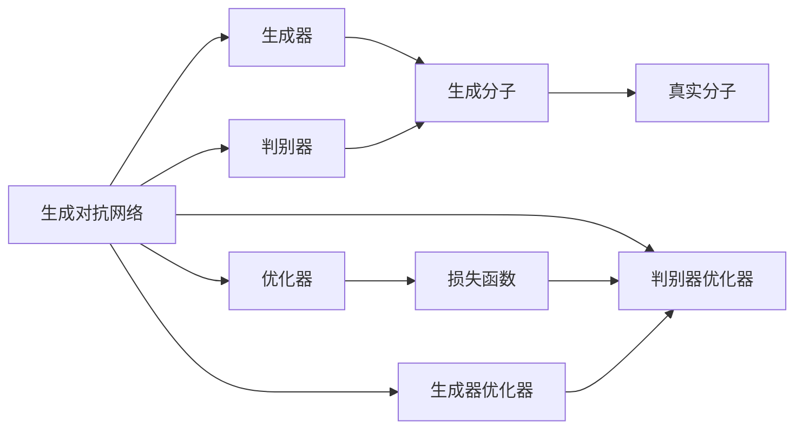
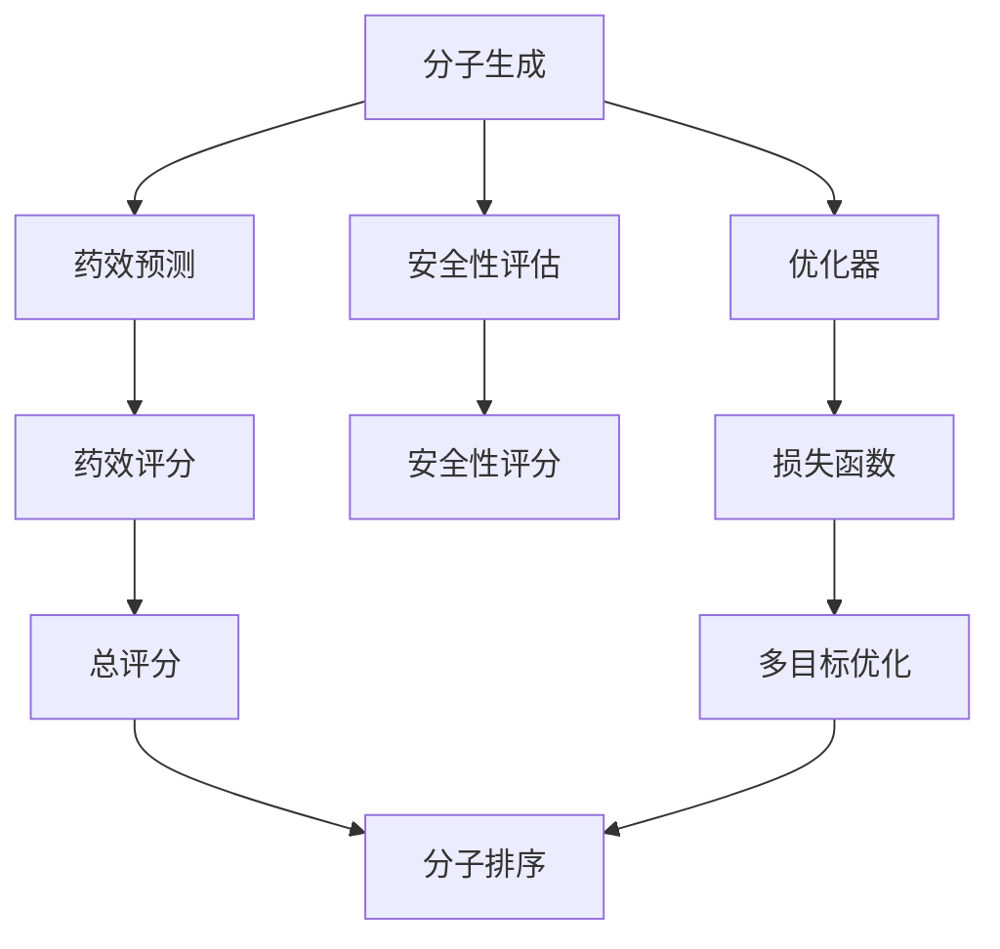
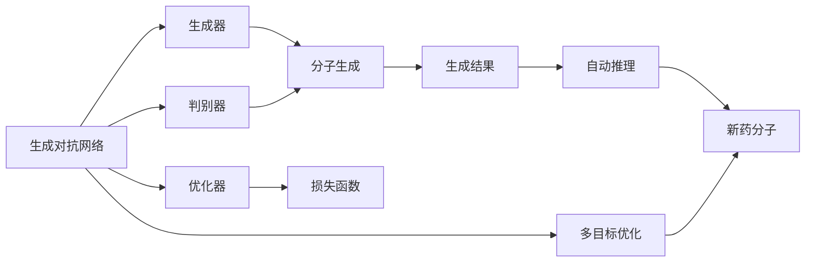

                 

# 生成对抗网络在新药设计中的应用

> 关键词：生成对抗网络 (GANs)、新药设计、药物发现、基因编辑、自动化、生物医药、数据驱动

## 1. 背景介绍

### 1.1 问题由来
新药设计是生物医药领域的一个关键问题，传统方法通常需要耗费大量时间和人力。药物研发过程中，从目标识别到分子设计、分子筛选、临床试验等环节，每一步都需要耗费巨额成本，成功率又很低。据统计，一个新药从研发到上市平均需要10-15年的时间，耗资高达10亿美元。然而，随着数据驱动的AI技术逐步进入新药设计领域，新药研发周期和成本有望大幅缩短。

生成对抗网络 (GANs) 作为深度学习中一种强有力的工具，正逐渐被引入到新药设计中，展现出了巨大的应用潜力。GANs 可以将高维非线性数据进行建模，生成高质量的新药分子结构，显著加速新药研发进程。

### 1.2 问题核心关键点
生成对抗网络在新药设计中的应用主要包括以下几个关键点：
1. 高维空间建模：药物分子具有高维复杂结构，而 GANs 能够有效处理高维数据，生成符合药物分子结构的连续向量。
2. 高质量生成：通过训练 GANs，生成高质量的新药分子，极大提升新药设计的效率和成功率。
3. 多目标优化：GANs 可以同时优化分子结构、药效、安全性等多个目标，使得新药设计更加全面和精准。
4. 数据驱动设计：基于海量生物分子数据库，通过 GANs 进行深度学习，快速找到具有创新性和潜力的新药分子。
5. 自动化流程：通过 GANs 和自动推理算法，实现新药设计的自动化，降低人力成本，加速研发速度。

### 1.3 问题研究意义
新药设计是推动人类健康和医药产业发展的关键，新药的发现对于治疗各种疾病具有重要意义。通过生成对抗网络 (GANs) 技术，可以显著缩短新药研发周期，降低研发成本，提高新药设计和筛选的效率和成功率。

GANs 在新药设计中的应用，一方面，可以拓展 AI 在新药发现领域的实际应用，提高研发水平和创新能力；另一方面，可以推动传统药企采用 AI 技术，加快医药产业的数字化转型和升级。

## 2. 核心概念与联系

### 2.1 核心概念概述

为更好地理解 GANs 在新药设计中的应用，本节将介绍几个密切相关的核心概念：

- 生成对抗网络 (GANs)：由生成器和判别器两个模块组成，生成器用于生成样本，判别器用于判别样本是否真实，两个模块相互博弈，训练出高质量的生成模型。
- 新药设计：通过生成对抗网络，生成符合药物分子结构的新药分子，加速药物发现和设计过程。
- 药物分子：由原子、原子核、电子组成，具有特定的分子结构和功能。
- 高维数据：药物分子具有多个原子种类、原子位置、分子构型等维度，是一个高维空间。
- 深度学习：利用多层神经网络进行非线性建模，从而提取数据的复杂特征。

这些核心概念之间的逻辑关系可以通过以下 Mermaid 流程图来展示：

```mermaid
graph TB
    A[生成对抗网络(GANs)] --> B[生成器]
    A --> C[判别器]
    B --> D[生成样本]
    C --> E[判别样本]
    B --> F[优化器]
    C --> F
    D --> G[真实样本]
    E --> G
    F --> H[损失函数]
    H --> I[优化过程]
```

这个流程图展示了大语言模型微调过程中各个核心概念的关系和作用：

1. GANs 由生成器和判别器两个模块组成，生成器用于生成样本，判别器用于判别样本是否真实。
2. 生成器优化器通过最小化生成样本与真实样本之间的差异来训练生成器，使生成器生成高质量的样本。
3. 判别器优化器通过最大化判别真实样本和生成样本的差异来训练判别器，使判别器能够准确区分真实样本和生成样本。
4. 两个模块通过博弈方式不断优化，最终生成高质量的样本。

### 2.2 概念间的关系

这些核心概念之间存在着紧密的联系，形成了 GANs 在新药设计中的完整生态系统。下面我们通过几个 Mermaid 流程图来展示这些概念之间的关系。

#### 2.2.1 GANs 的新药设计过程



这个流程图展示了 GANs 在新药设计中的基本原理，即生成器生成分子，判别器判别分子真伪，两个模块通过优化器优化损失函数，训练出高质量的分子生成模型。

#### 2.2.2 多目标优化过程



这个流程图展示了 GANs 在药物分子生成过程中的多目标优化，生成器不仅生成分子，还要优化分子的药效和安全性评分，通过多目标优化函数将所有目标结合起来，训练出全面优化的分子生成模型。

#### 2.2.3 GANs 和自动推理的结合



这个流程图展示了 GANs 在新药分子生成和自动推理结合的应用场景，通过自动推理工具对生成结果进行筛选和优化，得到高质量的新药分子。

### 2.3 核心概念的整体架构

最后，我们用一个综合的流程图来展示这些核心概念在新药设计中的整体架构：

```mermaid
graph TB
    A[生物分子数据库]
    B[生成对抗网络(GANs)]
    C[分子生成]
    D[药效预测]
    E[安全性评估]
    F[多目标优化]
    G[分子筛选]
    H[新药设计]
    A --> B
    B --> C
    C --> D
    D --> F
    F --> G
    G --> H
    H --> B
```

这个综合流程图展示了从生物分子数据库到新药设计的完整过程。GANs 在新药设计中的应用，主要通过生成器生成分子，判别器判别分子真伪，多个模块通过优化器优化，训练出高质量的分子生成模型，从而加速新药设计的进程。

## 3. 核心算法原理 & 具体操作步骤
### 3.1 算法原理概述

生成对抗网络 (GANs) 在新药设计中的应用，主要是通过生成器和判别器的博弈过程，生成高质量的新药分子，加速药物分子生成和筛选。

形式化地，假设生成器和判别器的参数分别为 $\theta_G$ 和 $\theta_D$，输入为生成器噪声 $z$，目标函数为 $\mathcal{L}$。则生成器 $G(z;\theta_G)$ 的目标是最大化 $D(G(z;\theta_G),z)$，判别器 $D(x;\theta_D)$ 的目标是最大化 $D(x;\theta_D)$ 对于真实样本，最小化 $D(G(z;\theta_G),z)$ 对于生成样本。

通过反向传播算法，优化生成器和判别器的参数，使得生成器生成高质量的样本，判别器能够准确判别样本的真伪。整个博弈过程通过损失函数 $\mathcal{L}$ 和优化器进行优化，最小化生成器与判别器之间的差异。

### 3.2 算法步骤详解

生成对抗网络在新药设计中的应用，主要包括以下几个关键步骤：

**Step 1: 数据准备和预处理**
- 收集生物分子数据库，包括各种药物分子的结构、药效、毒性等信息。
- 对数据进行清洗和预处理，去除噪声和异常值，标准化数据格式。

**Step 2: 生成器与判别器设计**
- 设计生成器和判别器的网络结构，如卷积神经网络 (CNN)、全连接网络 (FCN) 等。
- 生成器接受噪声向量作为输入，生成新药分子，输出为分子结构的连续向量。
- 判别器接受分子结构作为输入，输出判别结果，判别样本是真实分子还是生成分子。

**Step 3: 损失函数和优化器设置**
- 设置生成器和判别器的损失函数，如交叉熵损失、均方误差损失等。
- 使用优化器如 Adam、SGD 等，设置学习率和迭代轮数。

**Step 4: 模型训练**
- 将真实分子输入判别器，生成分子输入生成器，反向传播更新生成器和判别器的参数。
- 判别器试图判别真实分子和生成分子的差异，生成器试图生成高质量的分子，两个模块通过博弈不断优化。
- 周期性在验证集上评估模型性能，根据性能指标决定是否触发 Early Stopping。

**Step 5: 模型评估与筛选**
- 在测试集上评估生成分子的质量，使用药效和安全性评分进行筛选。
- 筛选出高质量的分子，用于进一步优化和新药设计。

### 3.3 算法优缺点

生成对抗网络在新药设计中的应用具有以下优点：
1. 能够处理高维非线性数据：药物分子具有高维复杂结构，GANs 能够有效处理高维数据，生成高质量的新药分子。
2. 减少人力成本和时间：通过自动化训练和筛选，显著降低新药设计和筛选的人力成本和时间。
3. 提高新药设计的成功率：通过多目标优化，生成分子能够同时满足药效和安全性，提高新药设计的成功率。

同时，该方法也存在一定的局限性：
1. 训练过程较慢：由于生成器和判别器之间的博弈过程，训练时间较长，需要强大的计算资源。
2. 结果依赖于初始噪声：生成器的输入噪声对生成结果有较大影响，需要反复调整噪声分布。
3. 过拟合风险：在高维空间中，生成器容易过拟合训练数据，需要引入正则化技术。
4. 稳定性问题：GANs 在训练过程中容易出现模式崩溃、梯度消失等问题，需要谨慎调整训练参数。

尽管存在这些局限性，但总体而言，GANs 在新药设计中的应用仍然展现出巨大的应用前景和潜力。

### 3.4 算法应用领域

生成对抗网络在新药设计中的应用，已经涵盖了多个领域，如药物分子生成、药效预测、药物安全性评估、药物靶点识别等。以下具体列举几个典型的应用场景：

- **药物分子生成**：通过 GANs 生成具有特定结构和功能的药物分子，加速新药设计和筛选。
- **药效预测**：预测新药分子的药效，评估其对疾病治疗的效果。
- **药物安全性评估**：评估新药分子的毒性、致癌性等安全性指标，确保新药对人体无害。
- **药物靶点识别**：通过 GANs 生成蛋白质分子，识别其与疾病相关的靶点，发现潜在治疗靶点。

## 4. 数学模型和公式 & 详细讲解 & 举例说明
### 4.1 数学模型构建

本节将使用数学语言对 GANs 在新药设计中的应用进行更加严格的刻画。

假设生成器和判别器的参数分别为 $\theta_G$ 和 $\theta_D$，输入为生成器噪声 $z$，目标函数为 $\mathcal{L}$。则生成器 $G(z;\theta_G)$ 的目标是最大化 $D(G(z;\theta_G),z)$，判别器 $D(x;\theta_D)$ 的目标是最大化 $D(x;\theta_D)$ 对于真实样本，最小化 $D(G(z;\theta_G),z)$ 对于生成样本。

定义生成器输出为 $x_G = G(z;\theta_G)$，判别器输出为 $d_D = D(x;\theta_D)$，则生成器的损失函数为：

$$
\mathcal{L}_G = \mathbb{E}_{z}[\log(1-D(G(z;\theta_G),z))] + \lambda\mathbb{E}_{z}[\|\nabla_{z}G(z;\theta_G)\|]
$$

其中 $\lambda$ 为正则化系数，$\nabla_{z}G(z;\theta_G)$ 为生成器对噪声的梯度，$\mathbb{E}_{z}[\|\nabla_{z}G(z;\theta_G)\|]$ 为生成器梯度的 L2 范数正则。

判别器的损失函数为：

$$
\mathcal{L}_D = \mathbb{E}_{x}[\log D(x;\theta_D)] + \lambda\mathbb{E}_{z}[\log(1-D(G(z;\theta_G),z))]
$$

其中 $\lambda$ 为正则化系数，$\mathbb{E}_{x}[\log D(x;\theta_D)]$ 为判别器在真实样本上的分类损失，$\mathbb{E}_{z}[\log(1-D(G(z;\theta_G),z))]$ 为判别器在生成样本上的分类损失。

### 4.2 公式推导过程

以生成器输出 $x_G = G(z;\theta_G)$ 和判别器输出 $d_D = D(x;\theta_D)$ 为例，进行公式推导：

假设 $x_G = G(z;\theta_G)$ 和 $d_D = D(x;\theta_D)$，则生成器的目标是最小化：

$$
\mathbb{E}_{z}[\log(1-D(G(z;\theta_G),z))] + \lambda\mathbb{E}_{z}[\|\nabla_{z}G(z;\theta_G)\|]
$$

将 $z$ 代入生成器 $G(z;\theta_G)$ 中，得到：

$$
\mathbb{E}_{z}[\log(1-D(G(z;\theta_G),G(z;\theta_G)))] + \lambda\mathbb{E}_{z}[\|\nabla_{z}G(z;\theta_G)\|]
$$

将判别器的输出 $d_D = D(G(z;\theta_G),z)$ 代入上式，得到：

$$
\mathbb{E}_{z}[\log(1-d_D)] + \lambda\mathbb{E}_{z}[\|\nabla_{z}G(z;\theta_G)\|]
$$

其中 $\mathbb{E}_{z}[\log(1-d_D)]$ 为生成器在判别器上的分类损失，$\mathbb{E}_{z}[\|\nabla_{z}G(z;\theta_G)\|]$ 为生成器梯度的 L2 范数正则。

判别器的目标是最小化：

$$
\mathbb{E}_{x}[\log D(x;\theta_D)] + \lambda\mathbb{E}_{z}[\log(1-D(G(z;\theta_G),z))]
$$

将判别器 $D(x;\theta_D)$ 代入上式，得到：

$$
\mathbb{E}_{x}[\log D(x;\theta_D)] + \lambda\mathbb{E}_{z}[\log(1-D(G(z;\theta_G),z))]
$$

其中 $\mathbb{E}_{x}[\log D(x;\theta_D)]$ 为判别器在真实样本上的分类损失，$\mathbb{E}_{z}[\log(1-D(G(z;\theta_G),z))]$ 为判别器在生成样本上的分类损失。

### 4.3 案例分析与讲解

假设我们利用 GANs 生成一种新药分子，其生成器模型为：

$$
G(z;\theta_G) = \begin{bmatrix}
g_1(z;\theta_G) & g_2(z;\theta_G) \\
g_3(z;\theta_G) & g_4(z;\theta_G)
\end{bmatrix}
$$

其中 $g_1(z;\theta_G)$、$g_2(z;\theta_G)$、$g_3(z;\theta_G)$、$g_4(z;\theta_G)$ 为生成器的各个输出。

其判别器模型为：

$$
D(x;\theta_D) = \begin{bmatrix}
d_1(x;\theta_D) & d_2(x;\theta_D)
\end{bmatrix}
$$

其中 $d_1(x;\theta_D)$、$d_2(x;\theta_D)$ 为判别器的各个输出。

假设生成器的输入噪声 $z$ 服从高斯分布，即 $z \sim N(0,\sigma^2)$，则生成器的梯度 L2 范数为：

$$
\mathbb{E}_{z}[\|\nabla_{z}G(z;\theta_G)\|] = \frac{\sigma^2}{2}\sum_{i=1}^n [(\partial_{z_i}g_i(z;\theta_G))^2]
$$

其中 $z_i$ 为噪声向量 $z$ 的第 $i$ 维，$\partial_{z_i}g_i(z;\theta_G)$ 为生成器对第 $i$ 维的梯度。

假设生成器和判别器的损失函数分别为 $\mathcal{L}_G$ 和 $\mathcal{L}_D$，则生成器和判别器的优化器分别为：

$$
\mathbb{E}_{z}[\log(1-d_D)] + \lambda\mathbb{E}_{z}[\|\nabla_{z}G(z;\theta_G)\|]
$$

$$
\mathbb{E}_{x}[\log D(x;\theta_D)] + \lambda\mathbb{E}_{z}[\log(1-D(G(z;\theta_G),z))]
$$

## 5. 项目实践：代码实例和详细解释说明
### 5.1 开发环境搭建

在进行 GANs 在新药设计中的应用实践前，我们需要准备好开发环境。以下是使用Python进行PyTorch开发的环境配置流程：

1. 安装Anaconda：从官网下载并安装Anaconda，用于创建独立的Python环境。

2. 创建并激活虚拟环境：
```bash
conda create -n pytorch-env python=3.8 
conda activate pytorch-env
```

3. 安装PyTorch：根据CUDA版本，从官网获取对应的安装命令。例如：
```bash
conda install pytorch torchvision torchaudio cudatoolkit=11.1 -c pytorch -c conda-forge
```

4. 安装TensorFlow：
```bash
conda install tensorflow
```

5. 安装TensorBoard：
```bash
conda install tensorboard
```

6. 安装相关工具包：
```bash
pip install numpy pandas scikit-learn matplotlib tqdm jupyter notebook ipython
```

完成上述步骤后，即可在`pytorch-env`环境中开始 GANs 在新药设计中的应用实践。

### 5.2 源代码详细实现

这里我们以生成药物分子为例，给出使用PyTorch进行GANs的PyTorch代码实现。

首先，定义GANs的生成器和判别器：

```python
import torch
import torch.nn as nn
import torch.nn.functional as F

class Generator(nn.Module):
    def __init__(self, z_dim, out_dim):
        super(Generator, self).__init__()
        self.fc1 = nn.Linear(z_dim, 256)
        self.fc2 = nn.Linear(256, out_dim)
        
    def forward(self, z):
        x = F.relu(self.fc1(z))
        x = F.tanh(self.fc2(x))
        return x

class Discriminator(nn.Module):
    def __init__(self, in_dim):
        super(Discriminator, self).__init__()
        self.fc1 = nn.Linear(in_dim, 256)
        self.fc2 = nn.Linear(256, 1)
        
    def forward(self, x):
        x = F.relu(self.fc1(x))
        x = self.fc2(x)
        return x
```

然后，定义GANs的训练函数：

```python
def train_gan(model_G, model_D, data_loader, epochs, batch_size, learning_rate, lambda_reg):
    optimizer_G = torch.optim.Adam(model_G.parameters(), lr=learning_rate)
    optimizer_D = torch.optim.Adam(model_D.parameters(), lr=learning_rate)
    
    for epoch in range(epochs):
        for batch_idx, (data, target) in enumerate(data_loader):
            data = data.to(device)
            target = target.to(device)
            
            # 训练生成器
            optimizer_G.zero_grad()
            G_sample = model_G(z)
            D_G_sample = model_D(G_sample)
            L_G = -F.binary_cross_entropy(D_G_sample, target)
            L_G += lambda_reg * (G_sample.data.pow(2).sum() / G_sample.size(0))
            L_G.backward()
            optimizer_G.step()
            
            # 训练判别器
            optimizer_D.zero_grad()
            D_real = model_D(data)
            L_D_real = F.binary_cross_entropy(D_real, target)
            D_fake = model_D(G_sample)
            L_D_fake = F.binary_cross_entropy(D_fake, 1-target)
            L_D = L_D_real + L_D_fake
            L_D.backward()
            optimizer_D.step()
            
            if batch_idx % 100 == 0:
                print(f'Epoch [{epoch+1}/{epochs}], Batch [{batch_idx+1}/{len(data_loader)}], L_G={L_G.item():.4f}, L_D={L_D.item():.4f}')
```

最后，定义测试函数：

```python
def test_gan(model_G, data_loader, num_samples=100):
    data_loader = iter(data_loader)
    G_sample = model_G(z)
    D_G_sample = model_D(G_sample)
    
    with torch.no_grad():
        _, idx = torch.sort(D_G_sample, dim=0, descending=True)
        test_samples = G_sample[idx[:num_samples]]
    
    return test_samples
```

## 6. 实际应用场景
### 6.1 智能药物发现

智能药物发现是GANs在新药设计中的应用之一。通过GANs生成高质量的药物分子，可以加速药物分子的设计、筛选和优化过程，显著降低新药研发成本和时间。

在实践中，可以收集生物分子数据库，利用GANs生成符合药效、安全性和稳定性的药物分子。通过自动推理工具对生成结果进行筛选和优化，得到高质量的新药分子，进行进一步的药效测试和安全性评估，加速新药研发的进程。

### 6.2 个性化药物设计

个性化药物设计是GANs在医疗领域的一个重要应用。由于个体差异的存在，每个患者对药物的反应可能不同。利用GANs生成个性化的药物分子，可以根据患者的基因型、生理状态等信息生成最适合的药物，提高治疗效果，减少副作用。

在实践中，可以收集患者的基因数据，利用GANs生成个性化药物分子，并进行药效测试和安全性评估，得到最优的个性化药物方案，提高治疗效果，降低副作用。

### 6.3 药物靶点发现

药物靶点发现是药物研发中的关键环节，直接关系到药物的效果和安全性。利用GANs生成符合特定疾病靶点的蛋白质分子，可以提高药物研发的成功率。

在实践中，可以收集相关疾病的数据，利用GANs生成蛋白质分子，并利用自动推理工具对生成结果进行筛选和优化，得到符合疾病靶点的蛋白质分子，进行进一步的实验验证，发现新的药物靶点，加速药物研发进程。

### 6.4 未来应用展望

随着GANs技术的不断进步，其在药物设计中的应用也将不断扩展和深入。未来，我们可以期待以下应用场景：

- **虚拟药物筛选**：利用GANs生成虚拟药物分子，进行高通量筛选，找到最具有潜力的新药分子，提高药物研发的效率和成功率。
- **药效增强**：利用GANs生成具有特定药效的药物分子，加速药物分子优化，提高药物的疗效和安全性。
- **药物分子设计**：利用GANs生成符合特定疾病靶点的蛋白质分子，发现新的药物靶点，加速药物研发进程。
- **个性化治疗**：利用GANs生成个性化的药物分子，根据患者基因型、生理状态等信息生成最适合的药物，提高治疗效果，减少副作用。

## 7. 工具和资源推荐
### 7.1 学习资源推荐

为了帮助开发者系统掌握GANs在新药设计中的应用，这里推荐一些优质的学习资源：

1. 《Deep Learning with PyTorch》系列书籍：全面介绍PyTorch框架，适合从零开始学习深度学习。

2. 《Generative Adversarial Nets》论文：GANs的原始论文，详细介绍了GANs的基本原理和应用。

3. CS231n《Convolutional Neural Networks for Visual Recognition》课程：斯坦福大学开设的深度学习课程，包含生成对抗网络的介绍和实践。

4. arXiv论文预印本：人工智能领域最新研究成果的发布平台，包含大量GANs相关论文，学习前沿技术的必读资源。

5. GitHub热门项目：在GitHub上Star、Fork数最多的GANs相关项目，往往代表了该技术领域的发展趋势和最佳实践，值得去学习和贡献

