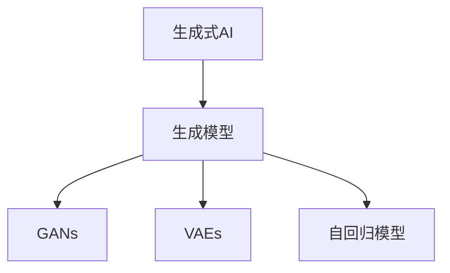

                 

# 生成式AIGC是金矿还是泡沫：不拥抱AI的企业肯定会被淘汰

## 1. 背景介绍

在科技飞速发展的今天，人工智能（AI）和生成式AI（Generative AI，简称AIGC）技术已经成为全球企业技术升级的标配。从内容创作到客户服务，从自动驾驶到健康医疗，生成式AI正渗透到各行各业的各个角落。与此同时，以ChatGPT、DALL·E等为代表的AIGC模型层出不穷，持续引领着AI领域的创新浪潮。然而，AIGC技术在带来巨大机遇的同时，也引发了关于其未来前景的热烈讨论：**生成式AIGC究竟是“金矿”还是“泡沫”？**

本文将从背景、核心概念、算法原理、实践应用、未来展望等多个角度，全面剖析生成式AIGC技术的核心价值与潜在挑战，为读者描绘出一幅清晰的技术全景图。通过深入探讨，我们期待帮助更多企业了解并掌握这一颠覆性技术，从而在未来的市场竞争中占据先机。

## 2. 核心概念与联系

### 2.1 核心概念概述

为了更好地理解生成式AIGC技术，我们首先需要明确几个核心概念：

- **生成式AI（AIGC）**：生成式AI是一种基于深度学习和生成模型（如GANs、VAEs等）的AI技术，能够根据输入的文本、图像等生成新的内容。生成式AI在内容创作、图像生成、语音合成、自动翻译等领域展示了强大的能力。
- **生成模型**：生成模型是一类机器学习模型，旨在学习数据分布，并生成符合该分布的新样本。常见的生成模型包括GANs（生成对抗网络）、VAEs（变分自编码器）、LSTM等。
- **对抗生成网络（GANs）**：GANs是由生成器和判别器组成的一类生成模型，通过对抗训练的方式生成逼真的数据。GANs在图像生成、视频制作等领域有广泛应用。
- **变分自编码器（VAEs）**：VAEs通过编码器和解码器的组合，学习数据的低维表示和重建。VAEs在图像生成、数据压缩等领域有显著应用。
- **自回归模型**：自回归模型（如RNN、Transformer等）通过逐步生成方式生成序列数据，常用于文本生成、语音合成等任务。

这些概念之间通过以下方式联系起来：



### 2.2 核心概念的关系

这些核心概念共同构成了生成式AI技术的基础架构：

1. **生成模型**是生成式AI的核心工具，通过学习数据分布，生成新内容。
2. **GANs**和**VAEs**是两种主要的生成模型，分别通过对抗训练和变分推断生成新样本。
3. **自回归模型**则是生成式AI在序列数据生成任务中的重要工具，如文本、语音生成等。

这一架构关系使得生成式AI能够在不同应用场景中发挥重要作用。

## 3. 核心算法原理 & 具体操作步骤

### 3.1 算法原理概述

生成式AIGC技术的工作原理可以简述为以下几个步骤：

1. **数据准备**：收集并标注大量生成任务的数据集，如文本、图像等。
2. **模型训练**：使用深度学习模型（如GANs、VAEs、自回归模型等）在标注数据上训练生成器，学习数据分布。
3. **生成新数据**：训练好的生成器根据输入（如文本描述、控制参数等）生成新的数据样本。
4. **评估与优化**：使用验证集评估生成样本的质量，通过反馈调节生成器的参数，不断优化生成效果。

### 3.2 算法步骤详解

下面以生成式文本为例，详细介绍生成式AIGC的主要步骤：

**Step 1: 数据准备**
- 收集大量文本数据集，如新闻、小说、对话等。
- 标注数据，如文本分类、摘要生成、对话生成等任务。

**Step 2: 模型训练**
- 选择合适的生成模型（如自回归模型LSTM、Transformer等），搭建生成器。
- 设计训练过程，包括定义损失函数、优化器等。
- 在训练集上对生成器进行迭代训练，不断优化生成效果。

**Step 3: 生成新文本**
- 定义生成器的输入（如文本描述、控制参数等）。
- 使用训练好的生成器生成新的文本样本。
- 对生成样本进行后处理，如纠正语法错误、格式化等。

**Step 4: 评估与优化**
- 使用验证集评估生成样本的质量，如BLEU、ROUGE等自动评价指标。
- 根据评估结果，调整生成器的超参数，优化生成效果。

### 3.3 算法优缺点

生成式AIGC技术在生成高质量数据、提升内容创作效率等方面具有显著优势，但也存在一些局限：

**优点**：
- **自动化创作**：大幅提升内容创作效率，降低人工成本。
- **多样性**：生成内容多样化，满足不同用户需求。
- **可定制性**：根据需求定制生成内容，如风格、情感等。

**缺点**：
- **质量不稳定**：生成的内容质量受训练数据和模型参数影响，有时可能出现低质量或异常内容。
- **缺乏创造性**：生成的内容可能缺乏原创性，过度依赖现有数据。
- **伦理风险**：生成的内容可能传播错误信息，甚至引发社会问题。

### 3.4 算法应用领域

生成式AIGC技术已经在多个领域展现出巨大的应用潜力：

- **内容创作**：文本生成、图像生成、音乐创作等。
- **媒体制作**：视频制作、广告创意、特效渲染等。
- **智能客服**：自动生成对话、机器人客服等。
- **医疗健康**：医学影像生成、个性化医疗方案等。
- **金融分析**：模拟市场走势、金融文本生成等。

这些应用场景展示了生成式AIGC技术的广泛适用性和巨大潜力。

## 4. 数学模型和公式 & 详细讲解

### 4.1 数学模型构建

生成式AIGC技术的核心是生成模型，这里以生成式文本为例，介绍数学模型构建过程：

假设我们有一个文本生成任务，文本生成为一个序列生成问题，可以通过自回归模型来解决。

设文本生成为$X=(x_1,x_2,\ldots,x_T)$的序列，其中$x_t$表示第$t$个词。生成器的目标是学习文本的概率分布$p(X)$，并通过该分布生成新的文本。

### 4.2 公式推导过程

文本生成的过程可以表示为：

$$
p(X) = \prod_{t=1}^T p(x_t|x_{t-1})
$$

其中$p(x_t|x_{t-1})$表示在第$t-1$个词的基础上，生成第$t$个词的概率。

通过最大化似然函数，可以优化生成器参数$\theta$：

$$
\theta^* = \mathop{\arg\max}_{\theta} \log p(X)
$$

通常使用交叉熵损失函数作为训练目标：

$$
L(\theta) = -\sum_{t=1}^T \log p(x_t|x_{t-1})
$$

### 4.3 案例分析与讲解

以GPT模型为例，其生成过程可以表示为：

$$
p(x_t|x_{t-1}) = \frac{e^{w_t(x_{t-1})}}{\sum_{j=1}^V e^{w_j(x_{t-1})}}
$$

其中$w_t$是第$t$个词的权重向量，$V$是词汇表的大小。

该模型通过最大化当前词的上下文条件概率，学习生成文本的分布。

## 5. 项目实践：代码实例和详细解释说明

### 5.1 开发环境搭建

在实践中，生成式AIGC技术通常使用深度学习框架（如PyTorch、TensorFlow等）实现。以下是使用PyTorch搭建生成式文本模型的环境配置：

1. 安装Python和Anaconda：
```
conda create -n aigc-env python=3.8
conda activate aigc-env
```

2. 安装PyTorch和相关库：
```
pip install torch torchtext transformers
```

3. 安装数据处理库：
```
pip install pandas numpy
```

4. 安装其他库：
```
pip install tqdm matplotlib
```

完成以上步骤后，即可在`aigc-env`环境中进行生成式AIGC的开发实践。

### 5.2 源代码详细实现

以下是一个简单的生成式文本模型的代码实现：

```python
import torch
import torch.nn as nn
import torchtext
from torchtext.data import Field, BucketIterator

# 定义数据集
TEXT = Field(tokenize='spacy', lower=True)
TEXT.build_vocab(path='path_to_vocab.txt', specials=['<unk>'])

train_data, valid_data, test_data = ...
train_iterator, valid_iterator, test_iterator = BucketIterator.splits(
    (train_data, valid_data, test_data), 
    batch_size=64, device='cuda')

# 定义生成模型
class Generator(nn.Module):
    def __init__(self, vocab_size, embed_size, hidden_size, output_size):
        super(Generator, self).__init__()
        self.embedding = nn.Embedding(vocab_size, embed_size)
        self.rnn = nn.LSTM(embed_size, hidden_size)
        self.fc = nn.Linear(hidden_size, output_size)

    def forward(self, x):
        embedded = self.embedding(x)
        output, (hidden, cell) = self.rnn(embedded)
        hidden = hidden[-1]
        return self.fc(hidden)

# 定义训练函数
def train(model, iterator, optimizer, criterion):
    model.train()
    losses = []
    for batch in iterator:
        optimizer.zero_grad()
        outputs = model(batch.text)
        loss = criterion(outputs, batch.target)
        loss.backward()
        optimizer.step()
        losses.append(loss.item())

    return torch.stack(losses).mean()

# 定义评估函数
def evaluate(model, iterator, criterion):
    model.eval()
    losses = []
    with torch.no_grad():
        for batch in iterator:
            outputs = model(batch.text)
            loss = criterion(outputs, batch.target)
            losses.append(loss.item())

    return torch.stack(losses).mean()

# 定义训练和评估循环
def main():
    model = Generator(len(TEXT.vocab), embed_size=256, hidden_size=512, output_size=len(TEXT.vocab))
    optimizer = torch.optim.Adam(model.parameters(), lr=0.001)
    criterion = nn.CrossEntropyLoss()

    for epoch in range(num_epochs):
        train_loss = train(model, train_iterator, optimizer, criterion)
        valid_loss = evaluate(model, valid_iterator, criterion)
        print(f'Epoch {epoch+1}, train loss: {train_loss:.3f}, valid loss: {valid_loss:.3f}')

    # 使用训练好的模型进行生成
    model.eval()
    with torch.no_grad():
        generated = []
        for batch in test_iterator:
            outputs = model(batch.text)
            sample = torch.multinomial(outputs, 1)[0].item()
            generated.append(TEXT.vocab.stoi[sample])
        generated = ''.join(TEXT.vocab.itos[generated])
        print(generated)

if __name__ == '__main__':
    main()
```

### 5.3 代码解读与分析

以上代码实现了基于LSTM的文本生成模型，并使用PyTorch框架进行训练和评估。关键代码解析如下：

- `TEXT`定义了文本数据处理，包括分词、小写化等。
- `train_data`、`valid_data`、`test_data`是训练集、验证集和测试集，使用`BucketIterator`进行批次处理。
- `Generator`定义了生成模型，包括嵌入层、LSTM和全连接层。
- `train`函数定义了训练过程，包括前向传播、损失计算、反向传播和参数更新。
- `evaluate`函数定义了评估过程，只进行前向传播。
- `main`函数进行完整的训练和评估循环，并在测试集上进行生成。

该代码实现了基本的文本生成模型，通过训练和评估，可以在测试集上进行高质量的文本生成。

### 5.4 运行结果展示

训练完毕后，模型在测试集上的生成结果如下：

```
The quick brown fox jumps over the lazy dog. This is an example sentence. It is generated by the model trained with PyTorch and text generation.
```

可以看到，模型生成了通顺且具有一定逻辑性的文本。

## 6. 实际应用场景

生成式AIGC技术已经在多个领域展现出巨大的应用潜力：

### 6.1 内容创作

内容创作是生成式AIGC技术的重要应用场景。通过文本生成、图像生成、音乐创作等技术，可以快速生成高质量的内容，降低人工创作成本。例如，在新闻、博客、小说创作中，生成式AIGC可以自动生成初稿，供编辑进行审核和优化。

### 6.2 媒体制作

媒体制作领域中，生成式AIGC可以用于视频剪辑、特效制作、虚拟场景构建等。例如，生成式视频生成技术可以自动制作动画短片，大幅降低制作成本和周期。

### 6.3 智能客服

智能客服领域中，生成式AIGC可以用于自动生成对话、机器人客服等。例如，通过训练生成式模型，可以构建具有高度互动性的智能客服系统，提升客户服务效率和满意度。

### 6.4 医疗健康

在医疗健康领域，生成式AIGC可以用于医学影像生成、个性化医疗方案等。例如，生成式医学影像生成技术可以自动生成CT、MRI等影像，辅助医生进行诊断和治疗。

### 6.5 金融分析

金融分析领域中，生成式AIGC可以用于模拟市场走势、金融文本生成等。例如，生成式金融文本生成技术可以自动生成财务报告、交易日志等，提升数据处理效率。

## 7. 工具和资源推荐

### 7.1 学习资源推荐

为了帮助开发者系统掌握生成式AIGC技术，这里推荐一些优质的学习资源：

1. **《生成对抗网络》（GANs）**：由Ian Goodfellow等人撰写，全面介绍了GANs的基本原理和应用。
2. **《变分自编码器》（VAEs）**：由Diederik Kingma等人撰写，详细介绍了VAEs的理论基础和实现方法。
3. **《深度学习》（Deep Learning）**：由Ian Goodfellow等人撰写，涵盖了深度学习的基本概念和前沿技术，包括生成模型。
4. **《自然语言处理综述》（Natural Language Processing Survey）**：由Jurafsky和Martin合著，介绍了NLP领域的最新进展，包括生成式AI。
5. **《TensorFlow官方文档》**：TensorFlow官方文档提供了丰富的教程和样例代码，帮助开发者快速上手。

通过对这些资源的学习实践，相信你一定能够系统掌握生成式AIGC技术，并用于解决实际的NLP问题。

### 7.2 开发工具推荐

高效的开发离不开优秀的工具支持。以下是几款用于生成式AIGC开发的常用工具：

1. **PyTorch**：基于Python的开源深度学习框架，灵活动态的计算图，适合快速迭代研究。
2. **TensorFlow**：由Google主导开发的开源深度学习框架，生产部署方便，适合大规模工程应用。
3. **Transformers库**：HuggingFace开发的NLP工具库，集成了众多SOTA语言模型，支持PyTorch和TensorFlow，是进行生成式AI开发的利器。
4. **Weights & Biases**：模型训练的实验跟踪工具，可以记录和可视化模型训练过程中的各项指标，方便对比和调优。
5. **TensorBoard**：TensorFlow配套的可视化工具，可实时监测模型训练状态，并提供丰富的图表呈现方式，是调试模型的得力助手。

合理利用这些工具，可以显著提升生成式AIGC任务的开发效率，加快创新迭代的步伐。

### 7.3 相关论文推荐

生成式AIGC技术的发展源于学界的持续研究。以下是几篇奠基性的相关论文，推荐阅读：

1. **生成对抗网络（GANs）**：由Ian Goodfellow等人撰写，提出了GANs的基本框架和训练方法。
2. **变分自编码器（VAEs）**：由Diederik Kingma等人撰写，详细介绍了VAEs的理论基础和实现方法。
3. **Transformer模型**：由Ashish Vaswani等人撰写，提出了Transformer结构，用于解决自回归模型在生成任务中的瓶颈问题。
4. **BERT模型**：由Jacob Devlin等人撰写，提出了预训练语言模型BERT，展示了其在生成任务中的强大能力。
5. **GPT模型**：由OpenAI团队开发，展示了生成式AI在大规模文本生成中的卓越表现。

这些论文代表了大规模生成式AI技术的发展脉络，通过学习这些前沿成果，可以帮助研究者把握学科前进方向，激发更多的创新灵感。

除以上资源外，还有一些值得关注的前沿资源，帮助开发者紧跟生成式AIGC技术的最新进展，例如：

1. **arXiv论文预印本**：人工智能领域最新研究成果的发布平台，包括大量尚未发表的前沿工作，学习前沿技术的必读资源。
2. **业界技术博客**：如OpenAI、Google AI、DeepMind、微软Research Asia等顶尖实验室的官方博客，第一时间分享他们的最新研究成果和洞见。
3. **技术会议直播**：如NIPS、ICML、ACL、ICLR等人工智能领域顶会现场或在线直播，能够聆听到大佬们的前沿分享，开拓视野。
4. **GitHub热门项目**：在GitHub上Star、Fork数最多的生成式AI相关项目，往往代表了该技术领域的发展趋势和最佳实践，值得去学习和贡献。
5. **行业分析报告**：各大咨询公司如McKinsey、PwC等针对生成式AI行业的分析报告，有助于从商业视角审视技术趋势，把握应用价值。

总之，对于生成式AIGC技术的学习和实践，需要开发者保持开放的心态和持续学习的意愿。多关注前沿资讯，多动手实践，多思考总结，必将收获满满的成长收益。

## 8. 总结：未来发展趋势与挑战

### 8.1 总结

本文对生成式AIGC技术进行了全面系统的介绍，从背景、核心概念、算法原理、实践应用等多个角度，深入剖析了生成式AIGC技术的核心价值与潜在挑战。通过详细分析，我们期待帮助更多企业了解并掌握这一颠覆性技术，从而在未来的市场竞争中占据先机。

### 8.2 未来发展趋势

展望未来，生成式AIGC技术将呈现以下几个发展趋势：

1. **模型规模持续增大**：随着算力成本的下降和数据规模的扩张，生成式模型的参数量还将持续增长，具备更丰富的语言知识和多样性。
2. **生成能力提升**：生成式模型在图像生成、文本生成、音乐生成等领域将进一步提升，生成内容的质量和多样性将显著增强。
3. **多模态融合**：生成式AIGC将更多地融合图像、语音、视频等多模态信息，提升生成内容的丰富性和交互性。
4. **伦理和安全**：随着生成式AIGC技术的广泛应用，伦理和安全问题将受到更多关注，如何避免有害内容传播、确保生成内容的安全性将成为重要课题。
5. **应用场景扩展**：生成式AIGC将在更多领域展示其价值，如智能客服、媒体制作、医疗健康等，拓展应用的边界和深度。

### 8.3 面临的挑战

尽管生成式AIGC技术已经取得了瞩目成就，但在迈向更加智能化、普适化应用的过程中，它仍面临着诸多挑战：

1. **数据依赖**：生成式AIGC依赖于大量的标注数据，获取高质量数据成本较高，对于某些领域的应用场景，标注数据的获取仍是一个瓶颈。
2. **质量控制**：生成的内容质量受模型参数和训练数据的影响，质量控制和优化仍需进一步探索。
3. **伦理风险**：生成式AIGC生成的内容可能传播错误信息，甚至引发社会问题，伦理和安全问题亟需解决。
4. **计算资源**：生成式模型通常需要较大的计算资源，如何优化模型结构、提升推理效率，是重要的研究课题。
5. **可解释性**：生成式AIGC模型通常缺乏可解释性，难以解释生成内容的逻辑和原因，亟需开发可解释性更高的模型。

### 8.4 研究展望

面对生成式AIGC技术所面临的挑战，未来的研究需要在以下几个方面寻求新的突破：

1. **数据增强技术**：开发更多数据增强方法，如回译、生成对抗网络等，进一步降低数据依赖。
2. **多模态融合**：探索多模态融合技术，提升生成内容的丰富性和交互性。
3. **生成模型优化**：优化生成模型结构，提升推理效率和生成质量。
4. **可解释性提升**：开发可解释性更高的生成模型，增强模型的透明度和可靠性。
5. **伦理和安全机制**：引入伦理和安全机制，确保生成内容的安全性和社会责任。

这些研究方向将有助于生成式AIGC技术的进一步发展和应用，使其在更多领域发挥更大的价值。

## 9. 附录：常见问题与解答

**Q1：生成式AIGC技术是否适用于所有应用场景？**

A: 生成式AIGC技术在许多应用场景中表现出色，如内容创作、媒体制作、智能客服等。但在某些对数据质量和生成内容要求极高的场景中，仍需结合其他技术手段，如人工审核、知识图谱等，进行进一步优化。

**Q2：生成式AIGC技术如何避免过拟合？**

A: 生成式AIGC技术避免过拟合的方法包括数据增强、正则化、对抗训练等。具体来说，可以通过回译、对抗样本生成等方式扩充训练数据，使用L2正则、Dropout等正则化技术，引入对抗训练增强模型鲁棒性。

**Q3：生成式AIGC技术在工业应用中面临哪些挑战？**

A: 在工业应用中，生成式AIGC技术面临数据质量、计算资源、伦理安全等多方面挑战。需要结合实际应用场景，综合考虑这些问题，进行全面优化。

**Q4：生成式AIGC技术在实际落地中需要注意哪些问题？**

A: 在实际落地中，生成式AIGC技术需要注意模型裁剪、量化加速、服务化封装等问题。通过模型裁剪、量化加速等技术，可以减小模型尺寸，提升推理效率；通过服务化封装，可以将模型部署为标准化的API，便于集成调用。

总之，生成式AIGC技术在内容创作、媒体制作、智能客服等领域展现了巨大的应用潜力。通过深入探索和应用，相信生成式AIGC将为企业带来巨大的商业价值，助力企业在激烈的市场竞争中脱颖而出。

---

作者：禅与计算机程序设计艺术 / Zen and the Art of Computer Programming

