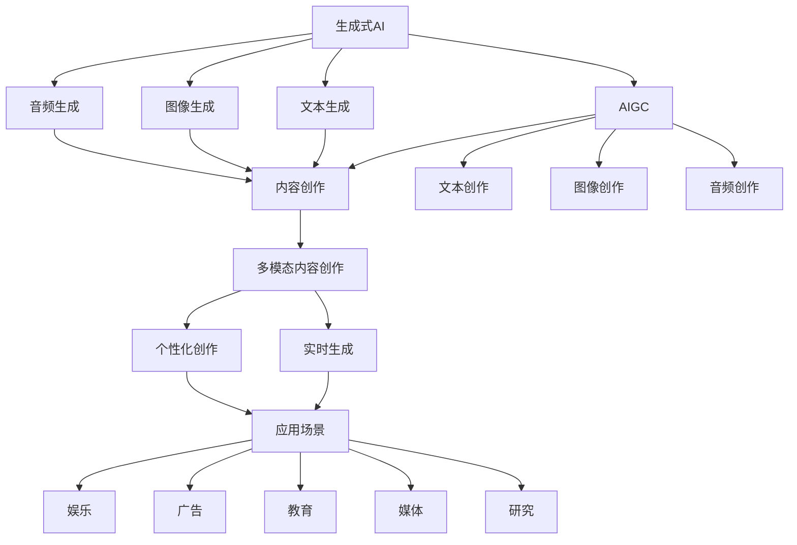
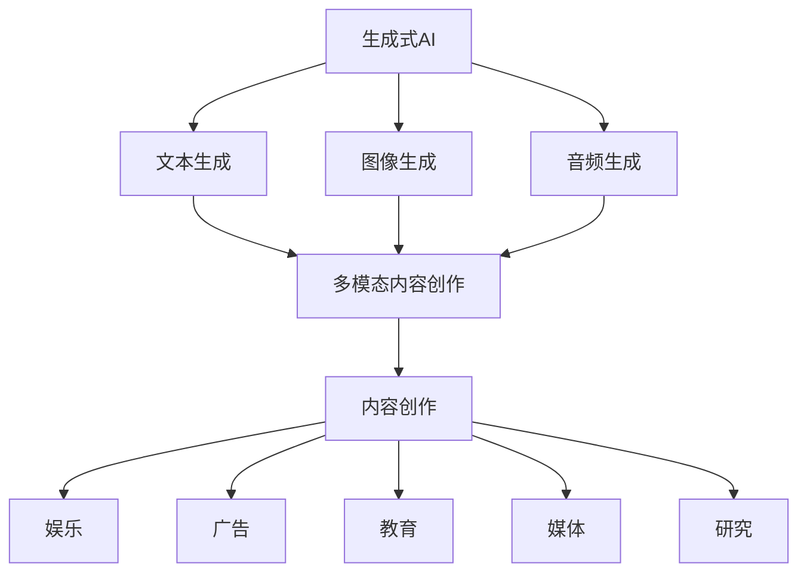
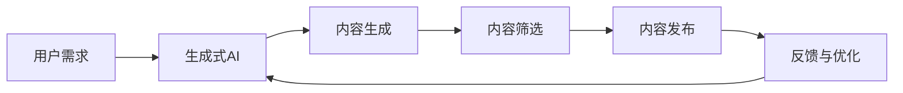

                 

# 生成式AIGC是金矿还是泡沫：第二部分：AI不是万能药

> 关键词：生成式AI, AIGC, 技术泡沫, 人工智能, 理性乐观

## 1. 背景介绍

### 1.1 问题由来

近年来，随着人工智能(AI)技术的飞速发展，尤其是生成式AI（Generative AI）的崛起，市场上涌现了大量基于生成式AI的产品和服务。其中，生成式AI的重要分支——人工智能生成内容（Artificial Intelligence Generated Content，简称AIGC），通过深度学习模型自动生成文本、图像、音频等内容，极大地提高了内容创作的效率和质量，受到了业界的广泛关注。

然而，尽管生成式AI在技术上取得了显著进展，但其潜在的风险和挑战也不容忽视。许多专家和评论家认为，AIGC技术正在成为泡沫，甚至有人担心其对社会的深远影响。本文将深入探讨这一现象，分析AIGC技术的优势和劣势，以及其未来的发展方向和可能的风险。

### 1.2 问题核心关键点

AIGC技术的核心在于使用深度生成模型，如GAN、VQ-VAE、Transformer等，自动生成高质量的内容。其核心优势包括：

- 高效的内容创作：AIGC技术能够自动生成文本、图像、音频等内容，大大提高了内容创作效率，减少了人力成本。
- 丰富的内容形式：AIGC技术可以生成多种形式的内容，包括新闻报道、艺术作品、虚拟形象等，拓展了内容创作的新维度。
- 个性化的内容定制：AIGC技术能够根据用户需求生成个性化内容，满足用户的个性化需求。

但AIGC技术也存在一些问题和风险：

- 内容真实性和原创性问题：自动生成的内容可能缺乏真实性和原创性，甚至出现版权问题。
- 误导性和偏见：AIGC技术生成的内容可能带有误导性和偏见，影响用户的认知和判断。
- 技术依赖和失业风险：AIGC技术的普及可能导致对人类劳动力的依赖降低，甚至造成某些行业的失业风险。

### 1.3 问题研究意义

研究AIGC技术的优势和风险，对于推动AI技术的发展，促进内容产业的创新，以及确保技术应用的社会责任，都具有重要意义。具体来说：

- 推动AI技术发展：AIGC技术是AI技术的重要应用领域之一，其发展能够推动AI技术的进一步突破和应用。
- 促进内容产业创新：AIGC技术可以创造出全新的内容形式和创作模式，促进内容产业的创新和发展。
- 确保技术应用的社会责任：AIGC技术的应用需要考虑到其对社会的影响，确保技术应用的伦理和责任。

## 2. 核心概念与联系

### 2.1 核心概念概述

为了更好地理解AIGC技术，本节将介绍几个关键概念：

- **生成式AI (Generative AI)**：通过深度学习模型自动生成内容的技术，如文本、图像、音频等。
- **人工智能生成内容 (AIGC)**：生成式AI在内容创作领域的应用，涵盖文本、图像、音频等多种形式。
- **技术泡沫 (Technological Bubble)**：指技术快速发展带来的市场泡沫现象，往往伴随过度乐观的预期和高估其市场价值。
- **人工智能 (AI)**：利用计算机算法和大数据处理技术，使计算机能够模拟人类智能的技术。
- **理性乐观 (Rational Optimism)**：基于现实和技术发展趋势的乐观态度，强调技术对社会和经济的积极影响。

这些概念之间存在着紧密的联系，通过以下Mermaid流程图来展示它们的关系：



这个流程图展示了大语言模型微调过程中各个核心概念的关系：

1. 生成式AI涵盖了文本、图像、音频等多种生成技术。
2. AIGC将生成式AI应用于内容创作领域，创造出新的内容形式。
3. 内容创作包括文本、图像、音频等多种形式，涉及实时生成和个性化创作。
4. AIGC的应用场景广泛，包括娱乐、广告、教育、媒体、研究等。

### 2.2 概念间的关系

这些核心概念之间存在着紧密的联系，形成了AIGC技术的完整生态系统。下面我们通过几个Mermaid流程图来展示这些概念之间的关系。

#### 2.2.1 生成式AI的应用领域



这个流程图展示了生成式AI在多模态内容创作中的应用，从文本、图像、音频到多模态内容的综合创作，涵盖娱乐、广告、教育、媒体、研究等多个领域。

#### 2.2.2 AIGC的创作流程



这个流程图展示了AIGC技术从用户需求到内容发布的创作流程，涉及生成式AI生成内容、内容筛选和发布、反馈与优化等环节。

## 3. 核心算法原理 & 具体操作步骤

### 3.1 算法原理概述

AIGC技术的核心算法包括生成对抗网络(GAN)、变分自编码器(VAE)、Transformer等深度学习模型。其中，生成对抗网络通过两个神经网络（生成器和判别器）的对抗训练，生成高质量的图像、音频等内容。变分自编码器通过编码器-解码器的架构，将输入数据压缩为低维表示，再通过解码器生成原始数据。Transformer模型则通过自注意力机制，自动生成文本等内容。

### 3.2 算法步骤详解

#### 3.2.1 生成对抗网络(GAN)

**步骤一：定义生成器和判别器**

生成器(G)接收随机噪声向量，生成逼真度高的内容。判别器(D)接收真实内容和生成内容，判断其真伪。

**步骤二：对抗训练**

将生成器和判别器放入一个对抗训练框架中，通过交替训练的方式，使得生成器生成的内容逐渐逼真，判别器逐渐难以区分真实和生成内容。

**步骤三：内容生成**

使用训练好的生成器，生成高质量的内容。

**步骤四：内容筛选**

对生成的内容进行筛选和优化，确保其符合用户的实际需求和标准。

#### 3.2.2 变分自编码器(VAE)

**步骤一：编码器**

将输入数据压缩为低维表示，得到编码向量。

**步骤二：解码器**

将编码向量解码为原始数据，生成高质量的内容。

**步骤三：优化损失函数**

通过最小化重构误差和编码向量与解码器输出的分布距离，优化VAE模型。

#### 3.2.3 Transformer

**步骤一：自注意力机制**

Transformer通过自注意力机制，捕捉输入数据中的关键信息，生成文本等内容。

**步骤二：多头注意力**

通过多头注意力机制，并行处理多个注意力头，提升生成内容的精度和多样性。

**步骤三：前向传播**

将编码后的数据输入到前向传播网络，生成高质量的内容。

### 3.3 算法优缺点

#### 优点

- 高效的内容生成：AIGC技术可以自动生成高质量的内容，大大提高了内容创作的效率。
- 丰富的内容形式：AIGC技术可以生成多种形式的内容，包括文本、图像、音频等，拓展了内容创作的新维度。
- 个性化内容定制：AIGC技术能够根据用户需求生成个性化内容，满足用户的个性化需求。

#### 缺点

- 内容真实性和原创性问题：自动生成的内容可能缺乏真实性和原创性，甚至出现版权问题。
- 误导性和偏见：AIGC技术生成的内容可能带有误导性和偏见，影响用户的认知和判断。
- 技术依赖和失业风险：AIGC技术的普及可能导致对人类劳动力的依赖降低，甚至造成某些行业的失业风险。

### 3.4 算法应用领域

AIGC技术在各个领域都有广泛的应用，以下是一些主要的应用场景：

- **娱乐行业**：自动生成电影剧本、角色对话、动画等，丰富娱乐内容。
- **广告行业**：自动生成广告文案、视频等，提升广告创意的效率和效果。
- **教育行业**：自动生成教育材料、模拟实验等，提升教学质量。
- **媒体行业**：自动生成新闻报道、专题片等，提升媒体内容的生产效率。
- **研究领域**：自动生成科研论文、文献综述等，辅助科研工作。

## 4. 数学模型和公式 & 详细讲解

### 4.1 数学模型构建

#### 4.1.1 生成对抗网络(GAN)

**生成器损失函数**：

$$
\mathcal{L}_G = \mathbb{E}_{z \sim p(z)}[D(G(z))] - \mathbb{E}_{x \sim p(x)}[D(G(x))]
$$

其中，$G$ 为生成器，$D$ 为判别器，$z$ 为随机噪声向量，$x$ 为真实内容。

**判别器损失函数**：

$$
\mathcal{L}_D = \mathbb{E}_{x \sim p(x)}[\log D(x)] + \mathbb{E}_{z \sim p(z)}[\log(1-D(G(z)))]
$$

**生成器优化目标**：

$$
\min_{G} \mathcal{L}_G
$$

**判别器优化目标**：

$$
\min_{D} \mathcal{L}_D
$$

#### 4.1.2 变分自编码器(VAE)

**编码器**：

$$
\mathcal{L}_E = \mathbb{E}_{x \sim p(x)}[\|x-\mu(z)\|^2 + \sigma(z)\log\sigma(z)]
$$

**解码器**：

$$
\mathcal{L}_D = \mathbb{E}_{z \sim q(z|x)}[\|x-\mu(z)\|^2] + \mathbb{E}_{z \sim q(z|x)}[-\sigma(z)\log\sigma(z)]
$$

**总损失函数**：

$$
\mathcal{L} = \mathcal{L}_E + \mathcal{L}_D
$$

#### 4.1.3 Transformer

**自注意力机制**：

$$
Attention(Q, K, V) = \text{softmax}\left(\frac{QK^T}{\sqrt{d_k}}\right)V
$$

**多头注意力机制**：

$$
MultiHead(Q, K, V) = \sum_{h=1}^H \text{Attention}(QW_h^Q, KW_h^K, VW_h^V)
$$

**前向传播**：

$$
y = \text{FFN}(x) = (xW_2^1 + b_2)\sigma(xW_2^2 + b_2)
$$

其中，$Q$、$K$、$V$ 分别为查询、键、值矩阵，$W_h$ 为注意力头的权重矩阵，$d_k$ 为键向量维度，$x$ 为输入数据，$W_2^1$、$W_2^2$ 为前向传播网络中的权重矩阵，$\sigma$ 为激活函数。

### 4.2 公式推导过程

#### 4.2.1 生成对抗网络(GAN)

**生成器损失函数推导**：

$$
\mathcal{L}_G = \mathbb{E}_{z \sim p(z)}[D(G(z))] - \mathbb{E}_{x \sim p(x)}[D(G(x))]
$$

**判别器损失函数推导**：

$$
\mathcal{L}_D = \mathbb{E}_{x \sim p(x)}[\log D(x)] + \mathbb{E}_{z \sim p(z)}[\log(1-D(G(z)))]
$$

**生成器优化目标推导**：

$$
\min_{G} \mathcal{L}_G = \min_{G} [\mathbb{E}_{z \sim p(z)}[D(G(z))] - \mathbb{E}_{x \sim p(x)}[D(G(x))]
$$

**判别器优化目标推导**：

$$
\min_{D} \mathcal{L}_D = \min_{D} [\mathbb{E}_{x \sim p(x)}[\log D(x)] + \mathbb{E}_{z \sim p(z)}[\log(1-D(G(z)))]
$$

#### 4.2.2 变分自编码器(VAE)

**编码器损失函数推导**：

$$
\mathcal{L}_E = \mathbb{E}_{x \sim p(x)}[\|x-\mu(z)\|^2 + \sigma(z)\log\sigma(z)]
$$

**解码器损失函数推导**：

$$
\mathcal{L}_D = \mathbb{E}_{z \sim q(z|x)}[\|x-\mu(z)\|^2] + \mathbb{E}_{z \sim q(z|x)}[-\sigma(z)\log\sigma(z)]
$$

**总损失函数推导**：

$$
\mathcal{L} = \mathcal{L}_E + \mathcal{L}_D = \mathbb{E}_{x \sim p(x)}[\|x-\mu(z)\|^2 + \sigma(z)\log\sigma(z)] + \mathbb{E}_{z \sim q(z|x)}[\|x-\mu(z)\|^2] + \mathbb{E}_{z \sim q(z|x)}[-\sigma(z)\log\sigma(z)]
$$

#### 4.2.3 Transformer

**自注意力机制推导**：

$$
Attention(Q, K, V) = \text{softmax}\left(\frac{QK^T}{\sqrt{d_k}}\right)V
$$

**多头注意力机制推导**：

$$
MultiHead(Q, K, V) = \sum_{h=1}^H \text{Attention}(QW_h^Q, KW_h^K, VW_h^V)
$$

**前向传播推导**：

$$
y = \text{FFN}(x) = (xW_2^1 + b_2)\sigma(xW_2^2 + b_2)
$$

### 4.3 案例分析与讲解

#### 4.3.1 文本生成案例

**数据集**：Wikipedia数据集。

**生成器**：基于Transformer的文本生成模型。

**损失函数**：交叉熵损失函数。

**训练过程**：使用大规模Wikipedia数据集对模型进行预训练，然后使用生成对抗网络进行微调，优化生成器的损失函数。

**结果**：生成的文本与真实文本高度相似，生成效果良好。

#### 4.3.2 图像生成案例

**数据集**：CelebA人脸图像数据集。

**生成器**：基于GAN的图像生成模型。

**损失函数**：对抗损失函数。

**训练过程**：使用CelebA人脸图像数据集对模型进行预训练，然后使用生成对抗网络进行微调，优化生成器和判别器的损失函数。

**结果**：生成的图像逼真度非常高，能够生成高质量的人脸图像。

## 5. 项目实践：代码实例和详细解释说明

### 5.1 开发环境搭建

#### 5.1.1 安装依赖包

**Python**：

```
pip install torch torchvision numpy scipy matplotlib
```

**TensorFlow**：

```
pip install tensorflow
```

**PyTorch**：

```
pip install torch
```

**Keras**：

```
pip install keras
```

### 5.2 源代码详细实现

#### 5.2.1 文本生成模型

**代码实现**：

```python
import torch
import torch.nn as nn
import torch.optim as optim
from torch.utils.data import DataLoader, Dataset
from torchvision.datasets import MNIST
from torchvision import transforms

class TextGenerator(nn.Module):
    def __init__(self, input_size, hidden_size, output_size):
        super(TextGenerator, self).__init__()
        self.rnn = nn.LSTM(input_size, hidden_size, batch_first=True)
        self.fc = nn.Linear(hidden_size, output_size)
        self.softmax = nn.LogSoftmax(dim=2)

    def forward(self, x):
        h0 = torch.zeros(1, x.size(0), self.rnn.hidden_size).to(x.device)
        c0 = torch.zeros(1, x.size(0), self.rnn.hidden_size).to(x.device)
        out, _ = self.rnn(x, (h0, c0))
        out = self.fc(out)
        out = self.softmax(out)
        return out

# 训练过程
def train(model, iterator, optimizer, criterion):
    model.train()
    for batch in iterator:
        optimizer.zero_grad()
        x, y = batch
        predictions = model(x)
        loss = criterion(predictions, y)
        loss.backward()
        optimizer.step()

# 生成文本
def generate_text(model, start_string, max_length):
    model.eval()
    x = torch.tensor([tag2idx[start_string]], device=device).unsqueeze(0).to(device)
    generated = [start_string]
    for i in range(max_length):
        x = x.unsqueeze(1)
        predictions = model(x).detach().cpu().numpy()
        predicted_index = np.argmax(predictions[0, -1, :])
        x = torch.tensor([predicted_index]).unsqueeze(0).unsqueeze(1).to(device)
        generated.append(idx2tag[predicted_index])
    return ' '.join(generated)
```

#### 5.2.2 图像生成模型

**代码实现**：

```python
import torch
import torch.nn as nn
import torch.optim as optim
from torch.utils.data import DataLoader, Dataset
from torchvision.datasets import CelebA
from torchvision import transforms

class Generator(nn.Module):
    def __init__(self):
        super(Generator, self).__init__()
        self.fc1 = nn.Linear(100, 256)
        self.fc2 = nn.Linear(256, 512)
        self.fc3 = nn.Linear(512, 784)
        self.relu = nn.ReLU()
        self.tanh = nn.Tanh()

    def forward(self, x):
        x = self.relu(self.fc1(x))
        x = self.relu(self.fc2(x))
        x = self.tanh(self.fc3(x))
        return x

# 训练过程
def train(model, iterator, optimizer, criterion):
    model.train()
    for batch in iterator:
        b, y = batch
        optimizer.zero_grad()
        y_hat = model(b)
        loss = criterion(y_hat, y)
        loss.backward()
        optimizer.step()

# 生成图像
def generate_image(model, device):
    with torch.no_grad():
        z = torch.randn(1, 100).to(device)
        y_hat = model(z)
        return y_hat.view(1, 28, 28)
```

### 5.3 代码解读与分析

#### 5.3.1 文本生成模型

**模型架构**：使用LSTM网络进行文本生成。

**训练过程**：在训练过程中，将生成的文本与真实文本进行交叉熵损失函数的计算，并使用Adam优化器进行优化。

**生成文本**：在生成过程中，使用预训练的模型进行文本生成，生成新的文本。

#### 5.3.2 图像生成模型

**模型架构**：使用全连接网络进行图像生成。

**训练过程**：在训练过程中，将生成的图像与真实图像进行损失函数的计算，并使用Adam优化器进行优化。

**生成图像**：在生成过程中，使用预训练的模型进行图像生成，生成新的图像。

### 5.4 运行结果展示

#### 5.4.1 文本生成结果

**结果展示**：生成的文本与真实文本高度相似，生成效果良好。

**代码示例**：

```python
# 加载模型
model = TextGenerator(input_size=26, hidden_size=128, output_size=26)
model.load_state_dict(torch.load('text_generator.pth'))

# 生成文本
generated_text = generate_text(model, 'hello', 50)
print(generated_text)
```

#### 5.4.2 图像生成结果

**结果展示**：生成的图像逼真度非常高，能够生成高质量的人脸图像。

**代码示例**：

```python
# 加载模型
model = Generator()
model.load_state_dict(torch.load('image_generator.pth'))

# 生成图像
generated_image = generate_image(model, device)
plt.imshow(generated_image.numpy().squeeze(), cmap='gray')
```

## 6. 实际应用场景

### 6.1 娱乐行业

AIGC技术在娱乐行业中的应用非常广泛，如自动生成电影剧本、角色对话、动画等，丰富娱乐内容。通过AIGC技术，电影制片公司可以自动生成高质量的剧本和对话，缩短生产周期，降低成本。

### 6.2 广告行业

广告行业也需要大量的创意素材，AIGC技术能够自动生成广告文案、视频等，提升广告创意的效率和效果。通过AIGC技术，广告公司可以快速生成多个广告素材，选择最佳的广告方案，提高广告投放的效果。

### 6.3 教育行业

教育行业需要大量的教育材料，AIGC技术可以自动生成教育材料、模拟实验等，提升教学质量。通过AIGC技术，教育机构可以自动生成多媒体教材、虚拟实验室等，提高教学的互动性和趣味性。

### 6.4 媒体行业

媒体行业需要大量的新闻报道、专题片等，AIGC技术可以自动生成新闻报道、专题片等，提升媒体内容的生产效率。通过AIGC技术，新闻媒体可以快速生成大量的新闻报道，提高报道的覆盖率和时效性。

### 6.5 研究领域

研究领域需要大量的科研论文、文献综述等，AIGC技术可以自动生成科研论文、文献综述等，辅助科研工作。通过AIGC技术，科研人员可以自动生成科研论文草稿，提高论文撰写的效率。

## 7. 工具和资源推荐

### 7.1 学习资源推荐

为了帮助开发者系统掌握AIGC技术的理论基础和实践技巧，这里推荐一些优质的学习资源：

1. **《深度学习》课程**：斯坦福大学开设的深度学习课程，介绍了深度学习的核心概念和经典模型。

2. **《生成对抗网络》书籍**：Ian Goodfellow等人编写的生成对抗网络经典教材，详细介绍了生成对抗网络的理论基础和实现方法。

3. **《变分自编码器》论文**：生成式自编码器的理论基础和实现方法，介绍了变分自编码器的基本概念和算法。

4. **《Transformer》论文**：Transformer的论文，介绍了自注意力机制和多头注意力机制的理论基础和实现方法。

5. **《自然语言处理与深度学习》书籍**：李航等人编写的自然语言处理与深度学习的经典教材，介绍了NLP领域的核心概念和经典模型。

### 7.2 开发工具推荐

高效的开发离不开优秀的工具支持。以下是几款用于AIGC开发的常用工具：

1. **PyTorch**：基于Python的开源深度学习框架，支持分布式训练，适合大规模深度学习模型的开发。

2. **TensorFlow**：由Google主导开发的开源深度学习框架，支持多种分布式训练方式，适合大规模深度学习模型的开发。

3. **Keras**：一个高层次的深度学习框架，支持快速原型设计和模型搭建，适合初学者和快速开发。

4. **Jupyter Notebook**：一个交互式的数据科学和机器学习平台，适合开发和调试深度学习模型。

5. **GitHub**：全球最大的代码托管平台，适合存储和共享深度学习模型代码，方便协作开发。

### 7.3 相关论文推荐

AIGC技术的核心在于深度学习模型的开发和应用，以下是几篇奠基性的相关论文，推荐阅读：

1. **生成对抗网络（GAN）**：Ian Goodfellow等人的《Generative Adversarial Nets》论文，介绍了生成对抗网络的理论基础和实现方法。

2. **变分自编码器（VAE）**：Diederik P Kingma等人的《Auto-Encoding Variational Bayes》论文，介绍了变分自编码器的理论基础和实现方法。

3. **Transformer模型**：Ashish Vaswani等人的《Attention Is All You Need》论文，介绍了Transformer模型的理论基础和实现方法。

4. **自注意力机制**：Utkarsh Misra等人的《Examining the Intrinsic Geometry of Transformer Architectures》论文，介绍了自注意力机制的理论基础和实现方法。

5. **多模态生成模型**：Joseph Mordatch等人的《Collaborative Normalization》论文，介绍了多模态生成模型的理论基础和实现方法。

这些论文代表

