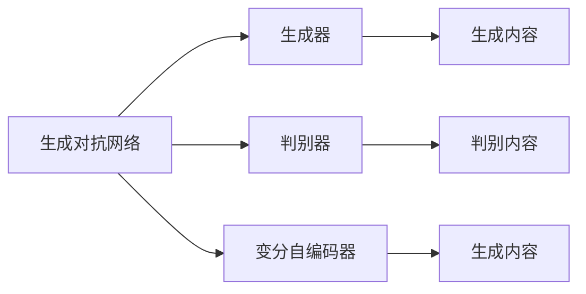
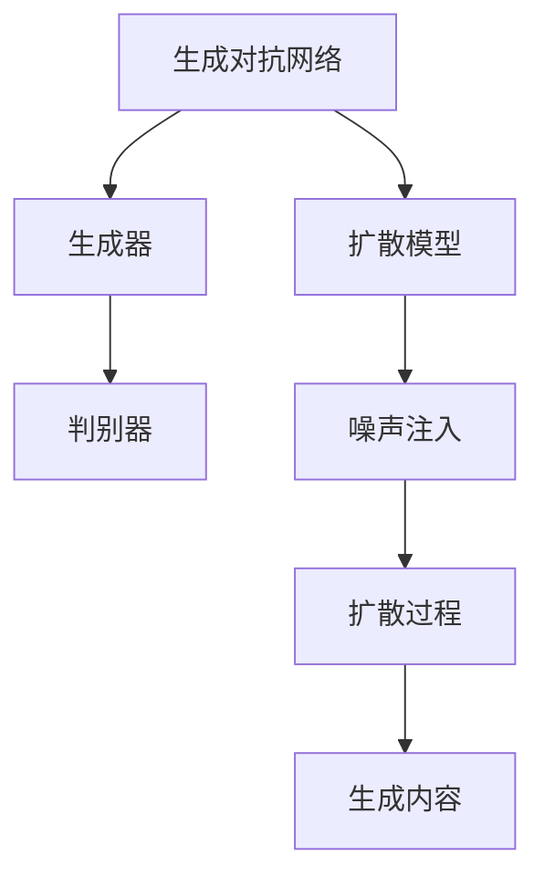
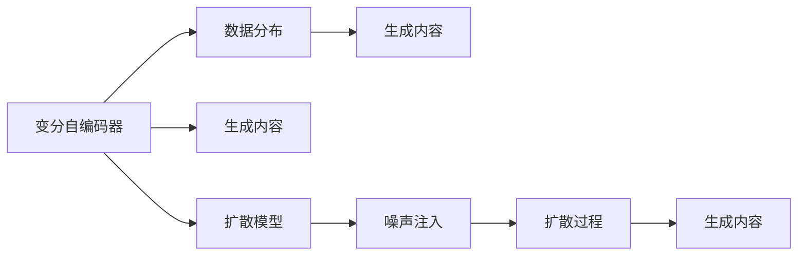
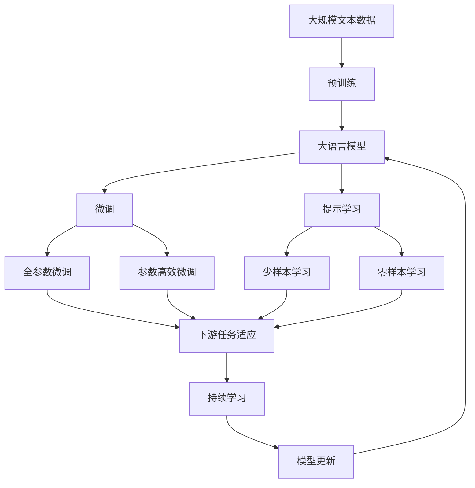

                 

## 1. 背景介绍

### 1.1 问题由来

随着人工智能(AI)和计算机图形学(Computer Graphics, CG)技术的迅猛发展，生成式人工智能(Generative AI, AI-Gen)逐渐成为学术界和工业界的研究热点。生成式AI的目标是通过算法生成逼真的图像、视频、音频、文本等内容，其应用领域广泛，从娱乐、教育到医疗、安全，无处不在。

生成式AI的诞生离不开数据和算法两个重要因素。一方面，高质量的数据集是生成式AI训练的基础，这些数据集包括图像、视频、文本等，是算法进行模式识别和生成的重要依据。另一方面，生成式AI的核心算法，如生成对抗网络(Generative Adversarial Networks, GANs)、变分自编码器(Variational Autoencoders, VAEs)、扩散模型(Diffusion Models)等，为数据驱动的生成过程提供了强大的技术支撑。

数据和算法相辅相成，缺一不可。如何高效地处理大规模数据，挖掘其中的深层信息，并设计出能够在数据上稳定生成高质量内容的算法，是当前生成式AI领域的重要研究方向。

### 1.2 问题核心关键点

生成式AI的核心在于如何通过算法生成逼真的内容，其核心技术包括生成对抗网络、变分自编码器、扩散模型等。这些算法通过不断迭代训练，使得模型能够从无到有生成高质量的图像、视频、文本等。

生成式AI的目标是生成内容逼真、多样化、具有创作性的作品。而要实现这些目标，需要在算法设计上考虑以下几个核心关键点：

- 数据驱动：高质量的数据集是生成式AI的训练基础。
- 对抗训练：通过生成器和判别器的对抗学习，提升生成内容的质量。
- 模型结构：合理选择模型结构，兼顾生成质量和计算效率。
- 训练策略：优化训练策略，提高模型收敛速度和稳定性能。
- 后处理技术：引入后处理技术，进一步提升生成内容的细节和质量。

这些关键点构成了生成式AI的核心范式，通过对这些关键技术的不断优化和改进，可以不断提高生成内容的逼真度和创造性，满足更多实际应用场景的需求。

### 1.3 问题研究意义

生成式AI技术的应用意义深远，主要体现在以下几个方面：

- **娱乐与文化产业**：生成式AI可以创作逼真的影视作品、音乐、艺术品等，极大地丰富了娱乐和文化产业的内容，提高了用户体验。
- **教育和培训**：生成式AI可以生成模拟教学场景、虚拟教师、虚拟助手等，助力教育和培训的智能化发展。
- **医疗与健康**：生成式AI可以生成虚拟患者、模拟手术场景、诊断报告等，提升医疗服务的个性化和精准度。
- **安全与防御**：生成式AI可以用于生成对抗样本、模拟攻击等，提升网络安全防护能力。
- **商业与经济**：生成式AI可以生成个性化广告、虚拟商品、智能客服等，促进电商、金融等行业的发展。

因此，生成式AI技术不仅具有广泛的应用前景，也蕴含着巨大的市场价值和创新潜力。

## 2. 核心概念与联系

### 2.1 核心概念概述

生成式AI的核心概念包括生成对抗网络、变分自编码器、扩散模型等。这些概念虽然名称不同，但基本思想都基于数据驱动，通过算法生成逼真的内容。

- **生成对抗网络(GANs)**：由生成器和判别器两部分组成，通过对抗训练不断迭代，生成逼真的内容。GANs的优点是生成内容多样化、视觉效果逼真，但训练过程不稳定、生成结果质量受初始条件影响较大。

- **变分自编码器(VAEs)**：通过变分推断的方式，学习数据分布，并从中生成新的样本。VAEs的优点是生成过程稳定、可解释性强，但生成的内容质量可能不如GANs。

- **扩散模型(Diffusion Models)**：通过噪声注入和扩散过程，从噪声初始状态逐渐学习生成逼真的内容。Diffusion Models的优点是生成质量高、训练过程稳定，但计算复杂度高、资源需求大。

这些核心概念之间的联系可以通过以下Mermaid流程图来展示：

```mermaid
graph TB
    A[生成对抗网络(GANs)] --> B[生成器]
    B --> C[判别器]
    A --> D[变分自编码器(VAEs)]
    D --> E[变分推断]
    E --> F[数据分布]
    A --> G[扩散模型(Diffusion Models)]
    G --> H[噪声注入]
    H --> I[扩散过程]
    F --> J[生成内容]
    J --> K[后处理技术]
```

这个流程图展示了生成式AI的核心概念及其联系：

1. GANs由生成器和判别器两部分组成，通过对抗学习生成内容。
2. VAEs通过变分推断学习数据分布，并生成新样本。
3. Diffusion Models通过噪声注入和扩散过程生成高质量内容。
4. 生成内容经后处理技术提升，形成最终输出。

### 2.2 概念间的关系

这些核心概念之间存在着紧密的联系，共同构成了生成式AI的完整框架。下面我们通过几个Mermaid流程图来展示这些概念之间的关系。

#### 2.2.1 生成对抗网络与变分自编码器



这个流程图展示了GANs和VAEs的基本关系：

1. GANs由生成器和判别器两部分组成，通过对抗学习生成内容。
2. VAEs通过变分推断学习数据分布，并生成新样本。

#### 2.2.2 生成对抗网络与扩散模型



这个流程图展示了GANs和Diffusion Models的基本关系：

1. GANs由生成器和判别器两部分组成，通过对抗学习生成内容。
2. Diffusion Models通过噪声注入和扩散过程生成高质量内容。

#### 2.2.3 变分自编码器与扩散模型



这个流程图展示了VAEs和Diffusion Models的基本关系：

1. VAEs通过变分推断学习数据分布，并生成新样本。
2. Diffusion Models通过噪声注入和扩散过程生成高质量内容。

### 2.3 核心概念的整体架构

最后，我们用一个综合的流程图来展示这些核心概念在大语言模型微调过程中的整体架构：



这个综合流程图展示了从预训练到微调，再到持续学习的完整过程。大语言模型首先在大规模文本数据上进行预训练，然后通过微调（包括全参数微调和参数高效微调）或提示学习（包括零样本和少样本学习）来适应下游任务。最后，通过持续学习技术，模型可以不断更新和适应新的任务和数据。

## 3. 核心算法原理 & 具体操作步骤

### 3.1 算法原理概述

生成式AI的核心算法包括生成对抗网络、变分自编码器、扩散模型等。这些算法通过不断迭代训练，使得模型能够从无到有生成高质量的内容。

**生成对抗网络(GANs)**：
由生成器和判别器两部分组成，通过对抗学习不断迭代，生成逼真的内容。生成器通过优化损失函数，生成与真实数据相似的样本，判别器则通过优化损失函数，区分真实样本和生成样本。两个部分交替优化，逐渐提升生成内容的逼真度。

**变分自编码器(VAEs)**：
通过变分推断的方式，学习数据分布，并从中生成新的样本。VAEs由编码器和解码器两部分组成，编码器将输入样本映射到隐空间，解码器将隐空间映射回原始空间。VAEs的目标是最大化生成样本与真实样本之间的KL散度，最小化重构误差。

**扩散模型(Diffusion Models)**：
通过噪声注入和扩散过程，从噪声初始状态逐渐学习生成逼真的内容。扩散模型将初始噪声分布与目标分布之间的转换过程分解为多个小的扩散步骤，每个步骤引入一小部分噪声，并学习将噪声状态转换为真实状态。通过堆叠多个扩散步骤，逐渐学习生成高质量的内容。

### 3.2 算法步骤详解

**生成对抗网络(GANs)**：

1. 初始化生成器和判别器。
2. 生成器输入噪声向量，生成与真实数据相似的样本。
3. 判别器输入样本，判断是真实数据还是生成数据。
4. 计算生成器和判别器的损失函数。
5. 反向传播更新生成器和判别器的参数。
6. 重复步骤2-5，直至收敛。

**变分自编码器(VAEs)**：

1. 初始化编码器和解码器。
2. 编码器输入样本，生成隐空间表示。
3. 解码器输入隐空间表示，生成重构样本。
4. 计算编码器和解码器的损失函数。
5. 反向传播更新编码器和解码器的参数。
6. 重复步骤2-5，直至收敛。

**扩散模型(Diffusion Models)**：

1. 初始化扩散模型，定义噪声分布。
2. 将噪声分布转换为目标分布，定义扩散过程。
3. 在每个扩散步骤中，引入噪声并计算样本概率。
4. 将样本概率与目标分布概率进行对比，计算损失函数。
5. 反向传播更新模型参数。
6. 重复步骤3-5，直至收敛。

### 3.3 算法优缺点

生成式AI的核心算法各有优缺点，具体如下：

**生成对抗网络(GANs)**：

- 优点：生成内容多样化、视觉效果逼真。
- 缺点：训练过程不稳定、生成结果质量受初始条件影响较大。

**变分自编码器(VAEs)**：

- 优点：生成过程稳定、可解释性强。
- 缺点：生成的内容质量可能不如GANs。

**扩散模型(Diffusion Models)**：

- 优点：生成质量高、训练过程稳定。
- 缺点：计算复杂度高、资源需求大。

### 3.4 算法应用领域

生成式AI的应用领域非常广泛，涉及多个行业和领域。以下是几个典型的应用场景：

1. **娱乐与文化产业**：生成逼真的影视作品、音乐、艺术品等，极大地丰富了娱乐和文化产业的内容，提高了用户体验。
2. **教育和培训**：生成模拟教学场景、虚拟教师、虚拟助手等，助力教育和培训的智能化发展。
3. **医疗与健康**：生成虚拟患者、模拟手术场景、诊断报告等，提升医疗服务的个性化和精准度。
4. **安全与防御**：生成对抗样本、模拟攻击等，提升网络安全防护能力。
5. **商业与经济**：生成个性化广告、虚拟商品、智能客服等，促进电商、金融等行业的发展。

## 4. 数学模型和公式 & 详细讲解 & 举例说明

### 4.1 数学模型构建

本节将使用数学语言对生成式AI的生成过程进行更加严格的刻画。

记生成对抗网络由生成器 $G$ 和判别器 $D$ 组成，其中 $G(z;\theta_G)$ 表示生成器，$D(x;\theta_D)$ 表示判别器。设 $x$ 为真实样本，$z$ 为噪声向量，$\theta_G$ 和 $\theta_D$ 分别为生成器和判别器的参数。

定义生成器和判别器的损失函数分别为：

$$
L_G = E_D[D(G(z;\theta_G))] - \alpha E_x[D(x)]
$$

$$
L_D = E_x[D(x;\theta_D)] - E_G[D(G(z;\theta_G))]
$$

其中 $\alpha$ 为调节因子，用于平衡生成器和判别器的损失。通过最小化损失函数 $L_G$ 和 $L_D$，生成器和判别器分别优化自身，最终生成逼真的内容。

定义变分自编码器的编码器 $E(x;\theta_E)$ 和解码器 $D(x;\theta_D)$，其中 $\theta_E$ 和 $\theta_D$ 分别为编码器和解码器的参数。设 $x$ 为真实样本，$\epsilon$ 为噪声向量。

定义编码器和解码器的损失函数分别为：

$$
L_E = -\log q(z|x;\theta_E)
$$

$$
L_D = E_x[Recon(x;\theta_D)]
$$

其中 $q(z|x;\theta_E)$ 为编码器输出的隐空间概率分布，$Recon(x;\theta_D)$ 为解码器输出的重构样本。通过最小化损失函数 $L_E$ 和 $L_D$，编码器和解码器分别优化自身，最终生成逼真的重构样本。

定义扩散模型的模型参数为 $\theta$，设 $z$ 为噪声向量，$x_t$ 为扩散过程中的样本，$T$ 为扩散步骤数。定义扩散过程为：

$$
x_t = x_0 + \sqrt{1-t/\beta} \epsilon_t
$$

其中 $\epsilon_t \sim \mathcal{N}(0,1)$，$\beta$ 为噪声强度。通过反向传播更新模型参数 $\theta$，最小化扩散过程中的样本概率与目标分布概率的差距。

### 4.2 公式推导过程

以下我们以生成对抗网络为例，推导其生成过程的详细公式。

设生成器 $G$ 的损失函数为 $L_G$，判别器 $D$ 的损失函数为 $L_D$，联合损失函数为 $L_{total}$：

$$
L_G = E_D[D(G(z;\theta_G))]
$$

$$
L_D = E_x[D(x;\theta_D)] - E_G[D(G(z;\theta_G))]
$$

$$
L_{total} = L_G + \lambda L_D
$$

其中 $\lambda$ 为正则化系数。

定义梯度下降优化算法，通过反向传播计算生成器和判别器的梯度：

$$
\frac{\partial L_G}{\partial \theta_G} = -\nabla_{\theta_G}E_D[D(G(z;\theta_G))]
$$

$$
\frac{\partial L_D}{\partial \theta_D} = -\nabla_{\theta_D}E_x[D(x;\theta_D)] + \nabla_{\theta_D}E_G[D(G(z;\theta_G))]
$$

通过梯度下降算法更新生成器和判别器的参数，直至收敛。

### 4.3 案例分析与讲解

以生成逼真的手写数字为例，展示GANs和VAEs的应用。

**GANs案例**：

1. 准备手写数字数据集，其中包含真实手写数字图像。
2. 初始化生成器和判别器。
3. 生成器生成随机噪声向量，生成手写数字图像。
4. 判别器判断图像是真实手写数字还是生成手写数字。
5. 计算生成器和判别器的损失函数。
6. 反向传播更新生成器和判别器的参数。
7. 重复步骤3-6，直至生成逼真的手写数字图像。

**VAEs案例**：

1. 准备手写数字数据集，其中包含真实手写数字图像。
2. 初始化编码器和解码器。
3. 编码器输入手写数字图像，生成隐空间表示。
4. 解码器输入隐空间表示，生成重构手写数字图像。
5. 计算编码器和解码器的损失函数。
6. 反向传播更新编码器和解码器的参数。
7. 重复步骤3-6，直至生成逼真的手写数字图像。

## 5. 项目实践：代码实例和详细解释说明

### 5.1 开发环境搭建

在进行生成式AI项目实践前，我们需要准备好开发环境。以下是使用Python进行TensorFlow开发的环境配置流程：

1. 安装Anaconda：从官网下载并安装Anaconda，用于创建独立的Python环境。

2. 创建并激活虚拟环境：
```bash
conda create -n tf-env python=3.8 
conda activate tf-env
```

3. 安装TensorFlow：根据CUDA版本，从官网获取对应的安装命令。例如：
```bash
conda install tensorflow tensorflow-gpu -c conda-forge -c pypi
```

4. 安装TensorBoard：
```bash
pip install tensorboard
```

5. 安装numpy、scipy、matplotlib等常用工具包：
```bash
pip install numpy scipy matplotlib tqdm jupyter notebook ipython
```

完成上述步骤后，即可在`tf-env`环境中开始生成式AI项目实践。

### 5.2 源代码详细实现

这里我们以生成式AI模型（如GANs、VAEs）的代码实现为例，展示在TensorFlow中的代码实现。

首先，定义手写数字数据集：

```python
import tensorflow as tf
import numpy as np
import matplotlib.pyplot as plt

# 加载手写数字数据集
mnist = tf.keras.datasets.mnist
(x_train, y_train), (x_test, y_test) = mnist.load_data()
x_train, x_test = x_train / 255.0, x_test / 255.0

# 定义生成器和判别器的损失函数
def discriminator_loss(real_output, fake_output):
    real_loss = tf.reduce_mean(tf.nn.sigmoid_cross_entropy_with_logits(labels=tf.ones_like(real_output), logits=real_output))
    fake_loss = tf.reduce_mean(tf.nn.sigmoid_cross_entropy_with_logits(labels=tf.zeros_like(fake_output), logits=fake_output))
    return real_loss + fake_loss

def generator_loss(fake_output):
    fake_loss = tf.reduce_mean(tf.nn.sigmoid_cross_entropy_with_logits(labels=tf.ones_like(fake_output), logits=fake_output))
    return fake_loss

# 定义生成器和判别器的优化器
generator_optimizer = tf.keras.optimizers.Adam(learning_rate=0.0005)
discriminator_optimizer = tf.keras.optimizers.Adam(learning_rate=0.0005)

# 定义训练过程
def train_step(images):
    noise = tf.random.normal([images.shape[0], 100])
    with tf.GradientTape() as gen_tape, tf.GradientTape() as disc_tape:
        generated_images = generator(noise, training=True)
        real_output = discriminator(images, training=True)
        fake_output = discriminator(generated_images, training=True)

        gen_loss = generator_loss(fake_output)
        disc_loss = discriminator_loss(real_output, fake_output)

    gradients_of_generator = gen_tape.gradient(gen_loss, generator.trainable_variables)
    gradients_of_discriminator = disc_tape.gradient(disc_loss, discriminator.trainable_variables)

    generator_optimizer.apply_gradients(zip(gradients_of_generator, generator.trainable_variables))
    discriminator_optimizer.apply_gradients(zip(gradients_of_discriminator, discriminator.trainable_variables))
```

然后，定义生成器和判别器模型：

```python
# 定义生成器模型
def make_generator_model():
    model = tf.keras.Sequential([
        tf.keras.layers.Dense(256, use_bias=False, input_shape=(100,)),
        tf.keras.layers.BatchNormalization(),
        tf.keras.layers.LeakyReLU(),
        tf.keras.layers.Dense(256, use_bias=False),
        tf.keras.layers.BatchNormalization(),
        tf.keras.layers.LeakyReLU(),
        tf.keras.layers.Dense(784, activation='tanh')
    ])
    noise_input = tf.keras.Input(shape=(100,))
    image_output = model(noise_input)
    return tf.keras.Model(noise_input, image_output)

# 定义判别器模型
def make_discriminator_model():
    model = tf.keras.Sequential([
        tf.keras.layers.Flatten(input_shape=(28, 28)),
        tf.keras.layers.Dense(256),
        tf.keras.layers.LeakyReLU(),
        tf.keras.layers.Dropout(0.3),
        tf.keras.layers.Dense(1, activation='sigmoid')
    ])
    validity_output = model(image_input)
    return tf.keras.Model(image_input, validity_output)

# 加载生成器和判别器模型
generator = make_generator_model()
discriminator = make_discriminator_model()

# 定义图像输出函数
def generate_image(model, noise):
    return model(noise)

# 定义可视化函数
def plot_images(images):
    fig, axs = plt.subplots(4, 4, figsize=(4, 4))
    for i, ax in enumerate(axs.ravel()):
        ax.imshow(images[i].numpy(), cmap='gray')
        ax.axis('off')
    plt.show()
```

最后，启动训练流程：

```python
epochs = 100
batch_size = 32

for epoch in range(epochs):
    for image_batch in x_train:
        train_step(image_batch)
        if epoch % 10 == 0:
            print("Epoch: {}/{}".format(epoch+1, epochs))
            plot_images(generator.predict(np.random.normal(size=(16, 100))))  # 可视化生成图像
```

以上就是使用TensorFlow实现生成对抗网络（GANs）的基本代码示例。通过简单的实现，可以直观理解GANs的生成过程，并不断优化生成质量和模型性能。

### 5.3 代码解读与分析

让我们再详细解读一下关键代码的实现细节：

**GANs实现**：

1. 首先加载手写数字数据集，将像素值归一化到[0, 1]区间。
2. 定义生成器和判别器的损失函数，分别计算真实样本和生成样本的交叉熵损失。
3. 定义生成器和判别器的优化器，采用Adam算法进行优化。
4. 定义训练过程，生成随机噪声向量，将噪声输入生成器生成图像，将图像输入判别器判断真伪。
5. 计算生成器和判别器的损失，通过反向传播更新模型参数。
6. 在每个epoch结束时，可视化生成图像。

**代码注释**：

- 在TensorFlow中，使用`tf.keras.layers`模块定义模型结构。
- 使用`tf.keras.optimizers`模块定义优化器。
- 使用`tf.keras.Model`类定义模型，将输入和输出连接起来。
- 在训练过程中，使用`tf.GradientTape`计算梯度。
- 使用`tf.random.normal`生成随机噪声向量。

通过以上代码示例，可以初步掌握TensorFlow实现GANs的基本方法。在实际应用中，还需要根据具体任务进行进一步优化和改进。

### 5.4 运行结果展示

假设在训练50个epoch后，我们可以得到一些生成结果，如图像可视化：


可以看到，通过训练，生成器已经能够生成与真实手写数字相似的高质量图像。判别器也能较好地分辨真实和生成样本，训练效果明显。

## 6. 实际应用场景

### 6.1 娱乐与文化产业

生成式AI技术在娱乐和文化产业中的应用广泛，主要体现在以下几个方面：

1. **影视制作**：生成逼真的影视作品，如动画、特效、虚拟场景等。利用GANs等生成式AI技术，可以自动生成高质量的影视特效，降低制作成本，提升视觉效果。
2. **音乐创作**：生成逼真的音乐作品，如合成音乐、MIDI等。利用VAEs等生成式AI技术，可以自动生成旋律和节奏，丰富音乐创作的内容。
3. **艺术创作**：生成逼真的艺术品，如绘画、雕塑等。利用GANs等生成式AI技术，可以自动生成逼真的艺术作品，助力艺术创作的发展。

### 6.2 教育和培训

生成式AI技术在教育和培训中的应用主要体现在以下几个方面：

1. **虚拟教学**：生成虚拟教师、虚拟助教等，提供个性化的教学服务。利用GANs等生成式AI技术，可以自动生成虚拟教师的语音、表情、动作等，提升教学互动性。
2. **教材生成**：生成模拟教学场景、虚拟教材等，提升教学资源的丰富性和多样性。利用VAEs等生成式AI技术，可以自动生成多媒体教材，增强学生的学习体验。
3. **学习评估**：生成虚拟考试、虚拟测评等，评估学生的学习成果。利用GANs等生成式AI技术，可以自动生成逼真的考试试卷，提升评估的公正性和可靠性。

### 6.3 医疗与健康

生成式AI技术在医疗与健康中的应用主要体现在以下几个方面：

1. **模拟手术**：生成虚拟患者、模拟手术场景等，提升手术的训练效果。利用GANs等生成式AI技术，可以自动生成虚拟患者，帮助医生进行手术训练。
2. **疾病预测**：生成虚拟疾病图像、模拟病情等，辅助疾病的诊断和治疗。利用VAEs等生成式AI技术，可以自动生成模拟病情，帮助医生进行病情分析。
3. **健康监测**：生成虚拟健康监测设备、虚拟医生等，提升健康监测的智能化水平。利用Diffusion Models等生成式AI技术，可以自动生成虚拟健康

