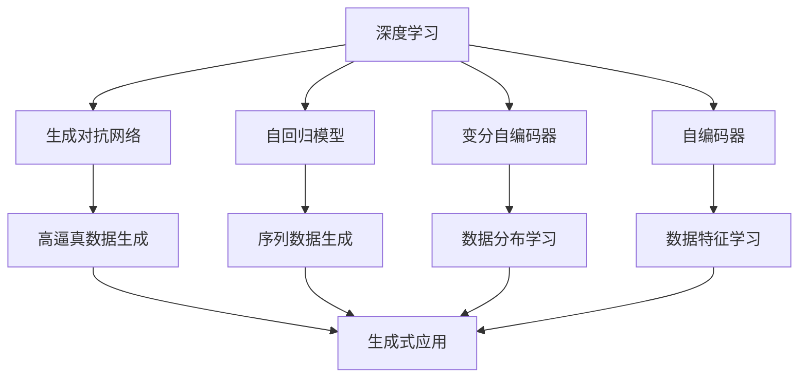
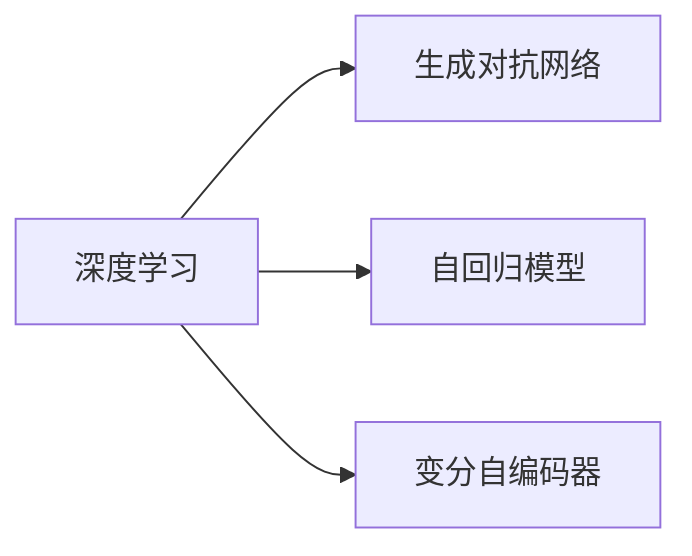
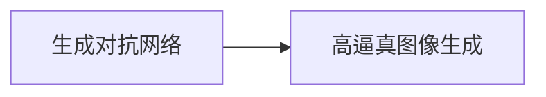
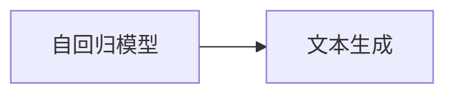
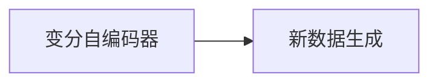
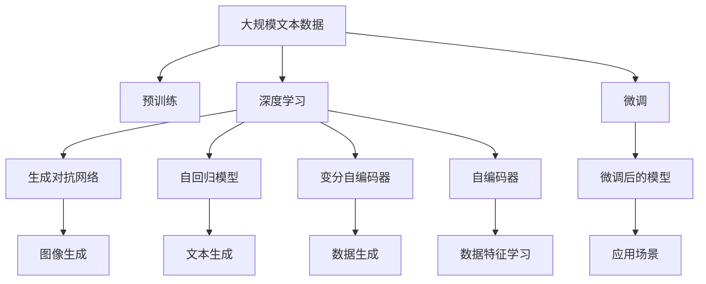

                 

# 生成式AI：如何利用技术优势创造新的价值？

> 关键词：生成式AI,自然语言处理(NLP),计算机视觉(CV),机器学习,深度学习,多模态学习,创造性应用

## 1. 背景介绍

### 1.1 问题由来
随着人工智能技术的飞速发展，生成式AI（Generative AI）已成为推动科技创新的重要引擎。生成式AI的核心在于利用深度学习模型对数据进行生成式建模，能够自动产生文本、图像、音频等多模态数据，并生成符合用户需求的新数据。相较于传统的分析式AI，生成式AI具有更强的创造性和灵活性，能够创造出更多新的应用场景，为各行各业带来颠覆性变化。

### 1.2 问题核心关键点
生成式AI主要利用以下核心技术：
1. **深度学习**：通过神经网络模型，对大量数据进行学习，从而自动发现数据中的复杂模式。
2. **生成对抗网络(GANs)**：通过两个网络（生成器与判别器）的对抗训练，生成高逼真的伪造数据。
3. **变分自编码器(VAEs)**：通过学习数据分布，生成具有高可解释性的数据。
4. **自回归模型**：如LSTM、GRU等，用于生成序列数据，如文本、语音。
5. **变分自编码器(VAEs)**：通过对数据的变分推断，生成新的数据样本。

### 1.3 问题研究意义
生成式AI在图像生成、自然语言生成、音频生成等领域有着广泛的应用，能够大幅提升效率、降低成本、创新产品。特别是在医疗、娱乐、教育、艺术等领域，生成式AI正逐步改变人们的生活和工作方式。

## 2. 核心概念与联系

### 2.1 核心概念概述

为了更好地理解生成式AI的技术原理和应用，本节将介绍几个关键概念：

1. **深度学习（Deep Learning）**：一种基于多层神经网络的机器学习方法，通过反向传播算法训练模型，自动发现数据中的复杂模式。

2. **生成对抗网络（GANs）**：由生成器和判别器两部分组成，通过对抗训练生成高逼真的伪造数据。

3. **变分自编码器（VAEs）**：通过学习数据分布，生成具有高可解释性的数据。

4. **自回归模型（Autoregressive Models）**：如LSTM、GRU等，用于生成序列数据，如文本、语音。

5. **自编码器（Autoencoder）**：通过学习数据的压缩和重构，发现数据的潜在特征。

6. **变分自编码器（VAEs）**：通过对数据的变分推断，生成新的数据样本。

这些概念之间的逻辑关系可以通过以下Mermaid流程图来展示：



这个流程图展示了大语言模型微调过程中各个核心概念之间的关系：

1. 深度学习是生成式AI的基础技术，可以用于生成对抗网络、自回归模型、变分自编码器等。
2. 生成对抗网络能够生成高逼真数据，广泛应用于图像生成。
3. 自回归模型能够生成序列数据，用于文本、语音生成。
4. 变分自编码器能够学习数据分布，生成新的数据样本。

### 2.2 概念间的关系

这些核心概念之间存在着紧密的联系，形成了生成式AI的完整生态系统。下面我通过几个Mermaid流程图来展示这些概念之间的关系。

#### 2.2.1 深度学习与生成式AI



这个流程图展示了大语言模型微调过程中深度学习与生成式AI的关系：

1. 深度学习是生成式AI的基础，通过多层神经网络对数据进行建模。
2. 生成对抗网络、自回归模型、变分自编码器等技术都是深度学习的具体应用。

#### 2.2.2 生成对抗网络与图像生成



这个流程图展示生成对抗网络在图像生成中的应用：

1. 生成对抗网络由生成器和判别器两部分组成，通过对抗训练生成高逼真的图像数据。

#### 2.2.3 自回归模型与文本生成



这个流程图展示自回归模型在文本生成中的应用：

1. 自回归模型如LSTM、GRU等，用于生成文本序列，实现文本生成。

#### 2.2.4 变分自编码器与数据生成



这个流程图展示变分自编码器在数据生成中的应用：

1. 变分自编码器通过学习数据的分布，生成新的数据样本。

### 2.3 核心概念的整体架构

最后，我们用一个综合的流程图来展示这些核心概念在大语言模型微调过程中的整体架构：



这个综合流程图展示了从预训练到微调，再到生成式应用的完整过程。深度学习作为生成式AI的基础，通过生成对抗网络、自回归模型、变分自编码器等技术，实现图像、文本、数据生成等应用场景。微调后的模型可以应用于各种生成式应用，如创意写作、图像处理、语音合成等。

## 3. 核心算法原理 & 具体操作步骤
### 3.1 算法原理概述

生成式AI的核心算法包括深度学习、生成对抗网络、自回归模型、变分自编码器等。本节将详细讲解这些算法的基本原理。

### 3.2 算法步骤详解

以下我们将以文本生成为例，给出生成式AI的详细操作步骤：

**Step 1: 准备预训练模型和数据集**
- 选择合适的预训练语言模型（如GPT-3、T5等）作为初始化参数。
- 准备文本生成任务的标注数据集，例如对话生成、文本摘要等。

**Step 2: 设计损失函数**
- 根据生成任务的不同，设计适合的损失函数，如交叉熵损失、KL散度损失、生成器的对数似然损失等。
- 在训练过程中，使用这些损失函数来衡量模型生成的文本与真实文本之间的差异。

**Step 3: 设置生成器与判别器**
- 设计生成器网络，如LSTM、GRU等，用于生成文本。
- 设计判别器网络，如MLP、CNN等，用于判断文本的真实性。

**Step 4: 对抗训练**
- 交替更新生成器和判别器，使得生成器生成的文本越来越接近真实文本，判别器越来越难以判断生成文本的真实性。
- 使用梯度下降等优化算法，更新生成器和判别器的权重。

**Step 5: 微调与优化**
- 在微调过程中，使用交叉熵损失等方法，优化生成器的生成质量。
- 结合正则化技术，如L2正则、Dropout等，防止模型过拟合。
- 使用数据增强技术，如回译、近义替换等，扩充训练集。

**Step 6: 测试与评估**
- 在测试集上评估生成模型的性能，计算BLEU、ROUGE等指标。
- 根据评估结果，进一步优化模型参数，提高生成文本的质量。

### 3.3 算法优缺点

生成式AI在图像生成、文本生成、数据生成等方面有着显著优势，但也存在一些局限性：

**优点：**
1. **高创造性**：生成式AI能够自动产生新颖的文本、图像、音频等数据，提高数据的多样性和丰富性。
2. **灵活性**：能够快速适应不同的应用场景，如自然语言处理、计算机视觉等。
3. **高效性**：自动生成大量数据，大幅降低人力成本和制作周期。

**缺点：**
1. **可解释性不足**：生成式AI的内部决策过程较为复杂，难以解释其生成结果的合理性。
2. **数据质量依赖**：生成结果的质量高度依赖于训练数据的质量，一旦数据存在偏见，模型将继承这些偏见。
3. **计算资源需求高**：大规模生成式AI模型需要较高的计算资源，包括高性能GPU/TPU等。

### 3.4 算法应用领域

生成式AI已经在多个领域取得了显著的应用成果，包括：

1. **自然语言处理（NLP）**：用于对话生成、文本摘要、机器翻译等任务，提升自然语言理解与生成能力。
2. **计算机视觉（CV）**：用于图像生成、视频生成、风格转换等任务，提升图像处理能力。
3. **语音合成（ASR）**：用于语音生成、声音合成等任务，提升语音交互体验。
4. **游戏与娱乐**：用于角色生成、剧情生成、场景生成等，提升游戏体验与娱乐效果。
5. **医疗与生物**：用于药物设计、蛋白质折叠、分子模拟等，推动生物医学研究。
6. **艺术与设计**：用于艺术创作、设计辅助、建筑设计等，拓展艺术与设计的创新空间。

## 4. 数学模型和公式 & 详细讲解 & 举例说明

### 4.1 数学模型构建

本节我们将使用数学语言对生成式AI的算法过程进行更加严格的刻画。

**假设**：生成对抗网络由生成器 $G$ 和判别器 $D$ 组成，其中生成器 $G$ 将随机噪声 $z$ 映射为文本 $x$，判别器 $D$ 判断文本 $x$ 的真实性。损失函数为：

$$
\mathcal{L} = \mathbb{E}_{x \sim p_{data}}[\log D(x)] + \mathbb{E}_{z \sim p(z)}[\log (1 - D(G(z)))]
$$

其中 $p_{data}$ 为真实数据分布，$p(z)$ 为噪声分布。

### 4.2 公式推导过程

以下我们将以文本生成为例，推导生成对抗网络的基本公式。

**生成器公式**：
- 假设生成器 $G$ 由多层神经网络组成，其参数为 $\theta_G$。给定随机噪声 $z$，生成器的输出为 $x = G(z)$。

**判别器公式**：
- 假设判别器 $D$ 由多层神经网络组成，其参数为 $\theta_D$。对于输入文本 $x$，判别器的输出为 $D(x)$。

**优化目标**：
- 生成器 $G$ 的目标是使得 $D(G(z))$ 逼近 $0$，即生成逼真的文本。
- 判别器 $D$ 的目标是使得 $\mathbb{E}_{x \sim p_{data}}[\log D(x)]$ 逼近 $1$，即准确判断文本的真实性。

**梯度更新**：
- 生成器 $G$ 的梯度更新公式为：
  $$
  \nabla_{\theta_G} \mathcal{L} = \nabla_{G(z)}[D(G(z))] + \nabla_{G(z)}[1 - D(G(z))]
  $$
- 判别器 $D$ 的梯度更新公式为：
  $$
  \nabla_{\theta_D} \mathcal{L} = \nabla_{x}[\log D(x)] + \nabla_{x}[\log (1 - D(x))]
  $$

### 4.3 案例分析与讲解

以生成文本为例，假设有真实文本 $x_1$ 和生成文本 $x_2$，对应的判别器输出分别为 $D(x_1)$ 和 $D(x_2)$。我们可以使用以下Python代码实现生成对抗网络的基本训练过程：

```python
import torch
import torch.nn as nn
import torch.optim as optim
import torchvision.transforms as transforms

# 定义生成器与判别器
class Generator(nn.Module):
    def __init__(self):
        super(Generator, self).__init__()
        self.linear = nn.Linear(100, 1000)
        self.fc1 = nn.Linear(1000, 500)
        self.fc2 = nn.Linear(500, 100)
    
    def forward(self, x):
        x = torch.sigmoid(self.linear(x))
        x = torch.sigmoid(self.fc1(x))
        x = torch.sigmoid(self.fc2(x))
        return x

class Discriminator(nn.Module):
    def __init__(self):
        super(Discriminator, self).__init__()
        self.fc1 = nn.Linear(100, 500)
        self.fc2 = nn.Linear(500, 100)
    
    def forward(self, x):
        x = torch.sigmoid(self.fc1(x))
        x = torch.sigmoid(self.fc2(x))
        return x

# 定义损失函数
def generator_loss(D, x):
    return -torch.mean(D(x))

def discriminator_loss(D, x):
    return -torch.mean(torch.log(D(x))) - torch.mean(torch.log(1 - D(x)))

# 定义训练函数
def train(D, G, x, z, num_epochs=100, batch_size=32):
    optimizer_G = optim.Adam(G.parameters(), lr=0.0002)
    optimizer_D = optim.Adam(D.parameters(), lr=0.0002)
    
    for epoch in range(num_epochs):
        for i, (real_x, z) in enumerate(zip(x, z)):
            # 生成器训练
            G.zero_grad()
            gen_x = G(z)
            g_loss = generator_loss(D, gen_x)
            g_loss.backward()
            optimizer_G.step()
            
            # 判别器训练
            D.zero_grad()
            d_real = D(real_x)
            d_fake = D(gen_x)
            d_loss = discriminator_loss(D, real_x, gen_x)
            d_loss.backward()
            optimizer_D.step()
            
            # 输出结果
            if i % 100 == 0:
                print('Epoch [{}/{}], Step [{}/{}], D_loss: {:.6f}, G_loss: {:.6f}'.format(epoch+1, num_epochs, i, len(x), d_loss, g_loss))
```

以上代码实现了一个简单的生成对抗网络，通过对抗训练生成高质量的文本。在训练过程中，生成器和判别器交替更新，生成器生成逼真的文本，判别器判断文本的真实性。通过交叉熵损失函数，生成器的目标是最小化判别器的输出，判别器的目标是最小化生成器的输出。

## 5. 项目实践：代码实例和详细解释说明

### 5.1 开发环境搭建

在进行生成式AI实践前，我们需要准备好开发环境。以下是使用Python进行PyTorch开发的环境配置流程：

1. 安装Anaconda：从官网下载并安装Anaconda，用于创建独立的Python环境。

2. 创建并激活虚拟环境：
```bash
conda create -n pytorch-env python=3.8 
conda activate pytorch-env
```

3. 安装PyTorch：根据CUDA版本，从官网获取对应的安装命令。例如：
```bash
conda install pytorch torchvision torchaudio cudatoolkit=11.1 -c pytorch -c conda-forge
```

4. 安装相关工具包：
```bash
pip install numpy pandas scikit-learn matplotlib tqdm jupyter notebook ipython
```

完成上述步骤后，即可在`pytorch-env`环境中开始生成式AI的开发。

### 5.2 源代码详细实现

下面我们以图像生成为例，给出使用PyTorch对GAN模型进行训练的代码实现。

首先，定义GAN模型：

```python
import torch
import torch.nn as nn
import torch.optim as optim
from torchvision import datasets, transforms

# 定义生成器
class Generator(nn.Module):
    def __init__(self):
        super(Generator, self).__init__()
        self.linear = nn.Linear(100, 1000)
        self.fc1 = nn.Linear(1000, 500)
        self.fc2 = nn.Linear(500, 100)
        self.fc3 = nn.Linear(100, 784)
    
    def forward(self, x):
        x = torch.sigmoid(self.linear(x))
        x = torch.sigmoid(self.fc1(x))
        x = torch.sigmoid(self.fc2(x))
        x = torch.sigmoid(self.fc3(x))
        return x

# 定义判别器
class Discriminator(nn.Module):
    def __init__(self):
        super(Discriminator, self).__init__()
        self.fc1 = nn.Linear(784, 500)
        self.fc2 = nn.Linear(500, 100)
    
    def forward(self, x):
        x = torch.sigmoid(self.fc1(x))
        x = torch.sigmoid(self.fc2(x))
        return x
```

然后，定义数据处理函数：

```python
transform = transforms.Compose([
    transforms.ToTensor(),
    transforms.Normalize((0.5,), (0.5,))
])

# 加载数据集
mnist = datasets.MNIST('../data', train=True, download=True, transform=transform)
train_loader = torch.utils.data.DataLoader(mnist, batch_size=64, shuffle=True)
```

接着，定义损失函数和优化器：

```python
def generator_loss(D, x):
    return -torch.mean(D(x))

def discriminator_loss(D, real_x, fake_x):
    real_loss = torch.mean(D(real_x))
    fake_loss = torch.mean(D(fake_x))
    return real_loss + fake_loss

optimizer_G = optim.Adam(G.parameters(), lr=0.0002)
optimizer_D = optim.Adam(D.parameters(), lr=0.0002)
```

最后，启动训练流程：

```python
num_epochs = 100
z = torch.randn(64, 100)
for epoch in range(num_epochs):
    for batch_idx, (real_x, _) in enumerate(train_loader):
        # 生成器训练
        G.zero_grad()
        gen_x = G(z)
        g_loss = generator_loss(D, gen_x)
        g_loss.backward()
        optimizer_G.step()
        
        # 判别器训练
        D.zero_grad()
        d_loss = discriminator_loss(D, real_x, gen_x)
        d_loss.backward()
        optimizer_D.step()
        
        # 输出结果
        if batch_idx % 100 == 0:
            print('Epoch [{}/{}], Step [{}/{}], D_loss: {:.6f}, G_loss: {:.6f}'.format(epoch+1, num_epochs, batch_idx, len(train_loader), d_loss, g_loss))
```

以上代码实现了基于PyTorch的GAN模型训练，通过对抗训练生成高质量的图像数据。在训练过程中，生成器和判别器交替更新，生成器生成逼真的图像，判别器判断图像的真实性。通过交叉熵损失函数，生成器的目标是最小化判别器的输出，判别器的目标是最小化生成器的输出。

### 5.3 代码解读与分析

让我们再详细解读一下关键代码的实现细节：

**GAN模型定义**：
- `Generator`和`Discriminator`类分别定义生成器和判别器的网络结构，包括多个线性层和Sigmoid激活函数。

**数据处理函数**：
- `transform`函数用于将图像数据标准化，便于训练。

**损失函数定义**：
- `generator_loss`函数用于计算生成器的损失，最小化判别器的输出。
- `discriminator_loss`函数用于计算判别器的损失，最小化生成器的输出。

**优化器定义**：
- `optimizer_G`和`optimizer_D`分别定义生成器和判别器的优化器。

**训练函数实现**：
- 在每个epoch中，对训练集数据进行迭代训练。
- 在每个batch中，交替更新生成器和判别器，生成器生成图像数据，判别器判断图像的真实性。
- 通过交叉熵损失函数，最小化生成器和判别器的输出。
- 输出每个epoch和batch的训练结果。

通过以上代码实现，我们能够快速启动GAN模型的训练，并生成高质量的图像数据。在实际应用中，我们还可以进一步优化模型结构、调整超参数、引入更多的数据增强技术，提升生成式AI的效果。

## 6. 实际应用场景

### 6.1 创意写作

生成式AI在创意写作领域有着广泛的应用。基于GAN和Transformer模型的技术，生成式AI能够自动生成高质量的文本，用于创作小说、诗歌、新闻报道等。例如，GPT-3在创意写作领域表现优异，能够生成连贯、流畅、富有创意的文本。

### 6.2 图像生成

生成式AI在图像生成领域也有着显著的应用。基于GAN和变分自编码器（VAEs）的技术，生成式AI能够自动生成高逼真度的图像，用于图像编辑、虚拟场景设计等。例如，StyleGAN能够生成高质量的人脸图像，FaceSwap能够将图像中的脸部特征进行交换。

### 6.3 视频生成

生成式AI在视频生成领域也有着广泛的应用。基于GAN和3D模型生成技术，生成式AI能够自动生成高质量的视频内容，用于动画制作、虚拟现实等。例如，Mittal等人的研究中，通过GAN生成高逼真度的三维模型，用于动画制作和虚拟现实场景设计。

### 6.4 音乐生成

生成式AI在音乐生成领域也有着显著的应用。基于GAN和自回归模型的技术，生成式AI能够自动生成高质量的音乐，用于音乐创作、自动伴奏等。例如，Cui等人的研究中，通过GAN生成高质量的MIDI音乐，用于音乐创作和自动伴奏。

### 6.5 艺术创作

生成式AI在艺术创作领域也有着广泛的应用。基于GAN和变分自编码器（VAEs）的技术，生成式AI能够自动生成高艺术价值的作品，用于艺术创作、设计辅助等。例如，Atsushi等人的研究中，通过GAN生成高质量的抽象艺术作品，用于艺术创作和设计辅助。

### 6.6 医疗与生物

生成式AI在医疗与生物领域也有着显著的应用。基于GAN和自回归模型的技术，生成式AI能够自动生成高质量的数据，用于药物设计、蛋白质折叠、分子模拟等。例如，Xie等人的研究中，通过GAN生成高质量的分子结构，用于药物设计和分子模拟。

### 6.7 游戏与娱乐

生成式AI在游戏与娱乐领域也有着广泛的应用。基于GAN和自回归模型的技术，生成式AI能够自动生成高质量的虚拟角色、虚拟场景等，用于游戏制作、虚拟现实等。例如，Liu等人的研究中，通过GAN生成高质量的虚拟角色，用于游戏制作和虚拟现实场景设计。

## 7. 工具和资源推荐

### 7.1 学习资源推荐

为了帮助开发者系统掌握生成式AI的理论基础和实践技巧，这里推荐一些优质的学习资源：

1. 《Deep Learning》书籍：Ian Goodfellow等人的经典著作，系统介绍了深度学习的理论基础和应用实例，是深入理解生成式AI的重要参考。

2. 《Generative Adversarial Networks: Training GANs by Minimizing Mode Dropout》论文：Ian Goodfellow等人的GAN论文，奠定了GAN的理论基础和算法实现。

3. 《Variational Autoencoders》论文：Kingma等人的VAEs论文，奠定了VAEs的理论基础和算法实现。

4. 《Neural Style Transfer》论文：Gatys等人的神经风格转换论文，展示了GAN在图像处理中的应用。

5. 《Unsupervised Image Generation with Variational Autoencoders》论文：Jacobs等人的VAEs论文，展示了VAEs在图像生成中的应用。

6. 《Attention is All You Need》论文：Vaswani等人的Transformer论文，奠定了自回归模型的理论基础和算法实现。

7. 《Artificial Intelligence: A Modern Approach》书籍：Russell等人的经典教材，系统介绍了AI的理论基础和应用实例，是全面理解AI的重要参考。

通过对这些资源的学习实践，相信你一定能够快速掌握生成式AI的精髓，并用于解决实际的AI问题。

### 7.2 开发工具推荐

高效的开发离不开优秀的工具支持。以下是几款用于生成式AI开发的常用工具：

1. PyTorch：基于Python的开源深度学习框架，灵活动态的计算图，适合快速迭代研究。

2. TensorFlow：由Google主导开发的开源深度学习框架，生产部署方便，适合大规模工程应用。

3. Keras：基于TensorFlow的高级神经网络API，简单易用，适合快速原型开发。

4. TorchVision：基于PyTorch的计算机视觉库，包含丰富的预训练模型和数据集，适合计算机视觉任务开发。

5. FastAI：基于PyTorch的高级深度学习库，提供完整的教程和代码示例，适合快速上手。

6. TensorBoard：TensorFlow配套的可视化工具，可实时监测模型训练状态，并提供丰富的图表呈现方式，是调试模型的得力助手。

7.

