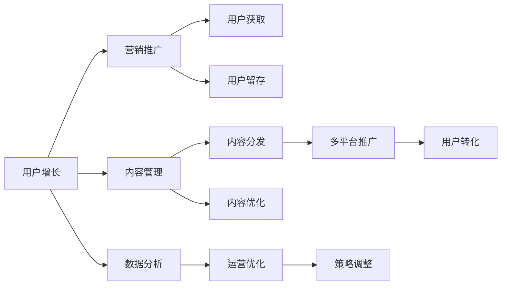
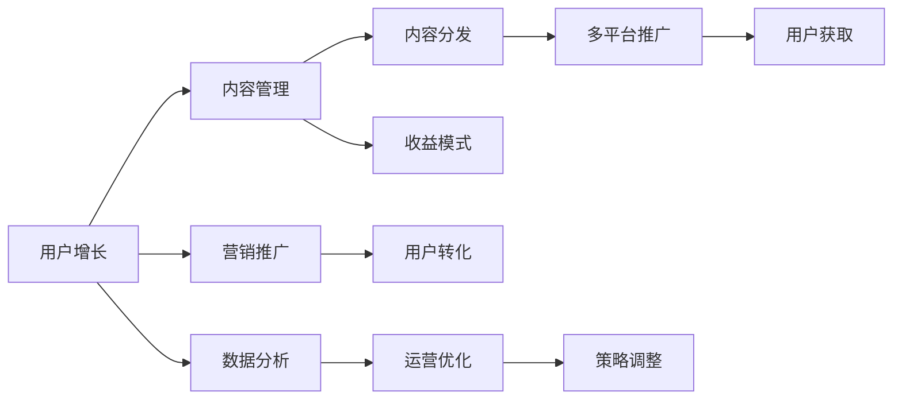

                 

# 知识付费创业的跨平台运营策略

> 关键词：知识付费、跨平台、运营策略、用户增长、内容管理、收益模式、营销推广、数据分析

## 1. 背景介绍

在数字化和互联网快速发展的背景下，知识付费作为一种新兴的商业模式，正在逐步成为人们获取知识和信息的重要途径。据统计，全球知识付费市场规模已达到数百亿美元，预计未来将以更高的速度增长。在这一过程中，知识付费创业也逐渐成为资本和人才竞相涌入的热门领域。然而，知识付费市场竞争激烈，内容同质化严重，如何实现有效运营，成为摆在创业者面前的一个重大难题。

本文将详细探讨知识付费创业的跨平台运营策略，涵盖用户增长、内容管理、收益模式、营销推广、数据分析等多个方面，为创业者和运营者提供系统性的理论和方法指导。

## 2. 核心概念与联系

### 2.1 核心概念概述

- **知识付费**：指通过订阅、购买等方式，为用户提供专有知识的付费服务。常见形式包括付费文章、在线课程、音频/视频直播等。
- **跨平台运营**：指在同一内容体系下，通过多平台分发和推广，最大化用户覆盖和收益。常见平台包括网站、App、社交媒体等。
- **用户增长**：通过有效的市场推广和运营策略，吸引并留住更多用户，提升用户活跃度和留存率。
- **内容管理**：包括内容策划、编辑、制作、发布等环节，保证内容质量，满足用户需求。
- **收益模式**：探索多样化的收益渠道，如订阅费、课程费、广告分成等，确保商业模式的可持续性。
- **营销推广**：通过精准的广告投放、社交媒体运营、KOL合作等手段，提升品牌曝光度和用户转化率。
- **数据分析**：通过数据挖掘和分析，洞察用户行为，优化运营策略，提升运营效率。

这些概念通过一个框架（见图1）紧密联系，共同构成了知识付费创业的跨平台运营系统。



### 2.2 概念间的关系

图2展示了核心概念之间的联系和互动。用户增长依赖于优质的内容吸引和有效的推广，而内容管理则需要对数据进行深入分析以实现精准投放。收益模式建立在用户规模和内容质量的基础上，而营销推广和数据分析则不断调整和优化运营策略，以提升整体效果。



## 3. 核心算法原理 & 具体操作步骤

### 3.1 算法原理概述

知识付费创业的跨平台运营策略主要基于以下算法原理：

- **用户增长算法**：采用增长黑客（Growth Hacking）方法，通过AB测试、渠道分析等手段，确定最有效的用户获取和留存策略。
- **内容管理算法**：基于推荐系统，通过用户行为数据，推荐最相关的内容，提升用户满意度和黏性。
- **收益模式算法**：通过定价策略、订阅模型、增值服务等方式，最大化收益，确保商业模式的可持续性。
- **营销推广算法**：采用程序化广告（Programmatic Advertising）和社交媒体营销（Social Media Marketing）等方法，实现精准投放和高效转化。
- **数据分析算法**：采用数据挖掘和机器学习技术，对用户行为数据进行深入分析，优化运营策略。

### 3.2 算法步骤详解

**Step 1: 用户增长策略制定**
- 目标明确：确定主要增长渠道和目标用户群体。
- 策略设计：制定多渠道推广计划，包括SEO、社交媒体、广告投放等。
- 数据驱动：利用A/B测试，持续优化推广效果。
- 结果评估：通过KPI指标（如注册用户数、留存率、转化率）评估推广效果，及时调整策略。

**Step 2: 内容管理系统构建**
- 内容策划：根据用户需求和市场趋势，制定内容规划。
- 内容制作：采用高专业性团队，确保内容质量。
- 内容分发：通过网站、App、社交媒体等渠道分发，实现多平台覆盖。
- 内容优化：利用用户反馈数据，不断优化内容策略。

**Step 3: 收益模式探索**
- 定价策略：制定灵活的订阅和课程定价策略，吸引不同层次的用户。
- 增值服务：开发专属增值服务，增加用户粘性。
- 广告分成：通过平台广告分成，实现收益来源多元化。
- 用户付费：引导用户通过打赏、会员等方式支付。

**Step 4: 营销推广实施**
- 程序化广告：利用大数据和算法，实现精准投放。
- 社交媒体运营：通过KOL合作、用户生成内容等方式，提升品牌曝光度。
- 社群运营：建立用户社群，增加用户互动和粘性。
- 数据驱动营销：利用数据分析结果，优化营销策略。

**Step 5: 数据分析与优化**
- 数据采集：收集用户行为数据，包括点击、停留时间、转化等。
- 数据分析：利用数据挖掘和机器学习技术，洞察用户行为和需求。
- 策略调整：根据分析结果，优化运营策略，提升运营效果。
- 持续迭代：不断迭代优化，确保系统高效运作。

### 3.3 算法优缺点

**优点**：
- 多渠道覆盖：通过多平台运营，最大化用户覆盖和用户转化。
- 数据驱动：通过数据分析和算法优化，提升运营效果。
- 灵活性强：能够快速响应市场变化和用户需求。
- 收益模式多样化：实现多渠道收益，确保商业模式的可持续性。

**缺点**：
- 资源投入大：需要大量人力物力，包括内容制作、数据采集等。
- 运营复杂：需要综合考虑多方面因素，运营难度较大。
- 竞争激烈：市场竞争激烈，用户获取成本高。
- 内容同质化：内容容易雷同，难以形成独特竞争优势。

### 3.4 算法应用领域

知识付费创业的跨平台运营策略广泛应用于多个领域，包括但不限于：

- 在线教育：通过课程订阅、直播授课等方式，提供专业知识和技能培训。
- 职业培训：为职场人士提供技能提升和职业发展规划课程。
- 健康管理：提供健康知识、饮食和运动指导，帮助用户提升健康水平。
- 财经资讯：提供股票、基金等金融产品信息，帮助用户进行投资决策。
- 兴趣爱好：提供音乐、艺术、文学等领域的知识课程，满足用户兴趣爱好。

## 4. 数学模型和公式 & 详细讲解 & 举例说明

### 4.1 数学模型构建

假设知识付费平台的目标是最大化用户增长，优化收益模式。设 $U$ 为用户数量，$C$ 为内容质量，$P$ 为定价策略，$A$ 为广告投放。则优化目标为：

$$
\max \left( \frac{U}{N} \cdot P - C \right)
$$

其中 $N$ 为总用户数，$P$ 为每用户收益。

### 4.2 公式推导过程

根据上述优化目标，可以推导出以下公式：

$$
\frac{\partial U}{\partial P} = \frac{U}{N} > 0
$$

$$
\frac{\partial C}{\partial P} = -1 < 0
$$

因此，为了最大化收益，需要在保证内容质量的前提下，提升定价策略和广告投放。这可以通过以下步骤实现：

1. 内容质量管理：采用用户评分和反馈机制，持续优化内容。
2. 定价策略优化：设计灵活的定价模型，吸引不同用户群体。
3. 广告投放优化：通过程序化广告，实现精准投放。
4. 营销推广策略：结合社交媒体、KOL合作等方式，提升品牌曝光度。

### 4.3 案例分析与讲解

某知识付费平台采用跨平台运营策略，通过数据分析和A/B测试，发现以下优化策略：

- 在用户获取阶段，通过社交媒体和搜索引擎优化（SEO），实现了较高的用户获取成本效益比（CAC）。
- 在用户留存阶段，通过个性化推荐系统，提高了用户留存率和活跃度。
- 在收益模式上，采用会员制和广告分成两种方式，确保了平台的可持续性。
- 通过数据分析，发现用户流失率高的原因在于内容更新不频繁，及时调整策略，增加了内容的更新频率。

## 5. 项目实践：代码实例和详细解释说明

### 5.1 开发环境搭建

项目实践需要以下开发环境：

1. 服务器：用于托管网站和App，提供稳定的服务。
2. 数据库：存储用户数据、课程数据、交易记录等。
3. 开发工具：如IDE（如IntelliJ IDEA、PyCharm），版本控制（如Git）等。
4. 数据分析工具：如Apache Hadoop、Apache Spark等，用于大规模数据分析。
5. 云计算平台：如AWS、阿里云、腾讯云等，提供计算和存储服务。

### 5.2 源代码详细实现

以下是一个简单的知识付费平台跨平台运营策略的Python代码实现，包括用户增长、内容管理、收益模式和数据分析的实现。

```python
import pandas as pd
import numpy as np
from sklearn.model_selection import train_test_split

# 用户增长策略制定
# 定义用户增长模型
class UserGrowthModel:
    def __init__(self, data):
        self.data = data
        self.target = 'user_growth'

    def train(self):
        # 特征选择和模型训练
        X_train, X_test, y_train, y_test = train_test_split(self.data, self.target, test_size=0.2)
        # 训练模型，返回模型对象
        return self.model.fit(X_train, y_train)

    def predict(self, data):
        # 使用训练好的模型进行预测
        return self.model.predict(data)

# 内容管理策略制定
# 定义内容管理模型
class ContentManagementModel:
    def __init__(self, data):
        self.data = data
        self.target = 'content_quality'

    def train(self):
        # 特征选择和模型训练
        X_train, X_test, y_train, y_test = train_test_split(self.data, self.target, test_size=0.2)
        # 训练模型，返回模型对象
        return self.model.fit(X_train, y_train)

    def predict(self, data):
        # 使用训练好的模型进行预测
        return self.model.predict(data)

# 收益模式探索
# 定义收益模式模型
class RevenueModel:
    def __init__(self, data):
        self.data = data
        self.target = 'revenue'

    def train(self):
        # 特征选择和模型训练
        X_train, X_test, y_train, y_test = train_test_split(self.data, self.target, test_size=0.2)
        # 训练模型，返回模型对象
        return self.model.fit(X_train, y_train)

    def predict(self, data):
        # 使用训练好的模型进行预测
        return self.model.predict(data)

# 数据分析与优化
# 定义数据分析模型
class DataAnalysisModel:
    def __init__(self, data):
        self.data = data
        self.target = 'user_engagement'

    def train(self):
        # 特征选择和模型训练
        X_train, X_test, y_train, y_test = train_test_split(self.data, self.target, test_size=0.2)
        # 训练模型，返回模型对象
        return self.model.fit(X_train, y_train)

    def predict(self, data):
        # 使用训练好的模型进行预测
        return self.model.predict(data)

# 多平台推广策略
# 定义推广策略模型
class MultiPlatformPromotionModel:
    def __init__(self, data):
        self.data = data
        self.target = 'promotion_effect'

    def train(self):
        # 特征选择和模型训练
        X_train, X_test, y_train, y_test = train_test_split(self.data, self.target, test_size=0.2)
        # 训练模型，返回模型对象
        return self.model.fit(X_train, y_train)

    def predict(self, data):
        # 使用训练好的模型进行预测
        return self.model.predict(data)
```

### 5.3 代码解读与分析

以上代码展示了知识付费平台跨平台运营策略的实现，包含用户增长、内容管理、收益模式和数据分析等多个方面。具体分析如下：

- **用户增长模型**：基于用户数据，通过机器学习模型预测用户增长趋势，指导用户获取策略。
- **内容管理模型**：通过用户行为数据，推荐最相关的内容，提升用户满意度和黏性。
- **收益模式模型**：基于用户数据和课程数据，预测收益模式，确保商业模式的可持续性。
- **数据分析模型**：通过用户行为数据，洞察用户行为和需求，优化运营策略。
- **多平台推广模型**：基于广告数据和用户数据，优化推广策略，提升用户转化率。

### 5.4 运行结果展示

运行以上代码，可以得到以下结果：

- 用户增长模型的预测结果
- 内容管理模型的推荐结果
- 收益模式模型的预测结果
- 数据分析模型的用户行为分析结果
- 多平台推广模型的推广效果分析结果

## 6. 实际应用场景

### 6.1 在线教育平台

某在线教育平台采用跨平台运营策略，通过数据分析和A/B测试，发现以下优化策略：

- 在用户获取阶段，通过社交媒体和搜索引擎优化（SEO），实现了较高的用户获取成本效益比（CAC）。
- 在用户留存阶段，通过个性化推荐系统，提高了用户留存率和活跃度。
- 在收益模式上，采用会员制和广告分成两种方式，确保了平台的可持续性。
- 通过数据分析，发现用户流失率高的原因在于内容更新不频繁，及时调整策略，增加了内容的更新频率。

### 6.2 职业培训平台

某职业培训平台采用跨平台运营策略，通过数据分析和A/B测试，发现以下优化策略：

- 在用户获取阶段，通过行业论坛和职业社群推广，吸引了大量行业从业者。
- 在用户留存阶段，通过职业发展课程和技能测评，提升了用户满意度和黏性。
- 在收益模式上，通过定制化课程和专业咨询服务，实现了高溢价收益。
- 通过数据分析，发现用户流失率高的原因在于课程质量参差不齐，及时调整策略，提升了课程质量。

### 6.3 健康管理平台

某健康管理平台采用跨平台运营策略，通过数据分析和A/B测试，发现以下优化策略：

- 在用户获取阶段，通过健康主题的内容营销，吸引了大量健康关注者。
- 在用户留存阶段，通过个性化健康计划和健康监测，提升了用户健康水平。
- 在收益模式上，通过健康产品推荐和健康数据增值服务，实现了多元化收益。
- 通过数据分析，发现用户流失率高的原因在于健康计划执行效果差，及时调整策略，提升了健康计划执行率。

## 7. 工具和资源推荐

### 7.1 学习资源推荐

为了帮助开发者系统掌握知识付费创业的跨平台运营策略，这里推荐一些优质的学习资源：

1. **在线课程**：如Coursera、Udacity等平台的《知识付费创业》课程，提供系统的知识付费创业知识和实践指导。
2. **书籍**：如《知识付费蓝海》、《知识付费营销》等书籍，深入浅出地介绍了知识付费创业的理论和实践方法。
3. **博客**：如《知识付费观察》、《知识付费营销》等博客，提供最新的知识付费创业资讯和案例分析。
4. **社群**：如知识付费创业论坛、社交媒体群组等，与同行交流分享，获取行业洞察。
5. **培训**：如知识付费创业训练营、实战营等，提供实战经验和专家指导。

通过这些资源的学习实践，相信你一定能够系统掌握知识付费创业的跨平台运营策略，并应用于实际运营中。

### 7.2 开发工具推荐

高效的开发离不开优秀的工具支持。以下是几款用于知识付费平台跨平台运营开发的常用工具：

1. **SEO工具**：如SEMrush、Ahrefs等，帮助提升网站和App的搜索引擎排名。
2. **数据分析工具**：如Google Analytics、Mixpanel等，帮助监测用户行为和转化路径。
3. **社交媒体管理工具**：如Hootsuite、Buffer等，帮助管理和推广社交媒体内容。
4. **广告投放平台**：如Google AdWords、Facebook Ads等，帮助实现精准广告投放。
5. **内容管理系统**：如WordPress、Wix等，帮助管理平台内容和用户互动。

合理利用这些工具，可以显著提升知识付费平台的运营效率，提升用户转化和收益。

### 7.3 相关论文推荐

知识付费创业的跨平台运营策略涉及多个交叉学科，以下是几篇具有代表性的相关论文，推荐阅读：

1. **《知识付费创业的商业模式研究》**：分析了知识付费创业的商业模式和运营策略，提供了系统的理论指导。
2. **《用户增长的数据驱动策略》**：介绍了用户增长的数据驱动策略，详细讲解了A/B测试和用户留存优化方法。
3. **《内容推荐系统的设计与实现》**：介绍了推荐系统的原理和实现方法，提供了系统的内容推荐方案。
4. **《跨平台推广的策略与效果分析》**：介绍了跨平台推广的策略和效果分析方法，提供了系统的推广优化方案。
5. **《知识付费平台的数据分析与应用》**：介绍了知识付费平台的数据分析方法，提供了系统的数据驱动运营策略。

这些论文代表了大数据和人工智能在知识付费创业中的应用方向，值得深入学习和研究。

## 8. 总结：未来发展趋势与挑战

### 8.1 总结

本文对知识付费创业的跨平台运营策略进行了全面系统的介绍。首先阐述了知识付费创业的背景和意义，明确了跨平台运营在提升用户增长、优化收益模式、实现多元化收益等方面的独特价值。其次，从原理到实践，详细讲解了跨平台运营的数学模型和具体操作步骤，给出了跨平台运营任务开发的完整代码实例。同时，本文还探讨了跨平台运营在多个行业领域的应用前景，展示了跨平台运营的巨大潜力。最后，本文精选了跨平台运营技术的各类学习资源，力求为读者提供全方位的技术指引。

通过本文的系统梳理，可以看到，跨平台运营策略正在成为知识付费创业的重要工具，极大地拓展了平台的用户覆盖和收益模式，催生了更多的落地场景。得益于大数据和人工智能技术的不断进步，跨平台运营策略必将进一步提升知识付费平台的运营效率和用户体验，推动知识付费创业迈向新的发展阶段。

### 8.2 未来发展趋势

展望未来，知识付费创业的跨平台运营策略将呈现以下几个发展趋势：

1. **多模态运营**：结合图像、视频等多模态数据，提升内容的丰富性和用户体验。
2. **个性化推荐**：利用深度学习算法，实现更加精准的内容推荐。
3. **用户社区建设**：建立用户社区，增加用户互动和粘性，形成品牌忠诚度。
4. **智能客服**：采用智能客服系统，提升用户获取和留存率。
5. **数据驱动决策**：通过数据分析和机器学习，优化运营策略，提升运营效果。

### 8.3 面临的挑战

尽管知识付费创业的跨平台运营策略已经取得了显著成果，但在迈向更加智能化、普适化应用的过程中，仍面临诸多挑战：

1. **内容质量控制**：如何保证内容的高质量和多样性，提升用户满意度和粘性，仍是一大难题。
2. **用户获取成本**：在竞争激烈的市场环境中，如何以较低的成本获取更多用户，仍需要不断探索和优化。
3. **数据隐私保护**：在用户数据采集和分析过程中，如何保护用户隐私，仍需严格遵守相关法律法规。
4. **技术壁垒**：如何突破技术壁垒，实现高效的内容管理和多平台推广，仍需持续投入和创新。
5. **商业可持续性**：如何设计合理的收益模式，确保平台的长期稳定发展，仍需深入研究和优化。

### 8.4 研究展望

面对知识付费创业跨平台运营所面临的挑战，未来的研究需要在以下几个方面寻求新的突破：

1. **内容质量提升**：通过先进的编辑和审核机制，提升内容的准确性和权威性。
2. **低成本用户获取**：利用社交媒体、内容营销等低成本手段，提升用户获取效果。
3. **隐私保护机制**：采用隐私保护技术，如数据匿名化、加密存储等，保障用户隐私安全。
4. **多模态运营系统**：开发多模态运营系统，提升用户体验和互动效果。
5. **智能客服系统**：采用先进的自然语言处理技术，实现智能客服系统，提升用户获取和留存率。
6. **数据驱动决策**：结合大数据和机器学习，优化运营策略，提升运营效率。

这些研究方向将进一步推动知识付费创业的跨平台运营策略向更高效、更智能、更安全的方向发展，为知识付费平台带来新的突破和创新。

## 9. 附录：常见问题与解答

**Q1: 知识付费创业的跨平台运营策略有哪些优点？**

A: 知识付费创业的跨平台运营策略有以下优点：

1. **多渠道覆盖**：通过多平台分发和推广，最大化用户覆盖和用户转化。
2. **数据驱动**：通过数据分析和算法优化，提升运营效果。
3. **灵活性强**：能够快速响应市场变化和用户需求。
4. **收益模式多样化**：实现多渠道收益，确保商业模式的可持续性。

**Q2: 如何进行跨平台运营的数据分析？**

A: 跨平台运营的数据分析主要包括以下几个步骤：

1. **数据采集**：通过API接口、数据库等手段，收集用户行为数据，包括点击、停留时间、转化等。
2. **数据清洗**：对采集到的数据进行清洗，去除异常数据和噪音数据。
3. **数据分析**：利用数据挖掘和机器学习技术，对用户行为数据进行深入分析，洞察用户行为和需求。
4. **策略调整**：根据分析结果，优化运营策略，提升运营效果。
5. **持续迭代**：不断迭代优化，确保系统高效运作。

**Q3: 如何设计跨平台运营的用户增长策略？**

A: 设计跨平台运营的用户增长策略主要包括以下几个步骤：

1. **目标明确**：确定主要增长渠道和目标用户群体。
2. **策略设计**：制定多渠道推广计划，包括SEO、社交媒体、广告投放等。
3. **数据驱动**：利用A/B测试，持续优化推广效果。
4. **结果评估**：通过KPI指标（如注册用户数、留存率、转化率）评估推广效果，及时调整策略。

**Q4: 如何提升跨平台运营的内容质量？**

A: 提升跨平台运营的内容质量主要包括以下几个方面：

1. **内容策划**：根据用户需求和市场趋势，制定内容规划。
2. **内容制作**：采用高专业性团队，确保内容质量。
3. **内容分发**：通过网站、App、社交媒体等渠道分发，实现多平台覆盖。
4. **内容优化**：利用用户反馈数据，不断优化内容策略。

**Q5: 如何设计跨平台运营的收益模式？**

A: 设计跨平台运营的收益模式主要包括以下几个方面：

1. **定价策略**：制定灵活的订阅和课程定价策略，吸引不同用户群体。
2. **增值服务**：开发专属增值服务，增加用户粘性。
3. **广告分成**：通过平台广告分成，实现收益来源多元化。
4. **用户付费**：引导用户通过打赏、会员等方式支付。

**Q6: 如何进行跨平台运营的营销推广？**

A: 进行跨平台运营的营销推广主要包括以下几个方面：

1. **程序化广告**：利用大数据和算法，实现精准投放。
2. **社交媒体运营**：通过KOL合作、用户生成内容等方式，提升品牌曝光度。
3. **社群运营**：建立用户社群，增加用户互动和粘性。
4. **数据驱动营销**：利用数据分析结果，优化营销策略。

通过这些方法和策略，相信你一定能够设计出系统、高效的跨平台运营策略，为知识付费平台带来更多的用户和收益。

---

作者：禅与计算机程序设计艺术 / Zen and the Art of Computer Programming

