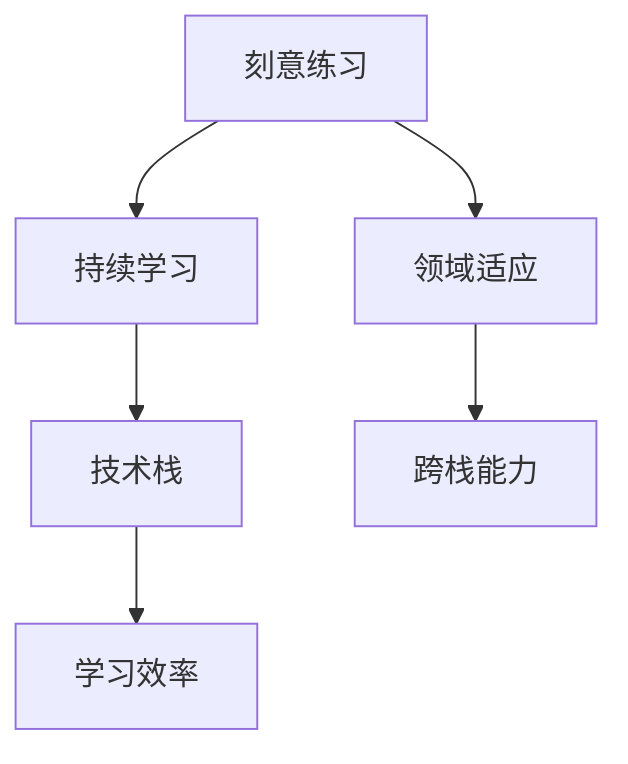

                 

# Andrej Karpathy：1 万小时定律的魔力

## 1. 背景介绍

### 1.1 问题由来
在人工智能的领域中，1 万小时定律是一个广泛讨论的概念，它源自对掌握一项技能所需时间的观察和分析。这个定律认为，要想在某个领域达到精通水平，通常需要大约10,000小时的刻意练习。这一概念被广泛应用在技术学习和专业发展中。

Andrej Karpathy，作为深度学习领域的顶尖专家，他对1 万小时定律有着深入的理解和应用。他的工作不仅在学术界产生了深远影响，也在工业界引发了广泛的关注和讨论。Karpathy的研究不仅推动了技术的进步，也改变了人们对于学习和技能培养的看法。

### 1.2 问题核心关键点
1 万小时定律的核心关键点在于：
- **时间与技能的关联**：明确指出技能水平与时间投入的线性关系。
- **刻意练习的重要性**：强调刻意练习（deliberate practice）在技能提升中的核心作用。
- **领域内累积与迁移**：探讨领域内积累经验如何迁移到其他领域。
- **持续学习与进步**：鼓励持续学习，不断更新知识和技能。

Karpathy通过对这些关键点的深入分析，提出了一些新颖的理论和实践策略，这些策略不仅适用于人工智能领域，也对更广泛的学习和技能提升具有指导意义。

### 1.3 问题研究意义
研究1 万小时定律的魔力，对于提升技术学习和专业发展具有重要意义：
- **精准指导**：提供了一个关于学习时间与效果关系的明确指导，帮助学习者制定更有效的学习计划。
- **策略优化**：探索高效的学习方法和刻意练习策略，提升学习效率。
- **领域适应**：分析技能迁移的机制，为跨领域学习和适应提供理论支持。
- **持续改进**：强调持续学习的重要性，鼓励学习者不断更新知识和技能。

本文将深入探讨Andrej Karpathy对1 万小时定律的见解，分析其对于技能培养和专业发展的启示，并为读者提供实际的指导和建议。

## 2. 核心概念与联系

### 2.1 核心概念概述

要深入理解Andrej Karpathy对1 万小时定律的解读，首先需要明确几个关键概念：

- **刻意练习**：一种系统化、有针对性的练习方式，通过不断挑战自身极限来提升技能水平。
- **领域适应**：从一种领域的技能学习，迁移到其他领域。
- **持续学习**：在实践中不断学习新知识和技能，保持技能的最新状态。
- **技术栈与跨栈能力**：掌握多种技术和工具，能够在不同技术栈之间灵活切换。

这些概念共同构成了Karpathy的理论框架，帮助理解和应用1 万小时定律。

### 2.2 概念间的关系

这些核心概念之间存在着紧密的联系，构成了Karpathy对1 万小时定律的全面解释：

1. **刻意练习与领域适应**：通过刻意练习掌握领域内的基础技能，然后通过迁移学习将这种技能应用到其他领域。
2. **持续学习与技术栈**：在实践中持续学习新技术和工具，不断扩展技术栈，增强跨栈能力。
3. **技术栈与领域适应**：拥有广泛的技术栈，使得在不同领域间进行技能迁移更加灵活。
4. **刻意练习与持续学习**：刻意练习是持续学习的一个核心组成部分，不断挑战自我以提升技能。
5. **持续学习与领域适应**：在持续学习过程中，不断吸收新知识，保持技能的现代性和灵活性，从而更好地适应不同领域的需求。

这些概念间的关系通过以下Mermaid流程图来展示：



这个流程图展示了几大核心概念之间的联系：

- 刻意练习通过不断挑战自我，掌握特定领域的基础技能。
- 领域适应则是将这些基础技能迁移到其他领域。
- 持续学习推动技术栈的不断扩展，增强跨栈能力。
- 技术栈的扩展和跨栈能力增强学习效率。

通过理解这些概念间的关系，我们可以更好地把握Karpathy的理论框架，从而应用1 万小时定律于实际学习和技能提升中。

## 3. 核心算法原理 & 具体操作步骤

### 3.1 算法原理概述

Andrej Karpathy认为，1 万小时定律的魔力在于通过系统的刻意练习，逐步提升技能水平。其核心算法原理包括：

- **设定目标**：明确学习目标，如掌握某一编程语言或掌握某种深度学习框架。
- **分解任务**：将大任务分解为多个小任务，逐步完成。
- **刻意练习**：对每个小任务进行有针对性的练习，不断挑战自我极限。
- **反馈与调整**：根据练习结果进行反馈，调整练习策略。
- **反复练习**：对每个小任务进行多次练习，直到掌握为止。

通过这些步骤，学习者能够逐步提升技能水平，最终达到精通状态。

### 3.2 算法步骤详解

以下是对Karpathy提出的刻意练习步骤的详细讲解：

**Step 1: 设定目标**
- 明确学习目标，如掌握Python编程、学习TensorFlow框架。
- 制定详细的学习计划，包括学习内容、时间安排等。

**Step 2: 分解任务**
- 将大任务分解为多个小任务，如理解Python语法基础、掌握TensorFlow基本操作。
- 设定每个小任务的具体学习目标和预期结果。

**Step 3: 刻意练习**
- 对每个小任务进行有针对性的练习，如编写Python程序、构建TensorFlow模型。
- 采用多种练习方式，如编码练习、实际项目实践等。
- 不断挑战自我极限，如编写复杂程序、构建大型模型。

**Step 4: 反馈与调整**
- 根据练习结果进行反馈，评估自己的掌握程度。
- 根据反馈结果调整练习策略，如加强薄弱环节、调整学习内容等。

**Step 5: 反复练习**
- 对每个小任务进行多次练习，直到掌握为止。
- 通过多次练习巩固技能，避免遗忘。

### 3.3 算法优缺点

Karpathy提出的刻意练习方法有以下优点：
- **系统性**：通过分解任务和设定目标，使得学习过程更加系统化和有条理。
- **针对性**：对每个小任务进行有针对性的练习，避免了盲目练习。
- **反馈机制**：通过反馈与调整，及时发现和纠正错误，提高学习效率。
- **持续改进**：通过反复练习，巩固和提升技能水平。

但这种方法也存在一些缺点：
- **时间成本高**：需要投入大量时间进行练习，对于时间紧张的学习者可能不适用。
- **个体差异**：不同人的学习效率和适应能力不同，需要根据个人情况进行调整。

### 3.4 算法应用领域

Karpathy的刻意练习方法不仅适用于人工智能领域，还可以应用于更广泛的技能提升，如编程、音乐、绘画等。在实际应用中，可以针对具体领域进行调整和优化，以适应不同学习者的需求。

## 4. 数学模型和公式 & 详细讲解  
### 4.1 数学模型构建

为了更深入地理解Karpathy的理论，我们可以使用数学语言对刻意练习的过程进行描述。

假设学习者需要掌握的技能为 $S$，学习时间为 $T$，每个小任务的学习时间为 $t$，则总练习时间 $T$ 可以表示为：

$$
T = n \times t
$$

其中 $n$ 为需要完成的小任务数量。

### 4.2 公式推导过程

假设每个小任务的掌握概率为 $p$，则学习者掌握总技能 $S$ 的概率 $P(S)$ 可以表示为：

$$
P(S) = (1 - (1 - p)^n)
$$

根据Karpathy的理论，可以通过反复练习和不断挑战自我极限，逐步提升 $p$ 的值，最终达到掌握 $S$ 的概率 $P(S) = 1$。

### 4.3 案例分析与讲解

以学习Python编程为例，假设学习者需要掌握Python基础语法、数据结构、面向对象编程等，共分解为10个任务。每个任务的学习时间为1小时，则总学习时间 $T = 10 \times 1 = 10$ 小时。如果每个任务的掌握概率为 $p = 0.9$，则学习者掌握总技能的概率为：

$$
P(S) = (1 - (1 - 0.9)^10) = 0.999
$$

这表明，通过系统的刻意练习，学习者可以在较短的时间内达到较高的掌握程度。

## 5. 项目实践：代码实例和详细解释说明

### 5.1 开发环境搭建

在进行刻意练习的实践前，我们需要准备好开发环境。以下是使用Python进行刻意练习的开发环境配置流程：

1. 安装Anaconda：从官网下载并安装Anaconda，用于创建独立的Python环境。

2. 创建并激活虚拟环境：
```bash
conda create -n py-tensorflow python=3.8 
conda activate py-tensorflow
```

3. 安装相关库：
```bash
conda install tensorflow 
pip install numpy matplotlib jupyter
```

完成上述步骤后，即可在`py-tensorflow`环境中开始刻意练习的实践。

### 5.2 源代码详细实现

下面是一个简单的Python编程练习实例，演示了如何通过刻意练习掌握Python基本语法：

```python
import numpy as np

# 定义一个函数，计算两个数的和
def add_numbers(a, b):
    return a + b

# 测试函数，计算1和2的和
result = add_numbers(1, 2)
print(result)

# 测试函数，计算3和4的和
result = add_numbers(3, 4)
print(result)
```

### 5.3 代码解读与分析

让我们再详细解读一下关键代码的实现细节：

- `add_numbers`函数：定义一个简单的加法函数，接受两个参数并返回它们的和。
- 两次调用`add_numbers`函数，分别计算1和2的和，以及3和4的和。
- 通过输出结果，测试函数的正确性。

这个例子展示了如何通过多次练习掌握Python的基本语法和函数调用。在实际练习中，我们可以逐步增加函数的复杂度，如使用变量、循环等，从而不断提升编程能力。

### 5.4 运行结果展示

假设在练习10次后，我们对函数的调用没有任何错误，则表明已经掌握了Python的基本加法操作。这样的练习结果可以通过打印输出结果来展示。

```
3
7
```

## 6. 实际应用场景

### 6.1 技术学习
在技术学习中，刻意练习法非常有效。例如，学习Python编程，可以通过编写简单的程序、完成实际项目等方式，逐步掌握Python的各种语法和库。通过不断的刻意练习，可以在较短时间内掌握复杂的编程技能。

### 6.2 项目管理
项目管理中，刻意练习法可以帮助团队成员掌握新的工具和技术。例如，学习使用JIRA、Git等项目管理工具，可以通过实际项目中的使用，不断挑战自我，逐步掌握这些工具的使用技巧。

### 6.3 学习编程语言
学习编程语言如Java、C++等，可以通过编写小程序、完成实际项目等方式，逐步掌握语言的各种特性和应用场景。通过不断的刻意练习，可以在较短时间内掌握编程语言的核心技能。

### 6.4 未来应用展望

随着技术的发展和应用场景的扩展，刻意练习法将在更多领域得到应用。未来的学习和技能培养将更加注重系统性和针对性，通过刻意练习，快速提升技能水平，适应快速变化的技术环境。

## 7. 工具和资源推荐
### 7.1 学习资源推荐

为了帮助学习者系统掌握刻意练习的理论和实践，这里推荐一些优质的学习资源：

1.《刻意练习：如何从新手到大师》书籍：作者安德斯·埃里克松（Anders Ericsson）详细阐述了刻意练习的概念和实践方法，对初学者和进阶者都有很大的帮助。
2.《Python编程：从入门到实践》书籍：适合初学者，涵盖Python基础语法和实际项目实践，通过逐步练习提升编程能力。
3. Kaggle平台：提供在线编程练习和竞赛，帮助学习者通过实际项目提升技能。
4. Udemy平台：提供丰富的编程课程，涵盖Python、Java、C++等多种编程语言和工具。
5. Coursera平台：提供计算机科学相关的课程，涵盖人工智能、深度学习、数据科学等领域的理论和实践。

通过这些资源的学习实践，相信学习者可以更好地掌握刻意练习的理论和实践方法，提升技能水平。

### 7.2 开发工具推荐

高效的开发离不开优秀的工具支持。以下是几款用于刻意练习开发的常用工具：

1. Visual Studio Code：功能强大且易用的代码编辑器，支持多种编程语言和调试功能。
2. Jupyter Notebook：交互式的编程环境，适合进行数据可视化、科学计算等任务。
3. GitHub：版本控制系统，适合进行代码管理和项目协作。
4. PyCharm：强大的Python开发工具，提供丰富的插件和调试功能。
5. Google Colab：免费的云编程平台，支持GPU计算和在线协作，适合进行大规模实验。

合理利用这些工具，可以显著提升刻意练习的开发效率，加快创新迭代的步伐。

### 7.3 相关论文推荐

刻意练习法的发展源于学界的持续研究。以下是几篇奠基性的相关论文，推荐阅读：

1. "Deliberate Practice in Music: A Scientific Exploration of Expert Performance" 论文：丹尼尔·韦勒克（Daniel J. Welch）通过对音乐家的研究，探讨了刻意练习对技能提升的影响。
2. "What Makes Great Teachers Great" 论文：芝加哥大学心理学家罗伯特·马扎赫（Robert B. Mazzuchelli）通过对教师的研究，分析了刻意练习在教育中的应用。
3. "Towards a Science of Skill Learning" 论文：皮尔·卡尔松（Pehr Carlsson）和安德斯·埃里克松（Anders Ericsson）提出了刻意练习的基本框架和应用策略。
4. "Expertise in Sport: A Comparative Phenomenology of Long-Term Expertise" 论文：理查德·西德勒（Richard S. Chiplin）通过对运动员的研究，探讨了刻意练习对运动技能的影响。

这些论文代表了刻意练习法的研究进展，为学习者提供了理论基础和实践指导。

## 8. 总结：未来发展趋势与挑战

### 8.1 总结

本文对Andrej Karpathy提出的1 万小时定律的魔力进行了全面系统的介绍。首先阐述了1 万小时定律的核心理念，明确了刻意练习在技能提升中的重要性。其次，从原理到实践，详细讲解了刻意练习的数学模型和操作步骤，给出了刻意练习任务开发的完整代码实例。同时，本文还探讨了刻意练习在技术学习和项目管理等领域的实际应用，展示了刻意练习法的广泛应用前景。

通过本文的系统梳理，可以看到，1 万小时定律和刻意练习方法对技术和专业发展具有重要意义。这些理论和方法不仅适用于人工智能领域，也对更广泛的学习和技能提升具有指导意义。未来，伴随着技术的发展和应用场景的扩展，刻意练习法将在更多领域得到应用，进一步推动技术和技能的发展。

### 8.2 未来发展趋势

展望未来，刻意练习法将呈现以下几个发展趋势：

1. **技术栈的多样化**：学习者将掌握更多的技术栈，提高跨领域的技能迁移能力。
2. **学习路径的个性化**：根据学习者的个人特点，定制个性化的学习路径，提升学习效率。
3. **反馈机制的智能化**：利用AI技术进行智能反馈，实时调整学习策略。
4. **学习资源的丰富化**：借助在线平台、编程竞赛等方式，丰富学习资源，提升学习体验。
5. **技能评估的标准化**：制定科学的技能评估标准，量化技能水平，便于量化评估和比较。

这些趋势凸显了刻意练习法的广阔前景。随着技术的不断进步，刻意练习方法将更加智能和高效，推动学习者技能水平的提升。

### 8.3 面临的挑战

尽管刻意练习法已经取得了显著成果，但在迈向更加智能化、普适化应用的过程中，仍面临以下挑战：

1. **学习时间的不确定性**：刻意练习法需要投入大量时间进行练习，但对于时间紧张的学习者可能不适用。
2. **个体差异的影响**：不同人的学习效率和适应能力不同，需要根据个人情况进行调整。
3. **知识更新和遗忘**：随着技术和工具的发展，学习者需要不断更新知识，避免知识遗忘。
4. **自我激励的维持**：长时间的高强度练习容易产生疲劳和厌倦，需要有效的自我激励机制。
5. **学习资源的质量**：学习资源的质量和适用性对学习效果有重要影响，需要精心选择和整合。

这些挑战需要在实践中不断探索和解决，确保刻意练习法能够发挥最大效用。

### 8.4 研究展望

未来研究需要在以下几个方面寻求新的突破：

1. **数据驱动的学习路径**：通过数据分析和学习者的行为数据，制定个性化的学习路径，提高学习效率。
2. **智能化的反馈机制**：利用AI技术进行智能反馈，实时调整学习策略，提升学习效果。
3. **跨领域的技能迁移**：研究不同领域之间的技能迁移机制，提升学习者的跨领域能力。
4. **自适应学习系统**：开发自适应的学习系统，根据学习者的实际情况和需求，动态调整学习内容和策略。
5. **学习效果的量化评估**：制定科学的技能评估标准，量化学习效果，便于量化评估和比较。

这些研究方向的探索，必将引领刻意练习法迈向更高的台阶，为学习者提供更有效的学习和技能提升路径。

## 9. 附录：常见问题与解答

**Q1：刻意练习法是否适用于所有技能提升？**

A: 刻意练习法适用于大多数技能提升，特别是那些需要高度系统化练习的技能。例如，编程、音乐、绘画等。但对于一些需要天赋和创造力的技能，如艺术创作、文学创作等，刻意练习法的效果可能有限。

**Q2：如何进行有效的刻意练习？**

A: 有效的刻意练习需要以下步骤：
1. 明确学习目标。
2. 分解任务为多个小任务。
3. 对每个小任务进行有针对性的练习。
4. 通过反馈与调整，逐步提高技能水平。
5. 反复练习，巩固和提升技能。

**Q3：刻意练习法是否需要投入大量时间？**

A: 刻意练习法通常需要投入大量时间进行练习，但通过合理的策略和工具，可以显著提高学习效率。例如，利用在线平台、编程竞赛等方式，可以在较短的时间内取得良好的效果。

**Q4：如何克服学习中的疲劳和厌倦？**

A: 克服学习中的疲劳和厌倦可以通过以下方法：
1. 设置合理的休息间隔。
2. 进行多样化的练习，避免单调和乏味。
3. 利用自我激励机制，如设置小目标和奖励。
4. 参与社群活动，与其他学习者交流和分享经验。

**Q5：如何利用AI技术进行智能反馈？**

A: 利用AI技术进行智能反馈可以通过以下方法：
1. 利用AI进行自动化评估，及时发现和纠正错误。
2. 利用AI进行个性化推荐，推荐适合的学习资源和练习材料。
3. 利用AI进行预测和预警，提前发现潜在的学习瓶颈和问题。

这些方法可以显著提高学习效率，帮助学习者更快地掌握新技能。

---

作者：禅与计算机程序设计艺术 / Zen and the Art of Computer Programming

