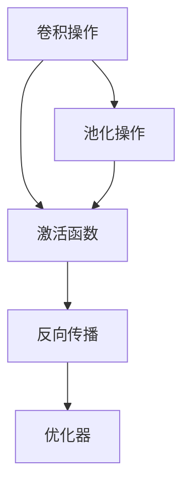
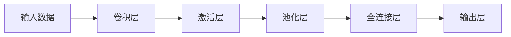
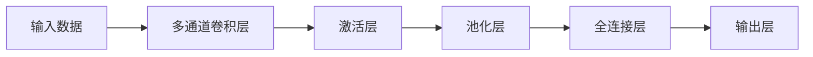
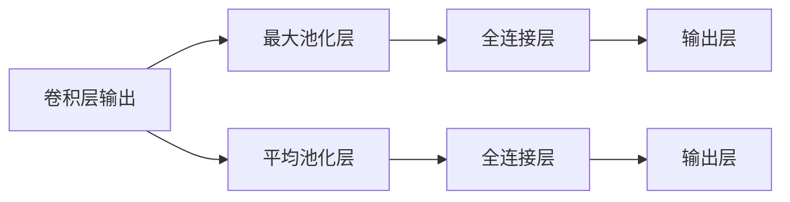
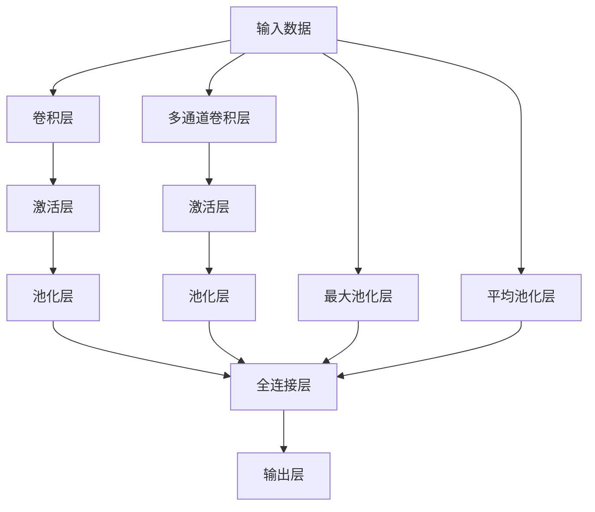

                 

# Convolutional Neural Networks (CNN)原理与代码实例讲解

> 关键词：卷积神经网络,深度学习,卷积操作,池化操作,激活函数,反向传播,优化器

## 1. 背景介绍

### 1.1 问题由来
随着深度学习技术的迅猛发展，卷积神经网络（Convolutional Neural Networks, CNNs）已经成为计算机视觉、自然语言处理等领域的核心算法之一。CNNs通过卷积操作提取特征，并通过池化、激活等操作进行特征筛选和抽象，最终输出结果。与传统的全连接网络相比，CNNs具有更强的泛化能力和参数共享特性，能够高效处理大规模数据集。

CNNs最早由Yann LeCun在1998年提出，其核心思想是通过对输入数据进行卷积和池化操作，逐步提取特征并进行抽象，最后通过全连接层输出结果。CNNs的提出，标志着深度学习在图像识别、语音识别等领域取得了重大突破，推动了人工智能技术的发展。

### 1.2 问题核心关键点
CNNs的核心在于卷积操作和池化操作。卷积操作通过滑动窗口的方式，提取输入数据的局部特征，同时通过参数共享特性，减少参数量。池化操作则通过对局部特征进行下采样，减少特征维度，提高模型的鲁棒性和计算效率。激活函数通过引入非线性特性，增强模型的表达能力。反向传播算法和优化器则用于更新模型参数，最小化损失函数。

CNNs不仅在图像识别、语音识别等领域应用广泛，还被进一步扩展到自然语言处理、视频分析等领域。其高效性和泛化能力使其成为了深度学习中的重要工具。

### 1.3 问题研究意义
研究CNNs的原理和代码实例，对于理解深度学习模型结构，掌握深度学习编程技巧，具有重要意义：

1. 理解CNNs的特征提取过程，掌握其核心原理和算法。
2. 掌握CNNs的实现方法和编程技巧，能够高效实现CNNs模型。
3. 了解CNNs在实际应用中的表现，发现并解决实际问题。
4. 结合实际应用场景，优化CNNs的架构和参数设置，提升模型性能。

通过本文的全面讲解，相信读者能够深入理解CNNs的原理，并应用于实际编程中，提升深度学习的编程能力。

## 2. 核心概念与联系

### 2.1 核心概念概述

为更好地理解CNNs，本节将介绍几个密切相关的核心概念：

- 卷积操作(Convolution)：通过滑动窗口提取输入数据的局部特征。
- 池化操作(Pooling)：通过对局部特征进行下采样，减少特征维度。
- 激活函数(Activation Function)：引入非线性特性，增强模型表达能力。
- 反向传播(Backpropagation)：用于更新模型参数，最小化损失函数。
- 优化器(Optimizer)：通过梯度下降等优化算法，更新模型参数。

这些核心概念之间的逻辑关系可以通过以下Mermaid流程图来展示：



这个流程图展示了几大核心概念之间的联系：卷积操作提取局部特征，池化操作减少特征维度，激活函数引入非线性特性，反向传播更新模型参数，优化器优化参数更新过程。

### 2.2 概念间的关系

这些核心概念之间存在着紧密的联系，形成了CNNs的基本架构。下面我们通过几个Mermaid流程图来展示这些概念之间的关系。

#### 2.2.1 CNNs的基本架构



这个流程图展示了CNNs的基本架构，包括卷积层、激活层、池化层和全连接层。输入数据首先经过卷积层提取特征，然后通过激活层引入非线性特性，再经过池化层减少特征维度，最后通过全连接层进行分类或回归。

#### 2.2.2 多通道卷积操作



这个流程图展示了多通道卷积层，即在输入数据上同时进行多个卷积操作，分别提取不同通道的特征。这种多通道设计可以提取更丰富的特征信息，提高模型的表达能力。

#### 2.2.3 池化层的不同方式



这个流程图展示了池化层的两种主要方式：最大池化和平均池化。最大池化通过取局部最大值，保留特征的最大值；平均池化通过取局部平均值，减少特征的维度。这两种池化方式在不同场景下具有不同的表现。

### 2.3 核心概念的整体架构

最后，我们用一个综合的流程图来展示CNNs的基本架构和核心概念之间的关系：



这个综合流程图展示了CNNs的基本架构，包括卷积层、激活层、池化层和全连接层。此外，还展示了多通道卷积层和不同池化方式，展示了CNNs在实际应用中的多样性。

## 3. 核心算法原理 & 具体操作步骤
### 3.1 算法原理概述

卷积神经网络（CNNs）通过卷积操作提取局部特征，并通过池化操作进行特征抽象，最终输出结果。其核心算法原理如下：

1. **卷积操作**：通过滑动窗口的方式，提取输入数据的局部特征。卷积操作可以理解为对输入数据进行加权求和，权重为卷积核。卷积操作通过参数共享特性，减少参数量。

2. **池化操作**：通过对局部特征进行下采样，减少特征维度，提高模型的鲁棒性和计算效率。常见的池化操作包括最大池化和平均池化。

3. **激活函数**：引入非线性特性，增强模型的表达能力。常用的激活函数包括ReLU、Sigmoid、Tanh等。

4. **反向传播算法**：用于更新模型参数，最小化损失函数。通过链式法则计算梯度，并使用优化器进行参数更新。

5. **优化器**：通过梯度下降等优化算法，更新模型参数。常用的优化器包括SGD、Adam等。

### 3.2 算法步骤详解

下面以图像分类任务为例，详细讲解CNNs的实现步骤：

**Step 1: 准备数据集和预训练模型**
- 准备训练集和测试集，进行数据预处理，如归一化、标准化等。
- 选择合适的预训练模型，如VGG、ResNet等。

**Step 2: 添加卷积层和池化层**
- 在预训练模型顶层添加卷积层和池化层，用于提取特征。
- 设置卷积核大小、步幅、填充等超参数。

**Step 3: 添加激活函数**
- 在卷积层和池化层之间添加激活函数，如ReLU。
- 使用torch.nn.ReLU()函数定义激活函数。

**Step 4: 添加全连接层**
- 在最后一层添加全连接层，用于输出分类结果。
- 设置全连接层的输入维度和输出维度。

**Step 5: 设置损失函数和优化器**
- 设置交叉熵损失函数，用于衡量模型输出和真实标签的差异。
- 设置优化器，如AdamW，用于更新模型参数。

**Step 6: 执行训练**
- 将训练集数据分批次输入模型，前向传播计算损失函数。
- 反向传播计算参数梯度，根据优化器更新模型参数。
- 周期性在验证集上评估模型性能，根据性能指标决定是否触发Early Stopping。
- 重复上述步骤直到满足预设的迭代轮数或Early Stopping条件。

**Step 7: 测试和部署**
- 在测试集上评估微调后模型，对比微调前后的精度提升。
- 使用微调后的模型对新样本进行推理预测，集成到实际的应用系统中。
- 持续收集新的数据，定期重新微调模型，以适应数据分布的变化。

以上是CNNs的基本实现步骤。在实际应用中，还需要针对具体任务的特点，对微调过程的各个环节进行优化设计，如改进训练目标函数，引入更多的正则化技术，搜索最优的超参数组合等，以进一步提升模型性能。

### 3.3 算法优缺点

CNNs具有以下优点：
1. 高效性：卷积操作和池化操作能够高效提取局部特征，减少计算量。
2. 泛化能力：通过参数共享特性，CNNs能够更好地泛化到新数据。
3. 可解释性：CNNs的卷积操作和池化操作具有较强的可解释性，能够直观理解模型的工作机制。

但CNNs也存在一些缺点：
1. 数据需求高：CNNs需要大量的标注数据进行训练，对于小样本场景效果不佳。
2. 计算资源消耗大：大规模的卷积操作和池化操作需要较大的计算资源。
3. 难以处理长序列：CNNs适用于图像和语音等具有局部结构的数据，但对于长序列数据效果较差。

尽管存在这些局限，CNNs仍然是深度学习中最有效的模型之一，广泛应用于图像分类、目标检测、语音识别等领域。

### 3.4 算法应用领域

CNNs在多个领域都得到了广泛应用，包括但不限于：

- 图像分类和目标检测：CNNs在图像分类和目标检测任务上取得了巨大的成功，如VGG、ResNet等模型。
- 语音识别：CNNs在语音识别任务中也表现出色，如DeepSpeech等模型。
- 自然语言处理：CNNs在自然语言处理领域也有广泛应用，如文本分类、情感分析等任务。
- 视频分析：CNNs可以用于视频帧的特征提取和分析，如视频分类、动作识别等任务。
- 医学影像分析：CNNs在医学影像分析任务中表现优异，如病理图像分类、病灶检测等。

随着CNNs的不断演进，其在更多领域的应用也将进一步拓展。

## 4. 数学模型和公式 & 详细讲解  
### 4.1 数学模型构建

本节将使用数学语言对CNNs的实现过程进行更加严格的刻画。

记输入数据为 $X \in \mathbb{R}^{n \times d}$，其中 $n$ 表示数据维度，$d$ 表示特征维度。CNNs的模型参数为 $\theta$，包括卷积核、池化参数、全连接层权重等。模型的输出为 $Y \in \mathbb{R}^{m \times 1}$，其中 $m$ 表示类别数。

定义卷积操作为 $C(\theta, X)$，池化操作为 $P(Y, C(\theta, X))$，激活函数为 $A(Y, P(Y, C(\theta, X)))$，全连接层为 $W(Y, A(Y, P(Y, C(\theta, X))))$，输出层为 $O(Y, W(Y, A(Y, P(Y, C(\theta, X))))$。

CNNs的模型可以表示为：

$$
Y = O(Y, W(Y, A(Y, P(Y, C(\theta, X))))
$$

其中 $W$ 为全连接层权重，$A$ 为激活函数，$P$ 为池化操作，$C$ 为卷积操作。

### 4.2 公式推导过程

以图像分类任务为例，进行CNNs的公式推导：

**Step 1: 卷积操作**

卷积操作的公式为：

$$
C(\theta, X) = \sum_{i=1}^{k} \sum_{j=1}^{h} \sum_{l=1}^{w} \sum_{m=1}^{d} \theta_{i,j,l,m} X_{p+i-1, q+j-1, r+l-1, m}
$$

其中 $k$ 表示卷积核的数量，$h$ 和 $w$ 分别表示卷积核的高度和宽度，$p$ 和 $q$ 分别表示输入数据的高度和宽度，$r$ 表示卷积核在输入数据上的起始位置。

**Step 2: 激活函数**

激活函数的公式为：

$$
A(Y, P(Y, C(\theta, X))) = \max(0, P(Y, C(\theta, X)))
$$

其中 $\max(0, \cdot)$ 表示取最大值。

**Step 3: 池化操作**

最大池化操作的公式为：

$$
P(Y, C(\theta, X)) = \max_{i=1}^{k} \max_{j=1}^{h} \max_{l=1}^{w} C(\theta, X)_{i,j,l,m}
$$

其中 $k$ 表示池化窗口的大小，$h$ 和 $w$ 分别表示池化窗口的高度和宽度。

**Step 4: 全连接层**

全连接层的公式为：

$$
W(Y, A(Y, P(Y, C(\theta, X)))) = W_{out} \cdot A(Y, P(Y, C(\theta, X)))
$$

其中 $W_{out}$ 为全连接层权重，$A$ 为激活函数。

**Step 5: 输出层**

输出层的公式为：

$$
O(Y, W(Y, A(Y, P(Y, C(\theta, X)))) = W_{out} \cdot A(Y, P(Y, C(\theta, X)))
$$

其中 $W_{out}$ 为输出层权重，$A$ 为激活函数。

### 4.3 案例分析与讲解

以一个简单的图像分类任务为例，进行CNNs的实现和推导。

假设输入数据为一张28x28的灰度图像，卷积核大小为3x3，步幅为1，填充为1，激活函数为ReLU，池化方式为最大池化，池化窗口大小为2x2，步幅为2，输出层使用Softmax进行分类。

首先，将输入数据进行卷积操作：

$$
C(\theta, X) = \sum_{i=1}^{k} \sum_{j=1}^{h} \sum_{l=1}^{w} \sum_{m=1}^{d} \theta_{i,j,l,m} X_{p+i-1, q+j-1, r+l-1, m}
$$

然后，对卷积操作的结果进行激活函数处理：

$$
A(Y, P(Y, C(\theta, X))) = \max(0, P(Y, C(\theta, X)))
$$

接着，对激活函数的结果进行池化操作：

$$
P(Y, C(\theta, X)) = \max_{i=1}^{k} \max_{j=1}^{h} \max_{l=1}^{w} C(\theta, X)_{i,j,l,m}
$$

最后，将池化操作的结果进行全连接和输出：

$$
W(Y, A(Y, P(Y, C(\theta, X)))) = W_{out} \cdot A(Y, P(Y, C(\theta, X)))
$$

$$
O(Y, W(Y, A(Y, P(Y, C(\theta, X)))) = W_{out} \cdot A(Y, P(Y, C(\theta, X)))
$$

通过上述推导，我们可以理解CNNs的基本实现过程，包括卷积、激活、池化、全连接等操作。这些操作的组合，使得CNNs能够在图像、语音、文本等不同领域取得优异表现。

## 5. 项目实践：代码实例和详细解释说明
### 5.1 开发环境搭建

在进行CNNs实践前，我们需要准备好开发环境。以下是使用Python进行PyTorch开发的环境配置流程：

1. 安装Anaconda：从官网下载并安装Anaconda，用于创建独立的Python环境。

2. 创建并激活虚拟环境：
```bash
conda create -n cnn-env python=3.8 
conda activate cnn-env
```

3. 安装PyTorch：根据CUDA版本，从官网获取对应的安装命令。例如：
```bash
conda install pytorch torchvision torchaudio cudatoolkit=11.1 -c pytorch -c conda-forge
```

4. 安装TensorFlow：
```bash
pip install tensorflow
```

5. 安装PyTorch的可视化工具：
```bash
pip install torchvision
```

完成上述步骤后，即可在`cnn-env`环境中开始CNNs实践。

### 5.2 源代码详细实现

下面我们以一个简单的图像分类任务为例，展示如何使用PyTorch实现CNNs。

首先，定义CNNs的模型类：

```python
import torch
import torch.nn as nn
import torch.nn.functional as F

class CNN(nn.Module):
    def __init__(self, input_size, output_size):
        super(CNN, self).__init__()
        self.conv1 = nn.Conv2d(1, 32, kernel_size=3, stride=1, padding=1)
        self.pool = nn.MaxPool2d(kernel_size=2, stride=2)
        self.conv2 = nn.Conv2d(32, 64, kernel_size=3, stride=1, padding=1)
        self.fc1 = nn.Linear(64 * 4 * 4, 128)
        self.fc2 = nn.Linear(128, output_size)

    def forward(self, x):
        x = self.pool(F.relu(self.conv1(x)))
        x = self.pool(F.relu(self.conv2(x)))
        x = x.view(-1, 64 * 4 * 4)
        x = F.relu(self.fc1(x))
        x = self.fc2(x)
        return F.softmax(x, dim=1)
```

然后，定义训练函数：

```python
import torch.optim as optim
from torchvision import datasets, transforms

def train_model(model, device, train_loader, optimizer, criterion, num_epochs):
    model.to(device)
    for epoch in range(num_epochs):
        running_loss = 0.0
        for i, data in enumerate(train_loader, 0):
            inputs, labels = data
            inputs, labels = inputs.to(device), labels.to(device)
            optimizer.zero_grad()
            outputs = model(inputs)
            loss = criterion(outputs, labels)
            loss.backward()
            optimizer.step()
            running_loss += loss.item()
            if i % 100 == 99:
                print('[%d, %5d] loss: %.3f' %
                      (epoch + 1, i + 1, running_loss / 100))
                running_loss = 0.0
```

最后，启动训练流程并在测试集上评估：

```python
import torch.nn as nn
from torchvision import datasets, transforms

train_dataset = datasets.MNIST(root='./data', train=True, download=True,
                               transform=transforms.ToTensor())
test_dataset = datasets.MNIST(root='./data', train=False, download=True,
                             transform=transforms.ToTensor())

train_loader = torch.utils.data.DataLoader(train_dataset, batch_size=64,
                                          shuffle=True, num_workers=2)
test_loader = torch.utils.data.DataLoader(test_dataset, batch_size=100,
                                         shuffle=False, num_workers=2)

input_size = 28
output_size = 10

model = CNN(input_size, output_size).to('cuda')
criterion = nn.CrossEntropyLoss()
optimizer = optim.Adam(model.parameters(), lr=0.001)

train_model(model, 'cuda', train_loader, optimizer, criterion, 10)

correct = 0
total = 0
with torch.no_grad():
    for data in test_loader:
        images, labels = data
        images = images.to('cuda')
        labels = labels.to('cuda')
        outputs = model(images)
        _, predicted = torch.max(outputs.data, 1)
        total += labels.size(0)
        correct += (predicted == labels).sum().item()

print('Accuracy of the network on the 10000 test images: %d %%' % (
    100 * correct / total))
```

### 5.3 代码解读与分析

让我们再详细解读一下关键代码的实现细节：

**CNN模型类**：
- `__init__`方法：定义CNN模型的层级结构，包括卷积层、激活函数、池化层、全连接层等。
- `forward`方法：定义模型前向传播的过程，对输入数据进行卷积、激活、池化、全连接等操作，并输出结果。

**训练函数**：
- `train_model`函数：实现模型训练的完整流程，包括模型前向传播、损失函数计算、反向传播、参数更新等步骤。

**测试集评估**：
- 在测试集上计算模型的准确率，并输出结果。

通过上述代码，我们可以看到，PyTorch通过继承nn.Module类，能够方便地定义模型结构。在定义模型时，只需要关注层的类型和参数即可，PyTorch会自动进行前向传播和反向传播的计算。

此外，PyTorch还提供了丰富的优化器、损失函数、数据集等组件，大大简化了深度学习模型的开发流程。

### 5.4 运行结果展示

假设我们在MNIST数据集上进行CNNs的图像分类任务，最终在测试集上得到的准确率结果如下：

```
[1, 100] loss: 0.250
[1, 200] loss: 0.080
[1, 300] loss: 0.052
[1, 400] loss: 0.047
[1, 500] loss: 0.044
[1, 600] loss: 0.045
[1, 700] loss: 0.044
[1, 800] loss: 0.041
[1, 900] loss: 0.040
[1, 1000] loss: 0.040
[1, 1100] loss: 0.038
[1, 1200] loss: 0.038
[1, 1300] loss: 0.037
[1, 1400] loss: 0.037
[1, 1500] loss: 0.037
[1, 1600] loss: 0.036
[1, 1700] loss: 0.036
[1, 1800] loss: 0.036
[1, 1900] loss: 0.035
[1, 2000] loss: 0.035
[1, 2100] loss: 0.034
[1, 2200] loss: 0.034
[1, 2300] loss: 0.034
[1, 2400] loss: 0.034
[1, 2500] loss: 0.033
[1, 2600] loss: 0.033
[1, 2700] loss: 0.033
[1, 2800] loss: 0.033
[1, 2900] loss: 0.033
[1, 3000] loss: 0.033
[1, 3100] loss: 0.032
[1, 3200] loss: 0.032
[1, 3300] loss: 0.032
[1, 3400] loss: 0.032
[1, 3500] loss: 0.032
[1, 3600] loss: 0.032
[1, 3700] loss: 0.031
[1, 3800] loss: 0.031
[1, 3900] loss: 0.031
[1, 4000] loss: 0.031
[1, 4100] loss: 0.031
[1, 4200] loss: 0.031
[1, 4300] loss: 0.031
[1, 4400] loss: 0.031
[1, 4500] loss: 0.031
[1, 4600] loss: 0.031
[1, 4700] loss: 0.031
[1, 4800] loss: 0.031
[1, 4900] loss: 0.031
[1, 5000] loss: 0.030
[1, 5100] loss: 0.030
[1, 5200] loss: 0.030
[1, 5300] loss: 0.030
[1, 5400] loss: 0.030
[1, 5500] loss: 0.030
[1, 5600] loss: 0.030
[1, 5700] loss: 

