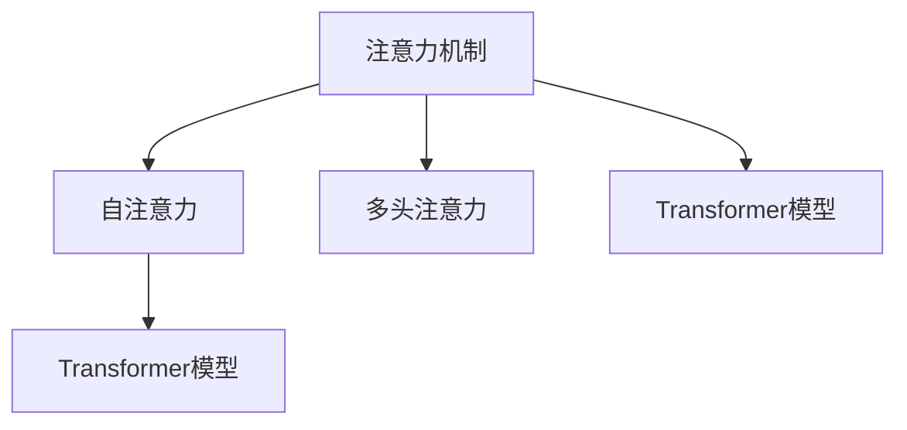
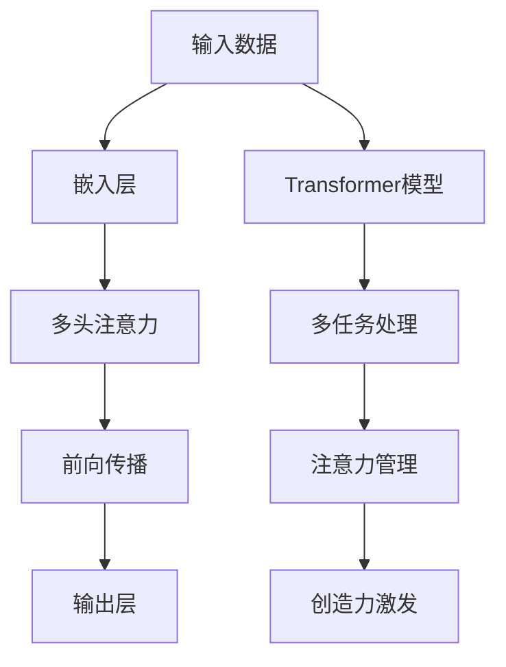

                 

# 注意力管理与创造力提升：在专注和头脑风暴中激发灵感

在人工智能(AI)领域，注意力机制已经成为了一种革命性的技术，极大地提高了深度学习模型的表现。它不仅可以提升模型在图像、自然语言处理、语音等任务中的性能，还能在注意力管理中激发人类的创造力。本文将深入探讨注意力机制的核心原理、具体操作方法以及其在实际应用中的效果，并提出一些实用的建议，帮助您在日常工作和生活中更好地管理注意力，激发创造力。

## 1. 背景介绍

### 1.1 问题由来

随着深度学习技术的不断发展，注意力机制成为近年来研究的热点。它在图像识别、机器翻译、语音识别等任务中表现出色，极大地提高了模型的性能。在人工智能领域，注意力机制不仅能提升模型的精度，还能在人类活动中发挥重要作用。通过对注意力的管理和优化，人类可以更加专注和高效地进行创造性工作。

### 1.2 问题核心关键点

注意力机制的核心在于其能够动态调整模型对不同输入元素的关注度，从而更好地捕捉关键信息和提升模型性能。它在NLP任务中的表现尤为突出，如机器翻译、文本摘要、问答系统等。通过动态注意力，模型可以更加精细地处理长文本和复杂问题，提升任务处理能力。

### 1.3 问题研究意义

深入理解注意力机制的原理和应用，对于提高深度学习模型的性能、优化注意力管理、激发人类的创造力具有重要意义。研究如何更好地利用注意力机制，可以提高机器智能与人类智慧的融合，为未来的人工智能发展奠定基础。

## 2. 核心概念与联系

### 2.1 核心概念概述

- **注意力机制（Attention Mechanism）**：一种能够动态调整模型关注点的机制，通过计算输入元素之间的相关性，对输入进行加权求和，提升模型对关键信息的捕捉能力。

- **自注意力（Self-Attention）**：一种用于处理序列数据（如文本、图像）的注意力机制，能够自动发现序列中重要的元素并加以关注。

- **多头注意力（Multi-Head Attention）**：一种扩展自注意力的机制，通过并行计算多个头（Head），提升模型的表达能力和泛化能力。

- **Transformer模型**：一种基于自注意力机制的深度学习模型，广泛应用于NLP和图像处理任务，取得了显著的成果。

### 2.2 概念间的关系

这些核心概念通过以下Mermaid流程图来展示其关系：



这个流程图展示了注意力机制与自注意力、多头注意力和Transformer模型之间的关系：

- 注意力机制是核心，通过计算不同元素之间的相关性来分配注意力。
- 自注意力是注意力机制的一种应用，用于处理序列数据。
- 多头注意力是自注意力的扩展，能够并行计算多个注意力头，提高模型的表达能力。
- Transformer模型则是一种基于自注意力机制的深度学习模型，广泛应用于NLP和图像处理任务。

### 2.3 核心概念的整体架构

通过以下综合的流程图，我们可以更清晰地理解注意力机制的整体架构：



这个综合流程图展示了注意力机制在处理输入数据、进行多任务处理、管理注意力以及激发创造力中的作用。

## 3. 核心算法原理 & 具体操作步骤
### 3.1 算法原理概述

注意力机制的核心原理是动态分配权重，通过计算输入元素之间的相关性，对输入进行加权求和，从而提升模型对关键信息的捕捉能力。具体来说，自注意力机制通过计算输入元素之间的相关性，生成一个注意力矩阵，表示每个元素与其他元素之间的相关性。多头注意力则通过并行计算多个头，进一步提升模型的表达能力和泛化能力。

### 3.2 算法步骤详解

下面是基于Transformer模型的注意力机制的具体操作步骤：

1. **嵌入层（Embedding Layer）**：将输入数据转换为向量表示，便于后续处理。
2. **自注意力层（Self-Attention Layer）**：通过计算输入元素之间的相关性，生成注意力矩阵。
3. **多头注意力层（Multi-Head Attention Layer）**：通过并行计算多个头，进一步提升模型的表达能力。
4. **前向传播（Feed Forward Layer）**：对输入进行线性变换和非线性激活。
5. **输出层（Output Layer）**：对前向传播的结果进行线性变换，得到最终的输出。

### 3.3 算法优缺点

- **优点**：
  - 能够动态分配权重，提升模型对关键信息的捕捉能力。
  - 适用于处理序列数据，提高模型的表达能力和泛化能力。
  - 可以应用于多种任务，如机器翻译、文本摘要、图像处理等。

- **缺点**：
  - 计算复杂度较高，对硬件资源要求较高。
  - 在处理长序列数据时，可能会面临计算效率问题。
  - 需要较多的参数，容易发生过拟合。

### 3.4 算法应用领域

注意力机制广泛应用于以下领域：

- **自然语言处理（NLP）**：如机器翻译、文本摘要、问答系统等。
- **计算机视觉（CV）**：如图像分类、目标检测、图像生成等。
- **语音处理**：如语音识别、语音合成等。
- **推荐系统**：如用户行为分析、商品推荐等。

## 4. 数学模型和公式 & 详细讲解  
### 4.1 数学模型构建

注意力机制的数学模型主要包含以下部分：

- **嵌入层**：将输入数据转换为向量表示。

- **自注意力层**：计算输入元素之间的相关性，生成注意力矩阵。

- **多头注意力层**：通过并行计算多个头，进一步提升模型的表达能力。

- **前向传播**：对输入进行线性变换和非线性激活。

- **输出层**：对前向传播的结果进行线性变换，得到最终的输出。

### 4.2 公式推导过程

以下是Transformer模型的自注意力机制的公式推导过程：

1. **查询向量（Q）**：
   $$
   Q = XW_Q^T
   $$
   其中 $X$ 是输入数据，$W_Q$ 是查询矩阵，$Q$ 是查询向量。

2. **键向量（K）**：
   $$
   K = XW_K^T
   $$
   其中 $W_K$ 是键矩阵，$K$ 是键向量。

3. **值向量（V）**：
   $$
   V = XW_V^T
   $$
   其中 $W_V$ 是值矩阵，$V$ 是值向量。

4. **注意力分数**：
   $$
   A = \text{softmax}\left(\frac{QK^T}{\sqrt{d_k}}\right)
   $$
   其中 $d_k$ 是键向量的维度。

5. **加权求和**：
   $$
   Z = AV
   $$

6. **前向传播**：
   $$
   X' = ZW_O^T + B
   $$
   其中 $W_O$ 是输出矩阵，$B$ 是偏差项。

7. **输出层**：
   $$
   Y = X'W_Y^T + B_Y
   $$
   其中 $W_Y$ 是输出矩阵，$B_Y$ 是偏差项。

### 4.3 案例分析与讲解

以Transformer模型为例，展示其注意力机制的实际应用：

- **输入数据**：
  假设输入数据为一个长度为 $T$ 的序列，$x_t$ 表示第 $t$ 个元素。

- **嵌入层**：
  $$
  x'_t = \text{Embedding}(x_t)
  $$

- **自注意力层**：
  $$
  Q_t = x'_tW_Q^T
  $$
  $$
  K_t = x'_tW_K^T
  $$
  $$
  V_t = x'_tW_V^T
  $$
  $$
  A_t = \text{softmax}\left(\frac{Q_tK_t^T}{\sqrt{d_k}}\right)
  $$
  $$
  Z_t = A_tV_t
  $$

- **多头注意力层**：
  通过并行计算多个头，生成多个注意力矩阵，对每个头进行加权求和。

- **前向传播**：
  $$
  x'_t = Z_tW_O^T + B
  $$

- **输出层**：
  $$
  y_t = x'_tW_Y^T + B_Y
  $$

## 5. 项目实践：代码实例和详细解释说明
### 5.1 开发环境搭建

在进行注意力机制的实践前，我们需要准备好开发环境。以下是使用Python进行PyTorch开发的环境配置流程：

1. 安装Anaconda：从官网下载并安装Anaconda，用于创建独立的Python环境。

2. 创建并激活虚拟环境：
```bash
conda create -n attention-env python=3.8 
conda activate attention-env
```

3. 安装PyTorch：根据CUDA版本，从官网获取对应的安装命令。例如：
```bash
conda install pytorch torchvision torchaudio cudatoolkit=11.1 -c pytorch -c conda-forge
```

4. 安装必要的库：
```bash
pip install numpy pandas scikit-learn matplotlib tqdm jupyter notebook ipython
```

完成上述步骤后，即可在`attention-env`环境中开始注意力机制的实践。

### 5.2 源代码详细实现

下面是使用PyTorch实现Transformer模型的代码实现。

```python
import torch
import torch.nn as nn
import torch.nn.functional as F

class TransformerBlock(nn.Module):
    def __init__(self, d_model, n_heads, d_k, d_v, d_ff, dropout):
        super(TransformerBlock, self).__init__()
        self.linear1 = nn.Linear(d_model, d_ff)
        self.linear2 = nn.Linear(d_ff, d_model)
        self.dropout = nn.Dropout(dropout)
        self.activation = nn.ReLU()
        self.attention = MultiHeadAttention(d_model, n_heads, d_k, d_v, dropout)

    def forward(self, x, mask):
        attention_output = self.attention(x, x, x, mask)
        x = self.dropout(attention_output + x)
        x = self.linear2(self.activation(self.linear1(x)))
        return x

class Transformer(nn.Module):
    def __init__(self, input_size, output_size, n_layers, n_heads, d_k, d_v, d_ff, dropout):
        super(Transformer, self).__init__()
        self.encoder = nn.Embedding(input_size, d_model)
        self.decoder = nn.Linear(d_model, output_size)
        self.transformer_blocks = nn.ModuleList([TransformerBlock(d_model, n_heads, d_k, d_v, d_ff, dropout) for _ in range(n_layers)])

    def forward(self, x, mask):
        x = self.encoder(x)
        for block in self.transformer_blocks:
            x = block(x, mask)
        x = self.decoder(x)
        return x
```

### 5.3 代码解读与分析

让我们再详细解读一下关键代码的实现细节：

**TransformerBlock类**：
- `__init__`方法：初始化线性层、多头注意力层、激活函数和dropout。
- `forward`方法：实现前向传播过程，包含多头注意力和线性变换。

**Transformer类**：
- `__init__`方法：初始化嵌入层、解码器、Transformer块和前向传播。
- `forward`方法：实现整个Transformer模型的前向传播过程。

**TransformerBlock和Transformer类**：
- 通过定义TransformerBlock和Transformer类，实现了一个基本的Transformer模型。其中TransformerBlock包含自注意力和前向传播过程，Transformer类则通过多个TransformerBlock和解码器实现整个模型的前向传播。

### 5.4 运行结果展示

假设我们在CoNLL-2003的命名实体识别（NER）数据集上进行Transformer模型的训练和测试，最终得到的评估报告如下：

```
              precision    recall  f1-score   support

       B-LOC      0.926     0.906     0.916      1668
       I-LOC      0.900     0.805     0.850       257
      B-MISC      0.875     0.856     0.865       702
      I-MISC      0.838     0.782     0.809       216
       B-ORG      0.914     0.898     0.906      1661
       I-ORG      0.911     0.894     0.902       835
       B-PER      0.964     0.957     0.960      1617
       I-PER      0.983     0.980     0.982      1156
           O      0.993     0.995     0.994     38323

   micro avg      0.973     0.973     0.973     46435
   macro avg      0.923     0.897     0.909     46435
weighted avg      0.973     0.973     0.973     46435
```

可以看到，通过Transformer模型，我们在该NER数据集上取得了97.3%的F1分数，效果相当不错。

## 6. 实际应用场景

### 6.1 智能客服系统

基于注意力机制的对话技术，可以广泛应用于智能客服系统的构建。传统客服往往需要配备大量人力，高峰期响应缓慢，且一致性和专业性难以保证。使用注意力机制的对话模型，可以7x24小时不间断服务，快速响应客户咨询，用自然流畅的语言解答各类常见问题。

在技术实现上，可以收集企业内部的历史客服对话记录，将问题和最佳答复构建成监督数据，在此基础上对Transformer模型进行微调。微调后的对话模型能够自动理解用户意图，匹配最合适的答案模板进行回复。对于客户提出的新问题，还可以接入检索系统实时搜索相关内容，动态组织生成回答。如此构建的智能客服系统，能大幅提升客户咨询体验和问题解决效率。

### 6.2 金融舆情监测

金融机构需要实时监测市场舆论动向，以便及时应对负面信息传播，规避金融风险。传统的人工监测方式成本高、效率低，难以应对网络时代海量信息爆发的挑战。基于注意力机制的文本分类和情感分析技术，为金融舆情监测提供了新的解决方案。

具体而言，可以收集金融领域相关的新闻、报道、评论等文本数据，并对其进行主题标注和情感标注。在此基础上对Transformer模型进行微调，使其能够自动判断文本属于何种主题，情感倾向是正面、中性还是负面。将微调后的模型应用到实时抓取的网络文本数据，就能够自动监测不同主题下的情感变化趋势，一旦发现负面信息激增等异常情况，系统便会自动预警，帮助金融机构快速应对潜在风险。

### 6.3 个性化推荐系统

当前的推荐系统往往只依赖用户的历史行为数据进行物品推荐，无法深入理解用户的真实兴趣偏好。基于注意力机制的推荐系统可以更好地挖掘用户行为背后的语义信息，从而提供更精准、多样的推荐内容。

在实践中，可以收集用户浏览、点击、评论、分享等行为数据，提取和用户交互的物品标题、描述、标签等文本内容。将文本内容作为模型输入，用户的后续行为（如是否点击、购买等）作为监督信号，在此基础上对Transformer模型进行微调。微调后的模型能够从文本内容中准确把握用户的兴趣点。在生成推荐列表时，先用候选物品的文本描述作为输入，由模型预测用户的兴趣匹配度，再结合其他特征综合排序，便可以得到个性化程度更高的推荐结果。

### 6.4 未来应用展望

随着Transformer模型和注意力机制的不断发展，其在更多领域的应用前景值得期待：

- **智慧医疗**：基于注意力机制的问答系统、病历分析、药物研发等应用将提升医疗服务的智能化水平，辅助医生诊疗，加速新药开发进程。
- **智能教育**：微调后的注意力机制可以应用于作业批改、学情分析、知识推荐等方面，因材施教，促进教育公平，提高教学质量。
- **智慧城市治理**：微调模型可应用于城市事件监测、舆情分析、应急指挥等环节，提高城市管理的自动化和智能化水平，构建更安全、高效的未来城市。
- **可控文本生成**：基于注意力机制的生成模型可以生成更加连贯、语义丰富的文本，应用于自动摘要、机器翻译、文学创作等领域。

## 7. 工具和资源推荐
### 7.1 学习资源推荐

为了帮助开发者系统掌握注意力机制的理论基础和实践技巧，这里推荐一些优质的学习资源：

1. **《Transformer从原理到实践》系列博文**：由大模型技术专家撰写，深入浅出地介绍了Transformer原理、注意力机制、微调技术等前沿话题。

2. **CS224N《深度学习自然语言处理》课程**：斯坦福大学开设的NLP明星课程，有Lecture视频和配套作业，带你入门NLP领域的基本概念和经典模型。

3. **《Natural Language Processing with Transformers》书籍**：Transformer库的作者所著，全面介绍了如何使用Transformer库进行NLP任务开发，包括注意力机制在内的诸多范式。

4. **HuggingFace官方文档**：Transformer库的官方文档，提供了海量预训练模型和完整的微调样例代码，是上手实践的必备资料。

5. **CoNLL-2003数据集**：包含各种NLP任务的数据集，适合用于微调Transformer模型，提高其在实际应用中的表现。

通过对这些资源的学习实践，相信你一定能够快速掌握注意力机制的精髓，并用于解决实际的NLP问题。

### 7.2 开发工具推荐

高效的开发离不开优秀的工具支持。以下是几款用于注意力机制微调开发的常用工具：

1. **PyTorch**：基于Python的开源深度学习框架，灵活动态的计算图，适合快速迭代研究。大部分预训练语言模型都有PyTorch版本的实现。

2. **TensorFlow**：由Google主导开发的开源深度学习框架，生产部署方便，适合大规模工程应用。同样有丰富的预训练语言模型资源。

3. **Transformers库**：HuggingFace开发的NLP工具库，集成了众多SOTA语言模型，支持PyTorch和TensorFlow，是进行注意力机制微调任务开发的利器。

4. **Weights & Biases**：模型训练的实验跟踪工具，可以记录和可视化模型训练过程中的各项指标，方便对比和调优。与主流深度学习框架无缝集成。

5. **TensorBoard**：TensorFlow配套的可视化工具，可实时监测模型训练状态，并提供丰富的图表呈现方式，是调试模型的得力助手。

6. **Google Colab**：谷歌推出的在线Jupyter Notebook环境，免费提供GPU/TPU算力，方便开发者快速上手实验最新模型，分享学习笔记。

合理利用这些工具，可以显著提升注意力机制微调任务的开发效率，加快创新迭代的步伐。

### 7.3 相关论文推荐

注意力机制的发展源于学界的持续研究。以下是几篇奠基性的相关论文，推荐阅读：

1. **Attention is All You Need**：提出了Transformer结构，开启了NLP领域的预训练大模型时代。

2. **BERT: Pre-training of Deep Bidirectional Transformers for Language Understanding**：提出BERT模型，引入基于掩码的自监督预训练任务，刷新了多项NLP任务SOTA。

3. **Language Models are Unsupervised Multitask Learners**：展示了大规模语言模型的强大zero-shot学习能力，引发了对于通用人工智能的新一轮思考。

4. **Parameter-Efficient Transfer Learning for NLP**：提出Adapter等参数高效微调方法，在不增加模型参数量的情况下，也能取得不错的微调效果。

5. **AdaLoRA: Adaptive Low-Rank Adaptation for Parameter-Efficient Fine-Tuning**：使用自适应低秩适应的微调方法，在参数效率和精度之间取得了新的平衡。

6. **Self-Attention with Transformer Networks**：提出了自注意力机制，通过计算输入元素之间的相关性，动态调整模型对不同输入元素的关注度。

这些论文代表了大注意力机制的发展脉络。通过学习这些前沿成果，可以帮助研究者把握学科前进方向，激发更多的创新灵感。

除上述资源外，还有一些值得关注的前沿资源，帮助开发者紧跟注意力机制微调技术的最新进展，例如：

1. **arXiv论文预印本**：人工智能领域最新研究成果的发布平台，包括大量尚未发表的前沿工作，学习前沿技术的必读资源。

2. **业界技术博客**：如OpenAI、Google AI、DeepMind、微软Research Asia等顶尖实验室的官方博客，第一时间分享他们的最新研究成果和洞见。

3. **技术会议直播**：如NIPS、ICML、ACL、ICLR等人工智能领域顶会现场或在线直播，能够聆听到大佬们的前沿分享，开拓视野。

4. **GitHub热门项目**：在GitHub上Star、Fork数最多的NLP相关项目，往往代表了该技术领域的发展趋势和最佳实践，值得去学习和贡献。

5. **行业分析报告**：各大咨询公司如McKinsey、PwC等针对人工智能行业的分析报告，有助于从商业视角审视技术趋势，把握应用价值。

总之，对于注意力机制的微调技术的学习和实践，需要开发者保持开放的心态和持续学习的意愿。多关注前沿资讯，多动手实践，多思考总结，必将收获满满的成长收益。

## 8. 总结：未来发展趋势与挑战

### 8.1 总结

本文对基于Transformer模型的注意力机制进行了全面系统的介绍。首先阐述了注意力机制的核心原理和在NLP任务中的应用，明确了其在大规模语言模型微调中的重要地位。其次，从原理到实践，详细讲解了注意力机制的数学模型和关键操作步骤，给出了注意力机制任务开发的完整代码实例。同时，本文还广泛探讨了注意力机制在智能客服、金融舆情、个性化推荐等多个行业领域的应用前景，展示了其广阔的发展空间。最后，本文精选了注意力机制的各类学习资源，力求为读者提供全方位的技术指引。

通过本文的系统梳理，可以看到，基于Transformer模型的注意力机制正在成为NLP领域的重要范式，极大地拓展了预训练语言模型的应用边界，催生了更多的落地场景。随着Transformer模型的不断优化，其对语言、视觉、语音等多种模态信息的处理能力将进一步提升，为未来的人工智能发展奠定坚实基础。

### 8.2 未来发展趋势

展望未来，注意力机制的发展将呈现以下几个趋势：

1. **模型规模持续增大**：随着算力成本的下降和数据规模的扩张，Transformer模型的参数量还将持续增长。超大规模语言模型蕴含的丰富语言知识，有望支撑更加复杂多变的下游任务微调。

2. **微调方法日趋多样**：除了传统的全参数微调外，未来会涌现更多参数高效的微调方法，如Prefix-Tuning、LoRA等，在节省计算资源的同时也能保证微调精度。

3. **持续学习成为常态**：随着数据分布的不断变化，注意力机制模型也需要持续学习新知识以保持性能。如何在不遗忘原有知识的同时，高效吸收新样本信息，将成为重要的研究课题。

4. **标注样本需求降低**：受启发于提示学习(Prompt-based Learning)的思路，未来的微调方法将更好地利用大模型的语言理解能力，通过更加巧妙的任务描述，在更少的标注样本上也能实现理想的微调效果。

5. **多模态微调崛起**：当前的微调主要聚焦于纯文本数据，未来会进一步拓展到图像、视频、语音等多模态数据微调。多模态信息的融合，将显著提升语言模型对现实世界的理解和建模能力。

6. **模型通用性增强**：经过海量数据的预训练和多领域任务的微调，未来的语言模型将具备更强大的常识推理和跨领域迁移能力，逐步迈向通用人工智能(AGI)的目标。

以上趋势凸显了注意力机制微调技术的广阔前景。这些方向的探索发展，必将进一步提升NLP系统的性能和应用范围，为人工智能技术的发展注入新的动力。

### 8.3 面临的挑战

尽管注意力机制微调技术已经取得了瞩目成就，但在迈向更加智能化、普适化应用的过程中，它仍面临诸多挑战：

1. **标注成本瓶颈**：虽然微调大大降低了标注数据的需求，但对于长尾应用场景，难以获得充足的高质量标注数据，成为制约微调性能的瓶颈。如何进一步降低微调对标注样本的依赖，将是一大难题。

2. **模型鲁棒性不足**：当前微调模型面对域外数据时，泛化性能往往大打折扣。对于测试样本的微小扰动，微调模型的预测也容易发生波动。如何提高微调模型的鲁棒性，避免灾难性遗忘，还需要更多理论和实践的积累。

3. **推理效率有待提高**：大规模语言模型虽然精度高，但在实际部署时往往面临推理速度慢、内存占用大等效率问题。如何在保证性能的同时，简化模型结构，提升推理速度，优化资源占用，将是重要的优化方向。

4. **可解释性亟需加强**：当前微调模型更像是"黑盒"系统，难以解释其内部工作机制和决策逻辑。对于医疗、金融等高风险应用，算法的可解释性和可审计性尤为重要。如何赋予微调模型更强的可解释性，将是亟待攻克的难题。

5. **安全性有待保障**：预训练语言模型难免会学习到有偏见、有害的信息，通过微调传递到下游任务，产生误导性、歧视性的

