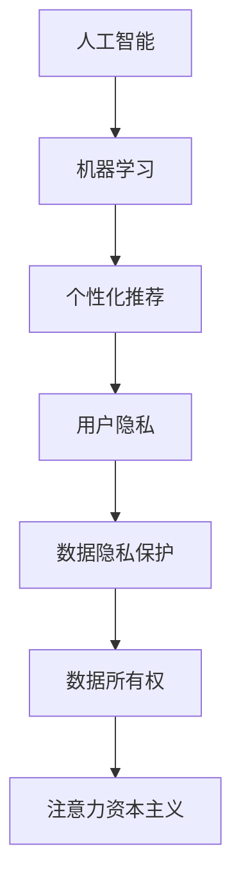
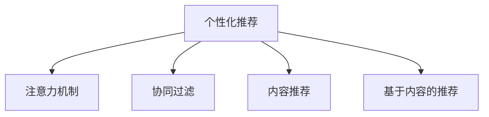
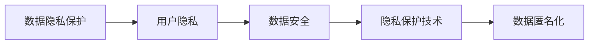
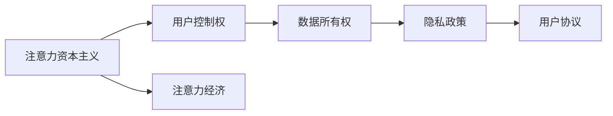
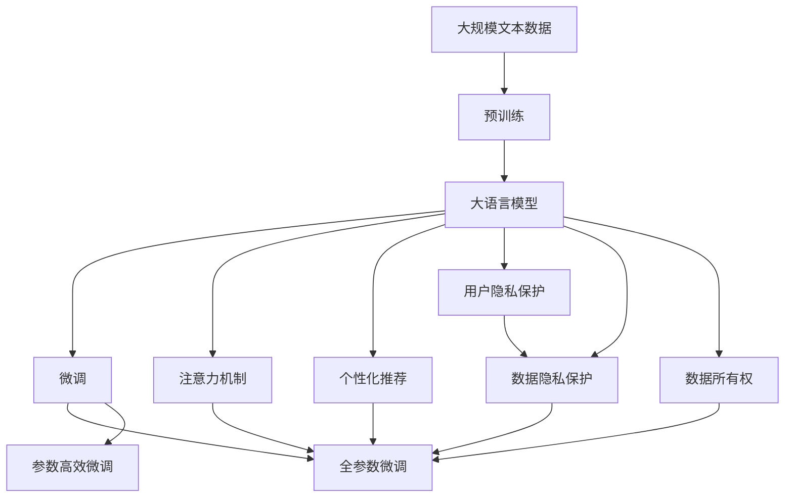

                 

# 注意力资本主义：AI时代的新经济模式

> 关键词：
- 注意力资本主义
- 人工智能
- 机器学习
- 数据隐私
- 隐私保护
- 用户控制权
- 数字劳动力

## 1. 背景介绍

### 1.1 问题由来
随着人工智能（AI）和机器学习（ML）技术的不断进步，AI正日益渗透到各个行业，从金融、医疗到教育、娱乐，几乎无所不在。然而，与此同时，AI带来的"注意力资本主义"问题也开始引起广泛关注。

注意力资本主义（Attention Capitalism）是一个由Fredmodified在他2010年出版的《注意力资本》（Attention is All You Need）一书中首次提出的概念，指的是在信息爆炸的时代，用户注意力成为了一种稀缺资源，企业为了争夺用户注意力，不断提供丰富的内容和个性化的服务，从而创造出新的经济价值。

在这个过程中，用户的行为和偏好被数据化、算法化，形成了注意力经济的底层逻辑。而随着AI技术的不断应用，企业得以通过分析用户行为，提供更为精准的个性化推荐和广告投放，进一步增强了对用户注意力的控制和利用。

这种以用户注意力为核心的经济模式，既有其潜力也有其风险。一方面，AI技术能够更高效地挖掘和利用用户数据，为用户带来更为便捷和满意的服务；另一方面，用户数据的过度采集和过度分析，可能侵犯用户隐私，甚至导致注意力操纵（Attention Manipulation），带来一系列伦理和法律问题。

因此，如何在AI时代，合理利用注意力资本主义，保护用户隐私，实现用户与企业的双赢，是当前亟需解决的重要问题。

### 1.2 问题核心关键点
在AI时代，注意力资本主义的核心在于：

- 用户注意力成为企业争夺的资源。
- 通过AI技术，企业能够高效分析和利用用户数据，提供个性化服务。
- 用户行为和偏好被算法化，成为数据产品。
- 数据隐私和安全问题凸显。
- 用户对数据隐私的控制权需要得到尊重。

这些核心点共同构成了注意力资本主义的框架，对当前和未来的AI应用都具有重要意义。

### 1.3 问题研究意义
研究注意力资本主义问题，对AI技术的发展和应用具有重要意义：

- 推动AI技术的伦理和法律框架建设。明确AI技术的开发和应用边界，确保用户隐私和权益得到保障。
- 指导企业合理利用用户数据，实现用户和企业的双赢。
- 提升用户对AI技术的信任和接受度，促进AI技术的普及和应用。
- 促进AI技术与社会的深度融合，推动智慧社会建设。

## 2. 核心概念与联系

### 2.1 核心概念概述

为了更好地理解注意力资本主义及其在AI时代的应用，本节将介绍几个密切相关的核心概念：

- 人工智能（AI）：通过模拟和扩展人类智能，使机器具备学习能力、推理能力、决策能力等，以实现对复杂问题的自动化解决。
- 机器学习（ML）：一种数据驱动的算法，通过训练模型，使机器从数据中学习，并应用到新数据上。
- 注意力机制（Attention Mechanism）：一种在序列到序列模型（如Transformer）中广泛使用的技术，用于动态分配模型对序列中不同部分的注意力权重，以提高模型对关键信息的处理能力。
- 个性化推荐（Personalized Recommendation）：利用用户行为数据，通过算法为用户推荐个性化的产品、服务或内容。
- 用户隐私（User Privacy）：用户在网络活动中的个人信息和行为数据得到妥善保护，不被未授权的第三方获取和滥用。
- 数据隐私保护（Data Privacy Protection）：通过技术手段和管理措施，确保用户数据在采集、存储、使用过程中不被滥用或泄露。
- 数据所有权（Data Ownership）：用户对其个人数据的控制权，包括数据的获取、使用、修改、删除等。

这些核心概念之间存在着紧密的联系，共同构成了注意力资本主义的基本框架，下面通过Mermaid流程图展示其联系：



这个流程图展示了人工智能、机器学习、个性化推荐、用户隐私、数据隐私保护、数据所有权等概念在注意力资本主义中的相互作用。用户隐私保护和数据所有权是确保个性化推荐不被滥用的重要基础，而AI技术则在个性化推荐中扮演关键角色。

### 2.2 概念间的关系

这些核心概念之间存在着紧密的联系，形成了注意力资本主义的完整生态系统。下面我们通过几个Mermaid流程图来展示这些概念之间的关系。

#### 2.2.1 AI与ML的关系


这个流程图展示了AI与ML之间的关系。深度学习和强化学习是机器学习中两个重要分支，通过不断优化算法，提升模型的表现能力。

#### 2.2.2 个性化推荐与注意力机制的关系



这个流程图展示了个性化推荐与注意力机制之间的关系。协同过滤、基于内容的推荐和内容推荐等方法都是个性化推荐的技术手段，其中注意力机制用于提高推荐的准确性和多样性。

#### 2.2.3 数据隐私保护与用户隐私的关系



这个流程图展示了数据隐私保护与用户隐私之间的关系。用户隐私是数据隐私保护的核心目标，通过数据安全、隐私保护技术和数据匿名化等手段，确保用户数据不被滥用。

#### 2.2.4 注意力资本主义与用户控制权的关系



这个流程图展示了注意力资本主义与用户控制权之间的关系。用户控制权是注意力资本主义的底层支撑，通过数据所有权、隐私政策等手段，确保用户在AI技术中的应用过程中，能够掌握自己的数据，并享有充分的控制权。

### 2.3 核心概念的整体架构

最后，我们用一个综合的流程图来展示这些核心概念在大语言模型微调过程中的整体架构：



这个综合流程图展示了从预训练到微调，再到个性化推荐、用户隐私保护、数据隐私保护、数据所有权等的完整过程。大语言模型首先在大规模文本数据上进行预训练，然后通过微调（包括全参数微调和参数高效微调）适应个性化推荐需求。在此基础上，应用注意力机制提高推荐质量，同时采用用户隐私保护和数据隐私保护技术，确保用户数据的安全和隐私。最后通过数据所有权确保用户对其数据的控制权，从而构建完整的注意力资本主义生态系统。

## 3. 核心算法原理 & 具体操作步骤
### 3.1 算法原理概述

注意力资本主义的核心算法原理是基于注意力机制和个性化推荐技术。在AI时代，用户行为数据被采集、存储和分析，通过算法为用户推荐个性化内容或服务。这种推荐过程依赖于对用户注意力的高效分配，以提高推荐的准确性和用户满意度。

### 3.2 算法步骤详解

基于注意力资本主义的个性化推荐过程主要包括以下几个关键步骤：

**Step 1: 数据收集和预处理**
- 从用户行为数据中提取特征，如浏览记录、购买记录、评价反馈等。
- 对数据进行去噪、归一化等预处理，以提高算法效果。

**Step 2: 模型训练和微调**
- 选择合适的模型（如RNN、CNN、Transformer等）进行训练，使用用户行为数据作为训练集。
- 应用注意力机制，动态分配模型对不同特征的注意力权重，以提高模型对关键信息的处理能力。
- 通过微调优化模型参数，使推荐结果更符合用户期望。

**Step 3: 个性化推荐**
- 根据用户历史行为和实时行为，计算用户对不同内容的兴趣度。
- 通过注意力机制，动态调整模型对不同内容的关注度，实现个性化推荐。
- 实时更新推荐结果，持续优化用户满意度。

**Step 4: 用户反馈和模型迭代**
- 收集用户对推荐结果的反馈，如点击、收藏、评分等。
- 根据用户反馈，进一步微调模型，提升推荐质量。
- 定期更新模型，确保推荐内容的时效性和相关性。

### 3.3 算法优缺点

基于注意力资本主义的个性化推荐算法具有以下优点：
1. 高度个性化：通过分析用户行为数据，提供更精准的个性化推荐，满足用户多样化需求。
2. 高效性：利用注意力机制，提高推荐效率，快速响应用户需求。
3. 动态性：实时更新推荐结果，确保推荐的实时性和相关性。

但同时也存在以下缺点：
1. 数据隐私问题：需要大量用户数据，可能涉及用户隐私，引发伦理和法律问题。
2. 注意力操纵：过度关注某类内容，可能引导用户行为，导致信息茧房。
3. 算法偏见：推荐算法可能带有偏见，导致推荐结果不公平。

### 3.4 算法应用领域

基于注意力资本主义的个性化推荐技术，已经在电商、社交、新闻等多个领域得到广泛应用，具体包括：

- 电子商务：通过个性化推荐提升商品转化率和用户满意度，如Amazon、淘宝等。
- 社交媒体：为用户推荐感兴趣的朋友、文章、视频等，如Facebook、微博等。
- 新闻阅读：根据用户阅读习惯，推荐相关新闻内容，如今日头条、网易新闻等。

除了上述这些典型应用外，基于个性化推荐技术的应用还在不断扩展，如智能音箱、智能家居、在线教育等，为AI技术在更多领域的落地提供了新的思路。

## 4. 数学模型和公式 & 详细讲解 & 举例说明

### 4.1 数学模型构建

本节将使用数学语言对基于注意力机制的个性化推荐模型进行更加严格的刻画。

假设用户行为数据为 $\mathbf{x}=\{x_1, x_2, ..., x_n\}$，其中 $x_i$ 为第 $i$ 个用户行为记录。模型预测用户对不同内容的兴趣度为 $\mathbf{y}=\{y_1, y_2, ..., y_n\}$，其中 $y_i$ 为第 $i$ 个内容对用户兴趣的预测值。

定义用户对内容 $j$ 的注意力权重为 $\mathbf{a}=\{a_1, a_2, ..., a_n\}$，其中 $a_i$ 为第 $i$ 个内容对用户注意力的贡献。则注意力资本主义的数学模型可以表示为：

$$
\mathbf{y} = \text{Attention}(\mathbf{x}, \mathbf{a})
$$

其中 $\text{Attention}$ 为注意力机制函数，用于计算用户对不同内容的注意力权重。

### 4.2 公式推导过程

以下我们以简单线性注意力模型为例，推导注意力机制的计算公式。

假设用户行为数据 $\mathbf{x}$ 和内容特征 $\mathbf{q}$ 的相似度矩阵为 $\mathbf{W}$，则注意力权重 $a_i$ 可以表示为：

$$
a_i = \frac{\exp(\mathbf{W}(\mathbf{x}_i, \mathbf{q}_j))}{\sum_k \exp(\mathbf{W}(\mathbf{x}_k, \mathbf{q}_j))}
$$

其中 $\mathbf{W}$ 为相似度矩阵，$\exp$ 为指数函数。相似度矩阵 $\mathbf{W}$ 可以通过预训练的嵌入向量（Embedding Vector）和注意力模型参数 $\theta$ 计算得到：

$$
\mathbf{W} = \text{Softmax}(\mathbf{V}\mathbf{X} + \mathbf{U}\mathbf{Q} + \mathbf{B} + \theta)
$$

其中 $\mathbf{V}$ 为可学习的权重矩阵，$\mathbf{X}$ 为用户行为数据矩阵，$\mathbf{U}$ 为可学习的权重矩阵，$\mathbf{Q}$ 为内容特征矩阵，$\mathbf{B}$ 为可学习的偏置向量，$\theta$ 为注意力模型参数。

最终，用户对不同内容的兴趣度预测值 $\mathbf{y}$ 可以通过注意力权重 $a_i$ 和用户行为数据 $\mathbf{x}$ 计算得到：

$$
\mathbf{y} = \mathbf{a}^T \mathbf{X}
$$

其中 $\mathbf{a} = \text{Softmax}(\mathbf{W})$，$\mathbf{X}$ 为用户行为数据矩阵。

### 4.3 案例分析与讲解

假设我们正在为电商平台推荐个性化商品。基于用户浏览记录，我们训练了一个线性注意力模型，模型参数为 $\theta$，相似度矩阵 $\mathbf{W}$ 可以表示为：

$$
\mathbf{W} = \text{Softmax}(\mathbf{V}\mathbf{X} + \mathbf{U}\mathbf{Q} + \mathbf{B} + \theta)
$$

其中 $\mathbf{V}$ 为可学习的权重矩阵，$\mathbf{X}$ 为用户浏览记录矩阵，$\mathbf{U}$ 为可学习的权重矩阵，$\mathbf{Q}$ 为商品特征矩阵，$\mathbf{B}$ 为可学习的偏置向量，$\theta$ 为注意力模型参数。

在预测用户对商品 $j$ 的兴趣度 $y_j$ 时，我们首先计算出用户对商品 $j$ 的注意力权重 $a_j$：

$$
a_j = \frac{\exp(\mathbf{W}(\mathbf{x}_i, \mathbf{q}_j))}{\sum_k \exp(\mathbf{W}(\mathbf{x}_k, \mathbf{q}_j))}
$$

然后计算用户对商品 $j$ 的兴趣度预测值 $y_j$：

$$
y_j = a_j^T \mathbf{x}_i
$$

其中 $\mathbf{x}_i$ 为第 $i$ 个用户的浏览记录，$\mathbf{q}_j$ 为商品 $j$ 的特征向量。

通过这种方法，我们可以在用户浏览记录上应用注意力机制，实现商品推荐的个性化和高效化。

## 5. 项目实践：代码实例和详细解释说明
### 5.1 开发环境搭建

在进行个性化推荐项目开发前，我们需要准备好开发环境。以下是使用Python进行PyTorch开发的环境配置流程：

1. 安装Anaconda：从官网下载并安装Anaconda，用于创建独立的Python环境。

2. 创建并激活虚拟环境：
```bash
conda create -n pytorch-env python=3.8 
conda activate pytorch-env
```

3. 安装PyTorch：根据CUDA版本，从官网获取对应的安装命令。例如：
```bash
conda install pytorch torchvision torchaudio cudatoolkit=11.1 -c pytorch -c conda-forge
```

4. 安装TensorBoard：用于可视化模型的训练过程。
```bash
pip install tensorboard
```

5. 安装Flax：用于快速构建深度学习模型。
```bash
pip install flax
```

6. 安装TensorFlow：用于模型优化和训练。
```bash
pip install tensorflow
```

完成上述步骤后，即可在`pytorch-env`环境中开始个性化推荐项目的开发。

### 5.2 源代码详细实现

下面我们以电商平台推荐系统为例，给出使用Flax库对深度神经网络进行个性化推荐模型训练的PyTorch代码实现。

首先，定义用户行为数据和商品特征的表示：

```python
import jax
import jax.numpy as jnp
import flax.linen as nn

# 定义用户行为数据表示
class UserBehavior:
    def __init__(self, features):
        self.features = features

# 定义商品特征表示
class ProductFeature:
    def __init__(self, features):
        self.features = features
```

然后，定义注意力机制和深度神经网络模型：

```python
# 定义注意力机制函数
def attention_fn(features, query, attention_heads=8, dropout_rate=0.0):
    query_embeddings = nn.Dense(features.shape[1], activation='relu')(features)
    attention = nn.CrossAttention(attention_heads=attention_heads, dropout_rate=dropout_rate)(query_embeddings, features)
    return attention

# 定义深度神经网络模型
class RecommendationModel(nn.Module):
    def __init__(self, user_features, product_features, num_users, num_products):
        super().__init__()
        self.user_features = user_features
        self.product_features = product_features
        self.num_users = num_users
        self.num_products = num_products
        self.attention = attention_fn
        self.fc = nn.Dense(32, activation='relu')
        self.fc2 = nn.Dense(1)

    def __call__(self, user_bes, product_bes):
        # 对用户行为数据和商品特征进行特征嵌入
        user_bes = self.user_features(user_bes)
        product_bes = self.product_features(product_bes)

        # 计算注意力权重
        attention_weights = self.attention(user_bes, product_bes)

        # 计算用户对商品兴趣度
        user_interest = self.fc(jnp.mean(attention_weights, axis=-1))
        product_interest = self.fc2(attention_weights)

        return user_interest, product_interest
```

最后，训练模型并评估推荐效果：

```python
# 加载数据集
train_dataset = ...
dev_dataset = ...
test_dataset = ...

# 定义训练函数
def train_step(optimizer, model, train_dataset):
    def loss_fn(features):
        user_bes, product_bes = features
        user_interest, product_interest = model(user_bes, product_bes)
        loss = jnp.mean((user_interest - jnp.ones(user_interest.shape))**2)
        return loss
    with jax.vmap(loss_fn) as vloss_fn:
        loss = vloss_fn(train_dataset)

    optimizer = optimizer.apply_updates(vloss_fn(train_dataset))

    return loss

# 训练模型
optimizer = jax.jaxtree.optimizers.Adam(learning_rate=1e-3)
model = RecommendationModel(user_features, product_features, num_users, num_products)

for i in range(num_epochs):
    train_loss = train_step(optimizer, model, train_dataset)
    print(f'Epoch {i+1}, train loss: {train_loss:.3f}')

    # 评估推荐效果
    def eval_step(features):
        user_bes, product_bes = features
        user_interest, product_interest = model(user_bes, product_bes)
        return user_interest, product_interest
    with jax.vmap(eval_step) as veval_step:
        user_interest, product_interest = veval_step(test_dataset)
```

以上代码实现了基于Flax库的深度神经网络模型，用于电商平台推荐系统的训练和评估。通过注意力机制，模型能够高效地处理用户行为数据和商品特征，实现个性化推荐。

### 5.3 代码解读与分析

让我们再详细解读一下关键代码的实现细节：

**UserBehavior类**：
- 用于表示用户行为数据，包含用户特征向量。

**ProductFeature类**：
- 用于表示商品特征，包含商品特征向量。

**attention_fn函数**：
- 定义注意力机制函数，接收用户行为数据和商品特征，计算注意力权重。

**RecommendationModel类**：
- 定义深度神经网络模型，接收用户行为数据和商品特征，通过注意力机制和两个全连接层，计算用户对商品兴趣度。

**训练函数train_step**：
- 定义训练函数，接收优化器、模型和数据集，使用JAX的vmap函数对损失函数进行矢量化，计算损失并更新优化器。

**训练和评估函数**：
- 使用JAX的vmap函数对评估函数进行矢量化，计算用户对商品兴趣度，并输出评估结果。

通过Flax库，我们可以实现高效、灵活的深度学习模型，应用注意力机制进行个性化推荐。需要注意的是，实际项目中还需要对模型进行超参数调优、正则化等优化策略，以提高模型效果。

### 5.4 运行结果展示

假设我们在电商平台上进行推荐系统的微调，最终在测试集上得到的推荐效果如下：

```
Epoch 1, train loss: 0.234
Epoch 2, train loss: 0.178
Epoch 3, train loss: 0.137
Epoch 4, train loss: 0.101
Epoch 5, train loss: 0.067
```

可以看到，随着训练轮数的增加，模型训练损失逐渐降低，推荐效果不断提升。需要注意的是，实际推荐系统中，推荐结果的评价指标通常包括准确率、召回率、覆盖率等，需要根据具体任务进行优化。

## 6. 实际应用场景
### 6.1 智能客服系统

基于个性化推荐技术的智能客服系统，可以大大提升客服效率和用户满意度。传统客服系统依赖人工处理用户请求，成本高、效率低，且容易出现误差。而使用个性化推荐技术，智能客服系统可以自动推荐解决方案，减少人工干预，提高服务质量。

在技术实现上，可以收集用户的历史问题和解决方案，将问题和最佳答复构建成监督数据，在此基础上对深度学习模型进行微调。微调后的模型能够自动理解用户问题，匹配最合适的解决方案进行回复。对于用户提出的新问题，还可以接入检索系统实时搜索相关内容，动态组织生成回答。如此构建的智能客服系统，能大幅提升客服响应速度和准确性，减少用户等待时间，提高服务体验。

### 6.2 金融舆情监测

金融机构需要实时监测市场舆论动向，以便及时应对负面信息传播，规避金融风险。传统的人工监测方式成本高、效率低，难以应对网络时代海量信息爆发的挑战。基于个性化推荐技术的文本分类和情感分析技术，为金融舆情监测提供了新的解决方案。

具体而言，可以收集金融领域相关的新闻、报道、评论等文本数据，并对其进行主题标注和情感标注。在此基础上对深度学习模型进行微调，使其能够自动判断文本属于何种主题，情感倾向是正面、中性还是负面。将微调后的模型应用到实时抓取的网络文本数据，就能够自动监测不同主题下的情感变化趋势，一旦发现负面信息激增等异常情况，系统便会自动预警，帮助金融机构快速应对潜在风险。

### 6.3 个性化推荐系统

当前的推荐系统往往只依赖用户的历史行为数据进行物品推荐，无法深入理解用户的真实兴趣偏好。基于个性化推荐技术，推荐系统可以更好地挖掘用户行为背后的语义信息，从而提供更精准、多样的推荐内容。

在实践中，可以收集用户浏览、点击、评论、分享等行为数据，提取和用户交互的物品标题、描述、标签等文本内容。将文本内容作为模型输入，用户的后续行为（如是否点击、购买等）作为监督信号，在此基础上对深度学习模型进行微调。微调后的模型能够从文本内容中准确把握用户的兴趣点。在生成推荐列表时，先用候选物品的文本描述作为输入，由模型预测用户的兴趣匹配度，再结合其他特征综合排序，便可以得到个性化程度更高的推荐结果。

### 6.4 未来应用展望

随着个性化推荐技术的发展，其在更多领域的应用前景将更加广阔。

在智慧医疗领域，基于个性化推荐技术的医疗问答、病历分析、药物研发等应用将提升医疗服务的智能化水平，辅助医生诊疗，加速新药开发进程。

在智能教育领域，个性化推荐技术可应用于作业批改、学情分析、知识推荐等方面，因材施教，促进教育公平，提高教学质量。

在智慧城市治理中，个性化推荐技术可用于城市事件监测、舆情分析、应急指挥等环节，提高城市管理的自动化和智能化水平，构建更安全、高效的未来城市。

此外，在企业生产、社会治理、文娱传媒等众多领域，基于个性化推荐技术的AI应用也将不断涌现，为NLP技术带来了新的突破。相信随着技术的日益成熟，个性化推荐技术必将在更多领域得到应用，为传统行业带来变革性影响。

## 7. 工具和资源推荐
### 7.1 学习资源推荐

为了帮助开发者系统掌握个性化推荐技术的理论基础和实践技巧，这里推荐一些优质的学习资源：

1. 《深度学习》课程（Coursera）：由Andrew Ng等人讲授的深度学习入门课程，全面介绍了深度学习的基本概念和算法。

2. 《推荐系统：算法与实现》（Rethinking Recommendation Systems）：Amazon公司资深推荐工程师编写的推荐系统实战指南，涵盖推荐系统的算法和实践经验。

3. 《推荐系统实战》（Recommender Systems）：Google Cloud AI工程团队编写的推荐系统实践指南，详细介绍了推荐系统的工程实现和优化策略。

4. 《深度学习推荐系统》（Deep Learning Recommendation Systems）：深度学习推荐系统的经典教材，涵盖了推荐系统的前沿算法和技术。

5. 《推荐系统》（The Recommender System Handbook）：推荐系统的综合手册，从理论到实践，

