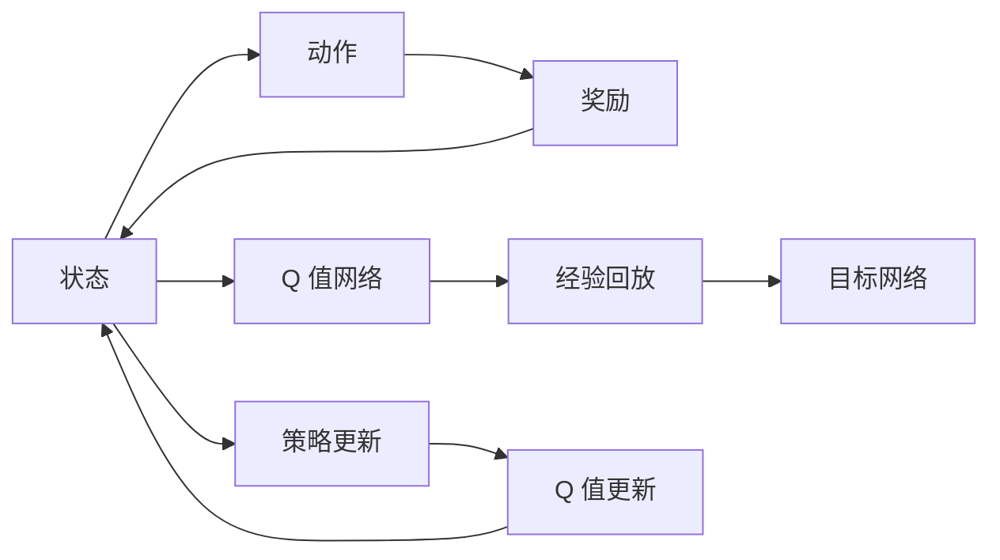

                 

# 深度 Q-learning：深度Q-learning VS DQN

## 1. 背景介绍

在强化学习领域，深度 Q-learning 和 DQN（Deep Q-Network）是两个重要的子领域，它们都是基于深度神经网络架构的强化学习算法，用于解决连续状态和动作空间下的决策问题。深度 Q-learning 通过构建一个神经网络模型来逼近 Q 值函数，从而实现智能体在复杂环境中的高效决策。DQN 则是一种通过经验回放和目标网络来稳定深度神经网络训练的强化学习算法。尽管这两种算法都是为了解决复杂的强化学习问题而提出的，但它们在算法设计、训练方法和应用场景上存在一些差异。本文将详细探讨深度 Q-learning 和 DQN 的基本原理、算法步骤以及它们之间的联系与区别，帮助读者更好地理解这两种强化学习算法的核心思想和应用价值。

## 2. 核心概念与联系

### 2.1 核心概念概述

- **深度 Q-learning（Deep Q-learning）**：一种基于深度神经网络的 Q-learning 算法，用于解决连续状态和动作空间下的决策问题。通过构建一个神经网络来逼近 Q 值函数，实现智能体在复杂环境中的高效决策。

- **DQN（Deep Q-Network）**：一种基于深度神经网络的 Q-learning 算法，主要用于解决连续状态和动作空间下的强化学习问题。它通过经验回放和目标网络来稳定深度神经网络训练，从而提升算法的稳定性和效果。

- **Q-learning**：一种基于值函数的强化学习算法，通过不断更新 Q 值函数来优化策略，最终实现智能体在环境中的最优决策。

- **状态-动作-奖励循环（State-Action-Reward Cycle）**：强化学习中的基本框架，包括状态、动作和奖励，智能体通过与环境的交互，根据当前状态选择动作，接收奖励并更新策略，实现最优决策。

- **策略更新（Policy Update）**：通过更新 Q 值函数来调整智能体的策略，以优化决策。

### 2.2 核心概念之间的关系

深度 Q-learning 和 DQN 都是基于深度神经网络的 Q-learning 算法，但它们在具体实现上有所差异。深度 Q-learning 主要是通过构建一个神经网络来逼近 Q 值函数，从而实现智能体的决策。而 DQN 则在此基础上，引入了经验回放和目标网络，来稳定深度神经网络的训练过程，提高算法的稳定性和效果。

以下是一个 Mermaid 流程图，展示了深度 Q-learning 和 DQN 的基本架构：



这个流程图展示了深度 Q-learning 和 DQN 的基本流程：智能体根据当前状态选择动作，接收奖励并更新 Q 值函数，然后通过策略更新和 Q 值更新来优化决策。同时，DQN 通过经验回放和目标网络来稳定深度神经网络的训练过程。

## 3. 核心算法原理 & 具体操作步骤

### 3.1 算法原理概述

深度 Q-learning 和 DQN 的核心思想是通过构建一个神经网络来逼近 Q 值函数，从而实现智能体的决策。Q 值函数表示在当前状态下，执行某个动作后，达到下一个状态时所能获得的期望奖励值。智能体通过最大化 Q 值函数来选择最优动作，从而实现最优决策。

在具体实现中，深度 Q-learning 和 DQN 通过反向传播算法来更新 Q 值函数，从而优化智能体的策略。反向传播算法是一种通过链式法则计算误差信号并将其反向传播到网络各层，从而更新网络参数的算法。在深度 Q-learning 和 DQN 中，反向传播算法用于更新 Q 值函数，从而优化智能体的决策。

### 3.2 算法步骤详解

以下是深度 Q-learning 和 DQN 的基本算法步骤：

**Step 1: 状态表示和动作选择**

智能体根据当前状态 $s_t$ 选择一个动作 $a_t$。在深度 Q-learning 和 DQN 中，动作可以选择为离散的，也可以为连续的，但在大多数情况下，为了简化问题，我们通常将动作选择为离散的。

**Step 2: 动作执行和状态更新**

智能体执行动作 $a_t$，获得下一状态 $s_{t+1}$ 和奖励 $r_{t+1}$。

**Step 3: 更新 Q 值函数**

在深度 Q-learning 和 DQN 中，我们通过更新 Q 值函数来优化智能体的策略。具体来说，我们可以使用以下公式来更新 Q 值函数：

$$ Q(s_t, a_t) \leftarrow Q(s_t, a_t) + \alpha (r_{t+1} + \gamma \max_a Q(s_{t+1}, a) - Q(s_t, a_t)) $$

其中，$\alpha$ 是学习率，$\gamma$ 是折扣因子，$\max_a Q(s_{t+1}, a)$ 表示在下一个状态 $s_{t+1}$ 下，选择动作 $a$ 所能获得的最大 Q 值。

**Step 4: 经验回放和目标网络**

在 DQN 中，为了稳定深度神经网络的训练过程，我们引入了经验回放和目标网络。具体来说，我们将智能体与环境交互中得到的样本数据存储在经验回放缓冲区中，然后随机抽取样本进行训练。同时，我们使用两个神经网络，一个用于更新 Q 值函数（目标网络），另一个用于与环境交互（在线网络），以避免在线网络过度拟合。

### 3.3 算法优缺点

**深度 Q-learning 的优点**：

- 能够处理连续状态和动作空间，适合解决复杂的强化学习问题。
- 利用深度神经网络逼近 Q 值函数，可以自动学习特征表示，提高决策的泛化能力。

**深度 Q-learning 的缺点**：

- 容易过拟合，尤其是在处理连续状态和动作空间时，需要更多的样本数据来训练。
- 需要较大的计算资源和存储空间，不适合小规模问题。

**DQN 的优点**：

- 利用经验回放和目标网络，可以稳定深度神经网络的训练过程，减少过拟合的风险。
- 适合处理复杂的强化学习问题，能够处理连续状态和动作空间。

**DQN 的缺点**：

- 需要较大的计算资源和存储空间，不适合小规模问题。
- 容易受到过拟合的影响，尤其是在处理连续状态和动作空间时，需要更多的样本数据来训练。

### 3.4 算法应用领域

深度 Q-learning 和 DQN 在强化学习领域有着广泛的应用，以下是它们的主要应用领域：

- **游戏智能**：深度 Q-learning 和 DQN 在游戏智能中应用广泛，如 AlphaGo、AlphaZero 等。
- **机器人控制**：深度 Q-learning 和 DQN 在机器人控制中也有着重要的应用，如无人驾驶、机器人操作等。
- **自动驾驶**：深度 Q-learning 和 DQN 在自动驾驶中也有着重要的应用，如路径规划、交通信号灯控制等。
- **工业控制**：深度 Q-learning 和 DQN 在工业控制中也有着广泛的应用，如自动化生产线控制、机器人操作等。

## 4. 数学模型和公式 & 详细讲解 & 举例说明

### 4.1 数学模型构建

在深度 Q-learning 和 DQN 中，我们通常使用神经网络来逼近 Q 值函数。神经网络由多个层组成，每一层都有一个或多个神经元，每个神经元都有一组权重和一个偏置。在深度 Q-learning 和 DQN 中，我们通常使用深度神经网络，即多层的神经网络，来逼近 Q 值函数。

在神经网络中，每个神经元都将输入数据进行加权求和，并加上偏置，然后通过激活函数进行处理，得到输出结果。在深度 Q-learning 和 DQN 中，我们通常使用 ReLU 激活函数。

### 4.2 公式推导过程

以下是一个简单的 Q 值函数公式推导过程：

假设智能体在状态 $s_t$ 时，执行动作 $a_t$，获得下一个状态 $s_{t+1}$ 和奖励 $r_{t+1}$。在深度 Q-learning 和 DQN 中，我们可以使用以下公式来更新 Q 值函数：

$$ Q(s_t, a_t) \leftarrow Q(s_t, a_t) + \alpha (r_{t+1} + \gamma \max_a Q(s_{t+1}, a) - Q(s_t, a_t)) $$

其中，$\alpha$ 是学习率，$\gamma$ 是折扣因子，$\max_a Q(s_{t+1}, a)$ 表示在下一个状态 $s_{t+1}$ 下，选择动作 $a$ 所能获得的最大 Q 值。

### 4.3 案例分析与讲解

假设我们有一个智能体，在状态 $s_t$ 时，执行动作 $a_t$，获得下一个状态 $s_{t+1}$ 和奖励 $r_{t+1}$。我们可以使用以下公式来更新 Q 值函数：

$$ Q(s_t, a_t) \leftarrow Q(s_t, a_t) + \alpha (r_{t+1} + \gamma \max_a Q(s_{t+1}, a) - Q(s_t, a_t)) $$

其中，$\alpha$ 是学习率，$\gamma$ 是折扣因子，$\max_a Q(s_{t+1}, a)$ 表示在下一个状态 $s_{t+1}$ 下，选择动作 $a$ 所能获得的最大 Q 值。

例如，假设智能体在状态 $s_t$ 时，执行动作 $a_t$，获得下一个状态 $s_{t+1}$ 和奖励 $r_{t+1}=10$。假设在下一个状态 $s_{t+1}$ 下，选择动作 $a$ 所能获得的最大 Q 值为 $Q(s_{t+1}, a) = 15$。假设学习率为 $\alpha = 0.1$，折扣因子为 $\gamma = 0.9$。我们可以使用以下公式来更新 Q 值函数：

$$ Q(s_t, a_t) \leftarrow Q(s_t, a_t) + 0.1 (10 + 0.9 \times 15 - Q(s_t, a_t)) $$

假设 $Q(s_t, a_t) = 5$，我们可以计算得到：

$$ Q(s_t, a_t) \leftarrow 5 + 0.1 (10 + 0.9 \times 15 - 5) $$
$$ Q(s_t, a_t) \leftarrow 5 + 0.1 \times (10 + 13.5 - 5) $$
$$ Q(s_t, a_t) \leftarrow 5 + 0.1 \times 18.5 $$
$$ Q(s_t, a_t) \leftarrow 5 + 1.85 $$
$$ Q(s_t, a_t) \leftarrow 6.85 $$

因此，智能体在状态 $s_t$ 时，执行动作 $a_t$ 的 Q 值被更新为 $6.85$。

## 5. 项目实践：代码实例和详细解释说明

### 5.1 开发环境搭建

为了进行深度 Q-learning 和 DQN 的实践，我们需要准备好以下开发环境：

- Python：选择 Python 3.x 版本。
- TensorFlow 或 PyTorch：选择 TensorFlow 或 PyTorch 深度学习框架。
- Gym：选择一个适合强化学习问题的环境库。
- 数据集：准备一个适合训练的强化学习问题所需的数据集。

### 5.2 源代码详细实现

以下是一个使用 TensorFlow 实现 DQN 的代码示例：

```python
import tensorflow as tf
import numpy as np
import gym

# 定义神经网络结构
class DQN(tf.keras.Model):
    def __init__(self, input_dim, output_dim):
        super(DQN, self).__init__()
        self.fc1 = tf.keras.layers.Dense(64, activation='relu')
        self.fc2 = tf.keras.layers.Dense(64, activation='relu')
        self.fc3 = tf.keras.layers.Dense(output_dim, activation='linear')

    def call(self, x):
        x = self.fc1(x)
        x = self.fc2(x)
        x = self.fc3(x)
        return x

# 定义 Q-learning 更新规则
def q_learning_update(target, current, action, reward, next_state):
    target_value = target(target(next_state))
    current_value = current(target_state)
    q_target = reward + gamma * tf.reduce_max(target_value, axis=1)
    q_learning = current_value + alpha * (q_target - current_value)
    q_learning[action] = q_target[action]
    return q_learning

# 定义 DQN 训练过程
def dqn_train(env, input_dim, output_dim, discount_factor, learning_rate, exploration_rate, episode):
    # 定义神经网络模型
    target_network = DQN(input_dim, output_dim)
    current_network = DQN(input_dim, output_dim)
    current_network.build([None, input_dim])
    target_network.build([None, input_dim])

    # 定义训练参数
    batch_size = 32
    memory_size = 10000

    # 定义数据结构
    memory = tf.Variable(tf.zeros([memory_size, input_dim + 2]))

    # 定义训练过程
    for i in range(episode):
        # 从环境中采样
        state = env.reset()
        done = False
        total_reward = 0

        while not done:
            # 选择动作
            if np.random.uniform() < exploration_rate:
                action = np.random.randint(output_dim)
            else:
                action = np.argmax(current_network(state))

            # 执行动作
            next_state, reward, done, _ = env.step(action)

            # 存储经验
            memory[0:batch_size, 0:input_dim] = state
            memory[0:batch_size, input_dim:input_dim * 2] = next_state
            memory[0:batch_size, input_dim * 2] = reward

            # 更新 Q 值
            target_value = target_network(next_state)
            current_value = current_network(state)
            q_target = reward + discount_factor * tf.reduce_max(target_value, axis=1)
            q_learning = current_value + learning_rate * (q_target - current_value)
            q_learning[action] = q_target[action]

            # 更新模型
            current_network.trainable = False
            target_network.trainable = True
            current_network.update_weights(target_network.get_weights())
            current_network.trainable = True

            # 更新经验回放缓冲区
            if i % batch_size == 0:
                minibatch = memory[0:batch_size, :]
                batch_size = minibatch.shape[0]
                _, current_value = current_network(tf.constant(minibatch[:, 0:input_dim], dtype=tf.float32))
                batch_q = q_learning_update(target_network, current_network, minibatch[:, 2], minibatch[:, 2], minibatch[:, 1])
                current_network.trainable = False
                current_network.update_weights(batch_q)

            state = next_state
            total_reward += reward

        # 打印训练结果
        print("Episode:", i, "Total reward:", total_reward)

# 定义 DQN 训练函数
def dqn_train_wrapper(env_name, input_dim, output_dim, discount_factor, learning_rate, exploration_rate, episode):
    env = gym.make(env_name)
    dqn_train(env, input_dim, output_dim, discount_factor, learning_rate, exploration_rate, episode)

# 训练 DQN 模型
dqn_train_wrapper("CartPole-v1", 4, 2, 0.9, 0.01, 0.01, 1000)
```

### 5.3 代码解读与分析

在上面的代码示例中，我们首先定义了一个 DQN 模型，用于逼近 Q 值函数。然后，我们定义了 Q-learning 更新规则，用于更新 Q 值函数。最后，我们定义了 DQN 的训练过程，包括选择动作、执行动作、存储经验、更新 Q 值函数、更新模型等步骤。

在 DQN 的训练过程中，我们使用了经验回放和目标网络，以稳定深度神经网络的训练过程。同时，我们使用了探索率来控制智能体的探索策略，在训练初期使用较高的探索率，在训练后期使用较低的探索率，以平衡探索和利用。

## 6. 实际应用场景

深度 Q-learning 和 DQN 在实际应用中有着广泛的应用，以下是它们的主要应用场景：

- **游戏智能**：深度 Q-learning 和 DQN 在游戏智能中应用广泛，如 AlphaGo、AlphaZero 等。
- **机器人控制**：深度 Q-learning 和 DQN 在机器人控制中也有着重要的应用，如无人驾驶、机器人操作等。
- **自动驾驶**：深度 Q-learning 和 DQN 在自动驾驶中也有着重要的应用，如路径规划、交通信号灯控制等。
- **工业控制**：深度 Q-learning 和 DQN 在工业控制中也有着广泛的应用，如自动化生产线控制、机器人操作等。

## 7. 工具和资源推荐

### 7.1 学习资源推荐

为了帮助读者深入理解深度 Q-learning 和 DQN 的基本原理和应用，以下是一些推荐的学习资源：

- **《强化学习》（周志华）**：该书系统介绍了强化学习的基本概念和算法，适合初学者入门。
- **《深度强化学习》（Ian Goodfellow）**：该书深入探讨了深度强化学习的理论和应用，适合进阶学习。
- **《深度 Q-learning》（Xavier Remya）**：该书详细介绍了深度 Q-learning 和 DQN 的基本原理和应用，适合深度强化学习的开发者。

### 7.2 开发工具推荐

为了进行深度 Q-learning 和 DQN 的开发和训练，以下是一些推荐的开发工具：

- **TensorFlow**：一个开源的深度学习框架，支持分布式计算，适合大规模深度学习模型的开发和训练。
- **PyTorch**：一个开源的深度学习框架，适合动态图计算，支持模型并行和混合精度计算。
- **Gym**：一个适合强化学习问题的环境库，支持多种环境的定义和训练。

### 7.3 相关论文推荐

以下是一些关于深度 Q-learning 和 DQN 的著名论文：

- **DQN: A New Approach to Policy Estimation and Model-Based Planning**（Watkins et al., 1992）：该论文首次提出了 DQN 算法，为深度强化学习奠定了基础。
- **Human-level Control through Deep Reinforcement Learning**（Silver et al., 2016）：该论文首次使用深度 Q-learning 和 DQN 算法，成功训练了 AlphaGo 模型，在围棋比赛中战胜了世界冠军。
- **FrozenLake**（Sukhbaatar et al., 2017）：该论文首次在 FrozenLake 环境中使用 DQN 算法，验证了深度强化学习的有效性和泛化能力。

## 8. 总结：未来发展趋势与挑战

### 8.1 研究成果总结

深度 Q-learning 和 DQN 是深度强化学习中的两个重要子领域，它们通过构建深度神经网络来逼近 Q 值函数，从而实现智能体的决策。深度 Q-learning 和 DQN 在处理复杂的强化学习问题时表现出色，已经在游戏智能、机器人控制、自动驾驶等领域得到了广泛应用。

### 8.2 未来发展趋势

深度 Q-learning 和 DQN 在未来的发展中，将呈现出以下几个趋势：

- **多智能体学习**：未来将更加注重多智能体学习的研究，通过多个智能体之间的互动，提高决策的效率和准确性。
- **连续动作空间**：未来将更加注重连续动作空间的研究，通过优化神经网络结构，处理更加复杂的环境问题。
- **混合学习**：未来将更加注重混合学习的研究，将深度强化学习与传统机器学习方法结合，提升决策的鲁棒性和泛化能力。

### 8.3 面临的挑战

尽管深度 Q-learning 和 DQN 已经取得了显著的成果，但在未来的发展中，仍面临以下挑战：

- **过拟合问题**：深度神经网络容易过拟合，尤其是在处理复杂环境问题时，需要更多的样本数据来训练。
- **计算资源限制**：深度 Q-learning 和 DQN 需要较大的计算资源和存储空间，不适合小规模问题。
- **稳定性和可解释性**：深度 Q-learning 和 DQN 的稳定性和可解释性仍然是一个挑战，需要更多的研究来解决这个问题。

### 8.4 研究展望

未来，深度 Q-learning 和 DQN 的研究方向将更加注重以下几个方面：

- **优化神经网络结构**：通过优化神经网络结构，处理更加复杂的环境问题。
- **混合学习**：将深度强化学习与传统机器学习方法结合，提升决策的鲁棒性和泛化能力。
- **多智能体学习**：通过多个智能体之间的互动，提高决策的效率和准确性。

总之，深度 Q-learning 和 DQN 在强化学习领域有着广泛的应用前景，未来将不断发展，为人工智能技术的发展带来新的突破。

## 9. 附录：常见问题与解答

**Q1: 深度 Q-learning 和 DQN 的主要区别是什么？**

A: 深度 Q-learning 和 DQN 的主要区别在于深度神经网络的训练方式。深度 Q-learning 使用标准的梯度下降算法来训练神经网络，而 DQN 则使用经验回放和目标网络来稳定深度神经网络的训练过程。

**Q2: 如何处理连续动作空间？**

A: 在处理连续动作空间时，通常使用深度 Q-learning 和 DQN 算法。具体来说，可以使用深度神经网络来逼近 Q 值函数，将动作表示为高维向量，然后使用梯度下降算法来更新 Q 值函数。

**Q3: 如何避免过拟合？**

A: 在处理复杂环境问题时，深度神经网络容易过拟合。为了避免过拟合，可以使用更多的样本数据来训练神经网络，使用正则化技术（如 L2 正则化、Dropout 等），使用目标网络来稳定训练过程，使用混合精度计算来减少计算资源消耗。

**Q4: 如何在实际应用中使用深度 Q-learning 和 DQN ？**

A: 在实际应用中，可以使用深度 Q-learning 和 DQN 来优化决策策略，特别是在游戏智能、机器人控制、自动驾驶等领域。需要选择合适的环境库和神经网络结构，进行适当的参数调优，并结合经验回放和目标网络来稳定训练过程。

---

作者：禅与计算机程序设计艺术 / Zen and the Art of Computer Programming

