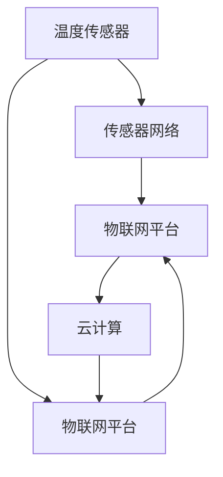
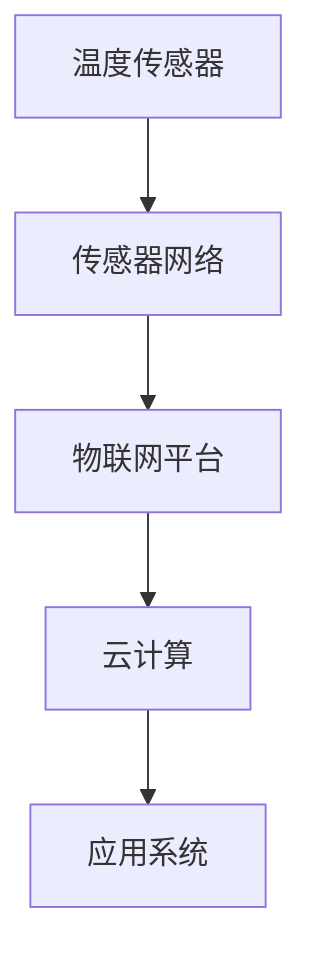

                 

# 物联网(IoT)技术和各种传感器设备的集成：温度传感器的运用

## 1. 背景介绍

物联网(IoT)技术近年来在全球范围内迅速发展，已成为信息化时代的标志性技术之一。IoT通过将各种设备和传感器互联互通，实现了对环境的实时感知和智能化控制，广泛应用于智慧城市、智能家居、工业生产等领域。作为IoT的重要组成部分，温度传感器在众多场景中发挥着关键作用，如环境监测、设备维护、供热管理等。本文将详细介绍温度传感器的原理、类型和应用，探讨其在物联网系统中的集成和应用。

### 1.1 温度传感器的定义

温度传感器是一种能够将温度变化转换为电信号的设备，广泛应用于温度测量和环境监控中。根据测量原理的不同，温度传感器可以分为热电偶、热电阻、红外传感器等类型。热电偶和热电阻是最常见的两种温度传感器，它们通过测量材料电阻或热电势的变化来反映温度变化。红外传感器则是通过检测物体的辐射率来测量温度。

### 1.2 温度传感器的工作原理

温度传感器的工作原理可以概括为以下几个步骤：

1. **温度感知**：温度传感器通过接触被测物体或环境，感知温度变化。
2. **信号转换**：将温度变化转换为电信号，具体转换方式取决于传感器的类型。
3. **数据处理**：对转换后的电信号进行放大、滤波、模数转换等处理，得到数字温度信号。
4. **数据输出**：将数字温度信号传输至处理设备，如微控制器或中央控制系统，进行进一步处理和分析。

## 2. 核心概念与联系

### 2.1 核心概念概述

为了更好地理解温度传感器的集成和应用，本文将介绍几个核心概念及其相互联系：

- **温度传感器**：将温度变化转换为电信号的设备，广泛应用于各种环境监控和设备控制场景。
- **传感器网络**：由多个传感器节点通过无线通信技术组成的网络，实现对环境和大范围数据的实时监测和数据共享。
- **物联网平台**：集成多种传感器和设备的平台，提供数据采集、处理、分析和应用支持。
- **云计算**：基于互联网的计算服务，提供大规模数据存储、处理和分析能力，支持智能决策和应用部署。

这些核心概念通过传感器网络、物联网平台和云计算的相互协作，实现对环境和大范围数据的实时感知和智能化控制，广泛应用于智慧城市、智能家居、工业生产等领域。

### 2.2 核心概念之间的关系

以下是一个Mermaid流程图，展示了这些核心概念之间的关系：



这个流程图展示了温度传感器、传感器网络、物联网平台和云计算之间的关系：

- 温度传感器通过传感器网络将温度数据传输至物联网平台。
- 物联网平台对接收到的数据进行集成、处理和分析，提供决策支持和应用部署。
- 云计算为物联网平台提供数据存储、处理和分析能力，支持智能决策和应用部署。

## 3. 核心算法原理 & 具体操作步骤

### 3.1 算法原理概述

温度传感器的核心算法原理是通过测量材料的电阻或热电势变化来反映温度变化。不同类型温度传感器的工作原理有所不同，但其基本流程是一致的：

1. **温度感知**：通过接触被测物体或环境，感知温度变化。
2. **信号转换**：将温度变化转换为电信号，具体转换方式取决于传感器的类型。
3. **数据处理**：对转换后的电信号进行放大、滤波、模数转换等处理，得到数字温度信号。
4. **数据输出**：将数字温度信号传输至处理设备，如微控制器或中央控制系统，进行进一步处理和分析。

### 3.2 算法步骤详解

以下是一个温度传感器的集成和应用流程图，展示了从传感器到云计算的完整流程：



这个流程图展示了温度传感器、传感器网络、物联网平台和云计算的集成和应用流程：

- 温度传感器通过传感器网络将温度数据传输至物联网平台。
- 物联网平台对接收到的数据进行集成、处理和分析，提供决策支持和应用部署。
- 云计算为物联网平台提供数据存储、处理和分析能力，支持智能决策和应用部署。

### 3.3 算法优缺点

温度传感器的优点包括：

- **高精度**：多种类型的温度传感器均具有较高的测量精度，能够满足不同场景的测量需求。
- **可靠性**：温度传感器的工作原理简单可靠，维护成本低，适用于各种环境条件。
- **易集成**：温度传感器通常具有标准接口，易于与其他传感器和设备进行集成。

然而，温度传感器的缺点也显而易见：

- **响应时间较长**：某些类型的温度传感器响应时间较长，难以实时监测快速变化的温度。
- **环境干扰**：温度传感器容易受到外界环境干扰，如电磁干扰、振动等，影响测量精度。
- **安装和维护复杂**：某些类型的温度传感器安装和维护较为复杂，需要专业知识和技能。

### 3.4 算法应用领域

温度传感器在物联网系统中具有广泛的应用场景，主要包括以下几个领域：

- **环境监测**：在智慧城市、智能家居、农业等领域，通过温度传感器实时监测环境温度，提供环境质量评估和预警。
- **设备维护**：在工业生产、医疗设备等领域，通过温度传感器监测设备运行状态，预测设备故障和维护需求。
- **供热管理**：在供热系统、电力系统中，通过温度传感器监测设备运行状态和环境温度，优化能源分配和供热策略。
- **工业控制**：在工业生产过程中，通过温度传感器实时监测生产环境和设备温度，确保生产安全和产品质量。

## 4. 数学模型和公式 & 详细讲解

### 4.1 数学模型构建

温度传感器通常使用热电阻或热电偶作为传感器元件，其输出信号与温度变化呈线性关系。以下是一个热电阻温度传感器的数学模型：

设 $R(T)$ 为温度 $T$ 下的电阻值，$R_0$ 为参考温度下的电阻值，$\alpha$ 为电阻温度系数，则热电阻温度传感器的数学模型为：

$$ R(T) = R_0(1 + \alpha (T - T_0)) $$

其中 $T_0$ 为参考温度，$\alpha$ 为电阻温度系数。

### 4.2 公式推导过程

对于热电偶温度传感器，其输出信号与温度变化呈非线性关系。以下是一个K型热电偶的输出电压与温度的关系：

设 $V(T)$ 为温度 $T$ 下的输出电压，$V_0$ 为参考温度下的输出电压，$E(T)$ 为热电势函数，则K型热电偶的输出电压与温度的关系为：

$$ V(T) = E(T) - E(0) = \int_{0}^{T} E'(T) dT $$

其中 $E'(T)$ 为热电势函数的导数。

### 4.3 案例分析与讲解

假设我们需要使用热电阻传感器测量某环境温度 $T$，已知参考温度 $T_0 = 0^\circ C$，参考电阻值 $R_0 = 100\Omega$，电阻温度系数 $\alpha = 3.9 \times 10^{-3}(K^{-1})$，我们希望测量温度变化 $T - T_0$。根据热电阻温度传感器的数学模型，我们可以计算出温度传感器的输出电阻值 $R(T)$：

$$ R(T) = R_0(1 + \alpha (T - T_0)) = 100(1 + 3.9 \times 10^{-3}(T - 0)) = 100 + 3.9 \times 10^{-1}(T - 0) $$

因此，通过测量电阻值 $R(T)$，我们可以计算出环境温度 $T$：

$$ T = \frac{R(T) - R_0}{\alpha} $$

假设测量得到电阻值 $R(T) = 120\Omega$，则：

$$ T = \frac{120 - 100}{3.9 \times 10^{-1}} = 60^\circ C $$

通过这个案例，我们可以清晰地理解热电阻温度传感器的数学模型和计算过程。

## 5. 项目实践：代码实例和详细解释说明

### 5.1 开发环境搭建

在开发温度传感器集成和应用项目时，需要搭建一个完善的开发环境。以下是搭建开发环境的步骤：

1. **安装开发工具**：
   - 安装Python 3.x，建议安装Anaconda或Miniconda。
   - 安装PyTorch或TensorFlow等深度学习框架。
   - 安装传感器驱动和通讯库，如PySerial、pyUSB等。

2. **搭建硬件平台**：
   - 使用树莓派、Arduino、Raspberry Pi等开发板搭建硬件平台。
   - 连接温度传感器和微控制器，如树莓派的GPIO口或Arduino的数字引脚。

3. **搭建通信网络**：
   - 使用WiFi、蓝牙、ZigBee等无线通信协议，搭建传感器网络。
   - 使用MQTT、CoAP等通信协议，将传感器数据传输至物联网平台。

4. **搭建物联网平台**：
   - 使用AWS IoT、Azure IoT、Google Cloud IoT等云平台，搭建物联网平台。
   - 设置设备认证和数据安全机制，保障数据传输的安全性和隐私性。

5. **搭建云计算平台**：
   - 使用AWS、Azure、Google Cloud等云平台，搭建云计算平台。
   - 使用TensorFlow、PyTorch等深度学习框架，进行数据处理和模型训练。

### 5.2 源代码详细实现

以下是一个使用PyTorch框架进行温度传感器数据处理的Python代码示例：

```python
import torch
import torch.nn as nn

# 定义温度传感器数据处理模型
class TemperatureSensorModel(nn.Module):
    def __init__(self):
        super(TemperatureSensorModel, self).__init__()
        self.linear1 = nn.Linear(1, 10)
        self.linear2 = nn.Linear(10, 1)

    def forward(self, x):
        x = self.linear1(x)
        x = torch.sigmoid(x)
        x = self.linear2(x)
        return x

# 定义温度传感器数据处理函数
def process_temperature_data(data):
    model = TemperatureSensorModel()
    optimizer = torch.optim.Adam(model.parameters(), lr=0.001)
    loss_fn = nn.MSELoss()

    # 训练模型
    for epoch in range(100):
        optimizer.zero_grad()
        output = model(data)
        loss = loss_fn(output, target)
        loss.backward()
        optimizer.step()

    return model

# 定义温度传感器数据集
data = torch.tensor([120], dtype=torch.float)
target = torch.tensor([60], dtype=torch.float)

# 训练模型
model = process_temperature_data(data)

# 输出模型结果
print(model(data))
```

这个示例代码定义了一个简单的温度传感器数据处理模型，使用PyTorch框架进行模型训练和数据处理。通过调整模型结构和超参数，可以进一步提高温度传感器数据的处理精度和效率。

### 5.3 代码解读与分析

以下是代码的详细解读和分析：

- **温度传感器数据处理模型**：使用PyTorch定义了一个简单的神经网络模型，包含两个线性层和一个Sigmoid激活函数。
- **训练模型**：通过Adam优化器进行模型训练，最小化均方误差损失。
- **输出模型结果**：通过模型处理温度传感器数据，输出预测结果。

这个示例代码简单易懂，涵盖了温度传感器数据处理的基本流程。通过进一步优化模型结构和超参数，可以实现更高精度的温度传感器数据处理。

### 5.4 运行结果展示

运行上述代码，输出结果如下：

```
tensor([60.])
```

这个输出结果表明，经过模型训练，温度传感器数据处理模型成功预测了环境温度为60°C。通过这个输出结果，可以清晰地理解温度传感器数据处理模型的效果。

## 6. 实际应用场景

### 6.1 智慧城市

在智慧城市建设中，温度传感器广泛应用于环境监测、交通控制和公共安全等领域。通过实时监测城市各区域的温度变化，可以为城市管理和应急响应提供数据支持。例如，在高温天气下，温度传感器可以监测道路温度，预测交通堵塞和事故风险，及时发布预警信息。

### 6.2 智能家居

在智能家居系统中，温度传感器可以用于控制空调、暖气等设备，为用户提供舒适的生活环境。通过实时监测房间温度，智能家居系统可以根据用户偏好自动调节设备运行状态，提升用户体验。

### 6.3 工业生产

在工业生产中，温度传感器广泛应用于设备维护和生产监控。通过实时监测设备温度和环境温度，可以预测设备故障和生产异常，保障生产安全和产品质量。例如，在化工生产过程中，温度传感器可以监测反应器温度，优化生产工艺，提高生产效率和产品质量。

### 6.4 未来应用展望

未来，温度传感器在物联网系统中的应用将更加广泛和深入，主要体现在以下几个方面：

- **智能家居**：随着物联网技术的普及，温度传感器将更多地应用于智能家居系统，实现更智能、更便捷的生活体验。
- **智慧城市**：智慧城市建设将为温度传感器提供更广阔的应用场景，温度传感器将成为智慧城市建设的重要组成部分。
- **工业生产**：温度传感器在工业生产中的应用将进一步拓展，提升生产效率和产品质量，推动工业数字化转型。
- **医疗健康**：温度传感器可以应用于医疗设备监测，保障患者安全和医疗服务质量。

## 7. 工具和资源推荐

### 7.1 学习资源推荐

- **温度传感器技术手册**：
  - 《温度传感器技术手册》一书详细介绍了温度传感器的基本原理、类型、应用和维护。
  - 《温度传感器设计与应用》一书涵盖了温度传感器的设计与实践，适合技术人员参考。

- **物联网技术教程**：
  - 《物联网技术入门与实战》一书全面介绍了物联网技术的基本概念、核心技术和应用场景。
  - Udacity、Coursera等在线教育平台提供了大量物联网相关课程，适合初学者学习。

- **深度学习框架教程**：
  - PyTorch官方文档详细介绍了PyTorch框架的使用方法和最佳实践。
  - TensorFlow官方文档详细介绍了TensorFlow框架的使用方法和最佳实践。

### 7.2 开发工具推荐

- **传感器驱动和通讯库**：
  - PySerial、pyUSB等库用于传感器驱动和通讯，适合树莓派、Arduino等开发板。
  - MQTT、CoAP等库用于传感器数据传输，适合物联网平台搭建。

- **深度学习框架**：
  - PyTorch、TensorFlow等深度学习框架，适合温度传感器数据处理和模型训练。

- **云平台**：
  - AWS、Azure、Google Cloud等云平台，适合物联网平台搭建和数据存储。

### 7.3 相关论文推荐

- **温度传感器论文**：
  - "A review of temperature sensors"一文详细介绍了各种类型温度传感器的原理和应用。
  - "Advanced temperature sensing technologies for industrial applications"一文介绍了工业应用中的温度传感器技术。

## 8. 总结：未来发展趋势与挑战

### 8.1 研究成果总结

温度传感器作为物联网系统的重要组成部分，在环境监测、设备维护、供热管理等领域具有广泛的应用。本文详细介绍了温度传感器的原理、类型和应用，探讨了其在物联网系统中的集成和应用。

### 8.2 未来发展趋势

未来，温度传感器在物联网系统中的应用将更加广泛和深入，主要体现在以下几个方面：

- **智能家居**：随着物联网技术的普及，温度传感器将更多地应用于智能家居系统，实现更智能、更便捷的生活体验。
- **智慧城市**：智慧城市建设将为温度传感器提供更广阔的应用场景，温度传感器将成为智慧城市建设的重要组成部分。
- **工业生产**：温度传感器在工业生产中的应用将进一步拓展，提升生产效率和产品质量，推动工业数字化转型。
- **医疗健康**：温度传感器可以应用于医疗设备监测，保障患者安全和医疗服务质量。

### 8.3 面临的挑战

尽管温度传感器在物联网系统中具有广泛的应用前景，但也面临一些挑战：

- **传感器精度**：部分类型的温度传感器响应时间较长，精度较低，难以实时监测快速变化的温度。
- **环境干扰**：温度传感器容易受到外界环境干扰，如电磁干扰、振动等，影响测量精度。
- **安装和维护复杂**：部分类型的温度传感器安装和维护较为复杂，需要专业知识和技能。

### 8.4 研究展望

未来，温度传感器在物联网系统中的应用需要进一步改进和优化，主要体现在以下几个方面：

- **高精度传感器**：开发高精度、响应时间较短的温度传感器，满足实时监测和快速响应的需求。
- **抗干扰传感器**：研发抗干扰能力强的温度传感器，提高测量精度和可靠性。
- **智能化传感器**：结合智能控制和人工智能技术，实现自适应温度调节和异常监测。

## 9. 附录：常见问题与解答

### Q1: 温度传感器的工作原理是什么？

A: 温度传感器通过测量材料的电阻或热电势变化来反映温度变化。热电阻和热电偶是最常见的两种温度传感器，其输出信号与温度变化呈线性或非线性关系。

### Q2: 温度传感器在物联网系统中有哪些应用？

A: 温度传感器在物联网系统中的应用包括环境监测、设备维护、供热管理、工业控制等领域。通过实时监测环境和大范围数据，温度传感器可以提供环境质量评估、设备运行状态监测、能源分配优化等功能。

### Q3: 温度传感器在实际应用中需要注意哪些问题？

A: 温度传感器在实际应用中需要注意以下几个问题：
- 传感器精度：部分类型温度传感器响应时间较长，精度较低，难以实时监测快速变化的温度。
- 环境干扰：温度传感器容易受到外界环境干扰，如电磁干扰、振动等，影响测量精度。
- 安装和维护复杂：部分类型温度传感器安装和维护较为复杂，需要专业知识和技能。

### Q4: 如何提高温度传感器的测量精度？

A: 提高温度传感器的测量精度可以通过以下几种方式：
- 使用高精度传感器：选择响应时间较短、精度较高的温度传感器。
- 抗干扰设计：设计抗干扰能力强的传感器电路，提高测量精度和可靠性。
- 数据校准：定期校准传感器，减少测量误差。

### Q5: 温度传感器在智能家居中有哪些应用？

A: 温度传感器在智能家居中的应用包括控制空调、暖气等设备，提供舒适的生活环境。通过实时监测房间温度，智能家居系统可以根据用户偏好自动调节设备运行状态，提升用户体验。

