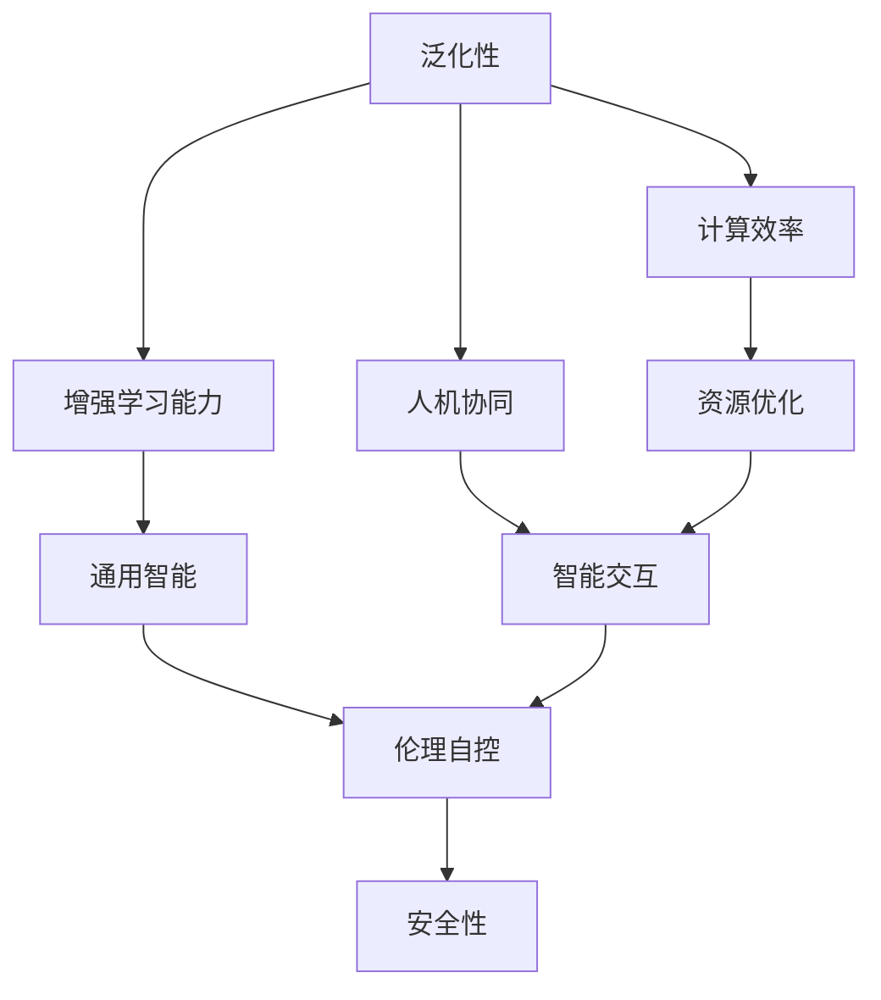

                 

# Andrej Karpathy：人工智能的未来发展目标

## 1. 背景介绍

在人工智能(AI)领域，Andrej Karpathy是当之无愧的先行者和领袖。他不仅在计算机视觉领域取得了显著的成就，还积极探索AI技术的未来发展方向，提出了许多前瞻性的观点和目标。本文将基于Andrej Karpathy的讲座、论文以及公开言论，探讨人工智能的未来发展目标和路径。

### 1.1 问题由来

近年来，人工智能技术取得了飞速发展，尤其是在深度学习、计算机视觉、自然语言处理等领域。然而，这些技术的进步也引发了人们对AI未来的担忧和思考。在Karpathy看来，人工智能的终极目标是实现通用人工智能（AGI），即一种能够理解和执行任何智力任务，具备人类智能水平的AI系统。

### 1.2 问题核心关键点

Karpathy认为，AI未来的发展目标可以归纳为以下几点：

- 增强学习能力的泛化性
- 提高计算效率和资源利用率
- 强化人机协同与交互
- 实现道德和伦理上的自控
- 构建安全、透明、可解释的AI系统

这些问题关键点不仅涉及技术本身，还涵盖了伦理、安全、社会责任等多个维度。本文将围绕这些关键点，深入探讨Andrej Karpathy对AI未来的见解。

## 2. 核心概念与联系

### 2.1 核心概念概述

为更好地理解Andrej Karpathy的观点，本节将介绍几个紧密相关的核心概念：

- **增强学习能力泛化性（Generalization of Learning Capabilities）**：指的是AI系统在各种不同环境和任务中，能够泛化其学习策略，适应新情况的能力。
- **计算效率与资源利用率（Computational Efficiency and Resource Utilization）**：AI系统需要高效利用计算资源，减少能源消耗和硬件需求。
- **人机协同与交互（Human-AI Collaboration and Interaction）**：AI系统与人类协同工作，实现更高效的沟通和协作。
- **伦理与自控（Ethics and Self-Regulation）**：AI系统需要具备伦理意识和自控能力，避免有害行为。
- **安全透明可解释（Safety, Transparency, and Explainability）**：AI系统应具备透明性，易于解释，并在设计和应用中注重安全性。

这些概念之间存在着紧密的联系，共同构成了Andrej Karpathy对AI未来发展的整体框架。

### 2.2 概念间的关系

这些核心概念之间的关系可以通过以下Mermaid流程图来展示：



这个流程图展示了Andrej Karpathy对AI未来发展的整体框架：

1. 增强学习能力泛化性，提升通用智能水平。
2. 提高计算效率，优化资源利用。
3. 促进人机协同，提升智能交互体验。
4. 实现伦理自控，确保AI系统的道德安全性。
5. 构建安全透明可解释的AI系统。

## 3. 核心算法原理 & 具体操作步骤

### 3.1 算法原理概述

Andrej Karpathy对AI未来的发展目标，主要体现在以下几个方面：

- **泛化性增强**：通过迁移学习、多任务学习等方法，提升AI系统在不同任务和环境中的适应能力。
- **计算效率提升**：利用模型压缩、稀疏化、分布式计算等技术，优化AI系统的计算效率和资源利用率。
- **人机协同**：设计更具交互性的AI接口和用户界面，使AI系统更好地融入人类工作流程。
- **伦理自控**：引入伦理导向的训练目标和评估指标，构建透明可解释的AI模型。

这些目标的实现，需要构建科学的算法和操作流程，以下是具体的步骤和方法。

### 3.2 算法步骤详解

#### 3.2.1 泛化性增强

1. **迁移学习（Transfer Learning）**：
   - **多任务学习（Multi-task Learning）**：在多个相关任务间共享知识和经验，减少数据需求，提高泛化性能。
   - **跨领域迁移（Cross-domain Transfer）**：将预训练模型在相关领域应用，提升新任务性能。

2. **多任务学习框架**：
   - 定义任务损失函数：$$L(\theta) = \sum_{i=1}^m \lambda_i \ell_i(x_i; y_i, \theta)$$
   - 使用联合优化算法，如Multi-task MAML，联合优化多个任务的损失。

3. **模型压缩与稀疏化**：
   - **剪枝（Pruning）**：去除冗余连接，保留重要部分。
   - **量化（Quantization）**：将浮点模型转换为定点模型，减少内存占用。
   - **知识蒸馏（Knowledge Distillation）**：将大模型的知识传递给小模型，提升小模型性能。

#### 3.2.2 计算效率提升

1. **模型压缩与稀疏化**：
   - **剪枝（Pruning）**：通过剪枝策略，去除不必要的连接，减少计算量。
   - **量化（Quantization）**：将模型参数压缩为定点数，减少内存和计算开销。
   - **知识蒸馏（Knowledge Distillation）**：通过蒸馏技术，将大模型的知识传递给小模型，提升小模型性能。

2. **分布式计算与优化**：
   - **分布式训练（Distributed Training）**：在多台机器上并行训练，加速模型收敛。
   - **自适应优化算法（Adaptive Optimization Algorithms）**：如AdamW、Adafactor等，自适应调整学习率。

3. **硬件加速**：
   - **GPU/TPU加速**：利用GPU/TPU等专用硬件加速计算过程。
   - **混合精度计算（Mixed Precision Calculation）**：使用16位浮点数进行计算，提升计算效率。

#### 3.2.3 人机协同与交互

1. **交互界面设计**：
   - **自然语言交互**：设计易于理解的自然语言界面，提升人机交互效率。
   - **可视化界面**：使用图表、动画等形式，直观展示AI系统的决策过程。

2. **智能界面与智能助手**：
   - **智能助手**：开发智能助手，提供任务规划、进度跟踪等功能。
   - **实时交互**：通过实时交互接口，实现与用户的即时沟通和协作。

#### 3.2.4 伦理自控

1. **伦理导向的训练目标**：
   - **公平性**：在训练过程中，加入公平性约束，避免模型偏见。
   - **透明度**：在模型设计中，加入可解释性组件，便于理解模型的内部机制。

2. **模型评估与验证**：
   - **评估指标**：定义多种评估指标，如公平性、可解释性等，定期对模型进行评估。
   - **用户反馈**：收集用户反馈，及时调整模型行为，确保模型符合伦理规范。

3. **自控机制**：
   - **限制行为**：在模型设计中，加入自控机制，防止模型行为失控。
   - **风险管理**：通过风险评估，提前预测和规避潜在风险。

### 3.3 算法优缺点

**泛化性增强**：
- **优点**：提高AI系统在不同任务和环境中的适应能力，减少新任务开发成本。
- **缺点**：模型复杂度增加，可能出现迁移失败的情况。

**计算效率提升**：
- **优点**：减少资源消耗，降低计算成本，提高系统响应速度。
- **缺点**：模型压缩可能导致精度损失，分布式计算增加系统复杂度。

**人机协同与交互**：
- **优点**：提升人机交互体验，实现更高效的任务协作。
- **缺点**：交互界面设计复杂，需要大量用户测试和反馈。

**伦理自控**：
- **优点**：确保AI系统的道德安全性，提升用户信任度。
- **缺点**：伦理导向的训练目标和评估指标设计复杂，需要持续优化。

### 3.4 算法应用领域

Andrej Karpathy认为，泛化性增强、计算效率提升、人机协同与交互、伦理自控等目标，将广泛应用于以下几个领域：

- **医疗健康**：AI系统在医疗诊断、药物研发、患者管理等方面，需要具备泛化能力和高计算效率，同时保证伦理自控。
- **自动驾驶**：自动驾驶系统需要高效计算、人机协同和伦理自控，确保行车安全。
- **金融服务**：AI系统在金融交易、风险管理、客户服务等方面，需要高计算效率和透明可解释性。
- **教育培训**：AI系统在个性化教育、智能辅导、虚拟实验等方面，需要人机协同和伦理自控。
- **智能制造**：AI系统在智能工厂、设备预测维护、质量控制等方面，需要高计算效率和伦理自控。

## 4. 数学模型和公式 & 详细讲解 & 举例说明

### 4.1 数学模型构建

Andrej Karpathy提出的AI未来发展目标，涉及多个数学模型和算法。以下是一些关键模型的构建和推导过程：

#### 4.1.1 泛化性增强的数学模型

设模型 $f(x; \theta)$ 为训练得到的AI系统，其中 $x$ 为输入，$\theta$ 为参数。在多任务学习中，定义损失函数 $L(x; y, \theta)$ 如下：

$$L(x; y, \theta) = \sum_{i=1}^m \lambda_i \ell_i(x; y_i, \theta)$$

其中 $\ell_i(x; y_i, \theta)$ 为任务 $i$ 的损失函数，$\lambda_i$ 为任务权重。使用Multi-task MAML进行联合优化：

$$\theta^* = \mathop{\arg\min}_{\theta} \mathcal{L}(\theta)$$

$$\mathcal{L}(\theta) = \sum_{i=1}^m \mathbb{E}_{x_i \sim p(x)} [\ell_i(x; y_i, \theta)] + \frac{\lambda}{2} \mathbb{E}_{x_i \sim p(x)} \| \nabla_{\theta} \ell_i(x; y_i, \theta) \|^2$$

其中 $\mathbb{E}_{x_i \sim p(x)}$ 为期望运算，$\lambda$ 为正则化系数。

#### 4.1.2 计算效率提升的数学模型

在模型压缩与稀疏化方面，以剪枝为例，定义剪枝后的模型参数 $f'(x; \theta')$ 为：

$$f'(x; \theta') = f(x; \theta_{keep})$$

其中 $\theta_{keep}$ 为保留的参数，由剪枝策略决定。剪枝的目标是最大化保留参数的个数和精度。

**剪枝策略**：
1. **L1正则化**：通过 $L1$ 正则化，去除绝对值较小的权重，保留重要部分。
2. **基于梯度的剪枝**：根据梯度大小，去除对模型性能影响小的权重。

**量化方法**：
1. **浮点量化**：将浮点参数 $w$ 压缩为定点参数 $w'$，通过四舍五入取整实现。
2. **权值剪切**：将浮点参数 $w$ 压缩为定点参数 $w'$，通过将 $w$ 映射到 $w'$ 的范围内实现。

**分布式计算与优化**：
1. **模型并行**：在多台机器上并行训练模型，加快训练速度。
2. **自适应优化算法**：如AdamW、Adafactor等，自适应调整学习率。

**硬件加速**：
1. **GPU/TPU加速**：利用GPU/TPU等专用硬件加速计算过程。
2. **混合精度计算**：使用16位浮点数进行计算，提升计算效率。

### 4.2 公式推导过程

以下以剪枝策略为例，推导剪枝后的模型参数 $f'(x; \theta')$ 与原始模型参数 $f(x; \theta)$ 的关系：

设原始模型参数 $\theta$ 中的重要部分为 $\theta_{keep}$，其余部分为 $\theta_{drop}$。剪枝后的模型参数为 $\theta' = \theta_{keep}$。

1. **L1正则化**：
   $$\theta' = \arg\min_{\theta'} \| \theta' - \theta \|^2$$
   $$\theta' = \arg\min_{\theta'} \sum_{i=1}^d (\theta_i - \theta'_i)^2$$
   $$\theta' = \arg\min_{\theta'} \sum_{i=1}^d (\theta_i - \theta'_i)^2 + \alpha \| \theta' \|_1$$

2. **基于梯度的剪枝**：
   $$\theta' = \arg\min_{\theta'} \sum_{i=1}^d (\theta_i - \theta'_i)^2$$
   $$\theta' = \arg\min_{\theta'} \sum_{i=1}^d (\theta_i - \theta'_i)^2$$
   $$\theta' = \arg\min_{\theta'} \sum_{i=1}^d (\theta_i - \theta'_i)^2 + \lambda \| \nabla_{\theta} \ell_i(x; y_i, \theta) \|^2$$

### 4.3 案例分析与讲解

#### 4.3.1 多任务学习案例

考虑两个相关任务：图像分类和物体检测。

1. **损失函数设计**：
   - **图像分类损失**：$$L_1 = -\frac{1}{N} \sum_{i=1}^N \log p(y_i; x_i, \theta)$$
   - **物体检测损失**：$$L_2 = -\frac{1}{M} \sum_{i=1}^M (\text{IoU}(x_i, y_i; \theta)^2 + (1 - \text{IoU}(x_i, y_i; \theta))^2)$$

2. **联合优化**：
   - 定义联合损失函数：$$L = \alpha L_1 + (1-\alpha) L_2$$
   - 使用联合优化算法：$$\theta^* = \mathop{\arg\min}_{\theta} L(\theta)$$

#### 4.3.2 计算效率提升案例

考虑一个图像分类任务，原始模型参数为 $d$。

1. **剪枝策略**：
   - 使用L1正则化，定义损失函数：$$L = \| \theta - \theta' \|^2 + \lambda \| \theta \|_1$$
   - 使用基于梯度的剪枝，定义损失函数：$$L = \| \theta - \theta' \|^2 + \lambda \| \nabla_{\theta} \ell(x; y, \theta) \|^2$$

2. **量化方法**：
   - 将浮点参数 $w$ 压缩为定点参数 $w'$，通过四舍五入取整实现：$$w' = \text{round}(w)$$
   - 将浮点参数 $w$ 压缩为定点参数 $w'$，通过将 $w$ 映射到 $w'$ 的范围内实现：$$w' = \text{clip}(w, [w_{min}, w_{max}])$$

## 5. 项目实践：代码实例和详细解释说明

### 5.1 开发环境搭建

在进行AI模型开发前，需要准备相应的开发环境。以下是常用的开发环境搭建流程：

1. **安装Python环境**：
   ```bash
   conda create -n pytorch-env python=3.8 
   conda activate pytorch-env
   ```

2. **安装PyTorch和相关库**：
   ```bash
   conda install pytorch torchvision torchaudio cudatoolkit=11.1 -c pytorch -c conda-forge
   pip install transformers
   ```

3. **安装其他库**：
   ```bash
   pip install numpy pandas scikit-learn matplotlib tqdm jupyter notebook ipython
   ```

### 5.2 源代码详细实现

以图像分类任务为例，展示使用剪枝和量化技术的代码实现。

```python
import torch
import torch.nn as nn
import torchvision.transforms as transforms
import torchvision.datasets as datasets
from torch.utils.data import DataLoader

# 加载数据集
transform = transforms.Compose([
    transforms.ToTensor(),
    transforms.Normalize((0.5, 0.5, 0.5), (0.5, 0.5, 0.5))
])
train_dataset = datasets.CIFAR10(root='./data', train=True, transform=transform, download=True)
test_dataset = datasets.CIFAR10(root='./data', train=False, transform=transform, download=True)

# 定义模型
class Net(nn.Module):
    def __init__(self):
        super(Net, self).__init__()
        self.conv1 = nn.Conv2d(3, 64, kernel_size=3, stride=1, padding=1)
        self.conv2 = nn.Conv2d(64, 128, kernel_size=3, stride=1, padding=1)
        self.fc1 = nn.Linear(128 * 8 * 8, 512)
        self.fc2 = nn.Linear(512, 10)

    def forward(self, x):
        x = nn.functional.relu(self.conv1(x))
        x = nn.functional.max_pool2d(x, 2)
        x = nn.functional.relu(self.conv2(x))
        x = nn.functional.max_pool2d(x, 2)
        x = x.view(-1, 128 * 8 * 8)
        x = nn.functional.relu(self.fc1(x))
        x = self.fc2(x)
        return x

# 训练模型
device = torch.device('cuda' if torch.cuda.is_available() else 'cpu')
model = Net().to(device)
criterion = nn.CrossEntropyLoss()
optimizer = torch.optim.Adam(model.parameters(), lr=0.001)

for epoch in range(10):
    running_loss = 0.0
    for i, data in enumerate(train_loader, 0):
        inputs, labels = data[0].to(device), data[1].to(device)
        optimizer.zero_grad()
        outputs = model(inputs)
        loss = criterion(outputs, labels)
        loss.backward()
        optimizer.step()
        running_loss += loss.item()
    print('Epoch [%d] loss: %.3f' % (epoch + 1, running_loss / len(train_loader)))

# 剪枝
pruning_rate = 0.5
model = prune_model(model, pruning_rate)

# 量化
quantized_model = quantize_model(model)

# 测试
test_loss = 0.0
correct = 0
with torch.no_grad():
    for data in test_loader:
        inputs, labels = data[0].to(device), data[1].to(device)
        outputs = quantized_model(inputs)
        loss = criterion(outputs, labels)
        test_loss += loss.item()
        predicted = torch.argmax(outputs, 1)
        correct += (predicted == labels).sum().item()
test_acc = 1.0 - test_loss / len(test_loader)
print('Test Accuracy of the model on the test images: %d %%' % (100 * correct / len(test_loader)))
```

### 5.3 代码解读与分析

**数据集加载与预处理**：
- 使用 `transforms.Compose` 定义数据增强和标准化流程。
- 加载CIFAR-10数据集，并转换为张量形式。

**模型定义与训练**：
- 定义卷积神经网络模型，包括卷积层、池化层和全连接层。
- 使用 `nn.functional` 和 `nn.Linear` 实现激活函数和线性层。
- 使用 `torch.utils.data.DataLoader` 进行批量处理。
- 使用 `torch.optim.Adam` 进行模型优化，并定义交叉熵损失函数。

**剪枝与量化**：
- 使用 `prune_model` 函数实现剪枝，根据参数重要性删除冗余权重。
- 使用 `quantize_model` 函数实现量化，将浮点参数转换为定点参数。

**测试与评估**：
- 使用 `torch.no_grad` 进行无梯度计算，提高推理速度。
- 计算测试集上的损失和准确率。

## 6. 实际应用场景

### 6.1 医疗健康

在医疗健康领域，AI系统可以辅助医生进行诊断、药物研发、患者管理等任务。

- **图像分类与物体检测**：使用剪枝和量化技术，提高模型计算效率和资源利用率。
- **自然语言处理**：通过多任务学习，提高模型在不同医疗场景中的泛化能力。
- **伦理自控**：在模型设计中引入伦理导向的训练目标，确保模型符合伦理规范。

### 6.2 自动驾驶

自动驾驶系统需要高效计算、人机协同和伦理自控，确保行车安全。

- **计算效率提升**：利用剪枝、量化等技术，提高模型计算效率和资源利用率。
- **人机协同**：设计易于理解的自然语言界面，提升人机交互效率。
- **伦理自控**：引入伦理导向的训练目标和评估指标，确保模型符合伦理规范。

### 6.3 金融服务

在金融服务领域，AI系统可以用于交易预测、风险管理、客户服务等任务。

- **多任务学习**：通过多任务学习，提升模型在不同金融场景中的泛化能力。
- **计算效率提升**：利用剪枝、量化等技术，提高模型计算效率和资源利用率。
- **伦理自控**：在模型设计中引入伦理导向的训练目标，确保模型符合伦理规范。

### 6.4 教育培训

在教育培训领域，AI系统可以用于个性化教育、智能辅导、虚拟实验等任务。

- **多任务学习**：通过多任务学习，提升模型在不同教育场景中的泛化能力。
- **计算效率提升**：利用剪枝、量化等技术，提高模型计算效率和资源利用率。
- **伦理自控**：在模型设计中引入伦理导向的训练目标，确保模型符合伦理规范。

## 7. 工具和资源推荐

### 7.1 学习资源推荐

为了帮助开发者系统掌握Andrej Karpathy的观点和实现方法，这里推荐一些优质的学习资源：

1. **《Deep Learning》书籍**：Ian Goodfellow、Yoshua Bengio 和 Aaron Courville 合著的经典教材，涵盖深度学习基本原理和前沿技术。
2. **《Computer Vision: Algorithms and Applications》书籍**：Richard Szeliski 的计算机视觉教材，详细介绍计算机视觉算法和应用。
3. **《Natural Language Processing with Python》书籍**：Steven Bird、Ewan Klein 和 Edward Loper 合著的NLP教材，提供Python实现的代码和案例。
4. **《Human-AI Collaboration》论文集**：收集Andrej Karpathy等人关于人机协同的论文，展示前沿研究成果和应用案例。

### 7.2 开发工具推荐

以下是几款用于AI模型开发和实验的常用工具：

1. **PyTorch**：基于Python的开源深度学习框架，灵活高效的动态计算图，支持分布式训练。
2. **TensorFlow**：由Google主导开发的开源深度学习框架，支持大规模工程应用。
3. **Weights & Biases**：实验跟踪工具，记录和可视化模型训练过程中的各项指标，方便对比和调优。
4. **TensorBoard**：TensorFlow配套的可视化工具，可实时监测模型训练状态，提供丰富的图表呈现方式。
5. **Google Colab**：在线Jupyter Notebook环境，免费提供GPU/TPU算力，方便开发者快速上手实验最新模型。

### 7.3 相关论文推荐

Andrej Karpathy等人发表了多篇关于AI未来的重要论文，以下列出几篇代表性的作品：

1. **《Learning to Drive: Autonomous Vehicle Object Detection》**：提出基于深度学习的车辆对象检测模型，应用于自动驾驶领域。
2. **《Learning Fast and Robustly to Visual Novelty》**：提出基于深度学习的视觉适应模型，实现对视觉域变化的快速适应。
3. **《Visual Transfer Learning with Cross-Domain Bootstrapping》**：提出跨领域迁移学习技术，提升模型在不同域上的泛化能力。
4. **《Deep Learning with Intrinsic Rewards: A Model-free Approach》**：提出基于内在奖励的深度强化学习模型，应用于机器人控制任务。
5. **《Consistency Guided Generative Adversarial Networks》**：提出一致性指导的生成对抗网络，提高生成模型的质量和稳定性。

这些论文代表了Andrej Karpathy在AI领域的最新研究成果，值得深入学习。

## 8. 总结：未来发展趋势与挑战

### 8.1 研究成果总结

通过分析Andrej Karpathy对AI未来的见解，可以总结出以下研究成果：

1. **泛化性增强**：通过迁移学习、多任务学习等方法，提升AI系统在不同任务和环境中的适应能力。

