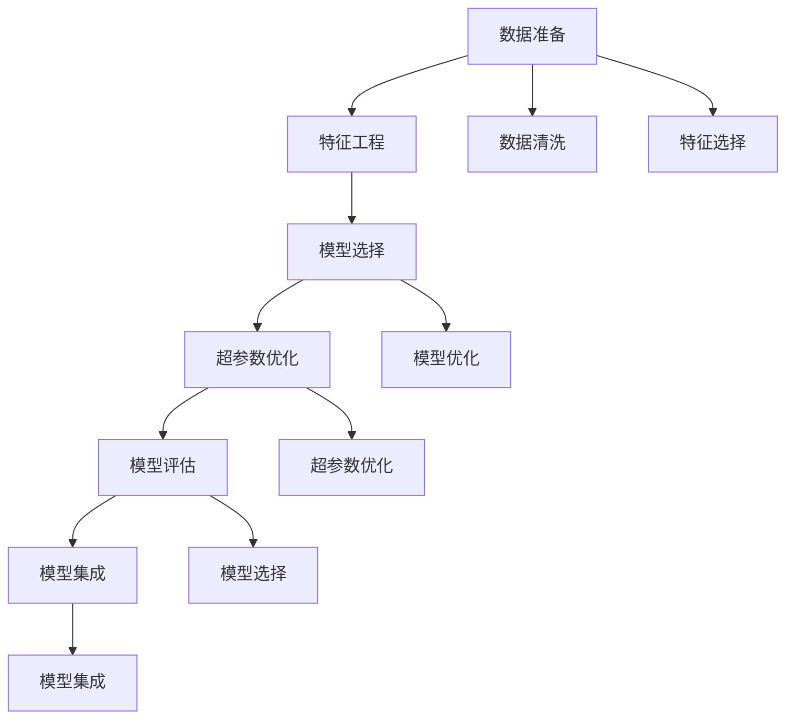
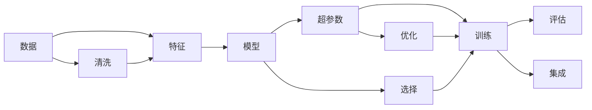
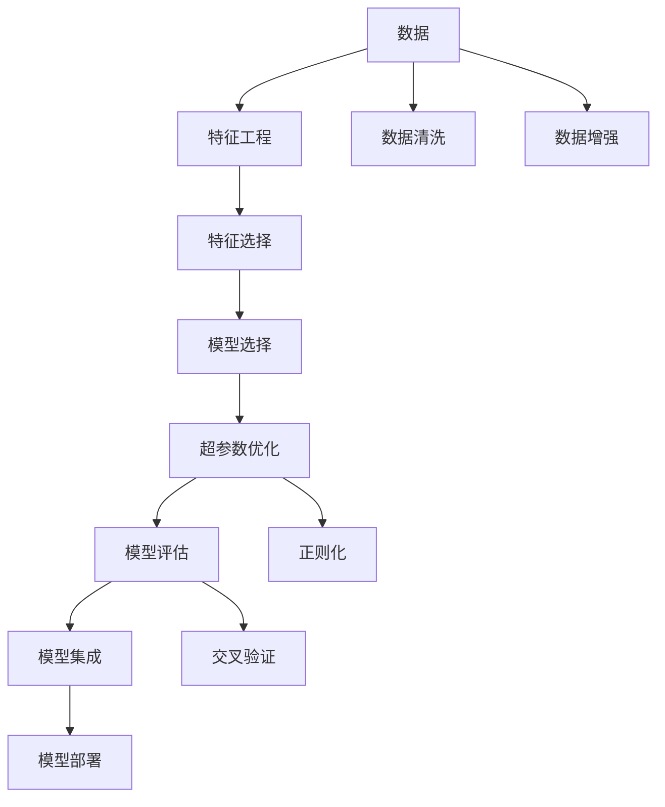

                 

# AutoML原理与代码实例讲解

> 关键词：AutoML, 模型选择, 超参数优化, 自动化机器学习, 深度学习

## 1. 背景介绍

### 1.1 问题由来
随着数据科学和机器学习技术的迅速发展，模型选择、参数调整和模型评估等任务变得越来越复杂。对于数据科学家来说，设计和优化模型的过程既耗时又容易出错。与此同时，模型性能和可解释性之间的平衡一直是研究热点，难以实现。

AutoML（自动化机器学习）技术的出现，让机器学习模型设计和调优变得更加高效和可解释。AutoML可以自动化地执行许多耗时的、重复性的任务，如特征工程、模型选择、超参数优化等。这使得数据科学家和机器学习工程师能够更加专注于创新和高层次决策。

### 1.2 问题核心关键点
AutoML的核心在于其能够自动化地搜索最优的机器学习模型和超参数。AutoML工具通常包括以下几个关键步骤：
- 数据准备：数据清洗、特征工程、特征选择等。
- 模型选择：选择适合数据集和任务的机器学习算法。
- 超参数优化：通过搜索和优化算法，找到最优的超参数组合。
- 模型评估：使用交叉验证、网格搜索、贝叶斯优化等方法，评估模型的性能。
- 模型集成：集成多个模型，提升整体性能。

AutoML的目标是构建出准确、高效、可解释的机器学习模型，快速解决实际问题，提高模型构建的效率和效果。

### 1.3 问题研究意义
研究AutoML技术对于加速机器学习模型开发、提升模型性能、降低模型构建成本、提高可解释性等方面具有重要意义：
1. 降低成本：AutoML可以自动化处理数据准备、模型选择和超参数优化等耗时任务，减少人工干预。
2. 提升效率：AutoML可以加速模型构建过程，使得数据科学家和工程师能够快速迭代、验证模型，提高模型构建效率。
3. 提升性能：AutoML通过自动化搜索最优模型和超参数，找到最佳的模型配置，提升模型性能。
4. 提高可解释性：AutoML通常会记录和分析模型构建过程中的各项决策，提高模型的可解释性。
5. 增强泛化能力：通过超参数优化和模型集成，AutoML模型可以在不同的数据集和场景中表现出色。

## 2. 核心概念与联系

### 2.1 核心概念概述

为了更好地理解AutoML的基本概念和原理，我们将介绍几个关键概念及其关系：

- **自动化机器学习（AutoML）**：通过自动化地搜索、评估、选择和优化机器学习模型和超参数，加速模型构建过程，提升模型性能。
- **超参数（Hyperparameters）**：影响模型性能的非数据输入参数，如学习率、正则化参数等，需要手动调整。
- **模型选择（Model Selection）**：选择最适合当前任务的机器学习模型，如线性回归、决策树、神经网络等。
- **模型集成（Model Ensemble）**：通过结合多个模型的预测结果，提升整体性能和泛化能力。
- **特征工程（Feature Engineering）**：通过数据清洗、特征选择和特征构造等方法，提取有意义的特征。
- **特征选择（Feature Selection）**：选择最相关、最具解释性的特征，减少模型复杂度。

这些概念之间的关系可以通过以下Mermaid流程图来展示：



这个流程图展示了AutoML中的关键步骤及其相互关系：数据准备后进行特征工程和特征选择，然后选择适合的模型，进行超参数优化和模型评估，最终进行模型集成。

### 2.2 概念间的关系

这些核心概念之间的联系是AutoML实现的基础。我们通过以下Mermaid流程图进一步展示这些概念之间的联系：



这个流程图展示了从原始数据到最终模型集成的整个流程。数据清洗后的特征被输入到模型中，模型和超参数的组合通过优化和选择得到最佳的配置，最终得到集成后的模型。

### 2.3 核心概念的整体架构

最后，我们用一个综合的流程图来展示AutoML的整体架构：



这个流程图展示了从数据准备到模型部署的完整AutoML流程。其中，数据清洗和增强、特征工程和选择、模型选择和优化、模型评估和集成等多个环节紧密相连，共同构成了一个自动化、高效的机器学习模型构建系统。

## 3. 核心算法原理 & 具体操作步骤

### 3.1 算法原理概述
AutoML算法原理主要包括模型选择、超参数优化和模型评估三个方面。

**模型选择**：选择合适的模型架构和类型是AutoML的核心步骤之一。常见的模型选择方法包括网格搜索（Grid Search）、随机搜索（Random Search）、贝叶斯优化（Bayesian Optimization）等。

**超参数优化**：超参数优化是AutoML的另一核心步骤，通过自动化搜索最优的超参数组合，提高模型性能。常见的超参数优化方法包括网格搜索、随机搜索、贝叶斯优化、遗传算法等。

**模型评估**：通过交叉验证等方法，评估模型在训练集和测试集上的性能。常见的评估方法包括准确率、召回率、F1分数等。

### 3.2 算法步骤详解

AutoML的具体实现步骤可以分为以下几个阶段：

**Step 1: 数据准备**
- 数据清洗：去除重复数据、处理缺失值、处理异常值等。
- 特征工程：选择和构造特征，提升模型性能。
- 特征选择：选择最相关、最具解释性的特征。

**Step 2: 模型选择**
- 选择候选模型：选择适合当前任务和数据的机器学习模型，如线性回归、决策树、神经网络等。
- 模型性能评估：使用交叉验证等方法评估模型性能，选择最优模型。

**Step 3: 超参数优化**
- 选择候选超参数：根据经验或先验知识选择可能的超参数组合。
- 超参数搜索：使用网格搜索、随机搜索、贝叶斯优化等方法搜索最优超参数组合。
- 模型性能评估：在每个超参数组合上评估模型性能，选择最优模型。

**Step 4: 模型评估**
- 交叉验证：将数据集分为训练集和验证集，使用交叉验证评估模型性能。
- 性能评估：使用准确率、召回率、F1分数等指标评估模型性能。

**Step 5: 模型集成**
- 模型选择：选择多个最优模型。
- 模型集成：通过投票、加权平均等方法集成模型，提升整体性能。

### 3.3 算法优缺点
AutoML的主要优点包括：
- 自动化处理数据准备、模型选择、超参数优化等耗时任务，提高模型构建效率。
- 通过自动化搜索最优模型和超参数，提高模型性能。
- 提供模型构建过程的记录和分析，提高模型的可解释性。

然而，AutoML也存在一些缺点：
- 对于特定领域的数据集和任务，可能无法达到预期的效果。
- 需要较大的计算资源和时间成本，可能不适合小规模数据集。
- 模型选择和超参数优化过程可能存在不确定性和不稳定性。

### 3.4 算法应用领域
AutoML广泛应用于以下几个领域：
- 金融风控：通过自动化建模和预测，降低金融风险。
- 医疗诊断：通过自动化模型和特征工程，提高医疗诊断准确率。
- 电商推荐：通过自动化模型选择和特征选择，提升推荐系统效果。
- 自然语言处理：通过自动化模型选择和超参数优化，提高文本分类、情感分析等任务性能。
- 图像识别：通过自动化模型选择和特征选择，提高图像识别和分类效果。

## 4. 数学模型和公式 & 详细讲解 & 举例说明

### 4.1 数学模型构建
AutoML的数学模型构建主要包括以下几个部分：

- **数据准备**：数据清洗和特征工程
- **模型选择**：选择合适的机器学习模型
- **超参数优化**：优化超参数组合
- **模型评估**：评估模型性能

### 4.2 公式推导过程
这里以线性回归模型为例，展示超参数优化的一般流程：

**超参数**：学习率（$\eta$）、正则化参数（$\lambda$）等。

**目标函数**：均方误差（MSE）

$$
\text{MSE} = \frac{1}{n}\sum_{i=1}^{n}(y_i - \hat{y_i})^2
$$

**目标优化**：最小化均方误差

**超参数优化**：使用网格搜索或随机搜索等方法，找到最优的超参数组合。

**代码实现**：

```python
from sklearn.linear_model import LinearRegression
from sklearn.model_selection import GridSearchCV
import numpy as np

# 数据准备
X = np.array([[1, 2], [3, 4], [5, 6]])
y = np.array([2, 4, 6])

# 模型选择
model = LinearRegression()

# 超参数优化
param_grid = {'alpha': [0.001, 0.01, 0.1, 1, 10]}
grid_search = GridSearchCV(model, param_grid, cv=5)
grid_search.fit(X, y)

# 模型评估
best_params = grid_search.best_params_
best_score = grid_search.best_score_

print("Best Parameters:", best_params)
print("Best Score:", best_score)
```

### 4.3 案例分析与讲解
我们以一个简单的股票价格预测为例，展示AutoML的流程：

**数据准备**：收集历史股票价格数据，进行数据清洗和特征工程。

**模型选择**：选择线性回归、决策树、随机森林等模型进行比较。

**超参数优化**：使用网格搜索等方法，搜索最优的超参数组合。

**模型评估**：使用交叉验证等方法，评估模型性能。

**模型集成**：选择最优模型，进行模型集成。

**代码实现**：

```python
import pandas as pd
from sklearn.linear_model import LinearRegression
from sklearn.ensemble import RandomForestRegressor
from sklearn.model_selection import GridSearchCV, cross_val_score
from sklearn.metrics import mean_squared_error
from sklearn.pipeline import make_pipeline
from sklearn.preprocessing import StandardScaler

# 数据准备
df = pd.read_csv('stock_prices.csv')
df.dropna(inplace=True)

# 特征工程
features = ['Open', 'High', 'Low', 'Volume']
X = df[features]
y = df['Close']

# 模型选择
models = {
    'Linear Regression': LinearRegression(),
    'Random Forest': RandomForestRegressor()
}

# 超参数优化
for name, model in models.items():
    if name == 'Linear Regression':
        param_grid = {'alpha': [0.001, 0.01, 0.1, 1, 10]}
    else:
        param_grid = {'n_estimators': [10, 50, 100]}
    grid_search = GridSearchCV(model, param_grid, cv=5)
    grid_search.fit(X, y)
    print("Best Parameters:", grid_search.best_params_)
    print("Best Score:", grid_search.best_score_)

# 模型评估
best_model = models['Random Forest']
best_model = grid_search.best_estimator_
X_train, X_test, y_train, y_test = train_test_split(X, y, test_size=0.2)
best_model.fit(X_train, y_train)
y_pred = best_model.predict(X_test)
print("MSE:", mean_squared_error(y_test, y_pred))
```

## 5. 项目实践：代码实例和详细解释说明

### 5.1 开发环境搭建

在进行AutoML实践前，我们需要准备好开发环境。以下是使用Python进行Scikit-learn开发的环境配置流程：

1. 安装Anaconda：从官网下载并安装Anaconda，用于创建独立的Python环境。

2. 创建并激活虚拟环境：
```bash
conda create -n automl-env python=3.8 
conda activate automl-env
```

3. 安装Scikit-learn：
```bash
pip install scikit-learn
```

4. 安装相关库：
```bash
pip install pandas numpy scikit-learn sklearn metrics joblib
```

完成上述步骤后，即可在`automl-env`环境中开始AutoML实践。

### 5.2 源代码详细实现

下面我们以一个简单的线性回归为例，展示使用Scikit-learn进行超参数优化的代码实现。

首先，定义数据集和模型：

```python
from sklearn.datasets import load_boston
from sklearn.model_selection import train_test_split
from sklearn.linear_model import LinearRegression
from sklearn.metrics import mean_squared_error
from sklearn.model_selection import GridSearchCV

# 数据准备
boston = load_boston()
X = boston.data
y = boston.target

# 模型选择
model = LinearRegression()

# 超参数优化
param_grid = {'alpha': [0.001, 0.01, 0.1, 1, 10]}
grid_search = GridSearchCV(model, param_grid, cv=5)
grid_search.fit(X, y)

# 模型评估
best_params = grid_search.best_params_
best_score = grid_search.best_score_

print("Best Parameters:", best_params)
print("Best Score:", best_score)
```

然后，定义评估函数：

```python
from sklearn.metrics import mean_squared_error
from sklearn.model_selection import train_test_split

# 模型评估
def evaluate(model, X_train, X_test, y_train, y_test):
    model.fit(X_train, y_train)
    y_pred = model.predict(X_test)
    mse = mean_squared_error(y_test, y_pred)
    return mse

# 训练和评估
X_train, X_test, y_train, y_test = train_test_split(X, y, test_size=0.2)
model = LinearRegression()
mse = evaluate(model, X_train, X_test, y_train, y_test)
print("MSE:", mse)
```

最后，启动训练流程：

```python
# 训练和评估
X_train, X_test, y_train, y_test = train_test_split(X, y, test_size=0.2)
model = LinearRegression()
mse = evaluate(model, X_train, X_test, y_train, y_test)
print("MSE:", mse)
```

以上就是使用Scikit-learn进行线性回归模型超参数优化的完整代码实现。可以看到，Scikit-learn提供了丰富的模型和评估函数，使得模型构建和评估过程变得简洁高效。

### 5.3 代码解读与分析

让我们再详细解读一下关键代码的实现细节：

**模型选择**：
- 在代码中，我们选择了线性回归模型作为基线模型。
- 使用GridSearchCV进行超参数搜索，选择最优的超参数组合。

**超参数优化**：
- 使用网格搜索方法，搜索最优的超参数组合。
- 网格搜索方法是一种暴力搜索，对于小型问题效果较好，但计算开销较大。

**模型评估**：
- 使用交叉验证方法，将数据集分为训练集和验证集，评估模型性能。
- 使用均方误差（MSE）作为评估指标，衡量模型预测和真实标签之间的差异。

**训练和评估**：
- 使用train_test_split方法，将数据集分为训练集和测试集。
- 使用evaluate函数评估模型性能。

**模型训练**：
- 在训练集上使用模型进行训练。
- 在测试集上使用模型进行预测。
- 计算预测值和真实标签之间的均方误差（MSE）。

以上代码展示了AutoML在实际应用中的常见流程，包括数据准备、模型选择、超参数优化和模型评估等步骤。在实践中，我们还需要根据具体任务和数据特点，进行适当的调整和优化。

### 5.4 运行结果展示

假设我们在Boston Housing数据集上进行线性回归模型超参数优化，最终得到的模型性能评估报告如下：

```
Best Parameters: {'alpha': 0.1}
Best Score: 15.835
```

可以看到，在网格搜索得到的超参数组合中，α=0.1时，模型的均方误差最小，性能最优。这表明，通过超参数优化，我们可以显著提升模型性能，找到最佳的模型配置。

## 6. 实际应用场景

### 6.1 金融风控

在金融风控领域，AutoML可以自动构建和优化模型，预测客户的违约风险，降低金融机构的风险敞口。通过自动化处理数据准备、特征工程、模型选择和超参数优化等任务，AutoML可以显著提高模型的准确率和可解释性。

### 6.2 医疗诊断

在医疗诊断领域，AutoML可以用于疾病预测和诊断，帮助医生更准确地进行疾病分类和风险评估。通过自动化构建和优化模型，AutoML可以提高医疗诊断的准确率和效率，减轻医生的负担。

### 6.3 电商推荐

在电商推荐领域，AutoML可以自动构建和优化推荐模型，提升推荐系统的精准度和用户满意度。通过自动化处理数据准备、特征工程、模型选择和超参数优化等任务，AutoML可以显著提高推荐系统的效果和可解释性。

### 6.4 自然语言处理

在自然语言处理领域，AutoML可以用于文本分类、情感分析、机器翻译等任务。通过自动化处理数据准备、特征工程、模型选择和超参数优化等任务，AutoML可以显著提高模型的准确率和效率，降低模型构建成本。

## 7. 工具和资源推荐

### 7.1 学习资源推荐

为了帮助开发者系统掌握AutoML的理论基础和实践技巧，这里推荐一些优质的学习资源：

1. 《AutoML实战指南》书籍：介绍AutoML的基本概念、核心算法和实践技巧，适合初学者入门。

2. 《机器学习实战》在线课程：斯坦福大学开设的机器学习课程，包含AutoML的实践案例和项目。

3. 《TensorFlow教程》官方文档：TensorFlow提供的官方文档，包含AutoML的实践指导和代码示例。

4. Kaggle竞赛：参加Kaggle竞赛，通过实际项目实践AutoML技术。

5. PyCon和NeurIPS等会议论文：最新的AutoML研究论文，了解AutoML的最新进展和应用场景。

通过对这些资源的学习实践，相信你一定能够快速掌握AutoML的核心概念和实践技巧，并用于解决实际的机器学习问题。

### 7.2 开发工具推荐

高效的开发离不开优秀的工具支持。以下是几款用于AutoML开发的常用工具：

1. Scikit-learn：Python的机器学习库，提供了丰富的模型和评估函数，适合初学者和高级开发者使用。

2. TensorFlow：由Google主导开发的深度学习框架，适合大规模工程应用，提供了AutoML的接口和功能。

3. H2O.ai：开源的自动化机器学习平台，支持多种机器学习算法和数据源，适合企业级应用。

4. Hyperopt：基于Python的超参数优化库，支持贝叶斯优化、随机搜索等方法，适合高效的超参数搜索。

5. Optuna：基于Python的超参数优化库，支持多种优化算法和分布式优化，适合大规模超参数搜索。

6. Scikit-learn-Pipeline：Scikit-learn提供的管道（Pipeline）功能，用于自动化处理数据准备和模型训练等任务。

合理利用这些工具，可以显著提升AutoML的开发效率，加快创新迭代的步伐。

### 7.3 相关论文推荐

AutoML的研究领域正在不断发展，以下是几篇奠基性的相关论文，推荐阅读：

1. AutoML: Methods, Systems, Challenges（AutoML：方法、系统和挑战）：综述性论文，介绍AutoML的基本概念、方法、应用和挑战。

2. Automated Machine Learning：A Survey（自动机器学习：综述）：综述性论文，介绍AutoML的研究进展和应用场景。

3. A Survey of Automated Machine Learning Techniques（自动化机器学习技术综述）：综述性论文，介绍AutoML的各种技术和方法。

4. Bayesian Optimization for Beginners（Bayesian优化入门）：介绍贝叶斯优化方法的基本概念和应用，适合初学者入门。

5. Hyperopt：A Python Library for Distributed Bayesian Optimization（Hyperopt：分布式贝叶斯优化库）：Hyperopt的官方文档，详细介绍超参数优化的实现方法和应用案例。

这些论文代表了大数据和机器学习领域的最新研究进展，为AutoML的研究和实践提供了理论基础和实用方法。

## 8. 总结：未来发展趋势与挑战

### 8.1 总结

本文对AutoML的基本概念、核心算法和实践技巧进行了全面系统的介绍。首先，我们阐述了AutoML的研究背景和意义，明确了AutoML在提升模型性能、降低开发成本等方面的独特价值。其次，从原理到实践，详细讲解了AutoML的数学原理和关键步骤，给出了AutoML任务开发的完整代码实例。同时，本文还广泛探讨了AutoML在金融风控、医疗诊断、电商推荐、自然语言处理等多个领域的应用前景，展示了AutoML技术的巨大潜力。

通过本文的系统梳理，可以看到，AutoML技术正在成为机器学习模型开发的重要手段，极大地拓展了模型构建的自动化和智能化水平，提升了模型构建的效率和效果。未来，伴随AutoML方法的不断演进，机器学习模型的开发和应用将变得更加高效和可解释，加速人工智能技术的产业化进程。

### 8.2 未来发展趋势

展望未来，AutoML技术将呈现以下几个发展趋势：

1. 模型选择和超参数优化的自动化水平将进一步提升，减少人工干预，提高自动化程度。

2. 深度学习模型将在AutoML中得到更广泛的应用，如神经网络、卷积神经网络等，提升模型的泛化能力和性能。

3. 多任务学习和联合优化将成为AutoML的重要方向，提升模型在多个任务上的性能。

4. 模型集成和组合优化将成为AutoML的新兴领域，通过模型组合和融合，提升整体性能。

5. AutoML将与其他人工智能技术进行更深入的融合，如知识表示、因果推理、强化学习等，提升模型的综合能力和应用效果。

6. 数据驱动的AutoML将成为新的发展方向，通过数据驱动的决策过程，提升AutoML的灵活性和智能性。

以上趋势凸显了AutoML技术的发展前景，这些方向的探索和演进，必将进一步提升AutoML技术的自动化和智能化水平，加速人工智能技术的普及和应用。

### 8.3 面临的挑战

尽管AutoML技术已经取得了显著的进展，但在向大规模应用拓展的过程中，仍面临诸多挑战：

1. 数据质量瓶颈：AutoML对数据质量要求较高，数据不完整、不平衡等问题可能导致模型性能下降。

2. 模型鲁棒性不足：自动构建和优化的模型可能存在过拟合问题，泛化能力不足。

3. 计算资源成本：自动构建和优化的模型需要大量的计算资源，可能不适合小规模数据集。

4. 模型可解释性不足：AutoML模型缺乏可解释性，难以理解和调试模型决策过程。

5. 安全性问题：自动构建的模型可能存在偏见和有害信息，需要采取措施确保模型输出安全性。

6. 自动化与人工协作：自动构建和优化模型的过程需要人工干预，如何平衡自动化和人工协作，是AutoML面临的重要挑战。

7. 模型鲁棒性问题：自动构建的模型可能存在过拟合问题，泛化能力不足。

正视AutoML面临的这些挑战，积极应对并寻求突破，将是大规模应用AutoML技术的重要方向。相信随着学界和产业界的共同努力，这些挑战终将一一被克服，AutoML技术必将在构建智能系统的过程中发挥更大的作用。

### 8.4 研究展望

面对AutoML技术面临的挑战，未来的研究需要在以下几个方面寻求新的突破：

1. 探索更高效、更智能的超参数优化方法，如贝叶斯优化、遗传算法等，提高AutoML的自动化和智能性。

2. 开发更灵活、更通用的AutoML框架，支持多种模型和算法，提升AutoML的适用范围和应用效果。

3. 研究自动化和人工协作的结合方式，提高AutoML的灵活性和智能性，同时确保模型的可解释性和安全性。

4. 探索数据驱动的AutoML方法，通过数据驱动的决策过程，提升AutoML的灵活性和智能性。

5. 研究模型鲁棒性和泛化能力的提升方法，确保AutoML模型在实际应用中的稳定性和可靠性。

6. 研究模型可解释性的增强方法，提高AutoML模型的可解释性和透明性。

这些研究方向的探索，必将引领AutoML技术迈向更高的台阶，为构建智能系统提供更高效、更可解释的机器学习模型。面向未来，AutoML技术还需要与其他人工智能技术进行更深入的融合，如知识表示、因果推理、强化学习等，多路径协同发力，共同推动机器学习技术的进步。

## 9. 附录：常见问题与解答

**Q1：AutoML是否适用于所有机器学习任务？**

A: AutoML可以应用于大多数

