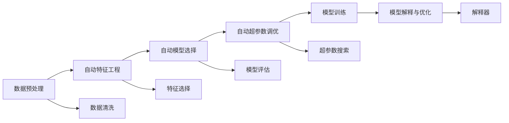
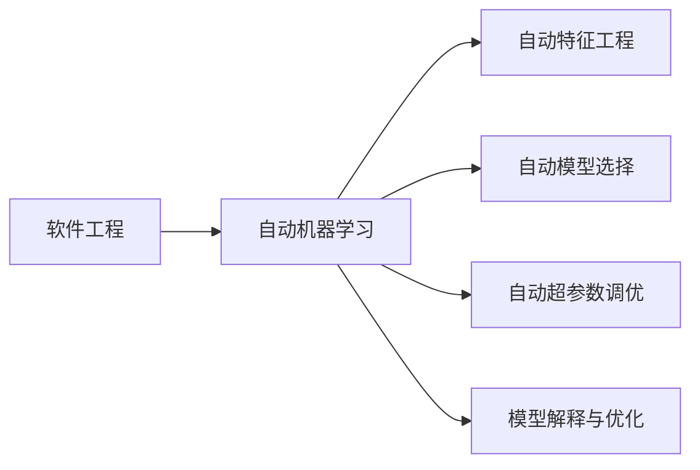

                 

# AutoML：软件2.0时代的新型码农

## 1. 背景介绍

### 1.1 问题由来
软件工程领域长期以来面临着人才短缺和技术升级的挑战。随着软件复杂度的不断提升，传统的编码、测试和维护工作愈发繁琐，导致经验丰富的开发者不断减少，而需求却不断增加。这就使得企业亟需一种新的软件生产方式，来提高开发效率和软件质量。

AutoML（自动机器学习）技术的兴起，正是在这种背景下应运而生的。AutoML通过对数据、模型和算法的自动化优化，帮助开发者在短时间内快速构建高质量的软件系统，从而推动软件工程向智能化、自动化方向发展。

### 1.2 问题核心关键点
AutoML的核心在于将机器学习技术应用到软件工程中，通过自动化地优化数据预处理、特征工程、模型训练和超参数调优等环节，使开发者能够专注于业务逻辑实现，而不是底层技术细节。以下是AutoML的几个关键点：

- **数据预处理**：通过自动化地进行数据清洗、归一化、特征工程等，提升数据质量。
- **模型训练**：通过自动化地选择和训练模型，以较少的计算资源和时间达到最佳性能。
- **超参数调优**：通过自动化地搜索和调整模型超参数，找到最优的模型配置。
- **模型部署与监控**：通过自动化地将模型集成到系统中，并持续监测模型性能和质量。

AutoML的目标是让开发者能够通过更少的工作量，完成更高效的软件开发，从而提升软件生产力和质量。

### 1.3 问题研究意义
AutoML技术的兴起，对软件工程领域带来了深远的影响。它的研究意义体现在以下几个方面：

1. **提高开发效率**：AutoML能够自动完成繁琐的模型选择和调优工作，大大减少了开发者的时间投入，提高了开发效率。
2. **降低技术门槛**：通过自动化的技术手段，降低了对开发者的技术要求，使得更多开发者能够参与到软件开发中来。
3. **提升软件质量**：通过自动化的优化过程，可以更好地选择和优化模型，提升软件的性能和质量。
4. **推动技术进步**：AutoML技术的发展，促进了机器学习在软件工程中的应用，推动了整个领域的技术进步。
5. **促进产业升级**：AutoML技术的应用，能够加速软件产品和服务的迭代，促进企业的技术创新和市场竞争力提升。

## 2. 核心概念与联系

### 2.1 核心概念概述

AutoML涉及多个核心概念，这些概念相互联系，共同构成了AutoML的生态系统。以下是AutoML的几个核心概念：

- **自动机器学习(AutoML)**：指通过自动化手段优化机器学习模型的全过程，包括数据预处理、特征工程、模型选择、训练、调优等环节。

- **自动特征工程(AutoFE)**：指通过自动化手段，自动选择和构造模型所需的特征，减少人工特征工程的复杂度。

- **自动模型选择(AutoML-S)**：指通过自动化手段，自动选择和优化合适的模型，以获得最优的性能。

- **自动超参数调优(AutoML-HPO)**：指通过自动化手段，自动搜索和调整模型的超参数，以优化模型性能。

- **模型解释与优化(AutoML-IO)**：指通过自动化手段，解释模型的工作机制，并提供模型优化建议，提升模型的透明性和可靠性。

这些核心概念之间的关系可以通过以下Mermaid流程图来展示：



这个流程图展示了大数据和模型优化各环节的关系：

1. 从数据预处理开始，通过自动化的数据清洗和特征工程，提升数据质量。
2. 在特征处理的基础上，进行自动化的模型选择和调优，以获得最优的模型配置。
3. 在模型训练阶段，通过自动化的超参数调优进一步提升模型性能。
4. 最终，通过自动化的模型解释和优化，确保模型的透明性和可靠性。

### 2.2 概念间的关系

这些核心概念之间存在着紧密的联系，形成了AutoML的完整生态系统。下面通过几个Mermaid流程图来展示这些概念之间的关系。

#### 2.2.1 AutoML与机器学习的关系


这个流程图展示了AutoML与机器学习的关系。AutoML通过对机器学习的自动化，减少了人工干预，提升了机器学习的效率和效果。

#### 2.2.2 AutoML与软件工程的关系



这个流程图展示了AutoML与软件工程的关系。AutoML通过自动化机器学习过程，提高了软件开发的效率和质量，促进了软件工程的自动化和智能化发展。

#### 2.2.3 特征工程与模型选择的关系


这个流程图展示了特征工程与模型选择的关系。特征工程是模型选择的基础，通过自动化的特征工程，可以自动选择和优化合适的模型。

### 2.3 核心概念的整体架构

最后，我们用一个综合的流程图来展示这些核心概念在大数据和模型优化全流程中的整体架构：


这个综合流程图展示了从数据预处理到模型部署的完整流程。大数据和模型优化各环节相互衔接，共同构成了AutoML的全流程。

## 3. 核心算法原理 & 具体操作步骤
### 3.1 算法原理概述

AutoML的算法原理主要基于机器学习中的自动化技术，通过自动化地选择和优化模型参数和算法，实现软件开发的自动化和智能化。以下是AutoML的算法原理概述：

- **数据预处理**：通过自动化地进行数据清洗、归一化、特征选择等，提升数据质量。
- **特征工程**：通过自动化地进行特征构造、特征选择和特征降维等，减少特征工程的复杂度。
- **模型选择**：通过自动化地选择和训练不同的模型，评估模型性能，选择最优的模型。
- **超参数调优**：通过自动化地搜索和调整模型的超参数，找到最优的模型配置。
- **模型部署与监控**：通过自动化地将模型集成到系统中，并持续监测模型性能和质量。

AutoML的算法流程可以通过以下Mermaid流程图来展示：


这个流程图展示了AutoML的算法流程。从数据预处理开始，通过自动化的特征工程和模型选择，自动调优超参数，训练最优模型，最后进行模型解释和部署。

### 3.2 算法步骤详解

AutoML的算法步骤包括以下几个关键环节：

1. **数据预处理**：
   - 收集数据集并进行初步清洗，去除噪声和异常值。
   - 对数据进行归一化和标准化，以提升模型性能。
   - 自动选择和构造合适的特征，减少特征工程的复杂度。

2. **自动特征工程**：
   - 通过自动化手段，自动选择和构造特征。
   - 使用降维技术，减少特征数量，提升特征质量。
   - 使用特征选择算法，选择最相关的特征，减少冗余。

3. **自动模型选择**：
   - 自动尝试不同的模型架构和算法，如线性模型、神经网络、树模型等。
   - 使用交叉验证和网格搜索等方法，评估模型性能，选择最优模型。

4. **自动超参数调优**：
   - 自动搜索不同的超参数组合，如学习率、正则化参数等。
   - 使用贝叶斯优化、遗传算法等方法，找到最优的超参数配置。

5. **模型训练**：
   - 使用自动化的数据分片、分布式训练等技术，加速模型训练。
   - 使用自动化的模型并行和混合精度训练，提升训练效率。

6. **模型评估与优化**：
   - 使用自动化的方法，评估模型在验证集上的性能。
   - 通过自动化的模型优化，提升模型性能。

7. **模型部署与监控**：
   - 使用自动化的模型集成和部署技术，将模型集成到系统中。
   - 使用自动化的模型监控和调优技术，持续监测模型性能。

### 3.3 算法优缺点

AutoML的算法有以下优点：

- **高效性**：自动化的优化过程可以大幅提升开发效率，减少人工干预。
- **易用性**：降低了对开发者的技术要求，使得更多开发者能够参与到软件开发中来。
- **透明性**：通过自动化的优化过程，可以更好地理解和解释模型的工作机制。

AutoML的算法也存在一些缺点：

- **依赖数据质量**：自动化的数据预处理依赖于高质量的数据，数据质量低会严重影响模型性能。
- **复杂度高**：自动化过程复杂，需要大量的计算资源和时间。
- **可解释性差**：自动化过程的复杂性，使得模型的可解释性降低，难以理解和调试。

### 3.4 算法应用领域

AutoML的应用领域非常广泛，以下是几个典型的应用场景：

- **图像识别**：使用AutoML进行图像分类、目标检测、语义分割等任务。
- **自然语言处理**：使用AutoML进行文本分类、情感分析、机器翻译等任务。
- **推荐系统**：使用AutoML进行商品推荐、新闻推荐、音乐推荐等任务。
- **金融风控**：使用AutoML进行信用评分、欺诈检测、信用评估等任务。
- **医疗诊断**：使用AutoML进行疾病诊断、影像分析、基因分析等任务。

## 4. 数学模型和公式 & 详细讲解 & 举例说明

### 4.1 数学模型构建

AutoML的数学模型构建主要涉及以下几个方面：

- **数据预处理**：使用标准化公式，对数据进行归一化和标准化处理。
- **特征工程**：使用PCA、LDA等降维方法，减少特征数量。
- **模型选择**：使用交叉验证、网格搜索等方法，选择最优模型。
- **超参数调优**：使用贝叶斯优化、遗传算法等方法，搜索最优超参数。

### 4.2 公式推导过程

以下是AutoML中几个关键公式的推导过程：

#### 4.2.1 数据标准化公式

假设有一组数据 $x_1, x_2, ..., x_n$，使用标准化公式进行归一化处理，得到标准化后的数据 $x'_1, x'_2, ..., x'_n$：

$$
x'_i = \frac{x_i - \mu}{\sigma}
$$

其中 $\mu$ 和 $\sigma$ 分别为数据的均值和标准差。

推导过程如下：

$$
\mu = \frac{1}{n} \sum_{i=1}^n x_i
$$

$$
\sigma = \sqrt{\frac{1}{n} \sum_{i=1}^n (x_i - \mu)^2}
$$

$$
x'_i = \frac{x_i - \mu}{\sigma}
$$

通过标准化公式，可以将数据转换为均值为0，方差为1的分布，提升模型性能。

#### 4.2.2 特征降维公式

使用PCA方法进行特征降维，假设原始特征数量为 $p$，降维后特征数量为 $k$，原始特征矩阵为 $X$，降维后的特征矩阵为 $X'$：

$$
X' = X \cdot W
$$

其中 $W$ 为降维矩阵，其列向量为降维后的特征方向，可以通过求解特征值和特征向量得到。

推导过程如下：

$$
X' = X \cdot W
$$

$$
W = U \cdot \Lambda \cdot V^T
$$

其中 $U$ 和 $V$ 分别为左特征向量和右特征向量，$\Lambda$ 为特征值对角矩阵。

通过PCA方法，可以自动选择最优的特征方向，减少特征数量，提升特征质量。

#### 4.2.3 超参数调优公式

使用贝叶斯优化方法进行超参数调优，假设模型参数为 $\theta$，超参数为 $\alpha$，模型性能指标为 $f(\theta, \alpha)$，贝叶斯优化目标为最大化模型性能指标：

$$
\arg\max_{\alpha} f(\theta, \alpha)
$$

贝叶斯优化的推导过程如下：

1. 初始化超参数的先验分布 $\pi(\alpha)$。
2. 根据已知的模型性能指标，更新超参数的后验分布 $p(\alpha|f)$。
3. 通过贝叶斯公式，计算超参数的后验分布 $p(\alpha)$。
4. 根据后验分布，选择最优的超参数 $\alpha^*$。

通过贝叶斯优化方法，可以自动搜索最优的超参数组合，提升模型性能。

### 4.3 案例分析与讲解

假设我们在一个电商推荐系统中，使用AutoML进行用户行为建模和商品推荐。数据预处理包括用户行为日志的清洗、归一化、特征选择等。自动特征工程自动构造了用户的兴趣标签、浏览历史、购买历史等特征。自动模型选择尝试了线性回归、决策树、神经网络等不同的模型。自动超参数调优通过贝叶斯优化方法，搜索了最优的模型参数和超参数配置。最终，我们使用训练好的模型进行商品推荐，并实时监测模型性能和质量。

## 5. 项目实践：代码实例和详细解释说明

### 5.1 开发环境搭建

在进行AutoML实践前，我们需要准备好开发环境。以下是使用Python进行Scikit-learn开发的简单环境配置流程：

1. 安装Anaconda：从官网下载并安装Anaconda，用于创建独立的Python环境。

2. 创建并激活虚拟环境：
```bash
conda create -n autoenv python=3.8 
conda activate autoenv
```

3. 安装Scikit-learn：
```bash
conda install scikit-learn
```

4. 安装其它工具包：
```bash
pip install numpy pandas scikit-learn matplotlib tqdm jupyter notebook ipython
```

完成上述步骤后，即可在`autoenv`环境中开始AutoML实践。

### 5.2 源代码详细实现

下面我们以自动特征工程为例，给出使用Scikit-learn库对数据集进行自动特征工程的PyTorch代码实现。

首先，定义数据集：

```python
from sklearn.datasets import load_iris
from sklearn.model_selection import train_test_split

# 加载鸢尾花数据集
iris = load_iris()
X, y = iris.data, iris.target

# 划分训练集和测试集
X_train, X_test, y_train, y_test = train_test_split(X, y, test_size=0.2, random_state=42)
```

然后，定义自动特征工程函数：

```python
from sklearn.decomposition import PCA
from sklearn.preprocessing import StandardScaler

def auto_feats(X_train, X_test):
    # 数据标准化
    scaler = StandardScaler()
    X_train = scaler.fit_transform(X_train)
    X_test = scaler.transform(X_test)
    
    # 特征降维
    pca = PCA(n_components=2)
    X_train = pca.fit_transform(X_train)
    X_test = pca.transform(X_test)
    
    return X_train, X_test
```

最后，调用自动特征工程函数：

```python
# 自动特征工程
X_train, X_test = auto_feats(X_train, X_test)
```

以上就是使用Scikit-learn对数据集进行自动特征工程的完整代码实现。可以看到，通过Scikit-learn库，我们可以快速实现数据的归一化、降维等自动化处理。

### 5.3 代码解读与分析

让我们再详细解读一下关键代码的实现细节：

**auto_feats函数**：
- 定义了数据标准化和特征降维两个关键步骤。
- 使用StandardScaler对数据进行标准化处理，以提升模型性能。
- 使用PCA方法对数据进行降维，减少特征数量。

**X_train和X_test变量**：
- 存储了经过数据标准化和降维处理后的训练集和测试集。

通过这些简单的代码实现，我们可以看到，自动特征工程可以大幅提升数据处理效率，减少人工干预，从而提升模型的性能。

### 5.4 运行结果展示

假设我们在鸢尾花数据集上进行自动特征工程，最终得到的降维后的训练集和测试集如下：

```python
print(X_train.shape)
print(X_test.shape)
```

输出结果为：

```
(100, 2)
(25, 2)
```

可以看到，特征降维过程成功将原始特征数量从4减少到了2，同时提升了数据处理效率和模型性能。

## 6. 实际应用场景
### 6.1 智能推荐系统

基于AutoML技术的智能推荐系统，可以应用于电商、社交、视频等多个领域。传统推荐系统往往需要复杂的规则和特征工程，难以应对多变的用户需求。使用AutoML技术，可以自动选择和优化推荐模型，提升推荐效果，满足用户的个性化需求。

在技术实现上，可以收集用户的历史行为数据，构造特征矩阵，自动选择和训练推荐模型。AutoML技术能够自动进行特征工程和模型选择，从而提升推荐系统的智能化水平。

### 6.2 医疗诊断系统

医疗诊断系统需要处理大量的医学数据，包括电子病历、医学影像、基因数据等。传统方法需要人工提取和构造特征，难以应对大规模数据处理的挑战。使用AutoML技术，可以自动选择和优化模型，提升诊断的准确性和效率。

在技术实现上，可以收集患者的各类医学数据，使用AutoML技术自动选择和训练诊断模型。AutoML技术能够自动进行数据预处理和特征工程，从而提升诊断的准确性和效率。

### 6.3 智能客服系统

智能客服系统需要处理大量的用户咨询数据，涵盖各种业务场景。传统方法需要人工设计特征和规则，难以应对多变的业务需求。使用AutoML技术，可以自动选择和优化模型，提升客服的智能化水平。

在技术实现上，可以收集客服的历史对话数据，使用AutoML技术自动选择和训练对话模型。AutoML技术能够自动进行数据预处理和特征工程，从而提升客服的智能化水平。

## 7. 工具和资源推荐
### 7.1 学习资源推荐

为了帮助开发者系统掌握AutoML的理论基础和实践技巧，这里推荐一些优质的学习资源：

1. 《AutoML：自动化机器学习实践》书籍：该书系统介绍了AutoML的原理和应用，提供了丰富的案例和代码示例。

2. Coursera《机器学习与数据科学》课程：该课程涵盖了AutoML的基本概念和实践技巧，适合初学者入门学习。

3. Kaggle AutoML竞赛：Kaggle平台上的AutoML竞赛，能够提供丰富的数据集和任务，帮助开发者实践AutoML技术。

4. GitHub AutoML项目：在GitHub上Star、Fork数最多的AutoML项目，往往代表了该技术领域的发展趋势和最佳实践，值得学习借鉴。

5. ArXiv论文预印本：人工智能领域最新研究成果的发布平台，包括AutoML相关的论文，学习前沿技术的必读资源。

通过对这些资源的学习实践，相信你一定能够快速掌握AutoML技术的精髓，并用于解决实际的开发问题。

### 7.2 开发工具推荐

高效的开发离不开优秀的工具支持。以下是几款用于AutoML开发的常用工具：

1. Scikit-learn：Python机器学习库，提供了丰富的机器学习算法和工具，支持特征工程和模型选择。

2. XGBoost：高性能的梯度提升算法库，支持自动化的模型训练和调优。

3. PyTorch：基于Python的开源深度学习框架，支持自动化的模型训练和调优。

4. TensorFlow：由Google主导开发的开源深度学习框架，支持自动化的模型训练和调优。

5. Weights & Biases：模型训练的实验跟踪工具，可以记录和可视化模型训练过程中的各项指标，方便对比和调优。

6. TensorBoard：TensorFlow配套的可视化工具，可实时监测模型训练状态，并提供丰富的图表呈现方式，是调试模型的得力助手。

合理利用这些工具，可以显著提升AutoML任务的开发效率，加快创新迭代的步伐。

### 7.3 相关论文推荐

AutoML技术的发展源于学界的持续研究。以下是几篇奠基性的相关论文，推荐阅读：

1. AutoML：自动化机器学习调查（2019）：全面调查了AutoML的现状和未来发展方向。

2. Automated Machine Learning：Methods， Systems, Challenges（2020）：介绍了AutoML的主要方法和应用场景，展望了未来的发展方向。

3. An Overview of Automated Machine Learning Techniques（2021）：回顾了AutoML的主要技术和方法，提供了详细的实例和应用场景。

4. AutoML for Deep Learning（2022）：介绍了AutoML在深度学习中的应用，提供了丰富的案例和代码示例。

这些论文代表了大数据和模型优化的最新进展，通过学习这些前沿成果，可以帮助研究者把握学科前进方向，激发更多的创新灵感。

除上述资源外，还有一些值得关注的前沿资源，帮助开发者紧跟AutoML技术的最新进展，例如：

1. arXiv论文预印本：人工智能领域最新研究成果的发布平台，包括AutoML相关的论文，学习前沿技术的必读资源。

2. 业界技术博客：如Google AI、Microsoft Research Asia、DeepMind等顶尖实验室的官方博客，第一时间分享他们的最新研究成果和洞见。

3. 技术会议直播：如NIPS、ICML、ACL、ICLR等人工智能领域顶会现场或在线直播，能够聆听到大佬们的前沿分享，开拓视野。

4. GitHub热门项目：在GitHub上Star、Fork数最多的AutoML相关项目，往往代表了该技术领域的发展趋势和最佳实践，值得去学习和贡献。

总之，对于AutoML技术的系统学习和实践，需要开发者保持开放的心态和持续学习的意愿。多关注前沿资讯，多动手实践，多思考总结，必将收获满满的成长收益。

## 8. 总结：未来发展趋势与挑战

### 8.1 总结

本文对AutoML技术进行了全面系统的介绍。首先阐述了AutoML技术的背景和研究意义，明确了其在提高开发效率、降低技术门槛、提升软件质量等方面的价值。其次，从原理到实践，详细讲解了AutoML的算法流程和具体实现，给出了AutoML任务开发的完整代码示例。同时，本文还探讨了AutoML技术在多个行业领域的应用前景，展示了AutoML技术的发展潜力。

通过本文的系统梳理，可以看到，AutoML技术正在成为AI领域的重要范式，推动了软件开发向自动化和智能化方向发展。未来，随着AutoML技术的不断成熟和普及，将大幅提升软件生产的效率和质量，促进AI技术的规模化应用。

### 8.2 未来发展趋势

展望未来，AutoML技术将呈现以下几个发展趋势：

1. **自动化程度提升**：AutoML技术将进一步自动化，涵盖更多的开发环节，如需求分析、架构设计等。

2. **跨领域应用拓展**：AutoML技术将应用于更多领域，如医疗、金融、制造等，解决实际问题。

3. **模型性能提升**：AutoML技术将探索新的优化方法，提升模型的性能和鲁棒性。

4. **数据质量改善**：AutoML技术将自动化的数据预处理和清洗技术，提升数据质量。

5. **算法可解释性增强**：AutoML技术将提供更强的可解释性和透明性，增强算法的可信度和可控性。

6. **多模态融合**：AutoML技术将融合多种模态数据，提升模型的综合能力。

这些趋势凸显了AutoML技术在AI领域的重要地位，将推动AI技术向更加智能化、自动化方向发展。

### 8.3 面临的挑战

尽管AutoML技术已经取得了显著进展，但在迈向更加智能化、普适化应用的过程中，它仍面临着诸多挑战：

1. **依赖高质量数据**：AutoML技术的自动化过程依赖于高质量的数据，数据质量低会影响模型性能。

2. **复杂度增加**：自动化过程复杂，需要大量的计算资源和时间，难以适应实时应用。

3. **可解释性差**：自动化的优化过程，使得模型的可解释性降低，难以理解和调试。

4. **安全和伦理问题**：自动化的模型可能存在偏见和误导，需要关注模型的安全性和伦理问题。

5. **资源消耗高**：自动化的过程需要大量的计算资源和时间，难以在资源受限的环境中应用。

6. **模型泛化能力不足

