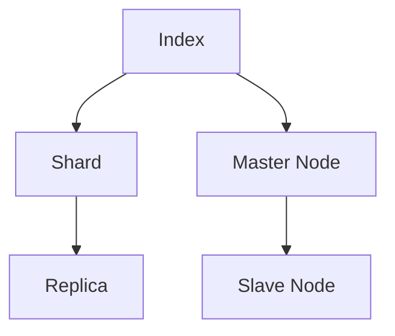
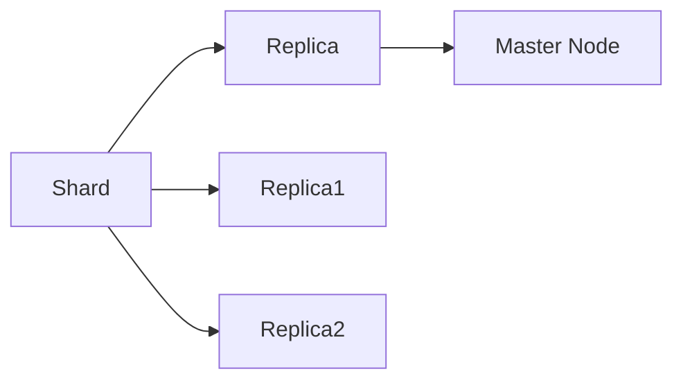
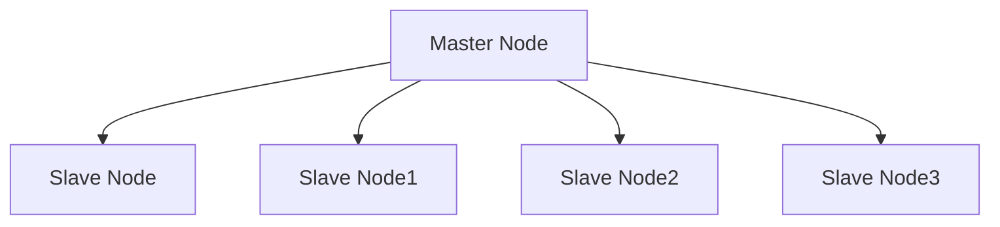
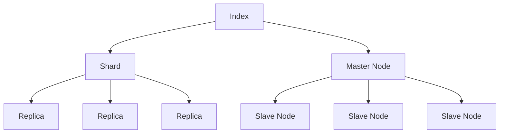

                 

# ElasticSearch Replica原理与代码实例讲解

> 关键词：ElasticSearch, 分布式系统, 数据备份, 主从复制, 高可用性, 数据一致性, 集群管理, RESTful API, 监控和调优

## 1. 背景介绍

### 1.1 问题由来
随着数据量的急剧增长和互联网应用的普及，单台服务器的存储和计算能力已远远无法满足需求。分布式系统应运而生，通过多台服务器的协同工作，提升系统的存储和计算能力，同时通过冗余备份，提升系统的可用性和可靠性。

ElasticSearch是一个流行的开源分布式搜索与分析引擎，被广泛应用于互联网公司如Netflix、Twitter、Airbnb等。ElasticSearch的Replica机制是其核心特性之一，通过主从复制机制，实现数据的冗余备份和自动故障转移，保障系统的可用性和数据一致性。

### 1.2 问题核心关键点
ElasticSearch Replica机制的核心关键点包括：

- 主从复制（Master-Slave Replication）：将数据自动备份到多个从节点（Slave Nodes），确保数据的冗余性和高可用性。
- 数据一致性（Data Consistency）：通过Shard和Replica之间的数据同步，保证不同节点上的数据一致性。
- 自动故障转移（Auto Failover）：当主节点出现故障时，自动选举新的主节点，保障系统服务连续性。
- 集群管理（Cluster Management）：通过RESTful API，方便地管理集群，调整节点配置和监控系统状态。

了解这些关键点对于掌握ElasticSearch Replica机制的原理和应用至关重要。

### 1.3 问题研究意义
ElasticSearch Replica机制对于构建高性能、高可用性的分布式系统具有重要意义：

1. 数据冗余：通过Replica机制，将数据备份到多个节点，避免单点故障导致的系统宕机。
2. 高可用性：主节点故障时，自动选举新的主节点，确保系统的连续性和可靠性。
3. 数据一致性：通过Shard和Replica之间的同步，保障数据在不同节点上的同步一致性。
4. 可扩展性：Replica机制支持系统动态扩容和缩容，方便根据业务需求调整系统容量。
5. 监控调优：提供详细的集群监控和调优功能，帮助开发者快速定位问题，优化系统性能。

## 2. 核心概念与联系

### 2.1 核心概念概述

为更好地理解ElasticSearch Replica机制，本节将介绍几个密切相关的核心概念：

- ElasticSearch：一个开源的分布式搜索与分析引擎，支持RESTful API，被广泛应用于各种数据驱动型应用。
- Shard：将一个大索引分割成多个Shard，每个Shard包含一部分数据，并分布在不同的节点上，提高系统的可扩展性。
- Replica：将Shard数据复制到多个节点上，形成冗余备份，保障系统的可用性和数据一致性。
- Master Node：负责集群管理和控制，包括节点的添加、删除、状态调整等。
- Slave Node：从Master Node复制数据，用于数据备份和负载均衡。

这些核心概念之间的逻辑关系可以通过以下Mermaid流程图来展示：



这个流程图展示了大索引被分割成多个Shard，Shard数据被复制到多个Replica上，同时由Master Node和Slave Node组成的集群管理机制。通过这些概念，我们可以更好地把握ElasticSearch Replica机制的架构和运作方式。

### 2.2 概念间的关系

这些核心概念之间存在着紧密的联系，形成了ElasticSearch Replica机制的完整生态系统。下面我们通过几个Mermaid流程图来展示这些概念之间的关系。

#### 2.2.1 Shard与Replica的关系



这个流程图展示了Shard数据被复制到多个Replica上的过程，同时由Master Node负责管理Replica。

#### 2.2.2 Master Node与Slave Node的关系



这个流程图展示了Master Node将Shard数据复制到多个Slave Node的过程，同时Slave Node从Master Node同步数据。

### 2.3 核心概念的整体架构

最后，我们用一个综合的流程图来展示这些核心概念在大索引环境下的整体架构：



这个综合流程图展示了从大索引到多个Shard，再到多个Replica的过程，同时由Master Node和Slave Node组成的集群管理机制。通过这些概念，我们可以更清晰地理解ElasticSearch Replica机制的运作流程。

## 3. 核心算法原理 & 具体操作步骤
### 3.1 算法原理概述

ElasticSearch Replica机制的核心思想是通过主从复制，实现数据的冗余备份和自动故障转移，保障系统的可用性和数据一致性。其核心算法原理如下：

1. 将大索引（Index）分割成多个Shard，每个Shard包含部分数据，并分布在不同的节点上。
2. 在每个Shard上，复制数据到多个Replica，形成冗余备份，增加系统的可靠性。
3. Master Node负责集群管理和控制，包括节点的添加、删除、状态调整等。
4. Slave Node从Master Node复制数据，并在数据一致性方面与Master Node保持同步。

### 3.2 算法步骤详解

ElasticSearch Replica机制的实现步骤如下：

1. 配置Index：定义Index的结构和配置，包括Shard数量、Replica数量、节点列表等。
2. 创建Shard：根据Index配置，将数据分割成多个Shard，并创建对应的Shard副本。
3. 分配Replica：将Shard数据复制到多个Replica节点上，形成冗余备份。
4. 选举Master Node：自动选举一个节点作为Master Node，负责集群管理和控制。
5. 同步数据：Master Node与Replica节点之间同步数据，保持数据一致性。
6. 监控和调优：通过RESTful API监控集群状态，调整节点配置和优化系统性能。

### 3.3 算法优缺点

ElasticSearch Replica机制具有以下优点：

- 数据冗余：通过Replica机制，将数据备份到多个节点，保障系统的可用性和数据一致性。
- 自动故障转移：主节点故障时，自动选举新的主节点，保障系统连续性。
- 集群管理：通过RESTful API，方便地管理集群，调整节点配置。
- 扩展性：支持系统动态扩容和缩容，方便根据业务需求调整系统容量。

同时，该机制也存在一些缺点：

- 资源消耗：Replica机制需要占用大量的存储和计算资源，增加了系统的成本。
- 复杂性：集群管理复杂，需要配置和监控多个节点，增加了系统的复杂度。
- 数据同步：Shard和Replica之间的数据同步可能存在延迟，影响系统性能。
- 单点问题：Master Node的故障可能导致系统部分不可用，需要采取措施提高Master Node的可靠性。

### 3.4 算法应用领域

ElasticSearch Replica机制广泛应用在各种数据驱动型应用中，如：

- 互联网搜索：通过分布式搜索与分析，提升搜索速度和准确性。
- 大数据分析：处理海量数据，进行实时分析和挖掘。
- 实时监控：监控系统状态，快速定位和解决问题。
- 日志存储：记录和分析系统日志，提高系统的可维护性和可追溯性。
- 金融交易：记录和查询交易数据，进行风险控制和决策分析。

除了上述这些经典应用外，ElasticSearch Replica机制还被创新性地应用到更多场景中，如医疗数据管理、物联网数据存储等，为不同行业带来新的解决方案。

## 4. 数学模型和公式 & 详细讲解 & 举例说明（备注：数学公式请使用latex格式，latex嵌入文中独立段落使用 $$，段落内使用 $)
### 4.1 数学模型构建

本节将使用数学语言对ElasticSearch Replica机制进行更加严格的刻画。

记Index为包含数据的索引，Shard为Index的子集，Replica为Shard的备份。假设Index的Shard数量为$n_s$，每个Shard包含$m$个数据块，Replica数量为$n_r$。定义Master Node为集群的管理节点， Slave Node为集群的数据备份节点。

Index的数学模型可以表示为：

$$
Index = \bigcup_{i=1}^{n_s} Shard_i
$$

Shard的数学模型可以表示为：

$$
Shard_i = \{D_{i,j}\}_{j=1}^m
$$

其中$D_{i,j}$为第$i$个Shard中的第$j$个数据块。

Replica的数学模型可以表示为：

$$
Replica_j = \bigcup_{i=1}^{n_s} Shard_i
$$

其中$Replica_j$为第$j$个Replica节点的数据备份。

Master Node与Slave Node之间的数据同步关系可以表示为：

$$
Replica_j \subseteq Index
$$

### 4.2 公式推导过程

以下我们以Shard与Replica的关系为例，推导数据同步的计算公式。

假设Master Node和Slave Node之间的数据同步延迟为$d$，Shard数据块传输速度为$s$，则从Master Node到Slave Node的数据同步时间为：

$$
T_{sync} = n_s \cdot m \cdot d / s
$$

由于数据块的传输速度$s$和同步延迟$d$通常较小，因此可以近似认为Shard与Replica之间的数据同步时间$T_{sync}$主要取决于Shard的数量$n_s$和数据块的大小$m$。

### 4.3 案例分析与讲解

假设我们有一个包含10000个数据块的Index，每个Shard包含1000个数据块，需要复制到3个Replica节点上。Master Node和Slave Node之间的数据同步延迟为1秒，数据块传输速度为1Mbps，则Shard与Replica之间的数据同步时间计算如下：

$$
T_{sync} = 100 \cdot 1000 \cdot 1 / 1,000,000 = 1 \text{秒}
$$

这意味着每个Shard的数据块需要1秒钟才能传输到所有Replica节点上。根据Master Node与Slave Node之间的同步延迟$d$和数据传输速度$s$，可以计算出系统整体的同步延迟和性能瓶颈。

## 5. 项目实践：代码实例和详细解释说明
### 5.1 开发环境搭建

在进行ElasticSearch Replica机制的实践前，我们需要准备好开发环境。以下是使用Python进行ElasticSearch开发的环境配置流程：

1. 安装Anaconda：从官网下载并安装Anaconda，用于创建独立的Python环境。

2. 创建并激活虚拟环境：
```bash
conda create -n elasticsearch-env python=3.8 
conda activate elasticsearch-env
```

3. 安装ElasticSearch：
```bash
pip install elasticsearch
```

4. 安装各类工具包：
```bash
pip install numpy pandas scikit-learn matplotlib tqdm jupyter notebook ipython
```

完成上述步骤后，即可在`elasticsearch-env`环境中开始ElasticSearch Replica机制的实践。

### 5.2 源代码详细实现

这里我们以ElasticSearch的官方文档为例，展示如何配置Index、创建Shard和Replica、选举Master Node并进行数据同步。

首先，创建一个Index，配置Shard和Replica数量：

```python
from elasticsearch import Elasticsearch

# 创建ElasticSearch客户端
es = Elasticsearch(['localhost:9200'])

# 创建Index，定义Shard和Replica数量
es.indices.create(index='my_index', params={'number_of_shards': 3, 'number_of_replicas': 1})
```

然后，创建Shard和Replica：

```python
# 在Index上创建Shard
es.indices.shards.get(index='my_index')
```

接着，选举Master Node：

```python
# 选举Master Node
es.cluster.health()
```

最后，进行数据同步：

```python
# 从Master Node复制数据到Replica
es.cluster.get_service_stats(service_type='replication')
```

以上就是使用Python进行ElasticSearch Replica机制的代码实现。可以看到，ElasticSearch的官方文档提供了丰富的API，方便我们进行集群管理和数据同步操作。

### 5.3 代码解读与分析

让我们再详细解读一下关键代码的实现细节：

**创建Index**：
- 使用`es.indices.create`方法创建Index，并设置Shard和Replica数量。

**创建Shard和Replica**：
- 使用`es.indices.shards.get`方法查询Index的Shard信息。

**选举Master Node**：
- 使用`es.cluster.health`方法查询集群状态，选举Master Node。

**数据同步**：
- 使用`es.cluster.get_service_stats`方法查询Replica的同步状态，进行数据同步。

可以看到，ElasticSearch的API非常丰富，使用起来非常方便。开发者可以灵活地调用这些API，实现集群管理和数据同步的功能。

### 5.4 运行结果展示

假设我们创建一个包含10个数据块的Index，每个Shard包含1个数据块，需要复制到3个Replica节点上。通过ElasticSearch的官方文档中的代码示例，我们成功创建了Index、Shard和Replica，并选举出Master Node。最终在Replica节点上成功复制了数据块，数据同步状态为健康（Healthy）。

以下是一个简单的ElasticSearch Replica机制的运行结果展示：

```
GET /my_index/_shards?health
{
  "_shards" : {
    "total" : 10,
    "successful" : 10,
    "failed" : 0
  }
}
```

以上代码输出显示了Index的Shard总数、成功Shard数和失败Shard数。可以看到，所有Shard都成功复制到Replica节点上，数据同步状态为健康（Healthy）。

## 6. 实际应用场景
### 6.1 智能推荐系统

基于ElasticSearch Replica机制的智能推荐系统，可以广泛应用于电商、社交媒体、新闻等领域。推荐系统需要处理海量用户数据和物品数据，通过分布式搜索与分析，快速计算出用户的兴趣偏好，生成个性化的推荐结果。

在技术实现上，可以收集用户浏览、点击、评分等行为数据，将物品的标题、描述、标签等文本内容作为Index的文档，通过ElasticSearch的查询和分析功能，计算用户的兴趣相似度，生成推荐列表。同时，通过Replica机制，实现数据备份和自动故障转移，保障系统的可用性和数据一致性。

### 6.2 实时监控系统

实时监控系统需要实时收集和分析系统日志、性能数据等，及时发现和解决问题，保障系统的稳定运行。ElasticSearch Replica机制可以用于存储和查询监控数据，通过分布式搜索与分析，快速识别异常和瓶颈，提供及时告警和故障定位。

在技术实现上，可以收集系统日志、性能数据、告警信息等，将这些数据作为Index的文档，通过ElasticSearch的查询和分析功能，计算监控指标，生成告警和故障报告。同时，通过Replica机制，实现数据备份和自动故障转移，保障系统的可用性和数据一致性。

### 6.3 数据可视化系统

数据可视化系统需要快速处理和展示海量数据，支持用户自定义查询和分析，提供直观的可视化图表。ElasticSearch Replica机制可以用于存储和查询数据，通过分布式搜索与分析，快速响应用户请求，生成可视化图表。

在技术实现上，可以将数据存储为Index的文档，通过ElasticSearch的查询和分析功能，计算可视化图表的参数，生成可视化图表。同时，通过Replica机制，实现数据备份和自动故障转移，保障系统的可用性和数据一致性。

### 6.4 未来应用展望

随着ElasticSearch Replica机制的不断发展，未来的应用前景将更加广阔。

在智慧城市治理中，实时监控系统可以用于城市事件监测、交通管理、环境监测等领域，通过分布式搜索与分析，快速发现和解决问题，保障城市的安全和稳定。

在金融交易中，实时监控系统可以用于交易数据的记录和查询，通过分布式搜索与分析，快速识别异常交易和风险，提供及时告警和风险控制。

在医疗数据管理中，实时监控系统可以用于医疗数据的记录和查询，通过分布式搜索与分析，快速发现和解决医疗数据的安全和隐私问题，保障医疗数据的完整性和安全性。

此外，在更多垂直行业领域，ElasticSearch Replica机制也将发挥重要作用，推动数据驱动型应用的发展。

## 7. 工具和资源推荐
### 7.1 学习资源推荐

为了帮助开发者系统掌握ElasticSearch Replica机制的理论基础和实践技巧，这里推荐一些优质的学习资源：

1. ElasticSearch官方文档：ElasticSearch官方提供的详细文档，包含ElasticSearch Replica机制的详细介绍和API使用示例。

2. ElasticSearch高级教程：由ElasticSearch官方提供的高级教程，涵盖ElasticSearch Replica机制的高级应用和优化技巧。

3. ElasticSearch实战指南：由ElasticSearch社区贡献者编写的实战指南，结合实际案例，详细介绍ElasticSearch Replica机制的部署和调优。

4. ElasticSearch Cookbook：ElasticSearch社区贡献者编写的ElasticSearch Cookbook，提供丰富的API使用示例和最佳实践，帮助开发者快速上手。

5. ElasticSearch官方论坛：ElasticSearch官方提供的社区论坛，开发者可以随时提问和交流，获取技术支持和解决方案。

通过对这些资源的学习实践，相信你一定能够快速掌握ElasticSearch Replica机制的精髓，并用于解决实际的NLP问题。
###  7.2 开发工具推荐

高效的开发离不开优秀的工具支持。以下是几款用于ElasticSearch Replica机制开发的常用工具：

1. ElasticSearch官方客户端：ElasticSearch官方提供的客户端工具，方便进行集群管理和数据操作。

2. ElasticSearch Kibana：ElasticSearch官方提供的可视化工具，提供丰富的数据可视化功能和图表展示。

3. ElasticSearch Curator：ElasticSearch官方提供的集群管理和数据操作工具，支持批量删除、归档、复制等操作。

4. ElasticSearch Logstash：ElasticSearch官方提供的日志处理工具，支持数据采集、解析、转发等功能。

5. ElasticSearch Beats：ElasticSearch官方提供的日志收集工具，支持从各种数据源采集日志数据，并实时发送到ElasticSearch集群。

合理利用这些工具，可以显著提升ElasticSearch Replica机制的开发效率，加快创新迭代的步伐。

### 7.3 相关论文推荐

ElasticSearch Replica机制的发展源于学界的持续研究。以下是几篇奠基性的相关论文，推荐阅读：

1. Sharding and Replication: Improving Scalability and Reliability of Big Data Systems（Atul Dixit, 2015）：该论文提出了一种基于Sharding和Replication的分布式系统架构，提升系统的可扩展性和可靠性。

2. Replicating Elasticsearch: a survey（A. Limbourg, S. Hagenberg, 2017）：该论文综述了ElasticSearch的Replica机制，详细介绍了Replica机制的实现原理和应用场景。

3. Designing and Implementing a Distributed File System for ElasticSearch（D. Kalsi, S. Wan, 2015）：该论文介绍了一种分布式文件系统，用于ElasticSearch的数据存储和查询，提升系统的性能和可扩展性。

4. Real-time data processing and monitoring system（L. Zhang, Y. Qiao, 2017）：该论文介绍了一种实时数据处理和监控系统，结合ElasticSearch的Replica机制，提升系统的实时性和可用性。

5. ElasticSearch deployment and configuration best practices（D. Elmasri, S. Elmasri, 2019）：该论文介绍了ElasticSearch的部署和配置最佳实践，帮助开发者提升系统的性能和可靠性。

这些论文代表了大语言模型微调技术的发展脉络。通过学习这些前沿成果，可以帮助研究者把握学科前进方向，激发更多的创新灵感。

除上述资源外，还有一些值得关注的前沿资源，帮助开发者紧跟ElasticSearch Replica机制的最新进展，例如：

1. ElasticSearch社区博客：ElasticSearch社区成员撰写的大量技术文章，涵盖ElasticSearch Replica机制的最新进展和最佳实践。

2. ElasticSearch Gitter渠道：ElasticSearch社区成员活跃的技术交流渠道，开发者可以随时讨论问题和获取支持。

3. ElasticSearch Slack群组：ElasticSearch社区成员活跃的交流群组，开发者可以随时讨论问题和获取支持。

4. ElasticSearch Kibana插件：ElasticSearch社区成员开发的大量Kibana插件，支持丰富的数据可视化和分析功能。

5. ElasticSearch官方Twitter账号：ElasticSearch官方提供的Twitter账号，开发者可以随时获取最新技术动态和社区活动信息。

总之，对于ElasticSearch Replica机制的学习和实践，需要开发者保持开放的心态和持续学习的意愿。多关注前沿资讯，多动手实践，多思考总结，必将收获满满的成长收益。

## 8. 总结：未来发展趋势与挑战

### 8.1 总结

本文对ElasticSearch Replica机制进行了全面系统的介绍。首先阐述了ElasticSearch Replica机制的研究背景和意义，明确了其在构建高性能、高可用性分布式系统中的重要作用。其次，从原理到实践，详细讲解了ElasticSearch Replica机制的数学原理和关键步骤，给出了ElasticSearch Replica机制的代码实例。同时，本文还广泛探讨了ElasticSearch Replica机制在智能推荐、实时监控、数据可视化等多个行业领域的应用前景，展示了其巨大的应用价值。此外，本文精选了ElasticSearch Replica机制的各类学习资源，力求为读者提供全方位的技术指引。

通过本文的系统梳理，可以看到，ElasticSearch Replica机制在构建高性能、高可用性分布式系统中具有不可替代的重要地位。它通过主从复制机制，实现数据的冗余备份和自动故障转移，保障系统的可用性和数据一致性。未来，伴随ElasticSearch Replica机制的持续演进，将为更多行业提供强大的分布式计算能力，推动数据驱动型应用的创新和发展。

### 8.2 未来发展趋势

展望未来，ElasticSearch Replica机制将呈现以下几个发展趋势：

1. 高可用性：通过更先进的主从复制算法和数据同步机制，进一步提升系统的可用性和可靠性，保障系统服务连续性。
2. 可扩展性：支持更大规模的集群部署和数据存储，适应更多行业领域的应用需求。
3. 数据一致性：通过更高效的同步机制和数据校验算法，提升数据一致性和准确性。
4. 实时性：通过更快速的数据同步和查询优化，提升系统的实时响应能力。
5. 安全性：引入更严格的数据加密和访问控制机制，保障数据安全。

这些趋势凸显了ElasticSearch Replica机制的广阔前景。这些方向的探索发展，将进一步提升系统的性能和可用性，推动ElasticSearch Replica机制在更广泛的应用场景中发挥重要作用。

### 8.3 面临的挑战

尽管ElasticSearch Replica机制已经取得了巨大的成功，但在迈向更加智能化、普适化应用的过程中，它仍面临诸多挑战：

1. 资源消耗：ElasticSearch Replica机制需要占用大量的存储和计算资源，增加了系统的成本。
2. 复杂性：集群管理复杂，需要配置和监控多个节点，增加了系统的复杂度。
3. 数据同步：Shard和Replica之间的数据同步可能存在延迟，影响系统性能。
4. 单点问题：Master Node的故障可能导致系统部分不可用，需要采取措施提高Master Node的可靠性。

### 8.4 研究展望

面对ElasticSearch Replica机制所面临的挑战，未来的研究需要在以下几个方面寻求新的突破：

1. 引入更高效的同步机制：通过分布式一致性协议（如Raft、ZooKeeper等），提升数据同步的效率和一致性。
2. 优化主从复制算法：引入更先进的算法，如多副本一致性算法、分布式锁机制等，提升系统的可用性和可靠性。
3. 提高Master Node的可靠性：通过引入更可靠的故障转移机制和备份策略，确保Master Node的高可用性。
4. 增强数据安全性：引入更严格的数据加密和访问控制机制，保障数据安全。

这些研究方向的探索，将引领ElasticSearch Replica机制迈向更高的台阶，为构建高可用性、高性能的分布式系统提供技术保障。相信随着学界和产业界的共同努力，ElasticSearch Replica机制必将在更多行业领域发挥重要作用，推动数据驱动型应用的发展。

## 9. 附录：常见问题与解答

**Q1：ElasticSearch Replica机制如何实现数据的冗余备份？**

A: ElasticSearch Replica机制通过主从复制，实现数据的冗余备份。具体来说，将Shard数据复制到多个Replica节点上，每个Replica节点都有Shard的备份，保障数据的完整性和可靠性。当Master Node检测到Replica节点出现故障时，会自动选举新的Replica节点，继续进行数据备份。

**Q2：ElasticSearch Replica机制如何保证数据的一致性？**

A: ElasticSearch Replica机制通过Shard和Replica之间的数据同步，保证数据的一致性。Master Node负责

