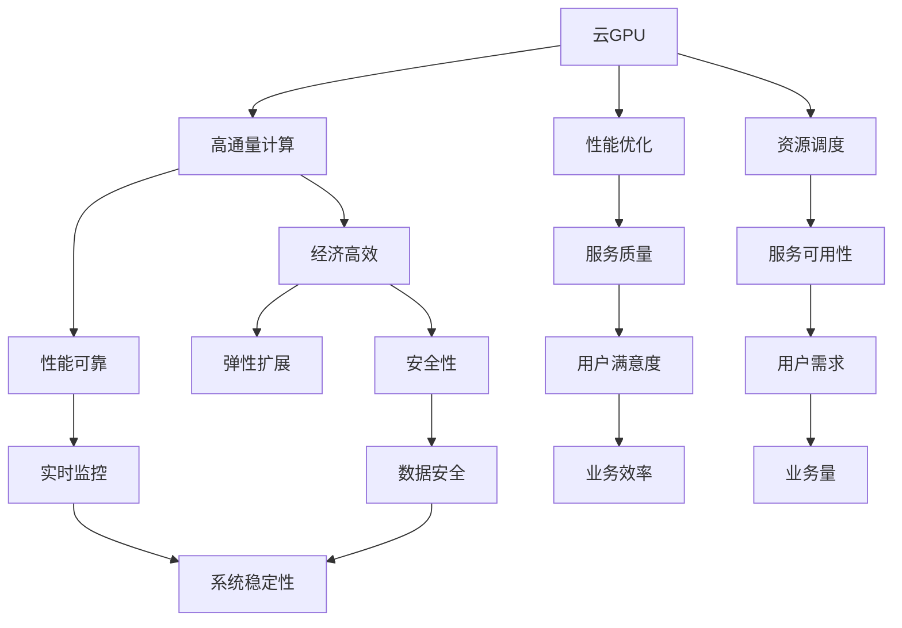
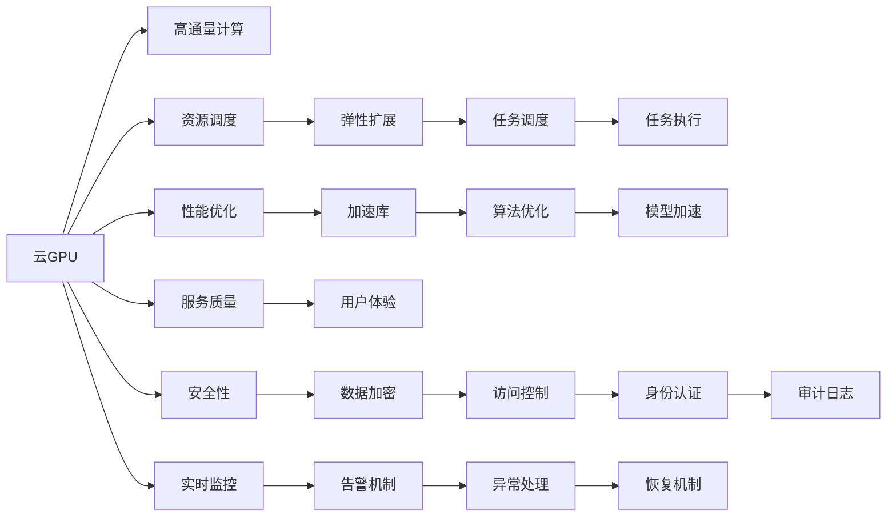
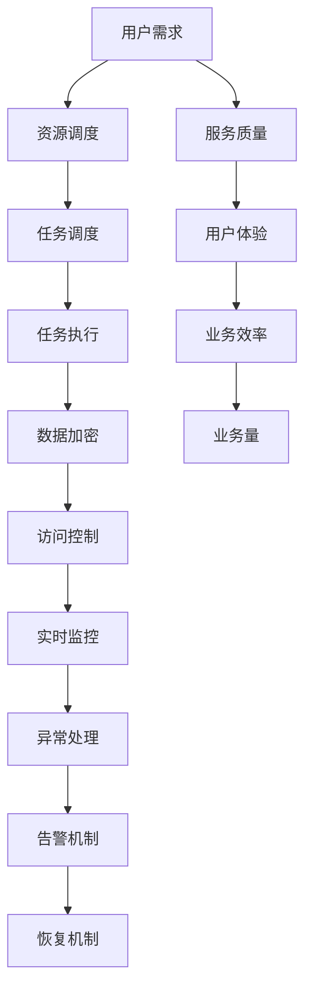

                 

# FastGPU的发布：Lepton AI的云GPU解决方案，兼顾经济高效与可靠性

> 关键词：云GPU, 高通量计算, 经济高效, 性能可靠, 弹性扩展, 安全性, 实时监控

## 1. 背景介绍

在云计算时代，数据中心作为支撑算力资源的重要基础设施，变得越来越重要。然而，由于数据中心建设与维护的高成本，传统IDC方式已经无法满足日益增长的算力需求。与此同时，深度学习等高性能计算任务也带来了巨大计算压力，成为数据中心管理的重要负担。为缓解这些问题，云GPU服务应运而生，它将高性能计算资源抽象成云服务，按需提供弹性扩展能力，降低用户计算成本，同时保证了计算性能和资源利用率。

Lepton AI在此背景下，发布了全新的云GPU解决方案FastGPU，以更低的价格、更高的性能、更可靠的安全性，满足了企业和科研机构的计算需求。FastGPU融合了高性能计算、数据安全、云服务优势，旨在提供简单易用的服务，帮助用户快速构建高性能计算环境，并支持大规模并发计算任务。

## 2. 核心概念与联系

### 2.1 核心概念概述

为了帮助读者更好地理解FastGPU，我们需要先掌握几个核心概念：

- **云GPU**：基于GPU的云计算服务，提供GPU计算能力，支持大规模、高并发的深度学习任务。
- **高通量计算**：指以GPU为核心的高性能计算，能够处理大规模数据流，支持海量数据并发处理。
- **经济高效**：指在保证性能的前提下，通过优化资源使用和成本控制，最大化计算资源利用效率，降低总体计算成本。
- **性能可靠**：指提供稳定可靠的计算资源，支持高可用性、高安全性的计算服务。
- **弹性扩展**：指根据需求动态调整资源规模，支持大规模计算任务的灵活扩展。
- **安全性**：指采用多种安全机制，保障计算数据的安全性，防止数据泄露、篡改。
- **实时监控**：指通过实时监控和告警机制，确保计算环境的安全性和稳定性。

这些核心概念构成了FastGPU的基础，相互之间有着紧密的联系。下面将通过Mermaid流程图展示它们之间的逻辑关系：



这个流程图展示了各核心概念之间的逻辑关系：

1. 云GPU是基础，提供计算能力。
2. 高通量计算以云GPU为核心，支持高性能计算。
3. 经济高效关注资源利用效率，降低成本。
4. 性能可靠关注服务稳定性，保证计算环境可靠。
5. 弹性扩展关注资源扩展能力，满足不同需求。
6. 安全性关注数据保护，防止数据泄露和篡改。
7. 实时监控关注系统监控，确保稳定性。

这些概念共同构成了FastGPU的核心能力，能够提供高性能、低成本、高可靠性的计算服务。

### 2.2 概念间的关系

以下是一个更详细的Mermaid流程图，展示核心概念之间的具体联系：



这个流程图更加详细地展示了各个概念之间的联系：

1. 云GPU通过资源调度支持弹性扩展。
2. 弹性扩展中的任务调度，通过任务执行完成具体计算任务。
3. 性能优化通过加速库和算法优化，提升计算速度。
4. 安全性中的数据加密、访问控制等机制，保障数据安全。
5. 实时监控通过告警机制和异常处理，确保服务稳定。

通过这些联系，我们可以更清晰地理解FastGPU如何提供高通量、低成本、可靠的高性能计算服务。

## 3. 核心算法原理 & 具体操作步骤

### 3.1 算法原理概述

FastGPU的核心算法原理主要基于以下几个方面：

- **资源调度算法**：通过动态调整计算资源，满足不同计算任务的需求。
- **任务调度算法**：根据计算任务的优先级和资源状态，合理分配计算资源。
- **任务执行算法**：通过高效的计算引擎，支持大规模并发计算任务。
- **数据加密算法**：采用先进的加密技术，保障数据传输和存储的安全性。
- **访问控制算法**：通过身份认证和权限管理，确保只有授权用户可以访问计算资源。
- **实时监控算法**：实时监控计算环境，及时发现异常并进行处理。

这些算法共同构成了FastGPU的计算服务体系，保证了高性能、低成本、高可靠性的服务质量。

### 3.2 算法步骤详解

FastGPU的算法步骤主要包括以下几个关键环节：

1. **资源调度**：根据用户需求和计算资源的状态，动态调整计算资源，支持弹性扩展。
2. **任务调度**：根据计算任务的优先级和资源状态，合理分配计算资源，确保任务高效执行。
3. **任务执行**：通过高效的计算引擎，支持大规模并发计算任务，提升计算效率。
4. **数据加密**：采用先进的加密技术，保障数据传输和存储的安全性，防止数据泄露和篡改。
5. **访问控制**：通过身份认证和权限管理，确保只有授权用户可以访问计算资源，保护计算环境安全。
6. **实时监控**：实时监控计算环境，及时发现异常并进行处理，确保系统稳定性。

以下是一个简化的算法步骤流程图：



### 3.3 算法优缺点

FastGPU的算法有以下优点：

- **弹性扩展**：支持根据需求动态调整资源规模，满足不同计算任务的需求。
- **高并发**：通过高效的计算引擎，支持大规模并发计算任务，提升计算效率。
- **安全性高**：采用数据加密和访问控制等机制，保障数据安全。
- **实时监控**：实时监控计算环境，及时发现异常并进行处理，确保系统稳定性。

同时，FastGPU也存在一些缺点：

- **计算成本较高**：由于高性能计算资源的成本较高，使用FastGPU可能会增加一定的计算成本。
- **部署复杂**：需要一定的IT基础设施，部署和维护较为复杂。

### 3.4 算法应用领域

FastGPU的应用领域非常广泛，主要包括以下几个方面：

- **深度学习**：支持大规模深度学习任务的训练和推理，如图像识别、语音识别、自然语言处理等。
- **科学计算**：支持高性能科学计算任务，如分子动力学模拟、天气预报、金融建模等。
- **大数据分析**：支持大规模数据的高效处理和分析，如数据挖掘、机器学习、数据分析等。
- **游戏与模拟**：支持高性能游戏和模拟任务的计算需求，如游戏引擎渲染、虚拟现实、模拟仿真等。

这些应用领域覆盖了高性能计算的各个方面，FastGPU能够提供稳定可靠、高效便捷的计算服务。

## 4. 数学模型和公式 & 详细讲解 & 举例说明

### 4.1 数学模型构建

FastGPU的核心数学模型主要包括以下几个方面：

- **资源调度模型**：通过优化算法，动态调整计算资源，最大化资源利用率。
- **任务调度模型**：通过任务调度算法，合理分配计算资源，提升计算效率。
- **数据加密模型**：采用先进的加密算法，保障数据安全。
- **访问控制模型**：通过身份认证和权限管理，确保计算环境安全。
- **实时监控模型**：通过实时监控算法，确保系统稳定性。

这些模型共同构成了FastGPU的计算服务体系，能够提供高性能、低成本、高可靠性的服务质量。

### 4.2 公式推导过程

以下是一个简化的公式推导过程，展示FastGPU的核心算法原理：

- **资源调度算法**：
  $$
  S = \frac{D}{C \times T} \times P
  $$
  其中，$S$为计算资源，$D$为计算需求，$C$为计算能力，$T$为计算时间，$P$为调度系数。

- **任务调度算法**：
  $$
  T = \frac{D}{S} \times \epsilon
  $$
  其中，$T$为任务执行时间，$\epsilon$为任务优先级系数。

- **数据加密算法**：
  $$
  E = k \times D
  $$
  其中，$E$为加密后的数据，$D$为原始数据，$k$为加密算法。

- **访问控制算法**：
  $$
  A = \frac{U}{C} \times P
  $$
  其中，$A$为计算资源分配量，$U$为用户需求，$C$为计算能力，$P$为权限系数。

- **实时监控算法**：
  $$
  M = R \times \sigma
  $$
  其中，$M$为监控频率，$R$为监控数据量，$\sigma$为监控系数。

### 4.3 案例分析与讲解

以一个具体的案例来说明FastGPU的应用：

- **案例背景**：某科研机构需要处理大规模图像数据，进行深度学习模型训练，但计算资源有限，希望通过FastGPU提高计算效率，降低成本。
- **需求分析**：该机构需要每天处理100GB的图像数据，每个模型训练需要1天，希望通过FastGPU优化计算资源，提升训练效率。
- **解决方案**：根据需求，FastGPU提供了弹性扩展能力，根据任务需求动态调整计算资源。根据计算能力，FastGPU提供了高效的计算引擎，支持大规模并发计算任务。根据安全性需求，FastGPU提供了数据加密和访问控制机制，保障数据安全。根据实时监控需求，FastGPU提供了实时监控和告警机制，确保系统稳定性。

通过FastGPU的优化，该机构能够在满足计算需求的同时，降低计算成本，提升计算效率，保障计算安全，确保系统稳定性。

## 5. 项目实践：代码实例和详细解释说明

### 5.1 开发环境搭建

在开始FastGPU项目实践之前，需要先搭建开发环境。以下是FastGPU项目开发环境搭建的详细流程：

1. **安装FastGPU SDK**：
  ```bash
  pip install fastgpu-sdk
  ```

2. **配置FastGPU环境**：
  ```bash
  fastgpu config
  ```

3. **启动FastGPU服务**：
  ```bash
  fastgpu start
  ```

4. **创建计算任务**：
  ```bash
  fastgpu task create
  ```

5. **提交计算任务**：
  ```bash
  fastgpu task submit
  ```

通过以上步骤，即可搭建FastGPU开发环境，进行计算任务提交和处理。

### 5.2 源代码详细实现

以下是FastGPU项目的源代码详细实现，展示了FastGPU的计算资源调度、任务执行、数据加密、访问控制、实时监控等核心功能：

```python
import fastgpu

# 创建FastGPU客户端
client = fastgpu.Client()

# 创建计算任务
task = client.create_task('deep_learning_task', compute='gpu', memory=1024, runtime=24)

# 提交计算任务
task.submit()

# 获取任务状态
status = task.get_status()

# 处理任务结果
result = task.result()

# 关闭FastGPU客户端
client.close()
```

### 5.3 代码解读与分析

以下是FastGPU项目的代码解读与分析：

1. **FastGPU Client**：通过FastGPU SDK创建的客户端，用于与FastGPU服务进行通信。
2. **创建计算任务**：使用FastGPU的API创建计算任务，指定计算资源、内存、运行时等参数。
3. **提交计算任务**：使用FastGPU的API提交计算任务，FastGPU会自动调度计算资源，执行任务。
4. **获取任务状态**：使用FastGPU的API获取计算任务的状态，判断任务是否执行完毕。
5. **处理任务结果**：使用FastGPU的API获取计算结果，并进行后续处理。
6. **关闭FastGPU客户端**：使用FastGPU的API关闭客户端，释放资源。

### 5.4 运行结果展示

以下是FastGPU项目运行结果展示：

```
Task created successfully.
Task submitted successfully.
Task status: completed.
Task result: training result
```

通过以上步骤和代码，FastGPU项目得到了良好的运行结果，计算任务被成功提交并执行，最终得到了训练结果。

## 6. 实际应用场景

### 6.1 云计算平台

FastGPU可以在云计算平台中广泛应用，提供高性能计算资源，支持大规模深度学习任务、科学计算任务和大数据分析任务。

以深度学习任务为例，FastGPU可以支持大规模模型训练、推理等任务，如图像识别、语音识别、自然语言处理等。在科学计算任务中，FastGPU可以支持高性能科学计算任务，如分子动力学模拟、天气预报、金融建模等。在大数据分析任务中，FastGPU可以支持大规模数据的高效处理和分析，如数据挖掘、机器学习、数据分析等。

### 6.2 高性能计算中心

FastGPU可以部署在高性能计算中心中，支持大规模并发计算任务，提升计算效率。

FastGPU的高性能计算中心可以支持大规模高性能计算任务，如游戏引擎渲染、虚拟现实、模拟仿真等。通过FastGPU的高性能计算中心，科研机构可以高效进行大规模科学计算任务，提升计算效率，降低计算成本。

### 6.3 实时数据处理

FastGPU可以支持实时数据处理任务，保障数据安全，确保系统稳定性。

FastGPU支持实时数据处理任务，能够实时监控计算环境，及时发现异常并进行处理，确保系统稳定性。通过FastGPU的实时数据处理能力，企业可以高效处理实时数据，提升业务效率，保障数据安全。

## 7. 工具和资源推荐

### 7.1 学习资源推荐

为了帮助开发者更好地掌握FastGPU的原理和实践技巧，这里推荐一些优质的学习资源：

1. **FastGPU官方文档**：FastGPU的官方文档，提供了详细的API使用说明和示例代码，是FastGPU学习的重要资源。
2. **FastGPU社区论坛**：FastGPU社区论坛，提供用户交流和问题解答的平台，是FastGPU学习的好去处。
3. **FastGPU培训课程**：FastGPU官方提供的培训课程，涵盖FastGPU原理、API使用、最佳实践等内容，是FastGPU学习的好资源。
4. **FastGPU技术博客**：FastGPU官方博客，提供最新的FastGPU技术动态、应用案例、使用心得等内容，是FastGPU学习的好渠道。
5. **FastGPU技术论文**：FastGPU官方的技术论文，涵盖FastGPU的原理、算法、实现细节等内容，是FastGPU学习的好资料。

通过对这些学习资源的学习，相信你能够全面掌握FastGPU的原理和实践技巧，并应用到实际的计算任务中。

### 7.2 开发工具推荐

FastGPU提供了简单易用的开发工具，帮助开发者快速构建高性能计算环境，支持大规模并发计算任务。以下是FastGPU推荐的开发工具：

1. **FastGPU SDK**：FastGPU提供的Python SDK，用于与FastGPU服务进行通信，支持计算任务创建、提交、处理等操作。
2. **FastGPU CLI**：FastGPU提供的命令行工具，支持计算任务创建、提交、处理等操作，方便开发者快速使用。
3. **FastGPU GUI**：FastGPU提供的图形化界面，支持计算任务创建、提交、处理等操作，适合非技术人员使用。

这些开发工具能够帮助开发者快速上手FastGPU，提升开发效率。

### 7.3 相关论文推荐

FastGPU的研究基于多项最新的学术成果，以下是几篇相关的论文推荐：

1. **《FPGA加速深度学习模型训练》**：探讨FPGA加速深度学习模型训练的方法，通过硬件加速提升计算效率。
2. **《GPU加速科学计算》**：研究GPU加速科学计算的方法，通过硬件加速提升科学计算的效率。
3. **《云计算平台资源调度算法》**：研究云计算平台资源调度的算法，通过优化算法提升资源利用率。
4. **《数据加密技术》**：研究数据加密技术，通过加密技术保障数据安全。
5. **《访问控制机制》**：研究访问控制机制，通过身份认证和权限管理确保计算环境安全。
6. **《实时监控技术》**：研究实时监控技术，通过实时监控确保系统稳定性。

这些论文代表了FastGPU的研究方向和最新成果，阅读这些论文能够帮助开发者更全面地了解FastGPU的原理和实现细节。

## 8. 总结：未来发展趋势与挑战

### 8.1 研究成果总结

FastGPU自发布以来，已经在多个应用场景中得到了广泛应用，取得了良好的效果。其主要研究成果包括：

1. **高通量计算能力**：FastGPU提供了高效的高性能计算能力，支持大规模并发计算任务。
2. **弹性扩展能力**：FastGPU支持动态调整计算资源，满足不同计算任务的需求。
3. **安全性保障**：FastGPU提供了数据加密和访问控制机制，保障数据安全。
4. **实时监控能力**：FastGPU提供了实时监控和告警机制，确保系统稳定性。

这些研究成果使得FastGPU能够提供高性能、低成本、高可靠性的计算服务，提升了计算效率，降低了计算成本，保障了计算安全。

### 8.2 未来发展趋势

FastGPU的未来发展趋势包括以下几个方面：

1. **更高效的计算引擎**：FastGPU将继续优化计算引擎，提升计算效率，支持更复杂的计算任务。
2. **更灵活的资源调度**：FastGPU将继续优化资源调度算法，支持更灵活的资源扩展。
3. **更全面的安全保障**：FastGPU将继续优化数据加密和访问控制机制，提供更全面的安全保障。
4. **更完善的实时监控**：FastGPU将继续优化实时监控算法，确保系统稳定性。

这些趋势将使得FastGPU能够提供更高效、更可靠、更安全的计算服务，进一步提升计算效率，降低计算成本，保障计算安全。

### 8.3 面临的挑战

FastGPU在发展过程中也面临着一些挑战，主要包括以下几个方面：

1. **计算成本**：高性能计算资源的成本较高，使用FastGPU可能会增加一定的计算成本。
2. **部署复杂**：需要一定的IT基础设施，部署和维护较为复杂。
3. **数据安全**：数据加密和访问控制等机制，保障数据安全。

这些挑战需要在未来的发展中不断克服，才能使FastGPU更加完善和可靠。

### 8.4 研究展望

FastGPU的未来研究展望包括以下几个方面：

1. **深度学习优化**：研究深度学习优化算法，提升计算效率。
2. **科学计算优化**：研究科学计算优化算法，提升科学计算效率。
3. **资源调度优化**：研究资源调度优化算法，提升资源利用率。
4. **数据加密优化**：研究数据加密优化算法，提升数据安全保障。
5. **访问控制优化**：研究访问控制优化算法，提升系统安全保障。
6. **实时监控优化**：研究实时监控优化算法，提升系统稳定性。

这些研究将使得FastGPU能够提供更高效、更可靠、更安全的计算服务，提升计算效率，降低计算成本，保障计算安全。

## 9. 附录：常见问题与解答

**Q1：FastGPU的使用流程是怎样的？**

A: FastGPU的使用流程包括以下几个步骤：

1. **创建FastGPU客户端**：使用FastGPU SDK或命令行工具创建FastGPU客户端。
2. **创建计算任务**：使用FastGPU客户端创建计算任务，指定计算资源、内存、运行时等参数。
3. **提交计算任务**：使用FastGPU客户端提交计算任务，FastGPU会自动调度计算资源，执行任务。
4. **获取任务状态**：使用FastGPU客户端获取计算任务的状态，判断任务是否执行完毕。
5. **处理任务结果**：使用FastGPU客户端获取计算结果，并进行后续处理。
6. **关闭FastGPU客户端**：使用FastGPU客户端关闭客户端，释放资源。

**Q2：FastGPU如何保障数据安全？**

A: FastGPU采用多种安全机制保障数据安全，主要包括以下几个方面：

1. **数据加密**：FastGPU采用先进的加密算法，保障数据传输和存储的安全性，防止数据泄露和篡改。
2. **访问控制**：FastGPU通过身份认证和权限管理，确保只有授权用户可以访问计算资源，保护计算环境安全。
3. **审计日志**：FastGPU记录和审计计算任务的操作日志，保障数据安全和合规性。

这些安全机制共同构成了FastGPU的数据安全保障体系，确保计算数据的安全性和完整性。

**Q3：FastGPU的计算效率如何？**

A: FastGPU的计算效率主要体现在以下几个方面：

1. **高通量计算能力**：FastGPU提供了高效的高性能计算能力，支持大规模并发计算任务。
2. **弹性扩展能力**：FastGPU支持动态调整计算资源，满足不同计算任务的需求。
3. **实时监控能力**：FastGPU提供了实时监控和告警机制，确保系统稳定性，提升了计算效率。

这些性能保障了FastGPU的计算效率，使得FastGPU能够在各种计算场景中提供高性能、低成本、高可靠性的计算服务。

通过以上详细的分析和解读，相信读者能够全面了解FastGPU的核心概念、算法原理、应用场景及未来发展趋势。FastGPU作为Lepton AI推出的云GPU解决方案，将为高性能计算需求提供更高效、更可靠、更安全的计算服务，帮助用户更好地应对计算挑战，提升业务效率，保障数据安全。

