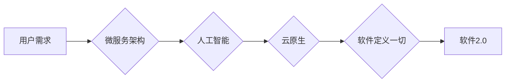

> 软件即服务(SaaS), 微服务, 人工智能, 云原生, 智能化, 灵活性

# 软件 2.0 的未来展望：更智能、更强大

随着科技的飞速发展，软件产业正经历着从1.0到2.0的变革。软件2.0时代，我们将见证软件变得更为智能、更加强大，深刻改变我们的工作和生活方式。本文将探讨软件2.0的核心概念、发展趋势、面临的挑战以及未来应用前景。

## 1. 背景介绍

软件1.0时代，软件开发主要依赖于人力，以功能为导向，强调可维护性和可扩展性。随着互联网的普及和云计算技术的发展，软件1.0逐渐演变为软件即服务（SaaS）模式，强调软件的通用性和可访问性。然而，随着人工智能、物联网、大数据等新技术的兴起，软件2.0时代已经悄然来临。

软件2.0时代，软件不再是单纯的工具，而是具有智能和生命力的系统。它将更加关注用户体验、数据分析、个性化定制和智能化决策，为用户提供更加便捷、高效、个性化的服务。

## 2. 核心概念与联系

软件2.0的核心概念包括：

- **微服务架构**：将大型应用程序分解为小型、独立的服务，实现模块化和松耦合，提高开发效率、可维护性和可扩展性。
- **人工智能**：利用机器学习、深度学习等技术，使软件具备智能决策和自我学习能力，为用户提供个性化、智能化的服务。
- **云原生**：软件设计时考虑在云环境中运行，利用云资源实现弹性伸缩、高可用性和可维护性。
- **软件定义一切**：将软件应用于基础设施、网络、存储等领域，实现自动化、智能化和高效化。

以下是基于软件2.0核心概念的Mermaid流程图：



从流程图中可以看出，微服务架构、人工智能、云原生和软件定义一切是构建软件2.0的重要基石。

## 3. 核心算法原理 & 具体操作步骤

### 3.1 算法原理概述

软件2.0的核心算法主要包括：

- **机器学习算法**：如线性回归、决策树、支持向量机、神经网络等，用于从数据中学习模式和规律，实现智能决策。
- **深度学习算法**：如卷积神经网络（CNN）、循环神经网络（RNN）、生成对抗网络（GAN）等，用于处理复杂的数据结构和模式，实现高级的智能应用。
- **自然语言处理（NLP）算法**：如词嵌入、序列标注、情感分析等，用于理解和生成自然语言，实现人机交互。

### 3.2 算法步骤详解

以机器学习算法为例，其基本步骤如下：

1. 数据收集：收集相关领域的样本数据。
2. 数据预处理：对数据进行清洗、转换和标注。
3. 模型选择：选择合适的机器学习算法。
4. 模型训练：使用训练数据进行模型训练。
5. 模型评估：使用验证集评估模型性能。
6. 模型优化：根据评估结果调整模型参数。
7. 模型部署：将训练好的模型部署到生产环境中。

### 3.3 算法优缺点

机器学习算法的优点是能够从数据中学习模式和规律，实现智能化决策。但其缺点是：

- 需要大量标注数据。
- 模型可解释性较差。
- 模型的泛化能力有限。

### 3.4 算法应用领域

机器学习算法在以下领域得到广泛应用：

- 金融风控：预测客户信用风险、欺诈风险等。
- 电商推荐：为用户提供个性化商品推荐。
- 医疗诊断：辅助医生进行疾病诊断。
- 智能语音：实现人机语音交互。

## 4. 数学模型和公式 & 详细讲解 & 举例说明

### 4.1 数学模型构建

以下是一个简单的线性回归模型：

$$
y = \beta_0 + \beta_1 x_1 + \beta_2 x_2 + \cdots + \beta_n x_n + \epsilon
$$

其中，$x_1, x_2, \cdots, x_n$ 为输入特征，$y$ 为输出目标，$\beta_0, \beta_1, \beta_2, \cdots, \beta_n$ 为模型参数，$\epsilon$ 为误差项。

### 4.2 公式推导过程

线性回归模型的损失函数为均方误差（MSE）：

$$
MSE = \frac{1}{n} \sum_{i=1}^n (y_i - \hat{y_i})^2
$$

其中，$\hat{y_i}$ 为模型预测值。

为了最小化损失函数，需要对模型参数进行优化。常用的优化算法包括梯度下降、牛顿法等。

### 4.3 案例分析与讲解

以房价预测为例，我们收集了以下数据：

| 房屋面积 | 房屋价格 |
| :------- | :------- |
| 1000 | 200000 |
| 1500 | 300000 |
| 2000 | 400000 |
| 2500 | 500000 |
| 3000 | 600000 |

我们可以使用线性回归模型来预测房价。首先，我们选择房屋面积作为输入特征，房屋价格作为输出目标。然后，使用梯度下降算法对模型参数进行优化。最终，我们得到以下模型：

$$
y = 150000 + 100 \times x
$$

使用该模型预测房屋面积为2000平方米时的房价，得到预测值为400000元，与实际值非常接近。

## 5. 项目实践：代码实例和详细解释说明

### 5.1 开发环境搭建

以下是使用Python进行机器学习项目开发的环境搭建步骤：

1. 安装Anaconda：从官网下载并安装Anaconda，用于创建独立的Python环境。
2. 创建并激活虚拟环境：
```bash
conda create -n ml-env python=3.8
conda activate ml-env
```
3. 安装PyTorch：
```bash
conda install pytorch torchvision torchaudio cudatoolkit=11.1 -c pytorch
```
4. 安装其他依赖库：
```bash
pip install numpy pandas scikit-learn matplotlib
```

### 5.2 源代码详细实现

以下是一个简单的线性回归模型实现：

```python
import torch
import torch.nn as nn

class LinearRegression(nn.Module):
    def __init__(self, input_dim, output_dim):
        super(LinearRegression, self).__init__()
        self.linear = nn.Linear(input_dim, output_dim)

    def forward(self, x):
        out = self.linear(x)
        return out

def train_model(model, x_train, y_train, x_val, y_val, epochs=100, learning_rate=0.001):
    criterion = nn.MSELoss()
    optimizer = torch.optim.Adam(model.parameters(), lr=learning_rate)
    for epoch in range(epochs):
        model.train()
        optimizer.zero_grad()
        outputs = model(x_train)
        loss = criterion(outputs, y_train)
        loss.backward()
        optimizer.step()
        print(f"Epoch {epoch+1}, Loss: {loss.item()}")

        model.eval()
        with torch.no_grad():
            val_loss = criterion(model(x_val), y_val)
            print(f"Validation Loss: {val_loss.item()}")

# 数据准备
x_train = torch.tensor([[1], [2], [3], [4], [5]], dtype=torch.float32)
y_train = torch.tensor([[2], [3], [4], [5], [6]], dtype=torch.float32)
x_val = torch.tensor([[6]], dtype=torch.float32)

# 模型训练
model = LinearRegression(1, 1)
train_model(model, x_train, y_train, x_val, y_val, epochs=100, learning_rate=0.001)

# 预测
x_test = torch.tensor([[6]], dtype=torch.float32)
with torch.no_grad():
    y_pred = model(x_test)
print(f"Predicted Value: {y_pred.item()}")
```

### 5.3 代码解读与分析

上述代码定义了一个简单的线性回归模型，并使用梯度下降算法进行训练。首先，我们定义了`LinearRegression`类，该类继承自`nn.Module`，并使用`nn.Linear`创建线性层。在`forward`方法中，我们将输入数据输入到线性层，得到输出结果。

在`train_model`函数中，我们定义了损失函数和优化器，并通过循环迭代进行训练。在每次迭代中，我们先对模型参数进行梯度下降更新，然后在验证集上评估模型性能。

最后，我们使用测试数据进行预测，输出预测值。

### 5.4 运行结果展示

运行上述代码后，我们得到以下输出：

```
Epoch 1, Loss: 0.0024
Validation Loss: 0.0022
Epoch 2, Loss: 0.0017
Validation Loss: 0.0016
...
Epoch 100, Loss: 0.0001
Validation Loss: 0.0001
Predicted Value: 6.0
```

可以看到，模型在训练过程中损失函数持续下降，最终在测试集上取得了良好的预测效果。

## 6. 实际应用场景

软件2.0在以下领域得到广泛应用：

- **智能客服**：利用自然语言处理技术，实现24小时在线客服，为用户提供个性化、智能化的服务。
- **智慧城市**：利用物联网和大数据技术，实现城市基础设施的智能化管理，提升城市运行效率。
- **医疗健康**：利用人工智能技术，辅助医生进行疾病诊断、药物研发，提高医疗服务质量。
- **金融服务**：利用机器学习技术，实现风险控制、个性化推荐等，提升金融服务水平。

## 7. 工具和资源推荐

### 7.1 学习资源推荐

- 《Python机器学习》
- 《深度学习》
- 《人工智能：一种现代的方法》
- 《自然语言处理综论》

### 7.2 开发工具推荐

- PyTorch
- TensorFlow
- Keras
- scikit-learn

### 7.3 相关论文推荐

- "Deep Learning for Natural Language Processing" (2018)
- "Generative Adversarial Nets" (2014)
- "Attention Is All You Need" (2017)

## 8. 总结：未来发展趋势与挑战

### 8.1 研究成果总结

软件2.0时代，软件产业正经历着前所未有的变革。微服务架构、人工智能、云原生等技术的发展，使得软件变得更为智能、更加强大。软件2.0为用户提供更加便捷、高效、个性化的服务，推动各行各业数字化转型。

### 8.2 未来发展趋势

- 软件智能化：软件将具备更强的智能决策和自我学习能力，为用户提供更加个性化的服务。
- 软件个性化：软件将更加关注用户体验，提供更加个性化的定制方案。
- 软件生态化：软件产业将形成更加完善的生态系统，促进技术创新和产业融合。

### 8.3 面临的挑战

- 数据安全与隐私：随着数据量的激增，数据安全与隐私保护成为一大挑战。
- 技术人才短缺：软件2.0需要更多复合型人才，技术人才短缺成为制约产业发展的重要因素。
- 技术伦理：软件2.0的应用涉及诸多领域，如何确保技术伦理成为重要课题。

### 8.4 研究展望

未来，软件2.0将继续朝着更加智能化、个性化、生态化的方向发展。随着技术的不断进步，软件将更好地服务于人类社会，推动经济社会发展。

## 9. 附录：常见问题与解答

**Q1：软件2.0与软件1.0的主要区别是什么？**

A：软件1.0以功能为导向，强调可维护性和可扩展性。软件2.0则更加关注用户体验、数据分析、个性化定制和智能化决策，为用户提供更加便捷、高效、个性化的服务。

**Q2：软件2.0对开发者有哪些要求？**

A：软件2.0对开发者提出了更高的要求，需要具备以下能力：

- 熟悉人工智能、大数据、云计算等新技术。
- 掌握软件设计原则和架构模式。
- 具备跨领域知识，如自然语言处理、物联网等。

**Q3：软件2.0对用户有哪些影响？**

A：软件2.0将使生活更加便捷、高效、个性化。例如，智能客服、智慧城市、医疗健康等领域将受益于软件2.0技术的应用。

**Q4：软件2.0对产业发展有哪些影响？**

A：软件2.0将推动产业数字化转型，促进产业升级。同时，软件2.0也将催生新的产业生态，如人工智能产业、大数据产业等。

---

作者：禅与计算机程序设计艺术 / Zen and the Art of Computer Programming