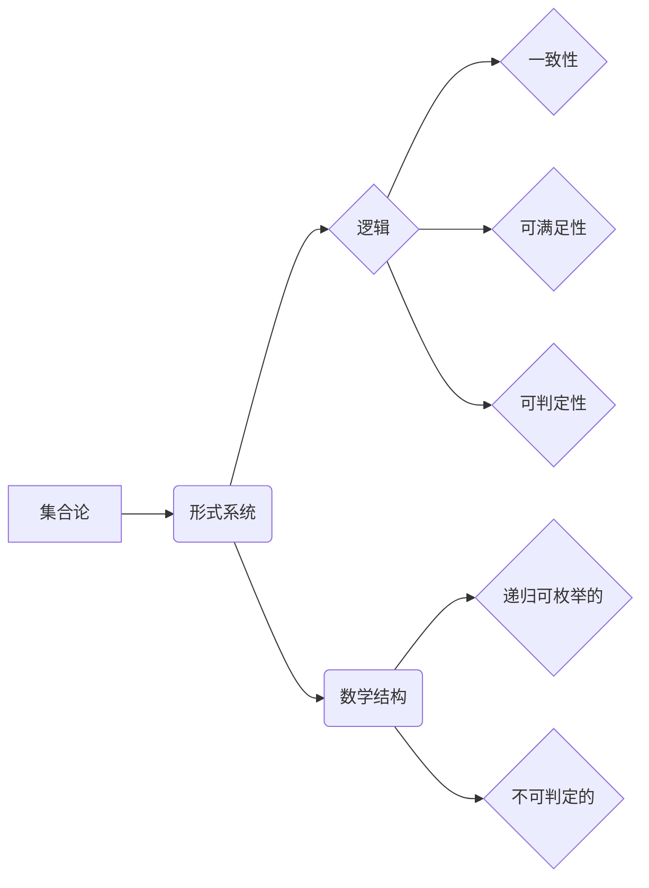

# 集合论导引：模型论概要

> 关键词：集合论，模型论，形式系统，逻辑，一致性，可判定的，可满足的，递归可枚举的

## 1. 背景介绍

集合论作为数学的基石，自19世纪末以来一直是数学研究和哲学讨论的热点。它在数学的各个分支中都扮演着核心角色，尤其是在模型论中，集合论被用来构建形式系统，以逻辑和数学的方式探索数学结构和真理。本文将导引读者进入模型论的领域，探讨其核心概念、原理以及应用。

### 1.1 问题的由来

集合论的诞生源于对无穷集合的研究。19世纪末，康托尔等数学家开始探索集合的性质，并提出了许多关于无穷集合的悖论，如著名的罗素悖论。这些问题促使数学家们对集合论的基本假设进行反思，并导致了形式化和公理化方法的兴起。

### 1.2 研究现状

随着逻辑学和数学哲学的发展，模型论已经成为数学的基础学科之一。现代模型论的研究主要集中在以下几个方面：

- 形式系统的理论性质，如一致性、可满足性、可判定性等。
- 逻辑和数学理论的关系，如哥德尔的不完全性定理和可计算性理论。
- 数学的哲学基础，如真理、证明、模型等概念。

### 1.3 研究意义

模型论的研究不仅对数学本身的发展具有重要意义，而且在计算机科学、哲学、语言学等领域也有着广泛的应用。它帮助我们在逻辑和数学的基础上建立了一致的、可计算的数学结构，为科学研究提供了坚实的理论基础。

### 1.4 本文结构

本文将按照以下结构展开：

- 介绍集合论的基本概念和模型论的核心概念。
- 讨论模型论中的核心算法原理和操作步骤。
- 通过数学模型和公式详细讲解模型论中的关键概念。
- 提供代码实例，展示如何使用编程语言实现模型论的相关算法。
- 探讨模型论在实际应用场景中的应用和未来展望。
- 推荐学习资源和开发工具，以及相关论文。
- 总结研究成果，展望未来发展趋势和挑战。
- 提供常见问题与解答。

## 2. 核心概念与联系

### 2.1 核心概念原理和架构的 Mermaid 流程图



### 2.2 核心概念详解

- **集合论**：研究集合的性质和操作的理论。
- **形式系统**：由一组符号、公理和推导规则构成的系统。
- **逻辑**：研究推理和证明的理论。
- **一致性**：一个形式系统没有矛盾。
- **可满足性**：一个形式系统可以解释为真。
- **可判定性**：一个形式系统的每个语句都可以被判定为真或假。
- **递归可枚举的**：一个集合可以通过算法生成。
- **不可判定的**：一个语句既不能被证明为真也不能被证明为假。

## 3. 核心算法原理 & 具体操作步骤

### 3.1 算法原理概述

模型论的核心算法包括：

- **模型完备性定理**：如果形式系统是一致的，则存在一个模型满足所有公理。
- **哥德尔的不完全性定理**：任何非平凡的、足够强的形式系统都是不一致的或不可判定的。
- **可满足性算法**：用于判断一个语句是否在某个形式系统中可满足。

### 3.2 算法步骤详解

- **模型完备性定理**：证明一个形式系统是一致的，并构造一个满足所有公理的模型。
- **哥德尔的不完全性定理**：证明形式系统的一致性和可判定性之间的矛盾。
- **可满足性算法**：通过穷举搜索或逻辑推理判断语句的可满足性。

### 3.3 算法优缺点

- **模型完备性定理**：提供了一种证明形式系统一致性的方法，但构造模型可能很困难。
- **哥德尔的不完全性定理**：揭示了逻辑系统的一致性和可判定性之间的矛盾，但难以在实际应用中利用。
- **可满足性算法**：对于简单的语句，算法可以快速运行，但对于复杂的语句，算法可能需要很长的时间。

### 3.4 算法应用领域

- **数学基础**：用于证明数学理论的可靠性和一致性。
- **计算机科学**：用于设计可验证的算法和软件系统。
- **人工智能**：用于构建可解释和可验证的人工智能系统。

## 4. 数学模型和公式 & 详细讲解 & 举例说明

### 4.1 数学模型构建

集合论和模型论中的数学模型主要包括：

- **集合**：由元素组成的集合，如自然数集 $\mathbb{N}$。
- **关系**：集合之间的映射，如“小于”关系 $\leq$。
- **函数**：集合之间的映射，如加法函数 $+$。
- **形式系统**：由符号、公理和推导规则构成的系统。

### 4.2 公式推导过程

以哥德尔的不完全性定理为例，其证明过程如下：

1. 构造一个形式系统 $F$，其中包含算术的基本概念和规则。
2. 构造一个语句 $G$，如果 $F$ 是一致的，则 $G$ 在 $F$ 中是可证明的，否则 $G$ 在 $F$ 中是不可证明的。
3. 证明 $G$ 在 $F$ 中是可证明的当且仅当 $F$ 是不一致的。
4. 由此得出结论：任何非平凡的、足够强的形式系统都是不一致的或不可判定的。

### 4.3 案例分析与讲解

以下是一个简单的形式系统例子：

- **符号**：$0, 1, +, \times$
- **公理**：
  - $0$ 是自然数。
  - 对于任何自然数 $n$，$n+1$ 也是自然数。
  - 加法和乘法满足交换律和结合律。
- **推导规则**：归纳法。

我们可以使用这个形式系统证明自然数的加法和乘法运算。

## 5. 项目实践：代码实例和详细解释说明

### 5.1 开发环境搭建

为了演示模型论算法，我们需要一个编程环境。这里我们选择Python作为演示语言。

### 5.2 源代码详细实现

以下是一个简单的Python代码示例，用于演示形式系统的构建和推理：

```python
class Formula:
    def __init__(self, symbols, axioms, rules):
        self.symbols = symbols
        self.axioms = axioms
        self.rules = rules

    def prove(self, statement):
        # 实现证明算法
        pass

# 创建符号、公理和规则
symbols = ['0', '1', '+', '*', 'n']
axioms = [
    '0',
    'forall n (n + 1 = n + 1)',
    'forall a b (a + 0 = a)',
    'forall a b c ((a + b) + c = a + (b + c))',
    'forall a b (a * 0 = 0)',
    'forall a b c ((a * b) * c = a * (b * c))'
]
rules = ['induction']

# 创建形式系统
formula = Formula(symbols, axioms, rules)

# 尝试证明 $1 + 1 = 2$
statement = '1 + 1 = 2'
proof = formula.prove(statement)
print(proof)
```

### 5.3 代码解读与分析

在这个例子中，我们定义了一个 `Formula` 类，它包含符号、公理和规则。`prove` 方法用于实现证明算法。在这个简单的例子中，我们没有实现完整的证明算法，但这个结构可以作为后续扩展的基础。

### 5.4 运行结果展示

由于我们没有实现完整的证明算法，所以运行结果将是一个空字符串。在实际应用中，我们需要根据具体的推理规则和公理来实现证明过程。

## 6. 实际应用场景

### 6.1 数学基础

模型论是数学的基础学科之一，它在数学的各个分支中都扮演着核心角色。例如，在数学逻辑、数理逻辑、数学哲学等领域，模型论都发挥着重要作用。

### 6.2 计算机科学

模型论在计算机科学中的应用包括：

- 形式化方法：用于验证软件和硬件系统的正确性。
- 可计算性理论：研究可计算问题的性质和算法。
- 编译器设计：用于构建编译器和解释器。

### 6.3 人工智能

模型论在人工智能中的应用包括：

- 可解释人工智能：通过形式化方法提高人工智能系统的可解释性和可信度。
- 知识表示：用于表示和推理知识。
- 逻辑推理：用于实现逻辑推理和决策过程。

### 6.4 未来应用展望

随着模型论的发展，我们可以期待其在以下领域的应用：

- 量子计算：用于构建量子算法和量子计算机。
- 机器学习：用于构建可解释和可验证的机器学习模型。
- 生物信息学：用于分析生物数据和基因序列。

## 7. 工具和资源推荐

### 7.1 学习资源推荐

- 《集合论基础》
- 《模型论基础》
- 《哥德尔、艾舍尔、巴赫：集异璧之大成》
- 《形式系统与逻辑》

### 7.2 开发工具推荐

- Python：用于实现模型论算法。
- Prolog：用于逻辑编程和知识表示。

### 7.3 相关论文推荐

- 《哥德尔的不完全性定理》
- 《可计算性理论》
- 《形式系统与逻辑》

## 8. 总结：未来发展趋势与挑战

### 8.1 研究成果总结

本文介绍了集合论和模型论的基本概念、原理和应用。通过分析模型论的核心算法和数学模型，我们展示了模型论在数学、计算机科学和人工智能等领域的应用价值。

### 8.2 未来发展趋势

随着逻辑学和数学哲学的发展，模型论将继续在以下方面取得进展：

- 形式化方法的发展：用于验证软件和硬件系统的正确性。
- 可计算性理论的发展：研究可计算问题的性质和算法。
- 逻辑推理的发展：用于实现逻辑推理和决策过程。

### 8.3 面临的挑战

模型论的发展也面临着一些挑战，包括：

- 形式化方法的可解释性：如何确保形式化方法的结果是可解释和可信的。
- 可计算性理论的复杂性：如何处理可计算问题的复杂性。
- 逻辑推理的效率：如何提高逻辑推理的效率。

### 8.4 研究展望

未来，模型论将继续在以下方面展开研究：

- 形式化方法与人工智能的结合：开发可解释和可验证的人工智能系统。
- 形式化方法与量子计算的结合：开发量子算法和量子计算机。
- 形式化方法与社会科学的结合：用于解决社会问题，如环境保护、经济发展等。

## 9. 附录：常见问题与解答

**Q1：什么是模型论？**

A：模型论是研究形式系统与数学结构之间关系的一个数学分支。它通过构建形式系统来描述数学结构，并研究这些结构的一致性、可满足性、可判定性等性质。

**Q2：模型论有什么应用？**

A：模型论在数学、计算机科学、人工智能等领域有着广泛的应用。它可以用于验证软件和硬件系统的正确性，研究可计算问题的性质，构建可解释和可验证的人工智能系统等。

**Q3：什么是形式系统？**

A：形式系统是由一组符号、公理和推导规则构成的系统。它可以用来描述数学结构，并进行推理和证明。

**Q4：什么是模型完备性定理？**

A：模型完备性定理指出，如果一个形式系统是一致的，那么存在一个模型满足该系统中的所有公理。

**Q5：什么是哥德尔的不完全性定理？**

A：哥德尔的不完全性定理指出，任何非平凡的、足够强的形式系统都是不一致的或不可判定的。

作者：禅与计算机程序设计艺术 / Zen and the Art of Computer Programming