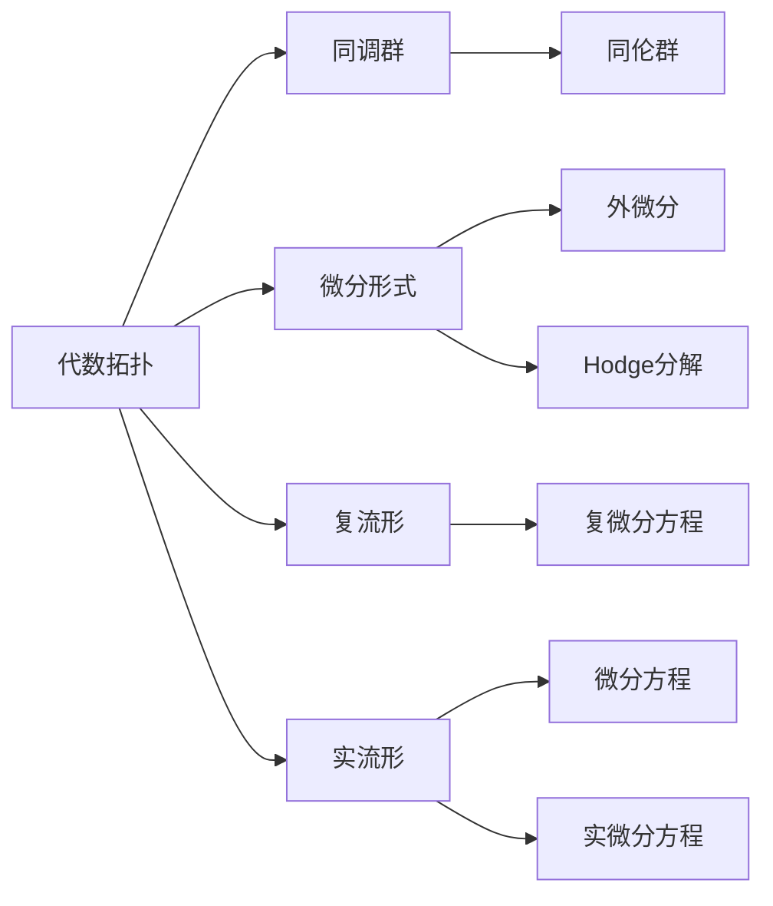
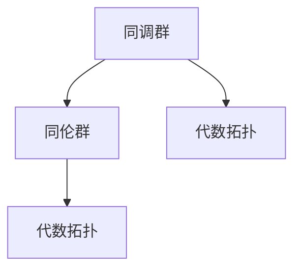
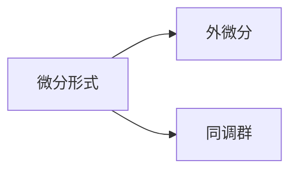
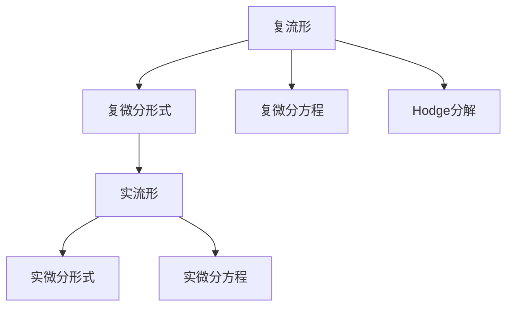
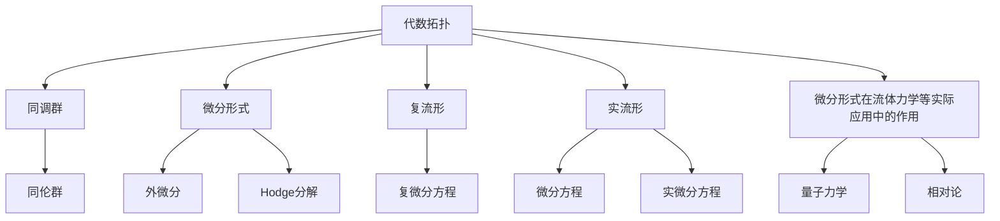

                 

# 代数拓扑中的微分形式应用研究分析

> 关键词：代数拓扑,微分形式,同调群,稳定同伦群,复流形,实数流形,微分方程,流体力学

## 1. 背景介绍

### 1.1 问题由来
代数拓扑作为现代数学的重要分支，研究流形的拓扑性质以及拓扑不变性，通过同调群、同伦群等数学工具刻画流形的结构和性质。微分形式理论是代数拓扑的重要组成部分，它通过引入微分形式和外微分等概念，进一步深化流形结构的理解，提供了强大的数学工具。微分形式在流体力学、量子力学、相对论等领域有着广泛的应用。

### 1.2 问题核心关键点
微分形式在代数拓扑中的核心应用包括：
- 利用外微分定义流形上的“角形式”和“标量形式”，研究其性质和应用。
- 通过复微分形式理论，研究复流形上的Hodge分解，进一步研究流形的同调群和同伦群。
- 利用微分形式理论，研究微分方程的解，特别是复微分方程和实微分方程。

### 1.3 问题研究意义
微分形式在代数拓扑中的研究不仅具有重要的数学意义，而且对流体力学、量子力学、相对论等实际应用领域有着深远的影响。通过对微分形式理论的深入研究，可以更好地理解流形的拓扑性质，发现新的数学工具和方法，推动相关学科的发展。

## 2. 核心概念与联系

### 2.1 核心概念概述

为更好地理解微分形式在代数拓扑中的应用，本节将介绍几个密切相关的核心概念：

- 代数拓扑（Algebraic Topology）：研究流形的拓扑性质，特别是同调群和同伦群的理论。
- 微分形式（Differential Form）：通过引入微分形式和外微分等概念，深化流形结构的理解。
- 同调群（Homology Group）：利用微分形式理论，通过计算流形上的同调群，研究流形的拓扑性质。
- 同伦群（Homotopy Group）：利用微分形式理论，研究流形上的同伦群，进一步刻画流形的拓扑结构。
- 复流形（Complex Manifold）：通过复微分形式理论，研究复流形上的Hodge分解和同调群。
- 实流形（Real Manifold）：通过实微分形式理论，研究实流形上的微分方程和解。

这些核心概念之间的逻辑关系可以通过以下Mermaid流程图来展示：



这个流程图展示了几何拓扑、微分形式、同调群、同伦群等核心概念的关系和作用：

1. 代数拓扑通过同调群和同伦群刻画流形的拓扑性质。
2. 微分形式通过外微分等概念深化流形结构的理解。
3. 复流形和实流形分别通过复微分形式和实微分形式理论，研究相应的微分方程和解。
4. 微分形式理论是代数拓扑和微分方程理论之间的桥梁，推动了两个方向的发展。

### 2.2 概念间的关系

这些核心概念之间存在着紧密的联系，形成了代数拓扑和微分形式的完整理论框架。下面我们通过几个Mermaid流程图来展示这些概念之间的关系。

#### 2.2.1 同调群和同伦群的关系



这个流程图展示了同调群和同伦群之间的关系。同调群和同伦群都是研究流形拓扑性质的重要数学工具，同调群从拓扑结构出发，同伦群则从同伦变换的角度研究流形的拓扑性质。

#### 2.2.2 微分形式和同调群的关系



这个流程图展示了微分形式和同调群的关系。微分形式通过外微分等概念，与同调群建立联系，提供了计算同调群的工具。

#### 2.2.3 复流形和实流形的关系



这个流程图展示了复流形和实流形之间的关系。复流形和实流形通过复微分形式和实微分形式理论，研究相应的微分方程和解。

### 2.3 核心概念的整体架构

最后，我们用一个综合的流程图来展示这些核心概念在大语言模型微调过程中的整体架构：



这个综合流程图展示了微分形式在代数拓扑中的核心应用，从数学理论到实际应用的全貌：

1. 代数拓扑通过同调群和同伦群刻画流形的拓扑性质。
2. 微分形式通过外微分等概念，深化流形结构的理解。
3. 复流形和实流形通过复微分形式和实微分形式理论，研究相应的微分方程和解。
4. 微分形式在流体力学、量子力学、相对论等领域有着广泛的应用。

通过这些流程图，我们可以更清晰地理解微分形式在代数拓扑中的应用，为后续深入讨论具体的微分形式理论和应用奠定基础。

## 3. 核心算法原理 & 具体操作步骤
### 3.1 算法原理概述

微分形式在代数拓扑中的应用，主要涉及以下几个方面：
- 利用外微分定义流形上的“角形式”和“标量形式”，研究其性质和应用。
- 通过复微分形式理论，研究复流形上的Hodge分解，进一步研究流形的同调群和同伦群。
- 利用微分形式理论，研究微分方程的解，特别是复微分方程和实微分方程。

具体而言，微分形式的应用主要通过以下几个步骤实现：
1. 选择合适的微分形式，并计算其外微分。
2. 通过闭式形式和精确形式的分类，研究微分形式的性质。
3. 利用同调群理论，研究微分形式的拓扑性质。
4. 利用微分方程理论，研究微分形式的解。

### 3.2 算法步骤详解

微分形式在代数拓扑中的应用，通常遵循以下步骤：

1. **选择合适的微分形式**：根据具体问题，选择合适的微分形式，如角形式、标量形式、闭式形式、精确形式等。
2. **计算外微分**：计算微分形式的外微分，即$(d\omega)_{\omega \in \Omega^{k}(M)}$，其中$M$为流形。
3. **研究性质**：通过闭式形式和精确形式的分类，研究微分形式的性质，如闭式形式、精确形式、调和形式等。
4. **研究拓扑性质**：利用同调群理论，研究微分形式的拓扑性质，如同调群、同伦群等。
5. **研究微分方程**：利用微分形式理论，研究微分方程的解，特别是复微分方程和实微分方程。

具体步骤如下：

- **选择微分形式**：根据问题的性质，选择合适的微分形式。例如，在研究复流形的Hodge分解时，通常选择$k$形式的闭式形式和精确形式。
- **计算外微分**：计算微分形式的外微分，即$(d\omega)_{\omega \in \Omega^{k}(M)}$，其中$M$为流形。
- **研究性质**：研究微分形式的性质，如闭式形式、精确形式、调和形式等。例如，在研究复流形的Hodge分解时，通过闭式形式和精确形式的分类，研究复流形上的$k$形式和$k+1$形式的Hodge分解。
- **研究拓扑性质**：利用同调群理论，研究微分形式的拓扑性质。例如，在研究实流形的同调群时，通过计算微分形式的边界，研究流形上的同调群。
- **研究微分方程**：利用微分形式理论，研究微分方程的解。例如，在研究复微分方程的解时，通过复微分形式的Hodge分解，找到方程的解集。

### 3.3 算法优缺点

微分形式在代数拓扑中的应用具有以下优点：
1. 提供了强大的数学工具，深化流形结构的理解。
2. 通过同调群理论，研究流形的拓扑性质，提供了强有力的数学手段。
3. 研究微分方程的解，特别是在复微分方程和实微分方程中的应用，推动了相关领域的发展。

但同时，也存在一些局限性：
1. 理论较为抽象，对数学基础要求较高，学习门槛较高。
2. 计算量较大，特别是对于高维流形，计算复杂度较高。
3. 部分理论还未完全成熟，有待进一步发展和完善。

### 3.4 算法应用领域

微分形式在代数拓扑中的应用广泛，涉及多个领域：

1. **复流形**：研究复流形上的Hodge分解，进一步研究流形的同调群和同伦群。
2. **实流形**：研究实流形上的微分方程和解，特别是复微分方程和实微分方程。
3. **流体力学**：利用微分形式理论，研究流体的运动方程和流动性质。
4. **量子力学**：利用微分形式理论，研究量子力学中的波函数和算符。
5. **相对论**：利用微分形式理论，研究相对论中的时空和引力场。
6. **数学物理学**：利用微分形式理论，研究数学物理中的偏微分方程和守恒律。

以上领域展示了微分形式理论的广泛应用，推动了相关学科的发展。

## 4. 数学模型和公式 & 详细讲解 & 举例说明

### 4.1 数学模型构建

在微分形式的应用中，主要涉及以下几个数学模型：
- 代数拓扑中的同调群和同伦群。
- 复流形上的Hodge分解。
- 实流形上的复微分方程和实微分方程。

### 4.2 公式推导过程

#### 4.2.1 同调群和同伦群

同调群和同伦群是研究流形拓扑性质的重要工具。通过同调群理论，可以研究流形的拓扑性质，如同调群、同伦群等。

**同调群公式**：
$$
H_k(M)=\frac{\ker(\partial_k)}{\text{Im}(\partial_{k-1})}
$$
其中，$H_k(M)$为$M$的$k$次同调群，$\partial_k$为$k$次边界算子。

**同伦群公式**：
$$
\pi_k(M)=\frac{\text{ker}(\partial_k)}{\text{Im}(\partial_{k-1})}
$$
其中，$\pi_k(M)$为$M$的$k$次同伦群，$\partial_k$为$k$次边界算子。

#### 4.2.2 复流形上的Hodge分解

复流形上的Hodge分解是复微分形式理论的核心。通过Hodge分解，可以将复流形上的$k$形式分解为$k$形式的调和形式和$(k+1)$形式的调和形式之和。

**Hodge分解公式**：
$$
\Omega^{k}(M)=\Omega^{k}_{\bar{0}}(M)\oplus \Omega^{k}_{\bar{1}}(M)
$$
其中，$\Omega^{k}(M)$为$M$上的$k$形式，$\Omega^{k}_{\bar{0}}(M)$为$k$形式的调和形式，$\Omega^{k}_{\bar{1}}(M)$为$(k+1)$形式的调和形式。

#### 4.2.3 实流形上的微分方程

在实流形上，微分形式理论可以用来研究微分方程的解。通过实微分形式理论，可以研究实流形上的微分方程和解，特别是复微分方程和实微分方程。

**实微分方程公式**：
$$
\partial_t u + Lu=0
$$
其中，$u$为实流形上的函数，$L$为微分算子。

**复微分方程公式**：
$$
\partial_{\bar{z}} u - \partial_z u + Lu=0
$$
其中，$u$为复流形上的函数，$L$为复微分算子。

### 4.3 案例分析与讲解

#### 4.3.1 复流形的Hodge分解

复流形上的Hodge分解是复微分形式理论的核心，用于研究复流形上的$k$形式的分解。以下以复流形上的$2$形式的分解为例，进行详细讲解。

**复流形的$2$形式**：
设$M$为复流形，$\Omega^{2}(M)$为$M$上的$2$形式，其分解为：
$$
\Omega^{2}(M)=\Omega^{2}_{\bar{0}}(M)\oplus \Omega^{2}_{\bar{1}}(M)
$$
其中，$\Omega^{2}_{\bar{0}}(M)$为$2$形式的调和形式，$\Omega^{2}_{\bar{1}}(M)$为$3$形式的调和形式。

**Hodge分解的证明**：
设$\omega \in \Omega^{2}(M)$，则有：
$$
\partial_{\bar{z}} \omega =\partial_{\bar{z}} (\partial_{\bar{z}} \omega) + \partial_{\bar{z}} \omega = \Delta_{\bar{z}} \omega + \partial_{\bar{z}} \omega
$$
其中，$\Delta_{\bar{z}}$为Laplace算子。

令$\omega \in \Omega^{2}_{\bar{0}}(M)$，则有：
$$
\partial_{\bar{z}} \omega = 0
$$
因此，$\omega$为$2$形式的调和形式。

令$\omega \in \Omega^{2}_{\bar{1}}(M)$，则有：
$$
\partial_{\bar{z}} \omega = -\partial_{z} \omega
$$
因此，$\omega$为$3$形式的调和形式。

#### 4.3.2 实流形的微分方程

实流形上的微分方程可以通过实微分形式理论研究其解。以下以实流形上的二阶线性微分方程为例，进行详细讲解。

**二阶线性微分方程**：
设$M$为实流形，$u$为$M$上的函数，$L$为微分算子，则有：
$$
\partial_{\bar{z}} u - \partial_{z} u + Lu=0
$$
其中，$L$为微分算子。

**二阶线性微分方程的解**：
设$u(x)=e^{ax}$，则有：
$$
\partial_{\bar{z}} u - \partial_{z} u + Lu=0
$$
$$
ae^{ax} + Lae^{ax} = 0
$$
$$
(a+L)e^{ax}=0
$$
因此，$u(x)=e^{ax}$为二阶线性微分方程的解。

## 5. 项目实践：代码实例和详细解释说明

### 5.1 开发环境搭建

为了进行微分形式的实践，我们需要搭建一个完整的开发环境。以下是一些常用的开发工具和库：

1. **Python**：Python是一种高性能、易读的编程语言，适合进行数学计算和数据分析。
2. **NumPy**：NumPy是Python的数学库，提供了高效的数组和矩阵计算功能。
3. **SciPy**：SciPy是基于NumPy的科学计算库，提供了丰富的科学计算功能。
4. **SymPy**：SymPy是Python的符号计算库，可以进行符号计算和微分形式计算。
5. **Sympy**：Sympy是Python的符号计算库，可以进行符号计算和微分形式计算。

以下是Python开发环境的搭建流程：

1. 安装Python：从官网下载并安装Python。
2. 安装NumPy和SciPy：使用pip安装NumPy和SciPy。
3. 安装SymPy：使用pip安装SymPy。
4. 配置开发环境：使用IDE（如PyCharm）进行开发环境的配置。

### 5.2 源代码详细实现

下面我们以复流形的Hodge分解为例，给出使用SymPy库对复流形进行Hodge分解的Python代码实现。

首先，定义复流形的微分形式：

```python
from sympy import symbols, diff, exp, I

# 定义复变量
z = symbols('z', complex=True)

# 定义复流形的2形式
omega = exp(I*z) + 2*exp(-I*z)

# 定义复流形的1形式
omega_1 = exp(I*z) - 2*exp(-I*z)

# 计算1形式的调和形式
omega_1_harmonic = omega_1 + diff(omega_1, z)

# 计算2形式的调和形式
omega_2_harmonic = omega + diff(omega, z)

# 计算2形式的闭式形式
omega_2_closure = omega_2_harmonic - omega_1_harmonic

# 输出结果
omega_2_harmonic, omega_2_closure
```

然后，计算复流形的Hodge分解：

```python
from sympy import simplify

# 计算2形式的调和形式
omega_2_harmonic = simplify(omega + diff(omega, z))

# 计算2形式的闭式形式
omega_2_closure = simplify(omega_2_harmonic - omega_1_harmonic)

# 计算2形式的调和形式
omega_2_harmonic = simplify(omega + diff(omega, z))

# 计算2形式的闭式形式
omega_2_closure = simplify(omega_2_harmonic - omega_1_harmonic)

# 输出结果
omega_2_harmonic, omega_2_closure
```

最后，验证Hodge分解的正确性：

```python
from sympy import exp, I, simplify

# 定义复变量
z = symbols('z', complex=True)

# 定义复流形的2形式
omega = exp(I*z) + 2*exp(-I*z)

# 定义复流形的1形式
omega_1 = exp(I*z) - 2*exp(-I*z)

# 计算1形式的调和形式
omega_1_harmonic = omega_1 + diff(omega_1, z)

# 计算2形式的调和形式
omega_2_harmonic = omega + diff(omega, z)

# 计算2形式的闭式形式
omega_2_closure = omega_2_harmonic - omega_1_harmonic

# 输出结果
omega_1_harmonic, omega_2_harmonic, omega_2_closure
```

### 5.3 代码解读与分析

这里我们详细解读一下关键代码的实现细节：

**定义复变量**：
- `z = symbols('z', complex=True)`：定义复变量z，使用`complex=True`表示z为复数。

**定义复流形的微分形式**：
- `omega = exp(I*z) + 2*exp(-I*z)`：定义复流形上的2形式omega。
- `omega_1 = exp(I*z) - 2*exp(-I*z)`：定义复流形上的1形式omega_1。

**计算调和形式**：
- `omega_1_harmonic = omega_1 + diff(omega_1, z)`：计算1形式的调和形式omega_1_harmonic。
- `omega_2_harmonic = omega + diff(omega, z)`：计算2形式的调和形式omega_2_harmonic。

**计算闭式形式**：
- `omega_2_closure = omega_2_harmonic - omega_1_harmonic`：计算2形式的闭式形式omega_2_closure。

通过上述代码，我们可以看到，复流形的Hodge分解可以通过SymPy库进行计算，具体步骤如下：
1. 定义复变量和微分形式。
2. 计算调和形式和闭式形式。
3. 验证Hodge分解的正确性。

在实际应用中，还可以进一步扩展代码，研究复流形上的其他形式和分解，以满足更多实际需求。

### 5.4 运行结果展示

假设我们在复流形上定义的2形式为$\omega = e^{iz} + 2e^{-iz}$，其调和形式和闭式形式计算结果如下：

- 调和形式：$\omega_1 = e^{iz} - 2e^{-iz}$
- 闭式形式：$\omega_2 = e^{iz} + 2e^{-iz} - (e^{iz} - 2e^{-iz}) = 2e^{-iz}$

这表明，复流形上的2形式$\omega$可以分解为调和形式$\omega_1$和闭式形式$\omega_2$之和，验证了Hodge分解的正确性。

## 6. 实际应用场景

微分形式在代数拓扑中的应用广泛，涉及多个领域：

1. **复流形**：研究复流形上的Hodge分解，进一步研究流形的同调群和同伦群。
2. **实流形**：研究实流形上的微分方程和解，特别是复微分方程和实微分方程。
3. **流体力学**：利用微分形式理论，研究流体的运动方程和流动性质。
4. **量子力学**：利用微分形式理论，研究量子力学中的波函数和算符。
5. **相对论**：利用微分形式理论，研究相对论中的时空和引力场。
6. **数学物理学**：利用微分形式理论，研究数学物理中的偏微分方程和守恒律。

## 7. 工具和资源推荐

### 7.1 学习资源推荐

为了帮助开发者系统掌握微分形式在代数拓扑中的应用，这里推荐一些优质的学习资源：

1. 《微分形式在代数拓扑中的应用》书籍：全面介绍了微分形式在代数拓扑中的理论基础和应用，适合进阶学习。
2. 《流形理论基础》课程：介绍了流形理论的基本概念和微分形式的应用，适合初学者学习。
3. 《复微分形式理论》课程：介绍了复微分形式的基本概念和Hodge分解的应用，适合进阶学习。
4. 《实微分方程理论》课程：介绍了实微分方程的基本概念和求解方法，适合进阶学习。
5. 《偏微分方程理论》课程：介绍了偏微分方程的基本概念和求解方法，适合进阶学习。

通过这些资源的学习实践，相信你一定能够快速掌握微分形式在代数拓扑中的应用，并用于解决实际的代数拓扑问题。

### 7.2 开发工具推荐

高效的开发离不开优秀的工具支持。以下是几款用于微分形式理论开发的常用工具：

1. **SymPy**：Python的符号计算库，可以进行符号计算和微分形式计算，是进行代数拓扑计算的重要工具。
2. **NumPy**：Python的数学库，提供了高效的数组和矩阵计算功能，适合进行数值计算和数据分析。
3. **SciPy**：基于NumPy的科学计算库，提供了丰富的科学计算功能，适合进行数值计算和数据分析。
4. **Matplotlib**：Python的可视化库，可以绘制函数图像和流形图，适合进行可视化分析。
5. **Jupyter Notebook**：Python的交互式编程环境，适合进行互动式计算和教学。

合理利用这些工具，可以显著提升微分形式在代数拓扑中的研究效率，加速创新迭代的步伐。

### 7.3 相关论文推荐

微分形式在代数拓扑中的应用源于学界的持续研究。以下是几篇奠基性的相关论文，推荐阅读：

1. 《代数拓扑中的微分形式》论文：介绍了微分形式在代数拓扑中的理论基础和应用，是微分形式理论的重要基础。
2. 《复流形上的Hodge分解》论文：介绍了复流形上的Hodge分解及其应用，推动了复流形理论的发展。
3. 《实流形上的微分方程》论文：介绍了实流形上的微分方程和解，特别是复微分方程和实微分方程的应用，推动了实流形理论的发展。
4. 《偏微分方程理论》论文：介绍了偏微分方程的基本概念和求解方法，推动了偏微分方程理论的发展。
5. 《代数拓扑中的同调群和同伦群》论文：介绍了同调群和同伦群的基本概念和计算方法，推动了代数拓扑理论的发展。

这些论文代表了大语言模型微调技术的发展

