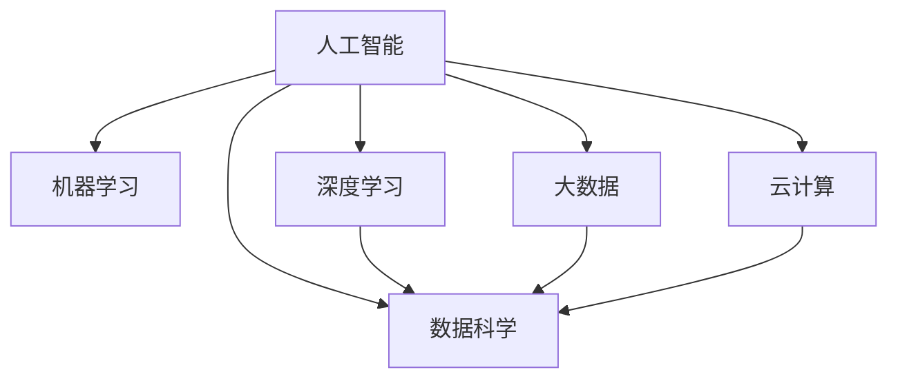

                 

## 1. 背景介绍

### 1.1 问题由来

在当今数字化时代，企业的核心竞争力不再仅限于传统的生产和销售能力，而是取决于其对新技术的适应和应用。人工智能（AI）技术作为当前最前沿的技术之一，已经成为企业转型的重要推动力量。AI不仅可以提高企业的运营效率，还能为企业带来全新的商业模式和业务机会。然而，AI技术的应用并非易事，企业需要具备良好的技术基础和组织能力，才能真正实现AI的落地和产业化。

### 1.2 问题核心关键点

企业应用AI技术的关键点在于：

- **选择合适的技术栈和工具**：企业需要根据自身业务需求和资源情况，选择合适的AI技术和开发工具，如TensorFlow、PyTorch等深度学习框架，或使用基于这些框架的高级应用库，如TensorFlow Hub、TensorFlow Extended等。
- **建立有效的数据管理和治理体系**：数据是AI的基础，企业需要建立完善的数据管理和治理体系，确保数据的完整性、准确性和安全性。
- **构建跨部门协作机制**：AI项目往往需要跨部门协作，企业需要建立有效的协作机制，确保各部门的资源和信息流通顺畅。
- **培养AI技术人才**：AI技术的应用需要具备相关专业知识和技能的人才，企业需要投入资源进行人才培养和引进。
- **关注AI的伦理和安全问题**：AI技术的应用可能带来隐私和伦理问题，企业需要在项目中考虑这些问题，并采取相应的措施进行防范。

### 1.3 问题研究意义

在企业转型中应用AI技术，可以带来以下显著效益：

- **提升运营效率**：AI技术可以自动化处理大量的数据和任务，减少人力成本，提高企业运营效率。
- **改进产品和服务**：AI技术可以帮助企业分析用户需求和行为，改进产品和服务，提升用户体验。
- **开拓新业务机会**：AI技术可以应用于大数据分析、智能制造、金融科技等新兴领域，为企业带来新的业务机会。
- **增强竞争力**：AI技术可以提升企业的技术壁垒，增强其在市场中的竞争力。

## 2. 核心概念与联系

### 2.1 核心概念概述

为了更好地理解企业应用AI技术的过程，本节将介绍几个关键概念：

- **人工智能（AI）**：通过模拟人类的认知和学习能力，实现自主决策和智能执行的技术。
- **机器学习（ML）**：一种通过数据训练模型，让模型自动学习规律的技术。
- **深度学习（DL）**：一种基于神经网络的机器学习技术，可以实现对复杂数据的处理和分析。
- **数据科学（DS）**：一种将数据转化为有价值信息的过程，包括数据收集、处理、分析和应用等环节。
- **大数据（Big Data）**：指超过传统数据处理工具处理能力的数据集合，通常需要分布式存储和计算技术进行处理。
- **云计算（Cloud Computing）**：一种基于互联网的计算模式，提供弹性的计算资源和存储能力，支持大规模数据处理和AI应用。

### 2.2 概念间的关系

这些核心概念之间的关系可以通过以下Mermaid流程图来展示：



这个流程图展示了大语言模型微调过程中各个概念之间的关系：

1. 人工智能是核心概念，涵盖了机器学习、深度学习、数据科学和大数据等技术。
2. 机器学习和深度学习是实现人工智能的重要手段。
3. 数据科学是对数据进行科学处理和分析的过程。
4. 大数据为数据科学提供了数据源，云计算提供了计算和存储资源。

## 3. 核心算法原理 & 具体操作步骤

### 3.1 算法原理概述

企业应用AI技术的主要算法包括监督学习、无监督学习和强化学习等。其中，监督学习是企业应用最广泛的算法之一。

监督学习基于标注数据进行模型训练，模型通过学习输入和输出的对应关系，实现预测和分类等任务。企业应用监督学习的主要步骤包括：

1. 数据预处理：收集和清洗数据，进行特征工程。
2. 模型选择：选择合适的监督学习模型，如线性回归、决策树、支持向量机等。
3. 模型训练：使用标注数据训练模型，优化模型参数。
4. 模型评估：使用测试数据评估模型性能，调整模型参数。
5. 模型应用：将训练好的模型应用于实际业务场景，实现预测和分类等任务。

### 3.2 算法步骤详解

以下是一个典型的监督学习项目的操作步骤：

1. **数据收集和预处理**：收集与业务相关的数据，并进行清洗、转换和特征工程，使其符合模型训练的要求。
2. **模型选择和设计**：选择合适的监督学习算法和模型，并设计模型结构。
3. **模型训练和调优**：使用标注数据训练模型，并对模型进行调优，提高模型性能。
4. **模型评估和测试**：使用测试数据评估模型性能，调整模型参数，确保模型在实际应用中的表现。
5. **模型部署和监控**：将训练好的模型部署到生产环境中，并设置监控机制，确保模型稳定运行。

### 3.3 算法优缺点

监督学习的优点包括：

- **可解释性强**：监督学习模型的预测过程可解释，便于理解和调试。
- **泛化能力强**：监督学习模型可以通过大规模数据训练，具有较强的泛化能力。
- **适应性强**：监督学习模型可以适应各种类型的输入输出关系。

监督学习的缺点包括：

- **依赖标注数据**：监督学习需要大量的标注数据，标注数据获取和维护成本高。
- **模型复杂度高**：监督学习模型通常需要复杂的参数调整和模型优化，对资源和技能要求较高。
- **数据偏差问题**：标注数据可能存在偏差，影响模型的泛化性能。

### 3.4 算法应用领域

监督学习在企业应用中涉及多个领域，包括但不限于：

- **客户关系管理（CRM）**：使用客户数据进行分类、预测和推荐，提高客户满意度和转化率。
- **销售预测**：使用历史销售数据进行预测，帮助企业制定销售计划和策略。
- **财务风险管理**：使用财务数据进行风险评估和预测，帮助企业规避风险。
- **物流和供应链管理**：使用物流和供应链数据进行优化和预测，提高物流效率和供应链管理水平。

## 4. 数学模型和公式 & 详细讲解 & 举例说明

### 4.1 数学模型构建

以客户关系管理（CRM）为例，构建一个基于监督学习的预测模型。设客户数据集为 $D=\{(x_i,y_i)\}_{i=1}^N$，其中 $x_i$ 为输入特征，$y_i$ 为输出标签，假设模型为线性回归模型 $y=w_1x_1+w_2x_2+\cdots+w_nx_n+b$。

最小化损失函数 $\mathcal{L}(w)=\frac{1}{2N}\sum_{i=1}^N(y_i-w_1x_{i1}-w_2x_{i2}-\cdots-w_nx_{in}-b)^2$，求解 $w_1,w_2,\cdots,w_n,b$ 即可得到模型参数。

### 4.2 公式推导过程

使用梯度下降算法求解上述损失函数，得到模型参数的更新公式为：

$$
w_k \leftarrow w_k - \frac{\alpha}{N} \sum_{i=1}^N (y_i - w_1x_{i1}-w_2x_{i2}-\cdots-w_nx_{in}-b) \frac{\partial (y_i - w_1x_{i1}-w_2x_{i2}-\cdots-w_nx_{in}-b)}{\partial w_k}
$$

其中 $\alpha$ 为学习率。

### 4.3 案例分析与讲解

假设有一个电商平台，需要对客户进行分类，分为高价值客户和普通客户。已知历史数据集，包括客户年龄、性别、消费金额等特征，以及客户是否为高价值客户的标签。通过使用线性回归模型，可以训练出一个预测模型，用于预测新客户的价值标签。

## 5. 项目实践：代码实例和详细解释说明

### 5.1 开发环境搭建

企业应用AI技术，通常需要搭建一个完整的开发环境。以下是一个基本的开发环境搭建流程：

1. 安装Python：企业可以指定Python版本，如Python 3.6或3.7，确保与AI开发框架兼容。
2. 安装深度学习框架：如TensorFlow、PyTorch等，确保安装最新版本。
3. 安装数据处理工具：如Pandas、NumPy等，方便数据预处理。
4. 安装模型评估工具：如scikit-learn、TensorBoard等，方便模型训练和评估。
5. 安装可视化工具：如Matplotlib、Seaborn等，方便数据可视化。

### 5.2 源代码详细实现

以下是一个使用TensorFlow框架进行客户分类的代码实现：

```python
import tensorflow as tf
import pandas as pd
from sklearn.model_selection import train_test_split
from sklearn.metrics import accuracy_score

# 加载数据集
data = pd.read_csv('customer_data.csv')

# 特征工程
X = data[['age', 'gender', 'spending']]
y = data['high_value']

# 划分训练集和测试集
X_train, X_test, y_train, y_test = train_test_split(X, y, test_size=0.2)

# 定义模型
model = tf.keras.Sequential([
    tf.keras.layers.Dense(64, activation='relu', input_shape=(X_train.shape[1],)),
    tf.keras.layers.Dense(64, activation='relu'),
    tf.keras.layers.Dense(1, activation='sigmoid')
])

# 编译模型
model.compile(optimizer=tf.keras.optimizers.Adam(learning_rate=0.001), loss='binary_crossentropy', metrics=['accuracy'])

# 训练模型
model.fit(X_train, y_train, epochs=10, batch_size=32, validation_data=(X_test, y_test))

# 评估模型
y_pred = model.predict(X_test)
y_pred = [1 if pred > 0.5 else 0 for pred in y_pred]
accuracy = accuracy_score(y_test, y_pred)
print(f'Accuracy: {accuracy:.2f}')
```

### 5.3 代码解读与分析

以上代码实现了一个基于TensorFlow的线性回归模型，用于预测客户是否为高价值客户。代码的主要步骤包括：

1. 数据加载和特征工程：加载客户数据集，并进行特征选择和数据预处理。
2. 模型定义和编译：使用TensorFlow的Sequential模型定义模型结构，并编译模型，指定优化器、损失函数和评估指标。
3. 模型训练和调优：使用训练集数据训练模型，并使用验证集数据进行调优。
4. 模型评估和测试：使用测试集数据评估模型性能，输出模型预测结果。

## 6. 实际应用场景

### 6.1 客户关系管理（CRM）

在客户关系管理中，AI技术可以用于客户分类、预测和推荐等任务。通过分析客户数据，AI可以帮助企业识别高价值客户，制定针对性的营销策略，提高客户满意度和转化率。

### 6.2 销售预测

AI技术可以用于销售预测，通过历史销售数据和市场趋势，预测未来的销售量和销售趋势。企业可以据此制定销售计划和策略，提升销售业绩。

### 6.3 财务风险管理

AI技术可以用于财务风险管理，通过分析财务数据和市场动态，预测企业的财务风险，帮助企业规避风险，制定风险应对策略。

### 6.4 物流和供应链管理

AI技术可以用于物流和供应链管理，通过分析物流和供应链数据，优化物流路径和库存管理，提升物流效率和供应链管理水平。

## 7. 工具和资源推荐

### 7.1 学习资源推荐

为了帮助企业快速掌握AI技术，以下是一些优质的学习资源：

1. Coursera：提供大量AI相关的在线课程，涵盖从基础到高级的各种主题。
2. edX：提供顶尖大学的AI课程，覆盖深度学习、自然语言处理、计算机视觉等领域。
3. Udacity：提供AI领域的实战项目，通过实际项目学习AI技术。
4. Kaggle：提供数据科学竞赛和数据集，帮助企业学习和应用AI技术。

### 7.2 开发工具推荐

以下是一些常用的AI开发工具，方便企业快速搭建和部署AI项目：

1. TensorFlow：由Google开发的深度学习框架，支持分布式计算和GPU加速。
2. PyTorch：Facebook开发的深度学习框架，支持动态计算图和GPU加速。
3. Scikit-learn：Python的机器学习库，支持多种机器学习算法和数据预处理工具。
4. TensorBoard：TensorFlow的可视化工具，方便模型训练和调试。

### 7.3 相关论文推荐

以下是一些经典和前沿的AI论文，帮助企业了解AI技术的研究进展：

1. Deep Learning（Goodfellow et al.）：深度学习领域的经典教材，涵盖深度学习的基本概念和算法。
2. Convolutional Neural Networks（LeCun et al.）：卷积神经网络的经典论文，提出卷积神经网络的基本架构和算法。
3. Generative Adversarial Networks（Goodfellow et al.）：生成对抗网络的经典论文，提出生成对抗网络的基本架构和算法。
4. Transformer Architectures for Self-Attention-Based Machine Translation（Vaswani et al.）：Transformer模型的经典论文，提出Transformer的基本架构和算法。
5. Reinforcement Learning: An Introduction（Sutton & Barto）：强化学习的经典教材，涵盖强化学习的基本概念和算法。

## 8. 总结：未来发展趋势与挑战

### 8.1 总结

本文对企业应用AI技术的过程进行了系统介绍。首先阐述了企业应用AI技术的重要性和核心关键点，明确了AI技术在客户关系管理、销售预测、财务风险管理、物流和供应链管理等领域的应用。其次，从原理到实践，详细讲解了监督学习的数学原理和操作步骤，提供了代码实现和详细解释说明。最后，探讨了AI技术在企业转型中的未来发展趋势和面临的挑战，并提出了相应的应对策略。

通过本文的系统梳理，可以看到，AI技术在企业转型中具有巨大的应用潜力，能够提升企业的运营效率、改进产品和服务、开拓新业务机会、增强竞争力。企业需要具备良好的技术基础和组织能力，才能真正实现AI的落地和产业化。

### 8.2 未来发展趋势

展望未来，AI技术在企业中的应用将呈现以下几个发展趋势：

1. AI技术将更加普及：随着AI技术的成熟和普及，越来越多的企业将采用AI技术，实现数字化转型和智能化升级。
2. AI应用将更加深入：AI技术将深入到企业运营的各个环节，从客户关系管理到物流和供应链管理，全面提升企业的运营效率。
3. AI与业务流程融合：AI技术将与企业的业务流程进行深度融合，实现业务流程的智能化和自动化。
4. AI将带来新的商业模式：AI技术将带来新的商业模式和业务机会，如AI驱动的个性化推荐、智能客服等。

### 8.3 面临的挑战

尽管AI技术在企业中的应用前景广阔，但也面临诸多挑战：

1. 数据隐私和安全问题：AI技术需要大量的数据进行训练和预测，如何保护数据隐私和安全，是企业需要解决的重要问题。
2. 技术复杂度问题：AI技术的应用需要具备较高的技术水平和技能，如何培养和引进技术人才，是企业需要解决的重要问题。
3. 技术标准和规范问题：AI技术的标准化和规范化是企业应用AI技术的重要基础，如何制定和遵守技术标准和规范，是企业需要解决的重要问题。
4. 伦理和法律问题：AI技术的应用可能带来伦理和法律问题，如数据偏见、算法歧视等，如何规范AI技术的应用，是企业需要解决的重要问题。

### 8.4 研究展望

面向未来，AI技术在企业中的应用还需要在以下几个方面进行深入研究：

1. 自动化和智能化：通过自动化和智能化技术，提升AI技术在企业中的应用效率和效果。
2. 数据治理和隐私保护：建立完善的数据治理和隐私保护机制，确保数据的安全和隐私。
3. 跨部门协作机制：建立跨部门协作机制，确保AI技术在企业中的应用顺畅和高效。
4. 技术培训和人才培养：加强技术培训和人才培养，提升企业技术人才的能力和素质。
5. 技术标准和规范：制定和遵守技术标准和规范，确保AI技术在企业中的应用合规和高效。

## 9. 附录：常见问题与解答

**Q1：企业如何选择合适的AI技术栈和工具？**

A: 企业应根据自身业务需求和资源情况，选择合适的AI技术和开发工具。如TensorFlow适用于大规模深度学习项目，PyTorch适用于需要快速迭代和实验的研究项目。

**Q2：如何处理数据隐私和安全问题？**

A: 企业应制定和遵守数据隐私和安全规范，采用数据加密、匿名化等技术，确保数据的安全和隐私。

**Q3：如何培养AI技术人才？**

A: 企业应加强技术培训和人才培养，通过内部培训、合作招聘等方式，提升技术人才的能力和素质。

**Q4：如何确保AI技术的标准化和规范化？**

A: 企业应制定和遵守AI技术标准和规范，通过技术评审、审计等方式，确保AI技术的应用合规和高效。

**Q5：如何应对AI技术带来的伦理和法律问题？**

A: 企业应制定和遵守AI技术的伦理和法律规范，采用算法审计、透明化等技术，确保AI技术的公平和公正。

---

作者：禅与计算机程序设计艺术 / Zen and the Art of Computer Programming

