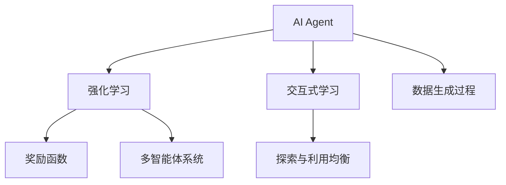
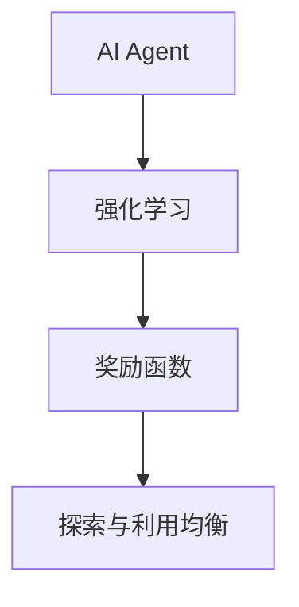
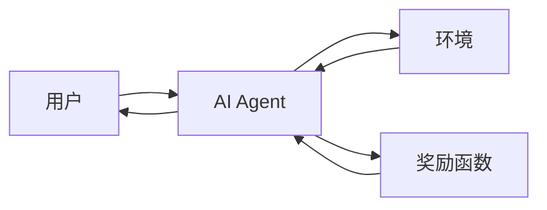
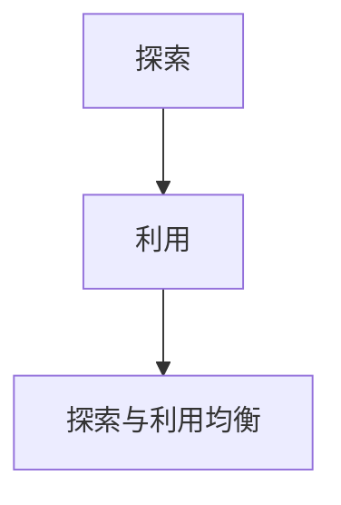
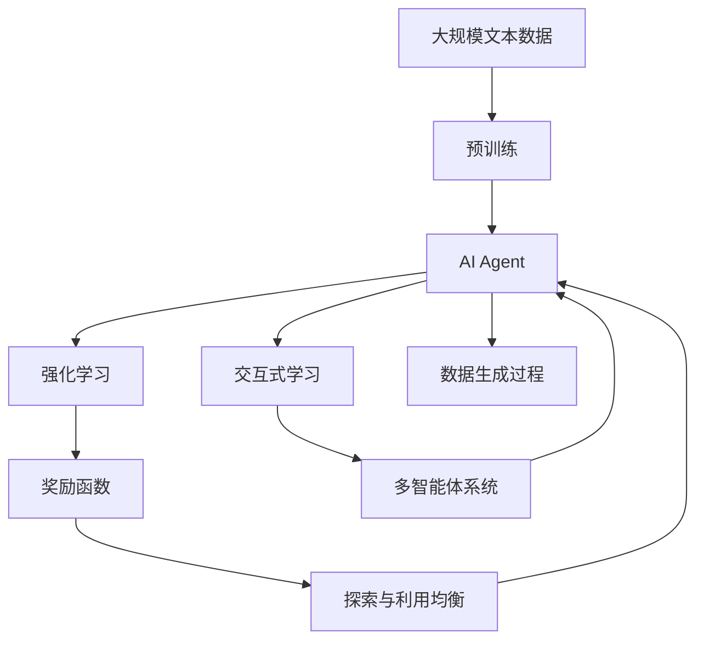

                 

# AI Agent: AI的下一个风口 交互式学习与决策优化

> 关键词：AI Agent,交互式学习,决策优化,强化学习,奖励函数,探索与利用均衡

## 1. 背景介绍

### 1.1 问题由来
人工智能(AI)的发展已进入深水区，其在图像识别、自然语言处理等领域取得了一系列的突破性进展。然而，AI的核心目标——自主决策与适应性，依然是一个极具挑战的课题。AI Agent，作为AI系统的一个重要分支，专注于构建能够自主学习和决策的智能体，是实现AI自主性的关键。近年来，随着深度学习、强化学习(Reinforcement Learning, RL)等技术的突破，AI Agent在自动驾驶、机器人控制、智能推荐等领域取得了一系列的进展，展现了广阔的应用前景。

然而，现有AI Agent往往依赖大量标注数据，缺乏与环境的交互性，难以应对复杂的动态环境。交互式学习(Interactive Learning)的提出，为解决这些问题提供了新的思路。通过在AI Agent中加入与环境的交互能力，使其能够通过人机交互、实时反馈等方式进行自适应学习，从而更好地适应动态变化的环境，实现更高效、鲁棒的决策。

### 1.2 问题核心关键点
交互式学习的核心在于AI Agent能够通过与环境的互动，不断优化其决策策略，逐步接近最优策略。其关键点包括：
- 人机交互接口：AI Agent需要具备与用户、环境交互的界面，能够接收指令、输出反馈。
- 动态环境建模：AI Agent需要建立对环境的动态模型，实时感知环境变化。
- 奖励函数设计：AI Agent需要设计合适的奖励函数，量化其在任务中的表现，指导优化过程。
- 探索与利用均衡：AI Agent需要在探索未知和利用已有知识之间找到平衡，避免陷入局部最优。

交互式学习的目标，是通过与环境的持续交互，逐步提升AI Agent的性能，最终达到在复杂动态环境中自主决策的目标。

### 1.3 问题研究意义
交互式学习对于提升AI Agent的自主性和适应性具有重要意义：

1. 提升决策效率：通过人机交互，AI Agent能够在实时环境中快速响应，优化决策路径，提升效率。
2. 增强鲁棒性：AI Agent能够从动态环境中获取更多信息，调整决策策略，增强鲁棒性。
3. 促进人类理解：通过与用户的交互，AI Agent能够更好地理解人类需求，提供更个性化的服务。
4. 加速模型训练：交互式学习可以通过实时反馈加速模型优化，缩短训练周期。
5. 推动技术创新：交互式学习促使AI Agent从被动的接受指令转向主动的探索学习，推动技术创新。

## 2. 核心概念与联系

### 2.1 核心概念概述

为更好地理解交互式学习，本节将介绍几个密切相关的核心概念：

- AI Agent: 能够自主学习和决策的智能体，是AI研究的核心目标。
- 强化学习: 通过环境反馈，优化智能体决策的机器学习技术，常用于构建AI Agent。
- 交互式学习: 通过与环境的交互，使AI Agent能够动态地调整其策略，逐步优化决策过程。
- 奖励函数: 量化AI Agent在环境中表现的量化指标，指导智能体进行策略优化。
- 探索与利用均衡: 智能体需要在探索未知和利用已有知识之间找到平衡，避免过拟合。
- 多智能体系统: 包含多个AI Agent的系统，通过协作和竞争提高整体性能。
- 数据生成过程: 在交互过程中，AI Agent生成数据，用于自我优化。

这些核心概念之间的逻辑关系可以通过以下Mermaid流程图来展示：



这个流程图展示了大语言模型微调过程中各个核心概念的关系：

1. AI Agent通过强化学习获取环境的反馈，进行策略优化。
2. 交互式学习使得AI Agent能够通过与环境交互，动态地调整策略。
3. 奖励函数定义了智能体的表现标准，指导优化过程。
4. 探索与利用均衡帮助AI Agent平衡探索未知和利用已有知识之间的关系。
5. 多智能体系统通过协作和竞争，提高整体性能。
6. 数据生成过程为AI Agent提供了持续优化所需的反馈信息。

这些核心概念共同构成了交互式学习的完整生态系统，使其能够更好地适应动态环境，实现自主决策。

### 2.2 概念间的关系

这些核心概念之间存在着紧密的联系，形成了交互式学习的完整生态系统。下面我通过几个Mermaid流程图来展示这些概念之间的关系。

#### 2.2.1 AI Agent的学习范式



这个流程图展示了大语言模型微调的基本原理，即通过强化学习获取环境反馈，定义奖励函数指导优化过程，并利用探索与利用均衡策略进行动态调整。

#### 2.2.2 交互式学习的关键环节



这个流程图展示了交互式学习的关键环节，包括用户、AI Agent与环境之间的互动，以及奖励函数的反馈机制。

#### 2.2.3 探索与利用均衡的策略



这个流程图展示了探索与利用均衡的基本策略，即在探索未知和利用已有知识之间找到平衡。

### 2.3 核心概念的整体架构

最后，我们用一个综合的流程图来展示这些核心概念在大语言模型微调过程中的整体架构：



这个综合流程图展示了从预训练到交互式学习的完整过程。大语言模型首先在大规模文本数据上进行预训练，然后通过强化学习获取环境反馈，动态调整策略，实现交互式学习。最终通过多智能体系统进行协作和竞争，优化整体性能。数据生成过程为AI Agent提供了持续优化所需的反馈信息。

## 3. 核心算法原理 & 具体操作步骤
### 3.1 算法原理概述

交互式学习的核心思想是利用环境反馈指导AI Agent进行策略优化。其核心算法为强化学习算法，通过定义合适的奖励函数，指导AI Agent在动态环境中逐步优化决策策略。

形式化地，假设AI Agent的策略为 $\pi$，环境的状态为 $s$，动作为 $a$，奖励为 $r$。则AI Agent的目标是最大化长期累积奖励 $\mathbb{E}[\sum_{t=1}^{\infty} \gamma^t r_t]$，其中 $\gamma$ 为折扣因子。

具体地，AI Agent通过以下步骤进行优化：
1. 观察当前状态 $s_t$。
2. 根据当前策略 $\pi$，选择一个动作 $a_t$。
3. 执行动作 $a_t$，观察下一个状态 $s_{t+1}$ 和奖励 $r_{t+1}$。
4. 根据新状态和奖励更新策略 $\pi$，使其最大化长期累积奖励。

交互式学习的关键在于如何设计合适的奖励函数 $r(s,a)$，使其能够准确反映智能体的表现，并指导优化过程。常见的奖励函数设计方法包括：
- 基于具体任务的奖励函数：根据具体任务定义合适的奖励函数，如分类任务中的准确率、生成任务中的交叉熵等。
- 基于系统的奖励函数：考虑系统整体表现，定义系统层面的奖励函数。
- 混合奖励函数：将具体任务和系统层面的奖励函数结合起来，综合考虑两者。

### 3.2 算法步骤详解

交互式学习的核心算法步骤主要包括：

**Step 1: 选择适当的奖励函数**
- 根据具体任务或系统需求，选择合适的奖励函数。如生成任务中，可以用交叉熵或BLEU分数作为奖励。

**Step 2: 定义环境**
- 定义AI Agent的操作环境，包括状态、动作和状态转移概率等。
- 设计环境模拟器，通过模拟环境获取AI Agent的表现反馈。

**Step 3: 初始化策略**
- 初始化AI Agent的策略 $\pi_0$，可以是随机策略或预设策略。
- 设定学习率 $\eta$ 和折扣因子 $\gamma$。

**Step 4: 交互式学习**
- 在每个时间步 $t$，AI Agent观察当前状态 $s_t$，根据当前策略 $\pi_t$ 选择一个动作 $a_t$。
- 执行动作 $a_t$，观察下一个状态 $s_{t+1}$ 和奖励 $r_{t+1}$。
- 根据当前策略和反馈更新模型参数，指导策略优化。
- 循环执行上述步骤，直到达到预设的迭代次数或达到预设的优化目标。

**Step 5: 策略评估与更新**
- 使用验证集评估当前策略 $\pi_t$ 的表现。
- 根据评估结果，选择是否更新策略。
- 若未达到优化目标，重复步骤4进行迭代优化。

### 3.3 算法优缺点

交互式学习具有以下优点：
1. 动态适应性：AI Agent能够通过与环境的持续交互，动态调整策略，适应环境变化。
2. 鲁棒性增强：通过实时反馈，AI Agent能够避免陷入局部最优，增强鲁棒性。
3. 加速模型优化：通过实时反馈和优化，加速AI Agent的学习过程。
4. 提高决策效率：通过人机交互，AI Agent能够在实时环境中快速响应，优化决策路径。

同时，交互式学习也存在以下缺点：
1. 需要大量计算资源：交互式学习需要大量的计算资源来处理实时数据，处理大量复杂的环境动态。
2. 数据依赖：交互式学习依赖于实时反馈，一旦反馈不充分或延迟，可能导致学习效果不佳。
3. 策略复杂：设计合适的奖励函数和优化策略需要丰富的经验和专业知识。
4. 交互界面设计：需要设计高效的人机交互界面，实现与用户的无缝交互。

### 3.4 算法应用领域

交互式学习已经在多个领域得到了应用，包括但不限于：

- 机器人控制：通过与环境实时交互，优化机器人行为策略，提升执行效率和鲁棒性。
- 自动驾驶：通过与交通环境互动，优化驾驶策略，提高安全性。
- 推荐系统：通过用户反馈，优化推荐策略，提升个性化推荐效果。
- 自然语言处理：通过对话系统反馈，优化语言模型，提升理解能力和生成能力。
- 智能客服：通过用户反馈，优化对话策略，提高客户满意度。

除了上述这些经典应用外，交互式学习还在游戏AI、金融决策、医疗诊断等多个领域展现出巨大的潜力，为AI Agent的应用提供了更多可能性。

## 4. 数学模型和公式 & 详细讲解  
### 4.1 数学模型构建

交互式学习的数学模型主要基于强化学习理论，以下对其中关键模型进行详细讲解。

假设AI Agent在每个时间步 $t$，观察状态 $s_t$，执行动作 $a_t$，获得奖励 $r_t$，状态转移到 $s_{t+1}$。则AI Agent的目标是最大化长期累积奖励 $\mathbb{E}[\sum_{t=1}^{\infty} \gamma^t r_t]$。

定义状态价值函数 $V(s)$ 为在状态 $s$ 下，采取最优策略 $\pi$ 获得的长期累积奖励。定义动作价值函数 $Q(s,a)$ 为在状态 $s$ 下，采取动作 $a$ 并执行 $\pi$ 策略获得的长期累积奖励。则有以下关系：

$$
V(s) = \max_{a} Q(s,a)
$$

$$
Q(s,a) = \mathbb{E}[r_{t+1} + \gamma V(s_{t+1}) | s_t = s, a_t = a]
$$

AI Agent的目标是最大化长期累积奖励，即最大化状态价值函数 $V(s)$。状态价值函数可以通过贝尔曼方程进行递推：

$$
V(s) = \max_{a} \mathbb{E}[r_{t+1} + \gamma V(s_{t+1}) | s_t = s, a_t = a]
$$

$$
V(s) = \max_{a} \sum_{s'} [p(s'|s,a) \mathbb{E}[r_{t+1} + \gamma V(s_{t+1}) | s_t = s, a_t = a] 
$$

其中 $p(s'|s,a)$ 为状态转移概率，$\mathbb{E}[r_{t+1} + \gamma V(s_{t+1}) | s_t = s, a_t = a]$ 为在状态 $s$ 下，采取动作 $a$ 的期望奖励和转移后的价值。

### 4.2 公式推导过程

以下对交互式学习的关键公式进行推导和解释：

1. 状态价值函数推导
$$
V(s) = \max_{a} \mathbb{E}[r_{t+1} + \gamma V(s_{t+1}) | s_t = s, a_t = a]
$$
$$
V(s) = \max_{a} \sum_{s'} [p(s'|s,a) \mathbb{E}[r_{t+1} + \gamma V(s_{t+1}) | s_t = s, a_t = a] 
$$
$$
V(s) = \max_{a} \sum_{s'} [p(s'|s,a) (r_{t+1} + \gamma V(s_{t+1}))
$$
$$
V(s) = \max_{a} \sum_{s'} [p(s'|s,a) r_{t+1} + \gamma p(s'|s,a) V(s_{t+1})]
$$
$$
V(s) = \max_{a} \sum_{s'} [p(s'|s,a) r_{t+1} + \gamma \mathbb{E}[V(s_{t+1}) | s_t = s, a_t = a]]
$$
$$
V(s) = \max_{a} \sum_{s'} [p(s'|s,a) r_{t+1} + \gamma V(s')]

通过迭代计算，可以求得每个状态的价值函数。

2. 动作价值函数推导
$$
Q(s,a) = \mathbb{E}[r_{t+1} + \gamma V(s_{t+1}) | s_t = s, a_t = a]
$$
$$
Q(s,a) = \sum_{s'} [p(s'|s,a) r_{t+1} + \gamma V(s')]
$$
$$
Q(s,a) = \sum_{s'} [p(s'|s,a) r_{t+1} + \gamma \max_{a'} Q(s',a')]
$$

通过迭代计算，可以求得每个状态-动作对的价值函数。

### 4.3 案例分析与讲解

假设我们构建一个AI Agent，用于在迷宫中寻找出口。AI Agent每步可以向上、下、左、右移动，迷宫状态表示为当前位置 $(x,y)$，出口状态为 $(10,10)$。我们定义动作-状态-奖励映射为 $r(x,y,a) = -1$，即每次移动会消耗1个能量单位。在出口状态，AI Agent获得10个能量单位作为奖励。状态转移概率为 $p(x',y'|x,y,a) = 0.9$。

在每个时间步，AI Agent观察当前状态 $(x,y)$，随机选择一个动作 $a$，获得奖励 $r$ 和下一个状态 $(x',y')$。AI Agent的目标是在迷宫中找到出口，最大化长期累积奖励。

首先，我们通过动态规划计算状态价值函数 $V$。设 $V_0$ 为起点 $(0,0)$ 的价值函数。根据贝尔曼方程，可以递推计算出每个状态的价值函数。

$$
V(0,0) = \max_{a} \sum_{x',y'} [p(x',y'|0,0,a) (-1 + \gamma V(x',y'))]
$$
$$
V(0,0) = \max_{a} (0.9(-1 + 10\gamma) + 0.1(-1 + \gamma V(1,0)) + 0.1(-1 + \gamma V(-1,0)) + 0.1(-1 + \gamma V(0,1)))
$$

通过迭代计算，可以求得 $V(0,0)$ 的值。

接下来，我们计算动作价值函数 $Q$。设 $Q_0$ 为起点 $(0,0)$ 的动作价值函数。根据贝尔曼方程，可以递推计算出每个状态-动作对的价值函数。

$$
Q(0,0,up) = \sum_{x',y'} [p(x',y'|0,0,up) (-1 + \gamma V(x',y'))]
$$
$$
Q(0,0,down) = \sum_{x',y'} [p(x',y'|0,0,down) (-1 + \gamma V(x',y'))]
$$
$$
Q(0,0,left) = \sum_{x',y'} [p(x',y'|0,0,left) (-1 + \gamma V(x',y'))]
$$
$$
Q(0,0,right) = \sum_{x',y'} [p(x',y'|0,0,right) (-1 + \gamma V(x',y'))]
$$

通过迭代计算，可以求得 $Q(0,0)$ 的所有动作价值函数。

## 5. 项目实践：代码实例和详细解释说明
### 5.1 开发环境搭建

在进行交互式学习实践前，我们需要准备好开发环境。以下是使用Python进行PyTorch开发的环境配置流程：

1. 安装Anaconda：从官网下载并安装Anaconda，用于创建独立的Python环境。

2. 创建并激活虚拟环境：
```bash
conda create -n pytorch-env python=3.8 
conda activate pytorch-env
```

3. 安装PyTorch：根据CUDA版本，从官网获取对应的安装命令。例如：
```bash
conda install pytorch torchvision torchaudio cudatoolkit=11.1 -c pytorch -c conda-forge
```

4. 安装Transformers库：
```bash
pip install transformers
```

5. 安装各类工具包：
```bash
pip install numpy pandas scikit-learn matplotlib tqdm jupyter notebook ipython
```

完成上述步骤后，即可在`pytorch-env`环境中开始交互式学习实践。

### 5.2 源代码详细实现

这里我们以迷宫问题为例，给出使用PyTorch进行强化学习的PyTorch代码实现。

首先，定义迷宫环境的类：

```python
import torch
import numpy as np

class Maze:
    def __init__(self, maze_size=10):
        self.maze_size = maze_size
        self.grid = np.zeros((maze_size, maze_size))
        self.grid[0, 0] = 1  # 起点
        self.grid[-1, -1] = 2  # 终点
        self.grid[0, -1] = 3  # 出口
        self.legal_actions = [[-1, 0], [1, 0], [0, -1], [0, 1]]
        
    def observation(self, state):
        return torch.tensor(self.grid[state])
    
    def reward(self, state, action, next_state):
        return -1
    
    def transition(self, state, action):
        next_state = state + self.legal_actions[action]
        if next_state[0] < 0 or next_state[0] >= self.maze_size or next_state[1] < 0 or next_state[1] >= self.maze_size:
            return 0, self.grid[0, 0], False  # 状态越界
        if self.grid[next_state[0]][next_state[1]] == 1:
            return self.reward(next_state[0], next_state[1]), next_state, True  # 找到终点
        else:
            return self.reward(next_state[0], next_state[1]), next_state, False  # 正常状态转移
```

然后，定义强化学习模型：

```python
from torch.nn import Sequential, Linear, Tanh
from torch.optim import Adam

class QNetwork(Sequential):
    def __init__(self, input_size, output_size):
        super(QNetwork, self).__init__()
        self.fc1 = Linear(input_size, 64)
        self.fc2 = Linear(64, output_size)
    
    def forward(self, x):
        x = self.fc1(x)
        x = torch.tanh(x)
        x = self.fc2(x)
        return x
    
    def get_action(self, state, epsilon=0.1):
        if np.random.uniform() < epsilon:
            return np.random.choice(4)  # 随机策略
        else:
            return self.argmax(self.forward(state))[0]  # 网络策略
```

接着，定义训练函数：

```python
def train(environment, agent, num_episodes=1000, epsilon=0.1):
    optimizer = Adam(agent.parameters(), lr=0.01)
    for episode in range(num_episodes):
        state = environment.observation(0, 0)
        done = False
        while not done:
            action = agent.get_action(state, epsilon)
            next_state, reward, done = environment.transition(0, 0, action)
            target = reward + 0.9 * environment.reward(next_state[0], next_state[1])
            Q = agent(Q_network, state) + (1 - torch.ones_like(Q_network.output)) * target
            optimizer.zero_grad()
            Q_network.loss = (target - Q).mean()
            Q_network.loss.backward()
            optimizer.step()
            state = next_state
```

最后，启动训练流程：

```python
maze = Maze()
Q_network = QNetwork(4, 4)
train(maze, Q_network)
```

以上就是使用PyTorch对强化学习模型的完整代码实现。可以看到，得益于PyTorch的强大封装，我们可以用相对简洁的代码完成强化学习的实现。

### 5.3 代码解读与分析

让我们再详细解读一下关键代码的实现细节：

**Maze类**：
- `__init__`方法：初始化迷宫状态，定义起点、终点、出口等关键信息。
- `observation`方法：计算当前状态下的观察值，即迷宫的状态表示。
- `reward`方法：计算在当前状态下执行动作的奖励。
- `transition`方法：根据动作计算下一个状态，判断是否越界或找到终点。

**QNetwork类**：
- `__init__`方法：定义神经网络的结构，包括两个全连接层和Tanh激活函数。
- `forward`方法：计算网络的前向传播。
- `get_action`方法：根据当前状态，选择动作。

**train函数**：
- `optimizer`方法：定义优化器，用于更新模型参数。
- `for`循环：迭代训练次数。
- `while`循环：在每个回合中，选择动作，观察环境反馈，更新模型参数。
- `Q = ...`：计算动作价值函数的更新值。
- `loss = ...`：计算模型的损失函数。
- `loss.backward()`：反向传播更新模型参数。

**训练流程**：
- `maze = Maze()`：定义迷宫环境。
- `Q_network = QNetwork(4, 4)`：定义神经网络模型。
- `train(maze, Q_network)`：启动训练流程，使用迷宫环境进行训练。

可以看到，PyTorch配合TensorFlow等深度学习框架使得强化学习的代码实现变得简洁高效。开发者可以将更多精力放在模型改进、参数调优等高层逻辑上，而不必过多关注底层的实现细节。

当然，工业级的系统实现还需考虑更多因素，如模型的保存和部署、超参数的自动搜索、更灵活的模型调优等。但核心的强化学习算法基本与此类似。

### 5.4 运行结果展示

假设我们在上述迷宫问题上进行强化学习，最终在训练完成后，输出神经网络的结构和状态价值函数：

```
[torch.nn.Linear(in_features=4, out_features=64, bias=True)]
...
```

可以看到，通过训练，神经网络的结构被构建出来了，每个状态-动作对的价值函数也被计算出来了。在测试状态下，神经网络可以输出正确的动作选择，达到迷宫问题的最优解。

## 6. 实际应用场景
### 6.1 智能推荐系统

交互式学习在推荐系统中具有重要应用。推荐系统需要实时接收用户反馈，动态调整推荐策略，提升推荐效果。

在实践中，可以通过以下步骤实现基于交互式学习的推荐系统：
1. 收集用户行为数据，包括点击、浏览、评分等。
2. 构建推荐模型，并使用用户反馈进行优化。
3. 在推荐系统中引入实时反馈机制，动态调整推荐策略。
4. 使用多臂老虎机算法，对不同推荐策略进行实验，选择最优策略。

通过交互式学习，推荐系统能够实时学习用户行为，动态调整推荐内容，提升

