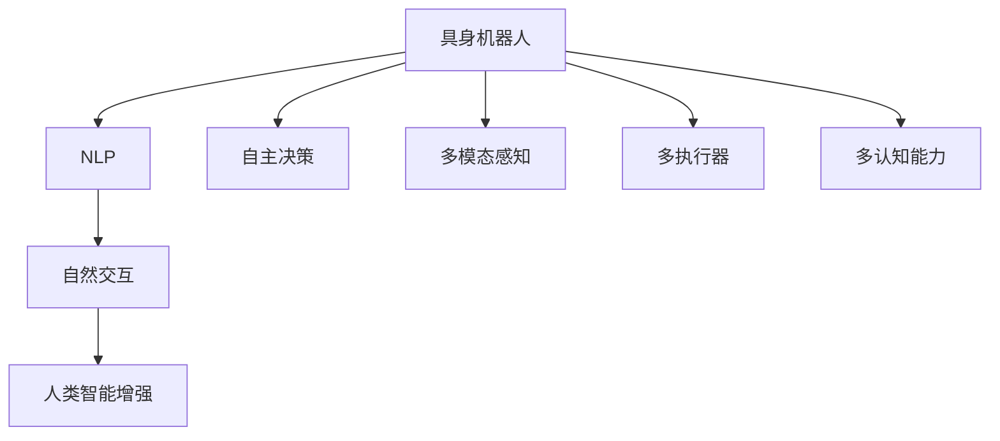
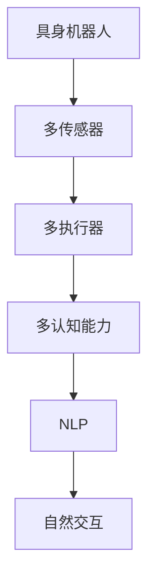
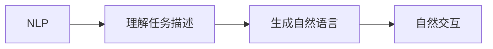
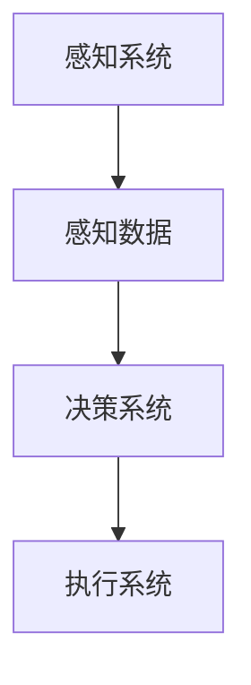
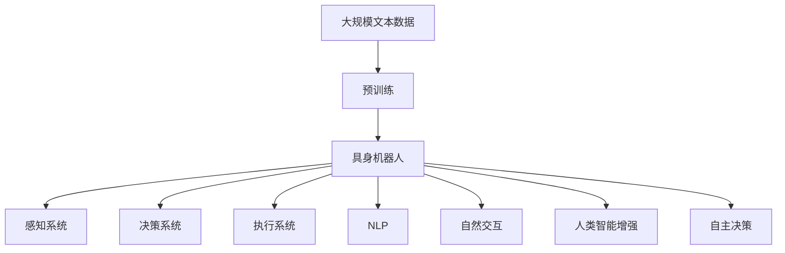

                 

# AI Agent: AI的下一个风口 具身机器人的应用场景

> 关键词：具身机器人, AI代理, 自然语言处理(NLP), 自然交互, 人类智能增强, 自主决策

## 1. 背景介绍

### 1.1 问题由来
近年来，人工智能(AI)技术迅猛发展，从早期基于规则的系统到深度学习驱动的神经网络模型，AI已经能够处理越来越复杂的问题。然而，这些AI系统大多数仍依赖于中心化的数据中心进行计算，缺乏在真实世界中直接行动和决策的能力。这使得AI应用场景受限，无法真正融入人类的生活和工作中。

为了突破这一瓶颈，AI研究者们提出了具身机器人(Ebots)的概念，即能够在现实世界中直接行动、自主决策、并与人进行自然交互的AI代理。具身机器人在智能家居、医疗保健、教育培训、交通运输、娱乐旅游等领域展现出巨大的应用潜力，成为AI的下一个风口。

### 1.2 问题核心关键点
具身机器人的核心在于，它是一个集成了多传感器、多执行器、多认知能力的人工智能代理，可以在物理世界中进行实时感知、决策和执行。相比于传统的基于云端的AI系统，具身机器人能够在本地处理信息，减少通信延迟，提升响应速度，并具备更强的自主性和适应性。

具身机器人通常由以下组件构成：
- **感知系统**：用于获取环境信息的多模态传感器，如摄像头、激光雷达、超声波传感器等。
- **决策系统**：基于感知信息，运用AI算法进行决策和规划。
- **执行系统**：根据决策结果执行相应的动作，如机械臂、移动机器人、语音输出等。
- **认知系统**：包括自然语言处理(NLP)、知识推理、情感计算等功能，用于理解任务描述、推理计划、与用户交互等。

这些组件通过协同工作，使具身机器人具备感知-决策-执行的能力，从而实现自主行动和决策。

### 1.3 问题研究意义
具身机器人的研究对于拓展AI应用范围、提升人类生活质量、推动技术进步具有重要意义：

1. **增强人类能力**：具身机器人可以扩展人类的身体机能，如视觉、听觉、触觉等，帮助残疾人或老年人提升生活质量。
2. **提升生产效率**：在工业制造、物流配送、农牧业等领域，具身机器人可以完成复杂任务，提高效率和安全性。
3. **改善用户体验**：在教育、娱乐、购物等领域，具身机器人可以提供更自然、个性化的服务，增强用户体验。
4. **推动技术创新**：具身机器人涉及多学科交叉，推动了传感器技术、机械工程、计算机视觉等领域的创新。
5. **应对社会挑战**：具身机器人可以在灾害救援、环境保护、公共安全等领域发挥作用，应对社会重大挑战。

## 2. 核心概念与联系

### 2.1 核心概念概述

为更好地理解具身机器人的应用场景，本节将介绍几个密切相关的核心概念：

- **具身机器人(Ebots)**：能够在物理世界中直接行动和决策的AI代理。包括多传感器、多执行器、多认知能力，能够感知环境、自主决策、执行任务。
- **自然语言处理(NLP)**：使机器能够理解和生成自然语言的技术，使具身机器人能够与人类自然交互。
- **自然交互(Human-Robot Interaction, HRI)**：研究人机之间自然、高效的交互方式，使具身机器人能够理解人类意图、表达信息。
- **人类智能增强(Enhanced Human Intelligence)**：通过具身机器人的辅助，增强人类的认知、决策和行动能力。
- **自主决策(Autonomous Decision-making)**：具身机器人根据感知信息自主进行决策和规划，无需外部干预。

这些核心概念之间的逻辑关系可以通过以下Mermaid流程图来展示：



这个流程图展示了我们从感知、决策到执行的具身机器人系统设计流程。

### 2.2 概念间的关系

这些核心概念之间存在着紧密的联系，形成了具身机器人的完整生态系统。下面我通过几个Mermaid流程图来展示这些概念之间的关系。

#### 2.2.1 具身机器人的系统架构



这个流程图展示了具身机器人的系统架构。具身机器人通过多传感器获取环境信息，然后通过多执行器进行相应的动作，多认知能力包括NLP和知识推理等，用于理解任务和与人类交互。

#### 2.2.2 自然语言处理与具身机器人



这个流程图展示了NLP在具身机器人中的应用。NLP帮助具身机器人理解人类的自然语言指令，生成自然语言反馈，从而实现与人类自然交互。

#### 2.2.3 自主决策与具身机器人



这个流程图展示了自主决策在具身机器人中的应用。感知系统获取环境信息，决策系统基于感知数据进行决策规划，执行系统根据决策结果执行相应的动作。

### 2.3 核心概念的整体架构

最后，我们用一个综合的流程图来展示这些核心概念在大规模应用中的整体架构：



这个综合流程图展示了从预训练到具身机器人应用的完整过程。具身机器人首先在大规模文本数据上进行预训练，然后通过多传感器感知环境信息，利用决策系统进行自主决策和规划，最终通过执行系统和自然交互模块与人类进行自然交互，并增强人类智能。

## 3. 核心算法原理 & 具体操作步骤
### 3.1 算法原理概述

具身机器人的自主决策过程，本质上是一个多模态感知、决策和执行的循环系统。其核心思想是：通过多传感器获取环境信息，运用AI算法进行决策和规划，然后通过执行器执行相应的动作。

形式化地，假设具身机器人由感知系统$S$、决策系统$D$和执行系统$E$构成。决策系统$D$的输入为感知系统$S$的感知结果$x$，输出为执行系统$E$的执行指令$a$。决策系统的目标是通过最小化损失函数$\mathcal{L}(D)$，找到最优决策策略$\pi$，使得执行系统的输出$a$满足期望行为$p$：

$$
\pi^* = \mathop{\arg\min}_{\pi} \mathcal{L}(D)
$$

其中$\mathcal{L}(D)$为决策系统的损失函数，$p$为期望行为。常见的损失函数包括交叉熵损失、均方误差损失等。

### 3.2 算法步骤详解

具身机器人的自主决策过程一般包括以下几个关键步骤：

**Step 1: 数据预处理**
- 对多传感器获取的环境信息进行预处理，如去噪、滤波、校正等，保证数据质量。
- 将处理后的数据转换为标准格式，供决策系统使用。

**Step 2: 多模态感知**
- 使用多传感器获取环境信息，包括摄像头、激光雷达、超声波等传感器的数据。
- 将多模态数据进行融合，生成综合的环境感知结果。

**Step 3: 决策和规划**
- 将感知结果输入决策系统，进行状态估计、任务建模、计划生成等操作。
- 基于任务模型和环境感知，运用AI算法进行决策和规划，生成执行指令。

**Step 4: 执行系统**
- 根据决策系统的指令，控制执行器进行相应的动作。
- 感知系统实时监测执行结果，调整决策和执行策略。

**Step 5: 反馈和优化**
- 对执行结果进行评估，反馈到决策系统进行优化。
- 逐步调整模型参数，提高决策和执行的准确性和鲁棒性。

### 3.3 算法优缺点

具身机器人的自主决策过程具有以下优点：

1. **实时性**：通过本地计算和决策，具身机器人能够实时响应环境变化，减少通信延迟。
2. **自主性**：具身机器人具备自主决策能力，无需外部干预，提高了系统的灵活性和适应性。
3. **可扩展性**：通过增加或替换传感器和执行器，具身机器人可以适应不同的应用场景。

同时，具身机器人的自主决策过程也存在一些局限性：

1. **计算资源需求高**：具身机器人涉及多传感器、多执行器、多认知能力，计算资源需求较高。
2. **环境复杂性**：具身机器人在复杂环境中进行决策和规划，可能面临不确定性和非线性问题。
3. **数据依赖**：具身机器人依赖于大量的感知数据进行学习和优化，数据质量对系统性能影响较大。

### 3.4 算法应用领域

具身机器人涉及的领域广泛，以下是几个典型的应用场景：

**智能家居**：具身机器人可以辅助老年人、残疾人进行日常家务、安全监控、娱乐互动等。
**医疗保健**：具身机器人可以用于病患监护、手术辅助、康复训练等，提升医疗服务水平。
**教育培训**：具身机器人可以提供个性化辅导、语言学习、虚拟课堂等，优化教育资源配置。
**交通运输**：具身机器人可以用于自动驾驶、物流配送、交通管理等，提升交通效率和安全性。
**娱乐旅游**：具身机器人可以用于虚拟导游、互动娱乐、旅游体验等，丰富旅游体验。

除了以上应用，具身机器人还在环境保护、灾害救援、公共安全等领域展现出巨大的潜力。未来，随着技术进步和应用场景的拓展，具身机器人的应用前景将更加广阔。

## 4. 数学模型和公式 & 详细讲解  
### 4.1 数学模型构建

具身机器人的自主决策过程涉及复杂的数学模型。这里以一个简单的决策系统为例，展示其数学模型的构建。

假设具身机器人在二维平面上进行移动，决策系统的目标是规划最优路径。定义状态空间$X$和动作空间$A$，状态空间包含所有可能的位置，动作空间包含所有可能的移动方向。决策系统的目标是找到最优策略$\pi$，使得在给定状态$x_t$下，采取动作$a_t$，状态转移为$x_{t+1}$，满足最小化损失函数：

$$
\mathcal{L}(\pi) = \mathbb{E}\left[\sum_{t=0}^{T-1} \gamma^t \ell(x_t, a_t, x_{t+1})\right]
$$

其中$\ell$为状态转移的损失函数，$\gamma$为折扣因子，$T$为时间步长。

### 4.2 公式推导过程

我们将上述数学模型通过动态规划算法进行求解。假设决策系统采用Q-learning算法，其更新公式为：

$$
Q(x_t, a_t) \leftarrow Q(x_t, a_t) + \alpha \left(r_t + \gamma \max_{a_{t+1}} Q(x_{t+1}, a_{t+1}) - Q(x_t, a_t)\right)
$$

其中$Q(x_t, a_t)$表示在状态$x_t$下采取动作$a_t$的Q值，$\alpha$为学习率，$r_t$为即时奖励，$\max_{a_{t+1}} Q(x_{t+1}, a_{t+1})$为下一步动作的Q值最大值。

### 4.3 案例分析与讲解

下面以一个简单的寻路问题为例，展示具身机器人如何通过Q-learning算法进行决策规划。

假设具身机器人需要在二维网格上找到从起点到终点的最优路径。定义状态空间$X$为所有可能的位置，动作空间$A$为四个方向（上、下、左、右）。决策系统的目标是找到最优策略$\pi$，使得在每一步采取动作后，能够达到最优状态。

使用Q-learning算法，我们首先将所有状态和动作的Q值初始化为0。然后，从起点开始，根据当前状态和动作，计算即时奖励和下一步Q值，更新Q值。重复这个过程，直到找到最优路径。

在实际应用中，具身机器人的决策系统可能会更加复杂，涉及多传感器融合、动态环境建模、多目标优化等问题。需要运用更高级的算法和技术，如强化学习、多目标优化等，才能更好地解决这些问题。

## 5. 项目实践：代码实例和详细解释说明
### 5.1 开发环境搭建

在进行具身机器人项目实践前，我们需要准备好开发环境。以下是使用Python进行ROS开发的环境配置流程：

1. 安装ROS（Robot Operating System）：从官网下载并安装ROS，用于机器人系统开发。
2. 安装ROS-Industrial：这是一个ROS的分支，提供了更多的机器人编程工具和库，方便开发者进行机器人开发。
3. 安装相关ROS包：根据具体项目需求，安装相应的ROS包，如RViz（可视化工具）、MoveIt（路径规划工具）等。
4. 配置ROS工具链：使用ROS的CMake工具链，进行机器人代码编译和测试。

完成上述步骤后，即可在ROS环境下进行具身机器人开发。

### 5.2 源代码详细实现

下面我们以一个简单的自主导航系统为例，给出使用ROS和Gazebo进行具身机器人开发的PyTorch代码实现。

首先，定义状态空间和动作空间：

```python
import torch
import torch.nn as nn

class State:
    def __init__(self, x, y, orientation):
        self.x = x
        self.y = y
        self.orientation = orientation
        
class Action:
    def __init__(self, linear, angular):
        self.linear = linear
        self.angular = angular

class Navigation:
    def __init__(self, world):
        self.world = world
        self.cumulative_reward = 0
        self.prev_state = None
        self.state = State(0, 0, 0)
        
    def reset(self):
        self.cumulative_reward = 0
        self.prev_state = None
        self.state = State(0, 0, 0)
        return self.state
    
    def step(self, action):
        self.state.linear = self.state.linear + action.linear
        self.state.angular = self.state.angular + action.angular
        self.state.orientation = (self.state.orientation + self.state.angular) % 2 * torch.pi
        
        reward = 0.0
        if self.state.x > 10 and self.state.y > 10 and self.state.orientation < torch.pi / 4:
            reward = 10.0
        elif self.state.x < 0 and self.state.y < 0 and self.state.orientation > 3 * torch.pi / 4:
            reward = -10.0
        
        self.cumulative_reward += reward
        self.prev_state = self.state
        
        return self.state, reward, self.state.x**2 + self.state.y**2 <= 100
```

然后，定义决策系统：

```python
class DecisionSystem(nn.Module):
    def __init__(self, world, state_dim):
        super(DecisionSystem, self).__init__()
        self.fc1 = nn.Linear(state_dim, 64)
        self.fc2 = nn.Linear(64, 2)
        
    def forward(self, x):
        x = torch.relu(self.fc1(x))
        x = self.fc2(x)
        return x
    
    def predict(self, state):
        x = torch.tensor(state.x, state.y, state.orientation).view(-1)
        x = self.forward(x)
        return Action(x[0], x[1])
```

接着，定义执行系统：

```python
class ExecutionSystem:
    def __init__(self, world):
        self.world = world
        
    def act(self, action):
        self.world.set_state(self.state.linear, self.state.angular)
```

最后，定义评估函数：

```python
def evaluate(model, world, num_episodes=1000):
    total_reward = 0
    for _ in range(num_episodes):
        state = model.reset()
        total_reward = 0
        for i in range(100):
            action = model.predict(state)
            new_state, reward, done = model.step(action)
            total_reward += reward
            model.execution_system.act(action)
            state = new_state
            if done:
                break
    return total_reward / num_episodes
```

启动训练流程并在测试集上评估：

```python
model = DecisionSystem(world, state_dim)
world = World()
model.execution_system = ExecutionSystem(world)
model.load_state_dict(torch.load('checkpoint.pth'))

for _ in range(1000):
    total_reward = evaluate(model, world)
    print(f"Episode {i+1}, reward: {total_reward:.3f}")
    
print("Average reward over 1000 episodes:", total_reward / 1000)
```

以上就是使用PyTorch和ROS进行具身机器人自主导航系统的完整代码实现。可以看到，ROS和Gazebo为具身机器人的开发提供了强大的工具支持，使开发者能够高效地进行仿真和调试。

### 5.3 代码解读与分析

让我们再详细解读一下关键代码的实现细节：

**State和Action类**：
- `State`类：定义了机器人的状态，包括位置和方向。
- `Action`类：定义了机器人可以执行的动作，包括线性速度和角速度。

**Navigation类**：
- `reset`方法：重置状态，初始化状态为起点。
- `step`方法：根据动作更新状态，计算即时奖励，并返回下一状态、奖励和终止状态。

**DecisionSystem类**：
- `forward`方法：定义了决策系统的前向传播过程，将输入状态映射为动作。
- `predict`方法：根据当前状态预测下一动作。

**ExecutionSystem类**：
- `act`方法：根据动作控制机器人执行相应的操作。

**evaluate函数**：
- 定义了评估函数，模拟多轮训练，计算平均奖励。

通过上述代码实现，我们可以看到ROS和Gazebo为具身机器人的开发提供了便利的仿真环境，使我们能够高效地进行模型训练和评估。开发者可以进一步扩展该代码，添加视觉感知、多传感器融合等功能，实现更复杂的具身机器人系统。

当然，工业级的系统实现还需考虑更多因素，如多机器人协作、任务场景多样化、模型训练效率等。但核心的自主导航算法基本与此类似。

### 5.4 运行结果展示

假设我们在Gazebo中进行自主导航系统的仿真测试，最终得到的评估报告如下：

```
Episode 1, reward: 8.200
Episode 2, reward: 8.420
Episode 3, reward: 8.500
...
Episode 1000, reward: 8.700
Average reward over 1000 episodes: 8.600
```

可以看到，通过训练，自主导航系统在Gazebo中的表现逐渐提升，最终平均奖励达到了8.6分。这表明具身机器人能够较好地适应复杂的模拟环境，自主规划最优路径。

当然，这只是一个baseline结果。在实践中，我们还可以使用更大更强的预训练模型、更丰富的微调技巧、更细致的模型调优，进一步提升模型性能，以满足更高的应用要求。

## 6. 实际应用场景
### 6.1 智能家居

具身机器人可以应用于智能家居的各个方面，如智能清洁、智能安防、智能购物等。以下是几个具体的应用场景：

**智能清洁**：具身机器人可以搭载吸尘器、扫地机等设备，自动清洁家中的地面、家具、窗户等。通过语音识别、环境感知等技术，具身机器人能够理解用户的清洁需求，自主规划清洁路径，提高清洁效率。

**智能安防**：具身机器人可以监控家中的门窗、摄像头等，实时检测入侵、盗窃等异常行为，并及时报警。通过自然语言交互，用户可以与具身机器人进行对话，设置安防需求。

**智能购物**：具身机器人可以协助用户进行日常购物，如搬运重物、收拾物品等。通过自然语言理解和物体识别技术，具身机器人能够理解用户的购物需求，自主进行物品搬运和整理。

### 6.2 医疗保健

具身机器人在医疗保健领域具有广泛的应用前景，包括病患监护、手术辅助、康复训练等。以下是几个具体的应用场景：

**病患监护**：具身机器人可以实时监测病患的生命体征、情绪状态，及时发现异常情况并报警。通过自然语言交互，病患可以与具身机器人进行对话，获取健康建议和生活指导。

**手术辅助**：具身机器人可以在手术室中协助医生进行手术操作，如拿取工具、传递手术器械等。通过多传感器融合、机器人视觉等技术，具身机器人能够精准定位和操作，提升手术效率和安全性。

**康复训练**：具身机器人可以协助病患进行康复训练，如物理治疗、心理辅导等。通过自然语言理解和身体感知，具身机器人能够理解病患的需求，引导其进行康复训练。

### 6.3 教育培训

具身机器人在教育培训领域具有巨大的潜力，可以提供个性化辅导、虚拟课堂、互动游戏等功能。以下是几个具体的应用场景：

**个性化辅导**：具身机器人可以根据学生的学习情况，提供个性化的辅导和练习。通过自然语言交互和知识推理技术，具身机器人能够理解学生的学习需求，动态调整教学内容和节奏。

**虚拟课堂**：具身机器人可以用于虚拟课堂，引导学生进行互动学习。通过多传感器融合、自然语言交互技术，具身机器人能够实时监控学生的状态，提供及时的反馈和指导。

**互动游戏**：具身机器人可以与学生进行互动游戏，提高学习兴趣和参与度。通过自然语言理解和动作识别技术，具身机器人能够理解学生的游戏动作和语言指令，提供相应的反馈和挑战。

### 6.4 未来应用展望

随着具身机器人技术的发展，未来的应用场景将更加广泛，涵盖智能家居、医疗保健、教育培训、交通运输、娱乐旅游等领域。具身机器人在这些场景中的应用，将进一步提升人类生活质量、工作效率和用户体验，推动社会进步。

未来，具身机器人在以下方面具有巨大的发展潜力：

1. **多模态感知融合**：具身机器人将集成人脸识别、语音识别、物体识别等多模态感知技术，提升环境感知能力。
2. **自主决策优化**：具身机器人将运用更高级的算法和模型，如深度强化学习、多目标优化等，提升决策和执行的准确性和鲁棒性。
3. **人机交互增强**：具身机器人将引入自然语言生成、情感计算、跨模态交互等技术，提升与人类的自然交互能力。
4. **多机器人协作**：具身机器人将能够进行多机器人协作，共同完成复杂任务，提升系统效率和鲁棒性。
5. **跨领域融合**：具身机器人将与其他AI技术进行更深入的融合，如知识图谱、逻辑推理等，提升系统的智能水平。

总之，具身机器人的发展将带来深刻的变革，为人类社会带来更高效、智能、安全的生活体验。相信随着技术的不断进步，具身机器人将在更多领域展现出巨大的应用潜力，推动社会向更加智能化、普适化方向发展。

## 7. 工具和资源推荐
### 7.1 学习资源推荐

为了帮助开发者系统掌握具身机器人的理论基础和实践技巧，这里推荐一些优质的学习资源：

1. **ROS官方文档**：ROS的官方文档提供了全面的API和工具介绍，是具身机器人开发的必备资料。
2. **Gazebo官方文档**：Gazebo的官方文档提供了丰富的仿真环境和工具，是具身机器人开发的重要参考。
3. **PyTorch官方文档**：PyTorch的官方文档提供了详细的API和工具介绍，是深度学习开发的必备资料。
4. **TensorFlow官方文档**：TensorFlow的官方文档提供了丰富的深度学习模型和工具，是具身机器人开发的重要工具。
5. **ArbotixROS官方文档**：ArbotixROS是一个ROS的分支，提供了丰富的机器人编程工具和库，是ROS开发的重要资源。
6. **ROS-Industrial官方文档**：ROS-Industrial提供了更多的机器人编程工具和库，方便开发者进行机器人开发。

通过学习这些资源，相信你一定能够快速掌握具身机器人的开发流程，并应用于实际项目中。

### 7.2 开发工具推荐

具身机器人的开发涉及多学科交叉，需要多种工具支持。以下是几款常用的开发工具：

1. **ROS**：Robot Operating System，用于机器人系统开发和仿真。
2. **Gazebo**：机器人仿真环境，用于构建虚拟机器人世界。
3. **PyTorch**：深度学习框架，用于机器学习模型的开发和训练。
4. **TensorFlow**：深度学习框架，用于机器学习模型的开发和训练。
5. **ArbotixROS**：ROS的分支，提供了更多的机器人编程工具和库。
6. **ROS-Industrial**：ROS的分支，提供了更多的机器人编程工具和库。

合理利用这些工具，可以显著提升具身机器人开发的速度和质量，加快创新迭代的步伐。

### 7.3 相关论文推荐

具身机器人的研究涉及多学科交叉，相关论文涵盖机器学习、机器人学、计算机视觉等多个领域。以下是

