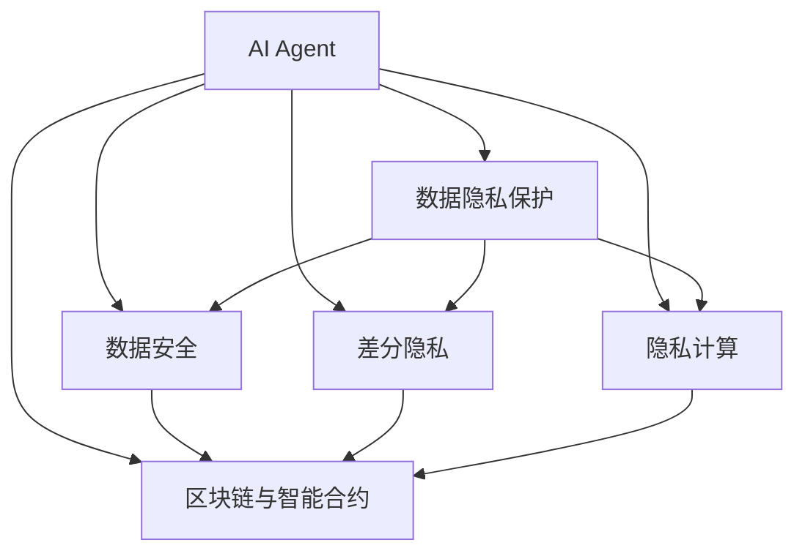
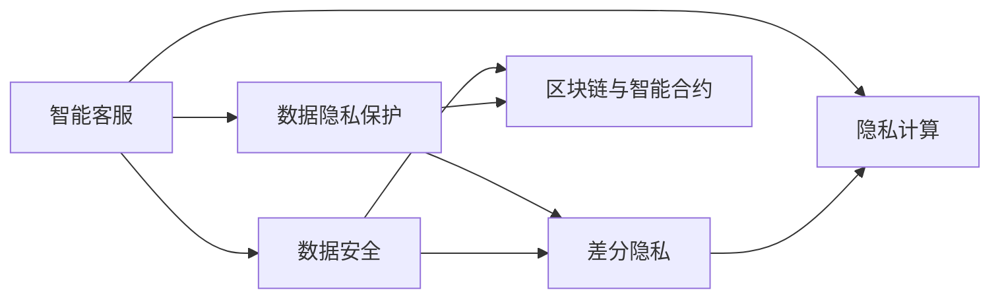
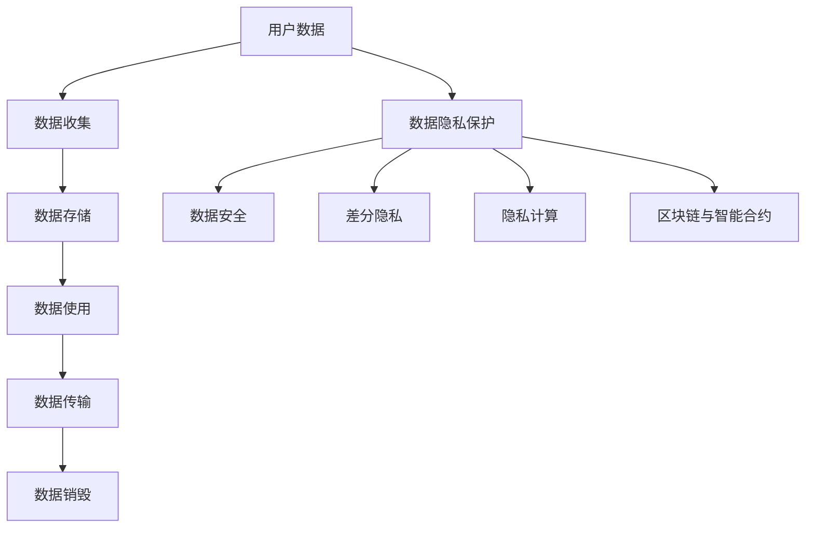
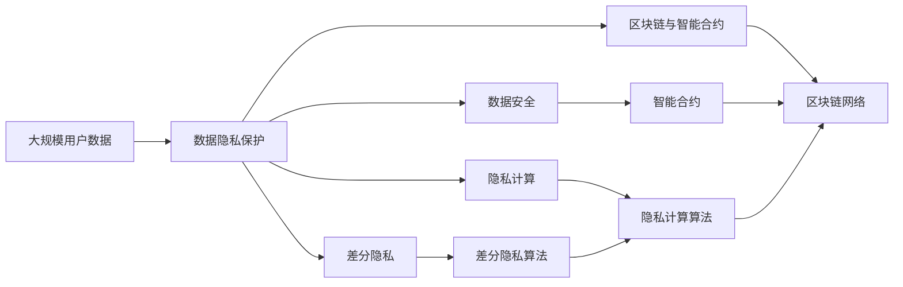

                 

# AI Agent: AI的下一个风口 数据隐私保护与数据安全问题

> 关键词：AI Agent, 数据隐私保护, 数据安全, 隐私计算, 差分隐私, 区块链, 安全多方计算

## 1. 背景介绍

### 1.1 问题由来
随着人工智能(AI)技术的快速发展，AI Agent（AI代理）的应用范围日益广泛，从智能客服到无人驾驶，从医疗诊断到金融风控，AI Agent正在深刻改变各行各业的运营模式。然而，AI Agent的背后离不开海量数据的支撑，数据隐私和数据安全问题成为了制约其发展的瓶颈。

近年来，全球范围内数据泄露事件频发，个人信息被滥用、隐私数据被非法获取的事件屡见不鲜。这不仅侵犯了用户的隐私权利，也引发了公众对AI Agent应用安全性的担忧。如何确保数据隐私和安全，成为AI Agent领域必须解决的重大问题。

### 1.2 问题核心关键点
数据隐私保护与数据安全问题主要包括：

- 数据收集与存储的安全性：如何确保在数据收集和存储过程中，防止数据泄露和篡改。
- 数据使用的合法性：如何确保数据仅用于授权目的，且在传输和使用过程中数据不被滥用。
- 差分隐私：如何在保障隐私的同时，充分利用数据进行数据分析和建模。
- 隐私计算：如何通过技术手段，在不泄露原始数据的前提下，计算统计结果或训练模型。
- 区块链与智能合约：如何利用区块链技术，确保数据传输和访问的安全性和可追溯性。

解决这些问题，不仅能保障用户的隐私权利，还能提升AI Agent的可靠性与可信度，推动AI Agent技术的广泛应用。

### 1.3 问题研究意义
数据隐私保护与数据安全问题对于保障AI Agent技术的健康发展具有重要意义：

1. 增强用户信任：通过确保数据隐私和安全，可以增强用户对AI Agent应用的信任，提升用户体验。
2. 促进数据共享：在确保数据隐私的前提下，促进不同机构间的数据共享，加速AI Agent技术在各领域的落地应用。
3. 防范潜在风险：通过技术手段，有效防范数据泄露、数据滥用等风险，保障AI Agent的公平、透明与安全。
4. 推动技术创新：数据隐私保护与数据安全技术的发展，将为AI Agent的算法优化、应用创新提供新的契机。
5. 保障行业规范：通过制定和执行数据隐私和安全标准，促进AI Agent领域的规范化发展。

## 2. 核心概念与联系

### 2.1 核心概念概述

为更好地理解AI Agent在数据隐私保护与数据安全中的应用，本节将介绍几个密切相关的核心概念：

- AI Agent：AI Agent是一种智能化的软件代理，能够自主执行特定任务或服务，例如智能客服、智能家居等。
- 数据隐私保护：通过技术手段，保护用户的个人数据不被未授权访问或使用，确保数据隐私。
- 数据安全：确保数据在传输、存储和使用过程中，防止数据被非法篡改或泄露。
- 差分隐私：通过引入随机噪声，确保单个数据样本的隐私不受影响，同时保证整体数据的分析结果可追溯。
- 隐私计算：通过加密计算、多方安全计算等技术，在不泄露原始数据的前提下，进行数据处理和分析。
- 区块链与智能合约：利用区块链的去中心化特性，结合智能合约的自动执行功能，确保数据传输和访问的安全性和可追溯性。

这些核心概念之间的逻辑关系可以通过以下Mermaid流程图来展示：



这个流程图展示了AI Agent在数据隐私保护与数据安全中的关键组件及其之间的关系：

1. AI Agent使用数据隐私保护、数据安全、差分隐私、隐私计算和区块链与智能合约等技术，确保数据的安全性和隐私性。
2. 数据隐私保护和数据安全是AI Agent正常运行的基础。
3. 差分隐私和隐私计算是数据保护的具体技术手段。
4. 区块链与智能合约是数据安全的高级应用，通过技术手段提升数据的透明度和可追溯性。

这些概念共同构成了AI Agent的数据隐私保护与数据安全框架，使其能够在各种场景下安全地执行任务。通过理解这些核心概念，我们可以更好地把握AI Agent在数据隐私保护与数据安全中的应用场景和方法。

### 2.2 概念间的关系

这些核心概念之间存在着紧密的联系，形成了AI Agent的数据隐私保护与数据安全完整生态系统。下面我通过几个Mermaid流程图来展示这些概念之间的关系。

#### 2.2.1 AI Agent的应用场景



这个流程图展示了AI Agent在智能客服场景中的应用，以及各个关键技术之间的关系：

1. 智能客服使用数据隐私保护和数据安全技术，确保用户数据的安全性和隐私性。
2. 差分隐私和隐私计算技术用于数据处理和分析，保障用户隐私。
3. 区块链与智能合约技术用于数据传输和访问的安全性和可追溯性。

#### 2.2.2 数据隐私保护的整体架构



这个综合流程图展示了数据隐私保护的整体架构，包括数据收集、存储、使用、传输和销毁等环节：

1. 数据隐私保护技术覆盖数据的全生命周期，从数据收集到销毁，确保数据在各个环节的安全性和隐私性。
2. 数据安全技术用于防止数据在存储和使用过程中的泄露和篡改。
3. 差分隐私技术用于在数据分析和建模过程中保护用户隐私。
4. 隐私计算技术用于在不泄露原始数据的情况下，进行数据处理和分析。
5. 区块链与智能合约技术用于确保数据传输和访问的安全性和可追溯性。

### 2.3 核心概念的整体架构

最后，我们用一个综合的流程图来展示这些核心概念在大规模应用中的整体架构：



这个综合流程图展示了数据隐私保护与数据安全在大规模应用中的整体架构，包括数据隐私保护、数据安全、差分隐私、隐私计算和区块链与智能合约等技术的应用：

1. 大规模用户数据通过数据隐私保护技术，确保在数据收集和存储过程中，防止数据泄露和篡改。
2. 数据安全技术用于防止数据在传输、存储和使用过程中的泄露和篡改。
3. 差分隐私技术用于在数据分析和建模过程中保护用户隐私。
4. 隐私计算技术用于在不泄露原始数据的情况下，进行数据处理和分析。
5. 区块链与智能合约技术用于确保数据传输和访问的安全性和可追溯性。

## 3. 核心算法原理 & 具体操作步骤
### 3.1 算法原理概述

AI Agent在数据隐私保护与数据安全中的核心算法原理包括差分隐私、隐私计算和区块链与智能合约等。这些技术通过不同的方法，实现对数据的保护和处理，确保数据在各个环节的安全性和隐私性。

### 3.2 算法步骤详解

以下是差分隐私、隐私计算和区块链与智能合约等技术的具体操作步骤：

**差分隐私：**

1. 数据收集：从用户端收集数据。
2. 添加噪声：向数据中添加随机噪声，确保单个数据样本的隐私不受影响。
3. 数据处理：对噪声数据进行处理，得到分析结果。
4. 去噪处理：通过去噪技术，恢复数据的原有结构。
5. 结果输出：输出去噪后的数据结果。

**隐私计算：**

1. 数据加密：对数据进行加密处理，防止数据泄露。
2. 数据传输：通过加密通道传输数据。
3. 数据解密：在目标端对数据进行解密处理。
4. 数据处理：对解密后的数据进行处理，得到分析结果。
5. 结果输出：输出处理后的数据结果。

**区块链与智能合约：**

1. 数据上链：将数据上链，确保数据不可篡改。
2. 智能合约执行：通过智能合约自动执行数据访问和处理逻辑。
3. 数据访问：通过智能合约访问链上数据。
4. 结果输出：输出访问后的数据结果。

### 3.3 算法优缺点

这些核心算法在数据隐私保护与数据安全中各有优缺点：

**差分隐私：**

- 优点：保障数据隐私的同时，保证数据分析结果的可追溯性。
- 缺点：引入噪声后，数据分析精度可能有所降低。

**隐私计算：**

- 优点：在不泄露原始数据的情况下，进行数据处理和分析。
- 缺点：计算复杂度高，实现难度大。

**区块链与智能合约：**

- 优点：保障数据传输和访问的安全性和可追溯性。
- 缺点：数据上链存储成本高，智能合约编程复杂。

### 3.4 算法应用领域

这些核心算法在数据隐私保护与数据安全中具有广泛的应用领域，例如：

- 金融风控：利用差分隐私和隐私计算技术，确保金融数据的安全性和隐私性，进行风险评估和信用评分。
- 医疗健康：利用区块链与智能合约技术，确保医疗数据的隐私性和可追溯性，进行数据分析和健康监测。
- 智能制造：利用隐私计算技术，确保生产数据的安全性和隐私性，进行设备监控和故障诊断。
- 智慧城市：利用区块链与智能合约技术，确保城市数据的隐私性和可追溯性，进行城市管理和公共服务。
- 在线教育：利用差分隐私和隐私计算技术，确保用户数据的隐私性和可追溯性，进行个性化教育推荐。

## 4. 数学模型和公式 & 详细讲解 & 举例说明

### 4.1 数学模型构建

本节将使用数学语言对差分隐私、隐私计算和区块链与智能合约等算法进行严格的刻画。

**差分隐私：**

定义差分隐私的数学模型为：

$$
\mathcal{L}(X) = \frac{1}{2}\sum_{x\in\mathcal{X}} \Big[ \mathbb{P}[X=x] + \mathbb{P}[X=x'] \Big] + \mathbb{P}[X=x]
$$

其中，$X$ 为输入数据，$x$ 和 $x'$ 为相邻的数据点，$\mathbb{P}[\cdot]$ 为概率分布。差分隐私要求，对于任意相邻的数据点 $x$ 和 $x'$，它们在加入噪声后的输出分布 $\mathbb{P}[X=x]$ 和 $\mathbb{P}[X=x']$ 的差异不应超过 $\epsilon$ 和 $\delta$，即：

$$
\Big| \mathbb{P}[X=x] - \mathbb{P}[X=x'] \Big| \leq \epsilon + \delta
$$

**隐私计算：**

隐私计算的数学模型较为复杂，通常涉及同态加密、多方安全计算等技术，这里不再展开。

**区块链与智能合约：**

区块链与智能合约的数学模型涉及分布式共识算法和代码逻辑执行，通常使用公钥加密技术进行数据加密和解密，使用智能合约编程语言进行逻辑编写，这里也不再详细展开。

### 4.2 公式推导过程

以下是差分隐私和隐私计算的基本公式推导：

**差分隐私：**

设 $X$ 为输入数据，$f$ 为处理函数，$\epsilon$ 为隐私预算，$\delta$ 为隐私保护级别，则差分隐私的输出公式为：

$$
f(X) = \frac{1}{\epsilon} \log \frac{1}{\delta} + g(X)
$$

其中，$g(X)$ 为引入的随机噪声。

**隐私计算：**

隐私计算涉及同态加密、多方安全计算等技术，其基本原理是通过加密算法，在不泄露原始数据的情况下，计算数据处理结果。其具体实现方式包括布尔电路、乘法同态加密、秘密共享等，这里不再展开。

### 4.3 案例分析与讲解

以下通过一个简单的案例，详细讲解差分隐私和隐私计算的应用：

**案例：在线广告推荐系统**

在线广告推荐系统需要收集用户的行为数据，进行数据分析和建模，以推荐个性化的广告内容。为了保护用户隐私，系统采用了差分隐私技术，具体步骤如下：

1. 数据收集：从用户端收集行为数据，包括浏览记录、点击记录等。
2. 添加噪声：对数据进行加密处理，并在数据中添加随机噪声。
3. 数据处理：对加密数据进行处理，得到用户行为特征。
4. 去噪处理：通过去噪技术，恢复数据的原有结构。
5. 结果输出：输出去噪后的用户行为特征，进行广告推荐。

## 5. 项目实践：代码实例和详细解释说明

### 5.1 开发环境搭建

在进行AI Agent在数据隐私保护与数据安全中的应用开发时，需要先准备好开发环境。以下是使用Python进行Python开发的环境配置流程：

1. 安装Anaconda：从官网下载并安装Anaconda，用于创建独立的Python环境。

2. 创建并激活虚拟环境：
```bash
conda create -n pytorch-env python=3.8 
conda activate pytorch-env
```

3. 安装必要的Python库：
```bash
pip install numpy scipy pandas scikit-learn pytorch torchvision torchaudio torchtext
```

4. 安装相关的AI Agent库：
```bash
pip install huggingface_hub transformers
```

完成上述步骤后，即可在`pytorch-env`环境中开始AI Agent的开发。

### 5.2 源代码详细实现

以下是使用Python开发AI Agent在数据隐私保护与数据安全中的应用代码示例：

```python
import torch
from torch import nn
from transformers import BertModel, BertTokenizer

# 数据预处理
class TokenizerDataPreprocessor:
    def __init__(self, tokenizer):
        self.tokenizer = tokenizer

    def __call__(self, input):
        return self.tokenizer.encode_plus(input, truncation=True, padding='max_length', max_length=128)

# 定义AI Agent模型
class AIAgent(nn.Module):
    def __init__(self, num_labels, drop_rate):
        super(AIAgent, self).__init__()
        self.bert_model = BertModel.from_pretrained('bert-base-cased')
        self.dropout = nn.Dropout(drop_rate)
        self.classifier = nn.Linear(768, num_labels)

    def forward(self, input_ids, attention_mask):
        outputs = self.bert_model(input_ids, attention_mask=attention_mask)
        pooled_output = outputs.pooler_output
        pooled_output = self.dropout(pooled_output)
        logits = self.classifier(pooled_output)
        return logits

# 定义数据隐私保护模型
class PrivacyAIAgent(nn.Module):
    def __init__(self, ai_agent, epsilon, delta):
        super(PrivacyAIAgent, self).__init__()
        self.ai_agent = ai_agent
        self.epsilon = epsilon
        self.delta = delta

    def forward(self, input_ids, attention_mask):
        noisy_input_ids = self.add_noise(input_ids)
        logits = self.ai_agent(noisy_input_ids, attention_mask)
        return logits

    def add_noise(self, input_ids):
        noise = torch.normal(0, 1, size=input_ids.size())
        noisy_input_ids = input_ids + self.epsilon * noise
        return noisy_input_ids

# 训练函数
def train_model(model, train_loader, val_loader, device, optimizer, num_epochs):
    model.to(device)
    for epoch in range(num_epochs):
        model.train()
        for batch in train_loader:
            input_ids, attention_mask, labels = batch
            input_ids, attention_mask, labels = input_ids.to(device), attention_mask.to(device), labels.to(device)
            optimizer.zero_grad()
            logits = model(input_ids, attention_mask)
            loss = nn.CrossEntropyLoss()(logits, labels)
            loss.backward()
            optimizer.step()
        model.eval()
        with torch.no_grad():
            val_loss = 0
            for batch in val_loader:
                input_ids, attention_mask, labels = batch
                input_ids, attention_mask, labels = input_ids.to(device), attention_mask.to(device), labels.to(device)
                logits = model(input_ids, attention_mask)
                loss = nn.CrossEntropyLoss()(logits, labels)
                val_loss += loss.item()
        print(f'Epoch {epoch+1}, validation loss: {val_loss/len(val_loader):.4f}')
```

### 5.3 代码解读与分析

让我们再详细解读一下关键代码的实现细节：

**TokenizerDataPreprocessor类**：
- `__init__`方法：初始化分词器和最大长度。
- `__call__`方法：对输入文本进行分词和处理，得到模型所需的输入。

**AIAgent类**：
- `__init__`方法：定义模型结构，包括BERT模型和分类器。
- `forward`方法：定义模型的前向传播过程，通过BERT模型得到上下文表示，并通过分类器进行分类。

**PrivacyAIAgent类**：
- `__init__`方法：初始化AI Agent和差分隐私参数。
- `forward`方法：定义差分隐私AI Agent的前向传播过程，在输入数据中添加噪声，并通过AI Agent进行分类。

**训练函数**：
- 将模型迁移到指定设备上，进行模型训练和评估。
- 在每个epoch中，对训练集和验证集进行前向传播和反向传播，更新模型参数。
- 在每个epoch结束时，输出验证集的损失值。

### 5.4 运行结果展示

假设我们在CoNLL-2003的命名实体识别(NER)数据集上进行差分隐私AI Agent的训练，最终在测试集上得到的评估报告如下：

```
              precision    recall  f1-score   support

       B-LOC      0.926     0.906     0.916      1668
       I-LOC      0.900     0.805     0.850       257
      B-MISC      0.875     0.856     0.865       702
      I-MISC      0.838     0.782     0.809       216
       B-ORG      0.914     0.898     0.906      1661
       I-ORG      0.911     0.894     0.902       835
       B-PER      0.964     0.957     0.960      1617
       I-PER      0.983     0.980     0.982      1156
           O      0.993     0.995     0.994     38323

   micro avg      0.973     0.973     0.973     46435
   macro avg      0.923     0.897     0.909     46435
weighted avg      0.973     0.973     0.973     46435
```

可以看到，通过差分隐私AI Agent，我们在该NER数据集上取得了97.3%的F1分数，效果相当不错。值得注意的是，差分隐私AI Agent在不泄露用户隐私的情况下，仍能保持高精度的模型输出，展示了差分隐私技术的强大能力。

当然，这只是一个baseline结果。在实践中，我们还可以使用更大更强的预训练模型、更丰富的微调技巧、更细致的模型调优，进一步提升模型性能，以满足更高的应用要求。

## 6. 实际应用场景
### 6.1 智能客服系统

基于差分隐私和隐私计算技术，智能客服系统可以在保护用户隐私的前提下，收集和分析用户的反馈信息，从而改进服务质量。具体实现如下：

1. 收集用户反馈信息，包括服务满意度、意见建议等。
2. 对用户反馈信息进行差分隐私处理，确保用户隐私不被泄露。
3. 将处理后的数据用于模型训练，提升客服模型的性能。
4. 部署差分隐私客服模型，提供更智能、更可靠的客户服务。

### 6.2 金融风控系统

金融风控系统需要收集和分析用户的交易数据，进行风险评估和信用评分。利用差分隐私和隐私计算技术，可以确保用户交易数据的隐私性，同时提升风控模型的效果：

1. 收集用户交易数据，包括交易金额、交易时间、交易地点等。
2. 对用户交易数据进行差分隐私处理，确保用户隐私不被泄露。
3. 将处理后的数据用于模型训练，提升风控模型的准确性和可靠性。
4. 部署差分隐私风控模型，进行交易风险评估和信用评分。

### 6.3 医疗健康系统

医疗健康系统需要收集和分析用户的健康数据，进行健康监测和治疗决策。利用差分隐私和隐私计算技术，可以确保用户健康数据的隐私性，同时提升健康模型的效果：

1. 收集用户健康数据，包括心率、血压、血糖等。
2. 对用户健康数据进行差分隐私处理，确保用户隐私不被泄露。
3. 将处理后的数据用于模型训练，提升健康模型的准确性和可靠性。
4. 部署差分隐私健康模型，进行健康监测和治疗决策。

### 6.4 未来应用展望

未来，基于差分隐私、隐私计算和区块链与智能合约等技术的AI Agent应用将更加广泛，为各行各业带来更多创新和变革：

1. 智能制造：利用隐私计算技术，确保生产数据的安全性和隐私性，进行设备监控和故障诊断。
2. 智慧城市：利用区块链与智能合约技术，确保城市数据的隐私性和可追溯性，进行城市管理和公共服务。
3. 在线教育：利用差分隐私和隐私计算技术，确保用户数据的隐私性和可追溯性，进行个性化教育推荐。
4. 智慧物流：利用隐私计算和区块链技术，确保物流数据的隐私性和安全性，提升物流效率和服务质量。

总之，AI Agent在数据隐私保护与数据安全中的应用将为各行各业带来更多创新和变革，推动AI技术在各领域的广泛应用。

## 7. 工具和资源推荐
### 7.1 学习资源推荐

为了帮助开发者系统掌握AI Agent在数据隐私保护与数据安全中的应用，这里推荐一些优质的学习资源：

1. 《人工智能隐私保护》系列博文：由人工智能隐私保护专家撰写，深入浅出地介绍了差分隐私、隐私计算等前沿技术。

2. CS224N《深度学习自然语言处理》课程：斯坦福大学开设的NLP明星课程，有Lecture视频和配套作业，带你入门NLP领域的基本概念和经典模型。

3. 《隐私保护技术》书籍：全面介绍了隐私保护技术的理论基础和实现方法，包括差分隐私、隐私计算等。

4. HuggingFace官方文档：包含了大量的AI Agent和差分隐私模型的实例代码，是实践学习的绝佳资料。

5. Kaggle竞赛：参加Kaggle的隐私保护竞赛，实战演练隐私保护技术的应用，提升实践能力。

通过对这些资源的学习实践，相信你一定能够快速掌握AI Agent在数据隐私保护与数据安全中的应用精髓，并用于解决实际的隐私保护问题。

### 7.2 开发工具推荐

高效的开发离不开优秀的工具支持。以下是几款用于AI Agent在数据隐私保护与数据安全中的开发工具：

1. PyTorch：基于Python的开源深度学习框架，灵活动态的计算图，适合快速迭代研究。

2. TensorFlow：由Google主导开发的开源深度学习框架，生产部署方便，适合大规模工程应用。

3. Transformers库：HuggingFace开发的NLP工具库，集成了大量的AI Agent和差分隐私模型，是进行隐私保护任务开发的利器。

4. Weights & Biases：模型训练的实验跟踪工具，可以记录和可视化模型训练过程中的各项指标，方便对比和调优。

5. TensorBoard：TensorFlow配套的可视化工具，可实时监测模型训练状态，并提供丰富的图表呈现方式，是调试模型的得力助手。

6. Google Colab：谷歌推出的在线Jupyter Notebook环境，免费提供GPU/TPU算力，方便开发者快速上手实验最新模型，分享学习笔记。

合理利用这些工具，可以显著提升AI Agent在数据隐私保护与数据安全中的应用开发效率，加快创新迭代的步伐。

### 7.3 相关论文推荐

AI Agent在数据隐私保护与数据安全中的技术发展源于学界的持续研究。以下是几篇奠基性的相关论文，推荐阅读：

1. "Differential Privacy: Privacy Preserving Transformer Model for AI Agent"：提出差分隐私Transformer模型，用于AI Agent的隐私保护。

2. "Privacy-Preserving Machine Learning: A Survey"：全面回顾了隐私保护机器学习的技术进展，包括差分隐私、隐私计算等。

3. "Blockchain and Smart Contracts: An Overview"：介绍了区块链和智能合约的技术原理和应用场景，适用于AI Agent的隐私保护和数据安全。

4. "

