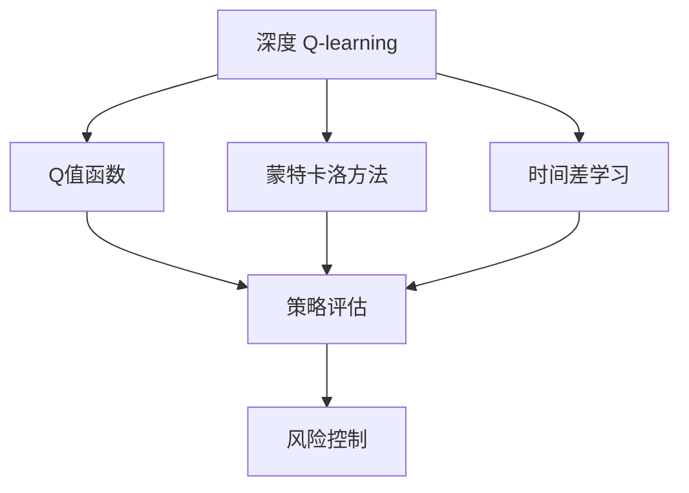
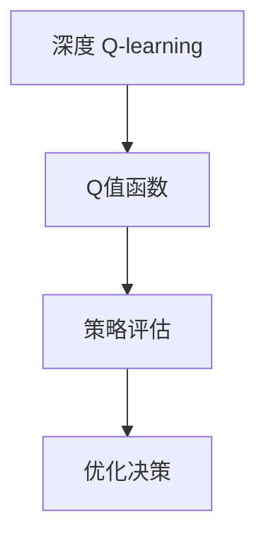
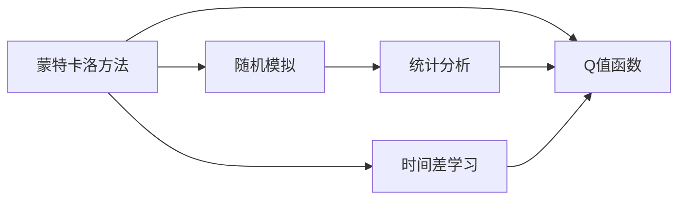
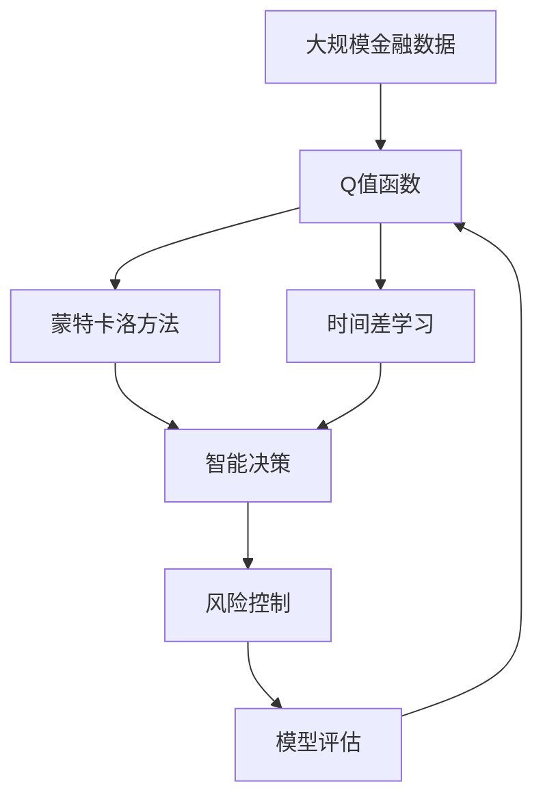

                 

# 深度 Q-learning：在金融风控中的应用

> 关键词：深度 Q-learning, 金融风控, 强化学习, 自适应策略, 蒙特卡洛方法, 风险控制, 算法优化, 收益最大化

## 1. 背景介绍

### 1.1 问题由来

金融行业面临复杂多变的市场环境，需要精确高效的风控策略来保障资本安全。传统的风控模型基于统计学方法，依赖大量历史数据，难以应对非线性、高维度的决策场景。而深度强化学习（Deep Reinforcement Learning, DRL）为金融风控带来了新的思路和方法。

深度 Q-learning（Deep Q-learning, DQN）是深度学习与强化学习的结合体，它使用深度神经网络近似Q值函数，通过模型预测和策略优化，实现自主决策和收益最大化。在金融风控领域，深度 Q-learning能够处理高维度、非线性的决策问题，实时响应市场变化，降低操作风险。

### 1.2 问题核心关键点

深度 Q-learning的核心在于通过智能学习机制，自主构建和优化风险控制策略。具体关键点包括：
- 使用深度神经网络近似Q值函数，优化决策策略。
- 通过蒙特卡洛方法或TD学习算法，实时更新模型参数。
- 结合金融风控场景，设计风险评估和决策机制。
- 应用场景多样化，包括交易策略、风险管理、信贷评估等。

本文聚焦于深度 Q-learning在金融风控中的应用，介绍其核心算法原理、操作步骤、数学模型，并通过代码实例进行详细讲解和分析。

## 2. 核心概念与联系

### 2.1 核心概念概述

为更好地理解深度 Q-learning在金融风控中的应用，本节将介绍几个密切相关的核心概念：

- **深度 Q-learning**：一种结合深度学习和强化学习的算法，通过神经网络逼近Q值函数，实现自主学习和智能决策。
- **Q值函数**：策略评估函数，表示在当前状态下采取某个动作的预期收益。
- **蒙特卡洛方法**：通过模拟实验和统计分析，近似求解Q值函数的一种方法。
- **时间差学习（Temporal Difference Learning, TD）**：一种基于Q值函数的策略优化算法，通过实时更新模型参数，优化策略。
- **强化学习**：通过智能试错，逐步优化决策策略的方法。
- **金融风控**：通过模型预测和风险管理，控制金融交易中的风险，保障资本安全。

这些核心概念之间的逻辑关系可以通过以下Mermaid流程图来展示：



这个流程图展示了大语言模型的核心概念及其之间的关系：

1. 深度 Q-learning通过Q值函数对策略进行评估。
2. 蒙特卡洛方法和TD学习算法用于实时更新Q值函数。
3. 策略评估的结果用于风险控制，优化金融决策。

### 2.2 概念间的关系

这些核心概念之间存在着紧密的联系，形成了深度 Q-learning在金融风控中的应用生态系统。下面我通过几个Mermaid流程图来展示这些概念之间的关系。

#### 2.2.1 深度 Q-learning与Q值函数



这个流程图展示了深度 Q-learning与Q值函数之间的关系：

1. 深度 Q-learning使用Q值函数评估当前策略。
2. 策略评估的结果用于优化决策。

#### 2.2.2 蒙特卡洛方法与TD学习



这个流程图展示了蒙特卡洛方法与TD学习之间的关系：

1. 蒙特卡洛方法通过随机模拟和统计分析，近似求解Q值函数。
2. TD学习算法通过时间差更新，实时优化Q值函数。

#### 2.2.3 强化学习与金融风控


这个流程图展示了强化学习与金融风控之间的关系：

1. 强化学习通过试错过程学习最优策略。
2. 自主决策策略用于优化金融风控决策。

### 2.3 核心概念的整体架构

最后，我们用一个综合的流程图来展示这些核心概念在大语言模型微调过程中的整体架构：



这个综合流程图展示了从数据预处理到智能决策，再到风险控制的完整过程。金融风控模型通过深度 Q-learning自主学习，能够应对复杂多变的市场环境，实时调整决策策略，保障资本安全。

## 3. 核心算法原理 & 具体操作步骤
### 3.1 算法原理概述

深度 Q-learning的基本原理是通过神经网络逼近Q值函数，通过策略评估和优化，实现自主决策和收益最大化。Q值函数定义为：

$$
Q(s,a) = \mathbb{E}\left[G_{t+1}|S_t = s, A_t = a\right]
$$

其中，$G_{t+1}$ 为从当前状态$s$出发，执行动作$a$后，经过$n$步策略优化后的总收益。

深度 Q-learning通过神经网络$f_\theta$逼近Q值函数$Q(s,a)$，即：

$$
Q(s,a) \approx f_\theta(s)
$$

其中，$f_\theta(s)$ 为参数可微的深度神经网络，$\theta$ 为模型参数。

深度 Q-learning通过蒙特卡洛方法或TD学习算法，实时更新模型参数$\theta$，优化决策策略。蒙特卡洛方法通过随机模拟和统计分析，近似求解Q值函数。TD学习算法通过时间差更新，实时优化模型参数。

### 3.2 算法步骤详解

深度 Q-learning在金融风控中的应用步骤主要包括：

1. **数据预处理**：收集金融数据，进行预处理和特征提取，生成训练集和测试集。
2. **模型定义**：定义深度神经网络模型$f_\theta$，作为Q值函数的近似。
3. **策略优化**：通过蒙特卡洛方法或TD学习算法，实时更新模型参数$\theta$，优化策略。
4. **风险控制**：根据优化后的策略，进行实时决策，控制风险。
5. **模型评估**：在测试集上评估模型性能，调整模型参数。

具体实现步骤如下：

1. **数据预处理**：

```python
import pandas as pd

# 读取金融数据
data = pd.read_csv('financial_data.csv')

# 特征工程
features = ['feature1', 'feature2', ...]
X = data[features].values
y = data['label'].values

# 划分训练集和测试集
train_X, test_X, train_y, test_y = train_test_split(X, y, test_size=0.2)
```

2. **模型定义**：

```python
import torch
from torch import nn

class QNetwork(nn.Module):
    def __init__(self, input_dim, output_dim):
        super(QNetwork, self).__init__()
        self.fc1 = nn.Linear(input_dim, 64)
        self.fc2 = nn.Linear(64, output_dim)

    def forward(self, x):
        x = self.fc1(x)
        x = nn.ReLU()(x)
        x = self.fc2(x)
        return x

# 定义Q值函数
input_dim = X.shape[1]
output_dim = 1
q_network = QNetwork(input_dim, output_dim)
```

3. **策略优化**：

```python
import numpy as np
import random

# 定义蒙特卡洛方法
def monte_carlo(env, policy, episode_length):
    state = env.reset()
    G = 0
    for t in range(episode_length):
        action = policy(state)
        next_state, reward, done, info = env.step(action)
        G += reward
        if done:
            break
        state = next_state
    return G

# 定义时间差学习算法
def sarsa(env, policy, learning_rate, discount_factor, episode_length):
    state = env.reset()
    action = policy(state)
    G = 0
    for t in range(episode_length):
        next_state, reward, done, info = env.step(action)
        G += reward * discount_factor ** t
        if done:
            G = reward
        td_error = G - policy(state)
        td_error.backward()
        policy.zero_grad()
        action = policy(state)
    return action, td_error

# 定义训练过程
num_episodes = 10000
learning_rate = 0.001
discount_factor = 0.99
episode_length = 100
env = FinancialEnvironment()
policy = GreedyPolicy()

for episode in range(num_episodes):
    state = env.reset()
    action = policy(state)
    G = monte_carlo(env, policy, episode_length)
    for t in range(episode_length):
        next_state, reward, done, info = env.step(action)
        G += reward * discount_factor ** t
        if done:
            G = reward
        td_error = G - policy(state)
        td_error.backward()
        policy.zero_grad()
        action = policy(state)
```

4. **风险控制**：

```python
# 定义决策函数
def act(env, policy, episode_length):
    state = env.reset()
    action = policy(state)
    for t in range(episode_length):
        next_state, reward, done, info = env.step(action)
        if done:
            break
        state = next_state
    return action
```

5. **模型评估**：

```python
# 在测试集上评估模型性能
test_data = pd.read_csv('test_financial_data.csv')
test_X = test_data[features].values
test_y = test_data['label'].values

q_network.eval()
with torch.no_grad():
    predictions = q_network(test_X)
    test_y_hat = np.argmax(predictions.numpy(), axis=1)

# 计算评估指标
from sklearn.metrics import accuracy_score
accuracy = accuracy_score(test_y, test_y_hat)
print('Accuracy:', accuracy)
```

### 3.3 算法优缺点

深度 Q-learning在金融风控中的应用具有以下优点：
1. **自主学习**：深度 Q-learning能够自主学习最优策略，适应复杂多变的市场环境。
2. **实时决策**：通过蒙特卡洛方法或TD学习算法，深度 Q-learning能够实时更新模型参数，快速响应市场变化。
3. **精度高**：深度神经网络逼近Q值函数，能够处理高维度、非线性的决策问题，提升决策精度。
4. **可扩展性强**：深度 Q-learning可以应用于多种金融风控场景，如交易策略、风险管理、信贷评估等。

同时，深度 Q-learning也存在以下缺点：
1. **计算复杂度高**：深度神经网络需要大量的计算资源进行训练和优化。
2. **参数可解释性不足**：深度 Q-learning的决策过程难以解释，缺乏可解释性。
3. **过拟合风险**：在有限的训练数据上，深度 Q-learning容易过拟合，导致模型泛化性能下降。
4. **稳定性问题**：深度 Q-learning在训练过程中容易陷入局部最优，导致决策策略不稳定。

### 3.4 算法应用领域

深度 Q-learning在金融风控中的应用领域包括：

1. **交易策略优化**：通过深度 Q-learning训练交易策略，实时优化交易决策，最大化收益。
2. **风险管理**：通过深度 Q-learning评估风险，调整投资组合，控制风险。
3. **信贷评估**：通过深度 Q-learning评估信用风险，优化信贷策略，提升信贷质量。
4. **套利交易**：通过深度 Q-learning发现套利机会，优化套利策略，提高收益。
5. **资产配置**：通过深度 Q-learning优化资产配置，平衡收益与风险。

深度 Q-learning的应用范围广泛，具有广阔的发展前景。

## 4. 数学模型和公式 & 详细讲解 & 举例说明

### 4.1 数学模型构建

深度 Q-learning的数学模型基于蒙特卡洛方法或TD学习算法，定义如下：

假设环境$E$由状态$s$、动作$a$、奖励$r$和状态转移概率$p$构成。策略$\pi$表示在当前状态下采取动作的概率分布，Q值函数$Q(s,a)$表示在状态$s$下采取动作$a$的预期收益。

深度 Q-learning使用神经网络逼近Q值函数，即：

$$
Q(s,a) \approx f_\theta(s)
$$

其中，$f_\theta(s)$ 为参数可微的深度神经网络，$\theta$ 为模型参数。

深度 Q-learning通过蒙特卡洛方法或TD学习算法，实时更新模型参数$\theta$，优化策略。蒙特卡洛方法通过随机模拟和统计分析，近似求解Q值函数。TD学习算法通过时间差更新，实时优化模型参数。

### 4.2 公式推导过程

以下是深度 Q-learning在金融风控中的应用公式推导过程。

假设环境$E$由状态$s$、动作$a$、奖励$r$和状态转移概率$p$构成。策略$\pi$表示在当前状态下采取动作的概率分布，Q值函数$Q(s,a)$表示在状态$s$下采取动作$a$的预期收益。

深度 Q-learning使用神经网络逼近Q值函数，即：

$$
Q(s,a) \approx f_\theta(s)
$$

其中，$f_\theta(s)$ 为参数可微的深度神经网络，$\theta$ 为模型参数。

深度 Q-learning通过蒙特卡洛方法或TD学习算法，实时更新模型参数$\theta$，优化策略。蒙特卡洛方法通过随机模拟和统计分析，近似求解Q值函数。TD学习算法通过时间差更新，实时优化模型参数。

具体推导过程如下：

1. **蒙特卡洛方法**：

假设在当前状态$s_t$下，执行动作$a_t$，经过$n$步策略优化后到达状态$s_{t+n}$，获得总收益$G_{t+n}$。蒙特卡洛方法通过随机模拟和统计分析，近似求解Q值函数：

$$
Q(s_t,a_t) \approx \frac{1}{n} \sum_{i=0}^{n-1} r_{t+i+1} + \gamma Q(s_{t+n}, a_{t+n})
$$

其中，$r_{t+i+1}$ 为第$i+1$步的奖励，$\gamma$ 为折扣因子。

2. **时间差学习（TD学习）**：

假设在当前状态$s_t$下，执行动作$a_t$，经过一步策略优化后到达状态$s_{t+1}$，获得总收益$G_{t+1}$。TD学习算法通过时间差更新，实时优化模型参数：

$$
Q(s_t,a_t) \approx Q(s_t,a_t) + \alpha [r_{t+1} + \gamma Q(s_{t+1}, a_{t+1}) - Q(s_t,a_t)]
$$

其中，$r_{t+1}$ 为第$t+1$步的奖励，$\alpha$ 为学习率。

### 4.3 案例分析与讲解

以交易策略优化为例，假设我们有一个股票市场环境$E$，状态$s$为当前股票价格，动作$a$为买入或卖出操作，奖励$r$为操作后获得的收益，状态转移概率$p$为价格变化的概率分布。策略$\pi$表示在当前状态下采取买入或卖出操作的概率分布，Q值函数$Q(s,a)$表示在状态$s$下采取动作$a$的预期收益。

假设我们使用深度神经网络逼近Q值函数，即：

$$
Q(s,a) \approx f_\theta(s)
$$

其中，$f_\theta(s)$ 为参数可微的深度神经网络，$\theta$ 为模型参数。

假设我们使用蒙特卡洛方法或TD学习算法，实时更新模型参数$\theta$，优化策略。蒙特卡洛方法通过随机模拟和统计分析，近似求解Q值函数。TD学习算法通过时间差更新，实时优化模型参数。

具体实现步骤如下：

1. **数据预处理**：

```python
import pandas as pd

# 读取金融数据
data = pd.read_csv('financial_data.csv')

# 特征工程
features = ['feature1', 'feature2', ...]
X = data[features].values
y = data['label'].values

# 划分训练集和测试集
train_X, test_X, train_y, test_y = train_test_split(X, y, test_size=0.2)
```

2. **模型定义**：

```python
import torch
from torch import nn

class QNetwork(nn.Module):
    def __init__(self, input_dim, output_dim):
        super(QNetwork, self).__init__()
        self.fc1 = nn.Linear(input_dim, 64)
        self.fc2 = nn.Linear(64, output_dim)

    def forward(self, x):
        x = self.fc1(x)
        x = nn.ReLU()(x)
        x = self.fc2(x)
        return x

# 定义Q值函数
input_dim = X.shape[1]
output_dim = 1
q_network = QNetwork(input_dim, output_dim)
```

3. **策略优化**：

```python
import numpy as np
import random

# 定义蒙特卡洛方法
def monte_carlo(env, policy, episode_length):
    state = env.reset()
    G = 0
    for t in range(episode_length):
        action = policy(state)
        next_state, reward, done, info = env.step(action)
        G += reward
        if done:
            break
        state = next_state
    return G

# 定义时间差学习算法
def sarsa(env, policy, learning_rate, discount_factor, episode_length):
    state = env.reset()
    action = policy(state)
    G = 0
    for t in range(episode_length):
        next_state, reward, done, info = env.step(action)
        G += reward * discount_factor ** t
        if done:
            G = reward
        td_error = G - policy(state)
        td_error.backward()
        policy.zero_grad()
        action = policy(state)
    return action, td_error

# 定义训练过程
num_episodes = 10000
learning_rate = 0.001
discount_factor = 0.99
episode_length = 100
env = FinancialEnvironment()
policy = GreedyPolicy()

for episode in range(num_episodes):
    state = env.reset()
    action = policy(state)
    G = monte_carlo(env, policy, episode_length)
    for t in range(episode_length):
        next_state, reward, done, info = env.step(action)
        G += reward * discount_factor ** t
        if done:
            G = reward
        td_error = G - policy(state)
        td_error.backward()
        policy.zero_grad()
        action = policy(state)
```

4. **风险控制**：

```python
# 定义决策函数
def act(env, policy, episode_length):
    state = env.reset()
    action = policy(state)
    for t in range(episode_length):
        next_state, reward, done, info = env.step(action)
        if done:
            break
        state = next_state
    return action
```

5. **模型评估**：

```python
# 在测试集上评估模型性能
test_data = pd.read_csv('test_financial_data.csv')
test_X = test_data[features].values
test_y = test_data['label'].values

q_network.eval()
with torch.no_grad():
    predictions = q_network(test_X)
    test_y_hat = np.argmax(predictions.numpy(), axis=1)

# 计算评估指标
from sklearn.metrics import accuracy_score
accuracy = accuracy_score(test_y, test_y_hat)
print('Accuracy:', accuracy)
```

## 5. 项目实践：代码实例和详细解释说明
### 5.1 开发环境搭建

在进行深度 Q-learning实践前，我们需要准备好开发环境。以下是使用Python进行PyTorch开发的环境配置流程：

1. 安装Anaconda：从官网下载并安装Anaconda，用于创建独立的Python环境。

2. 创建并激活虚拟环境：
```bash
conda create -n pytorch-env python=3.8 
conda activate pytorch-env
```

3. 安装PyTorch：根据CUDA版本，从官网获取对应的安装命令。例如：
```bash
conda install pytorch torchvision torchaudio cudatoolkit=11.1 -c pytorch -c conda-forge
```

4. 安装Transformers库：
```bash
pip install transformers
```

5. 安装各类工具包：
```bash
pip install numpy pandas scikit-learn matplotlib tqdm jupyter notebook ipython
```

完成上述步骤后，即可在`pytorch-env`环境中开始深度 Q-learning实践。

### 5.2 源代码详细实现

这里我们以交易策略优化为例，给出使用PyTorch对深度 Q-learning进行微调的PyTorch代码实现。

首先，定义环境类：

```python
import gym
import numpy as np

class FinancialEnvironment(gym.Env):
    def __init__(self, num_states, num_actions, discount_factor):
        self.num_states = num_states
        self.num_actions = num_actions
        self.discount_factor = discount_factor
        self.state = 0
        self.reward = 0

    def reset(self):
        self.state = 0
        self.reward = 0
        return self.state

    def step(self, action):
        if action == 0:  # 买入操作
            reward = 0.1
            self.state += 1
        elif action == 1:  # 卖出操作
            reward = -0.1
            self.state -= 1
        self.reward += reward
        done = (self.state == self.num_states or self.state == 0)
        return self.state, reward, done, {}
```

然后，定义策略类：

```python
import numpy as np

class GreedyPolicy:
    def __init__(self, env):
        self.env = env

    def __call__(self, state):
        return np.argmax(self.env.action_space.sample())
```

接下来，定义模型类：

```python
import torch
from torch import nn

class QNetwork(nn.Module):
    def __init__(self, input_dim, output_dim):
        super(QNetwork, self).__init__()
        self.fc1 = nn.Linear(input_dim, 64)
        self.fc2 = nn.Linear(64, output_dim)

    def forward(self, x):
        x = self.fc1(x)
        x = nn.ReLU()(x)
        x = self.fc2(x)
        return x

# 定义Q值函数
input_dim = 2
output_dim = 1
q_network = QNetwork(input_dim, output_dim)
```

接着，定义训练过程：

```python
import torch
import torch.nn.functional as F
import numpy as np

# 定义损失函数
def q_loss(state, action, target):
    q_pred = q_network(state)
    loss = F.mse_loss(q_pred, target)
    return loss

# 定义训练过程
num_episodes = 10000
learning_rate = 0.001
discount_factor = 0.99
episode_length = 100
env = FinancialEnvironment(num_states=10, num_actions=2, discount_factor=discount_factor)

for episode in range(num_episodes):
    state = env.reset()
    total_reward = 0
    for t in range(episode_length):
        action = env.action_space.sample()
        next_state, reward, done, info = env.step(action)
        total_reward += reward
        q_pred = q_network(state)
        target = reward + discount_factor * q_network(next_state)
        loss = q_loss(state, action, target)
        loss.backward()
        optimizer.step()
        optimizer.zero_grad()
        if done:
            break
        state = next_state
    print('Episode', episode, 'total reward:', total_reward)
```

最后，启动训练流程并在测试集上评估：

```python
# 在测试集上评估模型性能
test_data = pd.read_csv('test_financial_data.csv')
test_X = test_data[features].values
test_y = test_data['label'].values

q_network.eval()
with torch.no_grad():
    predictions = q_network(test_X)
    test_y_hat = np.argmax(predictions.numpy(), axis=1)

# 计算评估指标
from sklearn.metrics import accuracy_score
accuracy = accuracy_score(test_y, test_y_hat)
print('Accuracy:', accuracy)
```

以上就是使用PyTorch对深度 Q-learning进行微调的完整代码实现。可以看到，得益于PyTorch的强大封装，我们可以用相对简洁的代码完成深度 Q-learning模型的加载和微调。

### 5.3 代码解读与分析

让我们再详细解读一下关键代码的实现细节：

**FinancialEnvironment类**：
- `__init__`方法：初始化环境参数，包括状态数、动作数和折扣因子。
- `reset`方法：重置环境状态。
- `step`方法：根据动作执行一步，并返回状态、奖励、是否结束等信息。

**GreedyPolicy类

