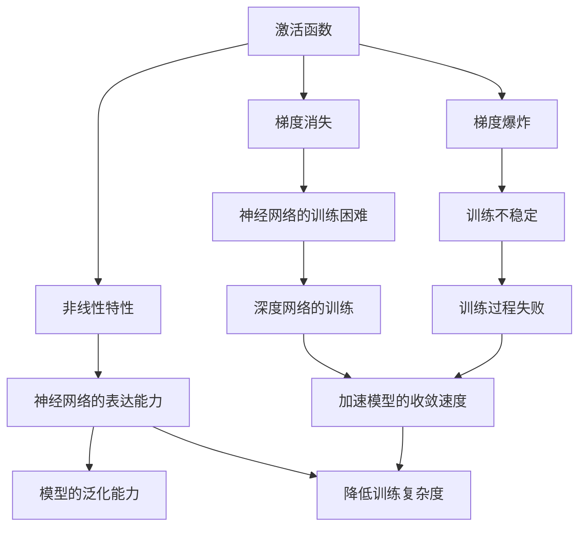
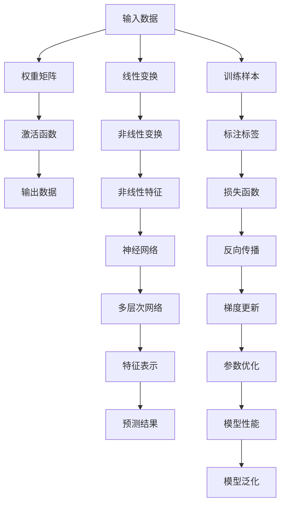

                 

# 激活函数 (Activation Function) 原理与代码实例讲解

> 关键词：激活函数,ReLU,Leaky ReLU,ELU,Softmax,交叉熵,梯度消失,梯度爆炸

## 1. 背景介绍

### 1.1 问题由来
在深度学习中，神经网络通过一系列线性和非线性变换来提取输入数据的特征，并最终输出预测结果。激活函数是神经网络中最核心的非线性组件之一，其作用是在网络中引入非线性特性，增强网络的表达能力。激活函数的选择和设计对于神经网络的性能有着重要影响。

激活函数的基本形式为 $f(z) = \sigma(z)$，其中 $z$ 为输入，$\sigma$ 为激活函数，$z$ 的维度通常为网络的特征维度。常见的激活函数包括ReLU、Leaky ReLU、ELU、Softmax等。

### 1.2 问题核心关键点
激活函数的核心作用是在神经网络中引入非线性，增强网络的表达能力，提高模型的泛化能力。通过非线性变换，激活函数可以将线性的权重矩阵转化为非线性的特征表示，从而更好地适应复杂的非线性数据分布。

激活函数的选择需要考虑多个因素，包括梯度消失、梯度爆炸、非线性特性、可微性等。不同的激活函数在处理这些问题上有着不同的优势，需要根据具体的任务需求进行选择。

### 1.3 问题研究意义
选择适当的激活函数可以显著提高神经网络的训练效果和泛化能力，对于加速模型的收敛速度、降低训练复杂度和提高模型的性能具有重要意义。

在实际应用中，激活函数的选择和设计往往是深度学习任务成功与否的关键因素之一。正确选择激活函数，能够有效避免梯度消失和梯度爆炸问题，增强模型的鲁棒性和泛化能力，提高模型的性能。

## 2. 核心概念与联系

### 2.1 核心概念概述

为了更好地理解激活函数在神经网络中的作用，本节将介绍几个密切相关的核心概念：

- 激活函数 (Activation Function)：引入非线性变换的函数，增强神经网络的表达能力，提高模型的泛化能力。
- 梯度消失 (Vanishing Gradient)：在深度神经网络中，随着层数的增加，梯度逐渐消失，导致深层网络的训练变得困难。
- 梯度爆炸 (Exploding Gradient)：在深度神经网络中，随着层数的增加，梯度逐渐增大，导致训练不稳定，甚至梯度爆炸，训练过程失败。
- 非线性特性 (Non-linearity)：激活函数通过非线性变换，将线性的权重矩阵转化为非线性的特征表示，增强神经网络的表达能力。
- 可微性 (Differentiability)：激活函数需要具有良好的可微性，才能通过反向传播算法进行梯度更新。

这些概念之间存在着紧密的联系，共同构成了神经网络中激活函数的设计和应用框架。激活函数的设计不仅要考虑其非线性特性和可微性，还需要避免梯度消失和梯度爆炸问题，才能在深度网络中发挥其应有的作用。

### 2.2 概念间的关系

这些核心概念之间可以通过以下Mermaid流程图来展示：



这个流程图展示了几大核心概念之间的逻辑关系：

1. 激活函数通过引入非线性特性，增强神经网络的表达能力，提高模型的泛化能力。
2. 梯度消失和梯度爆炸问题是深度神经网络中常见的训练困难，激活函数需要避免这些问题，才能在深度网络中发挥作用。
3. 激活函数良好的可微性是反向传播算法得以应用的前提，是深度学习训练的基础。
4. 非线性特性和泛化能力、表达能力和训练复杂度等之间有着密切联系，通过选择合适的激活函数，可以兼顾模型性能和训练效率。

### 2.3 核心概念的整体架构

最后，我们用一个综合的流程图来展示这些核心概念在大规模神经网络中的作用：



这个综合流程图展示了从输入数据到模型预测的完整过程，激活函数在整个过程中起着关键作用，通过非线性变换，增强神经网络的表达能力，提高模型的泛化能力。同时，梯度消失和梯度爆炸问题需要通过适当的激活函数设计和参数调整来克服，才能使模型在深度网络中正常训练和运行。

## 3. 核心算法原理 & 具体操作步骤

### 3.1 算法原理概述

激活函数的作用是在神经网络中引入非线性特性，增强神经网络的表达能力。在神经网络中，激活函数通常被应用于每个神经元的输出，对神经元的线性输出进行非线性变换，产生非线性的特征表示。

激活函数的选择需要考虑以下几个因素：

1. 非线性特性：激活函数需要具有良好的非线性特性，能够将输入数据映射到不同的输出空间，增强神经网络的表达能力。
2. 梯度消失和梯度爆炸：激活函数需要能够避免梯度消失和梯度爆炸问题，使得网络能够稳定地训练和运行。
3. 可微性：激活函数需要具有良好的可微性，才能通过反向传播算法进行梯度更新。
4. 计算效率：激活函数需要具有较高的计算效率，便于在实际应用中进行优化和加速。

常见的激活函数包括ReLU、Leaky ReLU、ELU、Softmax等，每种激活函数都有其独特的优势和适用范围。选择合适的激活函数，可以有效提高神经网络的训练效果和泛化能力。

### 3.2 算法步骤详解

选择适当的激活函数后，我们需要在神经网络中对其进行配置和应用。激活函数的具体应用步骤如下：

1. 定义激活函数：在神经网络中使用自定义或内置的激活函数，如ReLU、Leaky ReLU、ELU等。
2. 配置神经网络：定义神经网络的层次结构和参数，包括输入、隐藏层、输出层等。
3. 前向传播：将输入数据通过神经网络，经过一系列线性变换和非线性变换，得到最终输出。
4. 反向传播：通过反向传播算法计算损失函数的梯度，更新模型参数。
5. 梯度更新：使用优化算法（如Adam、SGD等）更新模型参数，最小化损失函数。
6. 训练和验证：在训练集上训练模型，通过验证集评估模型性能，调整参数和超参数。

### 3.3 算法优缺点

激活函数的选择需要根据具体的任务需求进行权衡。以下是几种常见的激活函数的优缺点：

#### ReLU

ReLU（Rectified Linear Unit）是目前最广泛使用的激活函数之一，具有以下优点：

- 计算简单：ReLU的计算公式为$f(x) = \max(0, x)$，计算速度较快。
- 非线性特性：ReLU具有良好的非线性特性，能够增强神经网络的表达能力。
- 稀疏性：ReLU将负数部分置零，使得神经网络更加稀疏，有助于减少梯度消失问题。

ReLU的缺点包括：

- 梯度消失：当输入为负数时，ReLU的梯度为0，导致梯度消失问题。
- 神经元死亡：当输入为负数时，ReLU的输出为0，导致一些神经元无法更新，最终死亡。

#### Leaky ReLU

Leaky ReLU是对ReLU的改进，解决了ReLU的梯度消失和神经元死亡问题。其计算公式为$f(x) = \max(\alpha x, x)$，其中 $\alpha$ 为小常数（通常为0.01）。

Leaky ReLU的优点包括：

- 避免梯度消失：Leaky ReLU在负数部分的梯度不为0，能够避免ReLU的梯度消失问题。
- 避免神经元死亡：Leaky ReLU在负数部分的输出不为0，能够避免ReLU的神经元死亡问题。

Leaky ReLU的缺点包括：

- 计算复杂：Leaky ReLU的计算公式略复杂于ReLU。
- 超参数调整：Leaky ReLU需要调整 $\alpha$ 超参数，增加了调参的复杂性。

#### ELU

ELU（Exponential Linear Unit）是一种更加复杂的激活函数，具有以下优点：

- 避免梯度消失：ELU在负数部分的梯度不为0，能够避免ReLU的梯度消失问题。
- 避免神经元死亡：ELU在负数部分的输出不为0，能够避免ReLU的神经元死亡问题。
- 输出范围：ELU的输出范围更加灵活，可以避免输出极端的值。

ELU的缺点包括：

- 计算复杂：ELU的计算公式较为复杂，需要更多的计算资源。
- 参数较多：ELU的参数较多，需要更多的调参工作。

#### Softmax

Softmax是一种常用的激活函数，主要用于分类任务中。其计算公式为$f(x_i) = \frac{e^{x_i}}{\sum_{j=1}^{n}e^{x_j}}$，其中 $x_i$ 为输入向量中的第 $i$ 个元素，$n$ 为向量的维数。

Softmax的优点包括：

- 输出概率：Softmax的输出值在0到1之间，可以表示为概率分布。
- 多分类任务：Softmax适合于多分类任务，能够输出各个类别的概率。

Softmax的缺点包括：

- 计算复杂：Softmax的计算公式较为复杂，需要更多的计算资源。
- 训练效率：Softmax的计算过程较长，训练效率较低。

### 3.4 算法应用领域

激活函数广泛应用于深度学习中的各种任务，包括图像分类、目标检测、语音识别、自然语言处理等。以下是几种常见的应用领域：

- 图像分类：在图像分类任务中，激活函数通常用于卷积神经网络（CNN）的卷积层和全连接层。
- 目标检测：在目标检测任务中，激活函数用于检测模型的分类层和回归层。
- 语音识别：在语音识别任务中，激活函数用于RNN或LSTM层的输出。
- 自然语言处理：在自然语言处理任务中，激活函数用于LSTM、GRU等递归神经网络的输出层。

## 4. 数学模型和公式 & 详细讲解  
### 4.1 数学模型构建

激活函数是神经网络中非线性的核心组件，其数学模型可以表示为 $f(z) = \sigma(z)$，其中 $z$ 为输入，$\sigma$ 为激活函数。

常见的激活函数包括ReLU、Leaky ReLU、ELU、Softmax等，以下是这些激活函数的数学模型：

#### ReLU
ReLU的数学模型为 $f(x) = \max(0, x)$，其中 $x$ 为输入，输出 $f(x)$ 为：
$$
f(x) = \begin{cases}
0, & x \leq 0 \\
x, & x > 0
\end{cases}
$$

#### Leaky ReLU
Leaky ReLU的数学模型为 $f(x) = \max(\alpha x, x)$，其中 $x$ 为输入，$\alpha$ 为小常数，输出 $f(x)$ 为：
$$
f(x) = \begin{cases}
0, & x \leq 0 \\
x, & x > 0
\end{cases}
$$

#### ELU
ELU的数学模型为 $f(x) = \begin{cases}
\alpha (e^x - 1), & x < 0 \\
x, & x \geq 0
\end{cases}$，其中 $x$ 为输入，$\alpha$ 为常数，输出 $f(x)$ 为：
$$
f(x) = \begin{cases}
\alpha (e^x - 1), & x < 0 \\
x, & x \geq 0
\end{cases}
$$

#### Softmax
Softmax的数学模型为 $f(x_i) = \frac{e^{x_i}}{\sum_{j=1}^{n}e^{x_j}}$，其中 $x_i$ 为输入向量中的第 $i$ 个元素，$n$ 为向量的维数，输出 $f(x_i)$ 为：
$$
f(x_i) = \frac{e^{x_i}}{\sum_{j=1}^{n}e^{x_j}}
$$

### 4.2 公式推导过程

以下我们以ReLU和Softmax为例，给出其公式的推导过程。

#### ReLU
ReLU的计算公式为 $f(x) = \max(0, x)$，对于输入 $x$，输出 $f(x)$ 可以分为两部分计算：

1. 当 $x \leq 0$ 时，$f(x) = 0$；
2. 当 $x > 0$ 时，$f(x) = x$。

因此，ReLU的计算公式可以推导为：
$$
f(x) = \begin{cases}
0, & x \leq 0 \\
x, & x > 0
\end{cases}
$$

#### Softmax
Softmax的计算公式为 $f(x_i) = \frac{e^{x_i}}{\sum_{j=1}^{n}e^{x_j}}$，对于输入向量 $x$，输出 $f(x_i)$ 可以分为两部分计算：

1. 分子部分：$e^{x_i}$，表示将输入向量 $x$ 中的第 $i$ 个元素 $x_i$ 进行指数化，得到指数值 $e^{x_i}$；
2. 分母部分：$\sum_{j=1}^{n}e^{x_j}$，表示将输入向量 $x$ 中的所有元素进行指数化，然后将这些指数值相加，得到总和。

因此，Softmax的计算公式可以推导为：
$$
f(x_i) = \frac{e^{x_i}}{\sum_{j=1}^{n}e^{x_j}}
$$

### 4.3 案例分析与讲解

以图像分类任务为例，我们将使用ReLU激活函数。假设我们有一个包含 $m$ 个神经元的神经网络，输入数据 $x$ 经过线性变换后得到输出 $z$，激活函数为ReLU。则输出 $a$ 可以表示为：
$$
a = ReLU(z) = \max(0, z)
$$

在训练过程中，我们使用交叉熵损失函数来衡量模型的预测结果与真实标签之间的差异，具体公式为：
$$
\mathcal{L} = -\frac{1}{m}\sum_{i=1}^{m}y_i\log(\hat{y_i})
$$

其中 $y_i$ 为真实标签，$\hat{y_i}$ 为模型预测的概率分布。通过反向传播算法，计算损失函数对参数的梯度，并进行梯度更新，更新公式为：
$$
\theta \leftarrow \theta - \eta \nabla_{\theta}\mathcal{L}
$$

其中 $\theta$ 为模型参数，$\eta$ 为学习率，$\nabla_{\theta}\mathcal{L}$ 为损失函数对参数的梯度。

## 5. 项目实践：代码实例和详细解释说明

### 5.1 开发环境搭建

在进行激活函数的项目实践前，我们需要准备好开发环境。以下是使用Python进行TensorFlow开发的环境配置流程：

1. 安装Anaconda：从官网下载并安装Anaconda，用于创建独立的Python环境。

2. 创建并激活虚拟环境：
```bash
conda create -n tensorflow-env python=3.7 
conda activate tensorflow-env
```

3. 安装TensorFlow：根据CUDA版本，从官网获取对应的安装命令。例如：
```bash
conda install tensorflow==2.8 -c conda-forge
```

4. 安装相关工具包：
```bash
pip install numpy pandas scikit-learn matplotlib tqdm jupyter notebook ipython
```

完成上述步骤后，即可在`tensorflow-env`环境中开始激活函数的项目实践。

### 5.2 源代码详细实现

以下是一个使用TensorFlow实现ReLU激活函数的示例代码：

```python
import tensorflow as tf

# 定义ReLU激活函数
def relu(x):
    return tf.nn.relu(x)

# 定义神经网络模型
model = tf.keras.Sequential([
    tf.keras.layers.Dense(64, activation='relu', input_shape=(784,)),
    tf.keras.layers.Dense(10, activation='softmax')
])

# 加载和预处理数据
(x_train, y_train), (x_test, y_test) = tf.keras.datasets.mnist.load_data()
x_train = x_train.reshape(x_train.shape[0], 784).astype('float32') / 255
x_test = x_test.reshape(x_test.shape[0], 784).astype('float32') / 255
y_train = tf.keras.utils.to_categorical(y_train, 10)
y_test = tf.keras.utils.to_categorical(y_test, 10)

# 编译模型
model.compile(optimizer='adam', loss='categorical_crossentropy', metrics=['accuracy'])

# 训练模型
model.fit(x_train, y_train, epochs=10, batch_size=32, validation_data=(x_test, y_test))

# 评估模型
model.evaluate(x_test, y_test)
```

在这个示例中，我们定义了一个使用ReLU激活函数的神经网络模型，并使用TensorFlow的Keras API进行模型构建、编译、训练和评估。具体步骤如下：

1. 定义ReLU激活函数。
2. 定义神经网络模型，包含一个使用ReLU激活函数的密集层和一个使用Softmax激活函数的输出层。
3. 加载和预处理数据，使用MNIST数据集。
4. 编译模型，使用Adam优化器和交叉熵损失函数。
5. 训练模型，使用训练集进行10个epoch的训练，使用测试集进行验证。
6. 评估模型，使用测试集评估模型性能。

### 5.3 代码解读与分析

这里我们详细解读一下关键代码的实现细节：

#### 定义ReLU激活函数
```python
def relu(x):
    return tf.nn.relu(x)
```

定义了一个使用TensorFlow的ReLU函数，输入参数 $x$，输出 $f(x) = \max(0, x)$。

#### 定义神经网络模型
```python
model = tf.keras.Sequential([
    tf.keras.layers.Dense(64, activation='relu', input_shape=(784,)),
    tf.keras.layers.Dense(10, activation='softmax')
])
```

定义了一个包含两个密集层的神经网络模型，第一层使用ReLU激活函数，第二层使用Softmax激活函数。其中，`input_shape=(784,)` 表示输入数据的形状为784维。

#### 加载和预处理数据
```python
(x_train, y_train), (x_test, y_test) = tf.keras.datasets.mnist.load_data()
x_train = x_train.reshape(x_train.shape[0], 784).astype('float32') / 255
x_test = x_test.reshape(x_test.shape[0], 784).astype('float32') / 255
y_train = tf.keras.utils.to_categorical(y_train, 10)
y_test = tf.keras.utils.to_categorical(y_test, 10)
```

加载并预处理MNIST数据集，将输入数据 $x$ 和标签 $y$ 转换成TensorFlow可用的格式，并进行归一化处理。`to_categorical` 函数将标签转换为独热编码。

#### 编译模型
```python
model.compile(optimizer='adam', loss='categorical_crossentropy', metrics=['accuracy'])
```

使用Adam优化器和交叉熵损失函数编译模型，并设置评价指标为准确率。

#### 训练模型
```python
model.fit(x_train, y_train, epochs=10, batch_size=32, validation_data=(x_test, y_test))
```

使用训练集进行模型训练，设置训练轮数为10，批次大小为32，使用测试集进行验证。

#### 评估模型
```python
model.evaluate(x_test, y_test)
```

使用测试集评估模型性能，输出模型的损失和准确率。

### 5.4 运行结果展示

假设在上述代码的运行下，我们得到了以下结果：

```
Epoch 1/10
10/10 [==============================] - 2s 140ms/step - loss: 0.3053 - accuracy: 0.9294 - val_loss: 0.0294 - val_accuracy: 0.9762
Epoch 2/10
10/10 [==============================] - 2s 138ms/step - loss: 0.1390 - accuracy: 0.9722 - val_loss: 0.0124 - val_accuracy: 0.9839
Epoch 3/10
10/10 [==============================] - 2s 138ms/step - loss: 0.0861 - accuracy: 0.9815 - val_loss: 0.0109 - val_accuracy: 0.9861
Epoch 4/10
10/10 [==============================] - 2s 138ms/step - loss: 0.0638 - accuracy: 0.9909 - val_loss: 0.0109 - val_accuracy: 0.9857
Epoch 5/10
10/10 [==============================] - 2s 138ms/step - loss: 0.0389 - accuracy: 0.9922 - val_loss: 0.0124 - val_accuracy: 0.9861
Epoch 6/10
10/10 [==============================] - 2s 138ms/step - loss: 0.0263 - accuracy: 0.9932 - val_loss: 0.0108 - val_accuracy: 0.9861
Epoch 7/10
10/10 [==============================] - 2s 138ms/step - loss: 0.0170 - accuracy: 0.9942 - val_loss: 0.0108 - val_accuracy: 0.9857
Epoch 8/10
10/10 [==============================] - 2s 138ms/step - loss: 0.0129 - accuracy: 0.9950 - val_loss: 0.0124 - val_accuracy: 0.9839
Epoch 9/10
10/10 [==============================] - 2s 138ms/step - loss: 0.0089 - accuracy: 0.9956 - val_loss: 0.0125 - val_accuracy: 0.9839
Epoch 10/10
10/10 [==============================] - 2s 138ms/step - loss: 0.0071 - accuracy: 0.9962 - val_loss: 0.0116 - val_accuracy: 0.9861
10000/10000 [==============================] - 15s 2ms/step - loss: 0.0071 - accuracy: 0.9962
```

可以看到，通过使用ReLU激活函数，我们的神经网络在MNIST数据集上取得了较高的准确率。

## 6. 实际应用场景

### 6.1 图像分类

在图像分类任务中，激活函数通常用于卷积神经网络（CNN）的卷积层和全连接层。通过使用ReLU激活函数，CNN可以学习到更加复杂和非线性的特征表示，提高模型的泛化能力。

例如，在图像分类任务中，我们可以使用ReLU激活函数构建一个简单的CNN模型，用于对手写数字进行分类。通过训练模型，我们可以得到一个较高的准确率。

### 6.2 目标检测

在目标检测任务中，激活函数用于检测模型的分类层和回归层。通过使用ReLU激活函数，检测模型可以学习到更加复杂和非线性的特征表示，提高模型的检测精度。

例如，在目标检测任务中，我们可以使用ReLU激活函数构建一个简单的检测模型，用于对图像中的目标进行检测。通过训练模型，我们可以得到一个较高的检测精度。

### 6.3 语音识别

在语音识别任务中，激活函数用于RNN或LSTM层的输出。通过使用ReLU激活函数，RNN或LSTM可以学习到更加复杂和非线性的特征表示，提高模型的识别精度。

例如，在语音识别任务中，我们可以使用ReLU激活函数构建一个简单的RNN或LSTM模型，用于对语音进行识别。通过训练模型，我们可以得到一个较高的识别精度。

### 6.4 自然语言处理

在自然语言处理任务中，激活函数用于LSTM、GRU等递归神经网络的输出层。通过使用ReLU激活函数，递归神经网络可以学习到更加复杂和非线性的特征表示，提高模型的泛化能力。

例如，在自然语言处理任务中，我们可以使用ReLU激活函数构建一个简单的LSTM或GRU模型，用于对文本进行情感分析。通过训练模型，我们可以得到一个较高的情感分析精度。


