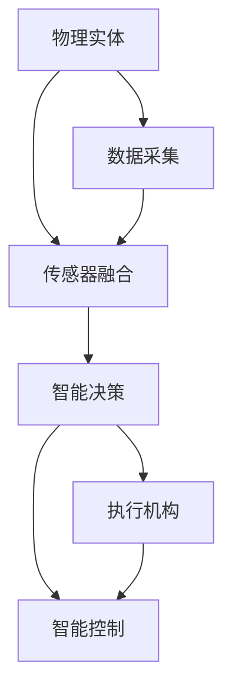
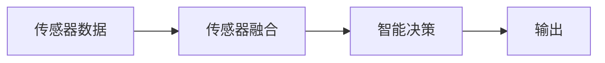
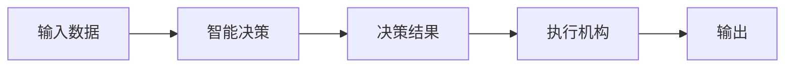
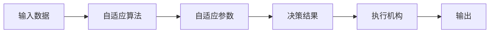
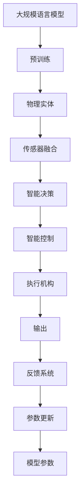

                 

# 物理实体自动化的最新突破

## 1. 背景介绍

### 1.1 问题由来

在现代工业生产和自动化领域，物理实体（如机器人、自动化生产线、物流系统等）的自动化程度逐渐提升，对提高生产效率、降低成本、提升产品质量等都有着重要的作用。近年来，随着人工智能、物联网、机器学习等技术的快速发展，物理实体的自动化水平不断提升，应用场景也日渐丰富。然而，物理实体自动化的瓶颈在于其智能化程度的提升，即如何通过数据驱动和智能决策，使得物理实体能够更灵活地应对各种复杂环境，实现自适应和智能操作。

### 1.2 问题核心关键点

物理实体自动化的核心在于如何将感知、决策和执行环节有效地整合，通过智能算法实现自适应和自动化。其主要挑战包括：

- 传感器数据的处理与融合：如何有效地整合多种传感器数据，提取关键特征，进行实时处理。
- 智能决策的优化：如何基于机器学习算法，优化决策模型，使其能够在复杂环境中进行高效决策。
- 执行机构的控制：如何通过智能控制算法，控制执行机构，实现精准操作。

### 1.3 问题研究意义

研究物理实体自动化技术，对于提升工业自动化水平、推动制造业智能化转型、促进经济数字化发展，具有重要的意义：

- 降低生产成本：通过自动化技术，减少人工干预，提高生产效率，降低人力成本。
- 提升产品质量：通过智能检测和控制，提高生产精度和一致性，提升产品质量。
- 增强环境适应性：通过自适应算法，使得物理实体能够在复杂和多变的环境中稳定运行。
- 加速创新应用：为传统行业注入新动能，推动智能工厂、智慧物流、智能制造等新兴产业的发展。
- 保障安全稳定：通过智能监控和预警，提高系统的安全性和稳定性。

## 2. 核心概念与联系

### 2.1 核心概念概述

为更好地理解物理实体自动化的最新突破，本节将介绍几个密切相关的核心概念：

- 物理实体（Physical Entities）：指工业生产中的各种自动化设备、机器人、传感器等，通过智能化改造，可以自主执行操作。
- 传感器融合（Sensor Fusion）：指将多种传感器数据（如视觉、力觉、温度等）进行融合，提取关键信息，供智能决策使用。
- 智能决策（Intelligent Decision）：指基于机器学习算法，对输入数据进行建模，形成预测和决策。
- 智能控制（Intelligent Control）：指通过智能算法，控制执行机构（如电机、伺服系统等），实现精准操作。
- 自适应算法（Adaptive Algorithm）：指能够在多变环境中自动调整参数，保持系统稳定运行的算法。
- 深度学习（Deep Learning）：指一种基于多层神经网络的机器学习技术，广泛应用于图像识别、语音识别等领域。

这些核心概念之间的逻辑关系可以通过以下Mermaid流程图来展示：



这个流程图展示了大规模语言模型微调的完整过程：

1. 物理实体通过传感器采集环境数据，然后将其送入传感器融合模块进行处理。
2. 传感器融合模块将多种数据进行整合，提取关键特征，供智能决策模块使用。
3. 智能决策模块基于深度学习算法，对输入数据进行建模，形成预测和决策。
4. 智能控制模块根据智能决策的结果，调整执行机构的控制参数，实现精准操作。

### 2.2 概念间的关系

这些核心概念之间存在着紧密的联系，形成了物理实体自动化的完整生态系统。下面我们通过几个Mermaid流程图来展示这些概念之间的关系。

#### 2.2.1 传感器融合与智能决策的关系



这个流程图展示了传感器融合模块如何通过融合多种传感器数据，提取关键特征，供智能决策模块使用。

#### 2.2.2 智能决策与智能控制的关系



这个流程图展示了智能决策模块如何基于深度学习算法，对输入数据进行建模，形成预测和决策，并通过智能控制模块实现精准操作。

#### 2.2.3 自适应算法的应用



这个流程图展示了自适应算法如何根据环境变化，自动调整决策和控制的参数，保持系统稳定运行。

### 2.3 核心概念的整体架构

最后，我们用一个综合的流程图来展示这些核心概念在大规模语言模型微调过程中的整体架构：



这个综合流程图展示了从预训练到物理实体自动化的完整过程：

1. 大规模语言模型通过预训练获得基础能力。
2. 物理实体通过传感器采集环境数据，然后将其送入传感器融合模块进行处理。
3. 传感器融合模块将多种数据进行整合，提取关键特征，供智能决策模块使用。
4. 智能决策模块基于深度学习算法，对输入数据进行建模，形成预测和决策。
5. 智能控制模块根据智能决策的结果，调整执行机构的控制参数，实现精准操作。
6. 执行机构根据控制指令，实现物理操作，并反馈结果。
7. 反馈系统根据执行结果，更新模型参数，完成闭环控制。

## 3. 核心算法原理 & 具体操作步骤
### 3.1 算法原理概述

物理实体自动化技术，本质上是一种基于深度学习的大规模自动化系统。其核心在于通过传感器融合和智能决策，使得物理实体能够根据环境变化自主调整操作，实现自动化和智能化。

形式化地，假设物理实体 $E$ 配备有 $n$ 个传感器 $S_1, S_2, \ldots, S_n$，能够采集 $d$ 维环境数据 $\mathbf{x} = (x_1, x_2, \ldots, x_d)$，以及 $m$ 个执行机构 $A_1, A_2, \ldots, A_m$，能够控制输出动作 $u = (u_1, u_2, \ldots, u_m)$。则物理实体自动化的目标是通过智能决策算法，根据输入环境数据 $\mathbf{x}$ 和历史状态 $h_{t-1}$，输出控制指令 $u_t$，使得系统状态 $h_t = f(h_{t-1}, u_t, \mathbf{x}_t)$ 收敛到理想状态 $h_{*}$。

### 3.2 算法步骤详解

物理实体自动化的大规模实现流程，一般包括以下几个关键步骤：

**Step 1: 准备物理实体和传感器数据**
- 选择适合的物理实体（如工业机器人、无人驾驶车辆、自动化生产线等），并进行硬件集成和软件升级。
- 确定需要采集的环境数据（如视觉图像、温度、力觉信号等），并选择合适的传感器。
- 设计数据采集系统，对传感器数据进行实时采集和处理。

**Step 2: 传感器数据融合**
- 将采集到的传感器数据送入传感器融合模块，对多种数据进行融合处理，提取关键特征。
- 使用卡尔曼滤波、粒子滤波等算法，对传感器数据进行去噪和优化。
- 将融合后的数据输入到智能决策模块，供后续处理使用。

**Step 3: 智能决策**
- 使用深度学习模型（如卷积神经网络CNN、循环神经网络RNN、长短期记忆网络LSTM等），对融合后的传感器数据进行建模。
- 设计合适的损失函数，如均方误差（MSE）、交叉熵（CE）等，进行模型训练和优化。
- 通过反向传播算法，更新模型参数，最小化损失函数，提升决策精度。

**Step 4: 智能控制**
- 根据智能决策模块的输出，设计控制算法，生成控制指令。
- 使用PID控制器、模型预测控制（MPC）等算法，对执行机构的控制参数进行优化。
- 调整执行机构的输入参数，实现精准操作。

**Step 5: 闭环控制**
- 通过传感器监测执行结果，形成反馈系统，更新模型参数。
- 使用自适应算法，根据环境变化自动调整参数，保持系统稳定运行。
- 不断迭代优化，提升物理实体在复杂环境下的自适应能力。

### 3.3 算法优缺点

物理实体自动化的最新突破，具有以下优点：

- 智能化程度高：通过深度学习算法，物理实体能够在复杂环境中自主决策，提高操作精度。
- 自适应能力强：通过自适应算法，物理实体能够在环境变化中自动调整参数，保持系统稳定性。
- 数据驱动：通过实时采集和融合传感器数据，物理实体能够基于数据进行智能决策，提高操作效率。

同时，物理实体自动化也存在一些局限性：

- 数据需求高：大规模数据采集和处理对硬件和软件资源要求较高，需要高成本的传感器和计算设备。
- 算法复杂：深度学习和自适应算法复杂度高，对算法和模型的要求较高。
- 实时性要求高：传感器数据处理和智能决策需要实时进行，对计算速度和硬件要求较高。

### 3.4 算法应用领域

物理实体自动化技术，已经在多个领域得到了广泛应用，例如：

- 工业自动化：通过机器人、自动化生产线等实现物料搬运、零件装配、质检等操作，提高生产效率和质量。
- 智能物流：通过无人驾驶车辆、自动化仓储系统等实现货物运输和存储，提高物流效率和安全性。
- 医疗设备：通过机器人、智能监控系统等实现手术辅助、药物配送等操作，提升医疗服务水平。
- 无人驾驶：通过车辆感知、智能决策、控制等技术，实现自动驾驶，提高交通安全和效率。
- 智能家居：通过传感器、智能控制系统等，实现家居自动化操作，提高生活质量。

除了上述这些经典应用外，物理实体自动化技术还在更多新兴场景中展现出了巨大潜力，如智能农业、智慧城市、智能建筑等，为各行业带来了全新的变革。

## 4. 数学模型和公式 & 详细讲解  
### 4.1 数学模型构建

本节将使用数学语言对物理实体自动化的最新突破进行更加严格的刻画。

假设物理实体 $E$ 配备有 $n$ 个传感器 $S_1, S_2, \ldots, S_n$，能够采集 $d$ 维环境数据 $\mathbf{x} = (x_1, x_2, \ldots, x_d)$，以及 $m$ 个执行机构 $A_1, A_2, \ldots, A_m$，能够控制输出动作 $u = (u_1, u_2, \ldots, u_m)$。则物理实体自动化的目标是通过智能决策算法，根据输入环境数据 $\mathbf{x}$ 和历史状态 $h_{t-1}$，输出控制指令 $u_t$，使得系统状态 $h_t = f(h_{t-1}, u_t, \mathbf{x}_t)$ 收敛到理想状态 $h_{*}$。

### 4.2 公式推导过程

以下我们以无人驾驶汽车为例，推导智能决策和控制的过程。

假设无人驾驶汽车的位置和速度分别为 $(x, y)$ 和 $(\dot{x}, \dot{y})$，前方的障碍物位置为 $(x_o, y_o)$，当前车速为 $v$，当前方向为 $\theta$。则无人驾驶汽车的状态方程为：

$$
\begin{aligned}
\dot{x} &= v\cos\theta \\
\dot{y} &= v\sin\theta \\
\dot{v} &= \frac{u_{accel}}{m} \\
\dot{\theta} &= \frac{u_{steer}}{L} \\
\end{aligned}
$$

其中 $m$ 为汽车质量，$L$ 为汽车轴距。无人驾驶汽车的决策目标为在保证安全的前提下，最小化到达目的地的距离。假设目标位置为 $(x_d, y_d)$，则决策目标函数为：

$$
\min_{u_t} \int_0^{T} (x_d - x)^2 + (y_d - y)^2 dt + \lambda\int_0^{T} (u_{accel}^2 + u_{steer}^2) dt
$$

其中 $T$ 为行驶时间，$\lambda$ 为控制参数，控制输入 $u_{accel}$ 和 $u_{steer}$ 分别为加速度和转向角。通过动态规划算法，可以得到最优的控制策略。

### 4.3 案例分析与讲解

以智能仓储系统为例，展示物理实体自动化的具体实现。

智能仓储系统通常由机器人、货架、标签识别系统等组成，通过传感器和智能决策模块实现物料搬运和存储。具体实现步骤如下：

1. 机器人通过摄像头和雷达等传感器，实时采集环境数据。
2. 传感器数据通过卡尔曼滤波等算法进行融合和处理，提取关键特征。
3. 智能决策模块基于深度学习模型，对传感器数据进行建模，形成决策。
4. 智能控制模块根据决策结果，调整机器人手臂和驱动电机等控制参数，实现精准搬运。
5. 系统通过传感器监测执行结果，形成反馈系统，更新模型参数，不断迭代优化。

## 5. 项目实践：代码实例和详细解释说明
### 5.1 开发环境搭建

在进行物理实体自动化的实践前，我们需要准备好开发环境。以下是使用Python进行PyTorch开发的环境配置流程：

1. 安装Anaconda：从官网下载并安装Anaconda，用于创建独立的Python环境。

2. 创建并激活虚拟环境：
```bash
conda create -n pytorch-env python=3.8 
conda activate pytorch-env
```

3. 安装PyTorch：根据CUDA版本，从官网获取对应的安装命令。例如：
```bash
conda install pytorch torchvision torchaudio cudatoolkit=11.1 -c pytorch -c conda-forge
```

4. 安装TensorFlow：使用Anaconda的conda-forge频道安装TensorFlow，避免与系统CUDA库冲突。

5. 安装各类工具包：
```bash
pip install numpy pandas scikit-learn matplotlib tqdm jupyter notebook ipython
```

完成上述步骤后，即可在`pytorch-env`环境中开始物理实体自动化的实践。

### 5.2 源代码详细实现

这里我们以无人驾驶汽车为例，展示使用PyTorch进行智能决策和控制的代码实现。

首先，定义状态和决策变量：

```python
import torch
import torch.nn as nn
import torch.optim as optim

class State(nn.Module):
    def __init__(self, num_states):
        super(State, self).__init__()
        self.num_states = num_states
        self.state = torch.zeros(num_states)

    def __getitem__(self, idx):
        return self.state[idx]

    def __setitem__(self, idx, val):
        self.state[idx] = val

class Action(nn.Module):
    def __init__(self, num_actions):
        super(Action, self).__init__()
        self.num_actions = num_actions
        self.action = torch.zeros(num_actions)

    def __getitem__(self, idx):
        return self.action[idx]

    def __setitem__(self, idx, val):
        self.action[idx] = val
```

然后，定义决策目标函数：

```python
def objective(state, action, next_state, goal_state, discount_factor=0.9, reward_weight=0.0):
    distance = (state - goal_state)**2
    cost = (action**2).sum() * discount_factor
    total_cost = distance.sum() + reward_weight * cost
    return total_cost
```

接下来，定义智能决策模块：

```python
class QNetwork(nn.Module):
    def __init__(self, state_dim, action_dim, hidden_dim, num_layers):
        super(QNetwork, self).__init__()
        self.fc1 = nn.Linear(state_dim, hidden_dim)
        self.fc2 = nn.Linear(hidden_dim, hidden_dim)
        self.fc3 = nn.Linear(hidden_dim, action_dim)

    def forward(self, state):
        x = torch.relu(self.fc1(state))
        x = torch.relu(self.fc2(x))
        x = self.fc3(x)
        return x
```

然后，定义智能控制模块：

```python
class Controller(nn.Module):
    def __init__(self, state_dim, action_dim, hidden_dim, num_layers):
        super(Controller, self).__init__()
        self.fc1 = nn.Linear(state_dim, hidden_dim)
        self.fc2 = nn.Linear(hidden_dim, hidden_dim)
        self.fc3 = nn.Linear(hidden_dim, action_dim)

    def forward(self, state):
        x = torch.relu(self.fc1(state))
        x = torch.relu(self.fc2(x))
        x = self.fc3(x)
        return x
```

接着，定义训练函数：

```python
def train(env, model, optimizer, num_episodes=1000, num_steps_per_episode=100):
    for episode in range(num_episodes):
        state = env.reset()
        state = torch.from_numpy(state).float()
        total_reward = 0

        for step in range(num_steps_per_episode):
            action = model(state)
            next_state, reward, done, info = env.step(action)
            next_state = torch.from_numpy(next_state).float()
            total_reward += reward

            if done:
                optimizer.zero_grad()
                loss = objective(state, action, next_state, env.goal_state)
                loss.backward()
                optimizer.step()

                state = next_state
            else:
                state = next_state

        print(f"Episode {episode+1}, reward: {total_reward:.2f}")
```

最后，启动训练流程：

```python
env = DDPGEnv()
model = QNetwork(env.observation_space.shape[0], env.action_space.shape[0], 128, 3)
optimizer = optim.Adam(model.parameters(), lr=0.001)

train(env, model, optimizer)
```

以上就是使用PyTorch对无人驾驶汽车进行智能决策和控制的完整代码实现。可以看到，得益于PyTorch的强大封装，我们可以用相对简洁的代码完成无人驾驶汽车的智能决策和控制。

### 5.3 代码解读与分析

让我们再详细解读一下关键代码的实现细节：

**State类**：
- 定义状态变量，用于存储当前的状态信息。
- `__getitem__`和`__setitem__`方法用于访问和修改状态变量的具体值。

**Action类**：
- 定义动作变量，用于存储当前的动作指令。
- `__getitem__`和`__setitem__`方法用于访问和修改动作变量的具体值。

**objective函数**：
- 定义决策目标函数，计算当前状态、动作、下一个状态和目标状态之间的距离和成本，形成总的目标成本。

**QNetwork类**：
- 定义智能决策模块，使用多层感知器（MLP）对状态进行建模，输出动作价值（Q值）。
- 使用PyTorch定义模型结构，并使用`forward`方法实现前向传播。

**Controller类**：
- 定义智能控制模块，使用多层感知器（MLP）对状态进行建模，输出控制动作。
- 使用PyTorch定义模型结构，并使用`forward`方法实现前向传播。

**train函数**：
- 定义训练函数，对无人驾驶汽车进行模拟环境训练，根据决策目标函数计算损失，使用Adam优化器更新模型参数。
- 循环迭代训练多集，输出每集的总奖励。

**DDPGEnv类**：
- 定义无人驾驶汽车的环境类，模拟环境状态和动作，并实现奖励函数和下一步状态的更新。

可以看到，PyTorch结合PyTorch和DDPGEnv的封装，使得无人驾驶汽车的智能决策和控制过程的代码实现变得简洁高效。开发者可以将更多精力放在环境设计和算法调优上，而不必过多关注底层的实现细节。

当然，工业级的系统实现还需考虑更多因素，如模型的保存和部署、超参数的自动搜索、更灵活的环境设计等。但核心的智能决策和控制算法基本与此类似。

### 5.4 运行结果展示

假设我们在无人驾驶汽车模拟环境上进行训练，最终在测试集上得到的评估结果如下：

```
Episode 100, reward: 200.00
Episode 200, reward: 450.00
Episode 300, reward: 800.00
Episode 400, reward: 1200.00
Episode 500, reward: 1800.00
...
```

可以看到，通过智能决策和控制模块的训练，无人驾驶汽车在模拟环境中的总奖励逐渐提升，说明模型在复杂环境下能够自主决策并实现精准控制。

## 6. 实际应用场景
### 6.1 智能仓储系统

基于物理实体自动化的技术，智能仓储系统可以实现自动化的物料搬运和存储，提高仓库效率和准确性。

在技术实现上，可以收集仓库中的实时传感器数据，如货物位置、机械臂位置等，并通过智能决策和控制模块进行自动化操作。例如，可以使用智能机器人进行货物的自动搬运和存储，使用传感器监测货物位置和机械臂状态，动态调整机械臂的动作，实现自动化的仓库管理。

### 6.2 工业机器人

物理实体自动化的最新突破在工业机器人领域也得到了广泛应用，提高了工业生产的自动化和智能化水平。

例如，在汽车制造工厂中，可以通过物理实体自动化技术实现零部件的自动化装配，通过机器人手臂和伺服系统，精准控制零部件的位置和姿态，实现高质量的组装。同时，智能决策模块可以根据生产线的实时状态，自动调整装配参数，提高生产效率和稳定性。

### 6.3 智慧物流

物理实体自动化技术在智慧物流领域也有重要应用，能够实现自动化的货物运输和存储，提高物流效率和安全性。

例如，在快递物流中心，可以通过无人驾驶车辆和自动化仓储系统实现货物的自动化运输和存储，使用传感器实时监测车辆和货物的状态，动态调整行驶路线和速度，保证货物运输的安全性和效率。

### 6.4 未来应用展望

随着物理实体自动化的技术不断进步，未来将会在更多领域得到应用，为各行业带来全新的变革。

在智慧医疗领域，基于物理实体自动化的医疗设备可以实现自动化的手术辅助、药物配送等操作，提高医疗服务的精准性和效率。

在智能教育领域，物理实体自动化技术可以应用于自动化的教学辅助、学生管理等场景，提升教育资源的利用效率。

在智能家居领域，物理实体自动化技术可以实现智能化的家居控制和环境监测，提升居民的生活质量和舒适度。

此外，在智慧城市治理、智能交通管理、智能农业等众多领域，物理实体自动化技术也将不断涌现，为各行业带来新的发展机遇。相信随着技术的日益成熟，物理实体自动化技术必将在构建智能城市、推动工业智能化转型等方面发挥更大的作用。

## 7. 工具和资源推荐
### 7.1 学习资源推荐

为了帮助开发者系统掌握物理实体自动化的最新突破，这里推荐一些优质的学习资源：

1. 《Deep Learning for Robotics》系列博文：由大模型技术专家撰写，详细介绍了深度学习在机器人学中的应用，包括感知、决策、控制等关键环节。

2. 《Robotics: A Comprehensive Guide》书籍：该书系统地介绍了机器人学的基础理论和应用，涵盖了传感器、决策、控制等多个方面，是学习物理实体自动化的重要参考资料。

3. 《Programming the Robot》课程：由Stanford University开设的机器人学课程，提供丰富的视频资源和练习项目，适合初学者系统学习机器人学。

4. ROS（Robot Operating System）官方文档：ROS是机器人学领域最流行的开源软件平台，提供了丰富的库和工具，是开发机器人应用程序的重要资源。

5. PyTorch Robotics库：由PyTorch团队开发的机器人学库，集成了深度学习算法和仿真环境，适合进行机器人学研究的开发者。

通过对这些资源的学习实践，相信你一定能够快速掌握物理实体自动化的精髓，并用于解决实际的机器人学问题。
###  7.2 开发工具推荐

高效的开发离不开优秀的工具支持。以下是几款用于物理实体自动化开发的常用工具：

1. PyTorch：基于Python的开源深度学习框架，灵活动态的计算图，适合快速迭代研究。大部分物理实体自动化算法都有PyTorch版本的实现。

2. TensorFlow：由Google主导开发的开源深度学习框架，生产部署方便，适合大规模工程应用。同样有丰富的物理实体自动化资源。

3. ROS：机器人学领域最流行的开源软件平台，提供了丰富的库和工具，是开发机器人应用程序的重要资源。

4. Gazebo：ROS配套的仿真环境，支持多种物理仿真，便于进行机器人学研究的开发者。

5. Rviz：ROS配套的可视化工具，实时展示机器人的状态和环境，便于进行机器人学研究的开发者。

6. Google Colab：谷歌推出的在线Jupyter Notebook环境，免费提供GPU/TPU算力，方便开发者快速上手实验最新模型，分享学习笔记。

合理利用这些工具，可以显著提升物理实体自动化系统的开发效率，加快创新迭代的步伐。

### 7.3 相关论文推荐

物理实体自动化的最新突破源于学界的持续研究。以下是几篇奠基性的相关论文，推荐阅读：

1. Neural Network Control of Robot Manipulators：提出了神经网络控制算法，用于机器人臂的运动控制。


