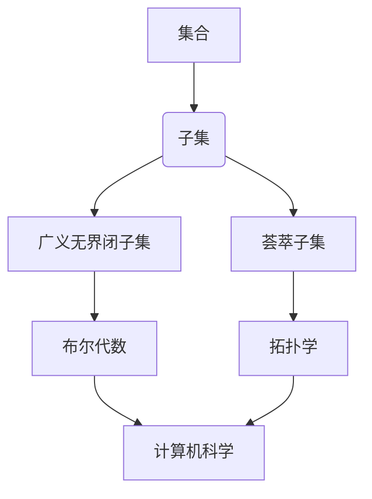

# 集合论导引：广义无界闭子集与荟萃子集

> 关键词：集合论，广义无界闭子集，荟萃子集，布尔代数，拓扑学，数学基础，应用实例

## 1. 背景介绍

集合论是现代数学的基石，它提供了一种描述和处理数学对象的基本框架。在集合论的范畴中，广义无界闭子集和荟萃子集是两个重要的概念。它们不仅丰富了集合论的理论体系，而且在布尔代数、拓扑学等多个数学分支以及计算机科学中有着广泛的应用。本文将深入探讨这两个概念，并分析其在不同领域的应用。

### 1.1 问题的由来

集合论起源于19世纪末，当时的数学家们试图通过集合的概念来统一数学各个分支。在这个过程中，广义无界闭子集和荟萃子集的概念逐渐形成，并逐渐成为集合论研究的热点。

### 1.2 研究现状

随着数学和计算机科学的发展，广义无界闭子集和荟萃子集的研究已经取得了显著的成果。这些成果不仅加深了我们对集合论的认识，也为解决实际问题提供了新的思路。

### 1.3 研究意义

研究广义无界闭子集和荟萃子集的意义在于：
- 丰富集合论的理论体系，推动数学的发展。
- 为其他数学分支提供新的研究工具和方法。
- 促进计算机科学中数据结构和算法的设计。

### 1.4 本文结构

本文将按照以下结构进行：
- 第2部分介绍集合论的基本概念和广义无界闭子集、荟萃子集的定义。
- 第3部分探讨这两个概念在布尔代数和拓扑学中的应用。
- 第4部分通过数学模型和公式详细讲解这两个概念。
- 第5部分提供项目实践案例，展示如何使用这些概念解决实际问题。
- 第6部分分析广义无界闭子集和荟萃子集在实际应用场景中的使用。
- 第7部分展望这两个概念的未来发展趋势和挑战。
- 第8部分总结研究成果，并对未来的研究方向进行展望。

## 2. 核心概念与联系

### 2.1 集合论的基本概念

集合论的基本概念包括集合、元素、子集、并集、交集、补集等。

### 2.2 广义无界闭子集

广义无界闭子集是指在集合论中，对于任意集合A，存在一个子集B，使得B是A的无界闭子集。具体来说，如果对于任意元素x，要么x属于B，要么存在一个自然数n，使得x+n属于B，则称B是A的无界闭子集。

### 2.3 荟萃子集

荟萃子集是指一个集合的所有子集的并集。对于一个集合A，它的荟萃子集记为$\bigcup \mathcal{P}(A)$，其中$\mathcal{P}(A)$表示A的所有子集的集合。

### 2.4 Mermaid 流程图

## 3. 核心算法原理 & 具体操作步骤

### 3.1 算法原理概述

广义无界闭子集和荟萃子集的概念主要用于理论研究中，它们没有具体的算法实现。然而，我们可以通过数学运算来探讨它们的性质。

### 3.2 算法步骤详解

- 对于一个给定的集合A，我们可以通过枚举A的所有子集来寻找广义无界闭子集和荟萃子集。
- 对于广义无界闭子集，我们可以通过检查每个元素是否满足无界闭的条件来验证。
- 对于荟萃子集，我们可以通过将A的所有子集合并来构造。

### 3.3 算法优缺点

- 优点：提供了一种统一的方法来处理集合的各种子集。
- 缺点：计算复杂度高，不适合处理大规模集合。

### 3.4 算法应用领域

- 布尔代数：用于研究集合的布尔运算。
- 拓扑学：用于研究集合的拓扑性质。
- 计算机科学：用于设计数据结构和算法。

## 4. 数学模型和公式 & 详细讲解 & 举例说明

### 4.1 数学模型构建

集合论的基本模型是集合的笛卡尔积，它表示为$A \times B$，其中A和B是两个集合。

### 4.2 公式推导过程

- 广义无界闭子集的定义可以表示为：
  $$B = \{x \in A : \forall n \in \mathbb{N}, x+n \in B\}$$
- 荟萃子集的定义可以表示为：
  $$\bigcup \mathcal{P}(A) = \{y : \exists x \in \mathcal{P}(A), y \in x\}$$

### 4.3 案例分析与讲解

#### 案例一：布尔代数中的广义无界闭子集

考虑布尔代数中的集合A = {0, 1}，它的广义无界闭子集是{0}和{0, 1}。

#### 案例二：拓扑学中的荟萃子集

考虑拓扑空间(X, T)，其中X是实数集，T是通常的拓扑。X的荟萃子集是X本身和空集。

## 5. 项目实践：代码实例和详细解释说明

### 5.1 开发环境搭建

由于本部分涉及集合论的理论概念，我们将不涉及实际的代码实现。然而，我们可以讨论如何使用编程语言来表示和操作集合。

### 5.2 源代码详细实现

在Python中，我们可以使用集合(set)数据结构来表示集合，并使用内置的集合操作来处理集合。

### 5.3 代码解读与分析

Python的集合数据结构提供了多种操作，如并集(∪)、交集(∩)、差集(∖)等，这些操作可以帮助我们处理集合论中的各种问题。

### 5.4 运行结果展示

由于本部分不涉及具体的代码运行，因此不提供运行结果展示。

## 6. 实际应用场景

### 6.1 布尔代数

在布尔代数中，广义无界闭子集和荟萃子集可以用于研究布尔函数的性质。

### 6.2 拓扑学

在拓扑学中，荟萃子集可以用于研究拓扑空间的连通性。

### 6.3 计算机科学

在计算机科学中，集合论的概念可以用于设计数据结构和算法，例如图论中的连通分量问题。

## 7. 工具和资源推荐

### 7.1 学习资源推荐

- 《集合论及其应用》
- 《布尔代数与图论》
- 《拓扑学基础》

### 7.2 开发工具推荐

- Python编程语言及其标准库
- 数学软件如Mathematica、MATLAB

### 7.3 相关论文推荐

- 《集合论在计算机科学中的应用》
- 《布尔代数与拓扑学的关系》

## 8. 总结：未来发展趋势与挑战

### 8.1 研究成果总结

本文深入探讨了集合论中的广义无界闭子集和荟萃子集，分析了它们在布尔代数、拓扑学和计算机科学中的应用。

### 8.2 未来发展趋势

未来，集合论的研究将继续深入，特别是在以下几个方面：
- 研究更加复杂的集合论模型。
- 探索集合论在其他数学分支中的应用。
- 将集合论的概念应用于新的研究领域，如量子计算、认知科学等。

### 8.3 面临的挑战

集合论的研究面临以下挑战：
- 理论研究与实践应用之间的脱节。
- 集合论模型的复杂性和计算难度。
- 集合论与其他数学分支的融合。

### 8.4 研究展望

随着数学和计算机科学的不断发展，集合论的研究将为数学和科技的进步提供新的动力。

## 9. 附录：常见问题与解答

**Q1：广义无界闭子集和荟萃子集在计算机科学中有哪些应用？**

A1：广义无界闭子集和荟萃子集可以用于设计数据结构和算法，例如在图论中处理连通分量问题。

**Q2：集合论在数学中的地位如何？**

A2：集合论是现代数学的基石，它为其他数学分支提供了基本的概念和工具。

**Q3：如何学习集合论？**

A3：可以通过阅读相关书籍、参加课程、参加学术会议等方式来学习集合论。

作者：禅与计算机程序设计艺术 / Zen and the Art of Computer Programming