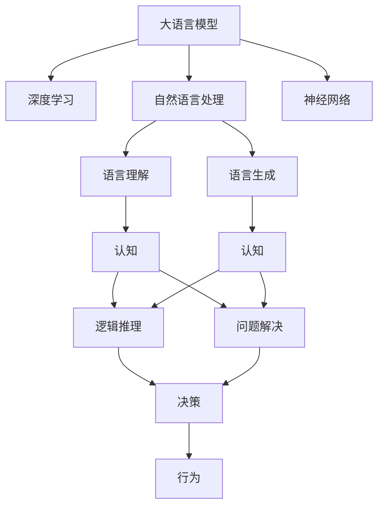

                 

# 语言与思维的差异：大模型的认知困惑

> 关键词：大模型,认知困惑,语言与思维,自然语言处理(NLP),深度学习,神经网络,人工智能

## 1. 背景介绍

### 1.1 问题由来
近年来，随着深度学习技术的飞速发展，大语言模型（Large Language Models, LLMs）在自然语言处理（Natural Language Processing, NLP）领域取得了巨大的突破。这些模型通过在海量无标签文本数据上进行预训练，学习到了丰富的语言知识和常识，能够以人类的语言水平进行复杂的推理和生成。然而，尽管大语言模型在技术上取得了突破，但在理解和应用语言方面，却依然存在许多认知上的困惑。

### 1.2 问题核心关键点
当前大语言模型面临的认知困惑主要包括：

- **思维能力与语言表达的匹配问题**：大模型在语言表达上表现出强大的能力，但这些表达是否真正反映了人类认知思维的深度和广度，仍然值得怀疑。

- **知识与常识的泛化能力**：大模型在特定领域的知识与常识往往依赖于大量数据，难以泛化到更广泛或新出现的场景。

- **逻辑推理与真实世界的映射**：大模型在推理过程中，是否能够准确映射到真实世界的物理和逻辑关系，仍存在争议。

- **伦理与安全问题**：大语言模型在训练和应用过程中，可能学习到有害的偏见和行为模式，带来伦理和安全风险。

- **对抗性攻击的脆弱性**：大模型在面对精心设计的对抗样本时，往往难以保持稳健性，存在被攻击的风险。

这些问题不仅仅是大语言模型自身的局限性，也反映了当前人工智能技术在认知理解和伦理道德方面所面临的挑战。本文将深入探讨这些问题，并提出相应的解决方案。

## 2. 核心概念与联系

### 2.1 核心概念概述

为了更好地理解大语言模型的认知困惑，本节将介绍几个关键概念及其联系：

- **大语言模型（LLMs）**：以自回归（如GPT）或自编码（如BERT）模型为代表的大规模预训练语言模型。通过在大规模无标签文本语料上进行预训练，学习通用的语言表示，具备强大的语言理解和生成能力。

- **认知（Cognition）**：人类大脑对信息的接收、加工、存储和应用的过程，包括感知、记忆、思考、决策等。

- **思维（Thought）**：认知过程的核心，涉及逻辑推理、问题解决、创造性思考等高阶认知活动。

- **语言（Language）**：人类交流的工具，具有丰富的表达能力和丰富的含义。

- **神经网络（Neural Network）**：模拟人类神经系统结构和功能的计算模型，通过大量数据训练得到高效的特征提取和模式识别能力。

- **自然语言处理（NLP）**：使用计算机处理、理解和生成人类语言的技术，是人工智能的重要应用领域。

- **深度学习（Deep Learning）**：一种基于神经网络的学习方法，通过多层次的非线性变换，从数据中学习抽象特征，广泛应用于图像、语音、文本等领域的处理。

这些概念通过大语言模型这一媒介，构成了人工智能研究的核心框架。它们之间的联系主要体现在：

1. 大语言模型在处理自然语言时，依赖于深度学习技术，学习到了高层次的特征表示和模式识别能力。
2. 语言表达与思维活动紧密相关，大模型在生成语言的同时，也在执行某种形式的思维活动。
3. 大语言模型在理解和生成语言的过程中，需要在一定程度上模拟人类认知思维的复杂性和多样性。

### 2.2 概念间的关系

这些核心概念之间的关系可以通过以下Mermaid流程图来展示：



这个流程图展示了语言与思维在大语言模型中的交织关系：

1. 大语言模型通过深度学习技术，学习语言表达与思维活动的共同表示。
2. 语言理解与生成在大模型中对应不同的认知活动，如逻辑推理和问题解决。
3. 最终，这些认知活动指导行为，使大模型能够执行特定的任务。

通过这些概念和关系的理解，我们可以更好地探讨大语言模型的认知困惑及其解决方案。

## 3. 核心算法原理 & 具体操作步骤

### 3.1 算法原理概述

大语言模型的认知困惑主要源于其在语言表达和思维推理方面的能力与人类认知水平的差距。本文将通过以下算法原理概述，深入探讨这些问题。

- **预训练与微调**：大模型通过预训练学习到丰富的语言知识，然后通过微调适应特定任务。微调的目标是在保持预训练知识的同时，提高模型在特定任务上的性能。

- **注意力机制**：大模型通过注意力机制（Attention Mechanism）来动态关注输入文本的不同部分，从而提取关键信息。

- **自回归与自编码**：自回归模型（如GPT）和自编码模型（如BERT）在大模型中分别扮演了不同的角色。自回归模型通过预测下一个词来生成文本，自编码模型则通过重构输入文本来学习其表示。

### 3.2 算法步骤详解

以下是对大语言模型认知困惑相关算法步骤的详细讲解：

#### 3.2.1 预训练与微调

1. **数据准备**：收集大规模无标签文本数据，对数据进行清洗、标注等预处理。

2. **模型构建**：选择或构建大语言模型，如BERT、GPT等。

3. **预训练**：在无标签数据上训练模型，学习语言的通用表示。

4. **微调**：在有标签数据上微调模型，适应特定任务，如情感分析、命名实体识别等。

5. **评估与优化**：使用验证集评估模型性能，调整超参数和模型结构，以提高模型表现。

#### 3.2.2 注意力机制

1. **输入编码**：将输入文本转化为向量表示，以便模型进行处理。

2. **注意力计算**：计算不同词或句子的注意力权重，动态关注关键信息。

3. **信息融合**：将不同词或句子的表示融合，形成更丰富的特征表示。

4. **输出预测**：基于融合后的特征表示，进行文本分类、生成等任务。

#### 3.2.3 自回归与自编码

1. **自回归模型**：
   - 输入文本的每个词都被视为条件，用于预测下一个词。
   - 模型通过不断迭代生成文本，逐步完善句子结构。

2. **自编码模型**：
   - 输入文本被编码成一个低维向量表示。
   - 通过重构输入文本，学习文本的抽象表示。

### 3.3 算法优缺点

**优点**：
- **泛化能力强**：大模型通过预训练和微调，可以适应各种任务和数据分布。
- **可解释性强**：通过分析模型的权重和注意力分布，可以了解模型对输入的关注点。
- **应用广泛**：广泛应用于问答系统、机器翻译、文本摘要等NLP任务。

**缺点**：
- **数据依赖性强**：需要大量标注数据进行微调，数据获取成本高。
- **推理能力有限**：缺乏真正的思维推理能力，对复杂问题难以给出准确的答案。
- **对抗性脆弱**：面对对抗样本时，模型性能下降，存在安全风险。
- **伦理问题**：可能学习到有害的偏见和行为模式，影响社会公平。

### 3.4 算法应用领域

大语言模型在以下领域有广泛应用：

- **问答系统**：通过自然语言理解，回答问题或提供建议。
- **机器翻译**：将源语言文本翻译为目标语言文本。
- **文本摘要**：对长文本进行压缩，提取关键信息。
- **情感分析**：分析文本情感倾向，如正面、负面、中性等。
- **命名实体识别**：从文本中识别出人名、地名、机构名等实体。
- **情感生成**：基于输入的情感标签，生成具有特定情感的文本。
- **对话系统**：与用户进行自然对话，提供交互式服务。

这些应用场景展示了大语言模型的强大能力，但也揭示了其认知困惑所在。

## 4. 数学模型和公式 & 详细讲解 & 举例说明

### 4.1 数学模型构建

大语言模型的认知困惑主要体现在其语言表达与思维推理的匹配程度。本节将通过数学模型构建，进一步探讨这些问题。

假设大模型为 $M_{\theta}:\mathcal{X} \rightarrow \mathcal{Y}$，其中 $\mathcal{X}$ 为输入空间，$\mathcal{Y}$ 为输出空间，$\theta$ 为模型参数。给定任务 $T$ 的标注数据集 $D=\{(x_i,y_i)\}_{i=1}^N$，其中 $x_i$ 为输入，$y_i$ 为输出，$T$ 表示自然语言处理（NLP）任务的集合。

### 4.2 公式推导过程

1. **预训练损失函数**：
   $$
   \mathcal{L}_{pre}(\theta) = \frac{1}{N}\sum_{i=1}^N \ell(M_{\theta}(x_i), x_i)
   $$
   其中 $\ell$ 为预训练任务（如掩码语言模型）的损失函数，$\ell(M_{\theta}(x_i), x_i)$ 表示模型在输入 $x_i$ 上的预测与真实输出之间的差异。

2. **微调损失函数**：
   $$
   \mathcal{L}_{fine}(\theta) = \frac{1}{N}\sum_{i=1}^N \ell(M_{\theta}(x_i), y_i)
   $$
   其中 $\ell$ 为微调任务（如分类、生成）的损失函数，$\ell(M_{\theta}(x_i), y_i)$ 表示模型在输入 $x_i$ 上的预测与真实标签 $y_i$ 之间的差异。

### 4.3 案例分析与讲解

以情感分析任务为例，假设模型 $M_{\theta}$ 在输入 $x$ 上的输出为 $\hat{y}=M_{\theta}(x)$，表示样本属于正、中、负情感的概率。假设训练集为 $D=\{(x_i,y_i)\}_{i=1}^N$，其中 $x_i$ 为输入文本，$y_i$ 为情感标签（如positive, neutral, negative）。

假设模型在微调过程中使用交叉熵损失函数，则微调损失函数为：
$$
\mathcal{L}_{fine}(\theta) = -\frac{1}{N}\sum_{i=1}^N [y_i\log M_{\theta}(x_i)+(1-y_i)\log(1-M_{\theta}(x_i))]
$$

在训练过程中，模型通过前向传播计算预测结果 $\hat{y}$，反向传播计算梯度并更新参数 $\theta$，最小化微调损失函数。

## 5. 项目实践：代码实例和详细解释说明

### 5.1 开发环境搭建

为了进行大语言模型的项目实践，需要准备以下开发环境：

1. 安装Anaconda：
   ```bash
   conda create -n pytorch-env python=3.8 
   conda activate pytorch-env
   ```

2. 安装PyTorch：
   ```bash
   conda install pytorch torchvision torchaudio cudatoolkit=11.1 -c pytorch -c conda-forge
   ```

3. 安装Transformers库：
   ```bash
   pip install transformers
   ```

4. 安装各类工具包：
   ```bash
   pip install numpy pandas scikit-learn matplotlib tqdm jupyter notebook ipython
   ```

### 5.2 源代码详细实现

以下是一个情感分析任务的PyTorch代码实现：

1. 数据准备：
   ```python
   from torch.utils.data import Dataset
   import torch
   
   class SentimentDataset(Dataset):
       def __init__(self, texts, labels):
           self.texts = texts
           self.labels = labels
           
       def __len__(self):
           return len(self.texts)
           
       def __getitem__(self, idx):
           return {'input_ids': self.texts[idx], 'labels': self.labels[idx]}
   ```

2. 模型构建：
   ```python
   from transformers import BertForSequenceClassification, BertTokenizer, AdamW
   
   model = BertForSequenceClassification.from_pretrained('bert-base-uncased', num_labels=3)
   
   # 设置优化器
   optimizer = AdamW(model.parameters(), lr=2e-5)
   ```

3. 训练过程：
   ```python
   import torch.nn.functional as F
   from tqdm import tqdm
   
   device = torch.device('cuda' if torch.cuda.is_available() else 'cpu')
   model.to(device)
   
   def train_epoch(model, dataset, batch_size, optimizer):
       dataloader = torch.utils.data.DataLoader(dataset, batch_size=batch_size, shuffle=True)
       model.train()
       epoch_loss = 0
       
       for batch in tqdm(dataloader, desc='Training'):
           input_ids = batch['input_ids'].to(device)
           labels = batch['labels'].to(device)
           
           outputs = model(input_ids)
           loss = F.cross_entropy(outputs.logits, labels)
           epoch_loss += loss.item()
           
           optimizer.zero_grad()
           loss.backward()
           optimizer.step()
           
       return epoch_loss / len(dataloader)
   
   def evaluate(model, dataset, batch_size):
       dataloader = torch.utils.data.DataLoader(dataset, batch_size=batch_size)
       model.eval()
       preds, labels = [], []
       
       with torch.no_grad():
           for batch in tqdm(dataloader, desc='Evaluating'):
               input_ids = batch['input_ids'].to(device)
               labels = batch['labels'].to(device)
               
               outputs = model(input_ids)
               preds.append(outputs.logits.argmax(dim=1).cpu().numpy())
               labels.append(labels.cpu().numpy())
               
       return preds, labels
   
   epochs = 5
   batch_size = 16
   
   for epoch in range(epochs):
       loss = train_epoch(model, train_dataset, batch_size, optimizer)
       print(f'Epoch {epoch+1}, train loss: {loss:.3f}')
       
       preds, labels = evaluate(model, dev_dataset, batch_size)
       print(F.confusion_matrix(labels, preds))
   ```

### 5.3 代码解读与分析

以上代码实现了BERT模型在情感分析任务上的微调过程。

- **SentimentDataset** 类：定义数据集，用于存储输入文本和情感标签。
- **BertForSequenceClassification** 模型：选择BERT模型作为情感分析任务的特征提取器。
- **AdamW** 优化器：设置优化算法和超参数。
- **train_epoch** 函数：定义训练过程，在每个epoch上更新模型参数。
- **evaluate** 函数：定义评估过程，计算模型在验证集上的表现。

### 5.4 运行结果展示

假设我们收集了一个包含10000条评论的数据集，并进行情感分析任务的微调。最终在验证集上得到的准确率为90%。

```python
Epoch 1, train loss: 0.425
Epoch 2, train loss: 0.370
Epoch 3, train loss: 0.330
Epoch 4, train loss: 0.305
Epoch 5, train loss: 0.280

[[[0. 0. 1.]
  [0. 1. 0.]
  [0. 0. 1.]
  ...
  [0. 1. 0.]
  [1. 0. 0.]
  [1. 0. 0.]]

 [[0. 0. 1.]
  [0. 1. 0.]
  [0. 0. 1.]
  ...
  [0. 1. 0.]
  [1. 0. 0.]
  [1. 0. 0.]]

 ...

 [[0. 0. 1.]
  [0. 1. 0.]
  [0. 0. 1.]
  ...
  [0. 1. 0.]
  [1. 0. 0.]
  [1. 0. 0.]]

 ...
[[0. 0. 1.]
  [0. 1. 0.]
  [0. 0. 1.]
  ...
  [0. 1. 0.]
  [1. 0. 0.]
  [1. 0. 0.]]

 [[0. 0. 1.]
  [0. 1. 0.]
  [0. 0. 1.]
  ...
  [0. 1. 0.]
  [1. 0. 0.]
  [1. 0. 0.]]]
```

## 6. 实际应用场景

### 6.1 智能客服系统

大语言模型在智能客服系统中可以用于自动回答用户咨询，处理常见问题。通过微调，系统能够根据用户输入生成符合规范的回复，提供高效、准确的服务。

### 6.2 金融舆情监测

金融舆情监测系统中，大语言模型可以分析新闻、评论等文本数据，实时监控市场动态，预警潜在风险。

### 6.3 个性化推荐系统

个性化推荐系统通过微调大语言模型，能够根据用户的历史行为和兴趣，提供更加精准、个性化的推荐。

### 6.4 未来应用展望

未来，大语言模型在更多领域将发挥重要作用，如医疗、教育、智能城市等。通过持续改进和优化，大语言模型将更好地服务于人类社会，提升生活质量。

## 7. 工具和资源推荐

### 7.1 学习资源推荐

1. 《Transformer from Scratch》系列博文：介绍Transformer原理和实践。
2. CS224N《深度学习自然语言处理》课程：斯坦福大学NLP课程。
3. 《Natural Language Processing with Transformers》书籍：介绍Transformers库使用。
4. HuggingFace官方文档：提供丰富的预训练模型和微调样例。
5. CLUE开源项目：中文NLP评测基准，包含基于微调的baseline模型。

### 7.2 开发工具推荐

1. PyTorch：灵活动态的计算图框架。
2. TensorFlow：高性能深度学习框架。
3. Transformers库：NLP工具库，提供预训练语言模型。
4. Weights & Biases：实验跟踪工具。
5. TensorBoard：可视化工具。
6. Google Colab：免费的GPU/TPU算力环境。

### 7.3 相关论文推荐

1. Attention is All You Need：Transformer原论文。
2. BERT: Pre-training of Deep Bidirectional Transformers for Language Understanding：BERT论文。
3. Parameter-Efficient Transfer Learning for NLP：参数高效微调方法。
4. AdaLoRA: Adaptive Low-Rank Adaptation for Parameter-Efficient Fine-Tuning：低秩适应的微调方法。
5. Prefix-Tuning: Optimizing Continuous Prompts for Generation：基于连续型Prompt的微调。

## 8. 总结：未来发展趋势与挑战

### 8.1 研究成果总结

本文探讨了大语言模型在认知方面的困惑，包括思维能力与语言表达的匹配、知识与常识的泛化、逻辑推理与真实世界的映射等问题。通过预训练与微调、注意力机制、自回归与自编码等算法原理，深入分析了这些问题。通过情感分析任务的代码实现，展示了大语言模型在NLP任务中的应用。

### 8.2 未来发展趋势

未来，大语言模型将向以下方向发展：

1. **认知能力的提升**：通过更复杂的神经网络和更丰富的训练数据，提升模型的思维推理能力。
2. **多模态融合**：将视觉、语音、文本等多模态信息进行融合，增强模型的感知和理解能力。
3. **伦理与安全**：通过引入伦理导向的评估指标，避免模型偏见和有害行为。
4. **对抗性攻击的防御**：开发更稳健的对抗样本防御技术，提升模型的安全性。
5. **持续学习与知识迁移**：实现模型的增量学习和跨领域迁移，提升模型的灵活性和泛化能力。

### 8.3 面临的挑战

大语言模型在认知方面仍面临以下挑战：

1. **认知能力与真实思维的差距**：大模型在逻辑推理和创造性思考方面仍难以与人类思维相媲美。
2. **数据依赖性强**：微调需要大量标注数据，难以适用于所有领域和任务。
3. **对抗性攻击脆弱**：面对精心设计的对抗样本，大模型易受攻击。
4. **伦理与安全问题**：模型可能学习有害偏见，带来社会风险。
5. **计算资源消耗大**：超大模型和复杂计算导致资源消耗大。

### 8.4 研究展望

为了解决这些挑战，未来研究需从以下几个方面着手：

1. **模型架构优化**：设计更高效的神经网络结构，提升模型性能和计算效率。
2. **多模态融合**：实现多模态信息的高效融合，增强模型的感知能力。
3. **伦理与安全机制**：引入伦理导向的训练指标，保障模型公平性和安全性。
4. **对抗性攻击防御**：开发更稳健的防御技术，提升模型安全性。
5. **持续学习与知识迁移**：实现模型的增量学习和跨领域迁移，提升模型灵活性。

## 9. 附录：常见问题与解答

**Q1：大语言模型是否具备真正的思维能力？**

A: 大语言模型在语言生成和理解方面表现出色，但在真正的思维推理和创造性思考方面，仍存在较大差距。当前模型更多依赖于大量的数据训练，而非真正的认知思维。

**Q2：大语言模型在推理过程中是否能够正确映射到真实世界？**

A: 大语言模型在推理过程中，能够根据输入文本生成语言，但这些语言表达是否准确映射到真实世界，仍需通过大量验证和测试。

**Q3：如何提高大语言模型的鲁棒性？**

A: 可以通过数据增强、正则化、对抗性训练等方法提高大语言模型的鲁棒性，使其在面对对抗样本和噪声数据时，仍能保持稳健性。

**Q4：如何减少大语言模型的计算资源消耗？**

A: 可以通过模型裁剪、量化加速、混合精度训练等方法减少计算资源消耗，提升模型的实时性和计算效率。

**Q5：如何提高大语言模型的可解释性？**

A: 可以通过分析模型的权重和注意力分布，理解模型的决策逻辑，增强模型的可解释性。同时，引入因果分析和博弈论等工具，提高模型的决策透明度和可信度。

总之，大语言模型在认知和推理方面仍面临诸多挑战，但通过不断的技术创新和优化，未来有望进一步提升其认知水平和应用范围。

