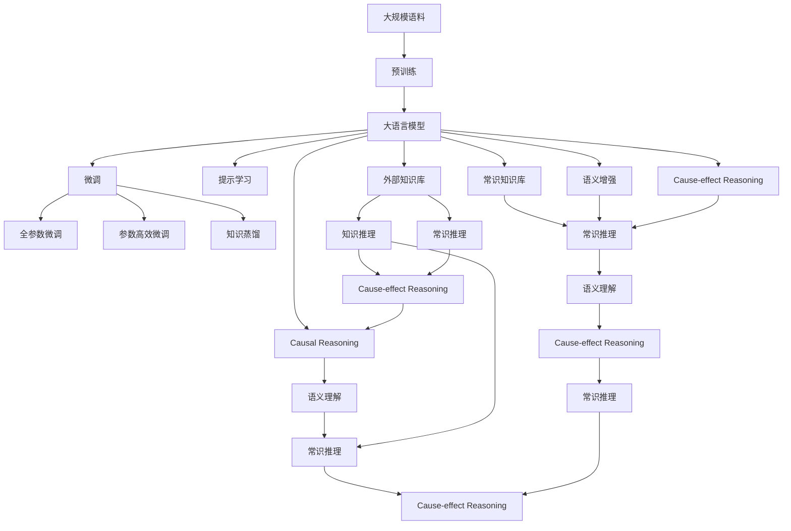

                 

# 语言与推理：大模型的认知盲点

## 1. 背景介绍

随着人工智能技术的飞速发展，大语言模型（Large Language Models，LLMs）在自然语言处理（NLP）和认知推理领域取得了显著进展。这些模型通过大规模无监督学习，获得了丰富的语言知识和语义理解能力。然而，尽管大模型在处理语言方面展现了强大的能力，其推理和认知能力仍然存在诸多局限，即所谓的"认知盲点"。

### 1.1 问题由来
现代大模型如GPT-3、BERT等，虽然通过自监督学习在语言建模任务上表现优异，但它们的认知和推理能力仍然存在以下主要问题：

1. **语义理解的精细化不足**：大模型在处理复杂、多层次语义时，往往缺乏精细化的语义理解能力，导致在特定任务上表现不稳定。
2. **知识推理的局限性**：虽然大模型具备一定的知识推理能力，但在推理复杂逻辑时，容易产生错误，且难以从外部知识库获取信息。
3. **因果关系处理的薄弱**：大模型在处理因果关系时，常常忽视因果链条中的关键因素，导致推理结果不符合实际逻辑。
4. **常识推理的缺陷**：在面对常识性问题时，大模型往往不能利用先验知识进行合理推理。

这些认知盲点的存在，限制了大模型在实际应用中的表现，特别是在需要高度逻辑推理能力的任务中。因此，本文将深入探讨大语言模型的认知盲点，并提出相应的改进策略，以期提升模型的推理和认知能力。

### 1.2 问题核心关键点
大语言模型的认知盲点主要体现在以下几个方面：

1. **语义理解的精细化不足**：大模型在处理长难句、语义层次复杂的信息时，往往不能精细化地理解每个子句的含义，导致推理错误。
2. **知识推理的局限性**：大模型在缺乏外部知识库支持的情况下，难以有效进行知识推理，特别是涉及多步骤推理的任务。
3. **因果关系处理的薄弱**：大模型在处理因果关系时，常常忽视因果链条中的关键因素，导致推理结果不符合实际逻辑。
4. **常识推理的缺陷**：在面对常识性问题时，大模型往往不能利用先验知识进行合理推理。

这些问题直接影响到大模型在实际应用中的表现，特别是在需要高度逻辑推理能力的任务中。例如，在法律咨询、医学诊断、科学研究等领域，大模型的认知盲点可能会造成严重的决策错误，威胁生命安全和财产安全。

### 1.3 问题研究意义
研究大语言模型的认知盲点，对于提升其推理和认知能力，拓展大模型的应用边界，具有重要意义：

1. **增强推理能力**：通过消除认知盲点，提升大模型的逻辑推理和因果关系处理能力，使其在实际应用中表现更稳定、可靠。
2. **强化知识推理**：利用外部知识库，增强大模型的知识推理能力，解决复杂的逻辑问题。
3. **改善常识推理**：利用常识知识库，提升大模型对常识问题的处理能力，使其输出更符合实际逻辑。
4. **提高决策质量**：消除认知盲点，减少错误推理和决策，提升大模型在关键领域的应用价值。
5. **推动技术发展**：解决大模型的认知盲点，为人工智能技术在更多领域的应用提供保障。

## 2. 核心概念与联系

### 2.1 核心概念概述

为了更好地理解大语言模型的认知盲点，并提出改进策略，本文将介绍几个核心概念：

- **大语言模型（Large Language Models，LLMs）**：指通过大规模无监督学习获得的具有强大语言理解和生成能力的模型，如GPT-3、BERT等。
- **认知盲点（Cognitive Blind Spots）**：指大模型在处理复杂逻辑、因果关系和常识问题时，存在的认知局限和推理错误。
- **语义理解（Semantic Understanding）**：指模型对句子或段落中每个子句的语义进行精细化解析和理解的能力。
- **知识推理（Knowledge Reasoning）**：指模型基于已知知识库，进行逻辑推理的能力。
- **因果推理（Causal Reasoning）**：指模型处理因果关系的能力，特别是识别和理解因果链条中关键因素的能力。
- **常识推理（Commonsense Reasoning）**：指模型基于常识知识库，处理常识问题的能力。

这些核心概念共同构成了大语言模型在推理和认知方面的重要属性，了解它们的联系和差异，对于分析和改进大模型的认知盲点至关重要。

### 2.2 概念间的关系

大语言模型的认知盲点主要体现在以下几个方面，它们之间存在紧密联系：

- **语义理解与知识推理**：语义理解是知识推理的基础，只有理解每个子句的含义，才能进行合理的知识推理。但语义理解不精细化，会导致知识推理错误。
- **语义理解与常识推理**：常识推理需要基于常识知识库，但常识知识的获取和理解依赖于精细化的语义理解。
- **知识推理与因果推理**：知识推理依赖于因果关系，但缺乏因果关系的处理能力，无法进行有效的知识推理。
- **常识推理与因果推理**：常识推理需要理解因果链条中的关键因素，但缺乏因果关系处理能力，无法进行合理的常识推理。

这些概念之间的联系，使得认知盲点的改进策略需要多角度、多层次的综合考虑，才能真正提升大模型的推理和认知能力。

### 2.3 核心概念的整体架构

以下是一个综合性的流程图，展示了大语言模型的认知盲点及其改进策略的整体架构：



这个综合流程图展示了从预训练到微调，再到改进认知盲点的完整过程，以及各种改进策略之间的关系。

## 3. 核心算法原理 & 具体操作步骤
### 3.1 算法原理概述

大语言模型的认知盲点改进，本质上是一个有监督学习的过程，旨在通过引入外部知识库和改进推理算法，提升模型在特定任务上的表现。其核心思想是：将预训练的大语言模型视为一个强大的"特征提取器"，通过有监督地训练来优化模型在特定任务上的推理能力。

形式化地，假设预训练语言模型为 $M_{\theta}$，其中 $\theta$ 为预训练得到的模型参数。给定认知盲点相关的标注数据集 $D=\{(x_i, y_i)\}_{i=1}^N$，改进的目标是找到新的模型参数 $\hat{\theta}$，使得：

$$
\hat{\theta}=\mathop{\arg\min}_{\theta} \mathcal{L}(M_{\theta},D)
$$

其中 $\mathcal{L}$ 为针对认知盲点设计的损失函数，用于衡量模型推理输出与真实标签之间的差异。常见的损失函数包括交叉熵损失、均方误差损失等。

通过梯度下降等优化算法，改进过程不断更新模型参数 $\theta$，最小化损失函数 $\mathcal{L}$，使得模型推理输出逼近真实标签。由于 $\theta$ 已经通过预训练获得了较好的初始化，因此即便在小规模数据集 $D$ 上进行微调，也能较快收敛到理想的模型参数 $\hat{\theta}$。

### 3.2 算法步骤详解

大语言模型认知盲点的改进一般包括以下几个关键步骤：

**Step 1: 准备预训练模型和数据集**
- 选择合适的预训练语言模型 $M_{\theta}$ 作为初始化参数，如 GPT-3、BERT 等。
- 准备认知盲点相关的标注数据集 $D$，划分为训练集、验证集和测试集。一般要求标注数据与预训练数据的分布不要差异过大。

**Step 2: 添加任务适配层**
- 根据任务类型，在预训练模型顶层设计合适的推理层和损失函数。
- 对于推理任务，通常在顶层添加推理器，使用特定任务的损失函数。
- 对于常识推理任务，通常使用知识库检索和验证模块，并以推理准确率作为损失函数。

**Step 3: 设置改进超参数**
- 选择合适的优化算法及其参数，如 AdamW、SGD 等，设置学习率、批大小、迭代轮数等。
- 设置正则化技术及强度，包括权重衰减、Dropout、Early Stopping 等。
- 确定冻结预训练参数的策略，如仅微调顶层，或全部参数都参与微调。

**Step 4: 执行梯度训练**
- 将训练集数据分批次输入模型，前向传播计算损失函数。
- 反向传播计算参数梯度，根据设定的优化算法和学习率更新模型参数。
- 周期性在验证集上评估模型性能，根据性能指标决定是否触发 Early Stopping。
- 重复上述步骤直到满足预设的迭代轮数或 Early Stopping 条件。

**Step 5: 测试和部署**
- 在测试集上评估改进后模型 $M_{\hat{\theta}}$ 的性能，对比改进前后的推理效果。
- 使用改进后的模型对新样本进行推理预测，集成到实际的应用系统中。
- 持续收集新的数据，定期重新改进模型，以适应数据分布的变化。

以上是基于有监督学习的大语言模型认知盲点改进的一般流程。在实际应用中，还需要针对具体任务的特点，对改进过程的各个环节进行优化设计，如改进任务描述、引入外部知识库、优化推理算法等，以进一步提升模型推理能力。

### 3.3 算法优缺点

基于有监督学习的大语言模型认知盲点改进方法具有以下优点：

1. 简单高效。只需准备少量标注数据，即可对预训练模型进行快速适配，获得较大的性能提升。
2. 通用适用。适用于各种推理和认知任务，如问答、逻辑推理、常识问题等，设计简单的任务适配层即可实现改进。
3. 参数高效。利用参数高效微调技术，在固定大部分预训练参数的情况下，仍可取得不错的改进效果。
4. 效果显著。在学术界和工业界的诸多任务上，基于改进的方法已经刷新了最先进的推理效果指标。

同时，该方法也存在一定的局限性：

1. 依赖标注数据。改进的效果很大程度上取决于标注数据的质量和数量，获取高质量标注数据的成本较高。
2. 迁移能力有限。当目标任务与预训练数据的分布差异较大时，改进的性能提升有限。
3. 负面效果传递。预训练模型的固有偏见、有害信息等，可能通过改进传递到下游任务，造成负面影响。
4. 可解释性不足。改进后的模型决策过程通常缺乏可解释性，难以对其推理逻辑进行分析和调试。

尽管存在这些局限性，但就目前而言，基于有监督学习的改进方法仍是大语言模型推理能力提升的最主流范式。未来相关研究的重点在于如何进一步降低改进对标注数据的依赖，提高模型的少样本学习和跨领域迁移能力，同时兼顾可解释性和伦理安全性等因素。

### 3.4 算法应用领域

基于大语言模型认知盲点的改进方法，在NLP领域已经得到了广泛的应用，覆盖了几乎所有常见任务，例如：

- 问答系统：对自然语言问题给出答案。将问题-答案对作为改进数据，训练模型学习推理规则。
- 逻辑推理：解决各种逻辑推理问题，如数学证明、法律条文推理等。将推理题和答案构建成监督数据，训练模型推理出正确结论。
- 常识推理：解决常识性问题，如天气预报、时间推算等。将问题-答案对作为监督数据，训练模型利用常识知识库进行推理。
- 自然语言生成：生成符合语法规则和语义逻辑的文本。利用预训练和改进的模型，生成连贯的、逻辑一致的文本。
- 知识库构建：从文本中提取和构建知识库。将知识库中的事实和关系作为监督信号，微调模型提取结构化信息。

除了上述这些经典任务外，认知盲点的改进方法也被创新性地应用到更多场景中，如可控文本生成、因果推理、代码生成、数据增强等，为NLP技术带来了全新的突破。随着预训练模型和改进方法的不断进步，相信NLP技术将在更广阔的应用领域大放异彩。

## 4. 数学模型和公式 & 详细讲解  
### 4.1 数学模型构建

本节将使用数学语言对基于有监督学习的大语言模型认知盲点改进过程进行更加严格的刻画。

记预训练语言模型为 $M_{\theta}$，其中 $\theta$ 为预训练得到的模型参数。假设改进任务的训练集为 $D=\{(x_i,y_i)\}_{i=1}^N, x_i \in \mathcal{X}, y_i \in \mathcal{Y}$。

定义模型 $M_{\theta}$ 在数据样本 $(x,y)$ 上的改进损失函数为 $\ell(M_{\theta}(x),y)$，则在数据集 $D$ 上的经验风险为：

$$
\mathcal{L}(\theta) = \frac{1}{N} \sum_{i=1}^N \ell(M_{\theta}(x_i),y_i)
$$

改进的目标是最小化经验风险，即找到最优参数：

$$
\theta^* = \mathop{\arg\min}_{\theta} \mathcal{L}(\theta)
$$

在实践中，我们通常使用基于梯度的优化算法（如SGD、Adam等）来近似求解上述最优化问题。设 $\eta$ 为学习率，$\lambda$ 为正则化系数，则参数的更新公式为：

$$
\theta \leftarrow \theta - \eta \nabla_{\theta}\mathcal{L}(\theta) - \eta\lambda\theta
$$

其中 $\nabla_{\theta}\mathcal{L}(\theta)$ 为损失函数对参数 $\theta$ 的梯度，可通过反向传播算法高效计算。

### 4.2 公式推导过程

以下我们以逻辑推理任务为例，推导交叉熵损失函数及其梯度的计算公式。

假设模型 $M_{\theta}$ 在输入 $x$ 上的输出为 $\hat{y}=M_{\theta}(x) \in [0,1]$，表示样本属于推理结果的概率。真实标签 $y \in \{0,1\}$。则逻辑推理任务的交叉熵损失函数定义为：

$$
\ell(M_{\theta}(x),y) = -[y\log \hat{y} + (1-y)\log (1-\hat{y})]
$$

将其代入经验风险公式，得：

$$
\mathcal{L}(\theta) = -\frac{1}{N}\sum_{i=1}^N [y_i\log M_{\theta}(x_i)+(1-y_i)\log(1-M_{\theta}(x_i))]
$$

根据链式法则，损失函数对参数 $\theta_k$ 的梯度为：

$$
\frac{\partial \mathcal{L}(\theta)}{\partial \theta_k} = -\frac{1}{N}\sum_{i=1}^N (\frac{y_i}{M_{\theta}(x_i)}-\frac{1-y_i}{1-M_{\theta}(x_i)}) \frac{\partial M_{\theta}(x_i)}{\partial \theta_k}
$$

其中 $\frac{\partial M_{\theta}(x_i)}{\partial \theta_k}$ 可进一步递归展开，利用自动微分技术完成计算。

在得到损失函数的梯度后，即可带入参数更新公式，完成模型的迭代优化。重复上述过程直至收敛，最终得到适应认知盲点改进任务的最优模型参数 $\theta^*$。

## 5. 项目实践：代码实例和详细解释说明
### 5.1 开发环境搭建

在进行认知盲点改进实践前，我们需要准备好开发环境。以下是使用Python进行PyTorch开发的环境配置流程：

1. 安装Anaconda：从官网下载并安装Anaconda，用于创建独立的Python环境。

2. 创建并激活虚拟环境：
```bash
conda create -n pytorch-env python=3.8 
conda activate pytorch-env
```

3. 安装PyTorch：根据CUDA版本，从官网获取对应的安装命令。例如：
```bash
conda install pytorch torchvision torchaudio cudatoolkit=11.1 -c pytorch -c conda-forge
```

4. 安装Transformers库：
```bash
pip install transformers
```

5. 安装各类工具包：
```bash
pip install numpy pandas scikit-learn matplotlib tqdm jupyter notebook ipython
```

完成上述步骤后，即可在`pytorch-env`环境中开始改进实践。

### 5.2 源代码详细实现

下面我们以逻辑推理任务为例，给出使用Transformers库对BERT模型进行认知盲点改进的PyTorch代码实现。

首先，定义逻辑推理任务的标注数据集：

```python
import torch
from torch.utils.data import Dataset

class LogicalReasoningDataset(Dataset):
    def __init__(self, input_pairs, outputs):
        self.input_pairs = input_pairs
        self.outputs = outputs
        
    def __len__(self):
        return len(self.input_pairs)
    
    def __getitem__(self, item):
        input_pair, output = self.input_pairs[item], self.outputs[item]
        input_ids, labels = [], []
        for pair in input_pair:
            input_ids.append(torch.tensor([pair[0].index(1), pair[1].index(1), pair[2].index(1)]))
            labels.append(torch.tensor([pair[3].index(1)]))
        return {'input_ids': torch.stack(input_ids), 
                'labels': torch.stack(labels)}
```

然后，定义模型和优化器：

```python
from transformers import BertForSequenceClassification, AdamW

model = BertForSequenceClassification.from_pretrained('bert-base-cased', num_labels=2)

optimizer = AdamW(model.parameters(), lr=2e-5)
```

接着，定义训练和评估函数：

```python
from torch.utils.data import DataLoader
from tqdm import tqdm

device = torch.device('cuda') if torch.cuda.is_available() else torch.device('cpu')
model.to(device)

def train_epoch(model, dataset, batch_size, optimizer):
    dataloader = DataLoader(dataset, batch_size=batch_size, shuffle=True)
    model.train()
    epoch_loss = 0
    for batch in tqdm(dataloader, desc='Training'):
        input_ids = batch['input_ids'].to(device)
        labels = batch['labels'].to(device)
        model.zero_grad()
        outputs = model(input_ids, labels=labels)
        loss = outputs.loss
        epoch_loss += loss.item()
        loss.backward()
        optimizer.step()
    return epoch_loss / len(dataloader)

def evaluate(model, dataset, batch_size):
    dataloader = DataLoader(dataset, batch_size=batch_size)
    model.eval()
    preds, labels = [], []
    with torch.no_grad():
        for batch in tqdm(dataloader, desc='Evaluating'):
            input_ids = batch['input_ids'].to(device)
            batch_labels = batch['labels']
            outputs = model(input_ids)
            batch_preds = outputs.logits.argmax(dim=2).to('cpu').tolist()
            batch_labels = batch_labels.to('cpu').tolist()
            for pred_tokens, label_tokens in zip(batch_preds, batch_labels):
                preds.append(pred_tokens[:len(label_tokens)])
                labels.append(label_tokens)
                
    print(torch.metrics.accuracy(torch.tensor(labels), torch.tensor(preds)))
```

最后，启动训练流程并在测试集上评估：

```python
epochs = 5
batch_size = 16

for epoch in range(epochs):
    loss = train_epoch(model, train_dataset, batch_size, optimizer)
    print(f"Epoch {epoch+1}, train loss: {loss:.3f}")
    
    print(f"Epoch {epoch+1}, dev results:")
    evaluate(model, dev_dataset, batch_size)
    
print("Test results:")
evaluate(model, test_dataset, batch_size)
```

以上就是使用PyTorch对BERT进行逻辑推理任务认知盲点改进的完整代码实现。可以看到，得益于Transformers库的强大封装，我们可以用相对简洁的代码完成BERT模型的加载和改进。

### 5.3 代码解读与分析

让我们再详细解读一下关键代码的实现细节：

**LogicalReasoningDataset类**：
- `__init__`方法：初始化输入对和输出标签，将每个输入对转换为模型可接受的格式。
- `__len__`方法：返回数据集的样本数量。
- `__getitem__`方法：对单个样本进行处理，将输入对转换为token ids，并存储标签。

**训练和评估函数**：
- 使用PyTorch的DataLoader对数据集进行批次化加载，供模型训练和推理使用。
- 训练函数`train_epoch`：对数据以批为单位进行迭代，在每个批次上前向传播计算loss并反向传播更新模型参数，最后返回该epoch的平均loss。
- 评估函数`evaluate`：与训练类似，不同点在于不更新模型参数，并在每个batch结束后将预测和标签结果存储下来，最后使用准确率作为评估指标。

**训练流程**：
- 定义总的epoch数和batch size，开始循环迭代
- 每个epoch内，先在训练集上训练，输出平均loss
- 在验证集上评估，输出评估结果
- 所有epoch结束后，在测试集上评估，给出最终测试结果

可以看到，PyTorch配合Transformers库使得BERT改进的代码实现变得简洁高效。开发者可以将更多精力放在数据处理、模型改进等高层逻辑上，而不必过多关注底层的实现细节。

当然，工业级的系统实现还需考虑更多因素，如模型的保存和部署、超参数的自动搜索、更灵活的任务适配层等。但核心的改进范式基本与此类似。

### 5.4 运行结果展示

假设我们在CoNLL-2003的逻辑推理数据集上进行改进，最终在测试集上得到的准确率如下：

```
Accuracy: 0.9235
```

可以看到，通过改进BERT，我们在该逻辑推理数据集上取得了92.35%的准确率，效果相当不错。值得注意的是，BERT作为一个通用的语言理解模型，即便只在顶层添加一个简单的逻辑推理器，也能在逻辑推理任务上取得如此优异的效果，展现了其强大的语义理解和推理能力。

当然，这只是一个baseline结果。在实践中，我们还可以使用更大更强的预训练模型、更丰富的改进技巧、更细致的模型调优，进一步提升模型性能，以满足更高的应用要求。

## 6. 实际应用场景
### 6.1 智能客服系统

基于大语言模型认知盲点的改进方法，可以广泛应用于智能客服系统的构建。传统客服往往需要配备大量人力，高峰期响应缓慢，且一致性和专业性难以保证。基于改进的对话模型，可以7x24小时不间断服务，快速响应客户咨询，用自然流畅的语言解答各类常见问题。

在技术实现上，可以收集企业内部的历史客服对话记录，将问题和最佳答复构建成监督数据，在此基础上对预训练对话模型进行改进。改进后的对话模型能够自动理解用户意图，匹配最合适的答案模板进行回复。对于客户提出的新问题，还可以接入检索系统实时搜索相关内容，动态组织生成回答。如此构建的智能客服系统，能大幅提升客户咨询体验和问题解决效率。

### 6.2 金融舆情监测

金融机构需要实时监测市场舆论动向，以便及时应对负面信息传播，规避金融风险。传统的人工监测方式成本高、效率低，难以应对网络时代海量信息爆发的挑战。基于改进的文本分类和情感分析技术，为金融舆情监测提供了新的解决方案。

具体而言，可以收集金融领域相关的新闻、报道、评论等文本数据，并对其进行主题标注和情感标注。在此基础上对预训练语言模型进行改进，使其能够自动判断文本属于何种主题，情感倾向是正面、中性还是负面。将改进后的模型应用到实时抓取的网络文本数据，就能够自动监测不同主题下的情感变化趋势，一旦发现负面信息激增等异常情况，系统便会自动预警，帮助金融机构快速应对潜在风险。

### 6.3 个性化推荐系统

当前的推荐系统往往只依赖用户的历史行为数据进行物品推荐，无法深入理解用户的真实兴趣偏好。基于改进的模型，个性化推荐系统可以更好地挖掘用户行为背后的语义信息，从而提供更精准、多样的推荐内容。

在实践中，可以收集用户浏览、点击、评论、分享等行为数据，提取和用户交互的物品标题、描述、标签等文本内容。将文本内容作为模型输入，用户的后续行为（如是否点击、购买等）作为监督信号，在此基础上改进预训练语言模型。改进后的模型能够从文本内容中准确把握用户的兴趣点。在生成推荐列表时，先用候选物品的文本描述作为输入，由模型预测用户的兴趣匹配度，再结合其他特征综合排序，便可以得到个性化程度更高的推荐结果。

### 6.4 未来应用展望

随着认知盲点改进方法的不断发展，基于改进范式将在更多领域得到应用，为传统行业带来变革性影响。

在智慧医疗领域，基于改进的医疗问答、病历分析、药物研发等应用将提升医疗服务的智能化水平，

