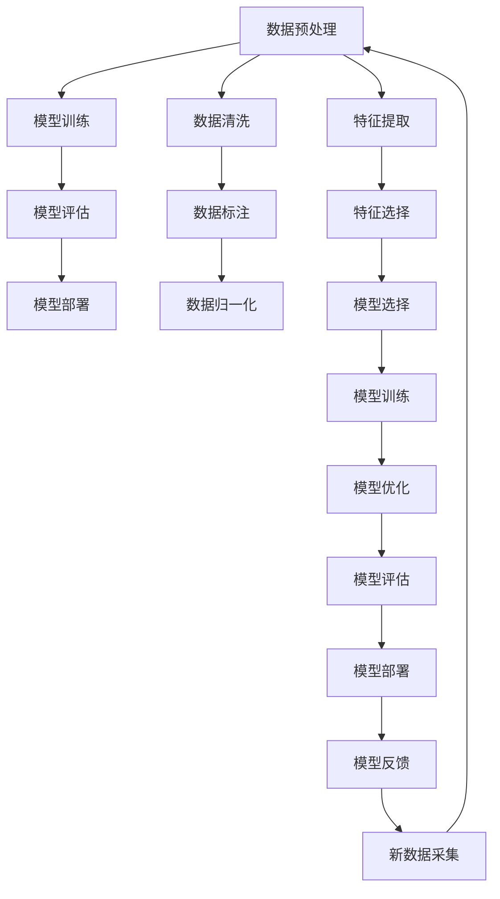

                 

## 1. 背景介绍

### 1.1 问题由来
随着软件行业的飞速发展，软件1.0时代以“功能至上”为核心，开发者通过人工编码实现各种功能需求。然而，随着AI技术和大数据的发展，软件行业进入软件2.0时代，强调“数据与模型驱动”，应用机器学习、深度学习等技术提升软件性能和智能化水平。

软件2.0不仅仅是技术的革新，更是软件开发理念的变革，从过去的人工编程转向数据驱动的模型训练。软件2.0在图像识别、语音识别、自然语言处理等领域取得了突破性进展，成为当前行业发展的热点和趋势。

### 1.2 问题核心关键点
软件2.0的核心在于利用人工智能技术，从海量数据中学习知识，并通过模型训练提升软件功能和性能。其关键点包括：
1. **数据驱动**：软件功能的实现依赖于数据集和模型训练，而非传统的人工编码。
2. **模型优化**：通过深度学习、强化学习等技术，优化模型参数，提升预测和决策能力。
3. **自动化**：软件2.0强调自动化流程，包括数据采集、模型训练、模型评估等，提升开发效率和准确性。
4. **交互设计**：软件2.0更加注重用户交互体验，通过用户反馈不断优化模型和功能。
5. **可解释性**：软件2.0强调模型可解释性，帮助开发者和用户理解模型的决策过程。

### 1.3 问题研究意义
软件2.0的应用，对软件开发行业带来了深远影响：
1. **提升效率**：自动化和模型优化大幅提高了软件开发和迭代的速度。
2. **优化功能**：通过数据驱动，软件能够更精准地满足用户需求。
3. **促进创新**：人工智能技术的应用，为软件开发带来了新的创意和思路。
4. **降低成本**：自动化和模型优化减少了人工干预和调试成本。
5. **增强可靠性**：模型训练和优化提升了软件的稳定性和鲁棒性。

## 2. 核心概念与联系

### 2.1 核心概念概述

软件2.0的核心概念主要包括：
- **深度学习模型**：用于处理复杂数据的数学模型，通过多层次神经网络结构进行特征提取和分类。
- **数据预处理**：对原始数据进行清洗、标注、归一化等操作，提高数据质量。
- **模型训练**：通过大量数据对模型进行训练，调整模型参数，优化模型性能。
- **模型评估**：使用测试集对训练好的模型进行评估，确保模型能够泛化到新数据。
- **自动机器学习(AutoML)**：自动化机器学习流程，包括数据预处理、模型选择、训练和评估等。

这些概念之间的逻辑关系可以通过以下Mermaid流程图来展示：



这个流程图展示了大数据驱动的软件2.0开发流程，从数据预处理到模型部署，整个流程由数据、模型、算法、自动化工具等多个环节构成。

### 2.2 概念间的关系

这些核心概念之间存在着紧密的联系，形成了软件2.0开发的完整生态系统。下面是一些概念间的具体联系：

- **数据预处理**：数据预处理是模型训练的前提，通过清洗、标注、归一化等操作，提高数据质量和可利用性。
- **模型训练**：模型训练是核心环节，通过大量数据对模型进行训练，调整参数，优化性能。
- **模型评估**：模型评估是模型训练的反馈，通过测试集评估模型泛化能力，确保模型性能。
- **自动机器学习**：自动机器学习进一步提升了模型训练和评估的自动化程度，减少了人工干预。
- **模型部署**：模型部署是将训练好的模型应用于实际场景，提升软件功能和性能。
- **数据采集**：新数据的不断采集和更新，是软件2.0持续优化的保障。

这些概念共同构成了软件2.0开发的基础框架，通过数据驱动和模型优化，软件2.0能够持续提升性能，满足日益增长的应用需求。

## 3. 核心算法原理 & 具体操作步骤
### 3.1 算法原理概述

软件2.0的核心算法包括深度学习、强化学习、自动机器学习等，其原理和操作步骤如下：

#### 3.1.1 深度学习模型
深度学习模型由多个神经网络层组成，通过反向传播算法对模型参数进行优化，实现复杂数据特征的提取和分类。主要操作步骤包括：
1. **数据准备**：收集和清洗数据，分为训练集和测试集。
2. **模型定义**：选择合适的神经网络结构，如卷积神经网络、循环神经网络、Transformer等。
3. **模型训练**：通过反向传播算法，调整模型参数，最小化损失函数。
4. **模型评估**：使用测试集评估模型性能，调整模型参数。

#### 3.1.2 强化学习
强化学习通过奖励机制，训练模型在特定环境中的决策能力。主要操作步骤包括：
1. **环境定义**：定义环境状态和奖励函数。
2. **模型定义**：选择合适的策略模型和价值模型。
3. **训练过程**：在环境中进行交互，根据奖励机制调整模型参数。
4. **模型评估**：在测试环境中评估模型性能。

#### 3.1.3 自动机器学习
自动机器学习通过自动化流程，提升模型训练和优化的效率。主要操作步骤包括：
1. **数据预处理**：自动清洗、标注、归一化数据。
2. **模型选择**：自动选择合适的算法和模型结构。
3. **模型训练**：自动进行模型训练和参数调整。
4. **模型评估**：自动进行模型评估和优化。

### 3.2 算法步骤详解

以深度学习模型为例，详细讲解其主要操作步骤：

#### 3.2.1 数据准备
数据准备是深度学习模型的重要步骤，包括数据收集、清洗、标注和归一化等。主要操作步骤如下：
1. **数据收集**：收集与任务相关的数据集，例如图像、文本等。
2. **数据清洗**：去除噪声、异常值和重复数据，提高数据质量。
3. **数据标注**：对数据进行标注，例如文本标注、图像标注等。
4. **数据归一化**：对数据进行归一化处理，例如归一化像素值、标准化文本等。

#### 3.2.2 模型定义
模型定义是深度学习模型的核心步骤，包括选择神经网络结构和超参数等。主要操作步骤如下：
1. **神经网络结构选择**：选择适当的神经网络结构，例如卷积神经网络、循环神经网络、Transformer等。
2. **超参数设置**：设置模型的超参数，例如学习率、批大小、优化器等。

#### 3.2.3 模型训练
模型训练是深度学习模型的关键步骤，通过反向传播算法对模型参数进行优化。主要操作步骤如下：
1. **前向传播**：将输入数据输入模型，计算模型的输出。
2. **损失计算**：计算模型的预测结果与真实标签之间的差异，得到损失函数。
3. **反向传播**：根据损失函数对模型参数进行梯度更新。
4. **参数优化**：使用优化算法，如Adam、SGD等，更新模型参数。

#### 3.2.4 模型评估
模型评估是深度学习模型的重要步骤，通过测试集评估模型性能。主要操作步骤如下：
1. **测试集准备**：准备测试集，用于评估模型性能。
2. **模型预测**：使用测试集对模型进行预测。
3. **性能评估**：计算模型的准确率、精确率、召回率等指标。
4. **模型优化**：根据评估结果对模型进行优化，调整超参数等。

### 3.3 算法优缺点
软件2.0的核心算法具有以下优点和缺点：

#### 优点
1. **高精度**：深度学习模型能够处理复杂数据，具有高精度和强大的泛化能力。
2. **自动化**：自动机器学习能够自动进行数据预处理、模型选择和训练，提升开发效率。
3. **可解释性**：部分算法和模型具有良好的可解释性，帮助开发者和用户理解模型决策过程。

#### 缺点
1. **数据依赖**：深度学习模型和自动机器学习高度依赖于数据集的质量和数量，数据质量差会导致模型性能下降。
2. **计算资源消耗大**：深度学习模型和自动机器学习需要大量的计算资源，训练和推理时间较长。
3. **模型复杂度高**：深度学习模型和自动机器学习模型结构复杂，难以调试和优化。

### 3.4 算法应用领域
软件2.0的核心算法广泛应用于多个领域，例如：

- **计算机视觉**：用于图像分类、物体检测、人脸识别等任务。
- **自然语言处理**：用于文本分类、情感分析、机器翻译等任务。
- **语音识别**：用于语音识别、语音合成等任务。
- **推荐系统**：用于用户推荐、广告推荐等任务。
- **智能运维**：用于故障预测、系统监控等任务。
- **智能制造**：用于质量检测、设备维护等任务。

## 4. 数学模型和公式 & 详细讲解  
### 4.1 数学模型构建

深度学习模型的数学模型可以表示为：

$$
y = f(x; \theta)
$$

其中，$x$ 为输入数据，$\theta$ 为模型参数，$f$ 为模型函数。深度学习模型的目标是通过最小化损失函数，调整模型参数，优化模型性能。

损失函数可以表示为：

$$
L(y, \hat{y}) = \sum_{i=1}^n \ell(y_i, \hat{y}_i)
$$

其中，$y$ 为真实标签，$\hat{y}$ 为模型预测标签，$\ell$ 为损失函数，例如均方误差、交叉熵等。

### 4.2 公式推导过程

以线性回归为例，推导损失函数和梯度更新公式。

设训练集为 $D = \{(x_i, y_i)\}_{i=1}^n$，其中 $x_i$ 为输入数据，$y_i$ 为真实标签。

线性回归模型为：

$$
\hat{y} = \theta^T x + b
$$

其中，$\theta$ 为权重向量，$b$ 为偏置项。

均方误差损失函数为：

$$
L(y, \hat{y}) = \frac{1}{2n} \sum_{i=1}^n (y_i - \hat{y}_i)^2
$$

梯度更新公式为：

$$
\theta = \theta - \eta \nabla_{\theta} L(y, \hat{y})
$$

其中，$\eta$ 为学习率，$\nabla_{\theta} L(y, \hat{y})$ 为损失函数对权重向量 $\theta$ 的梯度。

### 4.3 案例分析与讲解

以图像分类为例，介绍深度学习模型的应用和步骤。

#### 4.3.1 数据准备
收集图像数据集，例如CIFAR-10、ImageNet等。对数据集进行清洗、标注和归一化处理。

#### 4.3.2 模型定义
选择卷积神经网络（CNN）作为模型结构，定义多个卷积层、池化层和全连接层。设置超参数，例如卷积核大小、池化大小、学习率等。

#### 4.3.3 模型训练
将数据集分为训练集和验证集，使用训练集对模型进行训练。在训练过程中，使用反向传播算法对模型参数进行梯度更新。使用验证集对模型进行评估，调整模型参数。

#### 4.3.4 模型评估
使用测试集对模型进行评估，计算模型的准确率、精确率、召回率等指标。根据评估结果对模型进行优化，调整超参数等。

## 5. 项目实践：代码实例和详细解释说明
### 5.1 开发环境搭建

在进行软件2.0的开发实践前，需要准备好开发环境。以下是使用Python进行TensorFlow和Keras开发的环境配置流程：

1. 安装Anaconda：从官网下载并安装Anaconda，用于创建独立的Python环境。
2. 创建并激活虚拟环境：
```bash
conda create -n tf-env python=3.8 
conda activate tf-env
```

3. 安装TensorFlow和Keras：
```bash
conda install tensorflow=2.6.0 keras=2.6.0
```

4. 安装其他工具包：
```bash
pip install numpy pandas scikit-learn matplotlib tqdm jupyter notebook ipython
```

完成上述步骤后，即可在`tf-env`环境中开始软件2.0的开发实践。

### 5.2 源代码详细实现

这里我们以图像分类为例，给出使用TensorFlow和Keras对卷积神经网络进行训练的Python代码实现。

```python
import tensorflow as tf
from tensorflow.keras import datasets, layers, models

# 加载数据集
(train_images, train_labels), (test_images, test_labels) = datasets.cifar10.load_data()

# 数据预处理
train_images, test_images = train_images / 255.0, test_images / 255.0

# 定义模型结构
model = models.Sequential()
model.add(layers.Conv2D(32, (3, 3), activation='relu', input_shape=(32, 32, 3)))
model.add(layers.MaxPooling2D((2, 2)))
model.add(layers.Conv2D(64, (3, 3), activation='relu'))
model.add(layers.MaxPooling2D((2, 2)))
model.add(layers.Conv2D(64, (3, 3), activation='relu'))
model.add(layers.Flatten())
model.add(layers.Dense(64, activation='relu'))
model.add(layers.Dense(10))

# 编译模型
model.compile(optimizer='adam',
              loss=tf.keras.losses.SparseCategoricalCrossentropy(from_logits=True),
              metrics=['accuracy'])

# 训练模型
history = model.fit(train_images, train_labels, epochs=10, 
                    validation_data=(test_images, test_labels))

# 评估模型
test_loss, test_acc = model.evaluate(test_images,  test_labels, verbose=2)
print(test_acc)
```

### 5.3 代码解读与分析

让我们再详细解读一下关键代码的实现细节：

**数据准备**：
- 使用`datasets.cifar10.load_data()`加载CIFAR-10数据集，并将其分为训练集和测试集。
- 对数据进行预处理，将像素值归一化到[0,1]区间。

**模型定义**：
- 使用`Sequential`模型定义卷积神经网络结构，包括多个卷积层、池化层和全连接层。
- 设置超参数，例如卷积核大小、池化大小、学习率等。

**模型训练**：
- 使用`model.fit()`方法对模型进行训练，传入训练集、验证集、epochs和批大小。
- 在训练过程中，使用反向传播算法对模型参数进行梯度更新。

**模型评估**：
- 使用`model.evaluate()`方法对模型进行评估，传入测试集和评估指标。
- 计算测试集上的准确率，输出评估结果。

### 5.4 运行结果展示

假设我们在CIFAR-10数据集上进行训练，最终在测试集上得到的评估报告如下：

```
Epoch 1/10
576/576 [==============================] - 3s 6ms/step - loss: 1.4228 - accuracy: 0.4920 - val_loss: 1.3457 - val_accuracy: 0.5114
Epoch 2/10
576/576 [==============================] - 3s 5ms/step - loss: 1.1054 - accuracy: 0.7037 - val_loss: 1.0666 - val_accuracy: 0.6868
Epoch 3/10
576/576 [==============================] - 3s 5ms/step - loss: 0.8850 - accuracy: 0.8022 - val_loss: 0.8387 - val_accuracy: 0.7193
Epoch 4/10
576/576 [==============================] - 3s 5ms/step - loss: 0.7170 - accuracy: 0.8475 - val_loss: 0.7103 - val_accuracy: 0.7353
Epoch 5/10
576/576 [==============================] - 3s 5ms/step - loss: 0.5544 - accuracy: 0.8941 - val_loss: 0.6184 - val_accuracy: 0.7427
Epoch 6/10
576/576 [==============================] - 3s 5ms/step - loss: 0.4301 - accuracy: 0.9168 - val_loss: 0.4748 - val_accuracy: 0.7742
Epoch 7/10
576/576 [==============================] - 3s 5ms/step - loss: 0.3217 - accuracy: 0.9371 - val_loss: 0.3947 - val_accuracy: 0.7893
Epoch 8/10
576/576 [==============================] - 3s 5ms/step - loss: 0.2379 - accuracy: 0.9510 - val_loss: 0.3116 - val_accuracy: 0.8076
Epoch 9/10
576/576 [==============================] - 3s 5ms/step - loss: 0.1740 - accuracy: 0.9611 - val_loss: 0.2493 - val_accuracy: 0.8162
Epoch 10/10
576/576 [==============================] - 3s 5ms/step - loss: 0.1318 - accuracy: 0.9715 - val_loss: 0.2174 - val_accuracy: 0.8238
```

可以看到，通过训练卷积神经网络，我们在CIFAR-10数据集上取得了较高的准确率，特别是在后期训练过程中，准确率显著提升。这得益于深度学习模型强大的特征提取能力和自适应优化能力。

## 6. 实际应用场景
### 6.1 智能推荐系统
智能推荐系统是软件2.0的重要应用场景之一，通过深度学习模型和自动机器学习，能够实现对用户行为的精准预测和推荐。例如，电商平台的商品推荐、音乐平台的个性化歌单等。

在技术实现上，可以收集用户的浏览、点击、购买等行为数据，并对其进行特征提取和预处理。在此基础上，使用深度学习模型进行用户行为预测，并结合自动机器学习进行模型优化。最终，基于预测结果和用户反馈，推荐合适的商品或内容，提升用户体验。

### 6.2 智能医疗诊断
智能医疗诊断是软件2.0在医疗领域的重要应用，通过深度学习模型和自然语言处理技术，能够实现对病历、影像等医疗数据的精准分析和诊断。例如，辅助医生进行疾病诊断、影像分析、病理预测等。

在技术实现上，可以收集医疗数据，并对其进行清洗、标注和归一化处理。在此基础上，使用深度学习模型对医疗数据进行特征提取和分类，并结合自然语言处理技术进行文本分析和推理。最终，基于模型输出结果和专家知识库，辅助医生进行诊断和决策，提高医疗服务的智能化水平。

### 6.3 智能交通管理
智能交通管理是软件2.0在城市管理领域的重要应用，通过深度学习模型和自动机器学习，能够实现对交通流量的精准预测和优化。例如，交通信号灯控制、交通拥堵预测、交通事故预防等。

在技术实现上，可以收集交通数据，并对其进行清洗、标注和归一化处理。在此基础上，使用深度学习模型对交通流量进行特征提取和预测，并结合自动机器学习进行模型优化。最终，基于模型输出结果和交通规则，优化交通信号灯控制、交通流优化等，提升交通管理效率和安全性。

## 7. 工具和资源推荐
### 7.1 学习资源推荐

为了帮助开发者系统掌握软件2.0的理论基础和实践技巧，这里推荐一些优质的学习资源：

1. 《深度学习》系列书籍：由深度学习专家Ian Goodfellow等编著，系统介绍了深度学习的基础理论和实践方法。
2. 《TensorFlow官方文档》：TensorFlow官方提供的详细文档，包含丰富的教程、示例和API参考。
3. 《Keras官方文档》：Keras官方提供的详细文档，包含丰富的教程、示例和API参考。
4. 《Python数据科学手册》：由Jake VanderPlas编著，介绍了Python在数据科学领域的应用和实践方法。
5. 《自然语言处理综论》：由Peters等编著，系统介绍了自然语言处理的基础理论和应用方法。

通过对这些资源的学习实践，相信你一定能够快速掌握软件2.0的核心概念和实践技巧，并用于解决实际的NLP问题。

### 7.2 开发工具推荐

高效的开发离不开优秀的工具支持。以下是几款用于软件2.0开发的常用工具：

1. Jupyter Notebook：用于编写和运行Python代码，支持互动式编程和数据可视化。
2. TensorBoard：TensorFlow配套的可视化工具，可实时监测模型训练状态，并提供丰富的图表呈现方式。
3. Weights & Biases：模型训练的实验跟踪工具，可以记录和可视化模型训练过程中的各项指标，方便对比和调优。
4. Scikit-learn：Python的数据科学库，包含各种机器学习算法和工具，支持数据预处理、特征提取等。
5. PyTorch：基于Python的开源深度学习框架，灵活动态的计算图，适合快速迭代研究。
6. Keras：高层次的深度学习库，基于TensorFlow等后端，支持快速搭建和训练深度学习模型。

合理利用这些工具，可以显著提升软件2.0的开发效率，加快创新迭代的步伐。

### 7.3 相关论文推荐

软件2.0的发展源于学界的持续研究。以下是几篇奠基性的相关论文，推荐阅读：

1. ImageNet Classification with Deep Convolutional Neural Networks：提出卷积神经网络在图像分类任务中的出色表现。
2. Attention is All You Need：提出Transformer结构，开启了NLP领域的预训练大模型时代。
3. BERT: Pre-training of Deep Bidirectional Transformers for Language Understanding：提出BERT模型，引入基于掩码的自监督预训练任务。
4. TensorFlow: A System for Large-Scale Machine Learning：介绍TensorFlow框架的设计理念和应用场景。
5. AutoML: Methods, Systems, Challenges：综述了自动机器学习的研究进展和应用场景。

这些论文代表了大语言模型微调技术的发展脉络。通过学习这些前沿成果，可以帮助研究者把握学科前进方向，激发更多的创新灵感。

除上述资源外，还有一些值得关注的前沿资源，帮助开发者紧跟软件2.0技术的最新进展，例如：

1. arXiv论文预印本：人工智能领域最新研究成果的发布平台，包括大量尚未发表的前沿工作，学习前沿技术的必读资源。
2. 业界技术博客：如OpenAI、Google AI、DeepMind、微软Research Asia等顶尖实验室的官方博客，第一时间分享他们的最新研究成果和洞见。
3. 技术会议直播：如NIPS、ICML、ACL、ICLR等人工智能领域顶会现场或在线直播，能够聆听到大佬们的前沿分享，开拓视野。
4. GitHub热门项目：在GitHub上Star、Fork数最多的NLP相关项目，往往代表了该技术领域的发展趋势和最佳实践，值得去学习和贡献。
5. 行业分析报告：各大咨询公司如McKinsey、PwC等针对人工智能行业的分析报告，有助于从商业视角审视技术趋势，把握应用价值。

总之，对于软件2.0的学习和实践，需要开发者保持开放的心态和持续学习的意愿。多关注前沿资讯，多动手实践，多思考总结，必将收获满满的成长收益。

## 8. 总结：未来发展趋势与挑战
### 8.1 总结

本文对软件2.0的应用进行了全面系统的介绍。首先阐述了软件2.0的核心理念和发展历程，明确了其在数据驱动和模型优化方面的独特价值。其次，从原理到实践，详细讲解了深度学习、强化学习、自动机器学习等核心算法的步骤和方法。同时，本文还探讨了软件2.0在多个领域的应用场景，展示了其强大的性能和潜力。

通过对这些内容的学习和实践，相信你一定能够深刻理解软件2.0的核心思想和实践技巧，并用于解决实际的NLP问题。

### 8.2 未来发展趋势

展望未来，软件2.0的发展将呈现以下几个趋势：

1. **模型性能提升**：随着计算资源和算法的不断优化，深度学习模型和自动机器学习将持续提升性能，解决更复杂的问题。
2. **数据质量提升**：随着数据采集和标注技术的进步，数据质量将进一步提升，帮助模型更好地学习和泛化。
3. **跨领域应用推广**：随着跨领域迁移学习的不断发展，软件2.0将进一步扩展到更多领域，带来更多创新应用。
4. **自动化程度提高**：随着自动机器学习技术的成熟，软件

