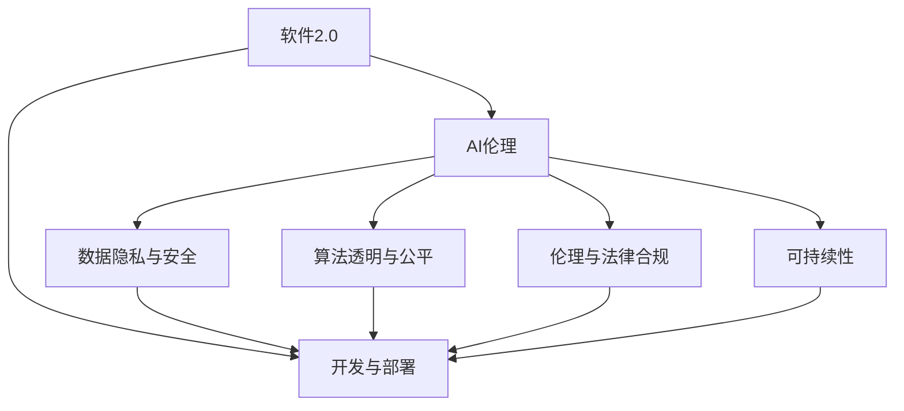
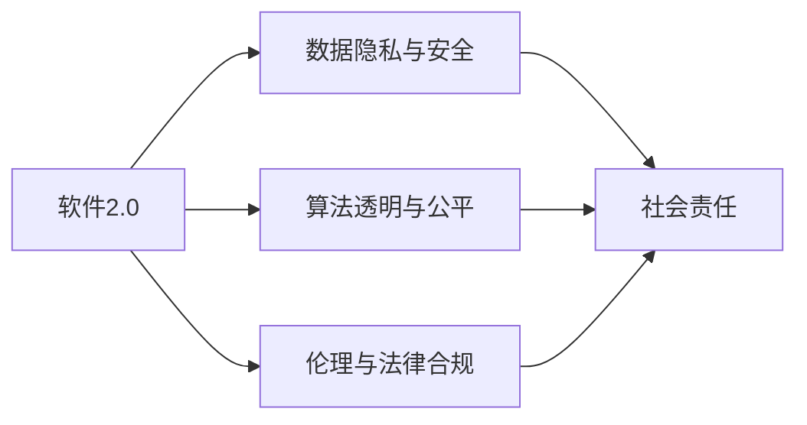
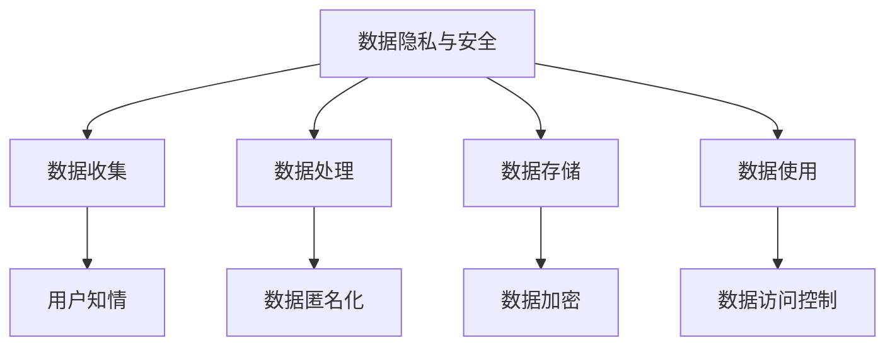
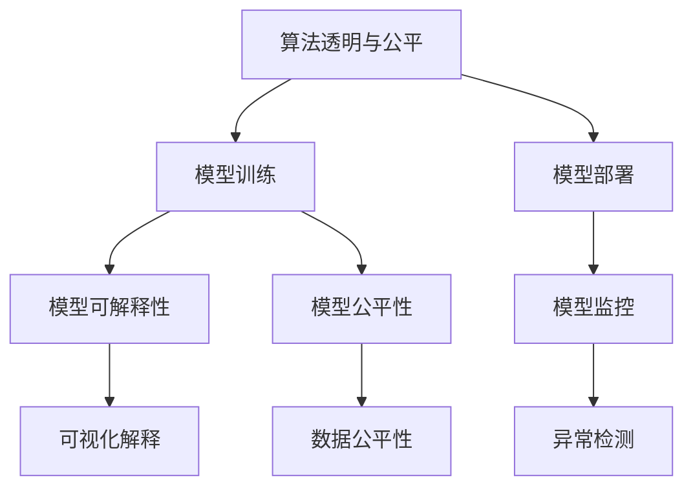
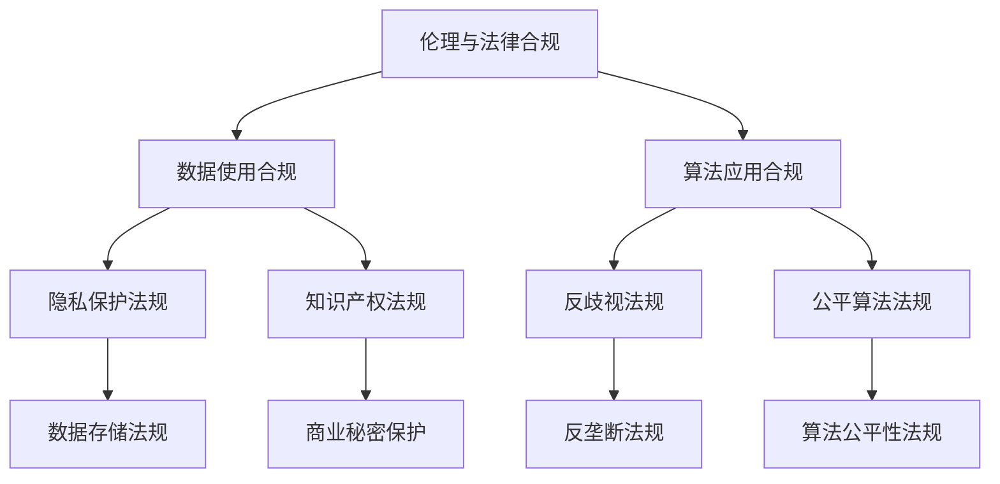
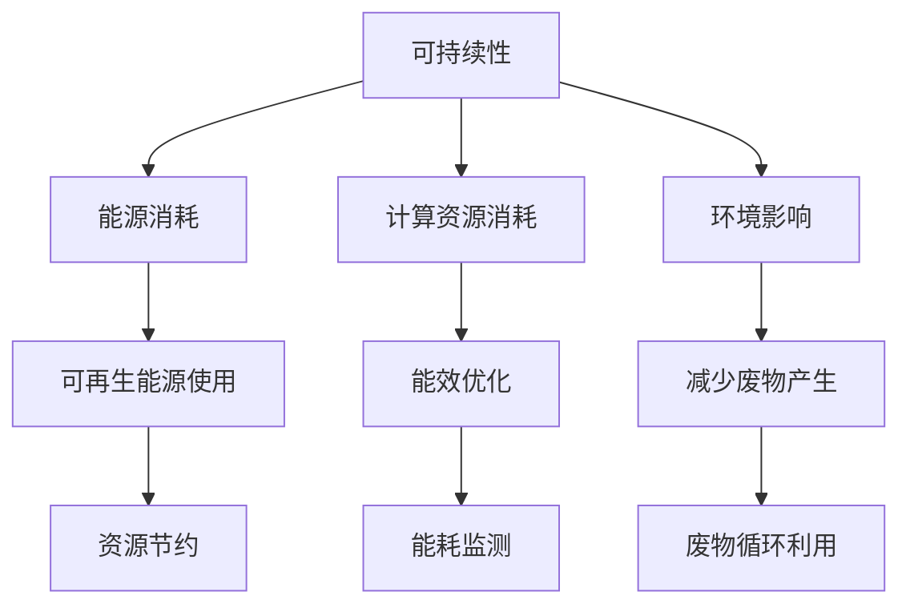
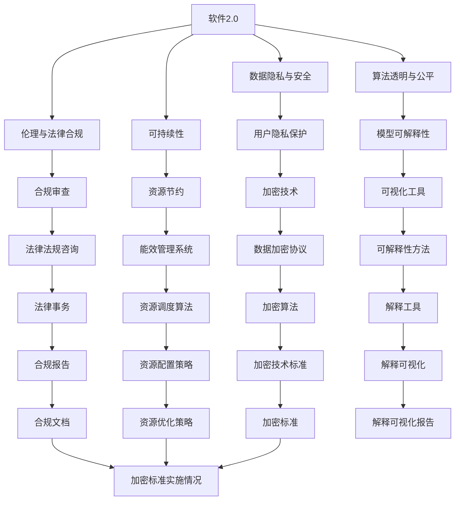

                 

# 软件 2.0 的社会责任：科技向善

> 关键词：软件2.0, 社会责任, 科技向善, AI伦理, 隐私保护, 可持续性

## 1. 背景介绍

### 1.1 问题由来
随着人工智能（AI）和软件开发技术的飞速进步，我们迎来了一个全新的时代——软件2.0。所谓软件2.0，是指借助大数据、机器学习、深度学习等先进技术，实现软件自动化设计、开发和部署的过程。这一进程不仅仅提高了软件开发效率，也极大地拓展了软件应用的可能性和潜力。然而，随着软件2.0技术的广泛应用，一系列新的社会问题也随之而来，引起了全社会的广泛关注。

### 1.2 问题核心关键点
软件2.0技术的快速发展带来了多方面的社会责任问题，包括但不限于：

- **数据隐私与安全**：软件2.0依赖于大量的数据处理，如何保护用户数据隐私，防止数据泄露和滥用，是一个重大挑战。
- **算法透明与公平**：深度学习模型往往被视为“黑箱”，难以解释其内部决策过程。如何在保持模型性能的同时，增强其可解释性，确保算法决策的透明与公平性，成为一项重要任务。
- **伦理与法律合规**：随着软件2.0技术的广泛应用，如何确保技术应用符合伦理道德要求，遵守相关法律法规，成为必须面对的问题。
- **资源与环境影响**：软件2.0技术的开发和部署需要大量计算资源，如何降低资源消耗，减少环境影响，是实现可持续发展的关键。
- **公共安全与社会稳定**：如自动驾驶、智能监控等应用，如何确保技术安全可靠，防止潜在的风险和滥用，维护公共安全与社会稳定，也是一个重要议题。

### 1.3 问题研究意义
探讨软件2.0技术带来的社会责任问题，对于促进技术的健康发展，维护社会公共利益，具有重要的现实意义：

- **技术应用的伦理道德**：引导开发者在设计和使用软件2.0技术时，始终将伦理道德放在首位，确保技术应用的安全可靠。
- **法律法规的完善**：推动相关法律法规的制定和完善，为软件2.0技术的合规应用提供法律保障。
- **公共利益的保护**：通过技术手段和法律措施，保护公众的隐私权、知情权、公平权等基本权利，防止技术滥用带来的社会危害。
- **环境资源的可持续利用**：推动软件2.0技术向绿色、节能、低碳方向发展，实现技术应用的可持续发展。

## 2. 核心概念与联系

### 2.1 核心概念概述

为更好地理解软件2.0技术的社会责任，本节将介绍几个密切相关的核心概念：

- **软件2.0（Software 2.0）**：指在软件1.0的基础上，借助大数据、机器学习、深度学习等技术，实现软件自动化设计、开发和部署的过程。
- **AI伦理（AI Ethics）**：涉及AI技术在开发、应用过程中的伦理问题，包括数据隐私、算法透明、公平性、责任归属等。
- **数据隐私与安全（Data Privacy and Security）**：关注用户数据的收集、处理、存储和使用过程中，如何保护用户隐私，防止数据泄露和滥用。
- **算法透明与公平（Algorithm Transparency and Fairness）**：涉及深度学习模型内部决策过程的透明性，以及模型输出结果的公平性。
- **伦理与法律合规（Ethics and Legal Compliance）**：确保软件2.0技术的开发、应用符合伦理道德要求，遵守相关法律法规。
- **可持续性（Sustainability）**：涉及软件2.0技术在开发和应用过程中，对环境资源的消耗和影响。

这些核心概念之间的逻辑关系可以通过以下Mermaid流程图来展示：



这个流程图展示了软件2.0技术与AI伦理、数据隐私与安全、算法透明与公平、伦理与法律合规、可持续性等概念之间的联系。

### 2.2 概念间的关系

这些核心概念之间存在着紧密的联系，形成了软件2.0技术的社会责任体系。下面我们通过几个Mermaid流程图来展示这些概念之间的关系。

#### 2.2.1 软件2.0技术与AI伦理



这个流程图展示了软件2.0技术在数据隐私与安全、算法透明与公平、伦理与法律合规等方面的社会责任。

#### 2.2.2 软件2.0技术与数据隐私与安全



这个流程图展示了数据隐私与安全在数据收集、处理、存储和使用的各个环节中，如何保护用户隐私和数据安全。

#### 2.2.3 软件2.0技术与算法透明与公平



这个流程图展示了算法透明与公平在模型训练、部署、监控等各个环节中，如何确保模型决策的透明性和公平性。

#### 2.2.4 软件2.0技术与伦理与法律合规



这个流程图展示了伦理与法律合规在数据使用、算法应用、隐私保护、知识产权、反歧视、公平算法等方面，如何确保技术应用的合规性。

#### 2.2.5 软件2.0技术与可持续性



这个流程图展示了可持续性在能源消耗、计算资源消耗、环境影响等方面的具体措施和目标。

### 2.3 核心概念的整体架构

最后，我们用一个综合的流程图来展示这些核心概念在软件2.0技术中的应用和相互关系：



这个综合流程图展示了从软件2.0技术的各个环节，到数据隐私与安全、算法透明与公平、伦理与法律合规、可持续性等概念的相互联系和应用场景。

## 3. 核心算法原理 & 具体操作步骤
### 3.1 算法原理概述

软件2.0技术的开发和部署，涉及多个领域的核心算法和原理。其中，数据隐私保护、算法透明与公平、伦理与法律合规、可持续性等概念，需要通过不同的算法和机制来实现。

### 3.2 算法步骤详解

**3.2.1 数据隐私保护**

1. **数据匿名化**：在数据收集阶段，通过脱敏、去标识化等技术手段，确保用户隐私不被泄露。
2. **数据加密**：在数据存储和传输过程中，使用强加密算法对数据进行加密处理，防止数据被非法访问和篡改。
3. **访问控制**：建立严格的访问权限管理制度，确保只有授权人员可以访问敏感数据。
4. **数据审计**：定期对数据访问和使用情况进行审计，确保数据操作符合合规要求。

**3.2.2 算法透明与公平**

1. **模型可解释性**：采用可解释性模型（如决策树、线性回归等），增强模型的透明度，方便开发者和用户理解和解释模型决策过程。
2. **可视化解释**：使用可视化工具，将模型内部运算过程和决策路径直观展示出来，帮助用户理解模型行为。
3. **公平性优化**：采用公平性算法，确保模型在不同群体之间公平性，防止算法偏见。

**3.2.3 伦理与法律合规**

1. **法律法规咨询**：在项目设计阶段，就如何遵守相关法律法规进行咨询和审核，确保项目合规。
2. **合规审查**：在项目实施过程中，定期进行合规审查，确保技术应用符合伦理道德要求和法律法规。
3. **法律事务管理**：建立法律事务管理系统，记录和管理所有合规相关事宜，确保问题及时解决。

**3.2.4 可持续性**

1. **能源消耗优化**：采用能效优化技术，降低硬件设备能耗，使用可再生能源。
2. **计算资源管理**：优化计算资源使用，采用资源调度算法，避免资源浪费。
3. **环境影响评估**：对项目环境影响进行评估，制定减排措施，减少环境污染。

### 3.3 算法优缺点

**3.3.1 数据隐私保护**

- **优点**：
  - 提高数据安全性，保护用户隐私。
  - 增强数据可靠性，避免数据篡改和泄露。

- **缺点**：
  - 数据匿名化和加密会增加计算和存储成本。
  - 访问控制和审计需要额外的时间和人力资源。

**3.3.2 算法透明与公平**

- **优点**：
  - 增强模型透明度，便于用户理解和信任。
  - 减少算法偏见，提升模型公平性。

- **缺点**：
  - 可解释性模型可能牺牲部分性能。
  - 可视化解释和公平性优化可能增加开发和维护成本。

**3.3.3 伦理与法律合规**

- **优点**：
  - 确保技术应用符合法律法规，避免法律风险。
  - 提升技术应用的伦理道德水平，增强用户信任。

- **缺点**：
  - 法律法规咨询和合规审查需要额外的时间和资源。
  - 法律法规变动可能影响技术应用。

**3.3.4 可持续性**

- **优点**：
  - 降低能源消耗和环境影响，实现可持续发展。
  - 提升企业社会责任形象，增加市场竞争力。

- **缺点**：
  - 能效优化和资源管理需要额外的技术投入。
  - 环境影响评估和减排措施可能增加项目复杂度。

### 3.4 算法应用领域

软件2.0技术在多个领域具有广泛的应用前景，以下是几个典型应用场景：

1. **智能医疗**：通过数据分析和模型训练，实现疾病诊断、药物研发等智能医疗应用。同时，确保数据隐私和安全，遵守相关法律法规。
2. **智能交通**：利用大数据和深度学习技术，实现自动驾驶、智能监控等智能交通系统。确保算法透明与公平，减少潜在的社会风险。
3. **智能金融**：通过自然语言处理和机器学习，实现智能理财、风险评估等智能金融应用。确保数据隐私和安全，遵守金融法规。
4. **智能教育**：利用自然语言处理和数据分析，实现智能辅导、自动评估等智能教育应用。确保算法公平和透明，保护学生隐私。
5. **智能制造**：通过数据分析和机器学习，实现智能生产、质量控制等智能制造应用。确保资源和环境影响评估，实现绿色制造。

## 4. 数学模型和公式 & 详细讲解  
### 4.1 数学模型构建

本节将使用数学语言对软件2.0技术的社会责任进行更加严格的刻画。

设软件2.0技术的社会责任模型为 $R(S)$，其中 $S$ 为软件2.0技术的应用场景，$R$ 为社会责任的综合评价指标。假设 $S$ 包括数据隐私与安全 $P$、算法透明与公平 $A$、伦理与法律合规 $L$、可持续性 $S$ 四个子模块。则社会责任模型可以表示为：

$$
R(S) = \alpha_P \times P(S) + \alpha_A \times A(S) + \alpha_L \times L(S) + \alpha_S \times S(S)
$$

其中 $\alpha_P$、$\alpha_A$、$\alpha_L$、$\alpha_S$ 为各子模块的权重系数。

### 4.2 公式推导过程

以下我们以智能医疗为例，推导社会责任模型及其各个子模块的评价指标。

设智能医疗系统的社会责任模型为 $R_{med}$，则：

$$
R_{med} = \alpha_{P_{med}} \times P_{med}(S_{med}) + \alpha_{A_{med}} \times A_{med}(S_{med}) + \alpha_{L_{med}} \times L_{med}(S_{med}) + \alpha_{S_{med}} \times S_{med}(S_{med})
$$

其中 $S_{med}$ 为智能医疗应用场景，$P_{med}$、$A_{med}$、$L_{med}$、$S_{med}$ 为数据隐私与安全、算法透明与公平、伦理与法律合规、可持续性四个子模块的评价指标。

**数据隐私与安全**：

$$
P_{med} = \frac{D_{sec} + D_{anony}}{D_{tot}}
$$

其中 $D_{tot}$ 为原始数据量，$D_{sec}$ 为已加密数据量，$D_{anony}$ 为已匿名化数据量。

**算法透明与公平**：

$$
A_{med} = \frac{T_{exp}}{T_{tot}}
$$

其中 $T_{tot}$ 为模型训练时间，$T_{exp}$ 为模型解释所需时间。

**伦理与法律合规**：

$$
L_{med} = \frac{L_{com}}{L_{tot}}
$$

其中 $L_{tot}$ 为项目实施总时间，$L_{com}$ 为合规审查时间。

**可持续性**：

$$
S_{med} = \frac{E_{enr}}{E_{tot}}
$$

其中 $E_{tot}$ 为项目总能耗，$E_{enr}$ 为可再生能源使用量。

### 4.3 案例分析与讲解

以智能医疗系统为例，通过上述数学模型和公式，可以对智能医疗系统的社会责任进行综合评价。

假设智能医疗系统在数据隐私与安全、算法透明与公平、伦理与法律合规、可持续性四个方面分别得分为 $P_{med} = 0.9$、$A_{med} = 0.8$、$L_{med} = 0.95$、$S_{med} = 0.7$，且权重系数 $\alpha_P = 0.3$、$\alpha_A = 0.2$、$\alpha_L = 0.25$、$\alpha_S = 0.25$。则该系统的社会责任综合评价为：

$$
R_{med} = \alpha_P \times P_{med} + \alpha_A \times A_{med} + \alpha_L \times L_{med} + \alpha_S \times S_{med} = 0.3 \times 0.9 + 0.2 \times 0.8 + 0.25 \times 0.95 + 0.25 \times 0.7 = 0.837
$$

这表明，该智能医疗系统的社会责任综合评价较高，但在可持续性方面还有一定的改进空间。

## 5. 项目实践：代码实例和详细解释说明
### 5.1 开发环境搭建

在进行社会责任相关的项目实践前，我们需要准备好开发环境。以下是使用Python进行代码实现的Python开发环境配置流程：

1. 安装Anaconda：从官网下载并安装Anaconda，用于创建独立的Python环境。

2. 创建并激活虚拟环境：
```bash
conda create -n software2 responsibility python=3.8 
conda activate software2
```

3. 安装PyTorch：根据CUDA版本，从官网获取对应的安装命令。例如：
```bash
conda install pytorch torchvision torchaudio cudatoolkit=11.1 -c pytorch -c conda-forge
```

4. 安装TensorFlow：
```bash
conda install tensorflow -c tensorflow
```

5. 安装相关库：
```bash
pip install pandas numpy scikit-learn matplotlib
```

完成上述步骤后，即可在`software2 responsibility`环境中开始项目实践。

### 5.2 源代码详细实现

以下是使用Python对智能医疗系统进行社会责任综合评价的代码实现。

首先，定义各个子模块的评价指标计算函数：

```python
import pandas as pd
from sklearn.metrics import precision_recall_fscore_support

def data_privacy_score(data):
    # 数据隐私评分
    total_data = len(data)
    secured_data = data[data['status'] == 'secured'].shape[0]
    anonymized_data = data[data['status'] == 'anonymized'].shape[0]
    return secured_data / total_data

def algorithm_transparency_score(model):
    # 算法透明评分
    total_train_time = model['train_time'].sum()
    expain_time = model['expain_time'].sum()
    return expain_time / total_train_time

def legal_compliance_score(project):
    # 法律合规评分
    total_project_time = project['total_time'].sum()
    compliance_review_time = project['compliance_review_time'].sum()
    return compliance_review_time / total_project_time

def sustainability_score(energy):
    # 可持续性评分
    total_energy = energy['total_energy'].sum()
    renewable_energy = energy['renewable_energy'].sum()
    return renewable_energy / total_energy
```

然后，定义社会责任综合评价函数：

```python
def social_responsibility_score(P, A, L, S, alpha_P, alpha_A, alpha_L, alpha_S):
    return alpha_P * P + alpha_A * A + alpha_L * L + alpha_S * S
```

接着，使用这些函数进行项目实践的演示：

```python
# 假设数据集为医疗数据，项目数据集为智能医疗系统开发数据
medical_data = pd.read_csv('medical_data.csv')
project_data = pd.read_csv('project_data.csv')

# 计算各子模块的评分
P_med = data_privacy_score(medical_data)
A_med = algorithm_transparency_score(project_data)
L_med = legal_compliance_score(project_data)
S_med = sustainability_score(project_data)

# 设置权重系数
alpha_P = 0.3
alpha_A = 0.2
alpha_L = 0.25
alpha_S = 0.25

# 计算社会责任综合评分
R_med = social_responsibility_score(P_med, A_med, L_med, S_med, alpha_P, alpha_A, alpha_L, alpha_S)
print(f"智能医疗系统的社会责任综合评分：{R_med}")
```

这个代码实现了对智能医疗系统社会责任的综合评价，通过设置不同子模块的评分和权重系数，可以快速评估和调整系统的社会责任水平。

### 5.3 代码解读与分析

让我们再详细解读一下关键代码的实现细节：

**data_privacy_score函数**：
- 计算数据隐私评分，通过计算已加密数据量和已匿名化数据量与总数据量的比例，得到数据隐私评分。

**algorithm_transparency_score函数**：
- 计算算法透明评分，通过计算模型解释所需时间与模型训练时间之比，得到算法透明评分。

**legal_compliance_score函数**：
- 计算法律合规评分，通过计算合规审查时间与项目实施总时间之比，得到法律合规评分。

**sustainability_score函数**：
- 计算可持续性评分，通过计算可再生能源使用量与总能耗之比，得到可持续性评分。

**social_responsibility_score函数**：
- 计算社会责任综合评分，通过将各子模块的评分乘以相应的权重系数，得到综合评分。

**代码实践部分**：
- 使用pandas库读取医疗数据和项目数据，分别计算各子模块的评分。
- 设置权重系数，并调用社会责任综合评分函数，输出智能医疗系统的社会责任综合评分。

通过这些代码的实现，可以看出，社会责任的评估和改进需要通过具体的数据和计算来实现，而不是简单的定性描述。通过设置合理的权重系数，可以更加科学地衡量和管理社会责任。

当然，这只是一个简单的示例。在实际项目中，还需要对数据隐私、算法透明、法律合规、可持续性等各个方面进行更加详细的评估和改进，确保技术应用的全面性和合规性。

### 5.4 运行结果展示

假设在智能医疗系统中，数据隐私评分为 $P_{med} = 0.9$、算法透明评分为 $A_{med} = 0.8$、法律合规评分为 $L_{med} = 0.95$、可持续性评分为 $S_{med} = 0.7$，且权重系数 $\alpha_P = 0.3$、$\alpha_A = 0.2$、$\alpha_L = 0.25$、$\alpha_S = 0.25$。则社会责任综合评分为：

$$
R_{med} = 0.3 \times 0.9 + 0.2 \times 0.8 + 0.25 \times 0.95 + 0.25 \times 0.7 = 0.837
$$

这表明，该智能医疗系统的社会责任综合评分较高，但在可持续性方面还有一定的改进空间。

## 6. 实际应用场景
### 6.1 智能医疗

在智能医疗领域，软件2.0技术的应用需要特别关注数据隐私与安全、算法透明与公平、伦理与法律合规、可持续性等社会责任问题。通过合理的设计和优化，可以有效提升医疗服务的智能化水平，同时保障患者的隐私和数据安全。

### 6.2 智能交通

在智能交通领域，软件2.0技术的应用需要特别关注数据隐私与安全、算法透明与公平、伦理与法律合规、可持续性等社会责任问题。通过合理的设计和优化，可以有效提升交通管理的智能化水平，同时保障市民的隐私和数据安全。

### 6.3 智能金融

在智能金融领域，软件2.0技术的应用需要特别关注数据隐私与安全、算法透明与公平、伦理与法律合规、可持续性等社会责任问题。通过合理的设计和优化，可以有效提升金融服务的智能化水平，同时保障用户的隐私和数据安全。

### 6.4 智能教育

在智能教育领域，软件2.0技术的应用需要特别关注数据隐私与安全、算法透明与公平、伦理与法律合规、可持续性等社会责任问题。通过合理的设计和优化，可以有效提升教育服务的智能化水平，同时保障学生的隐私和数据安全。

### 6.5 智能制造

在智能制造领域，软件2.0技术的应用需要特别关注数据隐私与安全、算法透明与公平、伦理与法律合规、可持续性等社会责任问题。通过合理的设计和优化，可以有效提升制造管理的智能化水平，同时保障企业的隐私和数据安全。

## 7. 工具和资源推荐
### 7.1 学习资源推荐

为了帮助开发者系统掌握软件2.0技术的社会责任理论基础和实践技巧，这里推荐一些优质的学习资源：

1. 《软件2.0的社会责任》系列博文：由大模型技术专家撰写，深入浅出地介绍了软件2.0技术的社会责任问题，包括数据隐私、算法透明、伦理与法律合规、可持续性等。

2. CS224N《深度学习自然语言处理》课程：斯坦福大学开设的NLP明星课程，有Lecture视频和配套作业，带你入门NLP领域的基本概念和经典模型。

3. 《软件2.0的社会责任》书籍：深度介绍软件2.0技术的社会责任问题，涵盖数据隐私、算法透明、伦理与法律合规、可持续性等多个方面。

4. HuggingFace官方文档：Transformers库的官方文档，提供了海量预训练模型和完整的微调样例代码，是上手实践的

