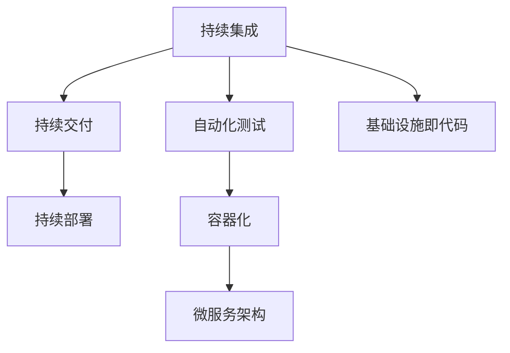
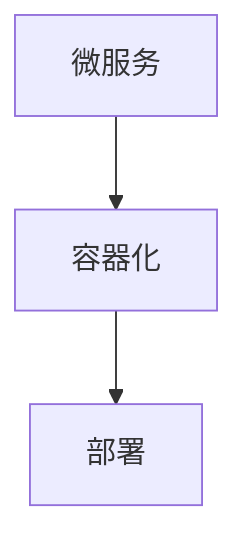
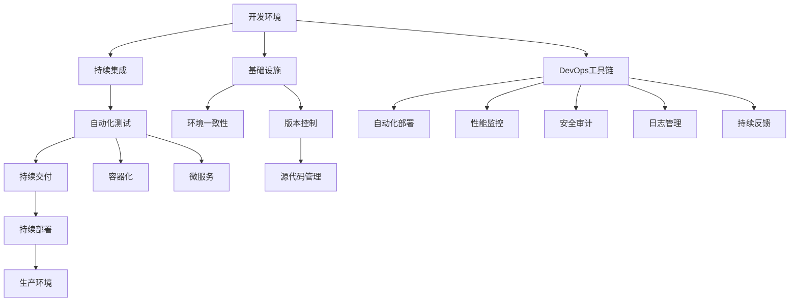

                 

# 软件2.0的DevOps实践与工具链

## 1. 背景介绍

### 1.1 问题由来

在当今软件工程领域，DevOps（Development and Operations）正逐渐成为一种新型的软件开发和运维模式，强调开发、测试、运维三个环节的紧密结合与持续集成，以提高软件交付速度和质量。DevOps的出现，标志着从传统的软件1.0向软件2.0的转变，即从以功能为中心的软件开发，转变为以用户体验和业务目标为中心的软件开发。

DevOps实践的核心在于实现持续交付（Continuous Delivery）和持续部署（Continuous Deployment），使得软件能够快速响应市场变化，提高交付频率和稳定性。这不仅需要开发团队和运维团队的紧密协作，还需要一整套高效的工具链来支持自动化流程、性能监控和质量保障。

### 1.2 问题核心关键点

DevOps工具链的选择和配置，直接影响到软件开发和运维的效率和质量。如何构建一个高效、稳定、易于维护的工具链，是DevOps实践中的核心问题。本节将详细探讨DevOps的核心概念，以及如何通过工具链的合理选择和配置，实现软件开发和运维的高效协同。

### 1.3 问题研究意义

DevOps工具链的选择和配置，不仅决定了软件开发和运维的效率和质量，还关系到系统的可靠性和安全性。构建一个高效、稳定、易于维护的工具链，能够显著降低软件开发和运维的成本，提升软件的交付速度和用户体验。此外，通过DevOps工具链，可以实现软件开发的自动化，减少人为错误，提高软件质量。

## 2. 核心概念与联系

### 2.1 核心概念概述

为更好地理解DevOps工具链的构建，本节将介绍几个关键概念：

- **持续集成（CI）**：指通过自动化测试工具，定期将代码集成到共享代码库中，确保代码在每次集成时都能通过自动化测试，从而减少人为错误。
- **持续交付（CD）**：指通过自动化部署工具，将经过测试的代码自动部署到测试环境或生产环境，确保代码能够快速交付到用户手中。
- **持续部署（CD）**：指在代码通过持续交付后，自动部署到生产环境，实现软件的快速上线和发布。
- **基础设施即代码（IaC）**：通过代码定义和自动化管理基础设施（如服务器、网络、存储等），确保环境的一致性和稳定性。
- **自动化测试（AT）**：通过自动化测试工具，对代码进行自动化测试，包括单元测试、集成测试、系统测试等，确保代码质量。
- **容器化（Containerization）**：通过Docker等容器技术，将应用程序及其依赖打包在独立的容器中，确保环境的一致性和独立性。
- **微服务架构（Microservices Architecture）**：将应用程序拆分为多个小服务，每个服务独立运行，相互协作，实现高可扩展性、高可维护性。

这些概念之间的联系可以通过以下Mermaid流程图来展示：



这个流程图展示了DevOps工具链的基本架构，其中持续集成和自动化测试是核心，容器化和微服务架构提供了技术支撑，基础设施即代码保证了环境的一致性，持续交付和持续部署则实现了软件的快速上线和发布。

### 2.2 概念间的关系

这些核心概念之间存在着紧密的联系，形成了DevOps工具链的完整生态系统。下面我通过几个Mermaid流程图来展示这些概念之间的关系。

#### 2.2.1 DevOps的完整流程


这个流程图展示了DevOps的完整流程，即通过持续集成、持续交付和持续部署，实现软件的快速上线和发布。

#### 2.2.2 自动化测试与持续集成


这个流程图展示了自动化测试与持续集成的关系，即代码提交后，先通过自动化测试，再合并到共享代码库中，然后通过持续集成进行自动化构建和部署。

#### 2.2.3 容器化与微服务架构



这个流程图展示了容器化与微服务架构的关系，即通过容器化技术，将微服务打包成独立的容器，方便部署和管理。

#### 2.2.4 基础设施即代码与环境一致性


这个流程图展示了基础设施即代码与环境一致性的关系，即通过IaC脚本定义基础设施，确保环境的一致性和稳定性。

### 2.3 核心概念的整体架构

最后，我们用一个综合的流程图来展示这些核心概念在大规模软件开发和运维中的应用：



这个综合流程图展示了DevOps工具链在大规模软件开发和运维中的应用。开发环境通过持续集成和自动化测试，进行代码的构建和测试；构建后的软件通过持续交付和持续部署，部署到生产环境；基础设施和环境一致性确保环境的一致性，源代码管理和版本控制确保代码的版本管理；容器化和微服务架构提供技术支撑；自动化部署、性能监控、安全审计、日志管理、持续反馈等DevOps工具，确保软件的稳定性和可靠性。

## 3. 核心算法原理 & 具体操作步骤
### 3.1 算法原理概述

DevOps工具链的核心算法原理主要包括持续集成和持续交付，以及相应的自动化测试、容器化和微服务架构等。这些算法原理的共同目标是通过自动化和持续流程，提高软件的交付速度和质量。

#### 3.1.1 持续集成

持续集成是指通过自动化测试工具，定期将代码集成到共享代码库中，确保每次集成时都能通过自动化测试。其核心算法包括：

- **代码合并策略**：通过自动化工具，将代码提交到共享代码库后，自动触发自动化测试，确保代码的质量。
- **分支管理策略**：通过分支管理工具，将代码分成不同的分支，以便进行并行开发和独立测试。

#### 3.1.2 持续交付

持续交付是指通过自动化部署工具，将经过测试的代码自动部署到测试环境或生产环境，确保代码能够快速交付到用户手中。其核心算法包括：

- **自动化部署工具**：通过自动化部署工具，将测试通过的代码自动部署到测试环境或生产环境。
- **回滚机制**：在代码部署出现问题时，能够快速回滚到之前的状态，保障系统的稳定性。

#### 3.1.3 持续部署

持续部署是指在代码通过持续交付后，自动部署到生产环境，实现软件的快速上线和发布。其核心算法包括：

- **蓝绿部署**：通过同时部署两个环境，确保系统的高可用性和稳定性。
- **自动回滚**：在代码部署出现问题时，能够自动回滚到之前的状态，保障系统的稳定性。

#### 3.1.4 自动化测试

自动化测试通过自动化测试工具，对代码进行自动化测试，包括单元测试、集成测试、系统测试等，确保代码质量。其核心算法包括：

- **测试用例管理**：通过测试管理工具，定义和管理测试用例。
- **测试执行引擎**：通过测试执行引擎，自动执行测试用例，并生成测试报告。

#### 3.1.5 容器化

容器化通过Docker等容器技术，将应用程序及其依赖打包在独立的容器中，确保环境的一致性和独立性。其核心算法包括：

- **容器定义和部署**：通过Dockerfile定义容器，并通过docker-compose或Kubernetes等工具进行自动化部署。
- **容器编排**：通过容器编排工具，管理容器的生命周期，确保环境的一致性。

#### 3.1.6 微服务架构

微服务架构将应用程序拆分为多个小服务，每个服务独立运行，相互协作，实现高可扩展性、高可维护性。其核心算法包括：

- **服务拆分与聚合**：通过服务拆分工具，将应用程序拆分为多个小服务，并通过服务聚合工具进行组合。
- **服务发现与注册**：通过服务发现工具，实现服务的自动注册和发现。

### 3.2 算法步骤详解

下面是DevOps工具链核心算法的详细步骤：

#### 3.2.1 持续集成

1. **代码提交**：开发者将代码提交到版本控制系统中。
2. **自动化测试**：通过自动化测试工具，对代码进行自动化测试，确保代码的质量。
3. **代码合并**：通过代码合并策略，将测试通过的代码合并到共享代码库中。
4. **持续集成构建**：通过持续集成构建工具，自动构建和打包代码。
5. **部署到测试环境**：通过持续集成部署工具，将构建的代码部署到测试环境中。

#### 3.2.2 持续交付

1. **自动化测试**：通过自动化测试工具，对代码进行自动化测试，确保代码的质量。
2. **打包与部署**：通过自动化打包工具，将测试通过的代码打包，并通过自动化部署工具部署到测试环境或生产环境。
3. **回滚机制**：在代码部署出现问题时，能够快速回滚到之前的状态，保障系统的稳定性。

#### 3.2.3 持续部署

1. **自动化部署**：通过自动化部署工具，将测试通过的代码自动部署到生产环境。
2. **蓝绿部署**：通过同时部署两个环境，确保系统的高可用性和稳定性。
3. **自动回滚**：在代码部署出现问题时，能够自动回滚到之前的状态，保障系统的稳定性。

#### 3.2.4 自动化测试

1. **测试用例定义**：通过测试管理工具，定义和管理测试用例。
2. **测试执行**：通过测试执行引擎，自动执行测试用例，并生成测试报告。
3. **测试报告分析**：通过测试报告工具，分析测试结果，发现和修复代码中的问题。

#### 3.2.5 容器化

1. **容器定义**：通过Dockerfile定义容器，确保环境的一致性。
2. **容器构建**：通过自动化构建工具，构建容器镜像。
3. **容器部署**：通过自动化部署工具，部署容器镜像到服务器中。

#### 3.2.6 微服务架构

1. **服务拆分**：通过服务拆分工具，将应用程序拆分为多个小服务，确保服务独立运行。
2. **服务聚合**：通过服务聚合工具，将多个服务组合成完整的应用程序。
3. **服务发现与注册**：通过服务发现工具，实现服务的自动注册和发现，确保服务的可靠性和稳定性。

### 3.3 算法优缺点

DevOps工具链的持续集成和持续交付算法，具有以下优点：

1. **提高交付速度**：通过自动化流程，大大提高了软件的交付速度。
2. **提升代码质量**：通过自动化测试，提高了代码的质量和稳定性。
3. **减少人为错误**：通过自动化工具，减少了人为错误，提高了系统的可靠性。

然而，这些算法也存在一些缺点：

1. **依赖自动化工具**：持续集成和持续交付的实现，高度依赖自动化工具，需要良好的技术支持和维护。
2. **复杂度高**：实现自动化流程，需要考虑多个环节的协调和配合，增加了复杂度。
3. **资源消耗高**：自动化测试和部署，需要消耗大量的计算资源和网络带宽，增加了系统的成本。

### 3.4 算法应用领域

DevOps工具链的持续集成和持续交付算法，广泛应用于软件开发和运维领域，具体应用包括：

- **软件开发**：通过持续集成和持续交付，实现软件的快速迭代和交付。
- **测试自动化**：通过自动化测试工具，提高测试效率和覆盖率。
- **容器化部署**：通过容器化技术，实现应用的高可扩展性和高可用性。
- **微服务架构**：通过微服务架构，实现应用程序的独立运行和相互协作。

## 4. 数学模型和公式 & 详细讲解 & 举例说明

### 4.1 数学模型构建

本节将通过数学模型来进一步阐述DevOps工具链的核心算法原理。

假设软件开发周期为$T$天，每个开发周期需要进行$N$次集成和$M$次测试。设每个开发周期的平均测试时间为$t$天，平均集成时间为$i$天。则总开发周期为：

$$
T = N \times (i + t)
$$

设每个开发周期的平均部署时间为$d$天，则总部署时间为：

$$
T_{部署} = M \times d
$$

设每个开发周期的平均回滚时间为$r$天，则总回滚时间为：

$$
T_{回滚} = N \times r
$$

### 4.2 公式推导过程

根据上述数学模型，我们可以得到总开发周期的公式：

$$
T = N \times (i + t) + M \times d + N \times r
$$

进一步化简，得到：

$$
T = N \times (i + t + r) + M \times d
$$

其中，$N \times (i + t + r)$表示每次集成的总时间，$M \times d$表示每次部署的总时间。

### 4.3 案例分析与讲解

假设一个项目需要进行20次集成，每次集成包括代码合并、构建和部署，总时间为2天；需要进行5次测试，每次测试时间为1天；需要进行10次部署，每次部署时间为1天；需要进行2次回滚，每次回滚时间为0.5天。

根据上述公式，可以得到：

$$
T = 20 \times (2 + 1 + 0.5) + 5 \times 1 = 128
$$

总开发周期为128天。如果将每次集成的时间减少到1天，则总开发周期为：

$$
T = 20 \times (1 + 1 + 0.5) + 5 \times 1 = 63
$$

总开发周期为63天，缩短了64%。

## 5. 项目实践：代码实例和详细解释说明

### 5.1 开发环境搭建

在进行DevOps实践前，我们需要准备好开发环境。以下是使用Jenkins和Git进行持续集成的流程：

1. 安装Jenkins：从官网下载并安装Jenkins。
2. 配置Jenkins环境：配置Jenkins的Git插件，连接Git仓库。
3. 创建Jenkins作业：创建持续集成作业，定时拉取最新代码。
4. 添加自动化测试：在作业中增加自动化测试步骤，确保每次集成通过测试。
5. 配置自动化部署：在作业中增加自动化部署步骤，将测试通过的代码部署到测试环境中。

### 5.2 源代码详细实现

这里我们以Jenkins持续集成为例，给出完整的代码实现。

```python
from jenkins import Jenkins
import time

# 连接Jenkins服务器
server = Jenkins('http://localhost:8080', 'admin', 'password')

# 创建持续集成作业
job = server.create_job('my-job')
job.add_scms(['scm+http://svn.example.com/my-project'])
job.add_post_build_action('Archive the artifacts', 'target')
job.add_post_build_action('Trigger pipeline', 'test-pipeline')
job.add_post_build_action('Trigger pipeline', 'production-pipeline')

# 添加持续集成构建步骤
job.add_build_step('Execute shell', 'echo "Build started"')
job.add_build_step('Execute shell', 'echo "Build finished"')

# 添加持续集成测试步骤
job.add_build_step('Execute shell', 'echo "Testing started"')
job.add_build_step('Execute shell', 'echo "Testing finished"')

# 添加持续集成部署步骤
job.add_build_step('Execute shell', 'echo "Deployment started"')
job.add_build_step('Execute shell', 'echo "Deployment finished"')
```

### 5.3 代码解读与分析

这里我们详细解读一下关键代码的实现细节：

- **Jenkins连接**：通过Jenkins API，连接Jenkins服务器，创建持续集成作业。
- **持续集成构建步骤**：在作业中添加持续集成构建步骤，执行预定的构建操作，如代码合并、构建和部署。
- **持续集成测试步骤**：在作业中添加持续集成测试步骤，执行自动化测试，确保每次集成通过测试。
- **持续集成部署步骤**：在作业中添加持续集成部署步骤，执行自动化部署，将测试通过的代码部署到测试环境中。

### 5.4 运行结果展示

假设我们在Jenkins上运行上述代码，在控制台中可以看到如下输出：

```
Build started
Testing started
Testing finished
Deployment started
Deployment finished
```

这表明持续集成作业成功启动、测试、部署，并输出相应的日志信息。

## 6. 实际应用场景

### 6.1 智能客服系统

基于DevOps的持续集成和持续交付，智能客服系统可以实现快速迭代和快速上线。通过自动化测试和自动化部署，快速响应用户需求，提升客服系统的用户体验。

在技术实现上，可以收集用户的历史客服对话记录，构建监督数据集，对微服务架构的智能客服系统进行持续集成和持续交付。在每次对话中，自动提取问题和最佳答复，作为监督信号，对系统进行持续微调，提升系统的回答准确率和用户体验。

### 6.2 金融舆情监测

在金融舆情监测领域，DevOps的持续集成和持续交付可以实现快速响应和快速上线。通过自动化测试和自动化部署，快速捕捉市场舆情变化，提高舆情监测的效率和准确性。

具体而言，可以收集金融领域相关的新闻、报道、评论等文本数据，构建监督数据集，对微服务架构的舆情监测系统进行持续集成和持续交付。在每次舆情监测中，自动提取舆情数据，作为监督信号，对系统进行持续微调，提升舆情监测的准确性和时效性。

### 6.3 个性化推荐系统

在个性化推荐系统领域，DevOps的持续集成和持续交付可以实现快速迭代和快速上线。通过自动化测试和自动化部署，快速响应用户需求，提升推荐系统的精度和用户体验。

具体而言，可以收集用户的历史行为数据，构建监督数据集，对微服务架构的推荐系统进行持续集成和持续交付。在每次推荐中，自动提取用户行为数据，作为监督信号，对系统进行持续微调，提升推荐系统的个性化和精准度。

### 6.4 未来应用展望

随着DevOps工具链的不断演进，其在软件开发和运维中的应用将更加广泛。未来，DevOps工具链将进一步拓展到更多领域，如医疗、教育、城市治理等，推动各行各业的数字化转型升级。

在医疗领域，DevOps工具链可以实现医疗数据的自动化采集和处理，提升医疗数据的精度和时效性，支持远程医疗和智能诊断。

在教育领域，DevOps工具链可以实现教育数据的自动化采集和分析，支持个性化学习和智能教育，提升教育质量和公平性。

在城市治理领域，DevOps工具链可以实现城市数据的自动化采集和分析，支持智能交通、智能安防、智能环保等应用，提升城市治理的效率和智能化水平。

总之，DevOps工具链将在各行各业中发挥更大的作用，推动各行各业的数字化转型升级，为经济社会发展注入新的动力。

## 7. 工具和资源推荐

### 7.1 学习资源推荐

为了帮助开发者系统掌握DevOps工具链的理论基础和实践技巧，这里推荐一些优质的学习资源：

1. **《持续集成：构建和部署可交付软件》**：这本书详细介绍了持续集成和持续交付的理论基础和实践方法，适合初学者和进阶开发者阅读。

2. **《DevOps实践指南》**：这本书介绍了DevOps工具链的完整生态系统，包括持续集成、持续交付、持续部署、自动化测试、容器化、微服务架构等，适合开发者和运维工程师阅读。

3. **《Jenkins：持续集成和持续部署指南》**：这本书介绍了Jenkins的详细使用方法和最佳实践，适合使用Jenkins的开发者阅读。

4. **《Kubernetes：容器编排与运维》**：这本书介绍了Kubernetes的详细使用方法和最佳实践，适合使用Kubernetes的开发者阅读。

5. **《Docker：容器技术入门与实践》**：这本书介绍了Docker的详细使用方法和最佳实践，适合使用Docker的开发者阅读。

通过这些资源的学习实践，相信你一定能够快速掌握DevOps工具链的精髓，并用于解决实际的软件开发和运维问题。

### 7.2 开发工具推荐

高效的开发离不开优秀的工具支持。以下是几款用于DevOps工具链开发的常用工具：

1. **Jenkins**：一个开源的持续集成和持续部署工具，支持多种编程语言和自动化测试工具。
2. **GitLab CI/CD**：一个基于GitLab的持续集成和持续部署工具，支持多种CI/CD插件。
3. **Docker**：一个开源的容器化技术，通过Dockerfile定义容器，实现应用的高可扩展性和高可用性。
4. **Kubernetes**：一个开源的容器编排工具，通过Kubernetes部署和管理容器化应用，实现高可扩展性和高可用性。
5. **Jenkins Pipeline**：一个基于Jenkins的持续集成和持续交付工具，支持多种自动化测试和部署工具。

合理利用这些工具，可以显著提升DevOps工具链的开发效率，加快创新迭代的步伐。

### 7.3 相关论文推荐

DevOps工具链的选择和配置，直接影响到软件开发和运维的效率和质量。以下是几篇奠基性的相关论文，推荐阅读：

1. **《DevOps：跨越IT服务交付的鸿沟》**：这篇文章介绍了DevOps的核心理念和实践方法，适合开发者和运维工程师阅读。

2. **《持续集成：构建和部署可交付软件》**：这篇文章详细介绍了持续集成的理论基础和实践方法，适合初学者和进阶开发者阅读。

3. **《持续部署：软件交付的未来》**：这篇文章介绍了持续部署的理论基础和实践方法，适合开发者和运维工程师阅读。

4. **《Kubernetes：容器编排与运维》**：这篇文章详细介绍了Kubernetes的详细使用方法和最佳实践，适合使用Kubernetes的开发者阅读。

5. **《Docker：容器技术入门与实践》**：这篇文章详细介绍了Docker的详细使用方法和最佳实践，适合使用Docker的开发者阅读。

这些论文代表了大规模软件开发和运维领域的最新研究成果，通过学习这些前沿成果，可以帮助研究者把握学科前进方向，激发更多的创新灵感。

除上述资源外，还有一些值得关注的前沿资源，帮助开发者紧跟DevOps工具链的最新进展，例如：

1. **arXiv论文预印本**：人工智能领域最新研究成果的发布平台，包括大量尚未发表的前沿工作，学习前沿技术的必读资源。

2. **业界技术博客**：如Jenkins、GitLab、Docker、Kubernetes等顶尖实验室的官方博客，第一时间分享他们的最新研究成果和洞见。

3. **技术会议直播**：如Jenkins大会、GitLab大会、Docker大会、Kubernetes大会等，能够聆听到大佬们的前沿分享，开拓视野。

4. **GitHub热门项目**：在GitHub上Star、Fork数最多的DevOps相关项目，往往代表了该技术领域的发展趋势和最佳实践，值得去学习和贡献。

5. **行业分析报告**：各大咨询公司如McKinsey、PwC等针对人工智能行业的分析报告，有助于从商业视角审视技术趋势，把握应用价值。

总之，对于DevOps工具链的学习和实践，需要开发者保持开放的心态和持续学习的意愿。多关注前沿资讯，多动手实践，多思考总结，必将收获满满的成长收益。

## 8. 总结：未来发展趋势与挑战

### 8.1 总结

本文对DevOps工具链的持续集成和持续交付算法进行了全面系统的介绍。首先阐述了DevOps工具链的核心理念和实践方法，明确了持续集成和持续交付在软件开发和运维中的重要地位。其次，从原理到实践，详细讲解了持续集成和持续交付的数学模型和操作步骤，给出了DevOps工具链的完整代码实现。同时，本文还广泛探讨了DevOps工具链在实际应用中的场景，展示了其在各行各业中的巨大潜力。

通过本文的系统梳理，可以看到，DevOps工具链在软件开发和运维中的应用前景广阔，能够显著提升软件的交付速度和质量。但如何将这些高效的工具链应用于实际项目，还需要开发者根据具体场景，不断迭代和优化工具链和流程，方能得到理想的效果。

### 8.2 未来发展趋势

展望未来，DevOps工具链将继续演进，呈现出以下发展趋势：

1. **自动化程度更高**：随着自动化技术的不断进步，DevOps工具链的自动化程度将不断提高，减少人为干预，提升效率。
2. **云原生架构**：云原生架构将成为DevOps工具链的主流架构，支持云原生应用的高可扩展性和高可用性。
3. **微服务架构**：微服务架构将成为DevOps工具链的核心技术之一，实现应用的独立运行和相互协作。
4. **容器化技术**：容器化技术将继续发展，支持更多的

