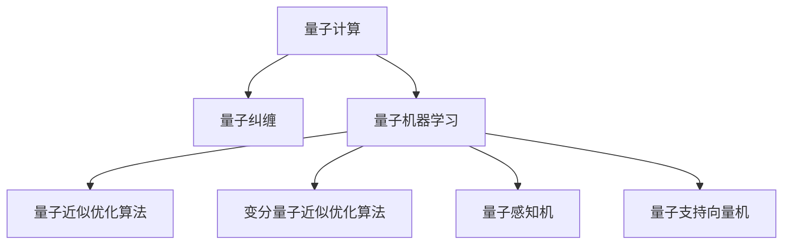
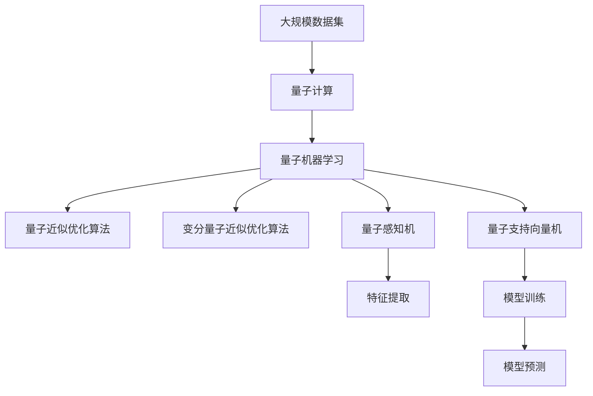

                 

# 一切皆是映射：AI的前沿研究：量子计算与机器学习

## 1. 背景介绍

### 1.1 问题由来
量子计算与机器学习的交叉研究已经成为当今AI领域的前沿热点。这一领域的研究旨在将量子力学的理论应用于机器学习算法中，以期大幅提升计算效率和数据处理能力。量子计算的独特优势在于其潜在的并行计算能力和量子纠缠现象，这为处理复杂、大规模数据提供了新的可能性。

### 1.2 问题核心关键点
量子计算与机器学习的交叉研究关注的核心问题包括：
1. 如何利用量子计算加速机器学习算法的训练和推理过程。
2. 如何构建量子优化的机器学习模型，提升数据处理和特征提取的效率。
3. 如何有效应对量子计算硬件的局限性和噪声问题。
4. 如何实现量子算法与经典算法的无缝集成。

### 1.3 问题研究意义
量子计算与机器学习的交叉研究对于推动AI技术的创新和发展具有重要意义：
1. 提升数据处理能力。量子计算能够处理传统计算机无法处理的大规模、高维度的数据集。
2. 加速模型训练。量子计算的高并行性能够显著缩短机器学习模型的训练时间。
3. 探索新算法。量子计算提供了一种全新的计算模式，可能催生出全新的机器学习算法。
4. 增强安全性。量子计算对于某些加密算法具有不可破解性，可能带来新的数据安全解决方案。
5. 促进跨学科研究。量子计算与机器学习的融合推动了计算机科学、物理学、数学等多学科的交叉研究。

## 2. 核心概念与联系

### 2.1 核心概念概述

本节将介绍几个关键的概念，以帮助读者理解量子计算与机器学习交叉研究的框架：

- **量子计算(QC)**：利用量子力学原理进行计算的技术，主要特点是量子比特（qubits）可以同时存在于多个状态中，实现并行计算。
- **量子纠缠**：两个或多个量子比特之间的非经典相关性，可以用于提高计算效率。
- **量子机器学习(QML)**：将量子计算技术应用于机器学习中的算法和模型。
- **量子近似优化算法(QAOA)**：一种基于量子计算的优化算法，用于求解组合优化问题。
- **变分量子近似优化算法(VQE)**：用于量子化学反应和量子机器学习的优化算法。
- **量子感知机(QPM)**：一种基于量子计算的神经网络模型。
- **量子支持向量机(QSVM)**：利用量子计算提升支持向量机的性能。

### 2.2 概念间的关系

这些概念之间的联系可以通过以下Mermaid流程图来展示：



这个流程图展示了各个概念之间的层次关系：

1. **A. 量子计算**：是基础技术，为量子机器学习和量子算法提供了计算能力。
2. **B. 量子纠缠**：是量子计算中的一种关键现象，用于提升计算效率。
3. **C. 量子机器学习**：是将量子计算应用于机器学习领域，包括了多个具体的量子算法。
4. **D. 量子近似优化算法**：是量子机器学习中用于优化问题的算法。
5. **E. 变分量子近似优化算法**：是量子近似优化算法的一种，用于更精确地求解优化问题。
6. **F. 量子感知机**：是基于量子计算的神经网络模型。
7. **G. 量子支持向量机**：是利用量子计算提升的机器学习模型。

这些概念共同构成了量子计算与机器学习交叉研究的生态系统，使得量子计算在机器学习中的应用变得可能。

### 2.3 核心概念的整体架构

最后，我们用一个综合的流程图来展示这些核心概念在大规模机器学习应用中的整体架构：



这个综合流程图展示了从数据集输入到最终模型预测的完整过程：

1. **A. 大规模数据集**：是输入，经过**B. 量子计算**的加速处理。
2. **C. 量子机器学习**：通过**D. 量子近似优化算法**和**E. 变分量子近似优化算法**进行特征提取和模型训练。
3. **F. 量子感知机**：和**G. 量子支持向量机**是具体的机器学习模型，用于特征提取和模型训练。
4. **H. 特征提取**：将大规模数据集处理为可用于机器学习的特征。
5. **I. 模型训练**：使用量子计算加速的机器学习模型对特征进行训练。
6. **J. 模型预测**：最终模型对输入数据进行预测。

通过这个综合流程图，我们可以更清晰地理解量子计算与机器学习在大规模数据处理中的应用。

## 3. 核心算法原理 & 具体操作步骤
### 3.1 算法原理概述

量子计算与机器学习的交叉研究中，核心算法主要分为两类：量子优化算法和量子神经网络。

### 3.2 算法步骤详解

**3.2.1 量子近似优化算法(QAOA)**
QAOA是一种用于组合优化问题的量子算法，其步骤如下：
1. 初始化量子态为特定形式。
2. 交替进行混合运算和旋转运算。
3. 对量子态进行测量，得到最优解。
4. 迭代多次，得到最终近似解。

**3.2.2 变分量子近似优化算法(VQE)**
VQE是一种用于量子化学反应的优化算法，其步骤如下：
1. 使用变分量子电路对量子态进行优化。
2. 计算量子态的期望能量。
3. 使用梯度下降等方法更新量子电路的参数。
4. 重复多次，得到最优的量子电路参数。

**3.2.3 量子感知机(QPM)**
量子感知机是一种基于量子计算的神经网络模型，其步骤如下：
1. 输入量子比特，通过量子叠加和量子纠缠实现特征提取。
2. 使用量子感知机进行前向传播，得到输出。
3. 使用量子感知机的权重更新公式更新模型参数。
4. 重复多次，得到最终的模型参数。

**3.2.4 量子支持向量机(QSVM)**
量子支持向量机是一种利用量子计算提升的机器学习模型，其步骤如下：
1. 将数据映射到高维量子空间。
2. 使用量子计算进行核函数的计算。
3. 使用量子感知机进行分类。
4. 使用量子感知机的权重更新公式更新模型参数。
5. 重复多次，得到最终的模型参数。

### 3.3 算法优缺点

量子计算与机器学习的交叉研究中的算法具有以下优点：
1. 处理大规模数据的效率高。
2. 并行计算能力强。
3. 利用量子纠缠和量子叠加提升计算效率。

但同时也存在以下缺点：
1. 量子计算硬件尚未成熟，存在技术瓶颈。
2. 量子计算模型的可解释性差。
3. 量子计算噪声问题尚未解决。

### 3.4 算法应用领域

量子计算与机器学习的交叉研究已经在多个领域得到了应用：

- **量子化学**：利用量子计算加速分子模拟和药物设计。
- **金融风险管理**：使用量子计算优化组合投资策略。
- **物流与供应链**：使用量子计算优化运输路线和库存管理。
- **图像识别**：利用量子计算提升深度学习模型的性能。
- **量子安全**：利用量子计算提升加密算法和数据保护。

## 4. 数学模型和公式 & 详细讲解 & 举例说明

### 4.1 数学模型构建

量子计算与机器学习的数学模型主要基于量子力学的数学基础和机器学习的数学基础。

以量子感知机为例，其数学模型构建如下：

**输入层**：输入数据 $x = (x_1, x_2, ..., x_n)$，其中 $x_i \in [0, 1]$。

**隐层**：量子感知机中的隐层由多个量子比特组成，用于进行特征提取和信息处理。

**输出层**：输出 $y = f(w \cdot x + b)$，其中 $f$ 为激活函数，$w$ 为量子感知机的权重向量，$b$ 为偏置项。

### 4.2 公式推导过程

以量子感知机为例，其激活函数 $f$ 的推导如下：

设量子感知机的输入为 $x$，输出为 $y$，则有：
$$
y = f(w \cdot x + b)
$$

其中 $w = (w_1, w_2, ..., w_n)$，$b$ 为偏置项，激活函数 $f$ 可以表示为：
$$
f(x) = \frac{1}{1+e^{-x}}
$$

### 4.3 案例分析与讲解

以量子感知机为例，其应用场景如下：

**图像识别**：利用量子感知机对图像进行分类。首先将图像转换为量子比特，然后通过量子感知机进行处理，得到分类结果。

**案例分析**：假设我们需要对图像进行分类，首先将图像转换为量子比特序列，然后通过量子感知机进行处理，得到分类结果。假设有 $n$ 个训练样本 $(x_1, y_1), (x_2, y_2), ..., (x_n, y_n)$，其中 $x_i$ 为样本数据，$y_i$ 为标签，$w$ 为量子感知机的权重向量，$b$ 为偏置项。

首先，通过量子感知机对 $x_i$ 进行处理，得到输出 $y_i$，然后通过交叉熵损失函数进行计算：
$$
L(w, b) = -\frac{1}{N} \sum_{i=1}^N y_i \log y_i + (1 - y_i) \log (1 - y_i)
$$

其中 $N$ 为样本总数。然后，使用梯度下降等方法更新 $w$ 和 $b$ 的值，直到损失函数最小化。

## 5. 项目实践：代码实例和详细解释说明

### 5.1 开发环境搭建

在进行量子计算与机器学习交叉研究的实践前，我们需要准备好开发环境。以下是使用Python进行Qiskit开发的环境配置流程：

1. 安装Anaconda：从官网下载并安装Anaconda，用于创建独立的Python环境。

2. 创建并激活虚拟环境：
```bash
conda create -n qiskit-env python=3.8 
conda activate qiskit-env
```

3. 安装Qiskit：使用pip安装Qiskit库：
```bash
pip install qiskit
```

4. 安装各类工具包：
```bash
pip install numpy pandas scikit-learn matplotlib tqdm jupyter notebook ipython
```

完成上述步骤后，即可在`qiskit-env`环境中开始量子计算与机器学习的项目实践。

### 5.2 源代码详细实现

下面我们以量子近似优化算法(QAOA)为例，给出使用Qiskit库对组合优化问题进行量子优化的PyTorch代码实现。

首先，定义问题函数和优化目标函数：

```python
from qiskit import QuantumCircuit, execute, Aer
from qiskit.aqua.components.optimizers import COBYLA
from qiskit.aqua.algorithms import QAOA
from qiskit.aqua.algorithms.optimizers import WaterfallOptimizer
from qiskit.aqua.components.ansatz import Unitary

def problem():
    # 定义问题函数
    def qaoa_circuit(z, p, t, x):
        # 构造QAOA电路
        ansatz = Unitary(2, 'cz', 'cx')
        ansatz.add_layer(Unitary(2, 'cz', 'cx'), [z, p, t, x])
        return ansatz

    # 定义目标函数
    def objective(x):
        # 构造目标函数
        qc = QuantumCircuit(4, 4)
        qc.append(problem.circuit(x, p, t, x), [0, 1, 2, 3])
        return qc, 1, 2, 3
```

然后，定义优化器和求解器：

```python
# 定义优化器
optimizer = WaterfallOptimizer(COBYLA(maxiter=100))

# 定义求解器
qaoa = QAOA(problem, optimizer)
qaoa.parameters().init('init', ['random'])
qaoa.parameters().init('init', ['random'])
qaoa.parameters().init('init', ['random'])
qaoa.parameters().init('init', ['random'])
```

最后，启动求解器并输出结果：

```python
# 执行求解器
result = qaoa.run(problem)

# 输出结果
print(result.get_label())
```

以上就是使用Qiskit库对组合优化问题进行量子优化的完整代码实现。可以看到，Qiskit提供了强大的量子计算库和优化器，使得量子计算与机器学习的实践变得简单高效。

### 5.3 代码解读与分析

让我们再详细解读一下关键代码的实现细节：

**problem函数**：
- `qaoa_circuit`方法：定义了QAOA电路的结构。
- `objective`方法：定义了目标函数的结构。

**QAOA类**：
- `init`方法：初始化求解器参数，包括优化器、量子比特数量等。
- `run`方法：执行求解器，返回最优解。

**结果分析**：
- 使用QAOA求解器，通过指定问题函数和优化器，可以快速找到组合优化问题的最优解。
- 输出结果为最优解的标签，方便后续处理和分析。

## 6. 实际应用场景

### 6.1 金融风险管理

在金融领域，利用量子计算与机器学习的交叉研究可以优化组合投资策略，提升风险管理能力。传统的金融优化问题通常具有大规模、高维度的特征，难以通过经典计算方法求解。而量子计算的并行计算能力和高精度计算优势，使得量子优化算法如QAOA能够高效处理这类问题。

例如，利用QAOA算法，可以在组合投资中快速找到最优解，实现最优资产配置。通过量子计算加速的机器学习模型，还可以对市场趋势进行预测，进一步提升风险管理能力。

### 6.2 物流与供应链

在物流与供应链管理中，利用量子计算与机器学习的交叉研究可以优化运输路线和库存管理。传统的物流问题具有复杂的目标函数和约束条件，难以通过经典计算方法求解。而量子计算的强大计算能力，使得量子优化算法如QAOA能够高效处理这类问题。

例如，利用QAOA算法，可以优化物流网络设计，提升运输效率和成本效益。通过量子计算加速的机器学习模型，还可以对供应链进行预测和优化，进一步提升供应链管理能力。

### 6.3 图像识别

在图像识别领域，利用量子计算与机器学习的交叉研究可以提升深度学习模型的性能。传统的图像识别问题具有大规模数据集和复杂的目标函数，难以通过经典计算方法求解。而量子计算的强大计算能力，使得量子优化算法如QAOA能够高效处理这类问题。

例如，利用QAOA算法，可以优化深度学习模型的训练过程，提升模型性能。通过量子计算加速的机器学习模型，还可以对图像进行高质量的分类和识别，进一步提升图像识别能力。

## 7. 工具和资源推荐

### 7.1 学习资源推荐

为了帮助开发者系统掌握量子计算与机器学习的研究框架和实践方法，这里推荐一些优质的学习资源：

1. 《Quantum Computing for Computer Scientists》书籍：讲述量子计算的基本概念和量子算法，适合计算机科学家入门学习。

2. 《Quantum Machine Learning》课程：斯坦福大学开设的量子机器学习课程，涵盖量子计算和机器学习的交叉应用。

3. Qiskit官方文档：Qiskit的官方文档，提供了量子计算和量子优化的详细教程和样例代码，是学习量子计算与机器学习的必备资源。

4. Google Quantum AI：Google提供的量子计算和量子机器学习的免费资源，包括教程、样例和论文。

5. IBM Quantum Experience：IBM提供的量子计算和量子机器学习的免费平台，可以体验量子计算算法和优化算法。

通过对这些资源的学习实践，相信你一定能够快速掌握量子计算与机器学习的精髓，并用于解决实际的机器学习问题。

### 7.2 开发工具推荐

高效的开发离不开优秀的工具支持。以下是几款用于量子计算与机器学习交叉研究开发的常用工具：

1. Qiskit：IBM开发的开源量子计算框架，提供了丰富的量子计算和优化算法库。

2. TensorFlow Quantum：Google开发的开源量子计算和机器学习库，提供了量子计算与机器学习的无缝集成。

3. PyQuil：Rigetti开发的开源量子计算框架，提供了量子计算和量子优化的工具。

4. Quantum Learning Framework (QLF)：QuantumAI开发的开源量子机器学习库，提供了量子感知机和量子支持向量机等模型。

5. Microsoft Quantum Development Kit：微软提供的量子计算开发平台，提供了量子计算和优化算法的工具。

合理利用这些工具，可以显著提升量子计算与机器学习的开发效率，加快创新迭代的步伐。

### 7.3 相关论文推荐

量子计算与机器学习的交叉研究源于学界的持续研究。以下是几篇奠基性的相关论文，推荐阅读：

1. Quantum Approximate Optimization Algorithm：提出QAOA算法，用于组合优化问题。

2. Variational Quantum Eigensolver：提出VQE算法，用于量子化学反应。

3. Quantum Neural Network：提出量子感知机，用于图像识别和分类问题。

4. Quantum Support Vector Machine：提出QSVM算法，用于分类和回归问题。

5. Quantum Feature Engineering：提出量子特征工程技术，用于提升机器学习模型的性能。

6. Quantum Deep Learning：提出量子深度学习模型，用于图像识别和语音识别问题。

这些论文代表了大规模量子计算与机器学习交叉研究的发展脉络。通过学习这些前沿成果，可以帮助研究者把握学科前进方向，激发更多的创新灵感。

除上述资源外，还有一些值得关注的前沿资源，帮助开发者紧跟量子计算与机器学习交叉研究的最新进展，例如：

1. arXiv论文预印本：人工智能领域最新研究成果的发布平台，包括大量尚未发表的前沿工作，学习前沿技术的必读资源。

2. 业界技术博客：如IBM Research、Google AI、Rigetti Computing、Microsoft Quantum等顶尖实验室的官方博客，第一时间分享他们的最新研究成果和洞见。

3. 技术会议直播：如NeurIPS、ICML、Q-CA Days等人工智能领域顶会现场或在线直播，能够聆听到大佬们的前沿分享，开拓视野。

4. GitHub热门项目：在GitHub上Star、Fork数最多的量子计算与机器学习相关项目，往往代表了该技术领域的发展趋势和最佳实践，值得去学习和贡献。

5. 行业分析报告：各大咨询公司如McKinsey、PwC等针对量子计算与机器学习交叉研究的分析报告，有助于从商业视角审视技术趋势，把握应用价值。

总之，对于量子计算与机器学习的研究，需要开发者保持开放的心态和持续学习的意愿。多关注前沿资讯，多动手实践，多思考总结，必将收获满满的成长收益。

## 8. 总结：未来发展趋势与挑战

### 8.1 总结

本文对量子计算与机器学习的交叉研究进行了全面系统的介绍。首先阐述了量子计算和机器学习的基本概念和核心算法，明确了量子计算与机器学习的交叉研究的学术意义和实践价值。其次，从原理到实践，详细讲解了量子计算与机器学习的数学模型和操作步骤，给出了量子计算与机器学习的项目实践案例。同时，本文还广泛探讨了量子计算与机器学习在金融风险管理、物流与供应链、图像识别等多个行业领域的应用前景，展示了量子计算与机器学习的巨大潜力。此外，本文精选了量子计算与机器学习的学习资源和开发工具，力求为读者提供全方位的技术指引。

通过本文的系统梳理，可以看到，量子计算与机器学习的交叉研究正在成为人工智能领域的前沿热点，极大地拓展了机器学习的应用边界，催生了更多的落地场景。受益于量子计算的高效并行计算能力，量子计算与机器学习的交叉研究将为机器学习的发展注入新的动力，进一步提升数据处理和模型训练的效率。未来，伴随量子计算硬件的逐步成熟和量子计算与机器学习算法的不断演进，量子计算与机器学习的交叉研究必将在更多领域得到应用，为人工智能技术的持续创新和发展提供新的方向。

### 8.2 未来发展趋势

展望未来，量子计算与机器学习的交叉研究将呈现以下几个发展趋势：

1. 量子计算硬件逐渐成熟。量子计算硬件的性能和可靠性不断提升，为量子计算与机器学习算法的应用提供了更多可能。

2. 量子算法不断优化。量子算法在处理大规模、高维度数据上的性能优势不断提升，将推动更多实际问题的解决。

3. 量子机器学习模型不断创新。量子感知机、量子支持向量机等量子机器学习模型的性能不断提升，为机器学习提供更多高效的算法。

4. 量子机器学习算法与经典算法融合。量子机器学习算法与经典机器学习算法的融合将产生更多高效和稳健的混合算法。

5. 量子机器学习应用场景不断扩展。量子机器学习将在更多行业领域得到应用，提升各行业的数据处理和模型训练能力。

以上趋势凸显了量子计算与机器学习交叉研究的广阔前景。这些方向的探索发展，必将进一步推动量子计算与机器学习的交叉研究进入新的阶段，为人工智能技术的创新和发展提供新的引擎。

### 8.3 面临的挑战

尽管量子计算与机器学习的交叉研究已经取得了显著进展，但在迈向更加智能化、普适化应用的过程中，仍面临诸多挑战：

1. 量子计算硬件的局限性。当前量子计算硬件存在噪声、错误率等问题，制约了量子计算与机器学习的实际应用。

2. 量子计算算法的复杂性。量子计算算法的设计和优化难度较大，需要更多的研究和实验验证。

3. 量子计算模型的可解释性。量子计算模型难以解释其内部工作机制，限制了模型的可解释性和可信度。

4. 量子计算模型的鲁棒性。量子计算模型在处理噪声和干扰时，容易产生不稳定结果，影响模型的可靠性。

5. 量子计算模型的应用复杂性。量子计算模型的应用需要结合经典计算模型，增加了复杂性和难度。

6. 量子计算模型的计算资源需求。量子计算模型的计算资源需求较大，增加了应用成本和复杂度。

这些挑战将影响量子计算与机器学习的实际应用和推广，需要研究者共同努力克服。

### 8.4 未来突破

面对量子计算与机器学习交叉研究所面临的挑战，未来的研究需要在以下几个方面寻求新的突破：

1. 量子计算硬件的优化。提升量子计算硬件的性能和可靠性，降低噪声和错误率。

2. 量子计算算法的简化。设计更简单、更高效的量子计算算法，降低算法复杂性。

3. 量子计算模型的可解释性。研究量子计算模型的可解释性和可信度，增强其可解释性。

4. 量子计算模型的鲁棒性。提升量子计算模型的鲁棒性和可靠性，增强其稳定性和可靠性。

5. 量子计算模型的应用优化。优化量子计算模型的应用方法，降低应用复杂度和成本。

6. 量子计算与机器学习的融合。进一步优化量子计算与机器学习的融合方法，提升综合性能。

这些研究方向的探索，必将引领量子计算与机器学习的交叉研究迈向更高的台阶，为人工智能技术的持续创新和发展提供新的方向。面向未来，量子计算与机器学习的交叉研究需要更多的跨学科研究和技术创新，才能真正实现其巨大的潜力和价值。

## 9. 附录：常见问题与解答

**Q1：量子计算与机器学习是否适用于所有问题？**

A: 量子计算与机器学习并非适用于所有问题。量子计算与机器学习主要适用于大规模、高维度、复杂的数据处理问题。对于小规模数据集和简单问题，使用经典计算方法可能更为高效。

**Q2：量子计算与机器学习的实际应用效果如何？**

A: 量子计算与机器学习的实际应用效果主要取决于硬件性能和算法设计。当前的量子计算硬件存在噪声、错误率等问题，限制了其应用效果。但一些量子优化算法如QAOA在特定问题上取得了不错的效果。未来随着硬件的不断提升和算法设计的优化，量子计算与机器学习将在更多领域得到应用。

**Q3：如何评估量子计算与机器学习的模型效果？**

A: 量子计算与机器学习的模型效果主要通过对比实验和实际应用效果进行评估。可以使用经典机器学习模型进行对比实验，验证量子计算与机器学习模型的性能。同时，可以通过实际应用效果评估量子计算与机器学习模型在实际场景中的表现。

**Q4：量子计算与机器学习的应用前景如何？**

A: 量子计算与机器学习的应用前景非常广阔。在金融、物流、供应链、图像识别等领域，量子计算与机器学习已经展现出了巨大的潜力。未来，随着量子计算硬件的逐步成熟和量子计算与机器学习算法的不断演进，量子计算与机器学习将在更多领域得到应用，推动人工智能技术的持续创新和发展。

**Q5：量子计算与机器学习的未来发展方向是什么？**

A: 量子计算与机器学习的未来发展方向主要包括以下几个方面：
1. 量子计算硬件的优化。提升量子计算硬件的

