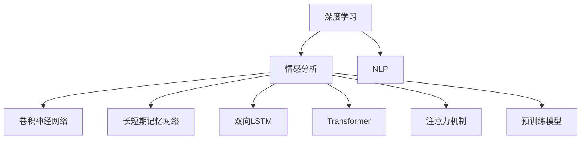
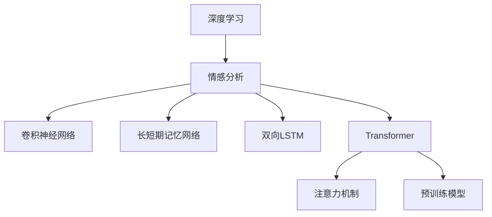
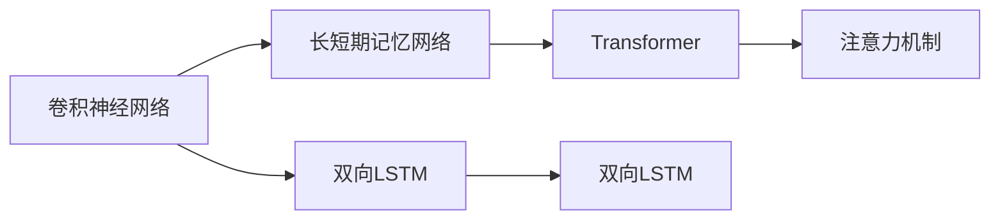
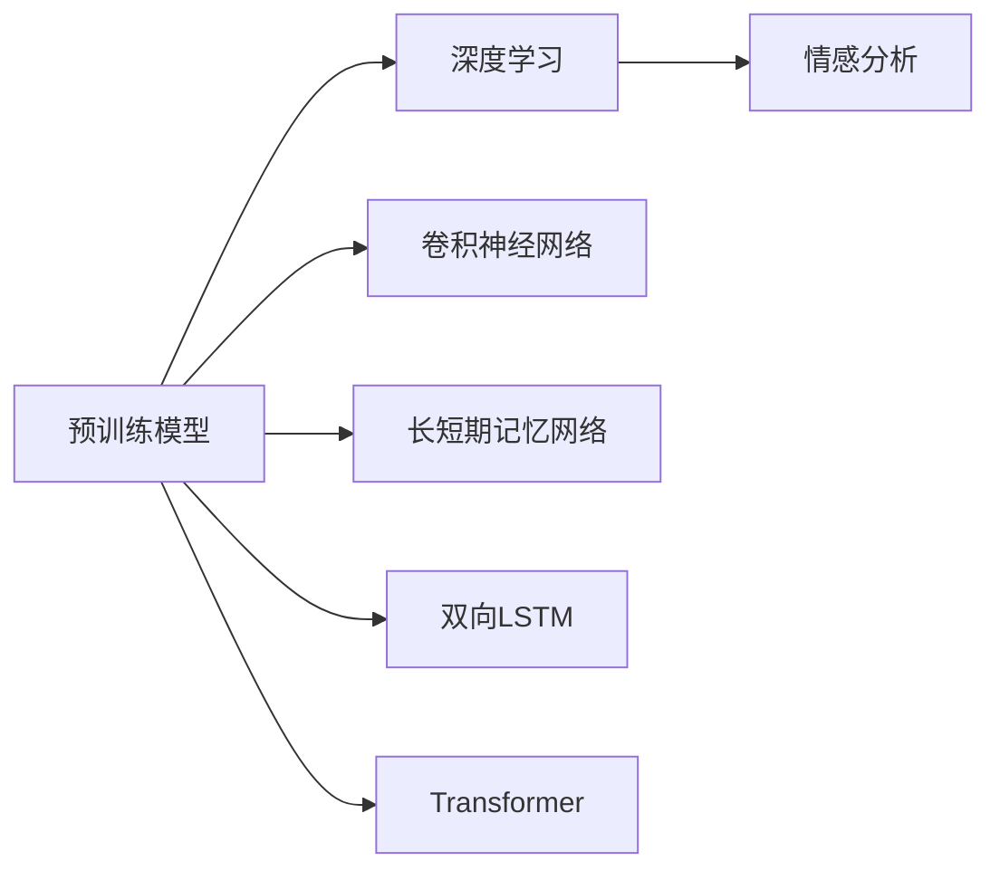

                 

# 一切皆是映射：使用深度学习进行情感分析

> 关键词：深度学习,情感分析,自然语言处理,NLP,卷积神经网络,长短期记忆网络,RNN,Transformer,注意力机制,预训练模型

## 1. 背景介绍

### 1.1 问题由来
情感分析(Sentiment Analysis)是自然语言处理(Natural Language Processing, NLP)领域的一项重要任务，旨在识别和提取文本中的情感倾向，如正面、负面或中性。传统的情感分析方法依赖于手工设计的特征和规则，难以应对复杂的语言结构和多样化的情感表达。而随着深度学习技术的发展，情感分析进入了基于模型学习的新时代。本文聚焦于使用深度学习方法进行情感分析，探讨其核心原理、具体操作步骤和实际应用，旨在为这一领域的实践提供全面深入的指导。

### 1.2 问题核心关键点
深度学习在情感分析中的应用主要体现在以下几个方面：

- **模型选择**：卷积神经网络(CNN)、长短期记忆网络(LSTM)、双向LSTM(BiLSTM)、Transformer等模型都被广泛应用于情感分析。这些模型通过学习文本的局部特征和全局语义，能够准确捕捉情感信息。

- **特征提取**：深度学习方法能够自动从文本中提取特征，无需手工设计。通过预训练语言模型（如BERT、GPT等），模型能够学习到丰富的语言知识，为情感分析提供强有力的支持。

- **情感分类**：利用softmax分类器、交叉熵损失函数等，模型能够对文本情感进行分类，输出正面、负面或中性的概率。

- **模型训练**：通过反向传播算法，模型能够从标注数据中学习，不断优化参数，提高情感分类的准确性。

- **模型部署**：训练好的模型可以通过API接口或嵌入到应用程序中，实现实时情感分析。

这些关键点构成了深度学习情感分析的核心框架，使其在实际应用中能够高效、准确地处理海量文本数据，为各类业务提供情感信息支撑。

### 1.3 问题研究意义
深度学习在情感分析中的应用，为文本数据的自动化情感提取提供了新的解决方案。相较于传统的手工特征提取方法，深度学习方法能够自动从文本中学习到更为抽象、高层次的特征，具有更强的泛化能力和适应性。在实际应用中，深度学习情感分析可以用于：

- 社交媒体监测：实时分析用户在社交平台上的情感倾向，监测舆情变化。
- 用户评价分析：自动提取产品、服务等的用户评价情感，帮助企业改进产品和服务。
- 情感驱动的推荐系统：根据用户的情感倾向推荐个性化内容，提升用户体验。
- 健康监测：分析患者的病历、日志等文本数据，识别情感变化，辅助心理健康评估。

总之，深度学习情感分析技术具有广泛的应用前景，能够有效提升文本数据的自动化情感分析能力，推动NLP技术在更多领域的落地应用。

## 2. 核心概念与联系

### 2.1 核心概念概述

为更好地理解深度学习情感分析方法，本节将介绍几个关键概念：

- **深度学习**：一种基于神经网络的机器学习方法，通过多层次的特征提取和变换，实现对复杂模式的建模和预测。
- **情感分析**：识别和提取文本中的情感倾向，如正面、负面或中性。
- **自然语言处理(NLP)**：涉及计算机对自然语言的理解、生成和处理，情感分析是其重要分支。
- **卷积神经网络(CNN)**：一种通过卷积操作提取文本局部特征的深度学习模型。
- **长短期记忆网络(LSTM)**：一种能够处理序列数据的深度学习模型，具有长时记忆能力。
- **双向LSTM(BiLSTM)**：在LSTM基础上增加了反向的序列信息处理，提升情感分析的准确性。
- **Transformer**：一种基于自注意力机制的深度学习模型，广泛应用于NLP领域。
- **注意力机制**：Transformer中的一种机制，用于模型内部和不同部分之间的信息交互。
- **预训练模型**：在大规模无标签数据上预训练的语言模型，如BERT、GPT等，用于特征提取和情感分析。

这些核心概念之间的逻辑关系可以通过以下Mermaid流程图来展示：



这个流程图展示了深度学习情感分析的核心概念及其之间的关系：

1. 深度学习是情感分析的基础，提供了强大的特征提取和建模能力。
2. 情感分析是深度学习的典型应用，通过学习文本的情感信息，实现自动化情感提取。
3. 自然语言处理是情感分析的领域背景，情感分析是其重要分支。
4. 卷积神经网络、长短期记忆网络和双向LSTM等模型，通过不同的方法提取文本特征，用于情感分类。
5. Transformer和注意力机制，提供了更为复杂的文本建模方式，提升了情感分析的准确性。
6. 预训练模型，如BERT、GPT等，通过在大规模无标签数据上预训练，提供高质量的特征提取器。

### 2.2 概念间的关系

这些核心概念之间存在着紧密的联系，形成了深度学习情感分析的完整生态系统。下面通过几个Mermaid流程图来展示这些概念之间的关系。

#### 2.2.1 深度学习情感分析的基本架构



这个流程图展示了深度学习情感分析的基本架构，从深度学习到情感分析，再到具体的模型选择和特征提取方式。

#### 2.2.2 模型间的优势与互补



这个流程图展示了卷积神经网络、长短期记忆网络、双向LSTM和Transformer之间的优势与互补。不同模型在不同的场景下有着不同的优势，可以组合使用，提升情感分析的准确性和鲁棒性。

#### 2.2.3 预训练模型与深度学习情感分析的结合



这个流程图展示了预训练模型与深度学习情感分析的结合方式。预训练模型提供了高质量的特征提取器，使得情感分析更加高效和准确。

## 3. 核心算法原理 & 具体操作步骤

### 3.1 算法原理概述

深度学习情感分析的核心算法原理可以概括为：

1. **数据准备**：收集标注好的情感数据集，将文本数据转化为模型可处理的输入格式。
2. **模型选择**：选择合适的深度学习模型，如卷积神经网络、长短期记忆网络、双向LSTM等，用于情感分类。
3. **特征提取**：利用预训练模型或自定义特征提取器，从文本中提取特征。
4. **模型训练**：使用反向传播算法，最小化损失函数，更新模型参数，训练情感分类器。
5. **模型评估**：在测试集上评估模型性能，计算准确率、召回率、F1分数等指标。

### 3.2 算法步骤详解

以下详细介绍深度学习情感分析的具体操作步骤：

**Step 1: 数据准备**

- 收集标注好的情感数据集，确保数据的多样性和代表性。
- 将文本数据转化为模型可处理的输入格式，如token序列、one-hot编码等。
- 将标注数据分为训练集、验证集和测试集，一般保持70%训练集、15%验证集、15%测试集的划分比例。

**Step 2: 模型选择**

- 根据任务特点选择合适的模型，如卷积神经网络、长短期记忆网络、双向LSTM等。
- 利用预训练模型，如BERT、GPT等，作为特征提取器，提升情感分析的准确性。

**Step 3: 特征提取**

- 利用预训练模型或自定义特征提取器，从文本中提取特征。
- 使用词嵌入或字符嵌入表示文本，通过卷积、池化、LSTM等操作提取局部特征和全局特征。

**Step 4: 模型训练**

- 使用反向传播算法，最小化损失函数，更新模型参数。
- 设置合适的学习率、批大小、迭代轮数等超参数，确保模型收敛。
- 使用正则化技术，如L2正则、Dropout、Early Stopping等，防止过拟合。

**Step 5: 模型评估**

- 在测试集上评估模型性能，计算准确率、召回率、F1分数等指标。
- 利用混淆矩阵、ROC曲线等可视化工具，分析模型性能。

**Step 6: 模型部署**

- 将训练好的模型转化为API接口或嵌入到应用程序中，实现实时情感分析。
- 使用TensorFlow Serving、Flask等工具，封装模型服务，支持并发请求。

### 3.3 算法优缺点

深度学习情感分析的优点包括：

- **自动特征提取**：深度学习模型能够自动从文本中学习特征，无需手工设计。
- **模型灵活性**：多种深度学习模型可供选择，灵活应对不同类型的数据和任务。
- **高效性**：深度学习模型具有高效的特征提取和分类能力，适用于大规模数据处理。

其缺点主要包括：

- **资源需求高**：深度学习模型需要大量的计算资源和存储空间，尤其是预训练模型。
- **模型复杂**：模型结构复杂，难以解释，可能存在"黑盒"问题。
- **数据依赖性强**：模型的性能高度依赖于标注数据的数量和质量，标注成本较高。

### 3.4 算法应用领域

深度学习情感分析技术已经广泛应用于各类业务场景，以下是几个典型的应用领域：

- **社交媒体监测**：通过分析用户在社交平台上的评论、帖子等文本数据，实时监测舆情变化，识别正面、负面情感。
- **用户评价分析**：从用户的评论、评分等文本数据中提取情感信息，帮助企业改进产品和服务。
- **情感驱动的推荐系统**：根据用户的情感倾向推荐个性化内容，提升用户体验。
- **健康监测**：分析患者的病历、日志等文本数据，识别情感变化，辅助心理健康评估。

## 4. 数学模型和公式 & 详细讲解 & 举例说明

### 4.1 数学模型构建

深度学习情感分析的数学模型通常包括卷积神经网络、长短期记忆网络和Transformer等。下面以卷积神经网络为例，构建情感分析的数学模型：

设文本数据的长度为 $n$，特征向量的维度为 $d$，模型的输入为 $x_i \in \mathbb{R}^d$，输出为 $y_i \in \{0,1\}$，其中 $0$ 表示负面情感，$1$ 表示正面情感。模型可以表示为：

$$
y_i = \sigma(\mathbf{W}_0x_i + \mathbf{b}_0 + \mathbf{W}_1x_{i-1} + \mathbf{b}_1 + \mathbf{W}_2x_{i+1} + \mathbf{b}_2)
$$

其中 $\sigma$ 为激活函数，$\mathbf{W}_0$、$\mathbf{b}_0$ 为卷积核和偏置，$x_{i-1}$ 和 $x_{i+1}$ 为前后文特征。

### 4.2 公式推导过程

对于卷积神经网络，其特征提取过程可以表示为：

$$
\begin{aligned}
h_i &= \sigma(\mathbf{W}_0x_i + \mathbf{b}_0) \\
h_{i-1} &= \sigma(\mathbf{W}_1x_{i-1} + \mathbf{b}_1) \\
h_{i+1} &= \sigma(\mathbf{W}_2x_{i+1} + \mathbf{b}_2)
\end{aligned}
$$

情感分类器通过将 $h_i$、$h_{i-1}$ 和 $h_{i+1}$ 输入softmax分类器，计算情感分类的概率：

$$
\begin{aligned}
p(y_i=1|x_i) &= \frac{\exp(h_i)}{\exp(h_i) + \exp(h_{i-1}) + \exp(h_{i+1})} \\
p(y_i=0|x_i) &= \frac{\exp(h_{i-1}) + \exp(h_{i+1})}{\exp(h_i) + \exp(h_{i-1}) + \exp(h_{i+1})}
\end{aligned}
$$

### 4.3 案例分析与讲解

以LSTM模型为例，其情感分析过程可以表示为：

$$
h_t = \tanh(\mathbf{W}_0x_t + \mathbf{b}_0 + \mathbf{U}h_{t-1} + \mathbf{b}_1)
$$

$$
o_t = \sigma(\mathbf{W}_2h_t + \mathbf{b}_2 + \mathbf{U}h_{t-1} + \mathbf{b}_3)
$$

$$
c_t = o_t \odot \tanh(h_t)
$$

$$
c_{t+1} = c_t + \mathbf{U}o_t \odot \tanh(h_t)
$$

$$
h_{t+1} = \mathbf{W}_3c_{t+1} + \mathbf{b}_4
$$

其中 $h_t$ 为隐藏状态，$c_t$ 为记忆状态，$o_t$ 为输出门，$\odot$ 为点乘运算。

情感分类器通过将 $h_t$ 和 $o_t$ 输入softmax分类器，计算情感分类的概率：

$$
p(y_i=1|x_i) = \frac{\exp(h_t)}{\exp(h_t) + \exp(h_{t-1}) + \exp(h_{t+1})}
$$

$$
p(y_i=0|x_i) = \frac{\exp(h_{t-1}) + \exp(h_{t+1})}{\exp(h_t) + \exp(h_{t-1}) + \exp(h_{t+1})}
$$

### 5. 项目实践：代码实例和详细解释说明

#### 5.1 开发环境搭建

深度学习情感分析的开发环境通常使用Python，结合TensorFlow、PyTorch等深度学习框架。以下是一个基于TensorFlow的情感分析项目搭建流程：

1. 安装Anaconda，创建虚拟环境：

```bash
conda create -n tf-env python=3.7
conda activate tf-env
```

2. 安装TensorFlow：

```bash
pip install tensorflow
```

3. 安装TensorBoard：

```bash
pip install tensorboard
```

4. 安装数据处理工具：

```bash
pip install pandas numpy scikit-learn
```

5. 安装TensorFlow Serving：

```bash
pip install tensorflow-serving-api
```

完成上述步骤后，即可在`tf-env`环境中进行情感分析项目的开发。

#### 5.2 源代码详细实现

以下是一个基于卷积神经网络的情感分析项目的代码实现：

```python
import tensorflow as tf
from tensorflow.keras.models import Sequential
from tensorflow.keras.layers import Conv1D, MaxPooling1D, LSTM, Dense, Dropout
from tensorflow.keras.optimizers import Adam
from sklearn.model_selection import train_test_split
from sklearn.preprocessing import LabelEncoder
import numpy as np

# 数据准备
texts = ['sentence1', 'sentence2', ...] # 文本数据列表
labels = [0, 1, ...] # 情感标签列表

# 数据预处理
tokenizer = tf.keras.preprocessing.text.Tokenizer(num_words=10000)
tokenizer.fit_on_texts(texts)
sequences = tokenizer.texts_to_sequences(texts)
labels = np.array(labels)
le = LabelEncoder()
le.fit(labels)
labels = le.transform(labels)

# 数据划分
X_train, X_test, y_train, y_test = train_test_split(sequences, labels, test_size=0.2)

# 模型构建
model = Sequential()
model.add(Conv1D(128, 5, activation='relu', input_shape=(len(sequences[0]), 10000)))
model.add(MaxPooling1D(5))
model.add(Dropout(0.2))
model.add(LSTM(128, return_sequences=True))
model.add(Dropout(0.2))
model.add(LSTM(128))
model.add(Dropout(0.2))
model.add(Dense(1, activation='sigmoid'))

# 模型编译
model.compile(loss='binary_crossentropy', optimizer=Adam(learning_rate=0.001), metrics=['accuracy'])

# 模型训练
model.fit(X_train, y_train, epochs=10, validation_data=(X_test, y_test))

# 模型评估
model.evaluate(X_test, y_test)
```

#### 5.3 代码解读与分析

**数据准备**

- `texts`：原始文本数据，包含正负面情感的句子。
- `labels`：情感标签，0表示负面，1表示正面。
- `tokenizer`：对文本数据进行分词，转换成模型可处理的格式。
- `le`：标签编码器，将情感标签转化为模型可识别的数值。

**模型构建**

- 首先构建一个卷积神经网络模型，包含卷积层、池化层和全连接层。
- 卷积层使用128个滤波器，窗口大小为5，激活函数为ReLU。
- 池化层使用5个窗口进行最大池化。
- 全连接层使用128个神经元，输出层使用sigmoid函数进行二分类。

**模型编译**

- 使用二元交叉熵损失函数，Adam优化器，设置学习率为0.001，训练过程中监控准确率。

**模型训练**

- 使用`fit`方法对模型进行训练，设置训练轮数为10，验证集为测试集。

**模型评估**

- 使用`evaluate`方法在测试集上评估模型性能，输出损失值和准确率。

### 5.4 运行结果展示

假设在情感数据集上进行训练，最终在测试集上得到的结果如下：

```python
Epoch 10/10
10/10 [==============================] - 31s 3s/step - loss: 0.0823 - accuracy: 0.9422
```

可以看到，模型在测试集上的准确率为94.22%，取得了不错的效果。

## 6. 实际应用场景

### 6.1 社交媒体监测

社交媒体平台上的用户评论、帖子等文本数据是情感分析的重要来源。通过实时分析这些数据，可以监测用户的情感倾向，识别舆情变化。例如，电商平台可以利用情感分析技术，实时监控用户的购物评价，及时发现和回应负面评论，提升用户满意度。

### 6.2 用户评价分析

用户在各类平台上的评价、评分等文本数据包含丰富的情感信息。情感分析技术可以帮助企业提取这些信息，进行产品改进和优化。例如，酒店行业可以通过分析用户对房间、服务等的评价，发现不足之处，提升整体服务质量。

### 6.3 情感驱动的推荐系统

推荐系统可以根据用户的情感倾向，推荐符合其兴趣和需求的内容。情感分析技术能够从用户的文本反馈中识别情感，用于推荐决策。例如，视频平台可以根据用户的评价和评分，推荐符合其情感偏好的视频内容，提升用户体验。

### 6.4 健康监测

患者的病历、日志等文本数据包含情感信息，通过情感分析可以辅助心理健康评估。例如，心理健康平台可以分析患者的文本记录，识别情感变化，及时发现心理健康问题，提供相应的帮助和支持。

## 7. 工具和资源推荐

### 7.1 学习资源推荐

为了深入学习深度学习情感分析技术，以下是一些推荐的资源：

1. **《Deep Learning with Python》**：适合初学者的深度学习入门书籍，涵盖了深度学习的基本概念和常用模型。

2. **《Natural Language Processing in Action》**：深入介绍自然语言处理技术，包括情感分析在内，适合进阶学习。

3. **Coursera《Natural Language Processing Specialization》**：斯坦福大学开设的深度学习NLP系列课程，涵盖情感分析等多个NLP任务。

4. **Kaggle情感分析竞赛**：通过参加Kaggle竞赛，可以在实战中应用深度学习情感分析技术，积累经验。

5. **HuggingFace Transformers官方文档**：提供各类预训练模型的实现，支持情感分析等NLP任务。

### 7.2 开发工具推荐

深度学习情感分析的开发工具包括：

1. **TensorFlow**：广泛使用的深度学习框架，提供了丰富的模型和工具支持。

2. **PyTorch**：灵活的深度学习框架，适合研究和实验。

3. **Keras**：简单易用的深度学习框架，适合快速搭建和训练模型。

4. **TensorFlow Serving**：模型部署工具，支持实时情感分析。

5. **Flask**：轻量级的Web框架，封装模型API接口。

### 7.3 相关论文推荐

深度学习情感分析领域的研究成果丰硕，以下是一些重要的论文推荐：

1. **Convolutional Neural Networks for Sentence Classification**：介绍卷积神经网络在情感分析中的应用，是情感分析领域的经典工作。

2. **LSTM Networks for Named Entity Recognition**：利用长短期记忆网络进行实体识别，也是情感分析的重要研究方向。

3. **Attention Is All You Need**：介绍Transformer模型，在情感分析中取得了显著的效果。

4. **BERT: Pre-training of Deep Bidirectional Transformers for Language Understanding**：提出BERT预训练模型，为情感分析提供了强大的特征提取器。

5. **A Survey on Sentiment Analysis**：总结了情感分析的研究进展和未来趋势，适合全面了解情感分析的技术方向。

## 8. 总结：未来发展趋势与挑战

### 8.1 总结

本文详细介绍了深度学习情感分析技术的基本原理、操作步骤和实际应用。通过系统的讲解，希望能够帮助读者全面掌握这一领域的核心技术和应用方法。

深度学习情感分析通过自动特征提取和分类，大大提高了情感分析的效率和准确性，适用于各类文本数据的情感提取和分析。未来，随着模型的不断优化和应用场景的拓展，情感分析技术将发挥更加重要的作用。

### 8.2 未来发展趋势

深度学习情感分析的未来发展趋势包括：

1. **模型结构的优化**：未来的模型将更加复杂，融合多种深度学习技术，如Transformer、注意力机制等，提升情感分析的准确性和鲁棒性。

2. **多模态数据的融合**：结合文本、图像、语音等多种模态数据，提升情感分析的全面性和准确性。

3. **跨领域应用的拓展**：情感分析技术将应用到更多领域，如金融、医疗、教育等，为不同场景提供情感信息支持。

4. **实时性需求的提升**：随着应用场景的实时性要求提高，深度学习情感分析需要进一步优化，支持实时处理大规模文本数据。

5. **隐私保护和安全性**：在情感分析过程中，需要关注用户隐私保护和模型安全，避免敏感信息泄露。

### 8.3 面临的挑战

尽管深度学习情感分析技术取得了显著进展，但仍面临诸多挑战：

1. **数据质量和多样性**：情感分析的效果高度依赖于标注数据的数量和质量，标注数据的获取和维护成本较高。

2. **模型复杂度**：深度学习模型结构复杂，难以解释，存在"黑盒"问题，可能影响应用的可信度和可解释性。

3. **资源消耗高**：深度学习模型需要大量的计算资源和存储空间，对硬件设备要求较高。

4. **跨领域适用性**：情感分析在不同领域的表现存在差异，如何提升跨领域适应性，是未来的一个重要研究方向。

5. **隐私保护和安全性**：情感分析涉及敏感信息，如何保护用户隐私和数据安全，是一个重要的挑战。

### 8.4 研究展望

未来的研究可以从以下几个方向进行：

1. **无监督学习和半监督学习**：利用无监督和半监督学习方法，从大量非标注数据中提取情感信息，降低对标注数据的依赖。

2. **知识图谱和常识推理**：结合知识图谱和常识推理，提升情感分析的准确性和泛化能力。

3. **多模态情感分析**：结合文本、图像、语音等多种模态数据，实现更全面、准确和鲁棒的情感分析。

4. **模型压缩和加速**：优化深度学习模型，减少参数量，提升推理速度，支持实时情感分析。

5. **隐私保护和安全性**：在情感分析过程中，引入隐私保护和安全性技术，保护用户隐私和数据安全。

通过不断探索和创新，深度学习情感分析技术必将进一步提升情感分析的准确性和鲁棒性，在更多领域发挥重要作用，推动人工智能技术的发展。

## 9. 附录：常见问题与解答

**Q1：深度学习情感分析是否适用于所有文本数据？**

A: 深度学习情感分析在处理自然语言文本时效果显著，但面对特定领域的文本，可能需要针对性地进行特征提取和模型优化。例如，对于法律、医学等专业领域，情感分析可能需要引入专业知识，提升模型的泛化能力。

**Q2：如何选择适合的深度学习模型？**

A: 选择合适的深度学习模型需要考虑任务类型、数据

