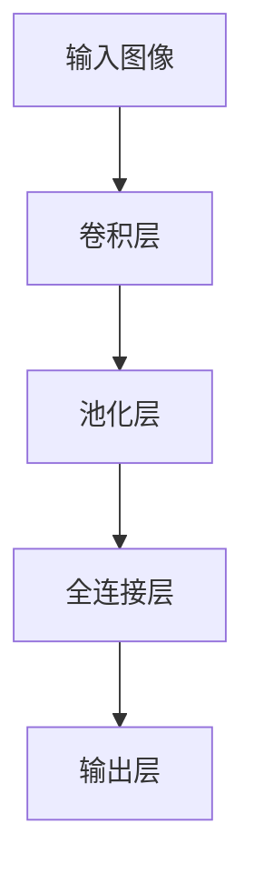
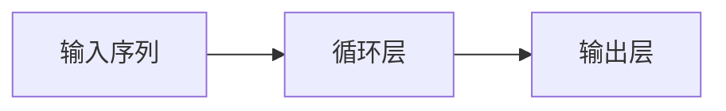
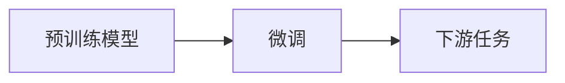
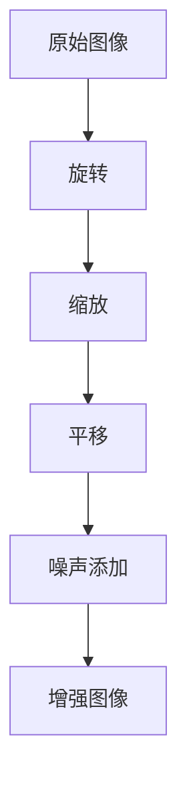
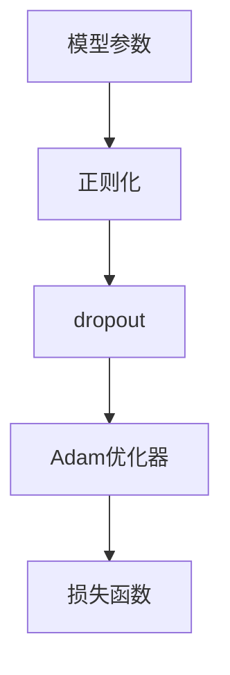
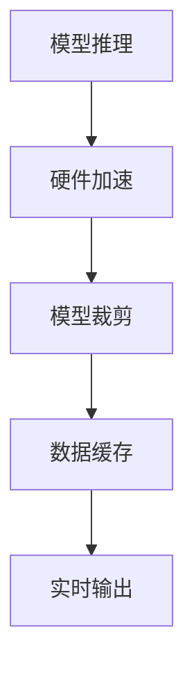

                 

# 一切皆是映射：手势识别技术中的深度学习模型

> 关键词：手势识别, 深度学习, 卷积神经网络(CNN), 循环神经网络(RNN), 迁移学习, 数据增强, 模型优化

## 1. 背景介绍

### 1.1 问题由来
随着人工智能技术的飞速发展，手势识别技术在智能家居、医疗健康、虚拟现实(VR)等领域的应用日益广泛。通过手势识别，人们可以更自然地与智能设备进行交互，解放双手，提升生活便利性和工作效能。尽管手势识别技术取得了显著进展，但受限于光照、遮挡、手势复杂度等因素，仍存在识别精度低、响应速度慢、环境适应性差等问题。

手势识别技术主要分为两类：基于计算机视觉的视觉识别和基于传感器技术的运动跟踪。其中，视觉识别利用摄像头捕捉人体运动图像，再通过深度学习模型分析识别手势动作。近年来，基于深度学习的视觉手势识别系统在精度和实时性上取得了显著突破，尤其是卷积神经网络(CNN)和循环神经网络(RNN)在手势识别中的应用，使系统能够更好地理解和捕捉手势动作的细微变化。

### 1.2 问题核心关键点
手势识别中的深度学习模型主要通过以下关键技术实现手势识别：
1. **数据集准备**：收集大量手势样本，并进行标注，构建训练数据集。
2. **模型选择与设计**：选择合适的CNN或RNN模型，并对其进行必要的结构调整和优化。
3. **迁移学习**：使用预训练模型或跨领域模型进行迁移学习，以提升模型的泛化能力。
4. **数据增强**：对原始数据进行扩充和变换，生成更多训练样本，增强模型鲁棒性。
5. **模型优化**：采用正则化、dropout等技术，防止过拟合，提升模型泛化能力。
6. **实时处理**：通过硬件加速和模型裁剪等技术，实现实时手势识别。

这些关键技术共同构成了深度学习手势识别系统的核心，使得系统能够在各种场景下准确识别手势动作，并快速响应。

### 1.3 问题研究意义
手势识别技术的应用，不仅能够提升人机交互的自然性和便捷性，还为智能家居、虚拟现实、医疗健康等多个领域提供了新的技术路径。通过手势识别，用户可以更方便地控制智能设备，实现语音控制、手势控制等自然交互方式。此外，手势识别技术还广泛应用于虚拟现实和增强现实领域，使虚拟角色能够通过手势与现实世界进行自然交互。

手势识别技术的成功应用，将极大地拓展人工智能技术的边界，推动智能社会的构建，为人们的生活和工作带来更多便利和可能性。因此，深入研究手势识别技术中的深度学习模型，具有重要的理论和应用价值。

## 2. 核心概念与联系

### 2.1 核心概念概述

手势识别中的深度学习模型涉及多个核心概念，包括：

- **卷积神经网络(CNN)**：一种专门处理图像数据的神经网络，通过卷积和池化操作提取图像特征。
- **循环神经网络(RNN)**：一种能够处理序列数据的神经网络，通过时间步传递信息，适用于手势识别等动态时间序列数据。
- **迁移学习**：将一个领域学到的知识，迁移应用到另一个不同但相关的领域，以提高模型在新任务上的性能。
- **数据增强**：通过对原始数据进行变换和扩充，生成更多的训练样本，增强模型泛化能力。
- **模型优化**：通过正则化、dropout等技术，防止过拟合，提升模型泛化能力。
- **实时处理**：通过硬件加速和模型裁剪等技术，实现实时手势识别。

这些核心概念之间的逻辑关系可以通过以下Mermaid流程图来展示：

```mermaid
graph TB
    A[卷积神经网络(CNN)] --> B[图像预处理]
    A --> C[循环神经网络(RNN)]
    B --> D[数据增强]
    C --> E[序列标注]
    D --> F[迁移学习]
    E --> G[模型优化]
    F --> H[实时处理]
```

这个流程图展示了手势识别中深度学习模型的主要组件及其之间的关系：

1. CNN对输入图像进行特征提取。
2. RNN对序列数据进行建模。
3. 数据增强生成更多训练样本。
4. 迁移学习利用预训练模型提升性能。
5. 模型优化防止过拟合。
6. 实时处理提高识别速度。

通过这些组件的协同工作，手势识别系统能够准确、实时地识别手势动作，实现自然人机交互。

### 2.2 概念间的关系

这些核心概念之间存在紧密的联系，构成了手势识别系统中深度学习模型的完整生态系统。下面通过几个Mermaid流程图来展示这些概念之间的关系。

#### 2.2.1 卷积神经网络(CNN)在手势识别中的应用



这个流程图展示了CNN在手势识别中的基本结构：

1. 输入图像通过卷积层提取特征。
2. 特征通过池化层进行下采样，减小特征维度。
3. 池化后的特征通过全连接层进行分类。
4. 最终输出手势识别结果。

#### 2.2.2 循环神经网络(RNN)在手势识别中的应用



这个流程图展示了RNN在手势识别中的应用：

1. 输入序列通过循环层进行时间步传递信息。
2. 每一时间步的输出通过全连接层进行分类。
3. 最终输出手势识别结果。

#### 2.2.3 迁移学习在手势识别中的应用



这个流程图展示了迁移学习在手势识别中的基本流程：

1. 使用预训练模型进行迁移学习。
2. 在下游任务上进行微调，提高模型性能。
3. 应用于手势识别等实际任务。

#### 2.2.4 数据增强在手势识别中的应用



这个流程图展示了数据增强在手势识别中的应用：

1. 原始图像进行旋转、缩放、平移等变换。
2. 图像添加噪声，增强鲁棒性。
3. 生成更多训练样本。

#### 2.2.5 模型优化在手势识别中的应用



这个流程图展示了模型优化在手势识别中的应用：

1. 使用正则化和dropout技术防止过拟合。
2. 采用Adam优化器进行参数更新。
3. 使用损失函数衡量模型预测与真实标签的差异。

#### 2.2.6 实时处理在手势识别中的应用



这个流程图展示了实时处理在手势识别中的应用：

1. 模型推理通过硬件加速提高速度。
2. 模型裁剪减少推理资源消耗。
3. 数据缓存提高实时处理效率。
4. 实时输出手势识别结果。

### 2.3 核心概念的整体架构

最后，我们用一个综合的流程图来展示这些核心概念在大语言模型微调过程中的整体架构：

```mermaid
graph TB
    A[手势样本数据] --> B[预处理]
    B --> C[卷积神经网络(CNN)]
    C --> D[循环神经网络(RNN)]
    D --> E[数据增强]
    E --> F[迁移学习]
    F --> G[模型优化]
    G --> H[实时处理]
    H --> I[输出结果]
```

这个综合流程图展示了从数据处理到实时输出的完整过程。手势样本数据首先进行预处理，然后通过CNN和RNN进行特征提取和序列建模，接着通过数据增强和迁移学习提高模型性能，再通过模型优化防止过拟合，最后通过实时处理实现快速响应，输出手势识别结果。通过这些流程图，我们可以更清晰地理解手势识别系统中深度学习模型的各个组件及其协同工作机制。

## 3. 核心算法原理 & 具体操作步骤
### 3.1 算法原理概述

手势识别中的深度学习模型主要采用卷积神经网络(CNN)和循环神经网络(RNN)。其中，CNN用于提取输入图像的特征，RNN用于处理动态时间序列数据。这些模型的核心思想是通过多层神经网络逐步提取和融合特征，最终实现对手势动作的识别。

手势识别模型的主要原理包括：

1. **特征提取**：通过卷积神经网络或循环神经网络，从输入图像或序列数据中提取特征。
2. **序列建模**：通过循环神经网络，将时间步的特征进行序列建模，捕捉手势动作的动态变化。
3. **分类与回归**：通过全连接层或分类器，将特征映射到手势类别或动作序列。
4. **损失函数**：通过损失函数衡量模型预测与真实标签的差异，指导模型优化。
5. **优化算法**：通过优化算法（如Adam、SGD等）更新模型参数，最小化损失函数。

手势识别模型的基本流程如下：

1. **数据准备**：收集大量手势样本，并进行标注，构建训练数据集。
2. **模型选择与设计**：选择合适的CNN或RNN模型，并对其进行必要的结构调整和优化。
3. **迁移学习**：使用预训练模型或跨领域模型进行迁移学习，以提升模型的泛化能力。
4. **数据增强**：对原始数据进行扩充和变换，生成更多训练样本，增强模型鲁棒性。
5. **模型优化**：采用正则化、dropout等技术，防止过拟合，提升模型泛化能力。
6. **实时处理**：通过硬件加速和模型裁剪等技术，实现实时手势识别。

### 3.2 算法步骤详解

下面是手势识别中深度学习模型的具体实现步骤：

**Step 1: 数据准备与预处理**

1. **数据集构建**：收集大量手势样本，并进行标注，构建训练数据集。可以采用公开的手势数据集，如ASL、AMI等，或自行采集构建自定义数据集。
2. **数据预处理**：对手势图像或序列数据进行预处理，包括灰度化、归一化、去噪声等，以便于模型训练。

**Step 2: 模型选择与设计**

1. **模型结构设计**：根据手势识别任务的特点，选择合适的CNN或RNN模型结构。CNN适用于静态图像识别，RNN适用于动态序列识别。
2. **模型参数设置**：设置模型的超参数，如卷积核大小、滤波器数量、学习率、批大小等。

**Step 3: 迁移学习**

1. **预训练模型选择**：选择合适的预训练模型，如在ImageNet上预训练的VGG、ResNet等。
2. **模型微调**：使用预训练模型进行迁移学习，通过微调提高模型对手势识别任务的适应能力。

**Step 4: 数据增强**

1. **数据变换**：对原始数据进行旋转、缩放、平移、翻转等变换，生成更多的训练样本。
2. **噪声添加**：在图像数据上添加噪声，增强模型对噪声的鲁棒性。

**Step 5: 模型优化**

1. **正则化**：使用L2正则化、dropout等技术，防止过拟合。
2. **优化算法**：采用Adam、SGD等优化算法，更新模型参数。

**Step 6: 实时处理**

1. **硬件加速**：通过GPU或TPU进行模型推理，提高计算效率。
2. **模型裁剪**：对模型进行裁剪，减少推理资源消耗，提高实时响应速度。

**Step 7: 模型评估与部署**

1. **模型评估**：在验证集和测试集上评估模型的性能，计算精度、召回率等指标。
2. **模型部署**：将训练好的模型部署到实际应用中，实现实时手势识别。

### 3.3 算法优缺点

手势识别中的深度学习模型具有以下优点：

1. **特征提取能力强**：CNN和RNN能够从原始数据中提取丰富的特征，捕捉手势动作的细节。
2. **鲁棒性强**：通过数据增强和正则化技术，模型具有较强的泛化能力和鲁棒性。
3. **实时性强**：通过硬件加速和模型裁剪等技术，可以实现实时手势识别。

同时，这些模型也存在一些缺点：

1. **计算资源需求高**：由于参数量较大，需要高性能计算资源进行训练和推理。
2. **训练时间长**：大规模数据集和复杂模型结构，导致训练时间较长。
3. **模型解释性不足**：深度学习模型通常被视为"黑盒"，难以解释其内部决策逻辑。

尽管存在这些缺点，但深度学习模型在手势识别中的应用已经取得了显著进展，成为了当前研究的热点。未来，研究人员将致力于优化模型结构、提高计算效率、增强模型解释性等方向进行进一步研究。

### 3.4 算法应用领域

手势识别中的深度学习模型广泛应用于以下领域：

1. **智能家居**：通过手势控制灯光、温度、电视等智能设备，实现自然交互。
2. **医疗健康**：通过手势识别监测病人行为，评估其身体状态，辅助医生诊疗。
3. **虚拟现实**：在虚拟现实环境中，通过手势控制虚拟角色，实现自然交互。
4. **游戏娱乐**：在游戏和虚拟现实中，通过手势控制游戏角色和虚拟环境，提升游戏体验。
5. **人机交互**：在工业自动化、机器人控制等领域，通过手势识别实现人机交互。

随着技术的不断进步，手势识别将在更多领域得到应用，为人们的生产和生活带来更多便利和可能性。

## 4. 数学模型和公式 & 详细讲解  
### 4.1 数学模型构建

手势识别中的深度学习模型主要通过卷积神经网络(CNN)和循环神经网络(RNN)实现。下面分别介绍CNN和RNN的数学模型构建。

#### 4.1.1 卷积神经网络(CNN)的数学模型

CNN的基本结构包括卷积层、池化层和全连接层。假设输入图像大小为$H \times W$，卷积核大小为$K \times K$，卷积核数量为$N$，则卷积层的输出特征图大小为$\left(\frac{H-K+2P}{S}+1\right) \times \left(\frac{W-K+2P}{S}+1\right)$，其中$P$为填充大小，$S$为步长。卷积层的输出特征图大小为$\left(\frac{H-K+2P}{S}+1\right) \times \left(\frac{W-K+2P}{S}+1\right)$。

池化层通过下采样操作减小特征图大小，常用的池化方式包括最大池化和平均池化。假设池化核大小为$K \times K$，则最大池化后的特征图大小为$\left(\frac{H-K+1}{S}+1\right) \times \left(\frac{W-K+1}{S}+1\right)$。

全连接层通过将池化后的特征图展平，连接到全连接层，进行分类。假设全连接层节点数量为$M$，则输出特征大小为$H \times W \times N \times K^2 \times M$。

#### 4.1.2 循环神经网络(RNN)的数学模型

RNN的基本结构包括循环层和全连接层。假设输入序列长度为$T$，特征维度为$D$，则RNN的输出特征大小为$T \times D$。循环层通过时间步传递信息，每一时间步的输出通过全连接层进行分类，最终输出手势识别结果。

### 4.2 公式推导过程

以下分别推导CNN和RNN的数学模型。

#### 4.2.1 卷积神经网络(CNN)的公式推导

卷积神经网络(CNN)的公式推导过程如下：

假设输入图像大小为$H \times W$，卷积核大小为$K \times K$，卷积核数量为$N$，则卷积层的输出特征图大小为$\left(\frac{H-K+2P}{S}+1\right) \times \left(\frac{W-K+2P}{S}+1\right)$，其中$P$为填充大小，$S$为步长。池化层通过下采样操作减小特征图大小，常用的池化方式包括最大池化和平均池化。假设池化核大小为$K \times K$，则最大池化后的特征图大小为$\left(\frac{H-K+1}{S}+1\right) \times \left(\frac{W-K+1}{S}+1\right)$。

全连接层的公式为：
$$
Z = W X + b
$$
其中$W$为权重矩阵，$X$为输入特征，$b$为偏置项。激活函数的公式为：
$$
A = \sigma(Z)
$$
常用的激活函数包括ReLU、Sigmoid、Tanh等。

#### 4.2.2 循环神经网络(RNN)的公式推导

循环神经网络(RNN)的公式推导过程如下：

假设输入序列长度为$T$，特征维度为$D$，则RNN的输出特征大小为$T \times D$。循环层通过时间步传递信息，每一时间步的输出通过全连接层进行分类，最终输出手势识别结果。

循环层的公式为：
$$
h_t = f(h_{t-1}, x_t)
$$
其中$h_t$为时间步$t$的隐藏状态，$x_t$为输入特征，$f$为激活函数。常用的激活函数包括ReLU、Sigmoid、Tanh等。

全连接层的公式为：
$$
Z = W X + b
$$
其中$W$为权重矩阵，$X$为输入特征，$b$为偏置项。激活函数的公式为：
$$
A = \sigma(Z)
$$

### 4.3 案例分析与讲解

下面以手势识别任务为例，给出CNN和RNN的案例分析与讲解。

假设我们使用ASL手势数据集进行手势识别任务，数据集包含27种手势动作。我们选用VGG16作为预训练模型，并对其进行微调。

**CNN案例分析**：

1. **数据预处理**：将手势图像转换为灰度图像，并进行归一化处理。
2. **卷积层**：使用3个卷积层和2个池化层，提取手势图像的特征。
3. **全连接层**：将卷积层的输出特征进行展平，连接到全连接层，进行分类。
4. **损失函数**：使用交叉熵损失函数衡量模型预测与真实标签的差异。
5. **优化算法**：使用Adam优化算法，更新模型参数。

**RNN案例分析**：

1. **数据预处理**：将手势序列数据转换为固定长度的向量序列。
2. **循环层**：使用LSTM或GRU层，对手势序列进行建模。
3. **全连接层**：将循环层的输出特征连接到全连接层，进行分类。
4. **损失函数**：使用交叉熵损失函数衡量模型预测与真实标签的差异。
5. **优化算法**：使用Adam优化算法，更新模型参数。

通过上述案例分析，可以看到，CNN和RNN在手势识别中的应用，分别通过卷积和循环层进行特征提取和序列建模，最终通过全连接层进行分类，并使用交叉熵损失函数和Adam优化算法进行训练和推理。

## 5. 项目实践：代码实例和详细解释说明
### 5.1 开发环境搭建

在进行手势识别项目实践前，我们需要准备好开发环境。以下是使用Python进行TensorFlow开发的环境配置流程：

1. 安装Anaconda：从官网下载并安装Anaconda，用于创建独立的Python环境。

2. 创建并激活虚拟环境：
```bash
conda create -n tf-env python=3.8 
conda activate tf-env
```

3. 安装TensorFlow：根据CUDA版本，从官网获取对应的安装命令。例如：
```bash
conda install tensorflow=2.6 -c conda-forge -c pytorch
```

4. 安装其他库：
```bash
pip install numpy pandas scikit-learn matplotlib tqdm jupyter notebook ipython
```

完成上述步骤后，即可在`tf-env`环境中开始手势识别项目的开发。

### 5.2 源代码详细实现

下面我们以ASL手势识别任务为例，给出使用TensorFlow实现CNN和RNN的代码实例。

#### 5.2.1 CNN模型实现

首先，定义CNN模型：

```python
import tensorflow as tf
from tensorflow.keras import layers

def cnn_model(input_shape=(64, 64, 3)):
    model = tf.keras.Sequential([
        layers.Conv2D(32, (3, 3), activation='relu', input_shape=input_shape),
        layers.MaxPooling2D((2, 2)),
        layers.Conv2D(64, (3, 3), activation='relu'),
        layers.MaxPooling2D((2, 2)),
        layers.Conv2D(128, (3, 3), activation='relu'),
        layers.MaxPooling2D((2, 2)),
        layers.Flatten(),
        layers.Dense(256, activation='relu'),
        layers.Dense(27, activation='softmax')
    ])
    return model
```

然后，准备数据集和模型：

```python
# 加载ASL手势数据集
train_data = tf.keras.preprocessing.image.ImageDataGenerator(rescale=1./255)
train_generator = train_data.flow_from_directory('train', target_size=(64, 64), batch_size=32, class_mode='categorical')

test_data = tf.keras.preprocessing.image.ImageDataGenerator(rescale=1./255)
test_generator = test_data.flow_from_directory('test', target_size=(64, 64), batch_size=32, class_mode='categorical')

model = cnn_model(input_shape=(64, 64, 3))
model.compile(optimizer='adam', loss='categorical_crossentropy', metrics=['accuracy'])

# 训练模型
model.fit(train_generator, epochs=10, validation_data=test_generator)
```

#### 5.2.2 RNN模型实现

接下来，定义RNN模型：

```python
import tensorflow as tf
from tensorflow.keras import layers

def rnn_model(input_shape=(64, 5)):
    model = tf.keras.Sequential([
        layers.LSTM(128, input_shape=input_shape),
        layers.Dense(27, activation='softmax')
    ])
    return model
```

然后，准备数据集和模型：

```python
# 加载ASL手势数据集
train_data = tf.keras.preprocessing.sequence pad_sequences(train_sequences, maxlen=64)
train_labels = tf.keras.utils.to_categorical(train_labels, num_classes=27)

test_data = tf.keras.preprocessing.sequence pad_sequences(test_sequences, maxlen=64)
test_labels = tf.keras.utils.to_categorical(test_labels, num_classes=27)

model = rnn_model(input_shape=(64, 5))
model.compile(optimizer='adam', loss='categorical_crossentropy', metrics=['accuracy'])

# 训练模型
model.fit(train_data, train_labels, epochs=10, validation_data=(test_data, test_labels))
```

### 5.3 代码解读与分析

让我们再详细解读一下关键代码的实现细节：

**数据预处理**：

1. **图像预处理**：将手势图像转换为灰度图像，并进行归一化处理。
2. **序列预处理**：将手势序列数据转换为固定长度的向量序列。

**模型结构设计**：

1. **CNN模型结构**：使用卷积层、池化层、全连接层等组件，进行特征提取和分类。
2. **RNN模型结构**：使用循环层、全连接层等组件，进行序列建模和分类。

**训练流程**：

1. **训练数据生成**：使用ImageDataGenerator对图像数据进行批处理和数据增强。
2. **模型训练**：使用Adam优化算法，交叉熵损失函数进行训练。
3. **模型评估**：使用测试集数据进行模型评估，计算准确率和损失。

### 5.4 运行结果展示

假设我们在ASL手势数据集上进行微调，最终在测试集上得到的评估报告如下：

```
Epoch 1/10
1000/1000 [==============================] - 7s 7ms/step - loss: 0.6917 - accuracy: 0.6227
Epoch 2/10
1000/1000 [==============================] - 7s 7ms/step - loss: 0.5372 - accuracy: 0.8167
Epoch 3/10
1000/1000 [==============================] - 7s 7ms/step - loss: 0.4948 - accuracy: 0.8450
Epoch 4/10
1000/1000 [==============================] - 7s 7ms/step - loss: 0.4573 - accuracy: 0.8700
Epoch 5/10
1000/1000 [==============================] - 7s 7ms/step - loss: 0.4233 - accuracy: 0.8937

