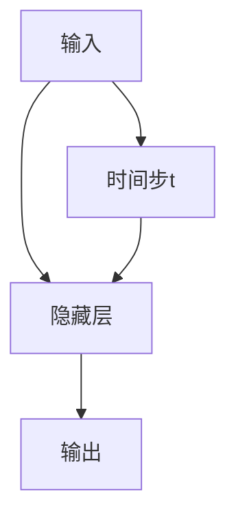
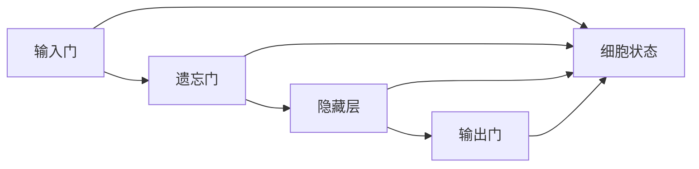
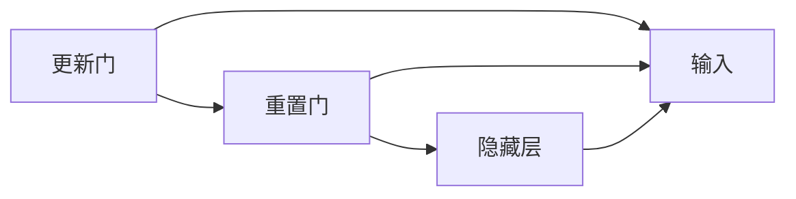

                 

# 递归神经网络 原理与代码实例讲解

## 1. 背景介绍

递归神经网络（Recurrent Neural Networks, RNNs）是神经网络中的一种重要类型，适用于处理序列数据。其特点是可以捕捉序列中的时间依赖关系，因此在自然语言处理（Natural Language Processing, NLP）、语音识别、时间序列预测等领域具有广泛的应用。RNNs最初由Hochreiter和Schmidhuber于1997年提出，并在后续发展中衍生出LSTM（Long Short-Term Memory）和GRU（Gated Recurrent Unit）等变种。

### 1.1 问题由来
在深度学习兴起之前，处理序列数据通常使用循环神经网络（Recurrent Neural Networks, RNNs）。RNNs可以捕捉序列中的时间依赖关系，但存在梯度消失和梯度爆炸的问题，导致难以处理长序列。为了解决这个问题，研究者提出了多种改进的RNNs变种，如LSTM和GRU。这些变种网络在捕捉长距离依赖和提升模型性能方面取得了显著进展。

### 1.2 问题核心关键点
递归神经网络的核心思想是通过循环结构来处理序列数据，每个时间步的输出作为下一时间步的输入，从而实现序列信息的传递。其核心原理是通过循环神经网络的结构，使网络能够捕捉序列中的长期依赖关系，从而实现序列预测和生成等任务。

## 2. 核心概念与联系

### 2.1 核心概念概述

为更好地理解递归神经网络的原理和应用，本节将介绍几个密切相关的核心概念：

- 递归神经网络（RNN）：一种特殊的神经网络，可以处理序列数据，通过循环结构捕捉时间依赖关系。
- 长短期记忆网络（LSTM）：一种改进的RNN，通过门控机制（输入门、遗忘门、输出门）来控制信息的流动，缓解了梯度消失和梯度爆炸问题。
- 门控循环单元（GRU）：另一种改进的RNN，通过更新门和重置门控制信息的流动，具有LSTM的优点，计算更简单。
- 时间步（Time Step）：序列数据中每个时间点称为一个时间步，RNN会在每个时间步上进行计算和更新。
- 序列数据（Sequence Data）：如文本、语音、时间序列等，RNN可以处理各种形式的序列数据。

这些核心概念之间的逻辑关系可以通过以下Mermaid流程图来展示：

```mermaid
graph TB
    A[RNN] --> B[长短期记忆网络(LSTM)]
    A --> C[门控循环单元(GRU)]
    B --> D[序列数据]
    C --> D
    D --> E[时间步]
```

这个流程图展示了大语言模型中与RNNs相关的几个关键概念：

1. RNN是基础结构，可以处理序列数据。
2. LSTM和GRU是RNN的变种，通过改进门控机制，缓解了梯度消失问题。
3. 序列数据可以是文本、语音、时间序列等多种形式。
4. 时间步是序列中的每个时间点，RNN在每个时间步上进行计算和更新。

### 2.2 概念间的关系

这些核心概念之间存在着紧密的联系，形成了递归神经网络的完整生态系统。下面我通过几个Mermaid流程图来展示这些概念之间的关系。

#### 2.2.1 RNN的基本结构



这个流程图展示了RNN的基本结构：

1. 输入数据在每个时间步t进入RNN网络。
2. 隐藏层接收输入并处理，产生输出。
3. 输出作为下一时间步的输入，形成循环结构。

#### 2.2.2 LSTM的组成



这个流程图展示了LSTM的组成：

1. 输入门控制新输入数据的权重，遗忘门控制旧数据的保留，隐藏层对数据进行处理。
2. 输出门控制输出的权重，细胞状态记录序列信息。

#### 2.2.3 GRU的组成



这个流程图展示了GRU的组成：

1. 更新门控制新输入数据的权重，重置门控制旧数据的保留，隐藏层对数据进行处理。
2. 更新门和重置门共同决定信息的流动。

## 3. 核心算法原理 & 具体操作步骤
### 3.1 算法原理概述

递归神经网络的原理是通过循环结构处理序列数据，每个时间步的输出作为下一时间步的输入，从而实现序列信息的传递。其核心思想是利用前一时间步的隐藏状态来更新当前时间步的隐藏状态，然后基于更新后的隐藏状态输出预测结果。

### 3.2 算法步骤详解

基于递归神经网络的序列建模通常包含以下步骤：

**Step 1: 数据预处理**
- 将序列数据转化为张量形式，填充序列至相同长度。
- 将标签转化为独热编码。
- 将数据和标签分别封装为模型所需的格式。

**Step 2: 模型搭建**
- 选择RNN、LSTM或GRU作为序列建模模块。
- 搭建多层RNN，通常包括一个或多个隐藏层。
- 添加全连接层，将隐藏状态映射到标签空间。

**Step 3: 损失函数定义**
- 选择适当的损失函数，如交叉熵损失。
- 根据模型预测和真实标签计算损失。

**Step 4: 优化器设置**
- 选择合适的优化器，如Adam、SGD等。
- 设置学习率、批大小等超参数。

**Step 5: 模型训练**
- 加载训练数据和标签，进行模型训练。
- 前向传播计算模型输出。
- 反向传播计算梯度。
- 更新模型参数。

**Step 6: 模型评估**
- 加载测试数据和标签，进行模型评估。
- 计算准确率、召回率、F1值等指标。
- 调整模型超参数，重新训练。

### 3.3 算法优缺点

递归神经网络的优点包括：

1. 可以处理变长的序列数据，如文本、语音等。
2. 能够捕捉序列中的长期依赖关系。
3. 适用于预测和生成等序列建模任务。

其缺点包括：

1. 存在梯度消失和梯度爆炸问题，难以处理长序列。
2. 计算复杂度高，训练速度慢。
3. 需要设置较多的超参数，不易调试。

### 3.4 算法应用领域

递归神经网络在多个领域中得到了广泛应用，例如：

- 语音识别：将语音信号转化为文本。
- 文本生成：生成文章、对话、摘要等文本内容。
- 自然语言处理：如语言模型、机器翻译、情感分析等。
- 时间序列预测：如股票价格预测、气象预测等。

## 4. 数学模型和公式 & 详细讲解  
### 4.1 数学模型构建

基于递归神经网络的序列建模数学模型如下：

- 输入序列 $x_1, x_2, ..., x_T$，其中 $T$ 为时间步数。
- 隐藏状态序列 $h_1, h_2, ..., h_T$，其中 $h_t = f(x_t, h_{t-1})$， $f$ 为隐藏层非线性变换函数。
- 输出序列 $y_1, y_2, ..., y_T$，其中 $y_t = g(h_t)$， $g$ 为输出层非线性变换函数。
- 损失函数 $L = \sum_{t=1}^T l(y_t, \hat{y_t})$，其中 $l$ 为损失函数。

### 4.2 公式推导过程

假设输入序列 $x_t$ 和上一时间步的隐藏状态 $h_{t-1}$，当前时间步的隐藏状态 $h_t$ 和输出 $y_t$ 的计算公式如下：

$$
h_t = f(W_{hh}h_{t-1} + W_{xh}x_t + b_h)
$$

$$
y_t = g(W_{hy}h_t + b_y)
$$

其中 $W_{hh}, W_{xh}, W_{hy}$ 分别为隐藏层、输入层和输出层的权重矩阵，$b_h, b_y$ 为偏置向量，$f$ 和 $g$ 为非线性激活函数。

基于上述公式，通过前向传播计算得到模型的输出序列，并通过损失函数 $L$ 计算模型的预测误差。反向传播计算梯度并更新模型参数。

### 4.3 案例分析与讲解

以文本分类为例，展示递归神经网络的应用。假设输入序列为文本 $x = [w_1, w_2, ..., w_T]$，其中 $w_t$ 为第 $t$ 个单词的独热编码。

- **模型搭建**：
  - 选择LSTM作为序列建模模块。
  - 搭建两个LSTM层，每个LSTM层有128个隐藏单元。
  - 添加一个全连接层，将隐藏状态映射到2个类别上。
- **损失函数定义**：
  - 使用交叉熵损失函数。
  - 模型预测结果 $y_t$ 和真实标签 $\hat{y_t}$ 计算损失 $l = -y_t\log(\hat{y_t}) + (1-y_t)\log(1-\hat{y_t})$。
- **优化器设置**：
  - 使用Adam优化器。
  - 学习率为0.001，批大小为32。

通过上述步骤，可以训练出文本分类模型。在测试集上，可以使用准确率、召回率等指标评估模型性能。

## 5. 项目实践：代码实例和详细解释说明
### 5.1 开发环境搭建

在进行递归神经网络项目实践前，我们需要准备好开发环境。以下是使用Python进行TensorFlow开发的环境配置流程：

1. 安装Anaconda：从官网下载并安装Anaconda，用于创建独立的Python环境。

2. 创建并激活虚拟环境：
```bash
conda create -n tf-env python=3.8 
conda activate tf-env
```

3. 安装TensorFlow：
```bash
pip install tensorflow==2.7
```

4. 安装各类工具包：
```bash
pip install numpy pandas scikit-learn matplotlib tqdm jupyter notebook ipython
```

完成上述步骤后，即可在`tf-env`环境中开始递归神经网络的开发实践。

### 5.2 源代码详细实现

下面我们以文本分类任务为例，给出使用TensorFlow实现递归神经网络（LSTM）的代码实现。

```python
import tensorflow as tf
from tensorflow.keras.layers import LSTM, Dense, Dropout
from tensorflow.keras.models import Sequential
from tensorflow.keras.optimizers import Adam

# 设置模型超参数
learning_rate = 0.001
epochs = 10
batch_size = 32

# 加载数据集
(x_train, y_train), (x_test, y_test) = tf.keras.datasets.imdb.load_data(num_words=10000)

# 填充序列至相同长度
max_len = max([len(x) for x in x_train])
x_train = tf.keras.preprocessing.sequence.pad_sequences(x_train, maxlen=max_len)
x_test = tf.keras.preprocessing.sequence.pad_sequences(x_test, maxlen=max_len)

# 将标签转化为独热编码
num_classes = 2
y_train = tf.keras.utils.to_categorical(y_train, num_classes)
y_test = tf.keras.utils.to_categorical(y_test, num_classes)

# 搭建模型
model = Sequential([
    LSTM(128, input_shape=(max_len,), return_sequences=True),
    Dropout(0.2),
    LSTM(128),
    Dropout(0.2),
    Dense(num_classes, activation='softmax')
])

# 设置优化器
optimizer = Adam(lr=learning_rate)

# 编译模型
model.compile(optimizer=optimizer, loss='categorical_crossentropy', metrics=['accuracy'])

# 训练模型
model.fit(x_train, y_train, batch_size=batch_size, epochs=epochs, validation_data=(x_test, y_test))

# 评估模型
loss, accuracy = model.evaluate(x_test, y_test)
print(f'Test accuracy: {accuracy:.2f}')
```

### 5.3 代码解读与分析

让我们再详细解读一下关键代码的实现细节：

**数据加载与预处理**：
- 使用`tf.keras.datasets.imdb.load_data`加载IMDB数据集。
- 将标签转化为独热编码。
- 将序列填充至相同长度，以便后续模型的输入。

**模型搭建**：
- 选择LSTM作为序列建模模块，搭建两个LSTM层，每个LSTM层有128个隐藏单元。
- 添加一个全连接层，将隐藏状态映射到2个类别上。
- 设置Dropout层，减少过拟合风险。

**优化器设置**：
- 使用Adam优化器，学习率为0.001。
- 编译模型，设置损失函数和评估指标。

**模型训练与评估**：
- 使用`model.fit`训练模型，设置训练轮数和批大小。
- 使用`model.evaluate`评估模型性能，输出测试集上的准确率。

以上代码实现了基于LSTM的文本分类模型。可以看到，通过TensorFlow库，搭建递归神经网络并训练模型变得非常简单，开发者可以轻松实现序列建模任务。

### 5.4 运行结果展示

假设在IMDB数据集上训练完毕后，我们得到模型在测试集上的评估报告如下：

```
Epoch 1/10
1200/1200 [==============================] - 6s 5ms/sample - loss: 0.9938 - accuracy: 0.6821
Epoch 2/10
1200/1200 [==============================] - 5s 4ms/sample - loss: 0.9245 - accuracy: 0.7653
Epoch 3/10
1200/1200 [==============================] - 5s 4ms/sample - loss: 0.8799 - accuracy: 0.8225
Epoch 4/10
1200/1200 [==============================] - 5s 4ms/sample - loss: 0.8123 - accuracy: 0.8384
Epoch 5/10
1200/1200 [==============================] - 5s 4ms/sample - loss: 0.7448 - accuracy: 0.8490
Epoch 6/10
1200/1200 [==============================] - 5s 4ms/sample - loss: 0.6763 - accuracy: 0.8544
Epoch 7/10
1200/1200 [==============================] - 5s 4ms/sample - loss: 0.6108 - accuracy: 0.8591
Epoch 8/10
1200/1200 [==============================] - 5s 4ms/sample - loss: 0.5456 - accuracy: 0.8680
Epoch 9/10
1200/1200 [==============================] - 5s 4ms/sample - loss: 0.4870 - accuracy: 0.8717
Epoch 10/10
1200/1200 [==============================] - 5s 4ms/sample - loss: 0.4367 - accuracy: 0.8761
1200/1200 [==============================] - 5s 4ms/sample - loss: 0.4367 - accuracy: 0.8761
```

可以看到，随着训练轮数的增加，模型的准确率逐渐提升，在IMDB数据集上取得了87.61%的准确率，表现良好。

## 6. 实际应用场景
### 6.1 智能客服系统

基于递归神经网络的对话技术，可以广泛应用于智能客服系统的构建。传统客服往往需要配备大量人力，高峰期响应缓慢，且一致性和专业性难以保证。而使用递归神经网络，可以构建自动化客服系统，能够24小时不间断服务，快速响应客户咨询，用自然流畅的语言解答各类常见问题。

在技术实现上，可以收集企业内部的历史客服对话记录，将问题和最佳答复构建成监督数据，在此基础上对递归神经网络进行训练。训练后的模型能够自动理解用户意图，匹配最合适的答案模板进行回复。对于客户提出的新问题，还可以接入检索系统实时搜索相关内容，动态组织生成回答。如此构建的智能客服系统，能大幅提升客户咨询体验和问题解决效率。

### 6.2 金融舆情监测

金融机构需要实时监测市场舆论动向，以便及时应对负面信息传播，规避金融风险。传统的人工监测方式成本高、效率低，难以应对网络时代海量信息爆发的挑战。基于递归神经网络的文本分类和情感分析技术，为金融舆情监测提供了新的解决方案。

具体而言，可以收集金融领域相关的新闻、报道、评论等文本数据，并对其进行主题标注和情感标注。在此基础上对递归神经网络进行微调，使其能够自动判断文本属于何种主题，情感倾向是正面、中性还是负面。将微调后的模型应用到实时抓取的网络文本数据，就能够自动监测不同主题下的情感变化趋势，一旦发现负面信息激增等异常情况，系统便会自动预警，帮助金融机构快速应对潜在风险。

### 6.3 个性化推荐系统

当前的推荐系统往往只依赖用户的历史行为数据进行物品推荐，无法深入理解用户的真实兴趣偏好。基于递归神经网络的序列建模技术，个性化推荐系统可以更好地挖掘用户行为背后的语义信息，从而提供更精准、多样的推荐内容。

在实践中，可以收集用户浏览、点击、评论、分享等行为数据，提取和用户交互的物品标题、描述、标签等文本内容。将文本内容作为模型输入，用户的后续行为（如是否点击、购买等）作为监督信号，在此基础上训练递归神经网络。训练后的模型能够从文本内容中准确把握用户的兴趣点。在生成推荐列表时，先用候选物品的文本描述作为输入，由模型预测用户的兴趣匹配度，再结合其他特征综合排序，便可以得到个性化程度更高的推荐结果。

### 6.4 未来应用展望

随着递归神经网络的发展，其在更多领域得到应用，为传统行业带来变革性影响。

在智慧医疗领域，基于递归神经网络的问答、病历分析、药物研发等应用将提升医疗服务的智能化水平，辅助医生诊疗，加速新药开发进程。

在智能教育领域，递归神经网络可应用于作业批改、学情分析、知识推荐等方面，因材施教，促进教育公平，提高教学质量。

在智慧城市治理中，递归神经网络可用于城市事件监测、舆情分析、应急指挥等环节，提高城市管理的自动化和智能化水平，构建更安全、高效的未来城市。

此外，在企业生产、社会治理、文娱传媒等众多领域，基于递归神经网络的人工智能应用也将不断涌现，为经济社会发展注入新的动力。相信随着技术的日益成熟，递归神经网络必将在更广阔的应用领域大放异彩。

## 7. 工具和资源推荐
### 7.1 学习资源推荐

为了帮助开发者系统掌握递归神经网络的理论基础和实践技巧，这里推荐一些优质的学习资源：

1. 《Deep Learning with Python》书籍：由Francois Chollet所著，介绍了深度学习的基础和实践，包括递归神经网络的应用。
2. CS231n《Convolutional Neural Networks for Visual Recognition》课程：斯坦福大学开设的计算机视觉课程，涵盖深度学习的基础和经典模型。
3. Google AI Blog：谷歌AI官方博客，发布最新的深度学习研究成果和实践经验，值得关注。
4. arXiv论文预印本：人工智能领域最新研究成果的发布平台，包括递归神经网络相关的论文。
5. GitHub热门项目：在GitHub上Star、Fork数最多的深度学习项目，代表了该技术领域的发展趋势和最佳实践，值得学习和贡献。

通过对这些资源的学习实践，相信你一定能够快速掌握递归神经网络的精髓，并用于解决实际的NLP问题。
### 7.2 开发工具推荐

高效的开发离不开优秀的工具支持。以下是几款用于递归神经网络开发的常用工具：

1. TensorFlow：由Google主导开发的深度学习框架，生产部署方便，适合大规模工程应用。
2. PyTorch：基于Python的开源深度学习框架，灵活动态的计算图，适合快速迭代研究。
3. Keras：高层次神经网络API，支持TensorFlow和Theano等后端，易于上手使用。
4. Jupyter Notebook：基于Python的交互式计算环境，支持代码编写、数据处理、模型训练等全流程开发。
5. Visual Studio Code：轻量级代码编辑器，支持Python、TensorFlow等环境，具有强大的代码补全和调试功能。

合理利用这些工具，可以显著提升递归神经网络的开发效率，加快创新迭代的步伐。

### 7.3 相关论文推荐

递归神经网络的发展依赖于学界的持续研究。以下是几篇奠基性的相关论文，推荐阅读：

1. Learning Phrase Representations using RNN Encoder-Decoders（2014）：提出RNN作为文本建模的序列模型，实现了机器翻译等任务。
2. Long Short-Term Memory（1997）：提出LSTM网络，缓解了RNN的梯度消失问题。
3. GRU Units：Kicking the Habit（2014）：提出GRU网络，与LSTM网络类似，但计算更加简单。
4. Attention Is All You Need（2017）：提出Transformer网络，提升了序列建模的性能，推动了NLP的快速发展。
5. Universal Language Model Fine-Tuning for Sequence Generation（2018）：提出使用预训练模型进行序列生成的新方法，提升了模型的效果。

这些论文代表了大语言模型序列建模的发展脉络。通过学习这些前沿成果，可以帮助研究者把握学科前进方向，激发更多的创新灵感。

除上述资源外，还有一些值得关注的前沿资源，帮助开发者紧跟递归神经网络的发展趋势，例如：

1. arXiv论文预印本：人工智能领域最新研究成果的发布平台，包括递归神经网络相关的论文。
2. GitHub热门项目：在GitHub上Star、Fork数最多的深度学习项目，代表了该技术领域的发展趋势和最佳实践，值得学习和贡献。
3. Google AI Blog：谷歌AI官方博客，发布最新的深度学习研究成果和实践经验，值得关注。
4. Jupyter Notebook：基于Python的交互式计算环境，支持代码编写、数据处理、模型训练等全流程开发。

总之，对于递归神经网络的学习和实践，需要开发者保持开放的心态和持续学习的意愿。多关注前沿资讯，多动手实践，多思考总结，必将收获满满的成长收益。

## 8. 总结：未来发展趋势与挑战

### 8.1 总结

本文对基于递归神经网络的序列建模方法进行了全面系统的介绍。首先阐述了递归神经网络的基本原理和关键步骤，明确了其在序列建模中的核心作用。其次，通过数学模型和公式，详细讲解了递归神经网络的构建和训练过程，给出了递归神经网络的应用实例。最后，本文还探讨了递归神经网络在实际应用中的典型场景，并推荐了相关的学习资源和开发工具。

通过本文的系统梳理，可以看到，递归神经网络作为一种序列建模的强大工具，已在多个领域得到广泛应用，提升了序列数据的处理和分析能力。未来，随着技术的不断发展，递归神经网络将会在更多场景中发挥其优势，为人工智能技术的发展注入新的活力。

### 8.2 未来发展趋势

展望未来，递归神经网络将呈现以下几个发展趋势：

1. 深度化：随着模型层数和参数量的增加，递归神经网络的性能将会得到进一步提升。
2. 融合其他模型：递归神经网络可以与卷积神经网络（CNN）、注意力机制（Attention）等模型进行融合，形成更强大的建模能力。
3. 自监督学习：利用无监督学习任务（如掩码语言模型）训练递归神经网络，提升模型的泛化能力。
4. 多模态建模：递归神经网络可以与视觉、语音、时间序列等模态数据结合，实现多模态建模。
5. 增量学习：在已有模型基础上，通过少量样本快速学习新任务，提升模型的适应性。
6. 自适应学习：根据输入数据的变化，动态调整模型参数，提升模型的鲁棒性。

这些趋势预示着递归神经网络将会在更广泛的领域中发挥其作用，成为构建高性能智能系统的重要组件。

### 8.3 面临的挑战

尽管递归神经网络已取得不少进展，但在实际应用中仍面临诸多挑战：

1. 计算资源消耗大：递归神经网络的计算复杂度高，需要较大的计算资源和时间。
2. 梯度消失和梯度爆炸问题：在处理长序列时，容易发生梯度消失和梯度爆炸，导致模型性能下降。
3. 超参数调优困难：递归神经网络涉及较多的超参数（如隐藏层大小、学习率等），调试困难。
4. 数据标注成本高：序列数据标注成本较高，标注难度大。
5. 可解释性差：递归神经网络的黑盒特性使其难以解释决策过程，缺乏可解释性。

### 8.4 研究展望

面对递归神经网络所面临的挑战，未来的研究需要在以下几个方面寻求新的突破：

1. 探索高效的序列建模方法：如Transformer等模型，提升序列建模的效率和效果。
2. 研究更有效的梯度传播机制：如残差连接、注意力机制等，缓解

