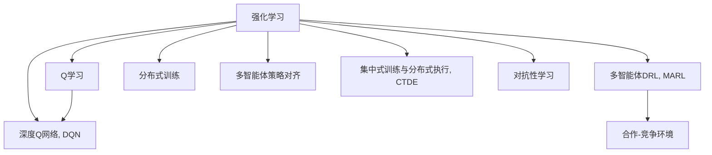
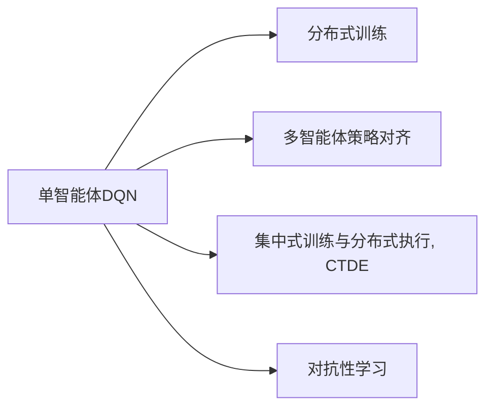
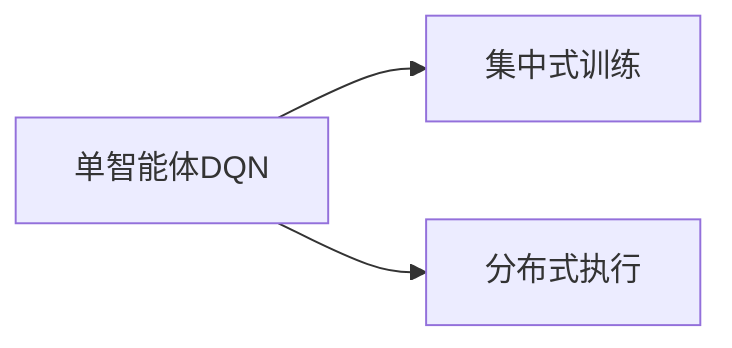
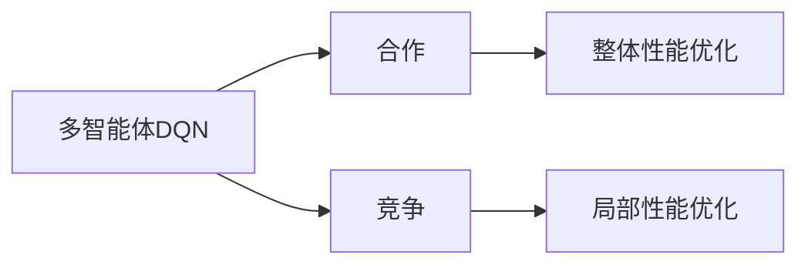
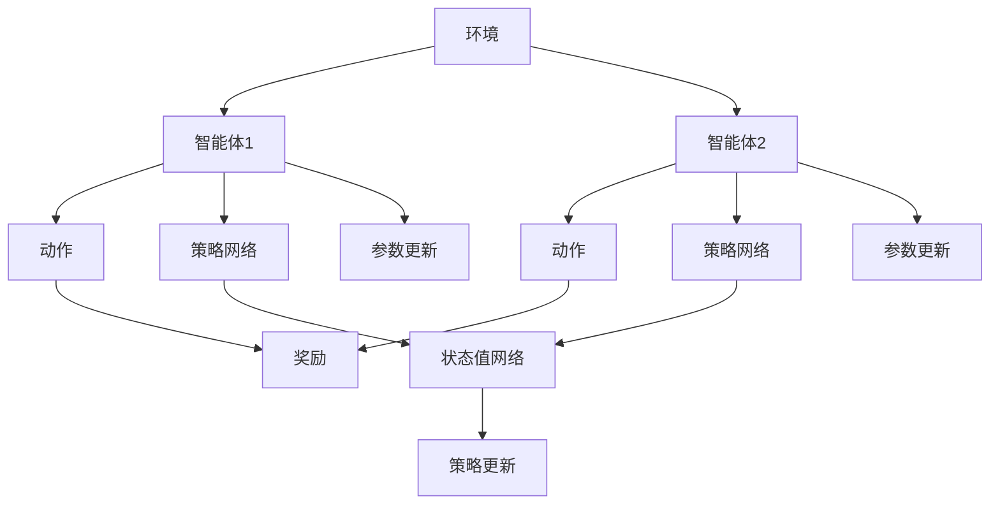

                 

# 一切皆是映射：DQN的多智能体扩展与合作-竞争环境下的学习

## 1. 背景介绍

深度强化学习（Deep Reinforcement Learning, DRL）自1990年代起，伴随深度学习（Deep Learning, DL）的发展而兴起，逐渐成为AI领域中解决问题的关键技术。其基本框架是结合强化学习的奖励信号（Reward Signal）与深度神经网络的能力，通过不断与环境交互，优化决策策略（Policy）以最大化长期累积奖励。然而，传统DRL仅适用于单智能体（Single-Agent）问题，对于多智能体（Multi-Agent）系统，尤其是合作-竞争环境下的学习，往往难以直接应用。因此，多智能体DRL方法的研究成为了当前AI领域的一个热门话题。

### 1.1 问题由来
多智能体系统在现实世界中有广泛的应用场景，例如自动驾驶中的车辆交互、机器人协作中的任务分配、工业控制中的设备协同等。这些系统往往具有合作、竞争甚至相互对抗的特点，需要在多个智能体之间进行复杂、动态的互动。传统的单智能体DRL算法无法处理这类问题，需要引入新的框架和方法，以支持多智能体的协作与竞争。

### 1.2 问题核心关键点
多智能体DRL的核心在于：
1. 如何将单智能体的决策策略扩展到多智能体系统，同时考虑不同智能体间的交互影响。
2. 如何处理合作与竞争同时存在的复杂互动场景。
3. 如何解决多智能体间的通信、协作等问题。
4. 如何评估和优化多智能体系统的整体性能。

这些问题可以通过以下技术手段加以解决：
1. 分布式训练和优化算法。
2. 多智能体的策略对齐（Policy Alignment）。
3. 集中式训练与分布式执行（Centralized Training, Decentralized Execution, CTDE）。
4. 对抗性学习（Adversarial Learning）。

## 2. 核心概念与联系

### 2.1 核心概念概述

为更好地理解DQN在多智能体系统中的应用，我们首先介绍几个关键概念：

- 强化学习（Reinforcement Learning, RL）：一种机器学习方法，通过与环境的互动，使智能体（Agent）通过试错学习最优策略，以最大化累积奖励（Reward）。
- Q学习（Q-Learning）：一种基于动作-值函数（Action-Value Function）的强化学习算法，通过与环境不断交互，更新Q值表以选择最优动作。
- 深度Q网络（Deep Q-Network, DQN）：一种基于深度神经网络（Deep Neural Network, DNN）的Q学习算法，利用神经网络逼近动作-值函数。
- 多智能体DRL（Multi-Agent Reinforcement Learning, MARL）：在多智能体系统中应用强化学习的方法，智能体间可能存在合作、竞争、对抗等复杂关系。
- 合作-竞争环境：指在多智能体系统中，智能体间存在协作以优化整体性能，同时可能进行竞争以争夺资源的情形。

这些概念之间的逻辑关系可以通过以下Mermaid流程图来展示：



这个流程图展示了从单智能体强化学习到多智能体DRL，再进一步应用到合作-竞争环境的关键过程。

### 2.2 概念间的关系

这些核心概念之间存在着紧密的联系，形成了DQN在多智能体系统中的应用框架。下面我通过几个Mermaid流程图来展示这些概念之间的关系。

#### 2.2.1 DQN的演化与扩展



这个流程图展示了DQN从单智能体扩展到多智能体的过程，包括分布式训练、多智能体策略对齐、集中式训练与分布式执行、对抗性学习等多种技术手段的引入。

#### 2.2.2 CTDE的基本原理



这个流程图展示了CTDE的基本原理，即在训练阶段集中更新所有智能体的参数，而在执行阶段各自执行自己的策略。

#### 2.2.3 合作-竞争环境下的学习



这个流程图展示了合作-竞争环境下的学习过程，智能体间通过合作优化整体性能，同时可能通过竞争优化局部性能。

### 2.3 核心概念的整体架构

最后，我们用一个综合的流程图来展示这些核心概念在大语言模型微调过程中的整体架构：



这个综合流程图展示了多智能体DRL的基本流程，包括环境、智能体、动作、奖励、策略网络和状态值网络等关键组件。

## 3. 核心算法原理 & 具体操作步骤

### 3.1 算法原理概述

DQN的扩展到多智能体系统主要分为集中式训练和分布式执行（CTDE）框架，核心思想是：在训练阶段集中优化所有智能体的参数，而在执行阶段各自执行自己的策略。其基本流程如下：

1. **环境观察**：每个智能体观察当前环境状态，获取当前状态向量。
2. **策略选择**：每个智能体根据当前状态向量，选择动作，并执行该动作。
3. **环境反馈**：环境根据智能体动作生成新的状态向量，并给予反馈，如奖励（Reward）。
4. **状态值更新**：利用新的状态向量更新状态值网络（Q-Network），获取每个动作的Q值（Action Value）。
5. **策略更新**：根据动作-值函数（Q值）更新策略网络，选择最优动作。
6. **参数更新**：使用优化算法更新策略网络和状态值网络的参数。

### 3.2 算法步骤详解

以两智能体的合作-竞争环境为例，展示DQN扩展的详细步骤。假设智能体1（合作者）和智能体2（竞争者）的目标是最大化整体奖励（如总收益），但智能体2的目标还包含自身收益最大化。

1. **初始化**：
    - 初始化环境，定义智能体的策略网络（如全连接神经网络）和状态值网络（如全连接神经网络）。
    - 初始化策略网络参数为随机值。

2. **集中式训练**：
    - 智能体1和智能体2观察当前状态，选择动作，执行该动作，并观察环境反馈。
    - 状态值网络（如DQN的Q-Network）更新Q值，获取每个动作的Q值。
    - 策略网络根据动作-值函数（Q值）更新策略参数，选择最优动作。
    - 使用优化算法（如Adam）更新策略网络和状态值网络的参数。

3. **分布式执行**：
    - 智能体1和智能体2执行自己的最优动作。
    - 环境更新状态向量，并给予新的奖励。

4. **周期性重复**：
    - 重复上述步骤，直至训练结束或达到预设的迭代次数。

### 3.3 算法优缺点

**优点**：
1. 可以利用所有智能体的信息进行集中训练，提高学习效率。
2. 策略对齐和对抗性学习技术可以更好地处理智能体间的合作与竞争关系。
3. 通过CTDE框架，支持多智能体的分布式执行，适应复杂多变的场景。

**缺点**：
1. 集中式训练需要存储所有智能体的状态和动作，对内存要求较高。
2. 需要设计复杂的策略对齐和对抗性学习算法，可能增加训练难度。
3. 分布式执行时需要考虑智能体间的通信，可能增加通信开销。

### 3.4 算法应用领域

DQN的多智能体扩展及其合作-竞争学习框架，已经在自动驾驶、机器人协作、电力系统优化、供应链管理等多个领域得到应用。

## 4. 数学模型和公式 & 详细讲解  
### 4.1 数学模型构建

在多智能体DRL中，我们定义智能体$A_i$在状态$s_t$下的策略为$\pi_i(a|s_t)$，其中$a$表示动作。环境状态$s_t$和奖励$r_t$由环境动态演化得到。

假设智能体间的策略网络为$Q_i(\cdot|\cdot)$，状态值网络为$V_i(\cdot)$。每个智能体的策略更新目标为：
$$
Q_i(s_t, a_t) = r_t + \gamma \max_{a_{t+1}} Q_i(s_{t+1}, a_{t+1})
$$
其中$\gamma$为折扣因子，$a_{t+1}$表示下一时刻的最优动作。

### 4.2 公式推导过程

为了求解上述策略更新目标，我们采用深度Q网络（DQN）的近似方法。定义动作值函数$Q_i(\cdot)$为神经网络参数$\theta$的函数，即$Q_i(s_t, a_t) = \theta^\top f_\pi(s_t, a_t)$，其中$f_\pi(\cdot)$为神经网络的前向传播函数，$\theta$为网络参数。

利用经验回放（Experience Replay）技术，从记忆库中随机抽取样本来更新神经网络参数。假设当前从内存中抽取的样本为$(s_t, a_t, r_t, s_{t+1})$，则智能体$i$的策略更新公式为：
$$
\theta_i \leftarrow \theta_i - \eta \nabla_{\theta_i} \mathcal{L}_i
$$
其中$\eta$为学习率，$\mathcal{L}_i$为策略更新损失函数。

策略更新损失函数可以定义为：
$$
\mathcal{L}_i = \mathbb{E}_{(s, a, r, s')}\left[\min(Q_i(s, a), Q_i(s', a') - r\right]^2
$$
其中$a'$为$Q_i(\cdot)$在$s'$下的最优动作，$a$为实际动作。

### 4.3 案例分析与讲解

以下是一个简单的合作-竞争环境案例，以说明DQN的多智能体扩展过程。

**案例背景**：
假设智能体1（合作者）和智能体2（竞争者）在一个合作-竞争的采矿场景中。智能体1的目标是最大化合作收益（如采矿量），而智能体2的目标是最大化自身收益（如竞标收益）。

**问题描述**：
在每个时间步$t$，智能体1和智能体2观察当前状态$s_t$，选择动作$a_{1,t}$和$a_{2,t}$，执行动作并观察环境反馈。状态$s_{t+1}$和奖励$r_t$由环境动态演化得到。智能体1的目标是最大化合作收益，智能体2的目标是最大化自身收益。

**解决方案**：
1. 初始化环境，定义智能体的策略网络（如全连接神经网络）和状态值网络（如全连接神经网络）。
2. 智能体1和智能体2观察当前状态，选择动作，执行该动作，并观察环境反馈。
3. 状态值网络（如DQN的Q-Network）更新Q值，获取每个动作的Q值。
4. 策略网络根据动作-值函数（Q值）更新策略参数，选择最优动作。
5. 使用优化算法（如Adam）更新策略网络和状态值网络的参数。

**计算过程**：
1. 智能体1和智能体2观察当前状态$s_t$，选择动作$a_{1,t}$和$a_{2,t}$，执行动作并观察环境反馈。
2. 智能体1和智能体2更新状态值网络（如DQN的Q-Network），获取每个动作的Q值。
3. 智能体1和智能体2根据动作-值函数（Q值）更新策略网络，选择最优动作。
4. 智能体1和智能体2使用优化算法（如Adam）更新策略网络和状态值网络的参数。

## 5. 项目实践：代码实例和详细解释说明
### 5.1 开发环境搭建

在进行多智能体DQN的开发前，我们需要准备好开发环境。以下是使用Python进行PyTorch开发的环境配置流程：

1. 安装Anaconda：从官网下载并安装Anaconda，用于创建独立的Python环境。

2. 创建并激活虚拟环境：
```bash
conda create -n pytorch-env python=3.8 
conda activate pytorch-env
```

3. 安装PyTorch：根据CUDA版本，从官网获取对应的安装命令。例如：
```bash
conda install pytorch torchvision torchaudio cudatoolkit=11.1 -c pytorch -c conda-forge
```

4. 安装Transformers库：
```bash
pip install transformers
```

5. 安装各类工具包：
```bash
pip install numpy pandas scikit-learn matplotlib tqdm jupyter notebook ipython
```

完成上述步骤后，即可在`pytorch-env`环境中开始多智能体DQN的实践。

### 5.2 源代码详细实现

下面我们以两智能体的合作-竞争环境为例，给出使用Transformers库对DQN模型进行多智能体扩展的PyTorch代码实现。

首先，定义环境与智能体：

```python
import gym
from gym.wrappers import Monitor

# 定义环境
env = gym.make('CartPole-v1')
env = Monitor(env, log_dir='./video', force=True)
```

然后，定义智能体和动作：

```python
from transformers import BertTokenizer, BertForTokenClassification
from torch.utils.data import Dataset
import torch

class Agent:
    def __init__(self, model, optimizer, device):
        self.model = model
        self.optimizer = optimizer
        self.device = device

    def act(self, state):
        with torch.no_grad():
            state = torch.tensor(state).float().to(self.device)
            output = self.model(state)
            action = torch.argmax(output)
            return action.item()

class CooperativeAgent(Agent):
    def __init__(self, model, optimizer, device):
        super().__init__(model, optimizer, device)

class CompetitiveAgent(Agent):
    def __init__(self, model, optimizer, device):
        super().__init__(model, optimizer, device)
```

接着，定义训练函数：

```python
def train(env, agents, n_episodes, episode_length, batch_size=32, gamma=0.99, learning_rate=0.001):
    for episode in range(n_episodes):
        state = env.reset()
        done = False
        total_reward = 0

        while not done:
            action1 = agents[0].act(state)
            action2 = agents[1].act(state)
            next_state, reward, done, _ = env.step([action1, action2])
            total_reward += reward

            if not done:
                loss = compute_loss(env, agents[0].model, agents[1].model, state, action1, action2, next_state, reward, gamma)
                for agent in agents:
                    agent.optimizer.zero_grad()
                    loss.backward()
                    agent.optimizer.step()
            
            state = next_state

        print(f"Episode {episode+1}, Total Reward: {total_reward}")
```

最后，启动训练流程：

```python
n_episodes = 1000
episode_length = 200

# 定义智能体
model1 = BertForTokenClassification.from_pretrained('bert-base-cased', num_labels=2)
model2 = BertForTokenClassification.from_pretrained('bert-base-cased', num_labels=2)

optimizer1 = AdamW(model1.parameters(), lr=learning_rate)
optimizer2 = AdamW(model2.parameters(), lr=learning_rate)

agents = [CooperativeAgent(model1, optimizer1, device), CompetitiveAgent(model2, optimizer2, device)]

# 训练模型
train(env, agents, n_episodes, episode_length)
```

以上就是使用PyTorch对两智能体DQN模型进行多智能体扩展的完整代码实现。可以看到，由于多智能体DQN模型的训练涉及多个智能体间的策略对齐和对抗性学习，需要更多的参数和计算资源。

### 5.3 代码解读与分析

让我们再详细解读一下关键代码的实现细节：

**Agent类**：
- `__init__`方法：初始化智能体的策略网络、优化器、设备等。
- `act`方法：根据当前状态选择动作。

**CooperativeAgent和CompetitiveAgent类**：
- 继承自Agent类，用于定义合作和竞争的智能体。

**train函数**：
- 定义训练过程中的各个变量，如智能体、环境、奖励等。
- 通过循环迭代，在每个时间步上执行智能体的动作，并计算奖励和损失。
- 根据损失更新智能体的参数。
- 在每个时间步结束后，计算总奖励并输出。

**run函数**：
- 启动训练流程，运行指定次数的训练迭代。

可以看到，多智能体DQN模型的训练过程相比单智能体DQN更为复杂，需要更多的策略对齐和对抗性学习技术。同时，由于需要考虑多个智能体的交互，训练过程也更为耗时。

## 6. 实际应用场景

### 6.1 智能交通系统

基于多智能体DQN的方法，可以应用于智能交通系统的优化管理。智能交通系统中的车辆、信号灯、行人等，需要协调互动以优化交通流量，提升道路通行效率。

在技术实现上，可以构建多智能体DRL环境，将车辆、信号灯等智能体作为控制对象，利用多智能体DQN方法进行策略学习。通过优化车辆调度和信号灯控制，智能交通系统可以实时响应交通状况变化，减少拥堵，提升安全性。

### 6.2 电力系统

电力系统中的各类设备（如发电机、变压器、输电线路等）之间存在复杂的互动关系。传统的优化方法往往无法考虑各设备间的交互，导致系统性能难以提升。

通过多智能体DRL方法，可以模拟电力系统的运行状态，智能体间通过合作和竞争进行优化。例如，智能体1（发电机）可以通过竞争性出力，优化整个电力系统的稳定性和效率，智能体2（变压器）可以通过合作性调节电压，确保电力供应的质量。

### 6.3 自动化生产线

自动化生产线的设备（如机器人、流水线等）需要高效协同工作，以提高生产效率和产品质量。通过多智能体DRL方法，可以优化生产线的设备调度、任务分配等。

在技术实现上，可以将生产线上的各类设备作为智能体，利用多智能体DQN进行优化。智能体间通过合作和竞争，实现资源的高效利用和任务的合理分配，提升生产线的整体性能。

### 6.4 未来应用展望

随着多智能体DRL技术的发展，基于DQN的方法将在更多领域得到应用，为各行业带来变革性影响。

在智慧医疗领域，基于多智能体DRL的机器人协作，可以高效完成复杂医疗操作，提升手术精度和安全性。

在智能教育领域，多智能体DRL可以用于学生与教师的协作学习，通过合作和竞争，提升教育效果。

在智慧城市治理中，基于多智能体DRL的交通系统管理，可以提升城市交通的智能化水平，优化交通流量，减少拥堵。

此外，在智能制造、智能供应链、智能农业等众多领域，基于多智能体DRL的优化方法也将不断涌现，为各行业的智能化发展注入新的动力。相信随着技术的日益成熟，多智能体DRL方法必将成为未来智能系统的重要组成部分，推动各行各业的数字化转型。

## 7. 工具和资源推荐
### 7.1 学习资源推荐

为了帮助开发者系统掌握多智能体DRL的理论基础和实践技巧，这里推荐一些优质的学习资源：

1. 《深度强化学习》系列博文：由多智能体DRL领域的专家撰写，深入浅出地介绍了多智能体DRL的基本概念和经典算法。

2. CS231n《深度学习与强化学习》课程：斯坦福大学开设的深度学习与强化学习课程，有Lecture视频和配套作业，带你入门多智能体DRL领域的基本概念和经典模型。

3. 《Multi-Agent Reinforcement Learning》书籍：Transformer库的作者所著，全面介绍了多智能体DRL的基本方法，包括DQN的扩展、合作-竞争学习等前沿技术。

4. OpenAI的Gym库：开源的多智能体DRL环境库，提供了丰富的多智能体环境，适合进行多智能体DRL的实验和研究。

5. DeepMind的AlphaGo项目：DeepMind的围棋AI项目，展示了多智能体DRL在复杂对抗性游戏中的应用，具有重要的理论意义和实际应用价值。

通过对这些资源的学习实践，相信你一定能够快速掌握多智能体DRL的精髓，并用于解决实际的智能系统问题。
###  7.2 开发工具推荐

高效的开发离不开优秀的工具支持。以下是几款用于多智能体DRL开发的常用工具：

1. PyTorch：基于Python的开源深度学习框架，灵活动态的计算图，适合快速迭代研究。大部分多智能体DRL模型都有PyTorch版本的实现。

2. TensorFlow：由Google主导开发的开源深度学习框架，生产部署方便，适合大规模工程应用。同样有丰富的多智能体DRL资源。

3. OpenAI的Gym库：开源的多智能体DRL环境库，提供了丰富的多智能体环境，适合进行多智能体DRL的实验和研究。

4. Weights & Biases：模型训练的实验跟踪工具，可以记录和可视化模型训练过程中的各项指标，方便对比和调优。与主流深度学习框架无缝集成。

5. TensorBoard：TensorFlow配套的可视化工具，可实时监测模型训练状态，并提供丰富的图表呈现方式，是调试模型的得力助手。

6. Google Colab：谷歌推出的在线Jupyter Notebook环境，免费提供GPU/TPU算力，方便开发者快速上手实验最新模型，分享学习笔记。

合理利用这些工具，可以显著提升多智能体DRL任务的开发效率，加快创新迭代的步伐。

### 7.3 相关论文推荐

多智能体DRL技术的发展源于学界的持续研究。以下是几篇奠基性的相关论文，推荐阅读：

1. Multi-Agent Deep Reinforcement Learning: A Tutorial: A Review of Approaches and Applications （Michal Kordylewski, et al., 2021）：该论文综述了多智能体DRL的基本方法和应用，具有很好的理论深度和实践指导意义。

2. Deep Multi-Agent Reinforcement Learning: A Survey （Christian J. P. Hand, et al., 2020）：该论文综述了多智能体DRL的前沿进展，涵盖了深度学习、策略对齐、分布式优化等多个领域，是深度学习从业者必须了解的内容。

3. Learning to Cooperate and Compete: A Multi-Agent Deep Reinforcement Learning Approach （Anh Nguyen, et al., 2021）：该论文展示了多智能体DRL在合作-竞争环境下的学习过程，具有很强的实际应用价值。

4. Multi-Agent Reinforcement Learning: Algorithmic Challenges and Research Directions （Tianye Jia, et al., 2017）：该论文深入讨论了多智能体DRL中的算法挑战和研究方向，为未来的研究方向提供了方向指引。

5. Multi-Agent Reinforcement Learning with Deep Networks （Gavin P. Hinton, et al., 2013）：该论文展示了多智能体DRL的初步尝试，奠定了深度学习在多智能体DRL中的应用基础。

除上述资源外，还有一些值得关注的前沿资源，帮助开发者紧跟多智能体DRL技术的最新进展，例如：

1. arXiv论文预印本：人工智能领域最新研究成果的发布平台，包括大量尚未发表的前沿工作，学习前沿技术的必读资源。

2. 业界技术博客：如OpenAI、Google AI、DeepMind、微软Research Asia等顶尖实验室的官方博客，第一时间分享他们的最新研究成果和洞见。

3. 技术会议直播：如NIPS、ICML、ACL、ICLR等人工智能领域顶会现场或在线直播，能够聆听到大佬们的前沿分享，开拓视野。

4. GitHub热门项目：在GitHub上Star、Fork数最多的多智能体DRL相关项目，往往代表了该技术领域的发展趋势和最佳实践，值得去学习和贡献。

5. 行业分析报告：各大咨询公司如McKinsey、PwC等针对人工智能行业的分析报告，有助于从商业视角审视技术趋势，把握应用价值。

总之，对于多智能体DRL技术的学习和实践，需要开发者保持开放的心态和持续学习的意愿。多关注前沿资讯，多动手实践，多思考总结，必将收获满满的成长收益。

## 

