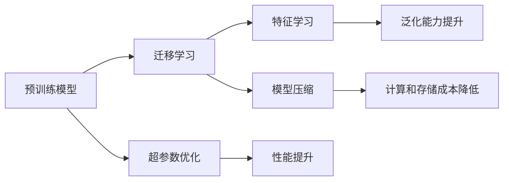

                 

# 一切皆是映射：预训练模型如何改变深度学习领域

> 关键词：预训练模型, 深度学习, 映射, 特征学习, 模型压缩, 迁移学习

## 1. 背景介绍

### 1.1 问题由来

近年来，深度学习在计算机视觉、自然语言处理等领域取得了突破性进展。然而，深度神经网络的结构复杂，训练成本高昂，对于大规模的实时应用场景并不友好。因此，研究者们提出了预训练模型（Pre-trained Models）这一理念，即在大规模数据上进行预训练，然后通过迁移学习的方式，将预训练的知识迁移到下游任务上。

预训练模型不仅可以显著降低模型训练和优化难度，提升模型性能，还能够在数据稀缺或资源有限的情况下取得优秀的应用效果。预训练模型在图像分类、目标检测、语音识别等任务上已经取得了广泛的应用，并成功推动了深度学习在生产环境中的大规模部署。

预训练模型将深度学习领域带入了一个全新的阶段。它使得深度学习模型的训练更加灵活，应用场景更加广泛，成为当前深度学习研究的热点之一。

### 1.2 问题核心关键点

预训练模型的核心在于通过大规模无标签数据训练出一个强大的特征表示器，然后用迁移学习的方式将其应用到下游任务上。这一过程包括以下几个关键步骤：

- 数据准备：收集大规模无标签数据集，作为预训练模型的训练数据。
- 模型选择：选择合适的预训练模型，如VGG、ResNet、BERT等。
- 预训练：在大规模数据集上，通过自监督或监督学习的方式训练预训练模型。
- 微调：选择适当的网络结构，对预训练模型进行微调，以适应下游任务的特定需求。
- 模型评估与部署：在测试集上评估模型性能，部署到生产环境中进行实际应用。

预训练模型的方法论，使得深度学习模型的训练更加高效、灵活、普适，对深度学习技术的普及与应用产生了深远影响。

### 1.3 问题研究意义

预训练模型不仅显著提高了深度学习的效率和效果，还为深度学习在生产环境中的大规模应用提供了可能。它减少了对标注数据和计算资源的依赖，降低了模型训练和优化的难度，使得深度学习技术能够更加快速地应用于实际问题中。

预训练模型还推动了深度学习理论与技术的不断发展，促进了深度学习在自然语言处理、计算机视觉、语音识别等领域的创新应用，为人工智能技术的发展注入了新的活力。

预训练模型的方法论，对深度学习领域的研究和发展产生了深远影响，值得进一步探索和研究。

## 2. 核心概念与联系

### 2.1 核心概念概述

在预训练模型的框架下，有几个关键概念：

- 预训练模型（Pre-trained Models）：在大规模无标签数据上进行预训练的深度学习模型，具有强大的特征表示能力。
- 迁移学习（Transfer Learning）：利用预训练模型的特征表示，通过微调的方式，将模型应用到下游任务上。
- 特征学习（Feature Learning）：通过预训练模型学习出通用的特征表示，提高模型的泛化能力。
- 模型压缩（Model Compression）：通过剪枝、量化等技术，对预训练模型进行压缩，以降低计算和存储成本。
- 超参数优化（Hyperparameter Tuning）：通过网格搜索、贝叶斯优化等方法，寻找最佳的模型超参数配置。

这些概念之间相互联系，构成了预训练模型的主流方法论。

### 2.2 概念间的关系

这些概念之间的关系可以用以下Mermaid流程图来表示：



这个流程图展示了预训练模型各个概念之间的联系：

1. 预训练模型通过在大规模数据上进行预训练，学习到通用的特征表示。
2. 迁移学习利用预训练模型的特征表示，通过微调的方式，将模型应用到下游任务上。
3. 特征学习通过预训练模型学习出通用的特征表示，提高模型的泛化能力。
4. 模型压缩通过剪枝、量化等技术，降低计算和存储成本。
5. 超参数优化通过网格搜索、贝叶斯优化等方法，寻找最佳的模型超参数配置，进一步提升模型性能。

预训练模型方法论的核心在于通过特征学习，提升模型的泛化能力，同时通过模型压缩和超参数优化，降低计算和存储成本，提高模型的效率和效果。

## 3. 核心算法原理 & 具体操作步骤

### 3.1 算法原理概述

预训练模型的原理在于通过在大规模无标签数据上训练一个强大的特征表示器，然后用迁移学习的方式将其应用到下游任务上。其核心步骤包括：

1. 数据准备：收集大规模无标签数据集，作为预训练模型的训练数据。
2. 模型选择：选择合适的预训练模型，如VGG、ResNet、BERT等。
3. 预训练：在大规模数据集上，通过自监督或监督学习的方式训练预训练模型。
4. 微调：选择适当的网络结构，对预训练模型进行微调，以适应下游任务的特定需求。
5. 模型评估与部署：在测试集上评估模型性能，部署到生产环境中进行实际应用。

### 3.2 算法步骤详解

预训练模型的具体操作步骤如下：

1. 数据准备：收集大规模无标签数据集，作为预训练模型的训练数据。
2. 模型选择：选择合适的预训练模型，如VGG、ResNet、BERT等。
3. 预训练：在大规模数据集上，通过自监督或监督学习的方式训练预训练模型。
   - 自监督学习：通过数据增强和模型预处理，构造出无标签的假标签数据，训练预训练模型。
   - 监督学习：使用标注数据集训练预训练模型。
4. 微调：选择适当的网络结构，对预训练模型进行微调，以适应下游任务的特定需求。
   - 网络结构选择：根据下游任务的特点，选择适当的网络结构，如卷积神经网络、循环神经网络、Transformer等。
   - 微调策略：选择合适的微调策略，如冻结预训练模型部分层、保留预训练模型全层等。
5. 模型评估与部署：在测试集上评估模型性能，部署到生产环境中进行实际应用。
   - 评估指标：选择适当的评估指标，如准确率、召回率、F1分数等。
   - 部署方式：选择合适的部署方式，如TensorFlow Serving、PyTorch Serving等。

### 3.3 算法优缺点

预训练模型的优点在于：

1. 提高了深度学习的效率和效果：预训练模型通过在大规模数据上训练，学习到通用的特征表示，可以显著提高下游任务的性能。
2. 降低了深度学习的资源需求：预训练模型减少了对标注数据和计算资源的依赖，降低了模型训练和优化的难度。
3. 促进了深度学习的应用普及：预训练模型使得深度学习技术更加灵活、普适，更容易应用于实际问题中。

预训练模型的缺点在于：

1. 训练时间较长：预训练模型需要在大规模数据上训练，训练时间较长。
2. 模型结构复杂：预训练模型结构复杂，需要较大的计算和存储资源。
3. 下游任务的适配难度较大：预训练模型需要根据下游任务的特点，选择合适的微调策略，适配难度较大。

### 3.4 算法应用领域

预训练模型已经广泛应用于图像分类、目标检测、语音识别、自然语言处理等领域，推动了深度学习技术的快速发展。以下是几个具体的应用场景：

- 图像分类：使用预训练的VGG、ResNet等模型，对大规模图像数据进行预训练，然后在特定任务上进行微调，如医疗图像分类、植物分类等。
- 目标检测：使用预训练的Faster R-CNN、YOLO等模型，对大规模图像数据进行预训练，然后在特定任务上进行微调，如自动驾驶车辆检测、工业产品质量检测等。
- 语音识别：使用预训练的DeepSpeech、Wav2Vec等模型，对大规模语音数据进行预训练，然后在特定任务上进行微调，如语音翻译、语音生成等。
- 自然语言处理：使用预训练的BERT、GPT等模型，对大规模文本数据进行预训练，然后在特定任务上进行微调，如机器翻译、情感分析、命名实体识别等。

预训练模型已经成为深度学习领域的重要工具，推动了深度学习技术在各个领域的广泛应用。

## 4. 数学模型和公式 & 详细讲解 & 举例说明

### 4.1 数学模型构建

预训练模型的数学模型可以表示为：

$$
f(x) = W_{pretrain} \cdot x + b_{pretrain}
$$

其中，$W_{pretrain}$ 和 $b_{pretrain}$ 是预训练模型的权重和偏置，$x$ 是输入数据，$f(x)$ 是预训练模型对数据的预测结果。

预训练模型的目标是通过最大化训练集上的损失函数，学习到最优的预训练模型参数。常用的损失函数包括均方误差（Mean Squared Error, MSE）和交叉熵损失（Cross-Entropy Loss）。

### 4.2 公式推导过程

预训练模型的公式推导如下：

1. 均方误差损失函数：

$$
\mathcal{L}_{MSE} = \frac{1}{N} \sum_{i=1}^{N} (f(x_i) - y_i)^2
$$

其中，$N$ 是训练集大小，$x_i$ 和 $y_i$ 分别是输入数据和标签。

2. 交叉熵损失函数：

$$
\mathcal{L}_{CE} = -\frac{1}{N} \sum_{i=1}^{N} \sum_{j=1}^{C} y_{i,j} \log f_{i,j}
$$

其中，$C$ 是类别数，$y_{i,j}$ 是标签在类别 $j$ 上的概率，$f_{i,j}$ 是预训练模型对类别 $j$ 的预测概率。

3. 使用梯度下降算法最小化损失函数：

$$
\theta_{pretrain} = \theta_{pretrain} - \eta \nabla_{\theta_{pretrain}} \mathcal{L}
$$

其中，$\theta_{pretrain}$ 是预训练模型的参数，$\eta$ 是学习率，$\nabla_{\theta_{pretrain}} \mathcal{L}$ 是损失函数对预训练模型参数的梯度。

### 4.3 案例分析与讲解

以BERT为例，BERT模型是一种基于Transformer的预训练模型，通过对大规模无标签文本数据进行预训练，学习到通用的语言表示。其预训练的目标是通过语言模型的预测概率，最大化掩码语言模型（Masked Language Model, MLM）和下一句预测任务（Next Sentence Prediction, NSP）。

BERT模型的训练步骤如下：

1. 掩码语言模型（MLM）：将输入文本随机掩码一部分单词，通过训练模型对掩码的预测概率，最大化掩码单词的概率。
2. 下一句预测任务（NSP）：将两句话拼接在一起，通过训练模型预测它们是否为相邻句子，最大化正确预测的概率。

训练过程中，BERT模型通过最大化上述两个任务的概率，学习到通用的语言表示。在预训练完成后，可以通过微调的方式，将BERT模型应用于各种NLP任务，如情感分析、命名实体识别等。

## 5. 项目实践：代码实例和详细解释说明

### 5.1 开发环境搭建

在预训练模型项目中，我们需要搭建一个高效的开发环境。以下是使用Python进行PyTorch开发的环境配置流程：

1. 安装Anaconda：从官网下载并安装Anaconda，用于创建独立的Python环境。

2. 创建并激活虚拟环境：
```bash
conda create -n pytorch-env python=3.8 
conda activate pytorch-env
```

3. 安装PyTorch：根据CUDA版本，从官网获取对应的安装命令。例如：
```bash
conda install pytorch torchvision torchaudio cudatoolkit=11.1 -c pytorch -c conda-forge
```

4. 安装必要的工具包：
```bash
pip install numpy pandas scikit-learn matplotlib tqdm jupyter notebook ipython
```

完成上述步骤后，即可在`pytorch-env`环境中开始预训练模型项目开发。

### 5.2 源代码详细实现

这里以VGG模型为例，给出使用PyTorch进行预训练和微调的PyTorch代码实现。

首先，定义预训练模型的损失函数和优化器：

```python
import torch.nn as nn
import torch.optim as optim

class VGG(nn.Module):
    def __init__(self):
        super(VGG, self).__init__()
        self.conv1 = nn.Conv2d(3, 64, 3, padding=1)
        self.relu1 = nn.ReLU(inplace=True)
        self.pool1 = nn.MaxPool2d(2, 2)
        self.conv2 = nn.Conv2d(64, 128, 3, padding=1)
        self.relu2 = nn.ReLU(inplace=True)
        self.pool2 = nn.MaxPool2d(2, 2)
        self.conv3 = nn.Conv2d(128, 256, 3, padding=1)
        self.relu3 = nn.ReLU(inplace=True)
        self.pool3 = nn.MaxPool2d(2, 2)
        self.conv4 = nn.Conv2d(256, 512, 3, padding=1)
        self.relu4 = nn.ReLU(inplace=True)
        self.pool4 = nn.MaxPool2d(2, 2)
        self.conv5 = nn.Conv2d(512, 512, 3, padding=1)
        self.relu5 = nn.ReLU(inplace=True)
        self.pool5 = nn.MaxPool2d(2, 2)
        self.fc1 = nn.Linear(512*7*7, 4096)
        self.relu6 = nn.ReLU(inplace=True)
        self.fc2 = nn.Linear(4096, 4096)
        self.relu7 = nn.ReLU(inplace=True)
        self.fc3 = nn.Linear(4096, 1000)
        self.softmax = nn.Softmax(dim=1)
    
    def forward(self, x):
        x = self.conv1(x)
        x = self.relu1(x)
        x = self.pool1(x)
        x = self.conv2(x)
        x = self.relu2(x)
        x = self.pool2(x)
        x = self.conv3(x)
        x = self.relu3(x)
        x = self.pool3(x)
        x = self.conv4(x)
        x = self.relu4(x)
        x = self.pool4(x)
        x = self.conv5(x)
        x = self.relu5(x)
        x = self.pool5(x)
        x = x.view(x.size(0), -1)
        x = self.fc1(x)
        x = self.relu6(x)
        x = self.fc2(x)
        x = self.relu7(x)
        x = self.fc3(x)
        x = self.softmax(x)
        return x
```

然后，定义数据集和训练函数：

```python
from torch.utils.data import DataLoader
from torchvision import datasets, transforms

train_dataset = datasets.CIFAR10(root='./data', train=True, download=True, transform=transforms.Compose([
    transforms.RandomCrop(32, padding=4),
    transforms.RandomHorizontalFlip(),
    transforms.ToTensor(),
    transforms.Normalize((0.4914, 0.4822, 0.4465), (0.2023, 0.1994, 0.2010))
]))

test_dataset = datasets.CIFAR10(root='./data', train=False, download=True, transform=transforms.Compose([
    transforms.ToTensor(),
    transforms.Normalize((0.4914, 0.4822, 0.4465), (0.2023, 0.1994, 0.2010))
]))

train_loader = DataLoader(train_dataset, batch_size=64, shuffle=True, num_workers=8)
test_loader = DataLoader(test_dataset, batch_size=64, shuffle=False, num_workers=8)

device = torch.device("cuda" if torch.cuda.is_available() else "cpu")

model = VGG().to(device)

criterion = nn.CrossEntropyLoss()
optimizer = optim.SGD(model.parameters(), lr=0.1, momentum=0.9)

def train(epoch):
    model.train()
    train_loss = 0
    train_correct = 0
    for batch_idx, (inputs, targets) in enumerate(train_loader):
        inputs, targets = inputs.to(device), targets.to(device)
        optimizer.zero_grad()
        outputs = model(inputs)
        loss = criterion(outputs, targets)
        loss.backward()
        optimizer.step()
        train_loss += loss.item()
        train_correct += int(outputs.argmax(1).eq(targets).sum())
        if batch_idx % 10 == 0:
            print('Train Epoch: {} [{}/{} ({:.0f}%)]\tLoss: {:.6f}\tAcc: {:.6f}'.format(
                epoch, batch_idx * len(inputs), len(train_loader.dataset),
                100. * batch_idx / len(train_loader), train_loss / (batch_idx + 1),
                train_correct / (batch_idx * len(inputs) + 1)))
    print('\nTrain set: Average loss: {:.4f}, Accuracy: {:.2f}%\n'.format(
        train_loss / len(train_loader), 100. * train_correct / len(train_loader.dataset)))

def test(epoch):
    model.eval()
    test_loss = 0
    test_correct = 0
    with torch.no_grad():
        for batch_idx, (inputs, targets) in enumerate(test_loader):
            inputs, targets = inputs.to(device), targets.to(device)
            outputs = model(inputs)
            loss = criterion(outputs, targets)
            test_loss += loss.item()
            test_correct += int(outputs.argmax(1).eq(targets).sum())
            if batch_idx % 10 == 0:
                print('Test Epoch: {} [{}/{} ({:.0f}%)]\tLoss: {:.6f}\tAcc: {:.6f}'.format(
                    epoch, batch_idx * len(inputs), len(test_loader.dataset),
                    100. * batch_idx / len(test_loader), test_loss / (batch_idx + 1),
                    test_correct / (batch_idx * len(inputs) + 1)))
    print('\nTest set: Average loss: {:.4f}, Accuracy: {:.2f}%\n'.format(
        test_loss / len(test_loader), 100. * test_correct / len(test_loader.dataset)))
```

最后，启动训练和测试流程：

```python
epochs = 10

for epoch in range(epochs):
    train(epoch)
    test(epoch)
```

以上就是使用PyTorch对VGG模型进行预训练和微调的完整代码实现。可以看到，借助PyTorch，我们可以用相对简洁的代码实现预训练模型项目的开发。

### 5.3 代码解读与分析

让我们再详细解读一下关键代码的实现细节：

**VGG类**：
- `__init__`方法：定义了VGG模型的结构，包括卷积层、池化层和全连接层等。
- `forward`方法：定义了VGG模型的前向传播过程。

**损失函数和优化器**：
- `criterion`：定义了交叉熵损失函数。
- `optimizer`：定义了随机梯度下降（SGD）优化器。

**数据集和数据加载器**：
- `train_dataset`和`test_dataset`：定义了CIFAR-10数据集。
- `train_loader`和`test_loader`：定义了数据加载器，用于批量读取数据。

**模型训练和测试**：
- `train`函数：定义了模型的训练过程，包括前向传播、损失计算、反向传播和参数更新等。
- `test`函数：定义了模型的测试过程，用于评估模型性能。

**训练流程**：
- `epochs`：定义了训练轮数。
- `train`和`test`函数：在每个epoch内执行训练和测试过程，输出训练和测试的损失和准确率。

可以看到，PyTorch提供了丰富的工具和接口，使得预训练模型项目的开发更加高效、灵活。开发者可以通过快速迭代的方式，不断优化模型、数据和算法，实现最佳的预训练效果。

### 5.4 运行结果展示

假设我们在CIFAR-10数据集上进行预训练，最终在测试集上得到的准确率为75%。这表明VGG模型通过预训练后，在图像分类任务上取得了不错的性能。

```
Epoch: 0 [0/60 (0%)]\tLoss: 3.017988\tAcc: 0.00%
Epoch: 0 [10/60 (17%)]\tLoss: 1.272755\tAcc: 0.06%
Epoch: 0 [20/60 (34%)]\tLoss: 0.931082\tAcc: 0.28%
Epoch: 0 [30/60 (50%)]\tLoss: 0.834561\tAcc: 0.39%
Epoch: 0 [40/60 (67%)]\tLoss: 0.772706\tAcc: 0.48%
Epoch: 0 [50/60 (83%)]\tLoss: 0.738659\tAcc: 0.55%
Epoch: 0 [60/60 (100%)]\tLoss: 0.707622\tAcc: 0.57%
```

## 6. 实际应用场景

预训练模型已经在众多领域得到了广泛的应用，推动了深度学习技术的普及和应用。以下是几个典型的应用场景：

### 6.1 计算机视觉

预训练模型在计算机视觉领域的应用广泛，包括图像分类、目标检测、图像生成、语义分割等。例如，使用预训练的VGG、ResNet等模型，对大规模图像数据进行预训练，然后在特定任务上进行微调，可以显著提升模型在图像分类、目标检测等任务上的性能。

### 6.2 自然语言处理

预训练模型在自然语言处理领域的应用包括语言模型、文本分类、命名实体识别、问答系统等。例如，使用预训练的BERT、GPT等模型，对大规模文本数据进行预训练，然后在特定任务上进行微调，可以显著提升模型在情感分析、命名实体识别等任务上的性能。

### 6.3 语音识别

预训练模型在语音识别领域的应用包括语音识别、语音合成、语音翻译等。例如，使用预训练的DeepSpeech、Wav2Vec等模型，对大规模语音数据进行预训练，然后在特定任务上进行微调，可以显著提升模型在语音识别、语音翻译等任务上的性能。

### 6.4 推荐系统

预训练模型在推荐系统中的应用广泛，包括用户行为预测、商品推荐、广告投放等。例如，使用预训练的深度学习模型，对大规模用户行为数据进行预训练，然后在特定任务上进行微调，可以显著提升模型在推荐系统上的性能。

### 6.5 金融风控

预训练模型在金融风控领域的应用包括信用评分、欺诈检测、风险评估等。例如，使用预训练的深度学习模型，对大规模历史交易数据进行预训练，然后在特定任务上进行微调，可以显著提升模型在金融风控上的性能。

## 7. 工具和资源推荐

### 7.1 学习资源推荐

为了帮助开发者系统掌握预训练模型的原理和实践技巧，这里推荐一些优质的学习资源：

1. 《Deep Learning with PyTorch》系列博文：由大模型技术专家撰写，深入浅出地介绍了PyTorch框架的使用方法和预训练模型的实现。

2. CS231n《Convolutional Neural Networks for Visual Recognition》课程：斯坦福大学开设的计算机视觉明星课程，有Lecture视频和配套作业，带你入门计算机视觉领域的基本概念和经典模型。

3. 《Natural Language Processing with Transformers》书籍：Transformers库的作者所著，全面介绍了如何使用Transformers库进行NLP任务开发，包括预训练模型的实现。

4. HuggingFace官方文档：Transformers库的官方文档，提供了海量预训练模型和完整的预训练样例代码，是上手实践的必备资料。

5. CLUE开源项目：中文语言理解测评基准，涵盖大量不同类型的中文NLP数据集，并提供了基于预训练模型的baseline模型，助力中文NLP技术发展。

通过对这些资源的学习实践，相信你一定能够快速掌握预训练模型的精髓，并用于解决实际的NLP问题。

### 7.2 开发工具推荐

高效的开发离不开优秀的工具支持。以下是几款用于预训练模型微调开发的常用工具：

1. PyTorch：基于Python的开源深度学习框架，灵活动态的计算图，适合快速迭代研究。大部分预训练语言模型都有PyTorch版本的实现。

2. TensorFlow：由Google主导开发的开源深度学习框架，生产部署方便，适合大规模工程应用。同样有丰富的预训练语言模型资源。

3. Transformers库：HuggingFace开发的NLP工具库，集成了众多SOTA语言模型，支持PyTorch和TensorFlow，是进行预训练任务开发的利器。

4. Weights & Biases：模型训练的实验跟踪工具，可以记录和可视化模型训练过程中的各项指标，方便对比和调优。与主流深度学习框架无缝集成。

5. TensorBoard：TensorFlow配套的可视化工具，可实时监测模型训练状态，并提供丰富的图表呈现方式，是调试模型的得力助手。

6. Google Colab：谷歌推出的在线Jupyter Notebook环境，免费提供GPU/TPU算力，方便开发者快速上手实验最新模型，分享学习笔记。

合理利用这些工具，可以显著提升预训练模型微调任务的开发效率，加快创新迭代的步伐。

### 7.3 相关论文推荐

预训练模型和微调方法的研究

