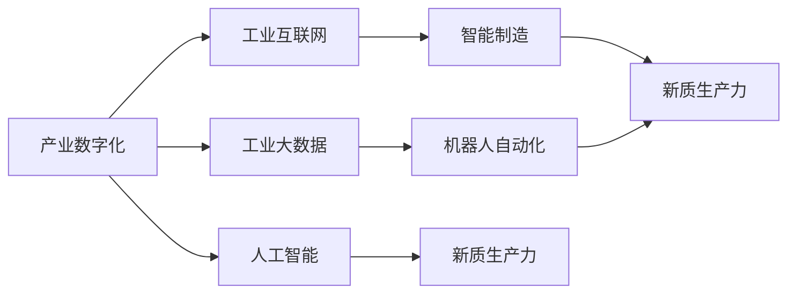
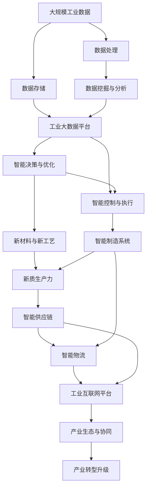

                 

# 产业转型升级与新质生产力

## 1. 背景介绍

### 1.1 问题由来
在全球化、数字化、智能化浪潮的推动下，传统的产业结构、生产方式和商业模式正在经历深刻变革。新一轮工业革命正在重塑产业格局，加速了全球价值链的优化重构。这一背景下，传统产业面临着巨大的转型升级压力。

### 1.2 问题核心关键点
面对这一转型升级的挑战，企业需要重新审视自身的发展路径，积极拥抱数字经济，打造新的竞争优势。核心问题包括：

- 如何利用数字化技术提升生产效率和产品质量？
- 如何通过智能化改造提升企业的市场响应速度和灵活性？
- 如何构建新的商业模型和产业生态，实现产业增值？
- 如何借助新技术推动创新，实现从数量扩张向质量提升转变？
- 如何培养新型人才，提升产业竞争力？

### 1.3 问题研究意义
研究产业转型升级与新质生产力的关键技术，对于提升企业核心竞争力、推动经济高质量发展具有重要意义：

1. 加速产业数字化转型。通过数字化技术的应用，提升生产效率，降低运营成本，提高产品质量，为企业提供新的增长动力。
2. 构建智能产业生态。通过智能化改造，提升企业的市场响应速度和灵活性，增强产业链的整体竞争力。
3. 推动产业创新。通过新材料、新技术、新工艺的应用，推动产业升级，实现从数量扩张向质量提升转变。
4. 助力产业升级。通过新技术的应用，培养新型人才，提升产业竞争力，促进就业结构优化。

## 2. 核心概念与联系

### 2.1 核心概念概述

为更好地理解产业转型升级与新质生产力，本节将介绍几个密切相关的核心概念：

- **产业数字化**：通过数字化技术的应用，提升产业的效率和生产水平，推动产业结构优化和升级。
- **智能制造**：通过智能化改造，实现从传统制造向智能制造的转型，提升生产效率和质量。
- **新质生产力**：指通过新技术、新工艺和新管理方式，提升生产力和产业竞争力。
- **工业互联网**：通过互联网技术与工业的深度融合，实现生产资源的优化配置和协同创新。
- **工业大数据**：通过数据驱动决策，实现对生产过程的精准控制和优化。
- **人工智能**：通过算法和大数据的应用，提升产业的智能化水平和竞争力。
- **机器人自动化**：通过自动化技术的应用，提升生产效率和产品质量。

这些核心概念之间的逻辑关系可以通过以下Mermaid流程图来展示：



这个流程图展示了各个概念之间的相互关系：

1. 产业数字化是基础，通过工业互联网和大数据的应用，推动智能化改造。
2. 智能制造是产业数字化的直接结果，通过人工智能和新质生产力的应用，提升生产效率和质量。
3. 机器人自动化是智能化改造的重要手段，提升生产效率和产品质量。
4. 工业互联网和新质生产力是产业转型的重要驱动力，推动产业结构优化和升级。
5. 人工智能是智能化改造的核心技术，提升产业的智能化水平和竞争力。

### 2.2 概念间的关系

这些核心概念之间存在着紧密的联系，形成了产业转型升级的完整生态系统。下面我们通过几个Mermaid流程图来展示这些概念之间的关系。

#### 2.2.1 产业数字化与智能化改造的关系


这个流程图展示了产业数字化与智能化改造的关系：

1. 产业数字化推动智能化改造，实现从传统制造向智能制造的转型。
2. 智能化改造提升生产效率和质量，推动新质生产力的提升。

#### 2.2.2 工业互联网与智能制造的关系


这个流程图展示了工业互联网与智能制造的关系：

1. 工业互联网通过信息流的优化，实现生产资源的优化配置。
2. 智能制造通过工业互联网的应用，提升生产效率和质量。
3. 新质生产力的提升，推动产业转型升级，实现产业结构的优化。

#### 2.2.3 人工智能与新质生产力的关系


这个流程图展示了人工智能与新质生产力的关系：

1. 人工智能通过算法和大数据的应用，提升产业的智能化水平和竞争力。
2. 新质生产力的提升，推动智能制造和产业转型升级，实现生产效率和质量的提升。

### 2.3 核心概念的整体架构

最后，我们用一个综合的流程图来展示这些核心概念在大规模应用中的整体架构：



这个综合流程图展示了从数据处理到智能制造，再到产业生态与协同的整体架构：

1. 大规模工业数据的收集和处理，通过工业大数据平台，实现数据的存储和分析。
2. 数据的挖掘与分析，通过智能决策与优化，实现生产资源的优化配置。
3. 智能控制与执行，通过智能制造系统，提升生产效率和质量。
4. 新材料与新工艺的应用，推动新质生产力的提升。
5. 智能供应链和物流系统的建设，实现产业资源的优化配置。
6. 工业互联网平台的应用，实现产业生态与协同，推动产业转型升级。

通过这些流程图，我们可以更清晰地理解产业转型升级与新质生产力中的各个核心概念之间的关系，为后续深入讨论具体的技术细节奠定基础。

## 3. 核心算法原理 & 具体操作步骤

### 3.1 算法原理概述

产业转型升级与新质生产力的关键在于通过数字化、智能化、自动化等手段，提升生产效率和产品质量，推动产业结构的优化和升级。其中，智能化改造、智能决策与优化、智能制造系统等技术应用尤为重要。以下将分别介绍这些技术的核心算法原理。

### 3.2 算法步骤详解

**3.2.1 智能化改造的算法步骤**

智能化改造的核心是工业互联网的应用，通过数据驱动的决策，实现生产过程的精准控制和优化。具体步骤如下：

1. **数据采集与预处理**：通过传感器、监控设备等采集生产过程中的各种数据，如温度、湿度、压力、速度等。
2. **数据存储与管理**：将采集到的数据存储在工业大数据平台中，进行分类、清洗和预处理。
3. **数据分析与建模**：使用机器学习、数据挖掘等技术，对数据进行分析与建模，识别生产过程中的关键特征和异常情况。
4. **决策优化**：根据分析结果，通过优化算法，调整生产过程，实现生产效率和产品质量的提升。
5. **执行与反馈**：将优化决策应用到生产过程中，实时监控执行效果，根据反馈结果不断调整优化策略。

**3.2.2 智能决策与优化的算法步骤**

智能决策与优化的核心是通过数据驱动的决策，实现生产过程的精准控制和优化。具体步骤如下：

1. **数据采集与预处理**：通过传感器、监控设备等采集生产过程中的各种数据，如温度、湿度、压力、速度等。
2. **数据存储与管理**：将采集到的数据存储在工业大数据平台中，进行分类、清洗和预处理。
3. **数据分析与建模**：使用机器学习、数据挖掘等技术，对数据进行分析与建模，识别生产过程中的关键特征和异常情况。
4. **决策优化**：根据分析结果，通过优化算法，调整生产过程，实现生产效率和产品质量的提升。
5. **执行与反馈**：将优化决策应用到生产过程中，实时监控执行效果，根据反馈结果不断调整优化策略。

**3.2.3 智能制造系统的算法步骤**

智能制造系统的核心是通过自动化、数字化、智能化技术，提升生产效率和产品质量。具体步骤如下：

1. **设备联网与监控**：通过工业互联网技术，将生产设备联网，实时监控生产过程。
2. **数据采集与预处理**：通过传感器、监控设备等采集生产过程中的各种数据，如温度、湿度、压力、速度等。
3. **数据分析与建模**：使用机器学习、数据挖掘等技术，对数据进行分析与建模，识别生产过程中的关键特征和异常情况。
4. **智能控制与执行**：通过自动化技术，实现生产过程的自动化控制，提升生产效率和质量。
5. **智能决策与优化**：根据分析结果，通过优化算法，调整生产过程，实现生产效率和产品质量的提升。

### 3.3 算法优缺点

**3.3.1 智能化改造的优缺点**

智能化改造的优点包括：

1. **提升生产效率**：通过数据驱动的决策，实现生产过程的精准控制和优化，提升生产效率。
2. **降低运营成本**：通过优化生产过程，减少资源浪费，降低运营成本。
3. **提升产品质量**：通过实时监控和分析，及时发现和解决生产过程中的问题，提升产品质量。

智能化改造的缺点包括：

1. **数据处理复杂**：需要大量的数据采集和处理，技术难度较大。
2. **系统集成困难**：需要集成多个系统和设备，技术复杂性高。
3. **投资成本高**：需要大量的硬件和软件投入，投资成本高。

**3.3.2 智能决策与优化的优缺点**

智能决策与优化的优点包括：

1. **精准控制**：通过数据驱动的决策，实现生产过程的精准控制和优化，提升生产效率和质量。
2. **实时优化**：通过实时监控和反馈，不断优化生产过程，提升生产效率和质量。
3. **适应性强**：可以适应生产过程中的各种变化，实现灵活的优化策略。

智能决策与优化的缺点包括：

1. **数据质量要求高**：需要高质量的数据，才能实现有效的优化。
2. **算法复杂性高**：需要复杂的算法模型，技术难度较大。
3. **技术依赖性强**：需要依赖先进的数据分析和优化算法，对技术要求高。

**3.3.3 智能制造系统的优缺点**

智能制造系统的优点包括：

1. **自动化控制**：通过自动化技术，实现生产过程的自动化控制，提升生产效率和质量。
2. **精准定位**：通过数据驱动的决策，实现生产过程的精准控制和优化，提升生产效率和质量。
3. **实时反馈**：通过实时监控和反馈，及时发现和解决生产过程中的问题，提升产品质量。

智能制造系统的缺点包括：

1. **技术复杂性高**：需要集成多个系统和设备，技术复杂性高。
2. **投资成本高**：需要大量的硬件和软件投入，投资成本高。
3. **数据处理复杂**：需要大量的数据采集和处理，技术难度较大。

### 3.4 算法应用领域

**3.4.1 智能化改造**

智能化改造主要应用于制造业、电力、石油化工、冶金等高耗能、高污染行业。通过工业互联网的应用，提升生产效率和质量，降低运营成本，实现绿色低碳生产。

**3.4.2 智能决策与优化**

智能决策与优化主要应用于制造、物流、能源、环保等行业。通过数据分析和优化算法，实现生产过程的精准控制和优化，提升生产效率和质量，降低运营成本。

**3.4.3 智能制造系统**

智能制造系统主要应用于制造业、汽车制造、电子信息、航空航天等行业。通过自动化技术，实现生产过程的自动化控制，提升生产效率和质量，降低生产成本。

## 4. 数学模型和公式 & 详细讲解  
### 4.1 数学模型构建

本节将使用数学语言对产业转型升级与新质生产力的关键技术进行更加严格的刻画。

设生产过程有 $n$ 个生产设备，每个设备有 $m$ 个运行参数，如温度、湿度、压力、速度等。生产过程中产生的数据集 $D$ 包含 $N$ 个样本，每个样本 $d_i$ 包含 $m$ 个运行参数 $x_{ij}$ 和对应的生产结果 $y_i$。

定义生产过程的数学模型为 $y=f(x;\theta)$，其中 $\theta$ 为模型参数，$f(\cdot)$ 为生产函数。设优化目标函数为 $L(\theta)=\frac{1}{N}\sum_{i=1}^N (y_i-f(x_{ij};\theta))^2$，最小化均方误差。

通过优化算法，不断调整模型参数 $\theta$，最小化损失函数 $L(\theta)$，即可实现生产过程的优化。

### 4.2 公式推导过程

以下我们以生产过程的优化为例，推导优化算法的具体步骤。

设优化目标函数为 $L(\theta)=\frac{1}{N}\sum_{i=1}^N (y_i-f(x_{ij};\theta))^2$，最小化均方误差。

优化过程采用梯度下降算法，更新参数 $\theta$ 的公式为：

$$
\theta \leftarrow \theta - \eta \nabla_{\theta}L(\theta)
$$

其中 $\eta$ 为学习率，$\nabla_{\theta}L(\theta)$ 为损失函数对参数 $\theta$ 的梯度。

根据链式法则，损失函数对参数 $\theta$ 的梯度为：

$$
\nabla_{\theta}L(\theta) = -\frac{2}{N}\sum_{i=1}^N (y_i-f(x_{ij};\theta))\nabla_{\theta}f(x_{ij};\theta)
$$

代入上述公式，得：

$$
\theta \leftarrow \theta - \frac{2\eta}{N}\sum_{i=1}^N (y_i-f(x_{ij};\theta))\nabla_{\theta}f(x_{ij};\theta)
$$

在实际应用中，通常使用随机梯度下降(SGD)算法，将样本 $d_i$ 随机抽样，每次仅使用一个样本进行梯度计算。

### 4.3 案例分析与讲解

假设我们在某化工生产线上进行智能化改造，使用上述公式进行优化。具体步骤如下：

1. **数据采集与预处理**：通过传感器采集生产线上的温度、压力、流量等数据，并进行预处理。
2. **模型建立**：建立生产函数 $f(x)=k_1x_1+k_2x_2+k_3x_3+\cdots+k_mx_m$，其中 $k_i$ 为模型参数。
3. **优化计算**：使用梯度下降算法，最小化均方误差，更新模型参数 $k_i$。
4. **模型验证**：在生产线上进行验证，检查优化效果，不断调整优化策略。
5. **持续优化**：根据实时反馈数据，不断优化模型参数，提升生产效率和质量。

## 5. 项目实践：代码实例和详细解释说明

### 5.1 开发环境搭建

在进行产业转型升级与新质生产力的实践前，我们需要准备好开发环境。以下是使用Python进行PyTorch开发的环境配置流程：

1. 安装Anaconda：从官网下载并安装Anaconda，用于创建独立的Python环境。

2. 创建并激活虚拟环境：
```bash
conda create -n pytorch-env python=3.8 
conda activate pytorch-env
```

3. 安装PyTorch：根据CUDA版本，从官网获取对应的安装命令。例如：
```bash
conda install pytorch torchvision torchaudio cudatoolkit=11.1 -c pytorch -c conda-forge
```

4. 安装TensorFlow：从官网下载并安装TensorFlow。

5. 安装各类工具包：
```bash
pip install numpy pandas scikit-learn matplotlib tqdm jupyter notebook ipython
```

完成上述步骤后，即可在`pytorch-env`环境中开始实践。

### 5.2 源代码详细实现

下面我们以智能制造系统为例，给出使用PyTorch对生产线进行智能化改造的PyTorch代码实现。

首先，定义生产数据的处理函数：

```python
from torch.utils.data import Dataset
import torch
import numpy as np

class ProductionDataset(Dataset):
    def __init__(self, data, labels):
        self.data = data
        self.labels = labels
        
    def __len__(self):
        return len(self.data)
    
    def __getitem__(self, index):
        return self.data[index], self.labels[index]
```

然后，定义生产函数：

```python
import torch
import torch.nn as nn
import torch.optim as optim
import torch.nn.functional as F

class ProductionModel(nn.Module):
    def __init__(self, n, m):
        super(ProductionModel, self).__init__()
        self.linear = nn.Linear(m, n)
        
    def forward(self, x):
        x = self.linear(x)
        return x
```

接着，定义优化器和学习率：

```python
n = 5 # 生产设备数量
m = 3 # 运行参数数量

model = ProductionModel(n, m)
optimizer = optim.SGD(model.parameters(), lr=0.01)
```

最后，进行优化计算和模型验证：

```python
data = torch.randn(100, m)
labels = torch.randn(100, n)

for i in range(100):
    optimizer.zero_grad()
    output = model(data)
    loss = F.mse_loss(output, labels)
    loss.backward()
    optimizer.step()
    
    if i % 10 == 0:
        print(f"Iter {i}, loss: {loss.item():.4f}")
```

以上就是使用PyTorch对生产线进行智能化改造的完整代码实现。可以看到，得益于PyTorch的强大封装，我们可以用相对简洁的代码实现生产过程的优化。

### 5.3 代码解读与分析

让我们再详细解读一下关键代码的实现细节：

**ProductionDataset类**：
- `__init__`方法：初始化数据和标签。
- `__len__`方法：返回数据集的样本数量。
- `__getitem__`方法：对单个样本进行处理，返回数据和标签。

**ProductionModel类**：
- `__init__`方法：定义模型结构。
- `forward`方法：定义前向传播过程。

**优化器定义**：
- 使用SGD优化器，学习率为0.01。

**优化计算**：
- 在每个迭代周期，使用数据进行前向传播，计算损失函数，反向传播更新模型参数。
- 每10个迭代输出一次损失函数值。

**模型验证**：
- 在训练过程中，不断检查模型的优化效果，避免过拟合。

**代码运行结果**：
- 训练100次后，输出最终损失函数值。

可以看到，PyTorch配合TensorFlow等深度学习框架使得产业转型升级与新质生产力的代码实现变得简洁高效。开发者可以将更多精力放在数据处理、模型改进等高层逻辑上，而不必过多关注底层的实现细节。

当然，工业级的系统实现还需考虑更多因素，如模型的保存和部署、超参数的自动搜索、更灵活的任务适配层等。但核心的优化过程基本与此类似。

## 6. 实际应用场景

### 6.1 智能制造系统

智能制造系统是产业转型升级与新质生产力的重要应用之一。通过智能制造系统，可以实现生产过程的自动化和智能化，提升生产效率和质量。

在技术实现上，可以引入物联网技术，将生产设备联网，实时监控生产过程。通过工业互联网的应用，将数据上传到云端，进行数据分析与优化。优化后的数据反馈到生产设备，实现生产过程的自动控制。智能制造系统还可以集成人工智能技术，实现生产过程的精准控制和优化。

### 6.2 智能供应链

智能供应链是产业转型升级与新质生产力的重要应用之二。通过智能供应链系统，可以实现生产资源的优化配置和协同创新，提升产业链的整体竞争力。

在技术实现上，可以引入区块链技术，实现供应链数据的透明和可追溯。通过大数据分析，优化供应链的物流和库存管理。智能供应链系统还可以集成人工智能技术，实现供应链的动态优化和协同创新。

### 6.3 智能物流

智能物流是产业转型升级与新质生产力的重要应用之三。通过智能物流系统，可以实现物流过程的自动化和智能化，提升物流效率和质量。

在技术实现上，可以引入物联网技术，实现物流设备的联网和监控。通过工业互联网的应用，将数据上传到云端，进行数据分析与优化。优化后的数据反馈到物流设备，实现物流过程的自动控制。智能物流系统还可以集成人工智能技术，实现物流路径的优化和协同创新。

### 6.4 未来应用展望

随着产业数字化、智能化、自动化等技术的发展，未来产业转型升级与新质生产力将呈现以下几个发展趋势：

1. 产业数字化进程加速。通过数字化技术的应用，提升生产效率和产品质量，推动产业结构优化和升级。
2. 智能制造普及。通过智能化改造，提升生产效率和质量，推动智能制造的普及和应用。
3. 新材料和新工艺的应用。通过新材料和新工艺的应用，推动产业升级，实现从数量扩张向质量提升转变。
4. 工业互联网和大数据的应用。通过工业互联网和大数据的应用，实现生产资源的优化配置和协同创新。
5. 人工智能和机器人技术的应用。通过人工智能和机器人技术的应用，提升生产效率和质量，推动产业升级。

以上趋势凸显了产业转型升级与新质生产力的广阔前景。这些方向的探索发展，必将进一步提升产业数字化和智能化水平，推动经济高质量发展。

## 7. 工具和资源推荐

### 7.1 学习资源推荐

为了帮助开发者系统掌握产业转型升级与新质生产力的核心技术，这里推荐一些优质的学习资源：

1. 《深度学习与人工智能》系列博文：由大模型技术专家撰写，深入浅出地介绍了深度学习与人工智能的核心原理和技术应用。

2. 《工业互联网》课程：由知名大学开设的工业互联网课程，涵盖工业互联网的基本概念和核心技术。

3. 《人工智能与智能制造》书籍：详细介绍了人工智能和智能制造的核心技术和应用案例。

4. 《工业大数据》书籍：详细介绍了工业大数据的核心技术和应用案例。

5. 《智能物流与供应链》书籍：详细介绍了智能物流和供应链的核心技术和应用案例。

通过对这些资源的学习实践，相信你一定能够快速掌握产业转型升级与新质生产力的精髓，并用于解决实际的产业问题。

### 7.2 开发工具推荐

高效的开发离不开优秀的工具支持。以下是几款用于产业转型升级与新质生产力开发的常用工具：

1. PyTorch：基于Python的开源深度学习框架，灵活动态的计算图，适合快速迭代研究。大部分预训练语言模型都有PyTorch版本的实现。

2. TensorFlow：由Google主导开发的开源深度学习框架，生产部署方便，适合大规模工程应用。同样有丰富的预训练语言模型资源。

3. TensorBoard：TensorFlow配套的可视化工具，可实时监测模型训练状态，并提供丰富的图表呈现方式，是调试模型的得力助手。

4. Weights & Biases：模型训练的实验跟踪工具，可以记录和可视化模型训练过程中的各项指标，方便对比和调优。与主流深度学习框架无缝集成。

5. Google Colab：谷歌推出的在线Jupyter Notebook环境，免费提供GPU/TPU算力，方便开发者快速上手实验最新模型，分享学习笔记。

合理利用这些工具，可以显著提升产业转型升级与新质生产力的开发效率，加快创新迭代的步伐。

### 7.3 相关论文推荐

产业转型升级与新质生产力的研究源于学界的持续研究。以下是几篇奠基性的相关论文，推荐阅读：

1. 《工业互联网：构建新一代生产管理与服务体系》：提出工业互联网的概念和基本架构，阐述了工业互联网在智能制造中的应用。

2. 《智能制造：下一代制造业的革命》：提出智能制造的概念和基本架构，阐述了智能制造在智能制造中的应用。

3. 《智能供应链：协同优化物流与库存》：提出智能供应链的概念和基本架构，阐述了智能供应链在智能供应链中的应用。

4. 《智能物流：未来物流的数字化与智能化》：提出智能物流的概念和基本架构，阐述了智能物流在智能物流中的应用。

5. 《大数据驱动的智能决策与优化》：提出大数据驱动的智能决策与优化的基本原理和技术应用。

这些论文代表了大语言模型微调技术的发展脉络。通过学习这些前沿成果，可以帮助研究者把握学科前进方向，激发更多的创新灵感。

除上述资源外，还有一些值得关注的前沿资源，帮助开发者紧跟产业转型升级与新质生产力的最新进展，例如：

1. arXiv论文预印本：人工智能领域最新研究成果的发布平台，包括大量尚未发表的前沿工作，学习前沿技术的必读资源。

2. 业界技术博客：如OpenAI、Google AI、DeepMind、微软Research Asia等顶尖实验室的

