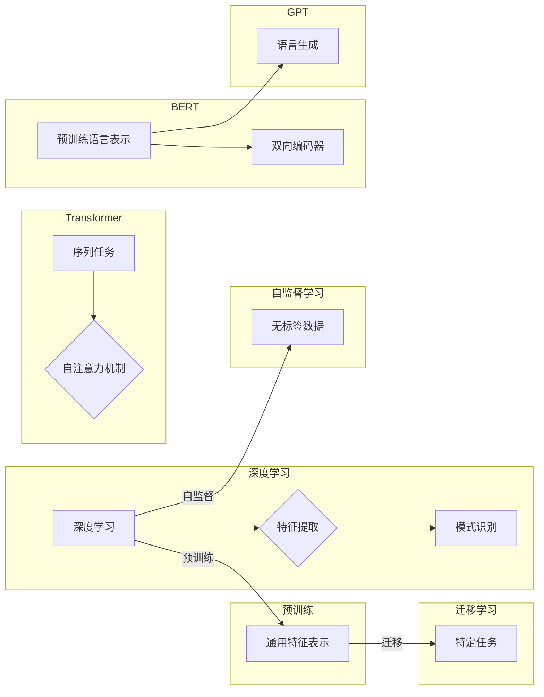

# 基础模型的现有模型研究

> 关键词：基础模型，深度学习，预训练，迁移学习，自监督学习，Transformer，BERT，GPT

## 1. 背景介绍

随着深度学习的快速发展，基础模型作为深度学习领域的基石，越来越受到学术界和工业界的关注。基础模型通过在大规模数据集上进行预训练，学习到通用的特征表示和知识，能够在不同的下游任务中实现高效的迁移学习。本文将深入探讨基础模型的现有模型，包括其原理、技术、应用和未来发展趋势。

## 2. 核心概念与联系

### 2.1 核心概念

#### 深度学习

深度学习是机器学习的一个重要分支，它通过构建具有多层非线性结构的神经网络，实现对复杂数据的自动特征提取和模式识别。

#### 预训练

预训练是指在大量无标签数据上对模型进行训练，使其学习到通用的特征表示和知识。预训练模型可以用于迁移学习，直接应用于特定任务的训练，从而提高模型在下游任务上的性能。

#### 迁移学习

迁移学习是一种利用源任务（预训练）学习到的知识来解决目标任务（下游任务）的学习方法。通过迁移学习，可以减少对目标任务的标注数据需求，提高模型在少量数据上的性能。

#### 自监督学习

自监督学习是一种无需人工标注数据的学习方法。自监督学习通过对数据中的潜在结构进行建模，学习到通用的特征表示和知识。

#### Transformer

Transformer是一种基于自注意力机制的深度神经网络模型，它突破了传统的循环神经网络在序列任务上的限制，并在多个自然语言处理任务中取得了显著的效果。

#### BERT

BERT（Bidirectional Encoder Representations from Transformers）是一种基于Transformer模型的预训练语言表示模型，它通过双向编码器学习到语言的上下文信息，并在多个NLP任务中取得了SOTA性能。

#### GPT

GPT（Generative Pre-trained Transformer）是一种基于Transformer模型的预训练语言生成模型，它能够生成连贯、自然的文本。

### 2.2 架构 Mermaid 流程图



## 3. 核心算法原理 & 具体操作步骤

### 3.1 算法原理概述

基础模型的核心原理是利用深度学习技术，在大规模数据集上进行预训练，学习到通用的特征表示和知识。具体而言，基础模型的训练过程可以分为以下步骤：

1. 数据预处理：对原始数据进行清洗、去噪、标准化等预处理操作。
2. 模型选择：选择合适的深度学习模型架构。
3. 预训练：使用大量无标签数据进行预训练，使模型学习到通用的特征表示和知识。
4. 迁移学习：使用少量标注数据对预训练模型进行微调，使其适应特定任务。

### 3.2 算法步骤详解

1. **数据预处理**：对原始数据进行清洗、去噪、标准化等预处理操作。预处理方法包括去除停用词、词干提取、词形还原等。
2. **模型选择**：选择合适的深度学习模型架构。常见的模型架构包括卷积神经网络（CNN）、循环神经网络（RNN）和Transformer等。
3. **预训练**：使用大量无标签数据进行预训练，使模型学习到通用的特征表示和知识。预训练方法包括自监督学习、对比学习等。
4. **迁移学习**：使用少量标注数据对预训练模型进行微调，使其适应特定任务。迁移学习方法包括模型蒸馏、知识蒸馏等。

### 3.3 算法优缺点

#### 优点

1. **高效性**：基础模型通过预训练学习到通用的特征表示和知识，可以显著提高模型在下游任务上的性能。
2. **泛化能力**：基础模型具有较强的泛化能力，能够在不同的任务和数据集上取得良好的效果。
3. **可迁移性**：基础模型可以轻松迁移到不同的任务和数据集，提高模型的可复用性。

#### 缺点

1. **计算成本**：基础模型通常需要大量的计算资源和存储空间。
2. **数据依赖**：基础模型的效果很大程度上取决于预训练数据的质量和数量。
3. **可解释性**：基础模型通常缺乏可解释性，难以理解其决策过程。

### 3.4 算法应用领域

基础模型在多个领域得到了广泛应用，包括：

1. 自然语言处理（NLP）：如文本分类、命名实体识别、机器翻译、文本摘要等。
2. 计算机视觉：如图像分类、目标检测、图像分割等。
3. 语音识别：如语音识别、语音合成等。
4. 强化学习：如游戏AI、机器人控制等。

## 4. 数学模型和公式 & 详细讲解 & 举例说明

### 4.1 数学模型构建

基础模型的数学模型通常包括以下部分：

1. **输入层**：将原始数据转换为模型可以处理的格式。
2. **隐藏层**：通过神经网络层进行特征提取和知识学习。
3. **输出层**：根据模型预测任务输出结果。

### 4.2 公式推导过程

以下以BERT模型为例，介绍其数学模型和公式推导过程。

BERT模型由两个主要部分组成：编码器和解码器。编码器负责将输入序列转换为固定长度的向量表示，解码器则根据编码器的输出序列生成预测结果。

#### 编码器

编码器由多个Transformer层组成，每个Transformer层包含多头自注意力机制和前馈神经网络。

- **多头自注意力机制**：

$$
\text{MultiHead}(Q, K, V) = \text{Concat}(\text{head}_1, \text{head}_2, ..., \text{head}_h)W^O
$$

其中，$Q, K, V$ 分别代表查询、键和值，$W^O$ 代表输出权重，$h$ 代表头数。

- **前馈神经网络**：

$$
\text{FFN}(x) = \text{ReLU}(W_{ff} \cdot \text{Dense}(W_1 \cdot x + b_1))
$$

其中，$W_1, b_1, W_{ff}, b_{ff}$ 分别代表权重和偏置。

#### 解码器

解码器同样由多个Transformer层组成，每个Transformer层包含多头自注意力机制、交叉注意力机制和前馈神经网络。

- **交叉注意力机制**：

$$
\text{ScaledDotProductAttention}(Q, K, V) = \text{softmax}(\frac{QK^T}{\sqrt{d_k}})V
$$

其中，$Q, K, V$ 分别代表查询、键和值，$d_k$ 代表键的维度。

- **解码器输出**：

$$
\text{Output} = \text{DecoderLayer}(X, \text{EncoderOut}) = \text{Norm}(X + \text{Attention}(X, \text{EncoderOut}, V) + \text{FFN}(X))
$$

其中，$X$ 代表输入序列，$\text{EncoderOut}$ 代表编码器输出，$V$ 代表解码器输出。

### 4.3 案例分析与讲解

以BERT模型在文本分类任务中的应用为例，介绍其具体操作步骤：

1. **数据预处理**：将原始文本数据清洗、去噪、标准化，并转换为BERT模型可处理的格式。
2. **模型加载**：加载预训练好的BERT模型。
3. **特征提取**：将预处理后的文本输入BERT模型，得到文本的向量表示。
4. **分类**：将特征向量输入分类器，得到文本的类别预测结果。

## 5. 项目实践：代码实例和详细解释说明

### 5.1 开发环境搭建

1. 安装Python环境。
2. 安装TensorFlow或PyTorch等深度学习框架。
3. 安装Transformers库。

### 5.2 源代码详细实现

以下是一个使用PyTorch和Transformers库进行文本分类任务的代码实例：

```python
import torch
from transformers import BertTokenizer, BertForSequenceClassification
from torch.utils.data import DataLoader, Dataset

# 数据集定义
class TextDataset(Dataset):
    def __init__(self, texts, labels, tokenizer, max_len=128):
        self.texts = texts
        self.labels = labels
        self.tokenizer = tokenizer
        self.max_len = max_len

    def __len__(self):
        return len(self.texts)

    def __getitem__(self, idx):
        text = self.texts[idx]
        label = self.labels[idx]
        encoding = self.tokenizer(text, padding=True, truncation=True, max_length=self.max_len)
        return {
            'input_ids': torch.tensor(encoding['input_ids']).unsqueeze(0),
            'attention_mask': torch.tensor(encoding['attention_mask']).unsqueeze(0),
            'labels': torch.tensor([label], dtype=torch.long)
        }

# 模型加载
model = BertForSequenceClassification.from_pretrained('bert-base-uncased')
tokenizer = BertTokenizer.from_pretrained('bert-base-uncased')

# 数据加载
dataset = TextDataset(texts, labels, tokenizer)
dataloader = DataLoader(dataset, batch_size=16, shuffle=True)

# 训练模型
optimizer = torch.optim.AdamW(model.parameters(), lr=2e-5)
criterion = torch.nn.CrossEntropyLoss()

for epoch in range(5):
    for batch in dataloader:
        input_ids, attention_mask, labels = [t.to(device) for t in batch]
        outputs = model(input_ids, attention_mask=attention_mask)
        loss = criterion(outputs.logits, labels)
        loss.backward()
        optimizer.step()
```

### 5.3 代码解读与分析

上述代码展示了使用PyTorch和Transformers库进行文本分类任务的基本步骤：

1. **数据集定义**：自定义数据集类，实现数据加载和预处理功能。
2. **模型加载**：加载预训练好的BERT模型和分词器。
3. **数据加载**：创建数据集实例和数据加载器。
4. **训练模型**：设置优化器、损失函数，并开始模型训练。

### 5.4 运行结果展示

在完成模型训练后，可以在测试集上评估模型性能：

```python
# 评估模型
model.eval()
with torch.no_grad():
    total_correct = 0
    total_samples = 0
    for batch in dataloader:
        input_ids, attention_mask, labels = [t.to(device) for t in batch]
        outputs = model(input_ids, attention_mask=attention_mask)
        _, predicted = torch.max(outputs.logits, 1)
        total_correct += (predicted == labels).sum().item()
        total_samples += labels.size(0)
    print(f"Accuracy: {total_correct / total_samples}")
```

## 6. 实际应用场景

### 6.1 文本分类

文本分类是自然语言处理中最常见的任务之一，如情感分析、主题分类、意图识别等。基础模型在文本分类任务上取得了显著的性能提升。

### 6.2 机器翻译

机器翻译是将一种语言的文本翻译成另一种语言的任务。基础模型在机器翻译任务上取得了突破性的进展，如BERT模型在WMT 2018英语-德语翻译任务上取得了SOTA性能。

### 6.3 问答系统

问答系统是一种能够回答用户问题的智能系统。基础模型在问答系统中的应用主要体现在自然语言理解（NLU）和自然语言生成（NLG）两个环节。

### 6.4 未来应用展望

随着基础模型的不断发展，其应用领域将更加广泛。以下是一些未来应用展望：

1. **医疗健康**：用于辅助诊断、药物研发、健康管理等领域。
2. **金融科技**：用于风险评估、信用评估、智能投顾等领域。
3. **智能教育**：用于个性化学习、智能辅导、自动批改作业等领域。
4. **智能制造**：用于工业自动化、智能工厂、产品质量检测等领域。

## 7. 工具和资源推荐

### 7.1 学习资源推荐

1. **《深度学习》**：Goodfellow等著，全面介绍了深度学习的理论基础、算法和应用。
2. **《动手学深度学习》**：花书，提供了丰富的实践案例和代码示例。
3. **《自然语言处理综论》**：Jurafsky等著，全面介绍了自然语言处理领域的知识和技术。

### 7.2 开发工具推荐

1. **TensorFlow**：Google开发的深度学习框架，功能强大，社区活跃。
2. **PyTorch**：Facebook开发的深度学习框架，易于上手，灵活高效。
3. **Hugging Face Transformers**：提供丰富的预训练模型和工具，方便开发者进行NLP任务开发。

### 7.3 相关论文推荐

1. **"Attention is All You Need"**：Vaswani等，提出了Transformer模型，开启了NLP领域的预训练大模型时代。
2. **"BERT: Pre-training of Deep Bidirectional Transformers for Language Understanding"**：Devlin等，提出了BERT模型，在多个NLP任务上取得了SOTA性能。
3. **"Generative Pre-trained Transformers"**：Radford等，提出了GPT模型，展示了大规模语言模型的强大能力。

## 8. 总结：未来发展趋势与挑战

### 8.1 研究成果总结

本文从基础模型的背景介绍、核心概念、算法原理、应用场景等方面进行了全面探讨，展示了基础模型在深度学习领域的巨大潜力和广泛应用前景。

### 8.2 未来发展趋势

1. **模型规模持续扩大**：随着计算资源和数据量的增长，基础模型的规模将不断增大，以适应更复杂的任务和数据。
2. **模型结构更加复杂**：为了提高模型的表达能力和泛化能力，模型结构将更加复杂，如多模态学习、多任务学习等。
3. **模型可解释性增强**：为了提高模型的可靠性和可信度，模型的可解释性将得到进一步研究和提升。
4. **模型部署更加高效**：为了降低模型部署成本，模型压缩、量化、加速等技术将得到广泛应用。

### 8.3 面临的挑战

1. **计算资源瓶颈**：大规模基础模型的训练和推理需要大量的计算资源和存储空间，如何降低计算成本和资源消耗是一个重要挑战。
2. **数据标注成本**：基础模型的训练需要大量无标签数据，如何高效地获取和标注数据是一个重要挑战。
3. **模型偏见和伦理问题**：基础模型可能学习到数据中的偏见，如何消除模型偏见和伦理问题是需要关注的重要问题。

### 8.4 研究展望

1. **多模态学习**：将文本、图像、音频等多模态信息融合到基础模型中，以更好地理解和处理复杂数据。
2. **少样本学习**：研究如何使基础模型在少量标注数据上取得更好的性能。
3. **可解释性学习**：研究如何提高基础模型的可解释性和可信度。

## 9. 附录：常见问题与解答

### 9.1 常见问题

**Q1：什么是基础模型？**

A1：基础模型是通过在大规模数据集上进行预训练，学习到通用的特征表示和知识，能够在不同的下游任务中实现高效的迁移学习的模型。

**Q2：基础模型有什么优势？**

A2：基础模型具有以下优势：
- 高效性：基础模型通过预训练学习到通用的特征表示和知识，可以显著提高模型在下游任务上的性能。
- 泛化能力：基础模型具有较强的泛化能力，能够在不同的任务和数据集上取得良好的效果。
- 可迁移性：基础模型可以轻松迁移到不同的任务和数据集，提高模型的可复用性。

**Q3：基础模型在哪些领域得到了应用？**

A3：基础模型在多个领域得到了广泛应用，包括自然语言处理、计算机视觉、语音识别、强化学习等。

### 9.2 解答

**A1**：基础模型是深度学习领域的一个重要分支，它通过在大规模数据集上进行预训练，学习到通用的特征表示和知识，能够在不同的下游任务中实现高效的迁移学习。

**A2**：基础模型的优势主要体现在以下几个方面：
- **高效性**：基础模型通过预训练学习到通用的特征表示和知识，可以显著提高模型在下游任务上的性能。预训练过程使得模型在处理新任务时，无需从头开始学习特征表示，从而节省了大量的训练时间和计算资源。
- **泛化能力**：基础模型具有较强的泛化能力，能够在不同的任务和数据集上取得良好的效果。这是由于基础模型在预训练过程中学习了大量的通用知识，能够更好地适应不同的任务和数据分布。
- **可迁移性**：基础模型可以轻松迁移到不同的任务和数据集，提高模型的可复用性。这意味着开发者可以不必针对每个新任务重新训练模型，而只需在少量标注数据上进行微调，从而大大降低了开发成本和难度。

**A3**：基础模型在多个领域得到了广泛应用，以下是一些典型的应用场景：
- **自然语言处理（NLP）**：如文本分类、命名实体识别、机器翻译、文本摘要等。基础模型在NLP领域取得了显著的突破，如BERT、GPT-3等模型在多个NLP任务上取得了SOTA性能。
- **计算机视觉**：如图像分类、目标检测、图像分割等。基础模型在计算机视觉领域也取得了显著的进展，如VGG、ResNet、EfficientNet等模型在图像分类任务上取得了优异的性能。
- **语音识别**：如语音识别、语音合成等。基础模型在语音识别领域也取得了显著的进展，如端到端语音识别模型、声学模型等。
- **强化学习**：如游戏AI、机器人控制等。基础模型在强化学习领域也取得了显著的进展，如深度确定性策略梯度（DDPG）、深度Q网络（DQN）等。

总之，基础模型是深度学习领域的一个重要分支，它通过预训练学习到通用的特征表示和知识，在多个领域取得了显著的进展和突破。未来，随着技术的不断发展，基础模型将在更多领域发挥重要作用，为人类社会带来更多的便利和进步。

作者：禅与计算机程序设计艺术 / Zen and the Art of Computer Programming