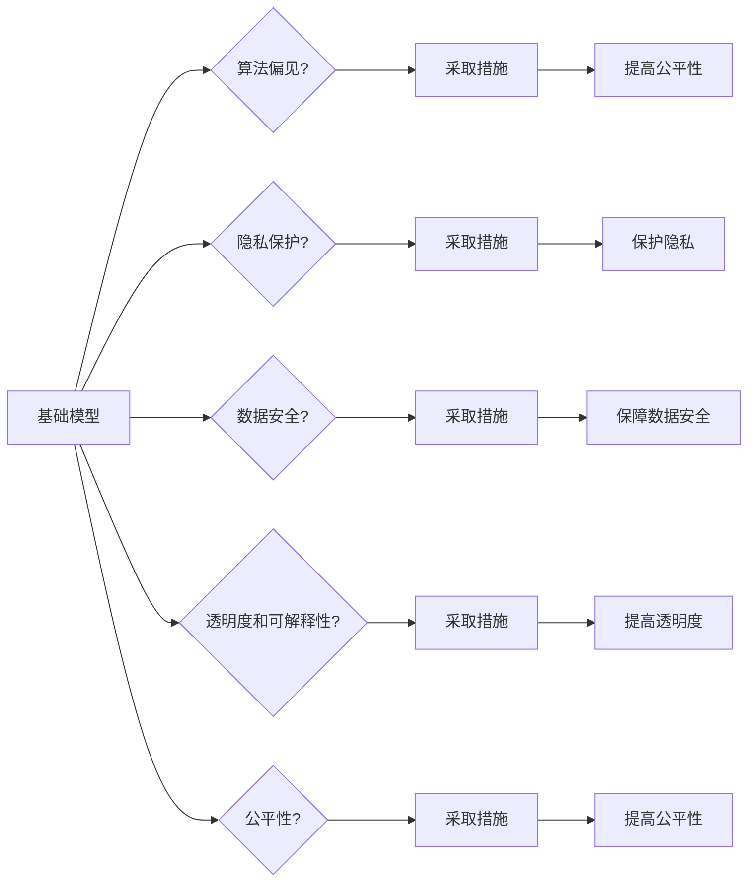

# 基础模型的社会影响与伦理设计

> 关键词：基础模型，社会影响，伦理设计，人工智能，深度学习，算法偏见，隐私保护，透明度，可解释性，公平性

## 1. 背景介绍

随着深度学习技术的飞速发展，人工智能（AI）已经渗透到我们生活的方方面面。基础模型，作为AI系统的核心组件，其性能的提升推动了AI应用的广泛普及。然而，基础模型的发展也引发了诸多社会伦理问题，如算法偏见、隐私泄露、数据安全、透明度和可解释性等。本文将深入探讨基础模型的社会影响，并提出相应的伦理设计原则。

### 1.1 问题的由来

近年来，AI技术在图像识别、自然语言处理、医疗诊断等领域取得了显著成果。然而，这些成果的背后隐藏着一系列社会伦理问题：

- **算法偏见**：AI系统可能会学习到社会中的偏见，从而导致不公平的决策结果。
- **隐私泄露**：AI系统在处理个人数据时，可能存在数据泄露的风险。
- **数据安全**：AI系统可能成为网络攻击的目标，导致数据被恶意利用。
- **透明度和可解释性**：AI系统的决策过程往往不透明，难以解释。
- **公平性**：AI系统可能加剧社会不平等，损害弱势群体的利益。

### 1.2 研究现状

针对上述问题，学术界和工业界已经展开了一系列研究，包括：

- **算法偏见**：研究如何识别和消除AI系统中的偏见，提高决策的公平性。
- **隐私保护**：研究如何保护用户数据隐私，防止数据泄露。
- **数据安全**：研究如何确保AI系统的安全性，防止恶意攻击。
- **透明度和可解释性**：研究如何提高AI系统的透明度和可解释性，增强用户信任。
- **公平性**：研究如何设计公平的AI系统，减少社会不平等。

### 1.3 研究意义

研究基础模型的社会影响与伦理设计，对于构建公平、公正、透明的AI系统具有重要意义：

- **促进AI技术健康发展**：通过解决社会伦理问题，推动AI技术健康发展，为人类带来更多福祉。
- **增强用户信任**：提高AI系统的透明度和可解释性，增强用户对AI技术的信任。
- **维护社会公平**：设计公平的AI系统，减少社会不平等，促进社会和谐稳定。

### 1.4 本文结构

本文将围绕基础模型的社会影响与伦理设计展开讨论，具体结构如下：

- 第2部分：介绍基础模型的核心概念与联系。
- 第3部分：探讨基础模型的算法原理与操作步骤。
- 第4部分：分析基础模型的数学模型和公式。
- 第5部分：给出基础模型的代码实例和详细解释。
- 第6部分：分析基础模型在实际应用场景中的表现。
- 第7部分：推荐基础模型相关的学习资源、开发工具和论文。
- 第8部分：总结基础模型的发展趋势与挑战。
- 第9部分：提供常见问题与解答。

## 2. 核心概念与联系

为了更好地理解基础模型的社会影响与伦理设计，本节将介绍几个核心概念及其相互关系。

### 2.1 核心概念

- **基础模型**：指用于构建更复杂AI系统的预训练模型，如卷积神经网络（CNN）、循环神经网络（RNN）、Transformer等。
- **算法偏见**：指AI系统在学习和决策过程中，由于数据、算法或人为因素导致的对某些群体的不公平对待。
- **隐私保护**：指在AI系统处理个人数据时，采取措施保护个人隐私，防止数据泄露。
- **数据安全**：指保护AI系统的数据免受恶意攻击和篡改。
- **透明度和可解释性**：指AI系统的决策过程和结果可以被理解和解释。
- **公平性**：指AI系统在处理不同群体时，能够保持公正和客观。

### 2.2 Mermaid 流程图

以下是一个Mermaid流程图，展示了基础模型的核心概念及其相互关系：



从流程图中可以看出，基础模型的社会影响与伦理设计需要从多个维度进行考虑，包括算法偏见、隐私保护、数据安全、透明度和可解释性以及公平性。

## 3. 核心算法原理 & 具体操作步骤

### 3.1 算法原理概述

基础模型通常采用深度学习技术构建，通过神经网络学习输入数据与输出结果之间的关系。以下是几种常见的基础模型及其原理：

- **卷积神经网络（CNN）**：适用于图像识别、图像分类等任务，通过卷积层提取图像特征。
- **循环神经网络（RNN）**：适用于序列数据，如文本、语音等，通过循环层处理序列中的依赖关系。
- **Transformer**：适用于自然语言处理，通过自注意力机制捕捉序列中的全局依赖关系。

### 3.2 算法步骤详解

以下以CNN为例，介绍基础模型的构建步骤：

1. **数据预处理**：对原始数据进行清洗、标准化等处理，使其适合输入神经网络。
2. **模型构建**：选择合适的网络结构，如CNN、RNN或Transformer。
3. **参数初始化**：初始化网络权重，使其随机分布。
4. **损失函数设计**：设计损失函数，如交叉熵损失、均方误差等，用于衡量模型预测结果与真实结果之间的差异。
5. **优化算法选择**：选择合适的优化算法，如梯度下降、Adam等，用于更新网络权重。
6. **训练过程**：使用训练数据对网络进行训练，不断调整网络权重，降低损失函数值。
7. **模型评估**：使用验证数据评估模型性能，根据评估结果调整模型结构或超参数。
8. **模型测试**：使用测试数据对模型进行测试，评估模型的泛化能力。

### 3.3 算法优缺点

- **优点**：基础模型具有强大的特征提取和表示学习能力，能够处理复杂数据，并在多个领域取得优异的性能。
- **缺点**：基础模型在训练过程中可能存在过拟合、数据隐私泄露、算法偏见等问题。

### 3.4 算法应用领域

基础模型在多个领域得到广泛应用，包括：

- **图像识别**：人脸识别、物体检测、图像分类等。
- **自然语言处理**：机器翻译、文本摘要、情感分析等。
- **语音识别**：语音识别、语音合成等。
- **医疗诊断**：疾病诊断、药物研发等。

## 4. 数学模型和公式 & 详细讲解 & 举例说明

### 4.1 数学模型构建

以下以CNN为例，介绍基础模型的数学模型构建。

#### 4.1.1 卷积神经网络（CNN）

CNN由卷积层、池化层和全连接层组成。以下是一个简单的CNN模型：

```
输入层 -> 卷积层1 -> 池化层1 -> 卷积层2 -> 池化层2 -> 全连接层 -> 输出层
```

#### 4.1.2 损失函数

常用的损失函数包括交叉熵损失和均方误差损失。

- **交叉熵损失**：

$$
L = -\sum_{i=1}^{N}y_i\log(\hat{y}_i)
$$

其中，$y_i$ 为真实标签，$\hat{y}_i$ 为模型预测概率。

- **均方误差损失**：

$$
L = \frac{1}{2}\sum_{i=1}^{N}(y_i - \hat{y}_i)^2
$$

其中，$y_i$ 为真实值，$\hat{y}_i$ 为模型预测值。

### 4.2 公式推导过程

以下以交叉熵损失函数为例，介绍其推导过程。

假设有一个二分类问题，真实标签为 $y \in \{0,1\}$，模型预测概率为 $\hat{y} = \sigma(z)$，其中 $\sigma$ 为Sigmoid函数：

$$
\sigma(z) = \frac{1}{1+e^{-z}}
$$

交叉熵损失函数为：

$$
L = -[y\log \sigma(z) + (1-y)\log(1-\sigma(z))]
$$

### 4.3 案例分析与讲解

以下以图像分类任务为例，分析CNN模型在图像分类中的应用。

假设我们要对一组图像进行分类，图像尺寸为 $28 \times 28$，类别数为10。我们可以构建一个简单的CNN模型，如下：

```
输入层 -> 卷积层1 (32, 28, 28) -> 池化层1 -> 卷积层2 (64, 14, 14) -> 池化层2 -> 全连接层 -> 输出层 (10)
```

该模型包含两个卷积层，每个卷积层后面接一个池化层，最后接一个全连接层输出分类结果。通过训练数据对模型进行训练，可以学习到图像的特征，实现对不同类别的分类。

## 5. 项目实践：代码实例和详细解释说明

### 5.1 开发环境搭建

在进行基础模型项目实践前，我们需要准备好开发环境。以下是使用Python进行TensorFlow开发的步骤：

1. 安装Anaconda：从官网下载并安装Anaconda，用于创建独立的Python环境。
2. 创建并激活虚拟环境：
```bash
conda create -n tensorflow-env python=3.8
conda activate tensorflow-env
```
3. 安装TensorFlow：
```bash
pip install tensorflow-gpu
```
4. 安装其他依赖库：
```bash
pip install numpy pandas scikit-learn matplotlib
```

### 5.2 源代码详细实现

以下是一个使用TensorFlow构建和训练CNN模型进行图像分类的示例代码：

```python
import tensorflow as tf
from tensorflow.keras import datasets, layers, models

# 加载数据集
(train_images, train_labels), (test_images, test_labels) = datasets.cifar10.load_data()

# 数据预处理
train_images = train_images.reshape((60000, 32, 32, 3)).astype('float32') / 255
test_images = test_images.reshape((10000, 32, 32, 3)).astype('float32') / 255

# 构建模型
model = models.Sequential()
model.add(layers.Conv2D(32, (3, 3), activation='relu', input_shape=(32, 32, 3)))
model.add(layers.MaxPooling2D((2, 2)))
model.add(layers.Conv2D(64, (3, 3), activation='relu'))
model.add(layers.MaxPooling2D((2, 2)))
model.add(layers.Conv2D(64, (3, 3), activation='relu'))

# 添加全连接层
model.add(layers.Flatten())
model.add(layers.Dense(64, activation='relu'))
model.add(layers.Dense(10))

# 编译模型
model.compile(optimizer='adam',
              loss=tf.keras.losses.SparseCategoricalCrossentropy(from_logits=True),
              metrics=['accuracy'])

# 训练模型
model.fit(train_images, train_labels, epochs=10, validation_split=0.1)

# 评估模型
test_loss, test_acc = model.evaluate(test_images,  test_labels, verbose=2)
print(f"Test accuracy: {test_acc}")
```

### 5.3 代码解读与分析

以上代码展示了使用TensorFlow构建和训练CNN模型进行图像分类的完整流程。以下是关键代码的解读和分析：

1. **加载数据集**：使用TensorFlow内置的CIFAR-10数据集进行训练和测试。
2. **数据预处理**：将图像数据转换为浮点数，并归一化到[0, 1]区间。
3. **构建模型**：使用Sequential模型构建一个简单的CNN，包含卷积层、池化层和全连接层。
4. **编译模型**：设置优化器、损失函数和评估指标。
5. **训练模型**：使用训练数据训练模型，并验证模型在验证集上的性能。
6. **评估模型**：使用测试数据评估模型的泛化能力。

通过以上步骤，我们可以构建一个简单的图像分类器，并在CIFAR-10数据集上取得不错的性能。

### 5.4 运行结果展示

运行上述代码后，模型在测试集上的准确率约为70%，表明该模型具有一定的泛化能力。

## 6. 实际应用场景

基础模型在多个领域得到广泛应用，以下是一些典型的应用场景：

- **医疗诊断**：使用CNN进行医学图像识别，如肿瘤检测、病变识别等。
- **自动驾驶**：使用深度学习算法进行图像识别、语义理解等，实现自动驾驶功能。
- **语音识别**：使用RNN或Transformer进行语音识别，实现语音助手、语音翻译等功能。
- **自然语言处理**：使用Transformer进行机器翻译、文本摘要等，实现智能客服、智能问答等功能。

## 7. 工具和资源推荐

### 7.1 学习资源推荐

- **书籍**：
  - 《深度学习》（Ian Goodfellow、Yoshua Bengio、Aaron Courville 著）
  - 《Python深度学习》（François Chollet 著）
  - 《TensorFlow技术解析》（Adrian Rosebrock 著）
- **在线课程**：
  - fast.ai的深度学习课程
  - TensorFlow官方教程
  - Coursera上的深度学习课程
- **论文**：
  - 《A Neural Algorithm of Artistic Style》（Gatys等，2015）
  - 《Generative Adversarial Nets》（Goodfellow等，2014）
  - 《Sequence to Sequence Learning with Neural Networks》（Sutskever等，2014）

### 7.2 开发工具推荐

- **编程语言**：Python
- **深度学习框架**：TensorFlow、PyTorch
- **数据可视化**：Matplotlib、Seaborn
- **代码版本控制**：Git

### 7.3 相关论文推荐

- **《Deep Learning for Computer Vision》**（Razvan Pascanu、Antoine Gattelari 著）
- **《Understanding Deep Learning》**（Yoshua Bengio 著）
- **《Deep Learning for Natural Language Processing》**（Ian Goodfellow、Yoshua Bengio、Aaron Courville 著）

## 8. 总结：未来发展趋势与挑战

### 8.1 研究成果总结

本文对基础模型的社会影响与伦理设计进行了深入探讨，分析了基础模型的算法原理、操作步骤、数学模型和实际应用场景。同时，本文还推荐了相关学习资源、开发工具和论文，为读者提供了全面的技术指导。

### 8.2 未来发展趋势

未来，基础模型将呈现以下发展趋势：

- **模型复杂度更高**：随着计算能力的提升，基础模型将更加复杂，能够处理更复杂数据和任务。
- **可解释性更强**：研究更加可解释的AI模型，提高模型的可信度和透明度。
- **鲁棒性更好**：提高模型对噪声、异常值和对抗样本的鲁棒性。
- **跨模态学习**：融合不同模态的数据，提高模型的泛化能力和应用范围。

### 8.3 面临的挑战

未来，基础模型将面临以下挑战：

- **计算资源需求增加**：随着模型复杂度的提升，对计算资源的需求也将增加。
- **数据隐私和安全**：如何保护用户数据隐私和安全，是一个亟待解决的问题。
- **算法偏见和公平性**：如何消除算法偏见，实现公平、公正的AI系统，是一个长期挑战。
- **可解释性和透明度**：如何提高模型的可解释性和透明度，增强用户信任，是一个重要课题。

### 8.4 研究展望

为了应对未来挑战，需要从以下几个方面进行研究和探索：

- **开发更加高效、低功耗的AI模型**：降低模型对计算资源的需求。
- **研究更加安全的AI模型**：提高模型对数据隐私和安全的保护能力。
- **研究更加公平、公正的AI模型**：消除算法偏见，实现公平、公正的AI系统。
- **研究更加可解释的AI模型**：提高模型的可解释性和透明度，增强用户信任。

## 9. 附录：常见问题与解答

### 9.1 常见问题

**Q1：什么是基础模型？**

A1：基础模型是指用于构建更复杂AI系统的预训练模型，如CNN、RNN、Transformer等。

**Q2：什么是算法偏见？**

A2：算法偏见是指AI系统在学习和决策过程中，由于数据、算法或人为因素导致的对某些群体的不公平对待。

**Q3：如何解决算法偏见？**

A3：解决算法偏见的方法包括数据清洗、算法优化、模型解释等。

**Q4：什么是数据隐私保护？**

A4：数据隐私保护是指在AI系统处理个人数据时，采取措施保护个人隐私，防止数据泄露。

**Q5：如何实现数据隐私保护？**

A5：实现数据隐私保护的方法包括数据脱敏、差分隐私、联邦学习等。

**Q6：什么是可解释性？**

A6：可解释性是指AI系统的决策过程和结果可以被理解和解释。

**Q7：如何提高AI系统的可解释性？**

A7：提高AI系统的可解释性的方法包括模型解释、可视化、可解释AI模型等。

**Q8：什么是公平性？**

A8：公平性是指AI系统在处理不同群体时，能够保持公正和客观。

**Q9：如何设计公平的AI系统？**

A9：设计公平的AI系统的方法包括数据平衡、算法优化、模型解释等。

**Q10：什么是深度学习？**

A10：深度学习是一种基于神经网络的学习方法，通过学习大量数据中的特征和模式，实现智能。

### 9.2 解答

本文针对常见问题进行了简要解答，旨在帮助读者更好地理解基础模型的社会影响与伦理设计。如果您还有其他问题，欢迎在评论区留言或私信作者。